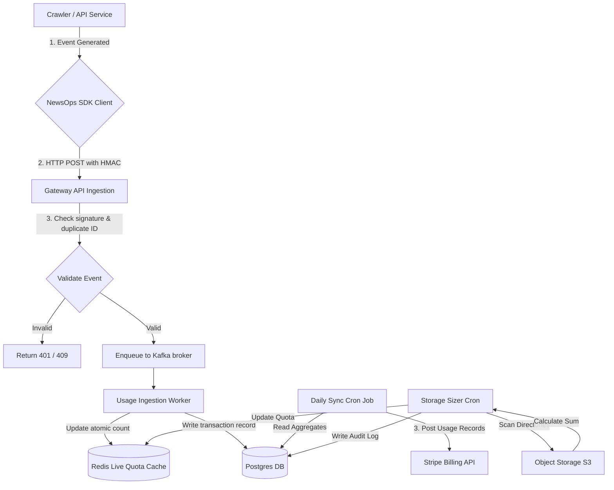

# Usage Metering
## Purpose
This document specifies the technical architecture, data structures, background worker routines, and third-party integrations for the NewsOps Cloud resource metering and usage-based billing platform. It describes how the system monitors API transactions, web scraper crawls, and media storage sizes to enforce tier boundaries and sync billing data with Stripe.

## Executive Summary
NewsOps Cloud operates on a hybrid subscription-and-usage billing model. This document details the metering collectors that count API usage, verify crawl limits, calculate media storage allocations, and generate warning alerts at critical thresholds. It includes the SDK interfaces used by internal microservices to log usage, details database schemas, defines daily synchronization schedules with Stripe's metered billing engine, and outlines error handling protocols.

## Vision
To establish a high-throughput, transactional, and resilient metering engine that accurately tracks tenant consumption without adding latency to the request lifecycle. By offering transparent usage data and preemptive alerts, we foster user trust and prevent billing disputes.

## Scope
The scope of this design document includes:
- **API Counting Middleware**: Gateway-level tracking of REST and GraphQL operations.
- **Crawl Volume Gating**: Real-time checking of web scraper resources consumed.
- **Storage Sizing Checkers**: Cron-driven AWS S3/Object Storage directory sum checkers.
- **Credit & Quota Alerts**: Push notifications and emails dispatched at 80% and 100% of limits.
- **Stripe Billing Sync Integration**: Automated cron workers posting metrics to Stripe's Usage Records API.
- **Internal SDK Interfaces**: Shared developer libraries for posting usage metrics.

## Goals
1. Process metering events with less than 2ms API gateway middleware overhead.
2. support event tracking scales up to 10,000 requests per second (TPS) globally.
3. Eliminate duplicate billing counts by employing idempotent event ID resolution.
4. Ensure billing data synchronization completes daily with zero missed transactions.

## Functional Requirements
- **Dynamic Limit Interception**:
  - The API Gateway must check Redis for current quota capacity before routing requests.
  - The Gateway must update Redis usage counts atomically using `INCRBY` commands.
- **Storage Audit Worker**:
  - A background process must run every 6 hours to query object storage (S3) namespaces, summing active file sizes per organization.
  - The calculated size must update the tenant's storage quota consumption database row.
- **Alert Dispatch Engine**:
  - The system must trigger internal alerts when usage metrics cross 80% and 100% of defined plan limits.
  - The alerting module must dispatch webhook and email events to organization admins.
- **Usage Sync Task**:
  - A cron job must gather accumulated usage records from PostgreSQL and push them to Stripe daily.

## Non-Functional Requirements
- **Fault Tolerance**: A Redis queue must buffer metering events during PostgreSQL database downtime. Up to 48 hours of log buffering must be supported.
- **Accuracy**: The discrepancy between real physical usage and Stripe-recorded usage must be 0%.
- **Security**: The internal metering reporting endpoints must require signed HMAC credentials.
- **Scalability**: Usage data must be partitioned by month to prevent query degradation over time.

## Business Rules
1. **Plan Matrix Boundaries**:
   - **Free Plan**: 100 crawls/month, 1 GB storage, 10,000 AI tokens/month. Hard-capped. If limits are reached, the platform blocks matching operations immediately.
   - **Pro Plan**: 5,000 crawls/month, 50 GB storage, 500,000 AI tokens/month. Soft-capped. Consumption above limits triggers automated overage billing.
   - **Enterprise Plan**: Custom limits. Soft-capped. Custom overrides apply.
2. **Overage Rates**:
   - Web Crawls: $0.05 per crawl.
   - Storage: $0.20 per GB.
   - AI Tokens: $0.15 per 10,000 tokens.
3. **Cycle Resets**: Usage counters are cleared on the organization's subscription billing cycle anchor day at 00:00:00 UTC.
4. **Late Reporting Threshold**: Events received older than the current billing cycle + 24 hours are discarded or attributed to the active cycle to avoid retro-billing conflicts.

## Actors
- **Gateway Limit Middleware**: Gatekeeper monitoring inbound routes and matching them against Redis counters.
- **Crawler Worker Service**: System executing web scrapes and reporting completed counts.
- **Storage Audit Daemon**: Nightly cron task measuring S3 bucket contents.
- **Stripe Synchronizer Engine**: System syncing totals to Stripe's payment backend.
- **Organization Administrator**: Person managing subscriptions, receiving alert warnings, and paying overages.

## User Stories
### Story 1: Soft-Limit Overage Billing
As a **Pro Team Administrator**, I want our web scraper to continue executing crawls even after we cross our 5,000 monthly limit, so that our news feed does not stop importing articles, and I am willing to pay the $0.05 per-crawl overage charge.

### Story 2: Receiving Usage Warnings
As a **Pro Team Administrator**, I want to receive an email notification when our organization's storage usage reaches 80% of our 50 GB limit, so that I can delete obsolete assets or prepare for storage expansion costs.

### Story 3: Hard-Limit Blocking
As a **Free Tier Publisher**, I want the platform to block any attempt to upload media once my total file size hits 1 GB, showing me a clean upgrade page so that I do not accidentally incur unexpected costs.

## Acceptance Criteria
1. **Strict Free Tier Gates**: A Free user attempting to execute a 101st crawl must be rejected immediately by the Gateway with an HTTP `403 Forbidden` and error code `HARD_LIMIT_EXCEEDED`.
2. **Alert Trigger Latency**: Within 5 minutes of a Redis usage counter passing the 80% mark, the notification microservice must emit an email alert payload to the email sender queue.
3. **Stripe Sync Execution**: The billing sync script must aggregate and transmit the exact usage to Stripe, matching Stripe transaction ledger logs down to the cent.
4. **S3 Size Audit Completion**: The Storage Audit Daemon must calculate bucket size, update `tenant_storage_aggregates`, and release locks within 120 seconds for an organization with 1,000,000 objects.

## Workflows
### 1. Resource Consumption & Verification Workflow
```
[Client Request]
   |
   +--> [API Gateway Middleware]
           |
           |-- 1. Look up cache key: limits:{org_id} and usage:{org_id}:{month}
           v
   [Redis Quota Store]
           |-- 2. Evaluates remaining quota
           |-- 3. If under limit:
           |      |-- Atomic Increment (INCRBY) usage counter
           |      |-- Return ALLOW
           |-- 4. If over limit:
                  |-- If Free Plan: Return BLOCK (HTTP 403)
                  |-- If Pro Plan: Atomic Increment, Return ALLOW (marked as Overage)
           v
   [Worker / Pipeline Execution]
           |-- 5. Complete task
           |-- 6. Enqueue transaction event to Kafka (topic: resource-usage-events)
```

### 2. S3 Storage Sizing Audit
```
[Cron Trigger (Every 6 hrs)]
   |
   v
[Storage Audit Daemon]
   |-- 1. Fetch active organizations
   |-- 2. Parallel scan organization folder prefixes in S3 (e.g. s3://newsops-assets/org-123/)
   |-- 3. Sum byte sizes of all objects
   |-- 4. Write total size to PostgreSQL tenant_storage_aggregates
   |-- 5. Compare total against organization storage limit
   |-- 6. If storage > 80% limit:
          |-- Trigger alerting event (raise billing_alerts record, email Admin)
```

## API Design

### 1. Record Usage Event (Internal Microservices)
Post resource consumption units from internal systems to the metering ledger.
- **Endpoint**: `POST /api/v1/internal/metering/events`
- **Headers**:
  - `X-NewsOps-HMAC-Signature`: Cryptographic signature verifying internal origin.
  - `Content-Type`: application/json
- **Request Payload**:
  ```json
  {
    "event_id": "evt_991823ab-7c8d-9e0f-1a2b-3c4d5e6f7a8b",
    "organization_id": "org_4410294-a",
    "resource_type": "WEB_CRAWLS",
    "quantity": 1,
    "timestamp": "2026-06-27T22:35:57Z",
    "idempotency_key": "crawl_task_9918290-x"
  }
  ```
- **Response Payload (`202 Accepted`)**:
  ```json
  {
    "event_id": "evt_991823ab-7c8d-9e0f-1a2b-3c4d5e6f7a8b",
    "status": "QUEUED"
  }
  ```

### 2. Retrieve Organization Quota Status
Get live balances, limits, and current overage statuses.
- **Endpoint**: `GET /api/v1/organizations/{org_id}/metering/status`
- **Headers**:
  - `Authorization: Bearer <JWT>`
- **Response Payload (`200 OK`)**:
  ```json
  {
    "organization_id": "org_4410294-a",
    "billing_period_start": "2026-06-01T00:00:00Z",
    "billing_period_end": "2026-06-30T23:59:59Z",
    "quotas": {
      "web_crawls": {
        "allocated": 5000,
        "consumed": 5120,
        "overage": 120,
        "overage_charge_usd": 6.00,
        "hard_limit": false
      },
      "storage_bytes": {
        "allocated": 53687091200,
        "consumed": 42949672960,
        "overage": 0,
        "overage_charge_usd": 0.00,
        "hard_limit": false
      },
      "ai_tokens": {
        "allocated": 500000,
        "consumed": 401820,
        "overage": 0,
        "overage_charge_usd": 0.00,
        "hard_limit": false
      }
    }
  }
  ```

### 3. Stripe Reconcile Override (Admin Only)
Manually force synchronization of usage metrics to Stripe for a specific organization.
- **Endpoint**: `POST /api/v1/admin/billing/reconcile`
- **Headers**:
  - `Authorization: Bearer <JWT>`
- **Request Payload**:
  ```json
  {
    "organization_id": "org_4410294-a",
    "force_sync_all": true,
    "reason": "Billing adjustment resolution for tickets #1094"
  }
  ```
- **Response Payload (`200 OK`)**:
  ```json
  {
    "organization_id": "org_4410294-a",
    "sync_records_processed": 3,
    "stripe_invoice_items": [
      {
        "stripe_subscription_item_id": "si_Jk238f9asj",
        "resource": "WEB_CRAWLS",
        "units_reported": 120
      }
    ],
    "completed_at": "2026-06-27T22:36:00Z"
  }
  ```

## SDK Interfaces (Internal Python SDK)
Internal services report resource consumption using the NewsOps Metering Client.

```python
import os
import time
import hmac
import hashlib
import requests
import uuid

class NewsOpsMeteringClient:
    def __init__(self, api_url=None, shared_secret=None):
        self.api_url = api_url or os.getenv("NEWSOPS_METERING_API_URL")
        self.shared_secret = shared_secret or os.getenv("NEWSOPS_METERING_SECRET")

    def _generate_signature(self, payload: bytes) -> str:
        return hmac.new(
            self.shared_secret.encode('utf-8'),
            payload,
            hashlib.sha256
        ).hexdigest()

    def record_usage(self, organization_id: str, resource_type: str, quantity: int, idempotency_key: str = None) -> bool:
        """
        Record resource usage to the central SaaS metering collection service.
        """
        event_id = f"evt_{uuid.uuid4()}"
        payload = {
            "event_id": event_id,
            "organization_id": organization_id,
            "resource_type": resource_type,
            "quantity": quantity,
            "timestamp": time.strftime("%Y-%m-%dT%H:%M:%SZ", time.gmtime()),
            "idempotency_key": idempotency_key or f"sdk_{event_id}"
        }
        
        json_data = requests.utils.default_headers()
        import json
        serialized = json.dumps(payload).encode('utf-8')
        
        headers = {
            "Content-Type": "application/json",
            "X-NewsOps-HMAC-Signature": self._generate_signature(serialized)
        }
        
        try:
            response = requests.post(
                f"{self.api_url}/api/v1/internal/metering/events",
                data=serialized,
                headers=headers,
                timeout=3.0
            )
            return response.status_code == 202
        except requests.RequestException as e:
            # Fallback to local warning logging
            print(f"[METRIC_ERROR] Failed to post resource event {event_id}: {str(e)}")
            return False

# Usage Example:
# client = NewsOpsMeteringClient("http://metering-service.internal", "my-super-secret-key")
# client.record_usage("org_4410294-a", "WEB_CRAWLS", 1, "crawl_job_xyz123")
```

## Database Design
```sql
-- Track metrics limits per subscription plan
CREATE TABLE plan_billing_configurations (
    id UUID PRIMARY KEY DEFAULT gen_random_uuid(),
    plan_name VARCHAR(50) UNIQUE NOT NULL, -- FREE, PRO, ENTERPRISE
    stripe_product_id VARCHAR(255) NOT NULL,
    max_crawls_included INT NOT NULL,
    max_storage_bytes_included BIGINT NOT NULL,
    max_ai_tokens_included INT NOT NULL,
    overage_crawl_rate NUMERIC(10, 4) NOT NULL, -- $0.05
    overage_storage_gb_rate NUMERIC(10, 4) NOT NULL, -- $0.20
    overage_ai_token_10k_rate NUMERIC(10, 4) NOT NULL, -- $0.15
    created_at TIMESTAMP WITH TIME ZONE DEFAULT CURRENT_TIMESTAMP
);

-- Store current live aggregates of tenant usage
CREATE TABLE tenant_usage_aggregates (
    id UUID PRIMARY KEY DEFAULT gen_random_uuid(),
    organization_id UUID NOT NULL,
    billing_period_start TIMESTAMP WITH TIME ZONE NOT NULL,
    billing_period_end TIMESTAMP WITH TIME ZONE NOT NULL,
    crawls_count INT NOT NULL DEFAULT 0,
    storage_bytes BIGINT NOT NULL DEFAULT 0,
    ai_tokens_count INT NOT NULL DEFAULT 0,
    stripe_subscription_item_crawls VARCHAR(255),
    stripe_subscription_item_storage VARCHAR(255),
    stripe_subscription_item_tokens VARCHAR(255),
    updated_at TIMESTAMP WITH TIME ZONE DEFAULT CURRENT_TIMESTAMP,
    UNIQUE(organization_id, billing_period_start)
);

CREATE INDEX idx_usage_aggregates_org ON tenant_usage_aggregates(organization_id, billing_period_start);

-- Track alert events dispatched to avoid duplicate alerts
CREATE TABLE billing_alerts (
    id UUID PRIMARY KEY DEFAULT gen_random_uuid(),
    organization_id UUID NOT NULL,
    billing_period_start TIMESTAMP WITH TIME ZONE NOT NULL,
    resource_type VARCHAR(50) NOT NULL, -- WEB_CRAWLS, STORAGE_BYTES, AI_TOKENS
    threshold_percentage INT NOT NULL, -- 80, 100
    alerted_at TIMESTAMP WITH TIME ZONE DEFAULT CURRENT_TIMESTAMP,
    notification_channel VARCHAR(50) NOT NULL, -- EMAIL, APP_BANNER
    UNIQUE(organization_id, billing_period_start, resource_type, threshold_percentage)
);

-- Audit log of synchronization processes with Stripe
CREATE TABLE stripe_sync_logs (
    id UUID PRIMARY KEY DEFAULT gen_random_uuid(),
    organization_id UUID NOT NULL,
    sync_date DATE NOT NULL,
    resource_type VARCHAR(50) NOT NULL,
    units_synced BIGINT NOT NULL,
    stripe_usage_record_id VARCHAR(255),
    status VARCHAR(50) NOT NULL, -- SUCCESS, FAILED
    error_message TEXT,
    created_at TIMESTAMP WITH TIME ZONE DEFAULT CURRENT_TIMESTAMP
);

CREATE INDEX idx_stripe_sync_org ON stripe_sync_logs(organization_id, sync_date);
```

## UI Design
The administration dashboard presents clean metrics tools:
1. **Resource Meters Widget**:
   - Displays radial or horizontal progress bars showing current usage vs limit (e.g. 4,120 / 5,000 Crawls).
   - Warning colors highlight items as they reach thresholds: Orange at 80% and Red at 100%.
   - Clicking a resource opens an details drawer breaking down usage by individual sub-projects or services.
2. **Billing Alerts Settings Panel**:
   - Offers checkboxes to choose whether alerts are dispatched via email, mobile SMS, or Slack webhooks.
   - Provides a numerical input to customize the default warning threshold values (e.g., alert me at 75% instead of 80%).

## Permissions
- `metering:read`: View usage details, progress meters, and historical logs.
- `metering:write`: Allow services to push usage updates.
- `billing:admin`: Access Stripe billing logs and trigger manual reconciliation runs.

## Security
- **HMAC Authentication**: Internal reporting endpoints verify request body authenticity using SHA-256 HMAC headers computed with a shared secret key rotated monthly.
- **Idempotency Keys**: The database enforces uniqueness on `idempotency_key` indexes to prevent duplicate events from double-charging clients during network retry events.
- **Tenant Scope Enforcement**: The Gateway checks that the `organization_id` in the API payload matches the authenticated workspace header.

## Performance
- **Atomic Counters**: Live quotas are tracked in a Redis cluster using `HINCRBY` keys formatted as `org:{org_id}:usage:{month}`.
- **Local Batch buffering**: Crawl and API metrics are queued in a high-speed broker (Kafka) and flushed to the PostgreSQL aggregates in batches of 100 rows, reducing write IOPS.
- **Cache TTL**: Quota cache counts are cached in Redis with a TTL matching the remainder of the active billing cycle.

## Monitoring
### Prometheus Metrics
- `newsops_metering_events_received_total`: Counter tracking inbound logs labeled by `resource_type`.
- `newsops_metering_verification_latency_seconds`: Histogram measuring gateway check response durations.
- `newsops_stripe_sync_failures_total`: Counter tracking API failures during Stripe sync cron runs.
- `newsops_storage_audit_duration_seconds`: Histogram measuring execution speed of storage sum scans.

### Alerting Rules
- **StripeSyncFailure**: Alert if `newsops_stripe_sync_failures_total` increases by > 1 in a 24-hour window.
- **RedisQuotaCacheLatency**: Alert if Redis quota check duration exceeds 5ms for more than 5 consecutive minutes.

## Logging
- **Log Format**: Structured JSON.
- **Log Levels**:
  - `INFO`: Quota check passed, usage synchronizer success, storage audit complete.
  - `WARN`: Usage alerts triggered at 80% and 100%, rate limiter overrides.
  - `ERROR`: Write failures to SQL ledger, Stripe connection timeouts.
- **Log Context**: Includes `organization_id`, `resource_type`, `quantity`, `redis_used_value`, and `stripe_error_code`.

## Error Handling
| Input/System Error Code | HTTP Status | Customer-Facing Message |
| :--- | :--- | :--- |
| `HARD_LIMIT_EXCEEDED` | 403 Forbidden | "You have exceeded your monthly limit for this resource. Please upgrade your subscription tier." |
| `IDEMPOTENCY_DUPLICATE` | 409 Conflict | "This request transaction identifier was already processed." |
| `STRIPE_API_UNAVAILABLE` | 503 Service Unavailable | "Billing synchronizer could not reach the payment provider. Retrying transaction later." |
| `STORAGE_AUDIT_TIMEOUT` | 504 Gateway Timeout | "The storage directory size scan timed out. Storage sizes will refresh shortly." |

## Edge Cases
- **Stripe Rate Limit Exhaustion**: When syncing metrics to Stripe daily, the system can hit Stripe's API rate limits (100 requests/sec). Mitigation: The billing sync engine implements token-bucket rate limiting with backoff, processing in batches of 50 subscription items.
- **Server Shutdown During In-Memory Buffering**: If a metering node crashes, any events held in RAM buffer could be lost. Mitigation: Use local journal-backed file streams (e.g., systemd-journald or local SQLite cache) to restore state before flushing.
- **Race Condition on Quota Decr**: During concurrent crawl tasks, multiple workers check Redis at the same millisecond. Utilizing Redis Lua scripts guarantees atomic checks and decrements:
  ```lua
  local current = redis.call('get', KEYS[1])
  if current and tonumber(current) >= tonumber(ARGV[1]) then
      return 0 -- Blocked
  else
      redis.call('incrby', KEYS[1], ARGV[2])
      return 1 -- Allowed
  end
  ```

## Future Improvements
1. **Real-time Cost Estimator**: Render live, dollar-amount estimates of accumulated overages directly within the customer's portal dashboard.
2. **ClickHouse Analytical Store**: Migrate analytical storage aggregates to ClickHouse to enable sub-second billing audits on historical logs.
3. **Smart Scaling Auto-Upgrades**: Proactively offer automatic seat allocation purchases when team size requests scale past plan allowances.

## Mermaid Diagrams


## References
- SaaS Tenant Tiering Limits: [../01-business/tenant_tiering_model.md](../01-business/tenant_tiering_model.md)
- Billing and Subscriptions Schema: [../03-database/billing_and_subscriptions_schema.md](../03-database/billing_and_subscriptions_schema.md)
- Tenant Lifecycle Controls: [../08-saas/tenant_lifecycle.md](../08-saas/tenant_lifecycle.md)
- System Core Architecture: [../02-architecture/system_architecture.md](../02-architecture/system_architecture.md)
