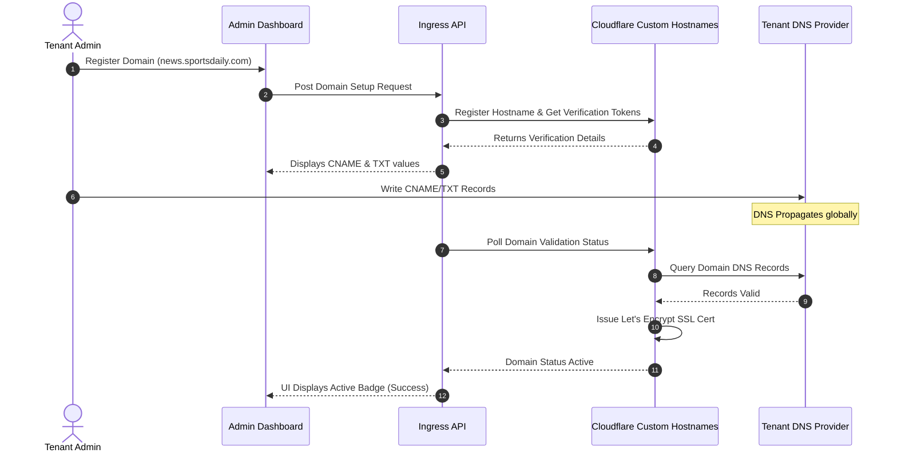

# White-Labeling Engine

## Purpose
This document specifies the design, architecture, and deployment procedures for the NewsOps Cloud White-Labeling Engine. It details custom domain routing via Cloudflare's Custom Hostnames API (SSL for SaaS), dynamic branding asset injection, and isolated tenant email configurations utilizing custom SPF, DKIM, and DMARC parameters.

## Executive Summary
The NewsOps Cloud White-Labeling Engine enables tenant publishers to fully brand their websites, administrative dashboards, and outbound communication systems. The system manages automated SSL provisioning and CNAME routing at the network edge through Cloudflare integrations. It supports dynamic injection of brand identities (logos, favicons, metadata) and automates sender verification parameters (SPF/DKIM/DMARC) for outbound email delivery via third-party mail engines (SES, Mailgun, or SendGrid).

## Vision
To provide a completely transparent hosting and delivery platform. Under the long-term vision, tenants can deploy customized applications under their own domains, routing traffic globally with zero indication of underlying platform architecture while maintaining maximum deliverability, security, and rendering speed.

## Scope
This document covers:
- Custom domain provisioning, CNAME configurations, and SSL certificate lifecycles via Cloudflare.
- Brand configuration assets injection (custom logos, favicons, meta tags, and site icons).
- Tenant-level outbound email configuration using SPF/DKIM/DMARC records.
- Integration patterns for custom SMTP and transaction mail relays (e.g., SendGrid, Mailgun).

It does not cover theme customization options detailed in [theme_engine.md](./theme_engine.md) or platform-wide subscription billings under [marketplace.md](./marketplace.md).

## Goals
- **Automated SSL Certificates**: Provision secure SSL certificates automatically for custom domains within 10 minutes of CNAME setup.
- **High Outbound Deliverability**: Ensure that customer newsletter and transaction emails achieve high deliverability by enforcing strict DKIM and SPF checks.
- **Edge Routing Performance**: Resolve tenant configurations from hostnames in $< 5\text{ ms}$ using distributed Redis/Cloudflare KV lookups.
- **Consistent Branding**: Keep white-label metadata injected across all user endpoints (web pages, dashboards, RSS feeds, email footers).

## Functional Requirements
- **Cloudflare Hostname Provisioning**: The platform must interface with the Cloudflare API to register customer domains under the platform's custom SSL for SaaS fallback origin.
- **DNS Record Verifier**: The system must provide users with validation details (CNAME targets and TXT validation records) and periodically verify DNS status.
- **DKIM & SPF Configurator**: The system must generate DKIM keys (1024/2048-bit) and SPF target structures, showing them to tenants to insert in their DNS registries.
- **Outbound Email Bridge**: The email delivery worker must dynamically load the tenant's DKIM signing certificates and mail API credentials before sending outbound newsletters or system notifications.

## Non-Functional Requirements
- **Domain Verification SLA**: The Cloudflare SSL provisioning must verify and activate custom domains within $< 10\text{ minutes}$ of proper CNAME DNS records being published by the tenant.
- **Email DKIM Signature Overhead**: Injecting tenant-specific DKIM signatures and headers on outbound transactions must add $< 5\text{ ms}$ to email queue processing.
- **Ingress Cache Duration**: Hostname-to-Tenant lookup configurations must be cached globally, allowing requests to resolve at the edge cache layer with $\ge 99\%$ hit ratios.

## Business Rules
- **Prohibited Hostnames**: Custom domains must not match systemic platform domains (e.g., `admin.newsops.cloud`, `api.newsops.cloud`).
- **Required SSL**: The ingress gateway must enforce HTTPS redirection and drop any custom domains attempting to connect via unencrypted HTTP.
- **DKIM Validation Enforcement**: Outbound emails from a tenant domain must not be processed if DKIM records are not fully validated by the system DNS scanner to prevent domain spoofing blocks.

## Actors
- **Tenant Domain Administrator**: Configures DNS values, uploads brand graphics, and validates email settings.
- **Reader Audience**: Visits the publication through the custom white-labeled domain and receives branded newsletters.
- **Edge Ingress Gateway**: Intercepts requests, resolves hostnames to tenant contexts, and serves correct resources.

## User Stories
- **User Story 1**: As a Tenant Administrator, I want to map my publication domain `www.chronicle-news.com` to the platform so that my readers access the site without seeing the `newsops.cloud` domain.
- **User Story 2**: As a Tenant Administrator, I want to configure custom DKIM and SPF keys in my DNS manager so that newsletters sent to our 50,000 subscribers are signed with our domain and do not land in spam folders.
- **User Story 3**: As a Reader, I want to navigate the site, view logos, and download favicons matching the brand identity of `Chronicle News` so that I have a consistent, trusted experience.

## Acceptance Criteria
- CNAME records must point to the target `fallback.newsops.cloud` to pass gateway routing authorization checks.
- When an outbound email is triggered, the mail engine must sign the message with the tenant's validated DKIM private key and configure the `Sender` header to match the tenant domain.
- If DNS verification queries fail, the system must display status flags (`dns_invalid`, `ssl_pending`, or `active`) inside the administrative dashboard.

## Workflows
### Custom Domain Routing and Setup Lifecycle
1. **Domain Request**: Tenant enters `news.sportsdaily.com` in their administrator dashboard.
2. **Gateway Registration**: The NewsOps backend calls the Cloudflare Custom Hostname API to register the domain under the zone.
3. **DNS Display**: The system displays the target CNAME details (`fallback.newsops.cloud`) and a verification TXT record.
4. **DNS Setup**: The tenant creates the CNAME and TXT records in their domain registrar.
5. **Validation Loop**: A background Cron job checks DNS verification. Cloudflare detects the records and provisions a Let's Encrypt SSL certificate.
6. **Activation**: The domain status changes to `active` in the database, and the cache registry maps `news.sportsdaily.com` to `tenant_sports_daily`.
7. **Request Routing**: When a user visits the site, the Edge Router matches the hostname, binds the tenant context, and loads the dynamic brand settings.

## API Design
### White-Label Domain and Email Config API

#### 1. Add Custom Domain
* **URL**: `/api/v1/whitelabel/domains`
* **Method**: `POST`
* **Headers**:
  * `Authorization: Bearer <TENANT_JWT>`
* **Request Payload**:
```json
{
  "hostname": "news.sportsdaily.com"
}
```
* **Response Payload (201 Created)**:
```json
{
  "domainId": "d9b2c9d0-1234-abcd-ef01-23456789abcd",
  "hostname": "news.sportsdaily.com",
  "cnameTarget": "fallback.newsops.cloud",
  "txtVerificationName": "_cf-custom-hostname.news.sportsdaily.com",
  "txtVerificationValue": "verification-token-982312-abc",
  "status": "pending_dns"
}
```

#### 2. Get Email Deliverability Settings
* **URL**: `/api/v1/whitelabel/email`
* **Method**: `GET`
* **Headers**:
  * `Authorization: Bearer <TENANT_JWT>`
* **Response Payload (200 OK)**:
```json
{
  "senderDomain": "sportsdaily.com",
  "status": "partial_verification",
  "spf": {
    "requiredRecord": "v=spf1 include:mailgun.newsops.cloud ~all",
    "status": "valid"
  },
  "dkim": {
    "selector": "newsops",
    "publicKey": "k=rsa; p=MIIBIjANBgkqhkiG9w0BAQEFAAOCAQ8AMIIBCgKCAQEA0...",
    "status": "invalid"
  }
}
```

#### 3. Update Branding Details
* **URL**: `/api/v1/whitelabel/branding`
* **Method**: `PUT`
* **Headers**:
  * `Authorization: Bearer <TENANT_JWT>`
* **Request Payload**:
```json
{
  "siteTitle": "Sports Daily Chronicle",
  "metaDescription": "Leading source for athletic reviews.",
  "logoUrl": "https://cdn.sportsdaily.com/assets/logo.png",
  "faviconUrl": "https://cdn.sportsdaily.com/assets/favicon.ico",
  "supportEmail": "support@sportsdaily.com"
}
```
* **Response Payload (200 OK)**:
```json
{
  "status": "success",
  "updatedAt": "2026-06-27T22:35:00Z"
}
```

## Database Design
These tables run in the tenant-isolated schema space, except `tenant_domains` which resides in the administrative public database:

### Admin Schema
#### Table: `tenant_domains`
| Field Name | Data Type | Constraints | Description |
|:---|:---|:---|:---|
| `domain_id` | UUID | PRIMARY KEY, DEFAULT gen_random_uuid() | Unique ID of domain |
| `tenant_id` | VARCHAR(64) | NOT NULL, FK to tenants | Tenant workspace linkage |
| `hostname` | VARCHAR(255) | UNIQUE, NOT NULL | Fully qualified domain name |
| `cloudflare_id` | VARCHAR(128) | NULL | Reference to Cloudflare Custom Hostname |
| `status` | VARCHAR(32) | DEFAULT 'pending_dns' | `pending_dns`, `validating`, `active`, `failed` |
| `created_at` | TIMESTAMP | DEFAULT NOW() | Record creation date |

### Tenant Isolated Schema
#### Table: `whitelabel_branding`
| Field Name | Data Type | Constraints | Description |
|:---|:---|:---|:---|
| `id` | SERIAL | PRIMARY KEY | Serial key |
| `site_title` | VARCHAR(255) | NOT NULL | Branding title header |
| `meta_description` | VARCHAR(512) | NULL | SEO base meta string |
| `logo_url` | VARCHAR(512) | NOT NULL | Static path to brand logo |
| `favicon_url` | VARCHAR(512) | NOT NULL | Static path to favicon |
| `support_email` | VARCHAR(255) | NOT NULL | Customer support recipient email |
| `updated_at` | TIMESTAMP | DEFAULT NOW() | Update tracker |

#### Table: `whitelabel_email_configs`
| Field Name | Data Type | Constraints | Description |
|:---|:---|:---|:---|
| `id` | SERIAL | PRIMARY KEY | Serial key |
| `sender_domain` | VARCHAR(255) | UNIQUE, NOT NULL | Domain configured to send emails |
| `dkim_selector` | VARCHAR(64) | DEFAULT 'newsops' | Hostname DNS selector |
| `dkim_private_key` | TEXT | NOT NULL | RSA Private key for email signatures |
| `dkim_public_key` | TEXT | NOT NULL | Public key exposed in DNS |
| `spf_verified` | BOOLEAN | DEFAULT FALSE | SPF status verification tracker |
| `dkim_verified` | BOOLEAN | DEFAULT FALSE | DKIM status verification tracker |
| `provider_type` | VARCHAR(32) | DEFAULT 'ses' | Outbound relay (`ses`, `mailgun`, `smtp`) |
| `provider_credentials`| JSONB | NULL | Encrypted API keys or credentials |

Indexes:
- `idx_domains_hostname`: (`hostname`)
- `idx_email_verified_status`: (`sender_domain`, `dkim_verified`)

## UI Design
The Domain and Brand Customization Dashboard features:
- **Domain Configuration List**: Shows input fields to add hostnames, status check indicators, and instruction cards showing the exact CNAME/TXT configurations to write in the DNS registrar.
- **DNS Health Check Console**: Renders color-coded status badges for SPF, DKIM, and DMARC setups, with a manual "Validate Records" button.
- **Branding Assets Panel**: Standard form fields where administrators upload logos, edit SEO descriptions, specify contact metadata, and preview search engine result simulations.

## Permissions
- `domains:write`: Add, delete, or verify custom hostnames.
- `emails:configure`: Manage SPF/DKIM details and third-party mailer credentials.
- `branding:write`: Update site metadata configurations, logos, and favicons.
- `branding:read`: Read branding context for application runtime.

## Security
- **Domain Validation Enforcement**: The Cloudflare SSL system utilizes HTTP/DNS verification tokens, ensuring that domain ownership is validated before certificate issuance.
- **Credential Encryption**: Custom email provider credentials (SMTP passwords, API keys) must be stored in the database encrypted via AES-256-GCM, with keys managed in AWS KMS.
- **Host Header Injection Defense**: Ingress gateways only forward requests matching hostnames registered in the admin `tenant_domains` database, rejecting random host headers with `400 Bad Request`.

## Performance
- **Dynamic Hostname Lookups**: Resolved routing configs are stored in Redis using a key structure like `hostname:news.sportsdaily.com` -> `tenant_sports_daily`. Lookups execute in $< 1\text{ ms}$.
- **Certificates Renewal caching**: The edge router updates certificate lifecycles asynchronously to prevent delays or packet drops for visitors.
- **Throughput target**: The domain ingress routing layer must sustain up to $50,000$ concurrent connections.

## Monitoring
- **Prometheus Metric**: `whitelabel_domain_resolutions_total` (Counter tracking ingress requests per custom domain).
- **Prometheus Metric**: `whitelabel_ssl_provision_time_seconds` (Histogram tracking DNS verification and SSL setup latency).
- **Alert Trigger**: Trigger Slack warning notifications if `rate(whitelabel_domain_resolutions_total{status="failed"}[5m]) > 10`.

## Logging
Outbound email and domain routing events are logged:
* **Log Pattern**: `{"timestamp": "%ISO8601%", "tenant_id": "%TENANT%", "hostname": "%HOST%", "event": "DOMAIN_RESOLUTION", "status": "%STATUS%"}`
* **Error Level**: `WARNING` for DNS lookup timeouts or SSL certificate verification failures.

## Error Handling
| Internal Routing Error | HTTP Status | Customer-Facing Action |
|:---|:---|:---|
| `DomainNotVerifiedException` | 400 Bad Request | DNS CNAME configuration not detected. Please verify DNS records. |
| `SSLLifecyleException` | 502 Bad Gateway | Cloudflare SSL certificate provision failed. Retrying. |
| `DKIMSigningException` | 500 Internal Error | Outbound newsletter failed. DKIM verification credentials invalid. |

## Edge Cases
- **Stale DNS Cache**: If a tenant moves their DNS CNAME records away from the platform, the ingress proxy continues to receive requests. The gateway detects the routing path validation error and serves a generic "Site Under Maintenance" page instead of a security exception.
- **Let's Encrypt Rate Limits**: If a tenant registers multiple subdomains concurrently, the system bundles registrations into wildcards to prevent triggering rate limits.

## Future Improvements
- **Autonomous DMARC Reporting**: Build an internal analyzer that processes incoming DMARC XML reports, displaying deliverability warnings directly inside the tenant administration panel.
- **Static Edge Site Compiling**: Deploy site branding metadata configurations directly to CDN edge configurations (e.g., Cloudflare Workers KV) so that page title headers compile closer to readers.

## Mermaid Diagrams
### Domain Verification & SSL Routing Sequence


## References
- Multi-Tenancy Architecture: [multi_tenancy_architecture.md](../02-architecture/multi_tenancy_architecture.md)
- Dynamic Theme Engine: [theme_engine.md](./theme_engine.md)
- Platform Deployment Map: [system_architecture.md](../02-architecture/system_architecture.md)
