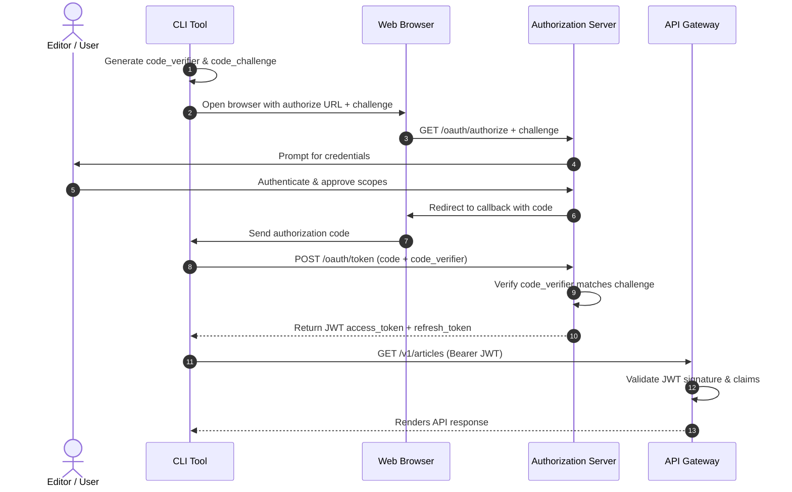

# API Authentication Methods

## Purpose
This document specifies the authentication models, validation logic, key rotation protocols, and authorization flows of the NewsOps Cloud digital publishing platform. It details how external integrations, developer tools, and user clients authenticate and operate securely within a multi-tenant framework.

## Executive Summary
The NewsOps Cloud platform secures its APIs using OIDC-compliant protocols. It implements:
*   **Dynamic Bearer Tokens**: Short-lived JSON Web Tokens (JWT) for user and CLI sessions.
*   **OAuth2 Authorization Code Flow with PKCE**: For user-facing clients (CLI and Web dashboard).
*   **Static API Keys with Scope Restrictions**: Hashed API keys (with the prefix `nop_key_`) for headless service integrations.
*   **Cryptographic Key Rotation (JWKS)**: Automated asymmetric key pairs (RS256) rotation every 90 days with a 24-hour transition window.
*   **Gateway-Level Cache**: Storing validated keys in Redis to reduce database lookup overheads.

## Vision
To establish a zero-trust network perimeter where all requests are cryptographically validated at the API Gateway within microseconds, ensuring that tenant isolation is maintained across all systems.

## Scope
The scope of this document covers:
*   JWT structure, fields, and claims.
*   The JWKS (JSON Web Key Set) rotation schedule and verification rules.
*   OAuth2 token acquisition, refresh, and revocation endpoints.
*   API key validation, scope constraints, and hashing models.

Out of Scope:
*   Direct password hashing methods (delegated to the internal Identity Provider).
*   Federated Active Directory/SAML directory synchronization setups.

## Goals
*   **Minimal Verification Overhead**: The API Gateway must validate JWT signatures in $< 1\text{ ms}$ using local cache structures.
*   **Zero Downtime During Rotation**: Rotate cryptographic key pairs without terminating existing active sessions.
*   **Granular Privilege Control**: Limit client integrations to specific resource namespaces using precise OAuth scopes.
*   **Defense in Depth**: Prevent token reuse attacks using token revocation databases and strict IP/origin constraints.

## Functional Requirements
1.  **JWT Validation**: The API Gateway must parse incoming `Authorization: Bearer <JWT>` headers and validate signatures using the published JWKS keys.
2.  **OAuth2 Compliance**: Implement token issue (`/oauth/token`), authorization (`/oauth/authorize`), and revocation (`/oauth/revoke`) endpoints.
3.  **PKCE Enforcement**: Require Proof Key for Code Exchange (PKCE) for all authorization code requests from public client tools (such as the CLI).
4.  **Static API Key Hashing**: Issue API keys securely once; subsequent gateway validations must evaluate SHA-256 hashes stored in the tenant database.
5.  **Graceful Key Transitions**: The verification engine must support multiple active keys listed in the JWKS to ensure smooth key rotation.

## Non-Functional Requirements
1.  **Asymmetric Cryptography**: All JWT signatures must use the RS256 algorithm with a minimum key size of 2048 bits.
2.  **Verification Throughput**: The gateway authentication filter must process up to $10,000$ concurrent validation operations per second.
3.  **Token Lifespans**:
    *   Access Tokens: 15 minutes.
    *   Refresh Tokens: 30 days.
    *   API Keys: Optional expiry (user-defined), default 1 year.

## Business Rules
1.  **Prefix Enforcement**: API keys must start with the prefix `nop_key_` (e.g., `nop_key_live_abc123...`) to allow immediate categorization by security scanners.
2.  **Organization Context Isolation**: Access tokens must include the `tenant_id` claim, restricting the client's scope to that tenant's database schema.
3.  **Revocation Action**: Once a refresh token or API key is revoked, the change must update the global Redis blacklist database within $500\text{ ms}$.

## Actors
*   **Developer / Operator**: Generates and manages API keys to run scripts or integrations.
*   **End User (Editor / Admin)**: Logs into dashboard portals, authenticating via OAuth2 code workflows.
*   **API Gateway**: Inspects headers, validates JWT structures, and enforces scope rules.
*   **Identity Service**: Issues tokens, signs JWT entities, and rotates keys.

## User Stories (At least 3 specific stories)
*   **User Story 1 - Secure CLI Login**: As an Editor, I want to run `newsops login` on my machine and authenticate using my web browser via an OAuth2 PKCE flow so that my login password is not stored on my local filesystem.
*   **User Story 2 - Headless Integration**: As a DevOps Engineer, I want to issue an API key with the scope `deployments:create` so that my GitHub Actions runner can trigger deployments without user interaction.
*   **User Story 3 - Key Rotation Grace Period**: As a Platform Administrator, I want the system to rotate signing keys automatically so that old sessions remain valid during the 24-hour transition period, preventing unexpected user logouts.

## Acceptance Criteria (At least 3-5 criteria with clear thresholds)
1.  Access tokens must expire exactly $900$ seconds (15 minutes) after issuance.
2.  The gateway must reject any JWT that lacks a valid signature, a `tenant_id` claim, or has expired (`exp` claim is in the past).
3.  Static API keys must never be saved in plaintext on database volumes; attempts to read client keys from tables must return only the SHA-256 hash representation.
4.  JWKS endpoints must respond with `Cache-Control: public, max-age=86400` to allow client caching of the public keys.

## Workflows (Step-by-step description of system and user interactions)
### OAuth2 Authorization Code Flow with PKCE
1.  **Initiation**: The CLI triggers the local browser to load the login page: `/oauth/authorize?client_id=cli&code_challenge=xyz...`.
2.  **User Authentication**: The user enters their credentials.
3.  **Authorization Code Issuance**: The auth server generates a short-lived authorization code and redirects the browser back to the CLI callback route (`http://localhost:12345/callback?code=abc`).
4.  **Token Exchange**: The CLI sends a request to the `/oauth/token` endpoint containing the code and the original code verifier.
5.  **Signature Generation**: The identity provider validates the verifier, creates a new access token, signs it using the current private signing key, and returns the token payload to the CLI.

### JWKS Key Rotation Workflow
1.  **Rotation Event**: An automated cron schedule triggers every 90 days: `newsops-auth-key-rotator`.
2.  **Key Pair Creation**: The identity service generates a new RSA-2048 key pair (Key B).
3.  **JWKS Update**: The service updates the database, publishing the public details of Key B to the JWKS endpoint, alongside the existing Key A.
4.  **Primary Key Promotion**: Key B is marked as the primary key and is used to sign all new tokens.
5.  **Grace Period**: Key A remains active for verification purposes for 24 hours.
6.  **Deprecation**: After 24 hours, Key A is removed from the active JWKS list, invalidating any tokens signed with Key A.

## API Design

### 1. Token Issue Endpoint (OAuth2)
Used to exchange authorization codes or refresh tokens.
*   **Endpoint**: `POST /oauth/token`
*   **Request Payload**:
    ```json
    {
      "grant_type": "authorization_code",
      "client_id": "newsops-cli-go",
      "code": "auth_code_982b1c",
      "redirect_uri": "http://127.0.0.1:4500/callback",
      "code_verifier": "dBjftJeZ4CVP-mB92K27uhbUJU1p1r_wW1gFWFOEjXk"
    }
    ```
*   **Response Payload**:
    ```json
    {
      "access_token": "nop_jwt_eyJhbGciOiJSUzI1NiIsInR5cCI6IkpXVCIsImtpZCI6ImtleV9hXzIwMjYifQ.eyJzdWIiOiJ1c3ItOTgyMSIsInRlbmFudF9pZCI6InRlbl84ODIzIiwic2NvcGVzIjpbImFydGljbGVzOndyaXRlIl0sImV4cCI6MTc4MjczMDQwMCwiaXNzIjoiaHR0cHM6Ly9hdXRoLm5ld3NvcHMuY2xvdWQiLCJhdWQiOiJodHRwczovL2FwaS5uZXdzb3BzLmNsb3VkIn0.xyz...",
      "refresh_token": "nop_ref_982a1c...",
      "token_type": "Bearer",
      "expires_in": 900
    }
    ```

### 2. JWKS Public Verification Keys
Exposes the keys used to verify token signatures.
*   **Endpoint**: `GET /.well-known/jwks.json`
*   **Response Payload**:
    ```json
    {
      "keys": [
        {
          "kty": "RSA",
          "use": "sig",
          "alg": "RS256",
          "kid": "key_a_2026",
          "n": "u1W_a3X...[truncated RSA modulus]",
          "e": "AQAB"
        },
        {
          "kty": "RSA",
          "use": "sig",
          "alg": "RS256",
          "kid": "key_b_2026",
          "n": "v8Y_z4Z...[truncated RSA modulus]",
          "e": "AQAB"
        }
      ]
    }
    ```

## Database Design
Authentication records, dynamic scopes, and key histories are maintained in the following schema.

### Table: `signing_keys`
Stores the asymmetric key pairs used for signing JWTs.
| Field Name | Data Type | Constraints | Description |
|:---|:---|:---|:---|
| `key_id` | VARCHAR(64) | PRIMARY KEY | Unique key identifier (`kid`) |
| `private_key_pem` | TEXT | NOT NULL | Encrypted private key block |
| `public_key_pem` | TEXT | NOT NULL | Plaintext public key block |
| `status` | VARCHAR(32) | NOT NULL | `primary`, `active_grace`, `retired` |
| `created_at` | TIMESTAMP | DEFAULT NOW() | Key pair generation timestamp |
| `retired_at` | TIMESTAMP | NULLABLE | Deprecation timestamp |

### Table: `token_blacklist`
Stores revoked tokens to prevent replay attacks.
| Field Name | Data Type | Constraints | Description |
|:---|:---|:---|:---|
| `token_hash` | VARCHAR(64) | PRIMARY KEY | SHA-256 hash of the revoked token |
| `expires_at` | TIMESTAMP | NOT NULL | Expiration timestamp of the token |
| `revoked_at` | TIMESTAMP | DEFAULT NOW() | Revocation timestamp |

Indexes:
*   `idx_signing_keys_status`: B-tree index on `status` to retrieve the current signing key.
*   `idx_token_blacklist_expiry`: Index on `expires_at` for automatic cleanup sweeps.

## UI Design
The Admin Dashboard includes a dedicated "API Access" panel:
*   **API Keys Section**:
    *   A list of existing keys showing the key name, prefix, scopes, creation date, and last used IP.
    *   A "Create API Key" button that opens a modal:
        *   Input fields for Key Name, Expiration Date, and Scope check boxes.
        *   Displays the newly generated key *only once* in a copyable text box, warning the user that it cannot be retrieved again.
*   **Authorized Applications (OAuth)**:
    *   Lists registered integrations (e.g., "NewsOps CLI") with options to revoke access tokens or adjust redirect URI parameters.

## Permissions
The RBAC permission structures for managing authentication credentials:
*   `apikeys:create`: Generate a static access key for a tenant workspace.
*   `apikeys:revoke`: Revoke an active API key, updating the blacklist.
*   `apikeys:read`: List metadata of active API keys (hashes are never returned).
*   `oauth:register`: Register a new client application with redirect URIs.

## Security
*   **JWT Claims Validation**: The gateway must check the following claims on every request:
    1.  `iss`: Issuer must match `https://auth.newsops.cloud`.
    2.  `aud`: Audience must match `https://api.newsops.cloud`.
    3.  `exp`: Expiration time must be in the future.
    4.  `nbf`: Not-before time must be in the past.
*   **CSRF Protection**: All browser-based authorization flows must include a unique, cryptographically random `state` parameter to prevent Cross-Site Request Forgery (CSRF).
*   **API Key Hashing**: Key hashes must use salted SHA-256. The hash is verified at the database level: `SELECT key_id FROM client_api_keys WHERE key_hash = crypt(input_key, salt) AND is_active = true`.

## Performance
*   **Local JWKS Caching**: The API Gateway retrieves public keys from `/well-known/jwks.json` and caches them in memory. The gateway only re-fetches keys if a request specifies a `kid` that is missing from the cache.
*   **Blacklist Caching**: The gateway checks the revocation status of tokens against a local Redis cluster using the token's signature hash. This check completes in $< 0.5\text{ ms}$.

## Monitoring
*   `auth_token_issuances_total`: Counter tracking the number of tokens issued, grouped by grant type.
*   `auth_token_failures_total`: Counter tracking authentication failures, grouped by failure reason (`expired`, `invalid_signature`, `missing_scope`).
*   `auth_key_rotation_latency_seconds`: Gauge tracking the time taken to complete a key rotation workflow.

## Logging
*   **Token Issuance Log**: `{"timestamp": "%ISO8601%", "event": "token_issued", "tenant_id": "%TENANT%", "user_id": "%USER%", "client_id": "%CLIENT%"}`
*   **Authentication Failure Log**: `{"timestamp": "%ISO8601%", "event": "auth_failed", "reason": "expired_jwt", "client_ip": "%IP%", "kid": "%KID%"}`
*   **Key Rotation Warning**: Logged at `WARN` level if key rotations do not complete within the scheduled timeframe.

## Error Handling
| Authentication Error | HTTP Status | Auth Error Code | User-Facing Action |
|:---|:---|:---|:---|
| Missing Authorization Header | 401 | `MISSING_TOKEN` | Add a valid `Authorization: Bearer <token>` header to the request. |
| Expired Access Token | 401 | `TOKEN_EXPIRED` | Request a new access token using your refresh token. |
| Invalid Signature | 401 | `INVALID_SIGNATURE` | Verify the token signature against the active JWKS. |
| Insufficient Scopes | 403 | `INSUFFICIENT_SCOPES` | Request additional scopes from your tenant administrator. |
| Invalid API Key | 401 | `INVALID_API_KEY` | Verify the API key value and prefix. |

## Edge Cases
*   **Redis Downtime**: If the Redis cache containing the token blacklist goes offline, the gateway falls back to querying the database directly. If the database is also unreachable, the gateway rejects all requests containing dynamic tokens to maintain a secure posture.
*   **Replay Attacks with Expired Codes**: Authorization codes can only be used once. If a code is presented to the `/oauth/token` endpoint multiple times, the auth server immediately invalidates all access tokens issued from that code.

## Future Improvements
*   **Mutual TLS (mTLS)**: Implement mutual TLS for server-to-server integrations to remove the reliance on static API keys.
*   **Decentralized Identifiers (DIDs)**: Transition to decentralized identifiers to support federated authentication models with zero central dependencies.

## Mermaid Diagrams
### OAuth2 Authorization Code Flow with PKCE


## References
*   Python SDK Architecture: [sdk_python.md](./sdk_python.md)
*   Command Line Interface Tool: [cli_specification.md](./cli_specification.md)
*   OpenAPI Specifications Manifest: [openapi_manifest.md](./openapi_manifest.md)
