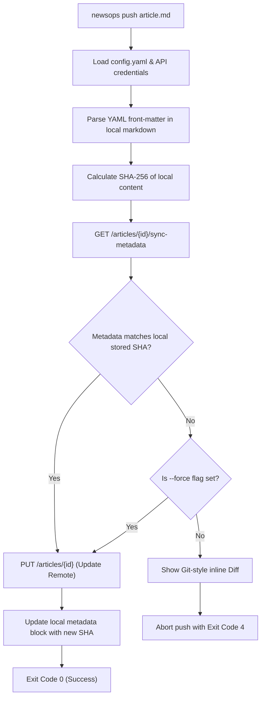

# Command Line Interface (CLI) Specification

## Purpose
This document specifies the command structures, configuration files, output layouts, and operational workflows of the NewsOps Cloud Command Line Interface (CLI) tool (`newsops`). The CLI acts as the local operational bridge for developers, editors, and site reliability engineers managing digital publishing configurations, drafts synchronization, and infrastructure deployments.

## Executive Summary
The NewsOps Cloud CLI is a compiled, cross-platform terminal utility (built in Go for instant execution speed) distributed to developers and operators. It interfaces with the NewsOps API Gateway using secure connection pooling and handles tasks including authentication, local draft editing synchronization, remote service deployment triggers, and container log tailing. Key design considerations focus on POSIX conformity, shell compatibility, and machine-readable output options for script integration.

## Vision
To build a command-line developer environment that integrates into native editing workflows (e.g., writing drafts in Vim/VSCode, pushing to NewsOps with a single command) and CI/CD pipelines, making UI interactions completely optional for professional publishers.

## Scope
The scope of this document covers:
*   Local configuration directories and file schemas.
*   CLI command grammar, arguments, flags, and subcommands.
*   Standard output layout specifications (human-readable tables vs. JSON pipelines).
*   State machine workflows for two-way synchronization of articles.
*   Security mechanisms for local credential storage.

Out of Scope:
*   Frontend component design of the web dashboard.
*   Detailed packaging steps for native OS packaging managers (e.g., Homebrew, Chocolatey, APT).

## Goals
*   **Minimal Startup Overhead**: Execution of basic commands (e.g., `newsops --version`) must complete within $50\text{ ms}$.
*   **Scriptability**: Every subcommand must support a `--format=json` flag to enable seamless pipes into `jq`, `awk`, or custom scripts.
*   **Robust Sync Handling**: Prevent accidental data losses during syncs via strict cryptographic hashing check steps.
*   **Security compliance**: Secure storage of secrets using OS-native keychains where available, with fallback to permission-locked YAML config files.

## Functional Requirements
1.  **Authentication Integration**: Securely log in using browser-based OAuth2 code flows or direct input of static API keys.
2.  **Config Resolution**: Read global configurations from standard locations depending on the OS, allowing environment variables (`NEWSOPS_CONFIG`) to override defaults.
3.  **Local Article Sync**:
    *   `newsops pull`: Retrieve remote database articles and write them locally as Markdown files containing YAML front-matter headers.
    *   `newsops push`: Parse local Markdown drafts and upload/update remote records on the digital publishing engine.
4.  **Deployment Control**:
    *   `newsops deploy`: Trigger a static assets compilation and micro-frontend cluster reload.
    *   Support tailing deployment states dynamically with color-coded terminal progress bars.
5.  **Log Streaming**: Establish Server-Sent Events (SSE) or WebSocket sessions to stream real-time platform execution logs using filters for microservices.

## Non-Functional Requirements
1.  **Cross-Platform Portability**: Native binaries compiled for Windows (`amd64`, `arm64`), Linux (`amd64`, `arm64`), and macOS (`universal`).
2.  **Network Resilience**: Automatically retry failing HTTP connections up to 5 times using exponential backoff before reporting failures.
3.  **Terminal Independence**: Render outputs correctly across ANSI-compatible terminals, fallback to clean ascii layouts if ANSI escape sequences are unsupported (detected via `NO_COLOR` or dumb-terminal checks).

## Business Rules
1.  **Local State Safety**: The CLI must never overwrite a locally modified draft without displaying a visual diff and requesting explicit confirmation, unless the `--force` flag is set.
2.  **Deployment Guardrails**: Running a deployment to a environment flagged as `production` must prompt the operator with a confirmation warning unless executed with a `--yes` flag.
3.  **Version Drift Warnings**: On startup, the CLI must query the remote gateway `/v1/version` endpoint in the background. If the local binary version drifts more than 2 minor versions, print a deprecation warning to `stderr`.

## Actors
*   **Publisher / Editor**: Writes local articles in markdown, syncs changes via CLI drafts commands.
*   **DevOps Engineer**: Configures automated pipelines, triggers deployments, monitors logs in real-time.
*   **System Admin**: Manages authentication keys, organization contexts, and tenant structures.

## User Stories (At least 3 specific stories)
*   **User Story 1 - Markdown Editor Sync**: As an Editor, I want to edit a local file `championship-finals.md` using VSCode and run `newsops push championship-finals.md` so that the cloud publishing workspace is updated with my formatting changes.
*   **User Story 2 - CI/CD Release Automation**: As a DevOps Engineer, I want to execute `newsops deploy --env=prod --wait --format=json` in a Github Actions runner so that I can automatically capture deployment artifacts and verify successful deployment within our pipeline.
*   **User Story 3 - Interactive Troubleshooting**: As a System Admin, I want to run `newsops logs --service=auth --level=error --tail=50 --follow` to diagnose authentication problems from my command line without opening web consoles.

## Acceptance Criteria (At least 3-5 criteria with clear thresholds)
1.  **Config File Lock**: The local configuration file (`config.yaml`) must be created with strict permissions (`0600` on Unix platforms) preventing other user processes from reading tokens.
2.  **POSIX Standards Compliance**: Exit code mappings must return exactly `0` for successful outputs, `1` for general syntax or usage errors, `2` for configuration/auth failures, and `3` for remote gateway connection failures.
3.  **ANSI Escapes Fallback**: If standard output is redirected (e.g. `newsops list > output.txt`), the CLI must strip all colors and terminal progress bar structures, producing plain text.
4.  **Sync Conflict Halting**: If a remote draft has changed since the last pull, a push command must return exit code `4` (Sync Conflict) and refuse modification until resolved via `--merge-strategy` flags.

## Workflows (Step-by-step description of system and user interactions)
### Command Sync Workflow (Article Push)
1.  **Command Invocation**: The user runs `newsops push articles/championship-finals.md`.
2.  **Configuration Loading**: The CLI parses standard config directories, extracts the active server endpoint (`https://api.newsops.cloud/v1`) and auth token.
3.  **Local Parsing**: The CLI parses the Markdown file. It reads YAML front-matter blocks to extract the metadata (`id`, `title`, `tags`, `remote_sha256`).
4.  **Local SHA Calculation**: The CLI calculates the SHA-256 hash of the content block.
5.  **Conflict Check Call**: The CLI calls the remote gateway `GET /v1/articles/{id}/sync-metadata`.
6.  **Conflict Check Evaluation**:
    *   If remote state matches the local stored `remote_sha256`, continue.
    *   If remote state has changed (SHA mismatch), prompt the user with a Git-like inline diff showing local and remote conflicts. Halt unless overridden.
7.  **Upload Request**: The CLI issues `PUT /v1/articles/{id}` with the updated draft content and title metadata.
8.  **Server Response**: The server commits the change, generates a new version, calculates the new SHA, and returns the response payload.
9.  **Local State Update**: The CLI updates the YAML front-matter metadata blocks of the local file with the new remote SHA to prevent future drift false-positives.

## API Design
The CLI interacts with the following dedicated endpoints.

### 1. Register CLI Session (Authorization Code Flow)
Initiated when a user runs `newsops login`.
*   **Endpoint**: `POST /v1/auth/cli-session`
*   **Payload**:
    ```json
    {
      "device_code": "dev_9a2b8c7d",
      "client_id": "newsops-cli-go",
      "scope": "openid profile offline_access articles:write deployments:create logs:read"
    }
    ```
*   **Response**:
    ```json
    {
      "user_code": "NWP-883-921",
      "verification_uri": "https://auth.newsops.cloud/activate",
      "expires_in": 600,
      "interval": 5
    }
    ```

### 2. Poll Authentication Token
The CLI polls this endpoint every `interval` seconds until the user authenticates in the browser.
*   **Endpoint**: `POST /v1/auth/cli-token`
*   **Payload**:
    ```json
    {
      "device_code": "dev_9a2b8c7d",
      "client_id": "newsops-cli-go"
    }
    ```
*   **Response (When Authorized)**:
    ```json
    {
      "access_token": "nop_jwt_eyJ...",
      "refresh_token": "nop_ref_eyJ...",
      "token_type": "Bearer",
      "expires_in": 3600
    }
    ```

## Database Design
To track active developer CLI tokens and local machine configurations, the server database utilizes the following schema structure.

### Table: `cli_devices`
Tracks registered developer machines and authorized OAuth sessions.
| Field Name | Data Type | Constraints | Description |
|:---|:---|:---|:---|
| `device_id` | UUID | PRIMARY KEY, DEFAULT gen_random_uuid() | Unique physical machine entry |
| `device_code` | VARCHAR(128) | NOT NULL, UNIQUE | Identifier used in OAuth polling loops |
| `user_id` | UUID | FK to `users`, NULLABLE | Associated user after authorization |
| `status` | VARCHAR(32) | NOT NULL | `pending`, `authorized`, `expired`, `revoked` |
| `device_name` | VARCHAR(128) | NOT NULL | Developer machine hostname (e.g. `workstation-pro`) |
| `last_ip` | VARCHAR(45) | NOT NULL | Last used IP address |
| `authorized_at`| TIMESTAMP | NULLABLE | Authentication timestamp |
| `created_at` | TIMESTAMP | DEFAULT NOW() | Generation timestamp |

Indexes:
*   `idx_cli_device_code`: Hash lookup index on `device_code`.
*   `idx_cli_user_status`: Compound index on (`user_id`, `status`) to list valid keys.

## UI Design
The NewsOps CLI provides standard terminal outputs.

### Global Configuration File Mapping (`~/.config/newsops/config.yaml`)
```yaml
server: "https://api.newsops.cloud/v1"
auth:
  token_type: "Bearer"
  access_token: "nop_jwt_eyJ..."
  refresh_token: "nop_ref_eyJ..."
active_tenant: "tenant_sports_daily"
preferences:
  color: true
  editor: "vim"
  timeout_seconds: 30
telemetry:
  enabled: true
```

### Output Layout: Interactive Deployment CLI Log tailing
```text
$ newsops deploy --env=prod --wait
[1/3] 📦 Packaging local workspace assets... Done (1.2s)
[2/3] 📤 Uploading archive to CDN bucket... Done (3.4s)
[3/3] ⚙️  Deploying release to cluster [production-k8s]
      Progress: [=======================================>] 100%
      Running Pods: 12/12 (Healthy)

🟢 SUCCESS: Deployment v2.4.9 is live on production network.
Routes Updated:
  - https://sportsdaily.com (CDN Cached)
  - https://api.sportsdaily.com (Gateway Routing)

Execution time: 14.8 seconds
```

## Permissions
The CLI operates under RBAC token scopes:
*   `cli:login`: Authenticate and register device nodes.
*   `articles:read` / `articles:write`: Sync drafts locally.
*   `deployments:create`: Trigger static engine packaging.
*   `logs:read`: Tail system pipelines.

## Security
*   **Credential Storage**:
    *   The CLI attempts to interface with OS Keychains (macOS Keychain Services, Windows Credential Manager, Linux Secret Service API) via a secure bindings library.
    *   If keychain access is unavailable, credentials default to `~/.config/newsops/config.yaml` with file permission bits locked strictly to owner-only read-write (`chmod 600`).
*   **Environment Overrides**:
    *   Users can override configuration profiles using `NEWSOPS_TOKEN` or `NEWSOPS_ENDPOINT` variables.
    *   Environment variables are handled directly in memory and are never written back to local config files.

## Performance
*   **Connection Multiplexing**: Log tailing uses persistent HTTP connection sockets. If multiple logs are tailed concurrently, the CLI consolidates streams over a single connection pool.
*   **Startup Latency**: The application loads no large external dynamic libraries, allowing startup overhead to remain $< 50\text{ ms}$.

## Monitoring
Since the CLI runs on client workstations, monitoring is limited to optional telemetry sent to the newsops monitoring service:
*   `newsops_cli_command_duration_seconds`: Histogram of command execution times categorized by subcommand.
*   `newsops_cli_command_failures_total`: Counter tracking client failures, tagged by command path and exit code.

## Logging
*   **Local File Logs**: Write executing steps to local log folders (`~/.config/newsops/logs/cli.log`).
*   **Log Level Settings**: Controlled via `--verbose` flag. Default is `INFO`. `DEBUG` will record HTTP request and response structures (headers, methods, response codes).
*   **Masking**: Log files automatically strip headers containing `Authorization` or `X-API-Key` values.

## Error Handling
The CLI translates programmatic failures into clean console layouts:

```text
🔴 ERROR: Authentication Expired (Exit Code: 2)
The local access token has expired and refresh attempts failed.
Action: Run "newsops login" to establish a new authenticated session.
```

Error code mapping matrix:
| Error Condition | Exit Code | Terminal Message |
|:---|:---|:---|
| OK | 0 | (Normal output) |
| Invalid Command Flag | 1 | `Error: unknown flag: --invalid-flag` |
| Token Missing or Expired | 2 | `Error: Authentication Expired. Run 'newsops login'` |
| Gateway Offline / DNS Failure | 3 | `Error: Unable to connect to https://api.newsops.cloud` |
| Sync Conflict | 4 | `Error: Conflict detected in 'article.md'. Run with --force or resolve manually` |

## Edge Cases
*   **Simultaneous Editing (Merge Conflict)**: If a user attempts to run `newsops push` on a file modified remotely, the command aborts, prints a Git-style inline diff (matching lines using a standard Myers diff algorithm), and requests the user resolve conflicts manually.
*   **TTY Absence**: If the CLI is run inside cron or standard CI/CD environments without an attached TTY, interactive prompts automatically default to failure mode rather than blocking indefinitely.

## Future Improvements
*   **Auto-Update Daemon**: An integrated check routine that queries GitHub releases or CDN buckets, downloading patch files in the background and performing zero-downtime hot-swaps of the local binary.
*   **TUI Dashboard**: Introduce a rich Terminal User Interface (using Go `bubbletea`) for interactive organization monitoring.

## Mermaid Diagrams
### Local-to-Remote Article Sync Flowchart


## References
*   Python SDK Architecture: [sdk_python.md](./sdk_python.md)
*   OpenAPI Specifications Manifest: [openapi_manifest.md](./openapi_manifest.md)
*   API Authentication Methods: [authentication_api.md](./authentication_api.md)
