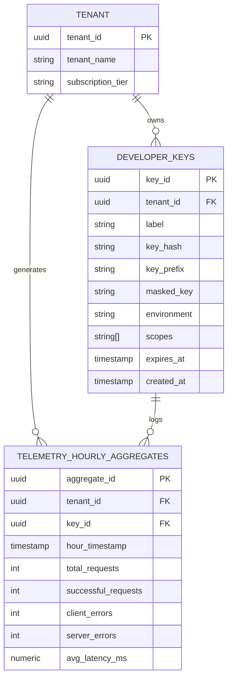

# Developer Portal Design

## Purpose
This document specifies the technical design, architectural patterns, and database schemas for the NewsOps Cloud Developer Portal. The portal acts as the interface for developers to generate and manage API keys, test endpoints inside mock sandboxes, and view API usage analytics telemetry.

## Executive Summary
To enable rapid integration and programmatic extensibility of the NewsOps Cloud digital publishing platform, we provide a unified Developer Portal. Integrated directly into the SaaS administrative console, this portal provides tenants with tools to manage API credentials securely, run dry-run API calls in an isolated sandbox, and monitor real-time integration performance via telemetry dashboards. The system leverages secure key hashing algorithms and aggregated telemetry indexing to ensure data privacy, speed, and platform safety.

## Vision
The Developer Portal empowers tech-enabled newsrooms and syndication partners to build custom content integrations, automated editorial bots, and real-time delivery scripts. By providing sandbox tooling and detailed trace analytics directly in their dashboard, we reduce developer onboarding friction from days to minutes.

## Scope
### In-Scope
* Designing the API Key Manager (generation, validation, rotation, and revocation flow).
* Defining the sandbox testing mechanism (isolated mock data routing).
* Specifying the analytics telemetry dashboard requirements (charts, metrics, pipelines).
* Database design for API key management and permissions mapping.
* UI component structure and workflows for developer activities.

### Out-of-Scope
* Complete host analytics backend processing (managed via ClickHouse cluster infrastructure).
* Public-facing open-source package registries (e.g., publishing SDKs to npm/PyPI).

## Goals
* **Self-Service Credentialing**: Complete developer onboarding and key generation without requiring administrator support tickets.
* **Telemetry Responsiveness**: Analytics dashboards must load historical usage reports in $< 500\text{ ms}$.
* **Isolation of Sandboxes**: API sandbox requests must execute without altering live production databases or consuming active credits.
* **Secure Storage**: Zero raw API keys stored in database storage; keys are only viewable once upon generation.

## Functional Requirements
* **API Key Generation and Scopes**: Allow users to create keys with granular scopes (e.g., `articles:read`, `assets:write`).
* **Masked Key Displays**: Display key values once during creation, subsequently masking credentials as `newsops_live_...******`.
* **Credential Rotation**: Support non-disruptive key rotation with overlap windows where both old and new credentials remain valid for 24 hours.
* **Testing Sandbox Mode**: Route requests carrying `X-Sandbox: true` header to simulated mock databases.
* **Telemetry Visualization**: Display charts for Total Request Count, HTTP Error Rate (4xx vs 5xx), Average Latency, and credit consumption totals.
* **CSV Export**: Allow developer analytics data extraction.

## Non-Functional Requirements
* **Key Lookup Speed**: Authenticating an incoming request key against the hash cache must take $< 2\text{ ms}$.
* **Data Refresh Interval**: Analytics dashboards must refresh telemetry charts within 5 minutes of request occurrences.
* **Security Standards**: Keys must be generated using cryptographically secure random number generators (CSRNG) with a minimum of 256 bits of entropy.

## Business Rules
### API Key Policies
* **Tenant Limits**: Free tier tenants are limited to 2 active API keys; Pro tenants to 10 keys; Enterprise tenants can generate up to 50 keys.
* **Prefix Nomenclature**: Live environment keys must be prefixed with `newsops_live_`; Sandbox keys must be prefixed with `newsops_test_`.
* **Revocation Speed**: Revoked keys must propagate to all API Gateway caching layers globally in under 15 seconds.

### Sandbox Allocations
* Sandbox requests do not count against the billing subscription RPM/RPD limits but are restricted to a flat limit of 10 requests per minute to prevent load testing abuse.

## Actors
* **Developer User**: Generates credentials, queries telemetry dashboards, and tests requests in the sandbox.
* **Tenant Admin**: Authorizes developer access, configures billing contexts, and monitors credit expenditure.
* **API Gateway Enforcer**: System service that decrypts key hashes, validates active scopes, and routes requests to the proper sandbox or live engine.
* **ClickHouse Telemetry Aggregator**: Collects access logs and updates dashboard stats.

## User Stories
* **User Story 1**: As a Developer User, I want to create an API key with read-only permissions for articles so that I can safely integrate our external website search crawler without exposing edit access.
* **User Story 2**: As a Developer User, I want to test my new webhook integration using the Sandbox mode so that I can inspect the payload structures without modifying production article database records.
* **User Story 3**: As a Tenant Admin, I want to view a real-time dashboard of API latencies and error rates so that I can diagnose integration code issues before they impact readers.

## Acceptance Criteria
* The API Key Manager must show the full generated key secret ONLY once on creation.
* Requests with the header `X-Sandbox: true` must write transaction logs strictly to temporary memory databases and must show 0 debit changes in the billing credit ledger.
* Telemetry charts must support adjustable historical time ranges (1 hour, 24 hours, 7 days, 30 days) and update graph datasets within 500ms of range selections.
* Revoking an API key from the UI must instantly invalidate the token, blocking subsequent requests using that key within 15 seconds.

## Workflows
### Onboarding and API Key Lifecycle
1. **Access Section**: Developer logs into their tenant dashboard and navigates to "Settings > Developer Tools".
2. **Create Request**: Developer clicks "Create New Key", enters a descriptive label, and checks permission scopes (e.g., `articles:read`).
3. **Key Generation**:
    * Backend generates a secure raw token: `newsops_live_` + 40 random alphanumeric characters.
    * Backend hashes the token using SHA-256.
    * Hash, prefix, label, scopes, and creation date are persisted in the database.
4. **Display Key**: UI reveals the raw key to the developer inside a copyable popup, alongside a critical warning that it will not be displayed again.
5. **Gateway Verification**: During API usage, the developer includes the key in the `X-API-Key` header. The gateway hashes the inbound token, checks the Postgres/Redis hash cache, validates the permission scope, and allows or denies entry.

### Sandbox Testing Cycle
1. **Sandbox Header Configuration**: The developer configures their HTTP client to request `https://api.newsops.cloud/v1/articles` and appends headers `X-API-Key: newsops_test_...` and `X-Sandbox: true`.
2. **Gateway Interception**: Gateway identifies the prefix `newsops_test_` and the sandbox header.
3. **Mock Router Redirection**: The gateway diverts the request context away from production databases.
4. **Database Mock Operation**: The request is executed against a lightweight SQLite memory database pre-seeded with sample article layouts.
5. **Response Execution**: The database processes actions, returning success codes and simulated output to the developer's client.

## API Design
### Create API Key
Create a new API credential with specific scopes.

* **URL**: `/api/v1/developer/keys`
* **Method**: `POST`
* **Headers**:
  * `Authorization: Bearer <JWT>`
  * `Content-Type: application/json`
* **Request Payload**:
```json
{
  "label": "Mobile App Sync Service",
  "environment": "live",
  "scopes": [
    "articles:read",
    "assets:write"
  ]
}
```
* **Response Payload (201 Created)**:
```json
{
  "keyId": "key_bc7718aa-bb11-44ab-9911-37d42cf99a81",
  "label": "Mobile App Sync Service",
  "environment": "live",
  "scopes": [
    "articles:read",
    "assets:write"
  ],
  "apiKey": "newsops_live_7a39b2cd18f27361ab8872cd9921bba8f3d178e2",
  "createdAt": "2026-06-27T22:38:54Z",
  "warning": "Store this key securely. It will not be shown again."
}
```

### Revoke API Key
Instantly invalidate a credentials token.

* **URL**: `/api/v1/developer/keys/:keyId`
* **Method**: `DELETE`
* **Headers**:
  * `Authorization: Bearer <JWT>`
* **Response Payload (200 OK)**:
```json
{
  "keyId": "key_bc7718aa-bb11-44ab-9911-37d42cf99a81",
  "status": "revoked",
  "revokedAt": "2026-06-27T22:38:55Z"
}
```

### Query Telemetry Analytics
Fetch aggregated request histories for dashboard graphics.

* **URL**: `/api/v1/developer/telemetry`
* **Method**: `GET`
* **Headers**:
  * `Authorization: Bearer <JWT>`
* **Query Parameters**:
  * `range=7d`
  * `resolution=1h`
* **Response Payload (200 OK)**:
```json
{
  "tenantId": "tnt_898a39c-88ab-4a01-b3b3-199cd3f0a1c1",
  "range": "7d",
  "summary": {
    "totalRequests": 142100,
    "successRate": 99.45,
    "p95LatencyMs": 142.5,
    "errors": 780
  },
  "dataPoints": [
    {
      "timestamp": "2026-06-27T21:00:00Z",
      "requests": 5400,
      "errors": 21,
      "avgLatencyMs": 118.2
    },
    {
      "timestamp": "2026-06-27T22:00:00Z",
      "requests": 5850,
      "errors": 12,
      "avgLatencyMs": 121.4
    }
  ]
}
```

## Database Design
Core data structures for managing developer portal credentials and permissions:

### Table: `developer_keys`
```sql
CREATE TABLE developer_keys (
    key_id UUID PRIMARY KEY DEFAULT gen_random_uuid(),
    tenant_id UUID NOT NULL,
    label VARCHAR(255) NOT NULL,
    key_hash VARCHAR(64) NOT NULL UNIQUE, -- SHA-256 hash of raw key
    key_prefix VARCHAR(20) NOT NULL, -- 'newsops_live_' or 'newsops_test_'
    masked_key VARCHAR(50) NOT NULL, -- 'newsops_live_7a39...e2'
    environment VARCHAR(20) NOT NULL, -- 'live' or 'sandbox'
    scopes VARCHAR(100)[] NOT NULL, -- Array of strings e.g. ['articles:read']
    last_used_at TIMESTAMP WITH TIME ZONE,
    expires_at TIMESTAMP WITH TIME ZONE,
    created_at TIMESTAMP WITH TIME ZONE DEFAULT CURRENT_TIMESTAMP,
    updated_at TIMESTAMP WITH TIME ZONE DEFAULT CURRENT_TIMESTAMP
);

CREATE INDEX idx_keys_hash ON developer_keys(key_hash);
CREATE INDEX idx_keys_tenant ON developer_keys(tenant_id);
```

### Table: `telemetry_hourly_aggregates`
Stores pre-aggregated statistical data compiled from raw logs.

```sql
CREATE TABLE telemetry_hourly_aggregates (
    aggregate_id UUID PRIMARY KEY DEFAULT gen_random_uuid(),
    tenant_id UUID NOT NULL,
    key_id UUID,
    hour_timestamp TIMESTAMP WITH TIME ZONE NOT NULL,
    total_requests INT DEFAULT 0,
    successful_requests INT DEFAULT 0,
    client_errors INT DEFAULT 0, -- HTTP 4xx
    server_errors INT DEFAULT 0, -- HTTP 5xx
    avg_latency_ms NUMERIC(8,2) DEFAULT 0.0,
    p95_latency_ms NUMERIC(8,2) DEFAULT 0.0,
    created_at TIMESTAMP WITH TIME ZONE DEFAULT CURRENT_TIMESTAMP
);

CREATE INDEX idx_telemetry_tenant_time ON telemetry_hourly_aggregates(tenant_id, hour_timestamp DESC);
CREATE UNIQUE INDEX idx_telemetry_unique_row ON telemetry_hourly_aggregates(tenant_id, key_id, hour_timestamp);
```

## UI Design
The Developer Dashboard contains three primary panels:
1. **API Credentials Tab**:
    * Lists keys with label, prefix, creation date, status (active/expired), scopes.
    * "Revoke" button triggers confirmation modal.
    * "Rotate Key" initiates double-validation dialog.
2. **Sandbox Explorer Console**:
    * Interactive query playground similar to Swagger UI.
    * Input headers fields are preconfigured to enable sandbox routing.
    * Log console output panel displaying simulated raw HTTP responses.
3. **Telemetry Report Tab**:
    * Highcharts-powered time-series charting showing requests rates, response latency statistics, and error distributions.
    * Date filters, CSV download actions.

## Permissions
* `apikey:generate`: Permission to create new API credentials.
* `apikey:revoke`: Permission to delete and disable keys.
* `telemetry:read`: Access rights to query analytics usage logs.

## Security
* **One-Way Key Hashing**: Gateways hash inbound header credentials using SHA-256 and look up matching database rows. The raw key is never stored, protecting against database compromises.
* **Token Rotation Grace Window**: To prevent sync failures during API key updates, the system supports a overlapping token migration phase (24h period).
* **Sandbox Data Isolation**: Sandbox queries operate on separate databases containing static seed data, ensuring live editing files are never modified.

## Performance
* **Redis Key Authentication Cache**: Active hashed keys are stored in Redis using key format `api:key:hash:<sha256_hash>` with scopes and metadata serialized in JSON payloads, yielding $< 2\text{ ms}$ validation latency.
* **Aggregated Telemetry Lookups**: ClickHouse aggregates raw requests logs into `telemetry_hourly_aggregates` asynchronously, ensuring dashboard users get summary metrics without running heavy table scans.

## Monitoring
* **Prometheus Metric**: `developer_portal_keys_generated` (Counter tracking keys created, labeled by tenant).
* **Prometheus Metric**: `developer_portal_sandbox_calls` (Counter tracking mock calls).
* **Alert Trigger**: Trigger WARNING alarm if `developer_portal_sandbox_calls` rises above 5,000 requests in 5 minutes (indicates testing loop failures).

## Logging
Security-critical developer portal logs:
```json
{"timestamp":"2026-06-27T22:38:54Z","level":"INFO","context":"APIKeyManager","tenant_id":"tnt_898a39c-88ab-4a01-b3b3-199cd3f0a1c1","key_id":"key_bc7718aa-bb11-44ab-9911-37d42cf99a81","action":"CREATE","scopes":["articles:read"],"message":"New API credential key generated successfully"}
```

## Error Handling
| Developer Portal Error | HTTP Status | Customer Action |
|:---|:---|:---|
| `EXPIRED_API_KEY` | 401 Unauthorized | Your API key has expired. Please rotate or generate a new key. |
| `INVALID_API_KEY` | 401 Unauthorized | API Key authentication failed. Check your credential values. |
| `INSUFFICIENT_KEY_SCOPE` | 403 Forbidden | Key scope validation failed. Accessing this endpoint requires: articles:write. |
| `KEY_LIMIT_EXCEEDED` | 422 Unprocessable Entity | API key capacity limit reached. Upgrade subscription or delete unused keys. |

## Edge Cases
* **Key Revocation Propagation Delay**: While local Redis caches update in $< 500\text{ ms}$, remote gateway clusters might require up to 15 seconds to invalidate key caches due to replication latencies. During this brief window, request executions are safely processed.
* **Large Historical Analytics Range**: Requests for 1-year telemetry durations are restricted to daily aggregation resolutions rather than hourly, protecting database memory layers from overflow crashes.

## Future Improvements
* **Interactive Client SDK Generation**: Auto-compile customer SDK wrappers (Java, TS, Go) directly using the tenant's OpenAPI definition parameters.
* **IP Restrictions**: Support setting IP address restrictions on specific API keys so they only accept traffic originating from configured corporate proxy networks.

## Mermaid Diagrams
### Developer Database Architecture Relationships


## References
* API Rate Limiting Design: [./rate_limiting_api.md](./rate_limiting_api.md)
* Multi-Tenancy Architecture Specifications: [../02-architecture/multi_tenancy_architecture.md](../02-architecture/multi_tenancy_architecture.md)
* Standard Error Contracts: [./error_handling_api.md](./error_handling_api.md)
