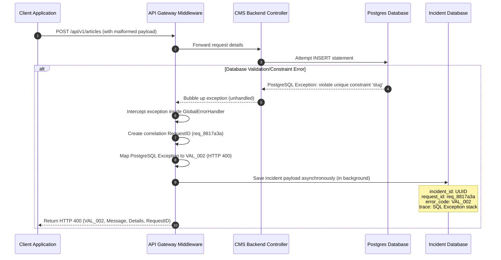

# API Error Handling

## Purpose
This document defines the standard API error contracts, serialization structures, classifications, error dictionaries, and client remediation policies across the NewsOps Cloud digital publishing platform. It guides engineers on how to catch, map, and return consistent error information, and details how clients must react to failure scenarios.

## Executive Summary
To facilitate reliable developer integration and simplified frontend debugging, NewsOps Cloud enforces a uniform error reporting standard. All APIs (both REST and GraphQL gateways) must format errors using a single, predictable JSON contract that contains validation sub-elements, unique incident correlation IDs, and categorized machine-readable error codes. This specification ensures that client applications can handle runtime failures programmatically while system operators retain complete visibility via end-to-end trace correlation.

## Vision
Our vision is to provide a developer-centric error experience where every API failure is actionable. By removing ambiguous "500 Internal Server Error" responses and replacing them with traced, categorized, and self-documenting errors, we significantly decrease time-to-resolution (TTR) for both external integration developers and internal product support engineers.

## Scope
### In-Scope
* Standardized API error response JSON schema.
* Classification of errors into logical categories.
* Global error code dictionary (e.g., `AUTH_001`, `VAL_002`, `SYS_001`).
* Client handling policies, including retry backoffs and token refresh protocols.
* Database schemas for tracking api incident reporting and debug logs.
* Middleware execution flow for exception interception and serialization.

### Out-of-Scope
* Internal debug-level stack traces shown to clients (retained strictly in backend log stores for security).
* Network routing error layouts generated by raw load balancers (e.g., HTTP 502/504 generated by AWS ALBs/Nginx prior to hitting our gateway).

## Goals
* **Consistency**: $100\%$ of error responses emitted from the gateway must adhere to the standardized error schema.
* **Security**: No sensitive database credentials, query strings, or raw stack traces must leak to public clients.
* **Traceability**: Every error payload must carry a unique `requestId` that matches the logs stored in our monitoring systems.
* **Actionability**: Client applications must be able to parse validation errors down to the specific field index and validation rule that failed.

## Functional Requirements
* **Standard Payload Envelope**: Format all HTTP errors with a root-level object containing `code`, `message`, `category`, `requestId`, `timestamp`, and `details`.
* **Field-Level Validation Details**: Expose an array of validation errors specifying the path of the field and the exact failure constraint.
* **Dynamic Translation Mapping**: Provide user-friendly, localized error messages safe for display to end editors.
* **Correlation Mapping**: Embed the active trace/span ID in the error response payload to facilitate easy log lookups in Prometheus/Loki.

## Non-Functional Requirements
* **Serialization Efficiency**: Serialization of the error object must add $< 0.5\text{ ms}$ overhead to the request cycle.
* **Sanitization**: Interceptor middleware must scrub database/ORM stack traces, replacing them with generic system failure indicators (`SYS_001`).

## Business Rules
### Error Categories
Errors must be grouped into one of the following system categories:

* **AUTHENTICATION_ERROR**: Failures related to verifying user credentials or validating access tokens.
* **AUTHORIZATION_ERROR**: Failures relating to insufficient permissions or RBAC roles.
* **VALIDATION_ERROR**: Input request payloads failing validation checks (e.g., malformed email, missing fields).
* **LIMIT_ERROR**: Failures caused by exceeding usage, credit, or rate allocations.
* **BUSINESS_RULE_ERROR**: Logic violations of system workflows (e.g., attempting to publish an article that is already archived).
* **SYSTEM_ERROR**: Database connection timeouts, disk full, or downstream microservice failures.

## Actors
* **Client Application**: The calling software (Frontend Editor Dashboard, webhook receiver, mobile app) that parses error payloads.
* **Integration Developer**: The engineer building tools against NewsOps Cloud APIs who relies on the error dictionary.
* **API Gateway Middleware**: The automated layer that intercepts backend exceptions and translates them to standard JSON errors.
* **Platform Auditor**: The engineer reviewing incident traces to identify platform-wide failure spikes.

## User Stories
* **User Story 1**: As an Integration Developer, I want to receive validation errors as an array of field paths and reasons so that my frontend application can highlight the input fields that contain invalid values.
* **User Story 2**: As a Client Application, I want to receive a unique `requestId` in error responses so that when our users hit a system failure, they can share the code with support, allowing our team to find the exact trace logs instantly.
* **User Story 3**: As a Platform Auditor, I want all uncaught system exceptions to be translated to a generic `SYS_001` database error on the gateway so that we do not expose structural details of our database schemas to malicious actors.

## Acceptance Criteria
* All API error responses must return a valid JSON payload matching the standard envelope schema.
* No internal code stack traces, file path directories, or raw SQL queries may be returned in the API error payloads under any environment configuration (including development).
* A request validation error must result in an HTTP 400 status code and include at least one object in the `details` array containing `field` and `issue`.
* Every error response must contain the `x-request-id` header matching the `requestId` parameter inside the JSON payload.

## Workflows
### Gateway Error Interception Flow
1. **Request Intake**: Client makes a request to the API Gateway.
2. **Execution Exception**: A backend controller throws an exception (e.g., database timeout or invalid payload data).
3. **Middleware Interception**: The global exception handler catches the exception before it is serialized back to the client.
4. **Classification & Mapping**:
    * If the exception is a known business violation, map it to the corresponding code (e.g., `BILL_001` or `VAL_001`) and HTTP Status (e.g., 402 or 400).
    * If the exception is an uncaught runtime error, map it to `SYS_001` and set the HTTP Status to 500.
5. **Correlation Binding**: Fetch the current transaction request ID (UUID v4) from the execution context.
6. **Payload Construction**: Write the standard JSON envelope, insert the request ID, write localized customer-facing messages, and strip any raw stack trace information.
7. **Response Output**: Write the corresponding HTTP status, inject the trace header, and return the serialized JSON payload.

## API Design
### Standard Error JSON Envelope
Below is the TypeScript type definition and response payload examples for standard API error contracts.

```typescript
interface ValidationErrorDetail {
  field: string;     // JSON path of the invalid field (e.g., "author.email")
  issue: string;     // Short description of the validation failure (e.g., "Must be a valid corporate email address")
  value?: any;       // The invalid value that was submitted (optional)
}

interface StandardErrorResponse {
  code: string;       // Unique error code (e.g., "VAL_002")
  category: string;   // Category string (e.g., "VALIDATION_ERROR")
  message: string;    // Human-readable, localized message
  requestId: string;  // Trace UUIDv4 for correlation
  timestamp: string;  // ISO 8601 formatted timestamp
  details?: ValidationErrorDetail[]; // Detailed validation failures
}
```

#### Example 1: Validation Failure (HTTP 400 Bad Request)
```json
{
  "code": "VAL_002",
  "category": "VALIDATION_ERROR",
  "message": "Input validation failed. Please check the 'details' field for specific issues.",
  "requestId": "req_8817a3a0-cc11-4b11-92ab-92938475c1a2",
  "timestamp": "2026-06-27T22:38:54.102Z",
  "details": [
    {
      "field": "article.title",
      "issue": "Title cannot be blank and must be between 5 and 150 characters.",
      "value": ""
    },
    {
      "field": "article.publishedAt",
      "issue": "Publish date must be a valid future timestamp.",
      "value": "2020-01-01T00:00:00Z"
    }
  ]
}
```

#### Example 2: Access Forbidden (HTTP 403 Forbidden)
```json
{
  "code": "AUTH_003",
  "category": "AUTHORIZATION_ERROR",
  "message": "You do not have the required permissions to publish this article. Required permission: articles:publish.",
  "requestId": "req_9921b77f-11ee-4a01-b3b3-199cd3f0a1c1",
  "timestamp": "2026-06-27T22:38:55.451Z"
}
```

#### Example 3: Internal Server Error (HTTP 500 Internal Server Error)
```json
{
  "code": "SYS_001",
  "category": "SYSTEM_ERROR",
  "message": "An unexpected system error occurred. Please contact customer support with your Request ID.",
  "requestId": "req_11a88b99-99ff-44a1-b8b8-777aa33ff129",
  "timestamp": "2026-06-27T22:38:56.002Z"
}
```

## Database Design
To track recurring API anomalies and support error rate monitoring, we implement the following database tables:

### Table: `api_incidents`
Stores aggregated/summarized records of runtime API failures.

```sql
CREATE TABLE api_incidents (
    incident_id UUID PRIMARY KEY DEFAULT gen_random_uuid(),
    request_id UUID NOT NULL UNIQUE,
    tenant_id UUID,
    user_id UUID,
    error_code VARCHAR(50) NOT NULL,
    error_category VARCHAR(100) NOT NULL,
    http_status INT NOT NULL,
    request_path VARCHAR(2048) NOT NULL,
    request_method VARCHAR(10) NOT NULL,
    exception_class VARCHAR(255) NOT NULL,
    stack_trace TEXT, -- Stored inside DB for internal review
    created_at TIMESTAMP WITH TIME ZONE DEFAULT CURRENT_TIMESTAMP
);

CREATE INDEX idx_incident_code ON api_incidents(error_code);
CREATE INDEX idx_incident_tenant ON api_incidents(tenant_id);
CREATE INDEX idx_incident_created ON api_incidents(created_at);
```

## UI Design
Errors are presented dynamically in user interfaces following standard behaviors:
* **Inline Form Alerts**: Validation error arrays are processed. The UI scans for matching input components matching the `field` key path, highlighting elements in red and displaying the associated `issue` description directly underneath.
* **Toast Notification Banners**: Category-wide errors (e.g., `LIMIT_ERROR` or `AUTHORIZATION_ERROR`) are displayed as toast notifications near the top-right corner of the application window, displaying the localized message and the copyable `requestId` tag.

## Permissions
* No special RBAC permissions are required to receive API errors; error structures are public contracts.
* `incidents:read`: Required by platform engineers to search and fetch internal debug stack traces in the `api_incidents` logging tables.

## Security
* **SQL Injection Sanitization**: Database driver exceptions are intercepted. Raw SQL statements (e.g., table structure names, parameters) are replaced with clean `SYS_001` messages to prevent leaking operational schema details.
* **Sensitive Header Sanitization**: Error logs saved in backend indexes are scrubbed of Authorization headers, API keys, password fields, and session cookie details.

## Performance
* **Exception Handling Speed**: Formatting and compiling the standard error JSON envelope must complete in $< 0.5\text{ ms}$.
* **Background Incident Logging**: Incident data inserted into the `api_incidents` table must run asynchronously in background tasks, ensuring that user request threads are released without waiting for database writes.

## Monitoring
* **Prometheus Metric**: `api_errors_total` (Counter tracking total failures, labeled by `code`, `category`, and `http_status`).
* **Prometheus Metric**: `api_incident_registration_latency` (Histogram monitoring database incident storage latency).
* **Alert Trigger**: Trigger CRITICAL alert if `api_errors_total` for category `SYSTEM_ERROR` rises above 50 events in a 1-minute window.

## Logging
Error events are logged directly to the system console in JSON format for indexing:
```json
{"timestamp":"2026-06-27T22:38:54Z","level":"ERROR","context":"GlobalExceptionHandler","request_id":"req_11a88b99-99ff-44a1-b8b8-777aa33ff129","error_code":"SYS_001","exception":"org.postgresql.util.PSQLException","message":"Database timeout during article serialization","stack_trace":"at org.postgresql.core.v3.QueryExecutorImpl.execute(QueryExecutorImpl.java:323)..."}
```

## Error Handling
The standard mapping configurations used by the middleware exception converter:

| Error Code | Category | HTTP Status | Customer-Facing Message |
|:---|:---|:---|:---|
| `AUTH_001` | `AUTHENTICATION_ERROR` | 401 Unauthorized | Invalid credentials. Please verify your username and password. |
| `AUTH_002` | `AUTHENTICATION_ERROR` | 401 Unauthorized | Access token has expired. Please refresh your session. |
| `AUTH_003` | `AUTHORIZATION_ERROR` | 403 Forbidden | You do not have the required permissions to perform this action. |
| `VAL_001` | `VALIDATION_ERROR` | 400 Bad Request | A required parameter or request body element is missing. |
| `VAL_002` | `VALIDATION_ERROR` | 400 Bad Request | One or more input fields failed validation constraints. |
| `BILL_001` | `LIMIT_ERROR` | 402 Payment Required | Insufficient credits available for this action. Please purchase a top-up. |
| `BILL_002` | `LIMIT_ERROR` | 400 Bad Request | Payment transaction declined by downstream processor. |
| `COMP_001` | `BUSINESS_RULE_ERROR` | 422 Unprocessable Entity | Asset compression failed. The media format may be corrupted. |
| `COMP_002` | `BUSINESS_RULE_ERROR` | 413 Payload Too Large | Uploaded asset exceeds the maximum allowed file size. |
| `SYS_001` | `SYSTEM_ERROR` | 500 Internal Server Error | An unexpected database error occurred. |
| `SYS_002` | `SYSTEM_ERROR` | 503 Service Unavailable | Upstream processing system is unreachable. Please retry. |

## Edge Cases
* **Double Fault during Logging**: If writing an error trace to the Postgres `api_incidents` database fails, the gateway catches the secondary exception, dumps the incident trace as a formatted text block directly to stderr, and completes the HTTP response cycle successfully.
* **Corrupt JSON Payloads**: If a client submits request bodies that fail parser tokenization entirely, the gateway interceptor intercepts the parsing error, bypassing validation routines and returning `VAL_001` with an HTTP status code 400.
* **GraphQL Errors Mapping**: GraphQL queries returning exceptions must write issues inside the standard `errors` array property conforming to the `StandardErrorResponse` structure, keeping HTTP status codes at 200 to support GraphQL specifications.

## Future Improvements
* **Self-Healing Recommendations**: Append an optional `remediationUrl` property pointing to documentation links (e.g., `https://docs.newsops.cloud/errors/AUTH_002`) within developer portal resources.
* **Automatic Ticket Creation**: Integrate Sentry and Jira webhooks directly with `api_incidents` logic, automatically dispatching priority tickets to engineering triage queues for `SYS_*` errors.

## Mermaid Diagrams
### API Gateway Error Resolution Flow


## References
* High-Level SaaS Index: [../08-saas/index.md](../08-saas/index.md)
* Zero-Cost Architecture Design: [../02-architecture/zero_cost_mvp_architecture.md](../02-architecture/zero_cost_mvp_architecture.md)
* Tenant Isolation Specifications: [../03-database/tenant_isolation_database.md](../03-database/tenant_isolation_database.md)
