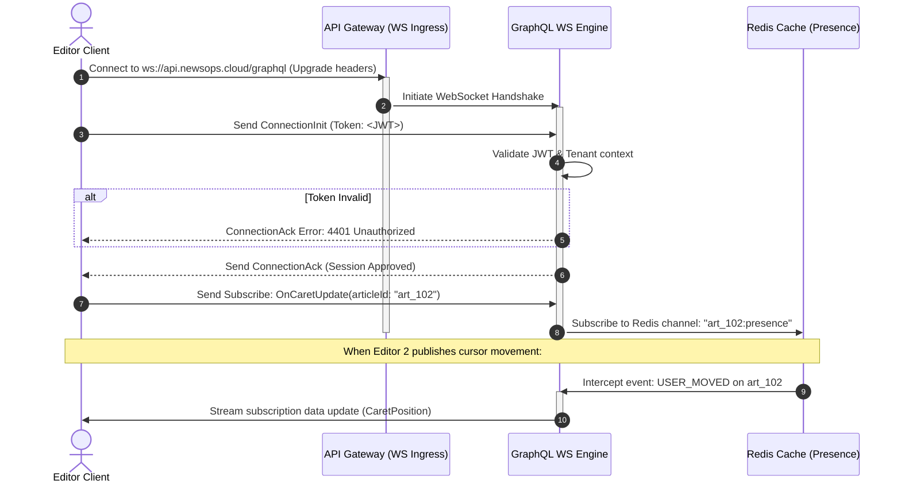

# GraphQL API Specification

## Purpose
This document details the design and specification of the NewsOps Cloud GraphQL API. It covers the GraphQL schema design, type definitions, queries (such as fetching articles with filters), mutations (saving revisions, publishing posts), and subscriptions (such as real-time editor presence and collaborative cursor/caret tracking).

## Executive Summary
For highly interactive UI components—such as our rich-text collaborative workspace—standard REST APIs can lead to over-fetching or require complex polling mechanisms. NewsOps Cloud addresses these requirements using a GraphQL layer that runs side-by-side with our REST services. By allowing clients to specify their exact response fields, the GraphQL engine reduces bandwidth and latency. Additionally, using WebSockets (`graphql-ws` protocol), the engine supports real-time cursor tracking and multi-author presence syncing, creating a highly responsive collaborative editing environment.

## Vision
To establish a fully type-safe, performance-guarded GraphQL schema that prevents N+1 query overhead using DataLoader patterns, enforces strict complexity limits, and synchronizes editing updates across browsers in sub-50ms intervals.

## Scope
This document specifies:
- The GraphQL Schema Definition Language (SDL) schemas, including Query, Mutation, and Subscription entry points.
- Query inputs, pagination models, and return shapes.
- Collaborative editor caret position payload types and subscription channels.
- Security enforcement strategies (query depth, complexity evaluation) and caching layers.

Out of scope are implementation details of physical WebSockets cluster replication (covered in event-driven architectural docs).

## Goals
- **Eliminate N+1 Queries**: Ensure all resolvers use batching (DataLoader) to consolidate database lookups.
- **Real-Time Synchronicity**: Maintain cursor positioning lag below visible thresholds.
- **Robust Security boundaries**: Enforce role-based access control inside resolvers, verifying that clients cannot bypass authorization logic by nested querying.
- **Clean Type Hierarchy**: Establish reusable inputs and interfaces for shared resources across the workspace.

## Functional Requirements
- **Article Fetching with Filters**: Allow sorting and filtering by authors, categories, status, and custom tag arrays.
- **Incremental Draft Mutations**: Support a mutation to save document revisions and track the differences between drafts.
- **Post Publication Mutation**: Expose a mutation to mark drafts as published, verifying schema validation at execution.
- **Caret Position Broadcasting**: Support WebSocket subscriptions to broadcast client caret indexes (anchor, focus) in real-time.

## Non-Functional Requirements
- **WebSocket Handshake Latency**: Handshake and token verification must complete in under $5\text{ ms}$.
- **Resolver Performance**: $95\%$ of resolvers must run in under $10\text{ ms}$ for cached elements, and $< 100\text{ ms}$ for complex database queries.
- **Query Complexity limit**: Rejects queries exceeding a complexity score of 100.
- **Subscription Latency**: Target a p95 broadcast latency of $< 30\text{ ms}$ from client send to target client receipt.

## Business Rules
- **Co-editing Scoping**: WebSocket subscriptions for a specific article's carets are only allowed for users who possess read-and-write permissions for that specific article instance.
- **Auto-Eviction of Presence**: If a WebSocket connection remains silent (no ping/pong) for longer than 15 seconds, the server must automatically broadcast a "disconnect" presence event and remove the caret cache record.
- **Immutable Revisions**: Historical revision blobs saved via mutations cannot be updated or deleted, establishing a traceable change trail.

## Actors
- **Content Writer**: Broadcasts live updates, edits content, and tracks colleagues' cursors.
- **Proofreader**: Queries current content and previous revisions to compare edits side-by-side.
- **Integrator App**: Subscribes to publication streams to sync finished articles into external CMS pipelines.

## User Stories (At least 3 specific stories)
- **User Story 1**: As a Content Writer, I want to see where my co-author's cursor is positioned inside the article body in real-time so that we do not write over the same sentence.
- **User Story 2**: As a Proofreader, I want to query the list of past article revisions including the editor's username and the changes they made so that I can audit modifications before publishing.
- **User Story 3**: As a Content Writer, I want to execute a `saveRevision` mutation that sends only the modifications I've made so that my local drafts are backed up continuously without consuming high bandwidth.

## Acceptance Criteria (At least 3-5 criteria with clear thresholds)
- The compiled schema must enforce query complexity analysis and immediately block execution if a nested query path exceeds a complexity score of 100.
- The WebSocket connection must be rejected with error `4401 Unauthorized` if the client fails to provide a valid JWT in the connection payload within 3 seconds of socket connection.
- Caret position changes sent via `updateCaretPosition` mutation must broadcast to all active subscribers of that article ID in under $50\text{ ms}$.
- Fetching articles with nested author profiles must trigger only 2 database queries (one for articles, one batched query for authors) regardless of the number of items fetched.

## Workflows
```
[ Editor 1 ] --(updateCaretPosition)--> [ GraphQL WebSocket Engine ] --> [ Redis Pub/Sub ]
                                                                                |
[ Editor 2 ] <----(caretUpdated Event)------------------------------------------+
```
### Collaborative Caret Tracking Workflow
1. **Move Cursor**: Editor 1 moves their cursor to line 5, column 12 in the shared editor UI.
2. **Submit Mutation**: The client-side editor library dispatches the `updateCaretPosition` mutation over the established WebSocket connection.
3. **Ingestion & Auth**: The GraphQL engine verifies the connection's session token and parses the coordinates.
4. **Redis Publish**: The engine caches the new caret coordinates in Redis under `presence:art_102:usr_882` with an expiration of 15 seconds and publishes the event to Redis Pub/Sub channel `art_102:presence`.
5. **Subscription Broadcast**: The GraphQL WS server instances hosting active subscriptions for Editor 2 intercept the event from Redis.
6. **UI Render**: Editor 2's subscription receiver yields the update payload, and the editor UI redraws the cursor block for Editor 1 at the target position.

## API Design

### GraphQL Schema Definition (SDL)
```graphql
scalar DateTime
scalar JSON

enum ArticleStatus {
  DRAFT
  UNDER_REVIEW
  PUBLISHED
  ARCHIVED
}

type User {
  id: ID!
  email: String!
  firstName: String!
  lastName: String!
  role: String!
}

type Revision {
  id: ID!
  version: Int!
  editor: User!
  deltaPayload: JSON!
  createdAt: DateTime!
}

type Article {
  id: ID!
  title: String!
  slug: String!
  body: String!
  status: ArticleStatus!
  author: User!
  organizationId: String!
  version: Int!
  revisions: [Revision!]!
  createdAt: DateTime!
  updatedAt: DateTime!
}

type CaretPosition {
  userId: ID!
  userName: String!
  anchorIndex: Int!
  focusIndex: Int!
  color: String!
  updatedAt: DateTime!
}

input ArticleFilterInput {
  status: ArticleStatus
  authorId: ID
  searchQuery: String
  tags: [String!]
}

input CaretUpdateInput {
  articleId: ID!
  anchorIndex: Int!
  focusIndex: Int!
}

input SaveRevisionInput {
  articleId: ID!
  deltaPayload: JSON!
  currentVersion: Int!
}

type Query {
  articles(filter: ArticleFilterInput, limit: Int = 20, page: Int = 1): [Article!]!
  article(id: ID!): Article
  activePresence(articleId: ID!): [CaretPosition!]!
}

type Mutation {
  saveRevision(input: SaveRevisionInput!): Revision!
  publishPost(id: ID!): Article!
  updateCaretPosition(input: CaretUpdateInput!): CaretPosition!
}

type Subscription {
  caretUpdated(articleId: ID!): CaretPosition!
  articlePresenceChanged(articleId: ID!): [CaretPosition!]!
}
```

### Sample Operations

#### Query: Fetch Articles with Nested Fields
* **Payload**:
```graphql
query GetArticlesWithAuthors($filter: ArticleFilterInput!) {
  articles(filter: $filter, limit: 10, page: 1) {
    id
    title
    status
    author {
      id
      email
      firstName
      lastName
    }
  }
}
```
* **Variables**:
```json
{
  "filter": {
    "status": "UNDER_REVIEW",
    "searchQuery": "monolith"
  }
}
```
* **Response**:
```json
{
  "data": {
    "articles": [
      {
        "id": "art_102",
        "title": "Scaling Monoliths in Multi-Tenant Clouds",
        "status": "UNDER_REVIEW",
        "author": {
          "id": "usr_9918",
          "email": "editor@newsops.com",
          "firstName": "Jane",
          "lastName": "Doe"
        }
      }
    ]
  }
}
```

#### Mutation: Update Caret Position
* **Payload**:
```graphql
mutation SendCaretUpdate($input: CaretUpdateInput!) {
  updateCaretPosition(input: $input) {
    userId
    anchorIndex
    focusIndex
    color
    updatedAt
  }
}
```
* **Variables**:
```json
{
  "input": {
    "articleId": "art_102",
    "anchorIndex": 124,
    "focusIndex": 124
  }
}
```
* **Response**:
```json
{
  "data": {
    "updateCaretPosition": {
      "userId": "usr_9918",
      "anchorIndex": 124,
      "focusIndex": 124,
      "color": "#FF5733",
      "updatedAt": "2026-06-27T22:58:00.000Z"
    }
  }
}
```

#### Subscription: Subscribe to Caret Positions
* **Request**:
```graphql
subscription OnCaretUpdate($articleId: ID!) {
  caretUpdated(articleId: $articleId) {
    userId
    userName
    anchorIndex
    focusIndex
    color
  }
}
```
* **Variables**:
```json
{
  "articleId": "art_102"
}
```
* **Subscription Broadcast Event (JSON Payload)**:
```json
{
  "data": {
    "caretUpdated": {
      "userId": "usr_9918",
      "userName": "Jane Doe",
      "anchorIndex": 124,
      "focusIndex": 124,
      "color": "#FF5733"
    }
  }
}
```

## Database Design
The GraphQL layer sits on top of standard Postgres models and utilizes Redis to back real-time state.

### Table: `revisions`
Tracks delta edits submitted by co-authors.
* **Fields**:
  * `id`: `UUID` (Primary Key)
  * `article_id`: `UUID` (Foreign Key -> `articles.id`, Cascade Delete)
  * `version`: `INTEGER` (Order sequence)
  * `editor_id`: `UUID` (Foreign Key -> `users.id`)
  * `delta_payload`: `JSONB` (Stores editor delta structure)
  * `created_at`: `TIMESTAMP`
* **Indexes**:
  * `idx_revisions_article_version` ON (`article_id`, `version` DESC)

### Redis Presence Store
Stores ephemeral caretaker positions.
* **Key structure**: `presence:{article_id}:{user_id}`
* **Fields**:
  * `userName`: `string`
  * `anchorIndex`: `integer`
  * `focusIndex`: `integer`
  * `color`: `string`
  * `updatedAt`: `string (ISO8601)`
* **TTL**: 15 seconds (Updated on each heartbeat mutation)

## UI Design
- **Presence Bubbles**: Displayed in the header of the editor. Each bubble represents a active co-editor, showing their initials, and hovering displays their full name. Color corresponds to the cursor shade.
- **Collaborative Editor Canvas**: Displays custom cursor elements overlaid on top of text components at computed pixel positions, bound to the subscription data stream.
- **Revision History Slider**: Renders a vertical timeline in the side inspector showing list of saved revisions with authors, letting editors click to restore specific versions.

## Permissions
- `articles:read` - Required to query articles and active presence.
- `articles:write` - Required to mutate revisions and publish posts.
- `presence:broadcast` - Specific websocket level capability required to emit caret positions and receive co-editor feeds.

## Security
- **Query Complexity Analysis**: Every inbound GraphQL request is evaluated prior to resolution using rules that calculate costs based on nested nodes.
- **WebSocket Handshake Validation**: The WebSocket server intercepts the connection handshake (`ConnectionInit` packet) and extracts the bearer token, validating it before upgrading the socket connection.
- **Injection Safety**: Variables passed to mutations are strongly typed and parsed through runtime checks.

## Performance
- **DataLoader Cache Strategy**: Utilizes dynamic batching. When loading 100 articles, their respective authors are consolidated into a single database query.
- **Memory Optimization**: Redis pub/sub is used to manage messages instead of scaling in-memory subscription managers on individual NestJS instances.
- **Concurrent Connections**: Supported 10,000 active WebSockets per gateway pod, with heartbeats (pings) dispatched every 10 seconds.

## Monitoring
- **Prometheus Metric**: `graphql_resolver_duration_seconds` (Histogram tracking resolver latency).
- **Prometheus Metric**: `graphql_websocket_active_connections` (Gauge showing current WebSocket client counts).
- **Prometheus Metric**: `graphql_query_complexity_exceeded_total` (Counter tracking rejected queries).
- **Alert Trigger**: Trigger Alert if active websocket connections drop by $> 50\%$ in a 2-minute window (indicates websocket server crash).
- **Alert Trigger**: Trigger Warning if the p95 duration of resolver functions exceeds $150\text{ ms}$.

## Logging
* **Standard Resolver Execution Log**:
```json
{
  "timestamp": "2026-06-27T23:01:00.000Z",
  "trace_id": "tr-gq-012b-bc09-acde",
  "level": "INFO",
  "context": "GraphQLResolver",
  "tenant_id": "org_newsops_001",
  "operation_name": "GetArticlesWithAuthors",
  "complexity_score": 14,
  "execution_duration_ms": 28,
  "errors_count": 0
}
```

## Error Handling
GraphQL errors return in the standard response block.
```json
{
  "errors": [
    {
      "message": "Query complexity of 105 exceeds maximum limit of 100",
      "locations": [{ "line": 2, "column": 3 }],
      "path": ["articles"],
      "extensions": {
        "code": "BAD_USER_INPUT",
        "errorCode": "ERR_GRAPHQL_COMPLEXITY_EXCEEDED"
      }
    }
  ],
  "data": null
}
```

| Internal Error Code | HTTP Status / Extension Code | Customer-Facing Message |
|:---|:---|:---|
| `ERR_GRAPHQL_COMPLEXITY_EXCEEDED` | `BAD_USER_INPUT` (200 OK) | The requested query is too complex. Select fewer fields or filter results. |
| `ERR_GRAPHQL_UNAUTHENTICATED` | `UNAUTHENTICATED` (200 OK) | Session has expired or is invalid. Please log in again. |
| `ERR_GRAPHQL_RESOLVER_TIMEOUT` | `INTERNAL_SERVER_ERROR` (200 OK)| The data provider timed out resolving this query. |

## Edge Cases
- **WebSocket Reconnection Drops**: If the client briefly loses internet connection, the editor presence auto-evict kicks in after 15 seconds. On reconnect, the SDK automatically re-subscribes to restore tracking state.
- **Concurrent DB Version Updates**: If a revision save mutation fails due to DB version check failure (another edit saved during transmission), the mutation returns the latest saved state to let the client merge changes.

## Future Improvements
- **Apollo Federation Integration**: Transition to federated subgraph structures as editor, identity, and analytics services scale out.
- **WebRTC Peer Data Channels**: Offload real-time cursor positions directly to client-to-client WebRTC connections to reduce infrastructure WebSocket overhead.

## Mermaid Diagrams
### GraphQL Subscriptions Connection Setup and Lifecycle


## References
- Core routing and gateway setup: [index.md](./index.md)
- Schema database design logic: [../03-database/editorial_and_cms_schema.md](../03-database/editorial_and_cms_schema.md)
- REST equivalents: [rest_api_spec.md](./rest_api_spec.md)
- TS Client integration structures: [sdk_javascript.md](./sdk_javascript.md)
