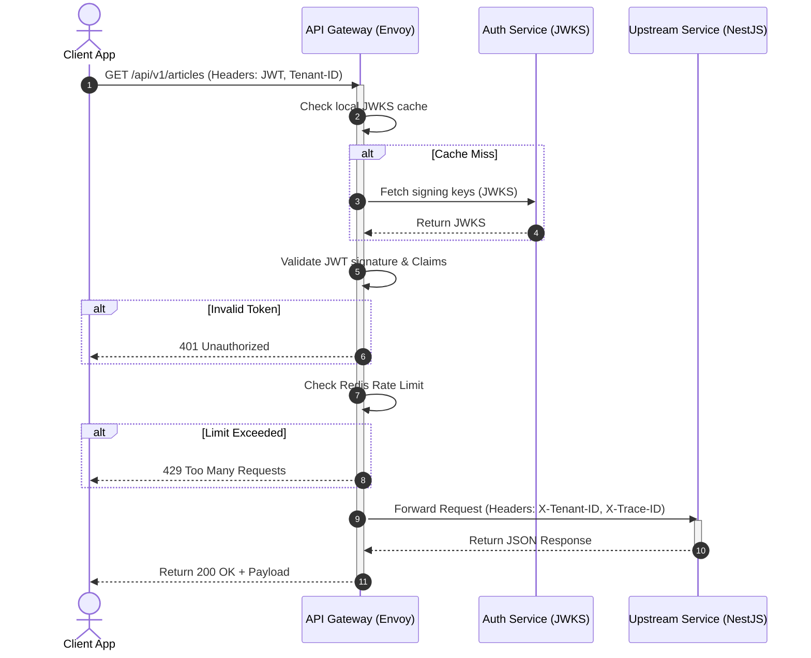

# API Directory Overview

## Purpose
This document serves as the directory overview and index for the NewsOps Cloud API ecosystem. It maps out the directory structure of the API specifications, provides the technical rationale for our multi-protocol gateway architecture (REST, GraphQL, Webhooks, and Client SDKs), and defines the routing topology that handles external client requests.

## Executive Summary
The NewsOps Cloud digital publishing platform supports a diverse array of clients, including third-party publishing systems, content management panels, collaborative rich-text editors, and external analytics aggregators. To serve these integrations reliably, the API layer is organized into four main pillars:
1. **REST API**: Standard CRUD operations for system entities, including articles, organizations, users, and audit records.
2. **GraphQL API**: Advanced content querying with deeply nested relations and real-time collaborative editing subscriptions.
3. **Webhooks Engine**: Real-time asynchronous notifications for article lifecycle updates, user changes, and billing occurrences.
4. **JavaScript/TypeScript SDK**: A client-side wrapper that simplifies authorization, connection pooling, and error handling.

This overview defines the gateway routes, schema validation standards, and cross-cutting requirements shared by these integration channels.

## Vision
To establish a high-performance, single-entry gateway topology that isolates tenants, validates requests in sub-millisecond times, and provides developers with automated, type-safe SDK interfaces that abstract underlying microservice and monolith boundaries.

## Scope
This index covers:
- Directory maps of all API design specifications within `docs/09-api/`.
- Gateway routing mechanics, tenant identification headers, and authentication mapping rules.
- High-level comparison and decision matrix for REST vs. GraphQL usage in NewsOps Cloud.
- System-wide non-functional API constraints (latency, rate-limiting, and payload sizes).

Out of scope are individual microservice internal controller implementations (covered in domain-specific implementation blueprints) and raw Kubernetes ingress configurations.

## Goals
- **Unified Entry Point**: All public API traffic routes through a single API Gateway layer (Kong/Envoy).
- **Clear Architectural Guidance**: Developers must know exactly when to choose REST (e.g., system admin, bulk import) versus GraphQL (e.g., rich-text collaborative editors).
- **Automated Directory Discovery**: Provide a queryable metadata endpoint that lists active API routes, version stages, and documentation links.
- **Tenant Protection**: Enforce that zero cross-tenant calls slip past the gateway without a valid tenant header.

## Functional Requirements
- **Route Catalog Endpoint**: The gateway must expose a public discovery route mapping all path patterns to upstream domains.
- **Tenant Context Extraction**: The gateway must extract `x-tenant-id` or subdomain patterns and pass them down as standardized headers.
- **Protocol Routing**: The gateway must parse, validate, and route `/api/v1/*` to the REST Monolith/Microservices, and `/graphql` to the GraphQL engine.

## Non-Functional Requirements
- **Gateway Overhead**: The API gateway routing latency must be under $3\text{ ms}$ for the $99\text{th}$ percentile.
- **Target Throughput**: The gateway must sustain $50,000\text{ requests per second (RPS)}$ of mixed REST, GraphQL, and Webhook traffic.
- **Gateway Availability**: The gateway layer must achieve $99.999\%$ uptime using multi-region deployment.
- **Response Size Limits**: Maximum payload size for JSON requests is capped at $10\text{ MB}$ for REST and GraphQL endpoints, and $5\text{ MB}$ for Webhook deliveries.

## Business Rules
- **No Direct Service Access**: Clients cannot query database stores or individual NestJS pods directly; all interactions must pass through the API Gateway.
- **Tenant Sandboxing**: Any API call failing to present a tenant context matching the issuer's token must be immediately dropped with a `403 Forbidden` response.
- **Deprecation Governance**: API paths marked as deprecated must remain operational for 180 days after deprecation notifications are published in the route catalog.

## Actors
- **External Integrator**: A third-party developer writing custom plugins or sync tools using NewsOps Cloud APIs.
- **Platform Engineer**: Configures, deploys, and monitors the API gateway and webhook engines.
- **CMS Frontend App**: The main React-based editorial interface which consumes both REST and GraphQL endpoints.
- **System Auditor**: Monitors the audit log API to track resource modifications and access records.

## User Stories (At least 3 specific stories)
- **User Story 1**: As an External Integrator, I want to access a unified API spec index page so that I can quickly decide whether to integrate using the REST endpoints, write a GraphQL query, or subscribe to webhooks.
- **User Story 2**: As a Platform Engineer, I want to monitor gateway routing metrics so that I can detect latency spikes or rate limit violations before they cause downstream database exhaustion.
- **User Story 3**: As a CMS Frontend developer, I want to utilize the JavaScript SDK to handle token expiration and automatic retries so that I do not have to write boilerplate networking code in every component.

## Acceptance Criteria (At least 3-5 criteria with clear thresholds)
- The gateway route discovery endpoint (`GET /api/v1/routes`) must resolve and return the full API map in under $15\text{ ms}$ under a load of $5,000\text{ RPS}$.
- When a client supplies an expired JWT, the gateway must reject the request with `401 Unauthorized` in less than $2\text{ ms}$ without passing the request to the backend servers.
- The Javascript SDK must successfully inject JWT headers and retry failed requests up to 3 times with exponential backoff before bubbling up a connection error.

## Workflows
```
[ Client Request ] --> [ API Gateway ] --> [ Tenant & Auth Guard ] --> [ Upstream Routing ]
                                                                                |
                                     +------------------+-----------------------+
                                     | (REST Pattern)   | (GraphQL Pattern)
                                     v                  v
                               [ REST Monolith ]   [ GraphQL Engine ]
```
### API Gateway Entry and Dispatch Workflow
1. **Client Request**: An external integration client issues an HTTP request to `api.newsops.cloud/api/v1/articles?limit=10`.
2. **Gateway Ingestion**: The Envoy/Kong API Gateway intercepts the TLS connection and verifies the client IP against blacklist rules.
3. **Tenant & Auth Verification**: The gateway parses the `Authorization: Bearer <JWT>` header and validates the token signature using the OIDC public key set. It extracts `tenant_id` and binds it to the outgoing headers as `X-Tenant-ID`.
4. **Path Resolution**: The gateway matches the route pattern `/api/v1/articles` to the active route registry.
5. **Upstream Forwarding**: The request is dispatched to the NestJS monolith's REST cluster via internal VPC IP networks.
6. **Telemetry Logging**: The gateway logs request statistics (duration, bytes sent, HTTP status) to the monitoring pipeline before sending the response back to the client.

## API Design
### API Gateway Route Catalog API
Provides active paths, protocols, and deprecation details for integration planning.

* **URL**: `/api/v1/routes`
* **Method**: `GET`
* **Headers**:
  * `Authorization: Bearer <jwt_token>`
  * `X-Tenant-ID: org_newsops_001`
* **Request Params**: None
* **Response Payload (200 OK)**:
```json
{
  "tenantId": "org_newsops_001",
  "gatewayVersion": "v1.4.2",
  "routes": [
    {
      "path": "/api/v1/articles",
      "protocol": "REST",
      "methods": ["GET", "POST", "PUT", "DELETE"],
      "upstream": "http://nestjs-monolith-service.internal",
      "deprecated": false,
      "docsUrl": "https://docs.newsops.cloud/api/v1/rest_api_spec.md"
    },
    {
      "path": "/graphql",
      "protocol": "GraphQL",
      "methods": ["POST"],
      "upstream": "http://graphql-engine-service.internal",
      "deprecated": false,
      "docsUrl": "https://docs.newsops.cloud/api/v1/graphql_api_spec.md"
    },
    {
      "path": "/api/v1/webhooks/deliveries",
      "protocol": "REST",
      "methods": ["POST", "GET"],
      "upstream": "http://webhooks-engine-service.internal",
      "deprecated": false,
      "docsUrl": "https://docs.newsops.cloud/api/v1/webhooks_architecture.md"
    }
  ]
}
```

## Database Design
The API Gateway configuration is stored in a dedicated schema in the system control database.

### Table: `api_gateway_routes`
Stores dynamic routes mapped at the gateway layer.
* **Fields**:
  * `id`: `UUID` (Primary Key)
  * `path_pattern`: `VARCHAR(255)` (Unique, Indexed)
  * `protocol`: `VARCHAR(50)` (e.g., 'REST', 'GRAPHQL')
  * `upstream_url`: `VARCHAR(500)`
  * `is_deprecated`: `BOOLEAN` (Default: false)
  * `deprecation_date`: `TIMESTAMP` (Nullable)
  * `created_at`: `TIMESTAMP`
  * `updated_at`: `TIMESTAMP`
* **Indexes**:
  * `idx_gateway_path_pattern` ON `path_pattern`

### Table: `gateway_rate_limits`
Maintained in Redis for fast caching and atomic decrement.
* **Keys**: `rate_limit:{tenant_id}:{client_ip}:{window_timestamp}`
* **Value**: `integer` (Request count remaining)
* **TTL**: 60 seconds

## UI Design
The Developer Portal UI provides API key provisioning and gateway metrics.
- **Dashboard Panel**: Displays real-time API request volumes, error rates (4xx, 5xx), and rate-limit consumption gauges.
- **Route Explorer Table**: Lists active paths, allowed HTTP methods, documentation links, and deprecation notices.
- **Credentials Manager**: Enables generating API tokens, configuring OAuth2 clients, and specifying allowed CORS origins.

## Permissions
Access to read and manipulate the API routing topology requires:
- `api:read`: Read routes and download SDK schemas.
- `api:configure`: Register, deprecate, or delete API routes on the gateway.
- `api_keys:manage`: Provision and revoke credentials for external clients.

## Security
- **OAuth2 / OIDC Validation**: Token validation uses JWKS (JSON Web Key Sets) caching to prevent calling authentication endpoints on every request.
- **IP White-listing & CORS**: Gateway enforces strict CORS origins on dynamic routes.
- **Rate-Limiting**: Enforced at the gateway layer using token-bucket algorithm in Redis. Default tier allows 1,000 requests per minute per tenant.

## Performance
- **Max Latency**: $5\text{ ms}$ processing overhead at the gateway tier.
- **Caching**: HTTP GET requests for static resource catalogs are cached at the Cloudflare CDN edge for 3600 seconds.
- **Target TPS**: Sustained 50,000 Transactions Per Second (TPS) across regional endpoints.

## Monitoring
- **Prometheus Metric**: `gateway_request_duration_seconds` (Histogram tracking latency per route).
- **Prometheus Metric**: `gateway_requests_total` (Counter categorized by HTTP status and tenant ID).
- **Alert Trigger**: Raise Warning page if `gateway_request_duration_seconds` p99 exceeds $50\text{ ms}$ for 3 consecutive minutes.
- **Alert Trigger**: Raise Critical page if `gateway_requests_total` return rate of `5xx` errors exceeds $1.5\%$ of total traffic.

## Logging
* **Log Format (W3C Standard JSON)**:
```json
{
  "timestamp": "2026-06-27T22:40:00.000Z",
  "trace_id": "trace-983b-4890-a23d-00bc192931a2",
  "span_id": "span-gateway-01",
  "level": "INFO",
  "tenant_id": "org_newsops_001",
  "client_ip": "198.51.100.42",
  "path": "/api/v1/articles",
  "method": "GET",
  "status_code": 200,
  "duration_ms": 4.2
}
```

## Error Handling
| Internal Error Code | HTTP Status | Customer-Facing Message |
|:---|:---|:---|
| `ERR_GATEWAY_RATE_LIMIT_EXCEEDED` | 429 Too Many Requests | Rate limit exceeded. Please check your billing tier or throttle your integration calls. |
| `ERR_GATEWAY_UNAUTHORIZED` | 401 Unauthorized | Missing or invalid authentication token. |
| `ERR_GATEWAY_UPSTREAM_TIMEOUT` | 504 Gateway Timeout | The upstream publishing server took too long to respond. |

## Edge Cases
- **JWKS Endpoint Outage**: If the identity provider goes offline, the gateway falls back to local JWT cache signatures. If cached keys expire, it issues warning logs and strictly denies expired tokens, defaulting to safety.
- **Tenant Database Partitioning**: If a tenant DB is undergoing migration, the gateway maps their incoming traffic to a temporary queuing path returning a `503 Service Unavailable` with a Retry-After header.

## Future Improvements
- **Federated GraphQL Gateway**: Transition the GraphQL endpoint to Apollo Federation as the system moves to multi-service setups.
- **Edge Routing (Cloudflare Workers)**: Perform JWT signature checking and tenant header lookup at the edge to reduce core network hops.

## Mermaid Diagrams
### API Gateway Routing Flow


## References
- REST Endpoint Definitions: [rest_api_spec.md](./rest_api_spec.md)
- GraphQL Integration specs: [graphql_api_spec.md](./graphql_api_spec.md)
- Webhooks Push Notification Engine: [webhooks_architecture.md](./webhooks_architecture.md)
- JS/TS Client Library specs: [sdk_javascript.md](./sdk_javascript.md)
- Multi-Tenant Schema Design: [../03-database/tenant_isolation_database.md](../03-database/tenant_isolation_database.md)
