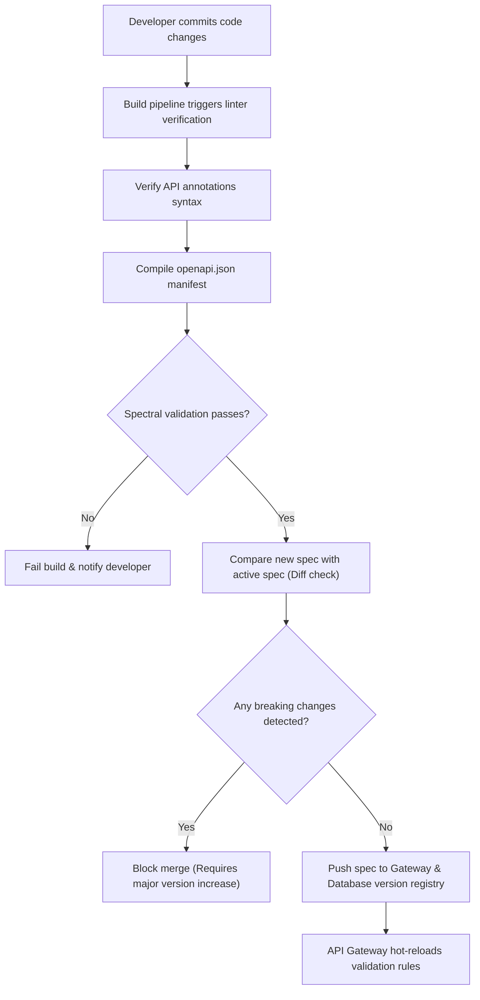

# OpenAPI Specifications Manifest

## Purpose
This document defines the structure, tags, endpoint schemas, and authentication requirements for the NewsOps Cloud digital publishing platform OpenAPI (Swagger) v3.0.3 specification manifest. It serves as the single source of truth for contract-driven API development, automated API Gateway request validation, and client SDK compilation pipelines.

## Executive Summary
The NewsOps Cloud API is exposed via a central OpenAPI manifest. The system implements a contract-first approach: developers annotate backend controllers, and a build-time compiler generates the static `/openapi.json` file. This document details the spec components, standard schemas (Articles, Deployments, and Tenants), error payloads, and security schemes mapped to Bearer JWTs and OAuth2 configurations.

## Vision
To achieve complete automation of the API delivery lifecycle. Any change to the database schemas or API gateways is checked against the OpenAPI manifest during CI/CD execution, rejecting deployments that introduce breaking API changes.

## Scope
The scope of this document covers:
*   OpenAPI v3.0.3 tag hierarchies and routing groups.
*   Path definitions and method parameter mappings for key entities.
*   Request body structure definitions and JSON Schemas.
*   Security Schemes mapping (Bearer JWT keys and dynamic OAuth2 workflows).
*   Standardized error response formats.

Out of Scope:
*   Legacy API integration schemas.
*   Dynamic RPC patterns not exposed via standard HTTP gateways.

## Goals
*   **100% Conformance**: Maintain complete validation compliance with OpenAPI v3.0.3 standards.
*   **Zero Drift**: Automate validation during backend code compilation, ensuring that local controllers and the manifest never drift.
*   **Developer Ergonomics**: Structure tags and operation IDs to produce clean method signatures when generated via automated tooling (e.g., `OpenAPIGenerator`).

## Functional Requirements
1.  **Schema Access**: The platform must expose static OpenAPI definitions at `GET /openapi.json` and `GET /openapi.yaml` with server-side caching.
2.  **API Gateway Payload Validation**: The API Gateway must parse incoming JSON payloads and compare them to the OpenAPI manifest schemas, blocking malformed requests before routing them to backend microservices.
3.  **Strict Type Enforcement**: Define fields like `uuid` formats, date-time formats, array limitations, and string boundaries for query and path variables.
4.  **Error Object Standardization**: Enforce that all failed API paths respond with a standardized structure containing an error code, a detailed description, and a validation error path list.

## Non-Functional Requirements
1.  **Zero Parse Delay**: The size of the compiled `openapi.json` must be optimized (e.g., via compression and reference re-use) to remain under $1.5\text{ MB}$, ensuring client-side Swagger dashboards load in less than 1 second.
2.  **Versioning Control**: The manifest must implement semantic versioning matching major, minor, and patch revisions of the platform.

## Business Rules
1.  **Security Schemes Mandatory**: All paths must reference at least one active security scheme (e.g., `BearerAuth` or `OAuth2CodeFlow`) unless explicitly tagged with the `@public` namespace.
2.  **Deprecation Policies**: Deprecated paths must declare the `deprecated: true` property in the spec and must populate warning payload details inside response header schemas.

## Actors
*   **Integration Developer**: Integrates internal and external services using client code generated from the manifest.
*   **API Gateway Engine**: Validates inputs, routes endpoints, and enforces token policies using the OpenAPI schema rules.
*   **Security Auditor**: Scans paths and security schemes to verify compliance with structural access regulations.

## User Stories (At least 3 specific stories)
*   **User Story 1 - Secure Payload Ingestion**: As an API Gateway Engineer, I want the gateway to inspect the input parameters of `POST /v1/articles` against the OpenAPI schema definitions so that we automatically discard requests containing titles that exceed 255 characters.
*   **User Story 2 - Automated Client Compilation**: As an Integration Developer, I want to download the OpenAPI JSON manifest and run it through `openapi-generator-cli` so that I can generate a bug-free Rust client library in one step.
*   **User Story 3 - Interactive Documentation**: As a Third-Party Developer, I want to access the Swagger UI dashboard at `https://api.newsops.cloud/docs` so that I can click "Try it out" and execute sample calls directly from my browser using my test API key.

## Acceptance Criteria (At least 3-5 criteria with clear thresholds)
1.  **JSON Validation Schema**: The manifest must score $100\%$ pass rate against the official OpenAPI specification linter (`spectral lint openapi.json`).
2.  **Coverage**: Every endpoint path defined in the gateway config files must exist in the OpenAPI manifest, with no undocumented routes.
3.  **Operation ID Uniqueness**: All paths must contain unique `operationId` definitions (e.g., `listArticles`, `createArticle`) to prevent collision during SDK package builds.
4.  **Error Model Consistency**: Standard error states (400, 401, 403, 404, 429, 500) must return the standardized error schema class in the responses dictionary.

## Workflows (Step-by-step description of system and user interactions)
### Schema Compilation and Gateway Deployment Workflow
1.  **Code Annotation**: A backend engineer updates controller parameters in code (e.g., changing a field type or adding a path).
2.  **Linter Verification**: During the local pre-commit hook, code annotations are parsed. If a new path is missing response tags, the linter blocks the commit.
3.  **CI/CD Spec Generation**: The build runner executes `npm run generate-openapi` or `go run cmd/spec/main.go`, compilation outputs a raw JSON file.
4.  **Gateway Configuration Sync**: The gateway configuration manager reads the new `openapi.json` file.
5.  **Validation Rules Mapping**: The API Gateway (e.g. Kong or Envoy) compiles the JSON schema sections into local input filters.
6.  **Hot Reload**: The gateway reloads its schema filters with zero downtime, enforcing the newly configured properties on all subsequent requests.

## API Design

The following block is a complete segment of the NewsOps Cloud platform OpenAPI 3.0.3 specification manifest in JSON format.

```json
{
  "openapi": "3.0.3",
  "info": {
    "title": "NewsOps Cloud Digital Publishing API",
    "description": "Core API engine managing multi-tenant editorial operations, articles lifecycle, system deployments, and real-time logs ingestion.",
    "version": "1.0.0",
    "contact": {
      "name": "NewsOps Platform Team",
      "url": "https://newsops.cloud/support",
      "email": "platform@newsops.cloud"
    }
  },
  "servers": [
    {
      "url": "https://api.newsops.cloud/v1",
      "description": "Production Multi-Tenant API Gateway"
    },
    {
      "url": "http://localhost:8080/v1",
      "description": "Local Developer Sandbox Environment"
    }
  ],
  "tags": [
    {
      "name": "Editorial",
      "description": "Drafting, editing, and publishing digital articles."
    },
    {
      "name": "Identity & Access",
      "description": "Tenant structures, user roles, API Keys, and authentication tokens."
    },
    {
      "name": "Infrastructure",
      "description": "Deployments, cluster states, configurations, and system log tailing."
    }
  ],
  "paths": {
    "/articles": {
      "get": {
        "tags": ["Editorial"],
        "summary": "List available articles",
        "description": "Retrieve a paginated list of articles for the authorized tenant space.",
        "operationId": "listArticles",
        "parameters": [
          {
            "name": "page",
            "in": "query",
            "required": false,
            "schema": {
              "type": "integer",
              "default": 1
            },
            "description": "The page index number."
          },
          {
            "name": "limit",
            "in": "query",
            "required": false,
            "schema": {
              "type": "integer",
              "default": 20,
              "maximum": 100
            },
            "description": "The number of items to return per page."
          }
        ],
        "responses": {
          "200": {
            "description": "Successful paginated list extraction.",
            "content": {
              "application/json": {
                "schema": {
                  "type": "object",
                  "properties": {
                    "data": {
                      "type": "array",
                      "items": {
                        "$ref": "#/components/schemas/Article"
                      }
                    },
                    "total": {
                      "type": "integer"
                    }
                  }
                }
              }
            }
          },
          "400": {
            "description": "Invalid query parameters.",
            "content": {
              "application/json": {
                "schema": {
                  "$ref": "#/components/schemas/ErrorResponse"
                }
              }
            }
          },
          "401": {
            "description": "Expired or missing credentials.",
            "content": {
              "application/json": {
                "schema": {
                  "$ref": "#/components/schemas/ErrorResponse"
                }
              }
            }
          }
        },
        "security": [
          {
            "BearerAuth": []
          }
        ]
      },
      "post": {
        "tags": ["Editorial"],
        "summary": "Create a new article draft",
        "description": "Create a new draft in the current active organization context.",
        "operationId": "createArticle",
        "requestBody": {
          "required": true,
          "content": {
            "application/json": {
              "schema": {
                "$ref": "#/components/schemas/CreateArticleDraft"
              }
            }
          }
        },
        "responses": {
          "201": {
            "description": "Draft created successfully.",
            "content": {
              "application/json": {
                "schema": {
                  "$ref": "#/components/schemas/Article"
                }
              }
            }
          },
          "400": {
            "description": "Invalid request properties.",
            "content": {
              "application/json": {
                "schema": {
                  "$ref": "#/components/schemas/ErrorResponse"
                }
              }
            }
          },
          "401": {
            "description": "Unauthorized access attempt.",
            "content": {
              "application/json": {
                "schema": {
                  "$ref": "#/components/schemas/ErrorResponse"
                }
              }
            }
          }
        },
        "security": [
          {
            "BearerAuth": []
          }
        ]
      }
    }
  },
  "components": {
    "securitySchemes": {
      "BearerAuth": {
        "type": "http",
        "scheme": "bearer",
        "bearerFormat": "JWT",
        "description": "Access tokens passed in headers: `Authorization: Bearer <JWT_TOKEN>`"
      },
      "ApiKeyAuth": {
        "type": "apiKey",
        "in": "header",
        "name": "X-API-Key",
        "description": "Static authentication key issued for background automation pipelines."
      }
    },
    "schemas": {
      "Article": {
        "type": "object",
        "required": ["id", "title", "content", "status", "author_id", "created_at"],
        "properties": {
          "id": {
            "type": "string",
            "format": "uuid",
            "example": "d132b49d-fb2c-4731-893d-d1830492abcb"
          },
          "title": {
            "type": "string",
            "maxLength": 255,
            "example": "Championship Finals Set for Saturday Night"
          },
          "content": {
            "type": "string",
            "example": "The final matches are officially scheduled to begin."
          },
          "summary": {
            "type": "string",
            "nullable": true,
            "example": "Local leagues set coordinates for tournament finals."
          },
          "status": {
            "type": "string",
            "enum": ["draft", "review", "published", "archived"],
            "example": "draft"
          },
          "author_id": {
            "type": "string",
            "format": "uuid",
            "example": "fa3b2b8c-529a-4c28-9844-0c2830fa982a"
          },
          "created_at": {
            "type": "string",
            "format": "date-time",
            "example": "2026-06-27T22:00:00Z"
          },
          "updated_at": {
            "type": "string",
            "format": "date-time",
            "example": "2026-06-27T22:15:00Z"
          }
        }
      },
      "CreateArticleDraft": {
        "type": "object",
        "required": ["title", "content", "author_id"],
        "properties": {
          "title": {
            "type": "string",
            "minLength": 5,
            "maxLength": 255,
            "example": "Championship Finals Set for Saturday Night"
          },
          "content": {
            "type": "string",
            "example": "The final matches are officially scheduled to begin."
          },
          "summary": {
            "type": "string",
            "example": "Local leagues set coordinates for tournament finals."
          },
          "author_id": {
            "type": "string",
            "format": "uuid",
            "example": "fa3b2b8c-529a-4c28-9844-0c2830fa982a"
          }
        }
      },
      "ErrorResponse": {
        "type": "object",
        "required": ["error_code", "message"],
        "properties": {
          "error_code": {
            "type": "string",
            "example": "VALIDATION_FAILED"
          },
          "message": {
            "type": "string",
            "example": "Required request parameter title is missing or blank."
          },
          "details": {
            "type": "array",
            "items": {
              "type": "object",
              "properties": {
                "field": {
                  "type": "string",
                  "example": "title"
                },
                "issue": {
                  "type": "string",
                  "example": "String length is less than minimum limit 5."
                }
              }
            }
          }
        }
      }
    }
  }
}
```

## Database Design
To support contract verification histories and version tracking directly in the metadata catalogs, the API version logs are maintained in SQL tables:

### Table: `api_spec_versions`
Tracks versions of the OpenAPI specification.
| Field Name | Data Type | Constraints | Description |
|:---|:---|:---|:---|
| `spec_id` | UUID | PRIMARY KEY, DEFAULT gen_random_uuid() | Unique identifier for spec version |
| `semver` | VARCHAR(32) | NOT NULL, UNIQUE | Semantic version code (e.g. `1.0.3`) |
| `spec_payload`| JSONB | NOT NULL | Complete raw OpenAPI JSON spec data |
| `compiled_by` | VARCHAR(128) | NOT NULL | Git commit hash or pipeline run ID |
| `is_active` | BOOLEAN | DEFAULT FALSE | Gateway routing active state flag |
| `published_at`| TIMESTAMP | DEFAULT NOW() | Production deployment timestamp |

Indexes:
*   `idx_spec_semver`: B-tree index on `semver` for fast route compilation checks.

## UI Design
The OpenAPI specs are compiled into an interactive Swagger UI.

### Swagger Portal Interface Layout
*   **Header Panel**: Displays title, version, search bar for operations, and a global "Authorize" button.
*   **Main Tree View**: Sections split by Tags (`Editorial`, `Identity & Access`, `Infrastructure`).
*   **Path Details Drawer**:
    *   Clicking a path expands the request methods (`GET`, `POST`, `PUT`, `DELETE`).
    *   Renders parameter lists with validation types, fields, and default settings.
    *   "Try it out" section: Provides an interactive form for passing parameters and generating active HTTP call requests directly to the sandbox gateway.
    *   JSON schema explorer displaying required structures, datatypes, and properties.

## Permissions
*   `openapi:read`: Read the OpenAPI JSON and YAML documents.
*   `openapi:write`: Upload/publish a new OpenAPI version spec to the DB registry.
*   `openapi:validate`: Access schema check endpoints during CI build pipelines.

## Security
*   **No Dynamic Script Injection**: The Swagger UI configuration disables custom CSS/JavaScript injection parameters to protect users from Cross-Site Scripting (XSS).
*   **CORS Configuration**: The endpoint `/openapi.json` sets restricted Cross-Origin Resource Sharing (CORS) header flags, only responding to domains in the tenant's allowlist.
*   **Token Masking**: Interactive dashboards clear session variables and OAuth scopes when tabs are closed.

## Performance
*   **Static Endpoint Caching**: The API Gateway caches `/openapi.json` in Redis or local memory. Since changes only occur during deploys, the cache duration is set to 24 hours, returning the manifest in $< 5\text{ ms}$.
*   **Gzip Compression**: Gzip compression is enabled on the Gateway. The $1.2\text{ MB}$ raw JSON is compressed to $< 95\text{ KB}$ for rapid network transit.

## Monitoring
*   `openapi_spec_downloads_total`: Counter tracking the downloads of the API specification (grouped by formats JSON/YAML and client agents).
*   `openapi_gateway_validation_errors_total`: Counter tracking incoming requests rejected at the gateway due to OpenAPI schema validation failures.
*   `openapi_compilation_failure`: Prometheus alert triggers if linter compilation fails during CI/CD checks.

## Logging
*   **Compilation Warn Log**: `{"timestamp": "%ISO8601%", "context": "openapi_compiler", "level": "WARN", "message": "Deprecated path parameter '{deprecated_field}' missing description headers."}`
*   **Gateway Validation Fail Log**: `{"timestamp": "%ISO8601%", "context": "gateway_validator", "level": "INFO", "client_ip": "%IP%", "reason": "Payload field 'title' exceeds maxLength limit (255)"}`

## Error Handling
| Validation Error | HTTP Status | OpenAPI Error Code | User-Facing Action |
|:---|:---|:---|:---|
| Schema Mismatch | 400 | `BAD_REQUEST_PAYLOAD` | Review parameters against the OpenAPI JSON schemas before resending. |
| Missing Scope | 403 | `INSUFFICIENT_SCOPE` | Request permission scope additions on authorization token structures. |
| Path Not Found | 404 | `ENDPOINT_NOT_FOUND` | Verify request path format matching version segments. |
| Payload Too Large | 413 | `PAYLOAD_TOO_LARGE` | Reduce request body payload size beneath max boundaries specified. |

## Edge Cases
*   **Recursive Schema Resolution**: Nested entity relationships (e.g., Comments containing sub-comments) can crash naive code generators. The manifest handles this by using flat references (`$ref`) rather than inline deep nest mappings.
*   **Gateway Lockups on Spec Reload**: If the API gateway reloads routing configurations while handling heavy traffic, it could lead to dropped connections. Gateway engines deploy specifications using a phased reload strategy: active worker processes handle existing requests using the old schema version, while new workers launch using the updated model.

## Future Improvements
*   **AsyncAPI Integration**: Expose an AsyncAPI companion manifest defining the WebSocket event channels, payload structures, and message boundaries.
*   **OpenAPI 3.1.0 Migration**: Upgrade from v3.0.3 to v3.1.0 to gain native support for JSON Schema 2020-12 drafts.

## Mermaid Diagrams
### Contract verification during deployment CI/CD


## References
*   Python SDK Architecture: [sdk_python.md](./sdk_python.md)
*   Command Line Interface Tool: [cli_specification.md](./cli_specification.md)
*   API Authentication Methods: [authentication_api.md](./authentication_api.md)
