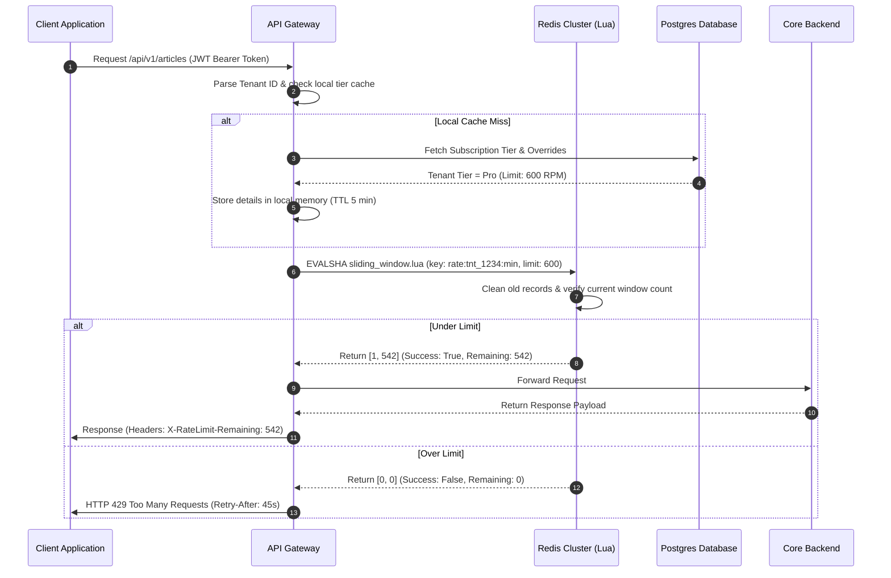

# API Rate Limiting

## Purpose
This document defines the architecture, design, and implementation specifications for API rate limiting across the NewsOps Cloud digital publishing platform. It establishes the policies, tiered limits, sliding-window Redis implementations, header protocols, and administrative control tools required to protect NewsOps Cloud infrastructure from abuse while maintaining API reliability.

## Executive Summary
To protect the NewsOps Cloud ecosystem from resource exhaustion, malicious Denial of Service (DoS) attacks, and unauthorized high-frequency scraping, we employ a highly performant rate limiting framework. Operating at the API Gateway layer, the system checks every request in real time using a Redis-backed sliding-window algorithm. Rate limits are tied to subscription tiers (Free, Pro, Enterprise), with custom overrides allowed for Enterprise clients. The engine delivers rate status headers with each response, executes checks in $< 1.5\text{ ms}$, and fails open to avoid service interruptions during system issues.

## Vision
Our vision is to build an elastic, low-overhead rate limiting infrastructure that serves as a core engine for both platform security and API monetization. By combining high-speed caching layers with real-time subscription sync, the system ensures that developer integrations remain responsive while platform compute costs remain predictable.

## Scope
### In-Scope
* Definition of standard rate limit tiers (Free, Pro, Enterprise).
* Redis sliding-window algorithm design, including Lua implementation scripts.
* Standardized rate limit HTTP headers layout and reset policies.
* Database schemas for rate limit configurations, profiles, and overrides.
* Gateway integration patterns for public, user-session, and machine-to-machine (M2M) authentication types.

### Out-of-Scope
* Network-level DDoS mitigation and IP blacklisting (delegated to Cloudflare WAF/CDN).
* Rate limits for database read-replicas directly (handled via application query limits).
* Editorial user session time-outs (handled via auth tokens).

## Goals
* **Sub-Millisecond Overhead**: The rate checking latency added to each HTTP request must be $< 1.5\text{ ms}$.
* **Concurrency-Safe**: Limit evaluation must be transactionally isolated, protecting against multi-thread race conditions.
* **Granular Visibility**: Developers must receive precise headers detailing their limit status on every call.
* **Fail-Safe Operation**: If the rate-limiting infrastructure experiences database or cache failures, the system must log CRITICAL events and fail open to prevent system downtime.

## Functional Requirements
* **Tier-Based Limits**: Enforce request count limits based on tenant subscription tiers (Free, Pro, Enterprise).
* **Sliding Window Counting**: Track requests using a sliding time window (60-second granularity) instead of a fixed window to prevent end-of-minute traffic spikes.
* **API Key/Token Binding**: Identify and meter traffic using API keys, JWT subscriber IDs, or source IP addresses for unauthenticated routes.
* **Response Header Injection**: Append standard rate limit metadata headers to all outbound API responses.
* **HTTP 429 Rejection**: Reject over-limit calls with HTTP Status 429 Too Many Requests, complete with a structured error payload and a `Retry-After` header.
* **Dynamic Custom Overrides**: Allow administrators to override defaults for specific Enterprise tenants or specific endpoints (e.g., webhook notifications).

## Non-Functional Requirements
* **Throughput Capacity**: The Redis rate limiting service must handle up to 15,000 operations per second.
* **High Availability**: Redis rate limit caches must run in a multi-region cluster (Active-Active or Primary-Replica with Sentinel) with automatic failover.
* **Data Expiration**: Automatically clear rate limit window records using Redis TTL configurations to prevent memory bloat.

## Business Rules
### Rate Limiting Tier Matrix
API access limits are assigned strictly based on the tenant's billing subscription tier:

| Subscription Tier | Window Size | Max Requests (RPM) | Daily Quota (RPD) | Burst Allowance (Max Concurrent) | Soft-Limit Trigger |
|:---|:---|:---|:---|:---|:---|
| **Free** | 60 seconds | 60 | 5,000 | 5 | Email warning at 90% |
| **Pro** | 60 seconds | 600 | 50,000 | 25 | Email warning at 95% |
| **Enterprise** | 60 seconds | 3,000 | 500,000 | 100 | Slack/Webhook Alert at 100% |
| **System M2M** | 60 seconds | 5,000 | 1,000,000 | 150 | Automatic scale alert |

### Override Adjustments
* **Emergency Overrides**: Tenant Administrators may request temporary limit expansions during major breaking news cycles, subject to approval by NewsOps Cloud Operations.
* **Billing Penalties**: If a tenant's subscription status becomes past-due or suspended, their rate limits are automatically demoted to the Free tier limits within 5 minutes.
* **Endpoint Multipliers**: Certain resource-intensive endpoints (e.g., PDF compilation, audio transcript generation) consume 5 units of rate quota per request.

## Actors
* **External Developer**: Integrates third-party applications with NewsOps Cloud APIs and monitors their usage limits.
* **Platform Operator**: Configures base tier limits and grants custom client overrides.
* **API Gateway Enforcer**: System service that intercepts traffic, reads headers, executes checks, and updates headers.
* **Tenant Administrator**: Monitors rate limit consumption in the admin dashboard and manages API keys.

## User Stories
* **User Story 1**: As an External Developer on the Pro tier, I want the system to return standard rate limiting headers with every response so that my application can dynamically back off and prevent HTTP 429 errors during high-throughput synchronization.
* **User Story 2**: As a Platform Operator, I want to apply a custom rate limit profile to a specific Enterprise tenant without affecting other organizations so that we can support their seasonal high-traffic events safely.
* **User Story 3**: As a Tenant Administrator, I want to view historical rate limit usage and trigger events on the developer dashboard so that I can determine if we need to upgrade our subscription tier.

## Acceptance Criteria
* The API Gateway must return an HTTP `429 Too Many Requests` status code with a `Retry-After` header when the request count exceeds the tier limit.
* The API Gateway must inject `X-RateLimit-Limit`, `X-RateLimit-Remaining`, and `X-RateLimit-Reset` headers on every successful (HTTP 2xx/3xx) and failed (HTTP 4xx/5xx) request.
* The rate check lookup overhead must measure $\le 1.5\text{ ms}$ at the 99th percentile under a simulated load of 10,000 requests per second.
* A fallback mechanism must be tested where, if the Redis cache cluster is simulated as completely offline, the gateway fails open and logs a critical alert, allowing requests to pass through without blocking.

## Workflows
### Sliding-Window Rate Limit Verification
1. **Client Request**: A client sends an API request containing an authorization token or API key.
2. **Identification**: The API Gateway extracts the tenant identity, active subscription tier, and token metadata.
3. **Cache Check**: The Gateway calls the Redis cluster using a Lua script with the rate limit parameters.
4. **Lua Logic execution**:
    * Compute the current window sliding boundary (current time minus 60 seconds).
    * Purge sorted set entries older than this boundary.
    * Query the cardinal count of remaining timestamps in the sorted set.
    * If count is less than the limit, add the current timestamp to the sorted set, set key expiration, and return true.
    * If count is equal to or greater than the limit, return false.
5. **Gateway Response Decision**:
    * *Under Limit*: Forward the request to the upstream microservice, compute remaining allocation, and write rate limit headers to the client.
    * *Over Limit*: Prevent backend forwarding, increment the blocked requests counter, and return HTTP 429 immediately.

## API Design
### Rate Limit Status Endpoint
Retrieve current rate limit utilization for the authenticated tenant context.

* **URL**: `/api/v1/rate-limits/status`
* **Method**: `GET`
* **Headers**:
  * `Authorization: Bearer <JWT>`
* **Response Payload (200 OK)**:
```json
{
  "tenantId": "tnt_898a39c-88ab-4a01-b3b3-199cd3f0a1c1",
  "tier": "Pro",
  "rateLimits": [
    {
      "window": "minute",
      "limit": 600,
      "remaining": 542,
      "reset": 1782631234,
      "usagePercentage": 9.67
    },
    {
      "window": "day",
      "limit": 50000,
      "remaining": 42100,
      "reset": 1782672000,
      "usagePercentage": 15.80
    }
  ],
  "overridesActive": false
}
```

### Admin Rate Limit Override Configuration
Allows platform operators to configure custom overrides for a tenant.

* **URL**: `/api/v1/admin/tenants/:tenantId/rate-limit-overrides`
* **Method**: `PUT`
* **Headers**:
  * `Authorization: Bearer <JWT_WITH_ADMIN_ROLE>`
  * `Content-Type: application/json`
* **Request Payload**:
```json
{
  "profileId": "prof_enterprise_default",
  "customRpm": 4500,
  "customRpd": 750000,
  "expiration": "2026-12-31T23:59:59Z",
  "reason": "Breaking news coverage - election night coverage"
}
```
* **Response Payload (200 OK)**:
```json
{
  "overrideId": "ovr_9921827a-cc11-4aab-bc92-1928374656aa",
  "tenantId": "tnt_898a39c-88ab-4a01-b3b3-199cd3f0a1c1",
  "customRpm": 4500,
  "customRpd": 750000,
  "expiration": "2026-12-31T23:59:59Z",
  "status": "active"
}
```

### Rate Limit Header Specs
Every API response must include:
```http
X-RateLimit-Limit: 600
X-RateLimit-Remaining: 542
X-RateLimit-Reset: 1782631234
Retry-After: 45 (Only injected on HTTP 429)
```

## Database Design
To persist base configurations and overrides, the platform utilizes the following database structure:

### Table: `rate_limit_profiles`
```sql
CREATE TABLE rate_limit_profiles (
    profile_id UUID PRIMARY KEY DEFAULT gen_random_uuid(),
    profile_name VARCHAR(100) NOT NULL UNIQUE, -- 'Free', 'Pro', 'Enterprise_Default', 'M2M_Default'
    rpm INT NOT NULL CHECK (rpm > 0),
    rpd INT NOT NULL CHECK (rpd > 0),
    burst_allowance INT NOT NULL CHECK (burst_allowance > 0),
    created_at TIMESTAMP WITH TIME ZONE DEFAULT CURRENT_TIMESTAMP,
    updated_at TIMESTAMP WITH TIME ZONE DEFAULT CURRENT_TIMESTAMP
);

CREATE UNIQUE INDEX idx_profile_name ON rate_limit_profiles(profile_name);
```

### Table: `tenant_rate_limit_overrides`
```sql
CREATE TABLE tenant_rate_limit_overrides (
    override_id UUID PRIMARY KEY DEFAULT gen_random_uuid(),
    tenant_id UUID NOT NULL,
    profile_id UUID REFERENCES rate_limit_profiles(profile_id),
    custom_rpm INT CHECK (custom_rpm > 0),
    custom_rpd INT CHECK (custom_rpd > 0),
    expires_at TIMESTAMP WITH TIME ZONE,
    reason TEXT NOT NULL,
    created_by UUID NOT NULL,
    created_at TIMESTAMP WITH TIME ZONE DEFAULT CURRENT_TIMESTAMP,
    updated_at TIMESTAMP WITH TIME ZONE DEFAULT CURRENT_TIMESTAMP
);

CREATE INDEX idx_override_tenant ON tenant_rate_limit_overrides(tenant_id);
CREATE INDEX idx_override_expiration ON tenant_rate_limit_overrides(expires_at) WHERE expires_at IS NOT NULL;
```

## UI Design
The Rate Limiting and Quota details are rendered in two main locations:
1. **Developer Settings Dashboard**:
    * **Progress Rings**: Visualizes dynamic RPM and RPD allocations remaining.
    * **Interactive Key Grid**: Displays specific access keys and their individual limits.
    * **Graph**: Shows a rolling bar chart mapping requests against the throttle threshold.
2. **Platform Admin Panel**:
    * **Override Manager**: An administrative form allowing ops teams to search by `tenant_id` and apply temporary rate limit overrides with calendar selectors for expiration timestamps.

## Permissions
* `ratelimits:read`: Allows users to inspect their current rate limit configuration and usage metrics.
* `ratelimits:write`: Allows system engineers to adjust global rate limit profile definitions.
* `ratelimits:override`: Admin-only permission to grant custom limits to a tenant.

## Security
* **Key Encryption**: API keys used to authenticate requests must be hashed using SHA-256 before storage in database files; API key lookups are validated using index matches against the hashed value.
* **IP-Rate Limit Isolation**: Authenticated requests are metered by tenant credentials, not by IP address, to prevent IP hijacking or shared NAT firewalls from triggering throttle blocks for enterprise offices. Unauthenticated endpoints fallback to IP checks with strict sliding windows.
* **Redis Command Injection Protection**: Lua scripts use strict parameter typing; client identifiers are sanitized to prevent scripting injections into the Redis engine.

## Performance
* **Redis Lua Script**: Rate evaluation is packaged into a single Lua transaction. This prevents multiple network round trips between the gateway and Redis.
* **Script Pre-loading**: The Lua script is loaded using `SCRIPT LOAD` on API gateway initialization and called using its SHA hash via `EVALSHA` to minimize payload transmission overhead.
* **Fail-Open Gateway Middleware**: If the Redis cluster response time exceeds 10ms, the API Gateway records a circuit breaker trip, bypasses the check, and logs a CRITICAL latency alert while forwarding the customer's request.

### Redis sliding-window Lua implementation:
```lua
-- KEYS[1]: Redis key containing the client's sorted set (e.g., rate:tnt_1234:min)
-- ARGV[1]: Current UNIX timestamp in milliseconds
-- ARGV[2]: Window size in milliseconds (e.g., 60000 for 1 minute)
-- ARGV[3]: Max requests allowed in the window
-- ARGV[4]: Request cost weight (typically 1)

local rate_key = KEYS[1]
local now = tonumber(ARGV[1])
local window = tonumber(ARGV[2])
local max_limit = tonumber(ARGV[3])
local weight = tonumber(ARGV[4])

local clear_before = now - window

-- Remove expired records
redis.call('ZREMRANGEBYSCORE', rate_key, 0, clear_before)

-- Count existing requests
local current_requests = redis.call('ZCARD', rate_key)

if current_requests + weight <= max_limit then
    -- Record each request hit
    for i = 1, weight do
        -- Use a unique member value (timestamp + index) to allow multiples in the same millisecond
        redis.call('ZADD', rate_key, now, now .. "_" .. i)
    end
    -- Set expiry slightly larger than window to ensure self-cleanup
    redis.call('PEXPIRE', rate_key, window + 1000)
    return {1, max_limit - (current_requests + weight)} -- Success, Remaining
else
    return {0, 0} -- Throttled, Remaining
end
```

## Monitoring
* **Prometheus Metric**: `api_rate_limit_hits_total` (Counter tracking total requests metered, labeled by `tenant_id` and `tier`).
* **Prometheus Metric**: `api_rate_limit_blocked_total` (Counter tracking rate limit rejections, labeled by `tenant_id`).
* **Prometheus Metric**: `api_rate_limit_redis_latency_seconds` (Histogram tracking Redis script evaluation time).
* **Alert Trigger**: Trigger CRITICAL alert if `api_rate_limit_blocked_total` accounts for $> 15\%$ of total API gateway traffic over a 5-minute window (potential DDoS or misconfigured integration script).

## Logging
Rate violations are logged using standard JSON outputs:
```json
{"timestamp":"2026-06-27T22:38:54Z","level":"WARN","context":"RateLimiter","tenant_id":"tnt_898a39c-88ab-4a01-b3b3-199cd3f0a1c1","client_ip":"198.51.100.42","rpm_limit":600,"current_rpm":601,"requested_endpoint":"/api/v1/articles","message":"Rate limit exceeded for tenant, rejecting request."}
```

## Error Handling
| Internal Error | HTTP Status | Customer Message |
|:---|:---|:---|
| `RATE_LIMIT_EXCEEDED` | 429 Too Many Requests | Rate limit exceeded. Please back off your request frequency or upgrade your tier. |
| `API_DAILY_QUOTA_EXCEEDED` | 429 Too Many Requests | Daily API quota exceeded. Contact administration to purchase additional allocation. |
| `REDIS_CONNECTION_FAILURE` | 200 OK (Fail Open) | System warning: Rate limit check bypassed due to infrastructure latency. |

## Edge Cases
* **Clustered Clock Drift**: If API gateway servers experience NTP drift, the timestamps passed to Redis might fluctuate. The gateway syncs its system clock with NTP pools hourly; the Redis server clock acts as the ground truth.
* **Concurrent Burst Attacks**: Multiple concurrent requests executing in the exact same millisecond could bypass naive counters. Using the sorted set sliding window Lua script ensures that transactions are serialized at the Redis engine level, eliminating race conditions.
* **Dynamic Tier Upgrades**: If a user pays for an upgrade mid-minute, their metadata key in the Gateway cache is immediately invalidated via Postgres notify listeners, ensuring new limits apply instantly.

## Future Improvements
* **Token Bucket Adaptation**: Support Token Bucket algorithms for dynamic burst handling on specific API routes.
* **Distributed Edge Enforcement**: Integrate Cloudflare Workers to run rate limiting closer to the client, completely bypassing our primary cloud gateways for unauthenticated routes.
* **Adaptive Rate Limiting**: Dynamically lower tenant rate limits during periods of host database memory or CPU exhaustion, raising HTTP 429 status codes system-wide until resource safety margins recover.

## Mermaid Diagrams
### Rate Limit Evaluation Flow


## References
* System Architecture Specifications: [../02-architecture/system_architecture.md](../02-architecture/system_architecture.md)
* Multi-Tenancy Design Standards: [../02-architecture/multi_tenancy_architecture.md](../02-architecture/multi_tenancy_architecture.md)
* Caching Strategy Guidelines: [../02-architecture/caching_strategy.md](../02-architecture/caching_strategy.md)
