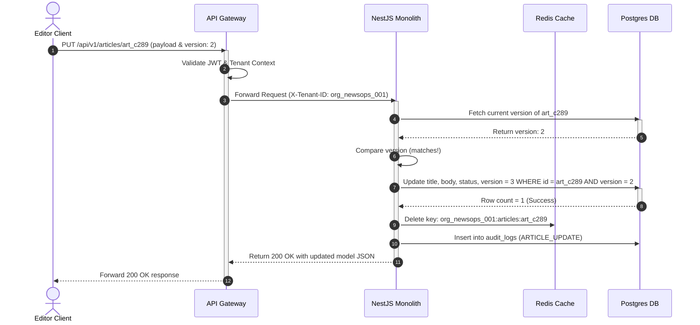

# REST API Specification

## Purpose
This document provides the exhaustive technical specification for the REST API interface of the NewsOps Cloud digital publishing platform. It details resource paths, acceptable HTTP methods, query parameter behaviors (sorting, pagination, filtering), request payloads, and full response JSON structures for core platform resources: Articles, Organizations, Users, and Audits.

## Executive Summary
The REST API serves as the primary system-to-system integration channel and handles core transactional CRUD (Create, Read, Update, Delete) operations. Operating under `/api/v1`, the endpoints enforce multi-tenant separation through token-based tenant extraction and route requests to PostgreSQL schemas. This document details the exact JSON payloads and HTTP statuses that clients must handle, serving as the interface contract between client developers and backend engineering teams.

## Vision
To establish a completely deterministic, REST-compliant API layer utilizing strict HTTP status codes, structured JSON responses, and standardized pagination wrappers that guarantee predictable behavior across all client environments.

## Scope
This specification documents public REST endpoints under `/api/v1` for:
- **Articles**: Content metadata, body, scheduling, and state transitions.
- **Organizations**: Tenant administration, settings, metadata, and billing scopes.
- **Users**: Identity management, role assignments, profile fields.
- **Audits**: System-wide immutable logging of mutations, authentication actions, and exports.

Out of scope are GraphQL operations (documented in `graphql_api_spec.md`) and low-level internal REST routes used exclusively for inter-pod cluster communication.

## Goals
- **Standardized Serialization**: Every response must wrap arrays in metadata envelopes specifying count, page, limits, and links.
- **Robust Parameter Handling**: Enforce clean sorting (`?sort=-createdAt`) and nested filtering structures.
- **Strict Error Modeling**: Use RFC 7807 problem details format for all validation and system error outputs.
- **Predictable Performance**: Optimize schema pathways so that REST endpoints execute within their specified latency budgets.

## Functional Requirements
- **Cursor and Limit Pagination**: Endpoints listing multiple items must support `page`, `limit`, and optional cursor parameters.
- **Soft Deletion**: Article delete endpoints must mark records as `archived` rather than performing physical hard-deletes, unless explicitly requested via query flags.
- **Filter Query Parsers**: Support logical operators (e.g., equality, greater than, lists) in querying articles and audit logs.
- **Audit Logging Integration**: Any POST, PUT, or DELETE request must automatically write a record to the Audit Log service before a 200/201 response is generated.

## Non-Functional Requirements
- **Read Latency**: $95\%$ of read requests (GET) must resolve in $< 80\text{ ms}$ when hitting the Redis cache, and $< 180\text{ ms}$ on direct PostgreSQL reads.
- **Write Latency**: Write operations (POST, PUT, DELETE) must complete inside a $250\text{ ms}$ window.
- **Payload Compression**: All response payloads greater than $1\text{ KB}$ must be compressed using Gzip or Brotli at the API Gateway.
- **Payload Max Limits**: File metadata submissions are limited to $100\text{ KB}$; HTML/JSON body payloads are limited to $10\text{ MB}$.

## Business Rules
- **Cross-Tenant Isolation**: A user authenticated under Tenant A can never query resources belonging to Tenant B. Query parameters attempting to override tenant settings must be ignored.
- **Immutable Audits**: The `/api/v1/audits` resource is read-only. No POST, PUT, or DELETE routes exist for this path.
- **State Transition Guard**: Articles cannot transition straight from `draft` to `published` without first passing through the `under_review` state if the tenant's compliance policy is active.

## Actors
- **Content Editor**: Queries and mutates articles and drafts.
- **Organization Admin**: Manages user profiles, role assignments, and organization configurations.
- **Security Officer**: Queries the audit API to verify compliance and investigate access patterns.
- **Automated Sync Worker**: Issues high-frequency batch requests to update metadata from external systems.

## User Stories (At least 3 specific stories)
- **User Story 1**: As a Content Editor, I want to filter my articles list by state (draft, review, published) and sort by the last updated time so that I can focus on my active assignments.
- **User Story 2**: As an Organization Admin, I want to update an employee's profile and disable their active user status when they leave the team to revoke system access instantly.
- **User Story 3**: As a Security Officer, I want to inspect all changes made to article assets in the last 24 hours so that I can construct a chronological timeline of publication modifications.

## Acceptance Criteria (At least 3-5 criteria with clear thresholds)
- The GET `/api/v1/articles` endpoint must return the items array and a `pagination` envelope containing `totalCount`, `page`, `limit`, and `totalPages`.
- The POST `/api/v1/articles` endpoint must validate the request payload and reject it with a `400 Bad Request` status if the `title` field contains fewer than 5 characters.
- Querying `/api/v1/audits` must restrict records returned to those matching the tenant identifier parsed from the requester's JWT.
- Attempting to update an article that has been modified by another editor during the transaction window must return a `409 Conflict` error code.

## Workflows
```
[ Client App ] --(PUT /api/v1/articles/art_102)--> [ Route Guard & Tenant Extraction ]
                                                            |
                                                   [ Optimistic Lock Check ]
                                                            |
                                                 [ Update Record in DB ]
                                                            |
                                                   [ Log Event to Audits ]
                                                            |
[ Client App ] <-----(200 OK + Updated JSON)-----------------+
```
### Update Article Lifecycle Workflow
1. **Submit Update**: The client submits a PUT request to `/api/v1/articles/art_102` with updated body content and a version field `_version: 3`.
2. **Gateway Interception**: Gateway validates token, extracts tenant `org_newsops_001`, and forwards request.
3. **Optimistic Lock Check**: NestJS service reads existing article record. It compares the payload version with the database record. If the database record version is `3`, it proceeds; if it is `4`, it aborts and returns `409 Conflict`.
4. **Update DB**: The service executes the database update, increments the version to `4`, and clears the cache for `org_newsops_001:articles:art_102`.
5. **Audit Registry**: The system pushes an audit entry to the audit log service detailing that article `art_102` was modified by user `usr_998`.
6. **Return Payload**: The database transaction commits, and the server returns a `200 OK` status with the complete, updated article payload.

## API Design

### Resource: Articles

#### GET `/api/v1/articles`
Fetches a paginated, filtered list of articles.
* **Query Parameters**:
  * `page`: Integer (Default: 1)
  * `limit`: Integer (Default: 20, Max: 100)
  * `sort`: String (e.g., `-updatedAt`, `title` - prefix with minus for descending)
  * `status`: String (e.g., `draft`, `under_review`, `published`)
  * `authorId`: UUID (Filter by author)
* **Response Payload (200 OK)**:
```json
{
  "data": [
    {
      "id": "art_882910a2-cd02-4911-9a2d-b0bc98319aa2",
      "title": "Scaling Monoliths in Multi-Tenant Clouds",
      "slug": "scaling-monolithic-architectures-newsops",
      "body": "<p>Content of the article details go here...</p>",
      "status": "published",
      "authorId": "usr_991823ab-ba82-4112-aa2d-00ffbc912389",
      "organizationId": "org_newsops_001",
      "version": 4,
      "createdAt": "2026-06-27T10:00:00Z",
      "updatedAt": "2026-06-27T12:30:00Z",
      "publishedAt": "2026-06-27T12:30:00Z"
    }
  ],
  "pagination": {
    "totalCount": 1,
    "page": 1,
    "limit": 20,
    "totalPages": 1,
    "hasNextPage": false,
    "hasPreviousPage": false
  }
}
```

#### POST `/api/v1/articles`
Creates a new article in the database.
* **Request Payload**:
```json
{
  "title": "Designing High-Throughput Webhook Engines",
  "slug": "high-throughput-webhook-engines",
  "body": "Markdown or HTML text covering webhook pipelines.",
  "status": "draft",
  "authorId": "usr_991823ab-ba82-4112-aa2d-00ffbc912389"
}
```
* **Response Payload (210 Created)**:
```json
{
  "id": "art_c289bc10-ef12-40bc-98ff-8a02bd98a123",
  "title": "Designing High-Throughput Webhook Engines",
  "slug": "high-throughput-webhook-engines",
  "body": "Markdown or HTML text covering webhook pipelines.",
  "status": "draft",
  "authorId": "usr_991823ab-ba82-4112-aa2d-00ffbc912389",
  "organizationId": "org_newsops_001",
  "version": 1,
  "createdAt": "2026-06-27T22:40:00Z",
  "updatedAt": "2026-06-27T22:40:00Z",
  "publishedAt": null
}
```

#### GET `/api/v1/articles/{id}`
Retrieves a single article by ID.
* **Response Payload (200 OK)**:
```json
{
  "id": "art_c289bc10-ef12-40bc-98ff-8a02bd98a123",
  "title": "Designing High-Throughput Webhook Engines",
  "slug": "high-throughput-webhook-engines",
  "body": "Markdown or HTML text covering webhook pipelines.",
  "status": "draft",
  "authorId": "usr_991823ab-ba82-4112-aa2d-00ffbc912389",
  "organizationId": "org_newsops_001",
  "version": 1,
  "createdAt": "2026-06-27T22:40:00Z",
  "updatedAt": "2026-06-27T22:40:00Z",
  "publishedAt": null
}
```

#### PUT `/api/v1/articles/{id}`
Updates an existing article. Enforces version checks.
* **Request Payload**:
```json
{
  "title": "Designing High-Throughput Webhook Engines (Revised)",
  "body": "Updated body content.",
  "status": "under_review",
  "version": 1
}
```
* **Response Payload (200 OK)**:
```json
{
  "id": "art_c289bc10-ef12-40bc-98ff-8a02bd98a123",
  "title": "Designing High-Throughput Webhook Engines (Revised)",
  "slug": "high-throughput-webhook-engines",
  "body": "Updated body content.",
  "status": "under_review",
  "authorId": "usr_991823ab-ba82-4112-aa2d-00ffbc912389",
  "organizationId": "org_newsops_001",
  "version": 2,
  "createdAt": "2026-06-27T22:40:00Z",
  "updatedAt": "2026-06-27T22:42:00Z",
  "publishedAt": null
}
```

#### DELETE `/api/v1/articles/{id}`
Soft deletes an article.
* **Query Parameters**:
  * `hardDelete`: Boolean (Default: false)
* **Response Payload (204 No Content)**: (Empty body returned)

---

### Resource: Organizations

#### GET `/api/v1/organizations/{id}`
Fetches organizational tenant settings and properties.
* **Response Payload (200 OK)**:
```json
{
  "id": "org_newsops_001",
  "name": "NewsOps Publishing Corp",
  "tier": "enterprise",
  "billingStatus": "active",
  "settings": {
    "customDomain": "publish.newsops.cloud",
    "requireReviewWorkflow": true,
    "allowedLocales": ["en-US", "es-ES", "fr-FR"]
  },
  "createdAt": "2026-01-15T08:00:00Z",
  "updatedAt": "2026-06-01T12:00:00Z"
}
```

#### PUT `/api/v1/organizations/{id}`
Updates organization settings.
* **Request Payload**:
```json
{
  "name": "NewsOps Publishing Corp Extended",
  "settings": {
    "customDomain": "publish.newsops.cloud",
    "requireReviewWorkflow": false,
    "allowedLocales": ["en-US", "es-ES"]
  }
}
```
* **Response Payload (200 OK)**:
```json
{
  "id": "org_newsops_001",
  "name": "NewsOps Publishing Corp Extended",
  "tier": "enterprise",
  "billingStatus": "active",
  "settings": {
    "customDomain": "publish.newsops.cloud",
    "requireReviewWorkflow": false,
    "allowedLocales": ["en-US", "es-ES"]
  },
  "createdAt": "2026-01-15T08:00:00Z",
  "updatedAt": "2026-06-27T22:45:00Z"
}
```

---

### Resource: Users

#### GET `/api/v1/users`
Lists user profiles mapped to the tenant scope.
* **Response Payload (200 OK)**:
```json
{
  "data": [
    {
      "id": "usr_991823ab-ba82-4112-aa2d-00ffbc912389",
      "email": "editor@newsops.com",
      "firstName": "Jane",
      "lastName": "Doe",
      "role": "editor",
      "isActive": true,
      "createdAt": "2026-02-10T09:00:00Z"
    }
  ],
  "pagination": {
    "totalCount": 1,
    "page": 1,
    "limit": 20,
    "totalPages": 1,
    "hasNextPage": false,
    "hasPreviousPage": false
  }
}
```

#### POST `/api/v1/users`
Creates a new tenant user and sends an invitation.
* **Request Payload**:
```json
{
  "email": "writer@newsops.com",
  "firstName": "John",
  "lastName": "Smith",
  "role": "writer"
}
```
* **Response Payload (201 Created)**:
```json
{
  "id": "usr_0012bc09-cd98-48bc-ab01-22bc8910abcd",
  "email": "writer@newsops.com",
  "firstName": "John",
  "lastName": "Smith",
  "role": "writer",
  "isActive": false,
  "createdAt": "2026-06-27T22:50:00Z"
}
```

---

### Resource: Audits (Read-Only)

#### GET `/api/v1/audits`
Queries immutable trail of tenant resource alterations.
* **Query Parameters**:
  * `userId`: UUID (Filter by user acting)
  * `resourceType`: String (e.g., `article`, `user`, `billing`)
  * `startDate`: ISO8601 Timestamp
  * `endDate`: ISO8601 Timestamp
* **Response Payload (200 OK)**:
```json
{
  "data": [
    {
      "id": "aud_77b029ab-102c-4abc-992d-ccff01a0bd39",
      "userId": "usr_991823ab-ba82-4112-aa2d-00ffbc912389",
      "action": "ARTICLE_PUBLISH",
      "resourceId": "art_882910a2-cd02-4911-9a2d-b0bc98319aa2",
      "resourceType": "article",
      "changes": {
        "previousStatus": "under_review",
        "newStatus": "published"
      },
      "ipAddress": "198.51.100.42",
      "userAgent": "Mozilla/5.0 (Windows NT 10.0; Win64; x64) AppleWebKit/537.36",
      "timestamp": "2026-06-27T12:30:00Z"
    }
  ],
  "pagination": {
    "totalCount": 1,
    "page": 1,
    "limit": 20,
    "totalPages": 1,
    "hasNextPage": false,
    "hasPreviousPage": false
  }
}
```

## Database Design
The REST layer interacts directly with the editorial, identity, and audit tables.

### Table: `articles`
* **Fields**:
  * `id`: `UUID` (Primary Key)
  * `tenant_id`: `VARCHAR(100)` (Partition/Tenant boundary key)
  * `title`: `VARCHAR(255)`
  * `slug`: `VARCHAR(255)`
  * `body`: `TEXT`
  * `status`: `VARCHAR(50)`
  * `author_id`: `UUID` (Foreign Key -> `users.id`)
  * `version`: `INTEGER` (Optimistic locking sequence)
  * `deleted_at`: `TIMESTAMP` (Nullable for soft-deletes)
  * `created_at`: `TIMESTAMP`
  * `updated_at`: `TIMESTAMP`
* **Indexes**:
  * `idx_articles_tenant_status` ON (`tenant_id`, `status`)
  * `idx_articles_slug` ON (`slug`)

### Table: `audit_logs`
* **Fields**:
  * `id`: `UUID` (Primary Key)
  * `tenant_id`: `VARCHAR(100)`
  * `user_id`: `UUID`
  * `action`: `VARCHAR(100)`
  * `resource_id`: `VARCHAR(100)`
  * `resource_type`: `VARCHAR(100)`
  * `changes`: `JSONB` (Stores snapshot of delta modifications)
  * `ip_address`: `INET`
  * `timestamp`: `TIMESTAMP` (Default: now())
* **Indexes**:
  * `idx_audit_logs_tenant_timestamp` ON (`tenant_id`, `timestamp` DESC)

## UI Design
- **Articles Grid Interface**: Renders columns mapping to REST fields: ID, title, status badge (green for published, yellow for review, gray for draft), and pagination controllers bound to page-offset routing.
- **User Invite Panel**: Standard form containing text inputs for `email`, `firstName`, `lastName`, and a dropdown selecting roles corresponding to payload validators.
- **Audits Log Terminal**: Search filter inputs for user identity, action types, and calendar picker, binding parameters dynamically to fetch new pages of audit records.

## Permissions
- `articles:read` - Required for fetching list and individual articles.
- `articles:write` - Required for article POST, PUT, and soft-delete commands.
- `articles:purge` - Required to execute hard delete operations (hardDelete=true).
- `users:write` - Required to invite and modify organization members.
- `organizations:write` - Required to update organizational details and settings.
- `audits:read` - Restricted permission to query the tenant's access and update audit records.

## Security
- **JWT Signature Auditing**: Every incoming REST call must carry a bearer token evaluated against JWKS endpoints.
- **Strict Parameter Sanitization**: Query options like `sort` and filters are checked against whitelist schemas (e.g. regex constraints matching `/^[a-zA-Z_]+$/`) to block SQL injection vectors.
- **Input Object Validation**: NestJS `ValidationPipe` parses JSON payloads via Class Validator schemas. No unmapped properties are permitted (`whitelist: true`, `forbidNonWhitelisted: true`).

## Performance
- **Connection Pools**: Max 50 active queries per DB cluster endpoint.
- **Cache-Aside Reads**: Requests targeting `/api/v1/articles/{id}` query Redis first. Cache invalidation runs instantly when a PUT is successful.
- **TPS Metrics**: Target response capacities:
  * GET Articles: $10,000\text{ TPS}$
  * POST/PUT Articles: $1,200\text{ TPS}$
  * GET Audits: $500\text{ TPS}$

## Monitoring
- **Prometheus Metric**: `http_request_duration_seconds` (Histogram mapped by method, path, status, and tenant).
- **Prometheus Metric**: `http_requests_total` (Counter tallying responses).
- **Alert Trigger**: Trigger Alert if HTTP 500 error counts exceed 10 within a 1-minute tracking window.
- **Alert Trigger**: Trigger Warning if p95 response time for `PUT /api/v1/articles/*` exceeds $400\text{ ms}$ over 5 minutes.

## Logging
* **Standard REST Route Ingestion Log**:
```json
{
  "timestamp": "2026-06-27T22:55:00.000Z",
  "trace_id": "tr-293b-5582-aa2d-00ffbc912389",
  "span_id": "sp-rest-102",
  "level": "INFO",
  "context": "RESTController",
  "tenant_id": "org_newsops_001",
  "user_id": "usr_991823ab-ba82-4112-aa2d-00ffbc912389",
  "method": "PUT",
  "url": "/api/v1/articles/art_c289bc10-ef12-40bc-98ff-8a02bd98a123",
  "payload_version": 1,
  "response_status": 200,
  "duration_ms": 112
}
```

## Error Handling
| Internal Error Code | HTTP Status | Customer-Facing Message |
|:---|:---|:---|
| `ERR_REST_VALIDATION_FAILED` | 400 Bad Request | Payload validation failed. Review the errors parameter for details. |
| `ERR_REST_RESOURCE_NOT_FOUND` | 404 Not Found | The requested resource does not exist or has been deleted. |
| `ERR_REST_VERSION_CONFLICT` | 409 Conflict | The resource was modified by another request. Fetch the latest state and retry. |
| `ERR_REST_INSUFFICIENT_PERMISSIONS` | 403 Forbidden | You do not have permissions to perform this action. |

## Edge Cases
- **Optimistic Lock Race Condition**: If two editors try to update an article draft simultaneously, the server detects version mismatch on the second query and returns `409 Conflict`. The UI prompts the user to sync changes.
- **Deep Pagination Performance**: Querying pages $> 1000$ triggers sequential index scans in Postgres. To prevent degradation, the API shifts to cursor-based traversal (`?cursor=art_882910a2`) for large lists.

## Future Improvements
- **OpenAPI Auto-Sync**: Integrate `nestjs/swagger` plugins to generate OpenAPI 3.1 definitions dynamically on build.
- **Hypermedia As The Engine Of Application State (HATEOAS)**: Return next, back, and action links inside resource envelopes to support dynamic navigation.

## Mermaid Diagrams
### REST Article Modification Pipeline


## References
- REST Catalog overview: [index.md](./index.md)
- Database schema details: [../03-database/editorial_and_cms_schema.md](../03-database/editorial_and_cms_schema.md)
- User permission models: [../03-database/identity_and_org_schema.md](../03-database/identity_and_org_schema.md)
- SDK Client Bindings: [sdk_javascript.md](./sdk_javascript.md)
