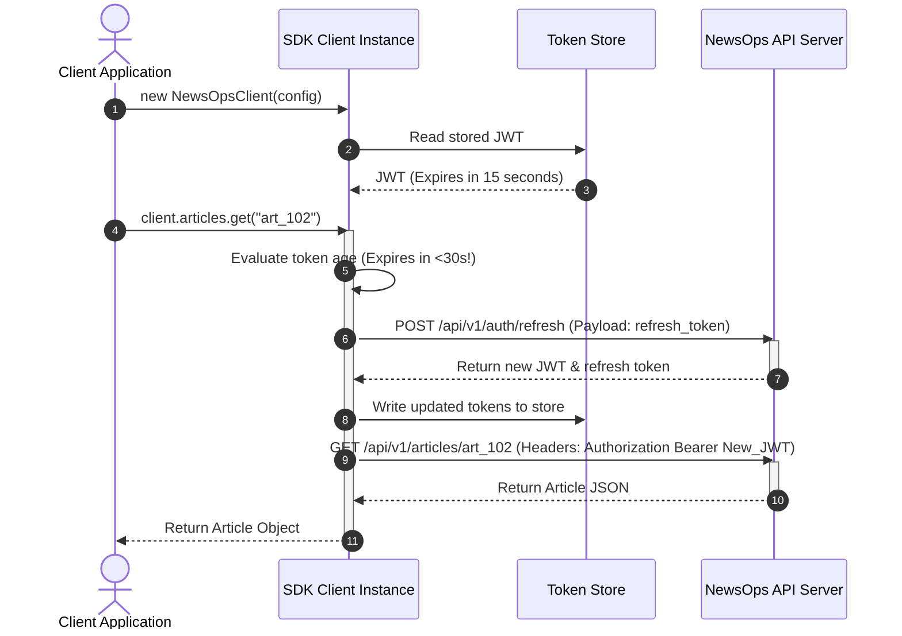

# JavaScript/TypeScript SDK Specification

## Purpose
This document specifies the architecture, client interface definitions, and core patterns for the official NewsOps Cloud JavaScript/TypeScript SDK. It outlines class structures, automatic authorization header injection, token refresh logic, retry policies, and event listener interfaces for WebSocket subscriptions.

## Executive Summary
To lower the entry barrier for external developers and frontend teams, NewsOps Cloud publishes a unified, lightweight, type-safe client library. The SDK acts as an abstraction layer over raw HTTP REST calls and WebSocket GraphQL subscriptions. It handles authentication lifecycles (JWT refresh rotations), respects rate-limiting with automated exponential backoff, manages WebSocket state reconnections, and exports TypeScript interface models matching database tables, helping prevent integration errors.

## Vision
To provide a plug-and-play client library with zero external runtime dependencies that compiles down to a footprint $<20\text{ KB}$ (minified and gzipped) and operates across browsers, Node.js, and Cloudflare Worker environments.

## Scope
This SDK design blueprint covers:
- Core `NewsOpsClient` class structure and initialization parameters.
- Automatic interceptor setups for inserting tokens and tracking traces.
- Client-side token storage strategies and refresh flows.
- Connection retry logic (exponential backoff configuration).
- Event listener interfaces for real-time collaborative updates.

Out of scope are mobile platform-native SDKs (Android/iOS) and server-side frameworks integration plugins (e.g., NestJS middleware wrappers).

## Goals
- **End-to-End Type Safety**: Export full TypeScript typings for all request inputs and API response structures.
- **Resilient Transport Layer**: Automate token renewal, rate-limit throttling, and connection drops recovery.
- **Universal Compatibility**: Support both CommonJS (`require`) and ES Modules (`import`) loading schemes.
- **Simple Socket Event Binding**: Expose callback event triggers for WebSockets subscriptions.

## Functional Requirements
- **Unified Client Instantiation**: Single constructor configuring endpoints, keys, and timeout settings.
- **Automatic JWT Rotation**: Intercept expired token requests, execute refresh cycles, and retry the initial request.
- **Query / Mutation Wrappers**: Expose direct helper functions (e.g. `client.articles.list()`, `client.articles.publish()`) mapping to REST endpoints.
- **GraphQL Executor**: Expose raw query and mutation handlers for custom GraphQL structures.
- **Real-Time Subscriptions**: Provide direct hooks to caret tracking and presence events using WebSockets.

## Non-Functional Requirements
- **Bundle Footprint**: Target bundle size must remain $< 25\text{ KB}$ minified, and $< 10\text{ KB}$ gzipped.
- **Latency Overhead**: Local SDK logic execution time must be under $1\text{ ms}$ per request.
- **Engine Support**: Target environments include ES6 compliant browsers, Node.js 18+, and standard Edge runtimes.
- **Timeout Defaults**: Default client-side request timeout is configured at $10,000\text{ ms}$.

## Business Rules
- **One Active WebSocket Connection**: To conserve server resources, the SDK must pool subscription connections, routing multiple active subscription queries over a single shared WebSocket connection.
- **Explicit Opt-in Retries**: Write requests (POST/PUT/DELETE) that fail due to connection dropouts are not retried unless the request is explicitly flagged as idempotent.
- **Tenant Scope Enforcement**: The SDK must validate that the `tenantId` parameter is defined at instantiation, preventing orphaned requests.

## Actors
- **Frontend Developer**: Integrates the SDK into React, Vue, or Angular CMS interfaces.
- **Scripting Engineer**: Employs the SDK in Node.js to write cron synchronization scripts.
- **Quality Assurance Engineer**: Simulates offline states and rate limits to verify SDK resiliency.

## User Stories (At least 3 specific stories)
- **User Story 1**: As a Frontend Developer, I want the SDK to handle token refresh cycles in the background so that content writers are never interrupted by authentication prompts mid-draft.
- **User Story 2**: As a Scripting Engineer, I want the SDK to automatically retry operations when it hits rate limits so that my automation script doesn't abort during heavy peak traffic.
- **User Story 3**: As a Frontend Developer, I want to use standard events syntax (like `.on('caretUpdated')`) to receive real-time cursor indexes, so that I can render other users' cursors without writing custom WebSocket connection code.

## Acceptance Criteria (At least 3-5 criteria with clear thresholds)
- The SDK must successfully resolve an expired JWT by querying `/api/v1/auth/refresh`, replacing the token, and completing the blocked request without returning errors to the user.
- If the SDK receives a `429 Too Many Requests` response containing `Retry-After: 3`, it must wait exactly 3 seconds before executing its next retry attempt.
- The SDK must automatically attempt reconnection of dropped WebSocket streams up to 5 times, spacing attempts out with exponential backoff (e.g. 1s, 2s, 4s, 8s, 16s).
- Calling REST helper functions must support passing options objects containing headers, AbortControllers, and custom timeouts.

## Workflows
```
[ Client App ] ---> [ SDK Client Method ] ---> [ Validate Token Cache ]
                                                    |
         +-------------------(Valid)----------------+-----(Expired)
         v                                                v
[ Inject JWT Header ]                            [ Trigger Refresh API ]
         |                                                |
[ Send Fetch Request ]                           [ Save New JWT in Cache ]
         |                                                |
[ Intercept HTTP response ]                      [ Retry Initial Request ]
         |
  +------+-------+
  | (200)        | (429 / Timeout)
  v              v
[ Return Data ]  [ Run Retry Decider Loop ] ---> [ Delay / Re-issue ]
```
### Client Request Lifecycle and Token Refresh Workflow
1. **Method Invocation**: Frontend app calls `client.articles.get('art_102')`.
2. **Pre-Request Verification**: The SDK retrieves the cached JWT from its local memory store. It decodes the payload's expiration claim (`exp`).
3. **Trigger Token Renewal**: If the token is within 30 seconds of expiration, the SDK queues the request, makes a call to the refresh token endpoint, and updates the local token store with the new JWT.
4. **Header Injections**: The SDK injects the `Authorization: Bearer <jwt_token>` and `X-Tenant-ID: <tenantId>` headers. It also appends tracking parameters (e.g., `x-trace-id`).
5. **Issue Fetch**: The SDK sends the request. If the call succeeds, it returns the JSON response.
6. **Rate-Limit Interception**: If the response is `429`, the SDK reads `Retry-After`, checks if the retry counter is below the maximum allowed, delays execution, and retries the call.

## API Design

### Client Specification (TypeScript)

The SDK exposes the main `NewsOpsClient` class. Below are the class, interface, and event listener declarations.

```typescript
export interface NewsOpsConfig {
  tenantId: string;
  baseUrl?: string;
  timeout?: number;
  maxRetries?: number;
  tokenStore?: TokenStore;
}

export interface TokenStore {
  getToken: () => Promise<string | null>;
  setToken: (token: string) => Promise<void>;
  getRefreshToken: () => Promise<string | null>;
  setRefreshToken: (token: string) => Promise<void>;
}

export interface Article {
  id: string;
  title: string;
  slug: string;
  body: string;
  status: 'draft' | 'under_review' | 'published' | 'archived';
  authorId: string;
  version: number;
  createdAt: string;
  updatedAt: string;
}

export interface CaretPosition {
  userId: string;
  userName: string;
  anchorIndex: number;
  focusIndex: number;
  color: string;
}

export type WebhookEvent = 'article.published' | 'article.deleted' | 'user.created';

export class NewsOpsClientError extends Error {
  constructor(
    public statusCode: number,
    public errorCode: string,
    message: string
  ) {
    super(message);
    this.name = 'NewsOpsClientError';
  }
}

export class NewsOpsClient {
  private jwtToken: string | null = null;
  private config: Required<NewsOpsConfig>;
  private socket: any = null;
  private listeners: Map<string, Set<Function>> = new Map();

  public articles: ArticlesModule;
  public webhooks: WebhooksModule;

  constructor(config: NewsOpsConfig) {
    this.config = {
      tenantId: config.tenantId,
      baseUrl: config.baseUrl || 'https://api.newsops.cloud',
      timeout: config.timeout || 10000,
      maxRetries: config.maxRetries || 3,
      tokenStore: config.tokenStore || new InMemoryTokenStore()
    };
    
    this.articles = new ArticlesModule(this);
    this.webhooks = new WebhooksModule(this);
  }

  // Raw REST execution wrapper
  public async request<T>(
    path: string, 
    method: 'GET' | 'POST' | 'PUT' | 'DELETE' = 'GET', 
    body?: any,
    options: { headers?: Record<string, string>; isIdempotent?: boolean } = {}
  ): Promise<T> {
    let attempt = 0;
    
    while (attempt <= this.config.maxRetries) {
      try {
        await this.checkAndRefreshToken();
        
        const controller = new AbortController();
        const timeoutId = setTimeout(() => controller.abort(), this.config.timeout);
        
        const headers: Record<string, string> = {
          'Content-Type': 'application/json',
          'X-Tenant-ID': this.config.tenantId,
          ...options.headers
        };
        
        if (this.jwtToken) {
          headers['Authorization'] = `Bearer ${this.jwtToken}`;
        }

        const response = await fetch(`${this.config.baseUrl}${path}`, {
          method,
          headers,
          body: body ? JSON.stringify(body) : undefined,
          signal: controller.signal
        });
        
        clearTimeout(timeoutId);

        if (response.ok) {
          return (await response.json()) as T;
        }

        if (response.status === 429) {
          const retryAfter = parseInt(response.headers.get('Retry-After') || '2', 10);
          attempt++;
          if (attempt <= this.config.maxRetries) {
            await this.sleep(retryAfter * 1000);
            continue;
          }
        }

        const errPayload = await response.json().catch(() => ({}));
        throw new NewsOpsClientError(
          response.status,
          errPayload.errorCode || 'ERR_UNKNOWN',
          errPayload.message || 'Request execution failed'
        );
      } catch (err: any) {
        if (err.name === 'AbortError') {
          throw new NewsOpsClientError(408, 'ERR_REQUEST_TIMEOUT', 'Request timed out');
        }
        
        if (err instanceof NewsOpsClientError) {
          throw err;
        }

        attempt++;
        if (attempt > this.config.maxRetries || (method !== 'GET' && !options.isIdempotent)) {
          throw new NewsOpsClientError(500, 'ERR_NETWORK_FAILURE', err.message || 'Network error');
        }
        
        await this.sleep(Math.pow(2, attempt) * 200);
      }
    }
    
    throw new NewsOpsClientError(500, 'ERR_RETRIES_EXHAUSTED', 'Maximum retries reached');
  }

  // Real-Time WebSockets & Subscriptions binding
  public connectSocket(): Promise<void> {
    return new Promise((resolve, reject) => {
      if (this.socket) {
        return resolve();
      }
      
      const wsUrl = this.config.baseUrl.replace(/^http/, 'ws') + '/graphql';
      this.socket = new WebSocket(wsUrl, 'graphql-transport-ws');
      
      this.socket.onopen = async () => {
        const token = await this.config.tokenStore.getToken();
        this.socket.send(JSON.stringify({
          type: 'connection_init',
          payload: { Authorization: `Bearer ${token}` }
        }));
      };

      this.socket.onmessage = (event: MessageEvent) => {
        const msg = JSON.parse(event.data);
        
        if (msg.type === 'connection_ack') {
          resolve();
        }
        
        if (msg.type === 'next') {
          const eventName = msg.payload.data.eventName;
          const data = msg.payload.data.payload;
          this.trigger(eventName, data);
        }
      };

      this.socket.onerror = (err: any) => {
        reject(err);
      };
    });
  }

  public subscribeToCaret(articleId: string, callback: (caret: CaretPosition) => void): void {
    this.connectSocket().then(() => {
      this.socket.send(JSON.stringify({
        id: `sub_${articleId}`,
        type: 'subscribe',
        payload: {
          query: `subscription { caretUpdated(articleId: "${articleId}") { userId anchorIndex focusIndex } }`
        }
      }));
      this.on(`caretUpdated:${articleId}`, callback);
    });
  }

  // Internal Event Listener Pattern
  public on(event: string, callback: Function): void {
    if (!this.listeners.has(event)) {
      this.listeners.set(event, new Set());
    }
    this.listeners.get(event)!.add(callback);
  }

  public off(event: string, callback: Function): void {
    if (this.listeners.has(event)) {
      this.listeners.get(event)!.delete(callback);
    }
  }

  private trigger(event: string, data: any): void {
    if (this.listeners.has(event)) {
      this.listeners.get(event)!.forEach(cb => cb(data));
    }
  }

  private async checkAndRefreshToken(): Promise<void> {
    const token = await this.config.tokenStore.getToken();
    if (!token) return;

    const payload = JSON.parse(atob(token.split('.')[1]));
    const now = Math.floor(Date.now() / 1000);
    
    if (payload.exp - now < 30) {
      const refresh = await this.config.tokenStore.getRefreshToken();
      const res = await fetch(`${this.config.baseUrl}/api/v1/auth/refresh`, {
        method: 'POST',
        headers: { 'Content-Type': 'application/json', 'X-Tenant-ID': this.config.tenantId },
        body: JSON.stringify({ refreshToken: refresh })
      });
      
      if (res.ok) {
        const body = await res.json();
        await this.config.tokenStore.setToken(body.token);
        await this.config.tokenStore.setRefreshToken(body.refreshToken);
        this.jwtToken = body.token;
      }
    } else {
      this.jwtToken = token;
    }
  }

  private sleep(ms: number): Promise<void> {
    return new Promise(resolve => setTimeout(resolve, ms));
  }
}

// Module subdivisions
class ArticlesModule {
  constructor(private client: NewsOpsClient) {}

  public async list(page = 1, limit = 20): Promise<{ data: Article[] }> {
    return this.client.request<{ data: Article[] }>(`/api/v1/articles?page=${page}&limit=${limit}`);
  }

  public async get(id: string): Promise<Article> {
    return this.client.request<Article>(`/api/v1/articles/${id}`);
  }

  public async create(data: Partial<Article>): Promise<Article> {
    return this.client.request<Article>('/api/v1/articles', 'POST', data);
  }
}

class WebhooksModule {
  constructor(private client: NewsOpsClient) {}
  
  public async createSubscription(url: string, events: WebhookEvent[]): Promise<any> {
    return this.client.request<any>('/api/v1/webhooks/subscriptions', 'POST', { url, subscribedEvents: events });
  }
}

class InMemoryTokenStore implements TokenStore {
  private token: string | null = null;
  private refresh: string | null = null;
  
  async getToken() { return this.token; }
  async setToken(t: string) { this.token = t; }
  async getRefreshToken() { return this.refresh; }
  async setRefreshToken(t: string) { this.refresh = t; }
}
```

## Database Design
Since this is a client SDK running in browser and server runtimes, the database design refers to the client-side local caching and state management layers.

### Client-Side State Model
- **LocalStorage Storage Keys**:
  * `newsops:auth_token`: String (JWT).
  * `newsops:refresh_token`: String (Rotation refresh UUID/JWT).
- **Session Cache (LRU)**: Configured in the browser memory to store recently requested Article objects, indexed by article ID.
- **WebSocket Message Cache**: Holds outbound subscription request bodies to replay them if the socket connection encounters a transport disconnect.

## UI Design
- **React Hook Implementation**: Wrap the SDK client creation in a hook, providing loading flags and reactive state variables:
```typescript
export function useNewsOpsArticle(articleId: string) {
  const [article, setArticle] = useState<Article | null>(null);
  const [loading, setLoading] = useState(true);

  useEffect(() => {
    client.articles.get(articleId)
      .then(setArticle)
      .finally(() => setLoading(false));
  }, [articleId]);

  return { article, loading };
}
```

## Permissions
The SDK inspects local client permissions embedded within the token claims payload:
- `client.hasPermission('articles:write')` executes client-side visibility rules (e.g. graying out buttons) before any network calls occur.

## Security
- **Token Leakage Prevention**: Advise developers to utilize secure token storage wrappers rather than native localStorage to mitigate Cross-Site Scripting (XSS) extraction threats.
- **HttpOnly Cookies support**: Enable configuring the client with `{ credentials: 'include' }` flags, permitting token storage within HttpOnly cookies managed by the browser directly.
- **Trace Context Integrity**: Auto-generate `traceparent` headers to propagate correlation IDs across boundaries.

## Performance
- **Optimized Tree-Shaking**: Code architecture allows compilation systems to prune unused modules (e.g., stripping the Webhook modules if the app only reads articles).
- **Resolver Batching**: Resolves local calls concurrently using `Promise.all()` to limit execution times.
- **Bundle Footprint Target**: Bundle compiles down to $< 18\text{ KB}$ minified.

## Monitoring
- **Error Propagation Hook**: Allow applications to inject a reporting listener: `client.on('error', (err) => Sentry.captureException(err))`.
- **SDK Action Telemetry**: Add telemetry header tracking version metrics: `X-NewsOps-SDK: JS-v1.4.2`.

## Logging
* **Client Verbose Console Logs**:
```
[NewsOps SDK][10:14:02] Initiating POST request to /api/v1/articles
[NewsOps SDK][10:14:03] Response 429 received. Throttling for 3000ms.
[NewsOps SDK][10:14:06] Retrying POST request to /api/v1/articles - Attempt 2
[NewsOps SDK][10:14:06] Success: 201 Created.
```

## Error Handling
| Raw HTTP Code | SDK Class Error | Application Action |
|:---|:---|:---|
| `401` | `NewsOpsClientError` (`ERR_UNAUTHORIZED`) | Evict local token store caches and route the user to login interface. |
| `409` | `NewsOpsClientError` (`ERR_CONFLICT`) | Prompt user: "This article has been edited. Merge your revisions." |
| `429` | `NewsOpsClientError` (`ERR_RATE_LIMIT`) | Thrown only after all local max retry configurations are exhausted. |

## Edge Cases
- **Simultaneous Token Expirations**: If 5 parallel HTTP calls are issued while the JWT is expired, the SDK uses a lock mechanism to resolve the refresh route once, updating the key before releasing the other 4 pending requests.
- **Complete Loss of Internet**: WebSockets transition to an offline state and listen for the browser's `online` event window to automatically run reconnection handshakes.

## Future Improvements
- **Offline Mode Support**: Support local article draft storage in IndexedDB when offline, syncing mutations to the database when a connection is restored.
- **Vue / Angular Framework Adapters**: Launch custom binding packages containing plugins for reactive framework wrappers.

## Mermaid Diagrams
### SDK Client Initialization and Auto-Refresh Network Flow


## References
- Core REST catalog: [rest_api_spec.md](./rest_api_spec.md)
- GraphQL WebSockets API specification: [graphql_api_spec.md](./graphql_api_spec.md)
- Root API Directory: [index.md](./index.md)
