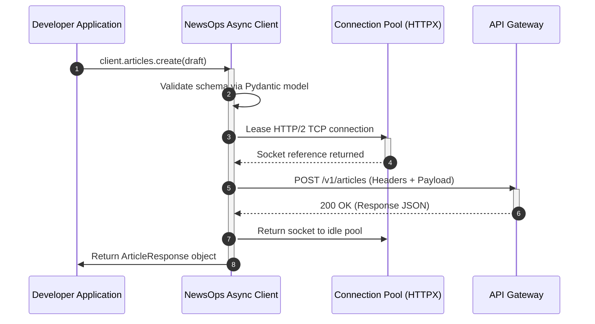

# Python SDK Architecture

## Purpose
This document specifies the architecture, module designs, connection pooling mechanisms, asynchronous runtime interfaces, and error mapping patterns of the NewsOps Cloud Python Software Development Kit (SDK). The SDK is designed to provide Python developers with a performant, type-safe, and idiopathic interface for programmatic interactions with the NewsOps Cloud digital publishing platform.

## Executive Summary
The NewsOps Cloud Python SDK is a library that wraps the NewsOps Cloud REST and WebSocket APIs. Key architecture choices include:
*   An **Asynchronous Core** powered by `asyncio` and `httpx` for high-throughput I/O workflows.
*   An **Adaptive Connection Pool** that implements keep-alive optimization and HTTP/2 multiplexing.
*   A **Hierarchical Exception Map** matching HTTP status codes to native Python exceptions.
*   **Pydantic v2 Models** for request and response serialization, validating schemas client-side to minimize unnecessary server load.
*   Thread-safe thread-pool executors for synchronous compatibility wrappers.

## Vision
To establish the Python SDK as the primary tool for data science, automated publishing, machine learning, and CI/CD operations inside the NewsOps ecosystem. Future iterations will support compiled Rust bindings (via PyO3) for high-performance serializations and direct gRPC transport channels.

## Scope
The scope of this document encompasses:
*   Asynchronous and Synchronous client class structures.
*   Connection pooling configurations and HTTP keep-alive settings.
*   Serialization and validation rules using Pydantic.
*   Custom exceptions and runtime error mappings.
*   Authentication context state management (dynamic Bearer token injection and caching).

Out of Scope:
*   Node.js, Go, or Ruby SDK specifications (handled in separate SDK architectural manifests).
*   The internal architecture of the NewsOps server-side routing components.

## Goals
*   **Low Latency Overhead**: Client-side serialization and connection dispatch must introduce less than $1.5\text{ ms}$ of overhead.
*   **Resource Efficiency**: Re-use $98\%$ of TCP connections for sequential API calls via persistent pools.
*   **Type Safety**: Achieve 100% static analysis compatibility with `mypy` and `pyright` strict-mode checks.
*   **Robust Retry Resilience**: Out-of-the-box exponential backoff with full jitter to handle transient network outages and rate limits.

## Functional Requirements
1.  **Authentication Contexts**: The SDK must support dynamic API token injection, static JWT tokens, and OAuth2 flow handling.
2.  **Async/Sync Coexistence**: Developers must be able to use either `asyncio` contexts (`AsyncNewsOpsClient`) or synchronous worker threads (`NewsOpsClient`).
3.  **CRUD Wrappers**: Clean Python methods mapping to core resources: Articles (`articles`), Deployments (`deployments`), Media (`media`), Tenants (`tenants`), and Tasks (`tasks`).
4.  **Streaming Endpoints**: Support for server-sent events (SSE) and WebSockets for monitoring deployment progress and tailing server-side log lines.
5.  **Automatic Token Rotation**: Detect expired JWTs client-side, execute token refreshes via refresh endpoints, and retry aborted requests seamlessly.

## Non-Functional Requirements
1.  **Thread Safety**: The client instance must be safe to share across multi-threaded applications without resource leaks.
2.  **Throughput Target**: Maintain a target of $5,000$ client-initiated operations per second under an asynchronous event loop.
3.  **Python Version Support**: Compatible with Python 3.9, 3.10, 3.11, and 3.12.
4.  **Zero External Subprocess Dependency**: The library must be purely self-contained, using only pure Python and standard C-extensions (`httpx`, `pydantic`).

## Business Rules
1.  **User-Agent Requirements**: Every request must carry a standardized `User-Agent` header containing the SDK version, OS info, and python interpreter details (`User-Agent: newsops-sdk-python/v1.2.0 (CPython 3.11.2; Windows)`).
2.  **Tenant Context Constraints**: Every request must attach a `X-Tenant-ID` header if the authentication token spans multiple organizations, defaulting to the primary organization.
3.  **Rate Limiting Compliance**: The client must intercept HTTP `429 Too Many Requests` responses, parse the `Retry-After` header, and halt client queue dispatches for the designated duration.

## Actors
*   **Data Engineer / ML Scientist**: Automates publishing pipelines, trains sentiment models, and performs bulk migrations.
*   **DevOps/CI Engineer**: Configures automated deploy pipelines, monitors deployments via logs, and validates system health.
*   **Application Developer**: Integrates NewsOps publishing capabilities directly into custom content hubs and internal CMS tools.

## User Stories (At least 3 specific stories)
*   **User Story 1 - Async Pipeline**: As a Data Engineer, I want to use `AsyncNewsOpsClient` to concurrently upload 200 translated drafts to the CMS so that I can complete the content migration window in under 10 seconds.
*   **User Story 2 - Resilient Log Tailing**: As a DevOps Engineer, I want to execute a script using the SDK that tails active deployment logs and automatically handles connection timeouts by re-establishing WebSocket subscriptions with backoff.
*   **User Story 3 - Custom Type Checking**: As an Application Developer, I want my IDE to immediately flag invalid payload parameters (e.g., passing an integer to `title`) when writing a publishing script, using inline Type Hinting and Pydantic warnings.

## Acceptance Criteria (At least 3-5 criteria with clear thresholds)
1.  The client MUST reuse TCP connections; verifying via HTTP logs that only $1$ TCP handshake is performed for $50$ sequential GET requests to the same endpoint.
2.  If a rate limit HTTP status `429` is received, the SDK MUST wait exactly the number of seconds specified in the `Retry-After` header before retrying the call.
3.  Memory footprints of the client instance must remain stable, with RSS memory usage variations $< 5\text{ MB}$ over $100,000$ continuous request loops.
4.  Invalid fields on response schemas must raise a structured `ValidationError` containing the parameter path, value, and expected type without executing server-side commands.

## Workflows (Step-by-step description of system and user interactions)
### Client Initialization and Authenticated Call
1.  **Instantiation**: The user creates an instance of `AsyncNewsOpsClient(api_key="nop_sec_...")`.
2.  **Validation**: The SDK validates format properties of the key (prefix checks) and initializes the underlying `httpx.AsyncClient` with a connection pool.
3.  **API Call Dispatch**: The user invokes `await client.articles.publish(article_id="art-882")`.
4.  **Serialization**: The request payload is compiled into a Pydantic model (`ArticlePublishRequest`) and serialized to JSON.
5.  **Headers and Credentials Injection**: The client adds the dynamic Authorization headers (`Bearer nop_sec_...`) and telemetry parameters.
6.  **Connection Pool Lease**: The client borrows an active TCP socket from the connection pool. If none are idle, it opens a new connection.
7.  **HTTP Transmission**: The request is transmitted over HTTPS/2.
8.  **Response Handling**: The server responds with `200 OK`. The client parses the JSON response into `ArticleModel` and returns the object to the caller.
9.  **Connection Release**: The socket is returned to the `httpx` pool for future requests.

## API Design

### SDK Class Interface (Python)
Below is the core class design for the SDK.

```python
import asyncio
from typing import List, Optional, Dict, Any
from pydantic import BaseModel, Field, HttpUrl
import httpx

class SDKConfig(BaseModel):
    base_url: str = "https://api.newsops.cloud/v1"
    api_key: str
    tenant_id: Optional[str] = None
    timeout: float = 30.0
    max_connections: int = 100
    max_keepalive_connections: int = 20
    keepalive_expiry: float = 5.0
    retry_max_attempts: int = 3
    retry_backoff_factor: float = 0.5

class ArticleDraft(BaseModel):
    title: str = Field(..., min_length=5, max_length=255)
    content: str
    summary: Optional[str] = None
    author_id: str
    tags: List[str] = Field(default_factory=list)

class ArticleResponse(BaseModel):
    id: str
    title: str
    content: str
    summary: Optional[str]
    status: str
    author_id: str
    created_at: str
    updated_at: str

class NewsOpsException(Exception):
    """Base exception for all NewsOps SDK errors."""
    def __init__(self, message: str, status_code: Optional[int] = None, details: Optional[Dict[str, Any]] = None):
        super().__init__(message)
        self.message = message
        self.status_code = status_code
        self.details = details or {}

class UnauthorizedError(NewsOpsException):
    """Raised on HTTP 401 unauthorized errors."""

class ForbiddenError(NewsOpsException):
    """Raised on HTTP 403 forbidden errors."""

class NotFoundError(NewsOpsException):
    """Raised on HTTP 404 not found errors."""

class RateLimitError(NewsOpsException):
    """Raised on HTTP 429 rate limit exceeded errors."""

class InternalServerError(NewsOpsException):
    """Raised on HTTP 500/502/503/504 errors."""

class ArticleService:
    def __init__(self, client: "AsyncNewsOpsClient"):
        self._client = client

    async def create(self, draft: ArticleDraft) -> ArticleResponse:
        url = "/articles"
        payload = draft.model_dump()
        response_data = await self._client._request("POST", url, json=payload)
        return ArticleResponse(**response_data)

    async def get(self, article_id: str) -> ArticleResponse:
        url = f"/articles/{article_id}"
        response_data = await self._client._request("GET", url)
        return ArticleResponse(**response_data)

class AsyncNewsOpsClient:
    def __init__(self, config: SDKConfig):
        self.config = config
        self.headers = {
            "Authorization": f"Bearer {self.config.api_key}",
            "Content-Type": "application/json",
            "User-Agent": f"newsops-sdk-python/v1.0.0",
        }
        if self.config.tenant_id:
            self.headers["X-Tenant-ID"] = self.config.tenant_id

        # Connection pooling config within HTTPX limits
        limits = httpx.Limits(
            max_connections=self.config.max_connections,
            max_keepalive_connections=self.config.max_keepalive_connections,
            keepalive_expiry=self.config.keepalive_expiry
        )
        self._http_client = httpx.AsyncClient(
            base_url=self.config.base_url,
            headers=self.headers,
            limits=limits,
            timeout=self.config.timeout,
            http2=True
        )
        
        # Service initializations
        self.articles = ArticleService(self)

    async def __aenter__(self):
        return self

    async def __aexit__(self, exc_type, exc_val, exc_tb):
        await self.close()

    async def close(self):
        await self._http_client.aclose()

    async def _request(self, method: str, path: str, **kwargs) -> Any:
        attempts = 0
        while attempts < self.config.retry_max_attempts:
            try:
                response = await self._http_client.request(method, path, **kwargs)
                return self._handle_response(response)
            except (httpx.ConnectTimeout, httpx.ConnectError) as exc:
                attempts += 1
                if attempts >= self.config.retry_max_attempts:
                    raise InternalServerError(f"Connection failed after {attempts} attempts", details={"error": str(exc)})
                backoff_time = self.config.retry_backoff_factor * (2 ** attempts)
                await asyncio.sleep(backoff_time)
            except RateLimitError as exc:
                attempts += 1
                if attempts >= self.config.retry_max_attempts:
                    raise exc
                # Retrieve standard retry-after value, default to exponential backoff
                retry_after = exc.details.get("retry_after", self.config.retry_backoff_factor * (2 ** attempts))
                await asyncio.sleep(float(retry_after))

    def _handle_response(self, response: httpx.Response) -> Any:
        status_code = response.status_code
        if 200 <= status_code < 300:
            return response.json()
        
        # Build systematic error contexts
        error_payload = {}
        try:
            error_payload = response.json()
        except ValueError:
            error_payload = {"error": response.text}

        if status_code == 401:
            raise UnauthorizedError("Invalid or expired API Key", status_code, error_payload)
        elif status_code == 403:
            raise ForbiddenError("Insufficient permissions to complete action", status_code, error_payload)
        elif status_code == 404:
            raise NotFoundError("Resource not found", status_code, error_payload)
        elif status_code == 429:
            retry_after = response.headers.get("Retry-After", "5.0")
            error_payload["retry_after"] = retry_after
            raise RateLimitError("Rate limit exceeded", status_code, error_payload)
        else:
            raise InternalServerError(f"Server returned error code {status_code}", status_code, error_payload)
```

## Database Design
While the SDK runs client-side, the server-side API Gateway utilizes tables to authorize SDK access, validate tokens, and log operations.

### Table: `client_api_keys`
Stores API keys issued to users/systems for SDK authorization.

| Field Name | Data Type | Constraints | Description |
|:---|:---|:---|:---|
| `key_id` | UUID | PRIMARY KEY, DEFAULT gen_random_uuid() | Unique identifier for lookup |
| `key_hash` | VARCHAR(256) | NOT NULL, UNIQUE | Sha-256 hashed api key matching value sent by client |
| `tenant_id` | UUID | NOT NULL, FK to `tenants` | Organization context |
| `user_id` | UUID | NOT NULL, FK to `users` | Owner of the API Key |
| `scopes` | VARCHAR(64)[] | NOT NULL | String array of authorized actions |
| `is_active` | BOOLEAN | DEFAULT TRUE | Revocation flag |
| `expires_at` | TIMESTAMP | NULLABLE | Expiry time |
| `created_at` | TIMESTAMP | DEFAULT NOW() | Generation timestamp |
| `last_used_at`| TIMESTAMP | NULLABLE | SDK connection telemetry |

Indexes:
*   `idx_apikey_hash`: Hash index on `key_hash` for fast cryptographic authorization.
*   `idx_apikey_tenant_status`: Compound index on (`tenant_id`, `is_active`) to filter active organization nodes.

## UI Design
The Python SDK does not contain a graphical user interface. However, it ships with an Interactive Python Shell (`python -m newsops_sdk.shell`) providing terminal outputs:

```text
============================================================
           NEWSOPS CLOUD INTERACTIVE PYTHON SHELL           
============================================================
SDK Version: v1.0.0 | Python: 3.11.2 | OS: Windows 11
Connected to: https://api.newsops.cloud/v1
Tenant: tenant_sports_daily (Active)
------------------------------------------------------------
Available commands:
  - client.articles.get(article_id)
  - client.articles.create(draft)
  - show_config()
  - tail_logs()

>>> import newsops_sdk
>>> client = newsops_sdk.AsyncNewsOpsClient(api_key="nop_sec_...")
>>> [INFO] Connection established successfully (Keep-alive pool pre-warmed)
>>> 
```

## Permissions
The dynamic scopes evaluated during SDK operations are defined below:
*   `articles:read`: Read article drafts and published posts.
*   `articles:write`: Create, edit, and delete article drafts.
*   `deployments:create`: Trigger publishing pipeline deployments.
*   `logs:read`: Tail container and pipeline logs via streaming channels.
*   `tenants:read`: Retrieve structural metadata of organizations.

## Security
*   **Token Encryption**: API keys and tokens must never be written to code or log files. The SDK strictly enforces load patterns using environment variables (`os.environ.get("NEWSOPS_API_KEY")`).
*   **HTTP Strict Transport**: The SDK client will refuse to connect to endpoints that do not utilize HTTPS. Any attempt to supply an `http://` schema raises an `InsecureTransportException` unless explicitly bypassed for local development.
*   **Response Masking**: Output messages from SDK methods mask auth tokens and credential parameters when throwing exceptions.

## Performance
*   **Multiplexing**: The SDK relies on HTTP/2 multiplexing, allowing multiple concurrent requests to be sent over a single TCP connection.
*   **Connection Keep-Alive**: The SDK pool maintains idle connections alive for up to 60 seconds of inactivity to minimize the latency impact of SSL handshakes.
*   **Response Caching**: Read-only operations (e.g., retrieving constant configurations) utilize an internal LRU cache with a 5-minute eviction policy.

## Monitoring
Telemetry generated client-side is reported periodically to the gateway metrics endpoint or exported to local Prometheus scrapers:
*   `newsops_sdk_request_duration_seconds`: Histogram of SDK request latencies from execution start to response parsing.
*   `newsops_sdk_connection_pool_size`: Gauge indicating active, idle, and closed sockets within the client thread.
*   `newsops_sdk_exceptions_total`: Counter tracking exceptions raised by SDK code, categorized by exception type (`RateLimitError`, `NotFoundError`).

## Logging
The SDK utilizes the standard Python `logging` module.
*   **Format**: `%(asctime)s [%(levelname)s] [newsops_sdk.%(module)s] [Tenant: %(tenant_id)s] %(message)s`
*   **Levels**:
    *   `DEBUG`: Traces raw HTTP payloads (request bodies, raw response headers).
    *   `INFO`: Traces client connection initialization, pool updates, and successful authentications.
    *   `WARNING`: Retries triggered by connection failures or rate limit states.
    *   `ERROR`: Unhandled critical exceptions mapping to 5xx issues.

## Error Handling
The SDK translates raw API gateway HTTP status codes to client exceptions using standard error models:

| Server Error | HTTP Status | SDK Exception | User Action |
|:---|:---|:---|:---|
| `UNAUTHORIZED` | 401 | `UnauthorizedError` | Check validity of API Key or token expiration timestamp. |
| `FORBIDDEN` | 403 | `ForbiddenError` | Verify client scope arrays include required execution strings. |
| `RESOURCE_NOT_FOUND` | 404 | `NotFoundError` | Verify correct resource ID value is passed in endpoint call path. |
| `RATE_LIMIT_EXCEEDED` | 429 | `RateLimitError` | Introduce rate throttling or wait duration indicated in backoff response. |
| `INTERNAL_ERROR` | 500 | `InternalServerError` | Retrying request. If issue persists, check platform status dashboard. |

## Edge Cases
*   **Concurrent Token Refreshes**: Under high-load multi-threaded environments, if a token expires, multiple threads could attempt to hit the token rotation endpoint at once. The SDK uses an asyncio lock (`asyncio.Lock()`) to serialize token refresh tasks.
*   **DNS Resolution Drops**: If the client's network experiences a temporary outage, the pool will aggressively drop dead TCP sockets, forcing DNS resolution updates on the next retry.

## Future Improvements
*   **gRPC Protocol Integration**: Incorporate gRPC streaming client features into the core package to decrease network payload overheads by using Protobuf structures.
*   **Rust Serialization Core**: Rewrite high-overhead Pydantic models in Rust using PyO3 bindings, achieving a $5\text{x}$ throughput improvement for multi-gigabyte exports.

## Mermaid Diagrams
### Client request dispatch and connection pooling workflow


## References
*   API Authentication Methods: [authentication_api.md](./authentication_api.md)
*   OpenAPI Specifications Manifest: [openapi_manifest.md](./openapi_manifest.md)
*   Command Line Interface Tool: [cli_specification.md](./cli_specification.md)
