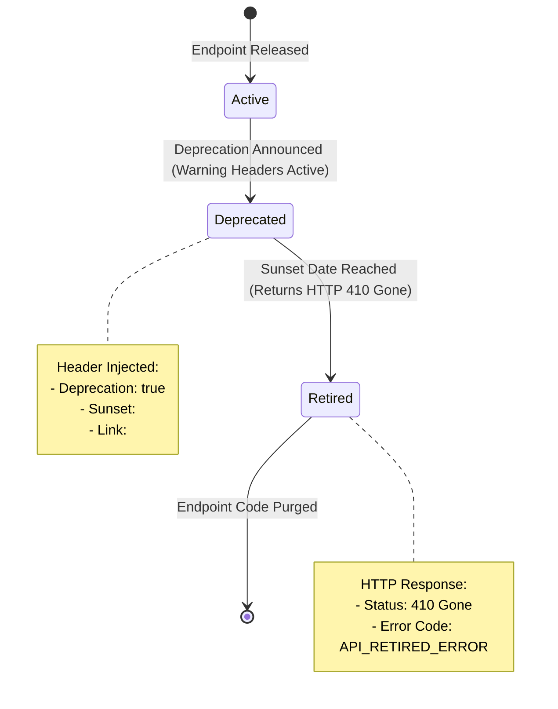

# Versioning and Deprecation

## Purpose
This document defines the versioning policies, deprecation warning mechanisms, header protocols, and decommissioning lifecycles for NewsOps Cloud public APIs. It provides engineers and API architects with clear standards on how to manage breaking changes and retire outdated endpoints without causing downstream integration outages.

## Executive Summary
To enable continuous system evolution while guaranteeing production stability for integrations, NewsOps Cloud adopts a dual versioning pattern. Major version changes are routed using explicit URL segments (e.g., `/v1/`, `/v2/`), while minor updates utilize custom negotiation headers. When an API version or specific endpoint is slated for retirement, the platform initiates a formal deprecation schedule. During this period, responses automatically carry standard HTTP deprecation headers (`Deprecation`, `Sunset`, `Link`), and telemetry dashboards track calling clients to facilitate targeted migration outreach before the version is permanently decommissioned.

## Vision
Our vision is to run a mature, zero-friction API lifecycle program where breaking changes are introduced predictably and deprecated endpoints are decommissioned safely. By automating deprecation warnings and monitoring usage trends, we ensure that external developers are given ample notice and support during migrations.

## Scope
### In-Scope
* Definition of URL versioning policies for major releases.
* Definition of Header-based negotiation policies for minor revisions.
* Standardized API Deprecation and Sunset header structures.
* Database schemas to register API endpoints and track lifecycle statuses.
* Step-by-step workflow for the API decommissioning lifecycle.
* Telemetry monitoring systems tracking deprecated endpoint callers.

### Out-of-Scope
* Versioning of the database schema migrations directly (governed by [migration_strategy.md](../03-database/migration_strategy.md)).
* Deprecation of editorial frontend UI components (managed via frontend bundle flags).

## Goals
* **Zero Production Outages**: Decommissioning old APIs must not cause unexpected client crashes; $100\%$ of active clients must be notified.
* **Minimal Routing Overhead**: Version resolution at the API gateway routing layer must add $< 0.5\text{ ms}$ latency.
* **Sufficient Notice**: The minimum duration between an API deprecation announcement and its final retirement is 12 months for Enterprise tenants and 6 months for Free/Pro tenants.
* **Proactive Monitoring**: Automate the identification of the specific tenant profiles and client keys executing calls against deprecated routes.

## Functional Requirements
* **Major Version URL Isolation**: Support concurrent execution of major API versions using explicit path prefix segments (e.g., `/api/v1/articles` and `/api/v2/articles` routed to distinct microservice pods).
* **Minor Version Header Validation**: Support opt-in minor features using the `X-API-Version` header.
* **Deprecation Header Injection**: Automatically append `Deprecation`, `Sunset`, and `Link` headers to all responses on routes flagged as deprecated in the system registry.
* **Gone Status Codes**: Return HTTP 410 Gone with a structured JSON payload for retired endpoints.
* **Usage Telemetry Tracking**: Record deprecation usage metrics in Prometheus and database logs, detailing the tenant, client key, and endpoint identifier.

## Non-Functional Requirements
* **Routing Performance**: Version mapping must execute in memory at the Envoy API Gateway layer without requiring synchronous database calls.
* **Backport Security**: Critical security patches must be backported to deprecated API versions until the official sunset date.

## Business Rules
### API Lifecycle Timeline
An API endpoint transitions through four distinct lifecycle states:
1. **Active**: The current, recommended version.
2. **Deprecated**: Still functional, but no longer recommended. Active deprecation headers are injected. Sunset date is announced.
3. **Sunsetted**: Functional only for legacy Enterprise agreements; standard clients receive warnings or blockages.
4. **Retired**: Endpoint is disabled. Gateway rejects requests with HTTP 410 Gone.

```
[Active] ---> 6 to 12 Months Notice ---> [Deprecated] ---> Sunset Date Reached ---> [Retired]
```

* **Version Overlap Limit**: No more than 3 major versions of the API may be hosted concurrently in production.
* **Migration Contact Trigger**: If a tenant calls a deprecated endpoint more than 100 times in a 24-hour window, the system triggers a automated warning notification to the tenant administrator.

## Actors
* **API Developer**: Writes new endpoint logic, updates the API registry, and marks old routes as deprecated.
* **External Integrator**: Runs applications that consume API endpoints and must adapt to deprecation schedules.
* **API Gateway Route Resolver**: The load balancer/ingress controller that reads URL paths and headers, routing requests to the correct version container.
* **Tenant Administrator**: Receives deprecation notices and coordinates integration migration updates.

## User Stories
* **User Story 1**: As an External Integrator, I want my client code to receive standard `Deprecation` and `Sunset` headers when calling legacy endpoints so that my automated runtime monitoring tools can alert my team to plan a migration.
* **User Story 2**: As an API Developer, I want to deploy a new major version of our articles engine with breaking changes to the JSON schema without breaking existing mobile app clients using the previous major version.
* **User Story 3**: As a Tenant Administrator, I want to view a list of deprecated API routes currently being accessed by our credentials inside the Developer Portal so that we can pinpoint which internal scripts need to be updated.

## Acceptance Criteria
* The API gateway must route calls containing `/v1/` to the version 1 service cluster and `/v2/` to the version 2 cluster correctly.
* Any request to an endpoint flagged as `Deprecated` must include the header `Deprecation: true`, `Sunset: <Date>`, and `Link: <docs_url>; rel="deprecation"`.
* Once an API is transitioned to the `Retired` status, requests must receive HTTP 410 Gone and a JSON error payload with code `API_RETIRED_ERROR`.
* If a request is received on a deprecated endpoint, the gateway must increment the telemetry counter `api_deprecated_requests_total` in under 1ms.

## Workflows
### Version Routing & Deprecation Header Injection
1. **Request Intake**: Inbound HTTP request hits the ingress controller (Envoy).
2. **Path Inspection**: Envoy analyzes the path prefix (e.g., `/api/v2/articles`).
3. **Registry Match**: Envoy queries its local dynamic memory configuration for routing.
4. **Header Evaluation**:
    * If matching route metadata is marked `status = 'ACTIVE'`, Envoy routes the request directly.
    * If matching route metadata is marked `status = 'DEPRECATED'`, Envoy notes the `sunset_date` and `docs_link`.
5. **Execution**: The backend processes the request and returns the response.
6. **Response Enrichment**: Envoy intercepts the outbound response and injects:
    * `Deprecation: true`
    * `Sunset: Sun, 27 Jun 2027 22:38:54 GMT`
    * `Link: <https://docs.newsops.cloud/api/v1/deprecation>; rel="deprecation"`
7. **Delivery**: The client receives the response along with the metadata warnings.

## API Design
### Deprecated Endpoint Response Headers
When a client executes a request on a deprecated endpoint:
* **URL**: `GET /api/v1/legacy-analytics`
* **Method**: `GET`
* **Response Headers**:
```http
HTTP/1.1 200 OK
Content-Type: application/json
Deprecation: true
Sunset: Sun, 27 Jun 2027 22:38:54 GMT
Link: <https://docs.newsops.cloud/api/deprecation/legacy-analytics>; rel="deprecation"
```

### Retired Endpoint Response (HTTP 410 Gone)
When a client executes a request on a decommissioned endpoint:
* **URL**: `GET /api/v1/obsolete-exporter`
* **Method**: `POST`
* **Response Payload (410 Gone)**:
```json
{
  "code": "API_RETIRED_ERROR",
  "category": "LIMIT_ERROR",
  "message": "This API endpoint has been retired and is no longer available. Please refer to the Link header for migration details.",
  "requestId": "req_aa11827a-cc33-4a01-92ab-1928374656bb",
  "timestamp": "2026-06-27T22:38:54Z",
  "details": [
    {
      "field": "url",
      "issue": "Endpoint retired. Migration replacement: /api/v2/exporter",
      "value": "/api/v1/obsolete-exporter"
    }
  ]
}
```

### API Registry Configuration Endpoint
Admin endpoint to configure api version metadata.

* **URL**: `/api/v1/admin/api-registry`
* **Method**: `POST`
* **Headers**:
  * `Authorization: Bearer <JWT_WITH_ADMIN_ROLE>`
* **Request Payload**:
```json
{
  "path": "/api/v1/legacy-analytics",
  "method": "GET",
  "majorVersion": 1,
  "minorVersion": 0,
  "status": "deprecated",
  "deprecationDate": "2026-06-27T22:38:54Z",
  "sunsetDate": "2027-06-27T22:38:54Z",
  "replacementPath": "/api/v2/analytics",
  "documentationLink": "https://docs.newsops.cloud/api/deprecation/legacy-analytics"
}
```
* **Response Payload (201 Created)**:
```json
{
  "registryId": "reg_111287aa-bb33-4a01-9988-182736456aaa",
  "path": "/api/v1/legacy-analytics",
  "status": "deprecated",
  "sunsetDate": "2027-06-27T22:38:54Z"
}
```

## Database Design
To maintain the runtime state configurations of all system APIs, we employ the following database structure:

### Table: `api_endpoints_registry`
```sql
CREATE TABLE api_endpoints_registry (
    registry_id UUID PRIMARY KEY DEFAULT gen_random_uuid(),
    path_pattern VARCHAR(1024) NOT NULL, -- e.g. '/api/v1/articles/:id'
    http_method VARCHAR(10) NOT NULL, -- 'GET', 'POST', etc.
    major_version INT NOT NULL,
    minor_version INT NOT NULL,
    lifecycle_status VARCHAR(50) NOT NULL CHECK (lifecycle_status IN ('active', 'deprecated', 'sunsetted', 'retired')),
    deprecation_date TIMESTAMP WITH TIME ZONE,
    sunset_date TIMESTAMP WITH TIME ZONE,
    replacement_path VARCHAR(1024),
    documentation_link VARCHAR(2048),
    created_at TIMESTAMP WITH TIME ZONE DEFAULT CURRENT_TIMESTAMP,
    updated_at TIMESTAMP WITH TIME ZONE DEFAULT CURRENT_TIMESTAMP,
    CONSTRAINT unique_endpoint UNIQUE (path_pattern, http_method)
);

CREATE INDEX idx_api_status ON api_endpoints_registry(lifecycle_status);
CREATE INDEX idx_api_pattern ON api_endpoints_registry(path_pattern);
```

## UI Design
To alert developers, the portal displays status tags:
* **Developer Portal Dashboard Key Warnings**:
    * If active integration keys execute calls against deprecated endpoints, a red alert banner appears at the top of the developer settings panel.
    * A grid displays: Called Endpoint, Access Key Name, Number of hits (last 24 hours), Days until retirement, Migration instructions.
* **Endpoint Catalog Visual Tags**:
    * Inside the interactive API docs catalog, deprecated endpoints display a distinct orange `DEPRECATED` badge. Hovering reveals the planned sunset timestamp.

## Permissions
* `api:deprecate`: Allows release managers to flag endpoints as deprecated in the API registry.
* `api:sunset`: Allows engineers to retire endpoints, changing status to retired and returning HTTP 410 Gone.

## Security
* **Sunset Security Commitment**: All deprecated endpoints must receive security backports, dependency updates, and vulnerability patches until the sunset date is reached.
* **Legacy Input Validation Strictness**: During the deprecation phase, input validation schemas must not be relaxed.

## Performance
* **Envoy Router Configuration Sync**: To prevent database calls on every API request, changes to `api_endpoints_registry` trigger an event that exports configuration changes to Envoy Gateway servers using the xDS API, updating gateway memory in $< 500\text{ ms}$.

## Monitoring
* **Prometheus Metric**: `api_deprecated_requests_total` (Counter tracking calls to deprecated routes, labeled by tenant, key, and endpoint path).
* **Prometheus Metric**: `api_retired_requests_total` (Counter tracking calls to retired routes).
* **Alert Trigger**: Trigger WARNING alarm if `api_deprecated_requests_total` for an Enterprise tenant exceeds 1,000 hits in 24 hours (indicates a key integration needs manual notification).

## Logging
Every deprecated request triggers a warning log:
```json
{"timestamp":"2026-06-27T22:38:54Z","level":"WARN","context":"APIDeprecationLogger","tenant_id":"tnt_898a39c-88ab-4a01-b3b3-199cd3f0a1c1","api_key_id":"key_bc7718aa-bb11-44ab-9911-37d42cf99a81","requested_path":"/api/v1/legacy-analytics","sunset_date":"2027-06-27T22:38:54Z","message":"Client called a deprecated API route."}
```

## Error Handling
Exceptions and error mappings for retired endpoints:

| Error Code | HTTP Status | Customer Action |
|:---|:---|:---|
| `API_DEPRECATED_WARNING` | 200 OK (with headers) | Endpoint is deprecated. Update client code to target the replacement URL. |
| `API_RETIRED_ERROR` | 410 Gone | Endpoint retired. Access is blocked. Redirect traffic to the newer version. |

## Edge Cases
* **Wildcard Version Interception**: If a client calls an unregistered route matching version patterns (e.g. `/api/v5/articles`), the gateway rejects the request with HTTP 404 Not Found before processing API registry rules.
* **Late Enterprise Retractions**: If a key enterprise customer cannot migrate off an endpoint prior to the sunset date, the platform administrator can grant a temporary override by creating a virtual mapping rule in the Gateway routing table, returning status back to active for that specific tenant ID.

## Future Improvements
* **Automated Migration Campaign Mailer**: Automate the system to email tenant administrators monthly if telemetry records identify active client keys hitting deprecated routes.
* **Auto-Fallback Redirects**: Provide a Gateway-level middleware option to auto-rewrite request parameters from version 1 format to version 2 formatting, executing minor upgrades transparently without requiring immediate client updates.

## Mermaid Diagrams
### API Lifecycle State Transition State Machine


## References
* Database Schema Migration Standards: [../03-database/migration_strategy.md](../03-database/migration_strategy.md)
* Standard API Error Specifications: [./error_handling_api.md](./error_handling_api.md)
* API Developer Portal Specifications: [./developer_portal.md](./developer_portal.md)
