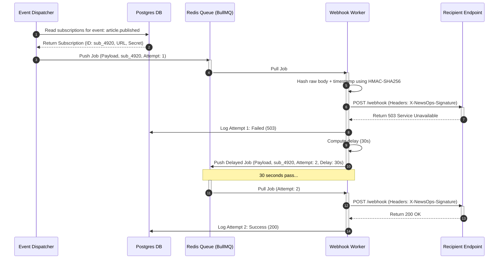

# Webhooks Architecture Specification

## Purpose
This document specifies the design, database schema, verification logic, and APIs for the NewsOps Cloud Webhook integration engine. It outlines payload format models, security signature protocols using HMAC SHA-256, exponential backoff retries, and delivery log auditing processes.

## Executive Summary
Integrating downstream systems—such as static site generators, external content CDNs, and subscriber notification microservices—requires a reliable push mechanism. The NewsOps Cloud Webhook Engine listens to internal platform events (e.g., article publishing, editor updates, user registration) and dispatches standardized JSON payloads to subscriber URLs. To guarantee reliability and security, the engine computes cryptographic signatures to prevent spoofing, logs every transaction, and employs a distributed queuing model backed by BullMQ to retry failing endpoints with exponential backoff and jitter.

## Vision
To build a resilient, highly available push-notification gateway that delivers event notifications within $500\text{ ms}$ of occurrence, enforces strict cryptographic integrity, and provides developers with self-service debugging tools and log interfaces.

## Scope
This architectural specification covers:
- REST endpoints for creating and managing webhook subscriptions.
- Event payload schema formats (e.g., `article.published`, `user.created`).
- Payload signing protocols (HMAC SHA-256) and recipient validation logic.
- Delivery retry queues, scheduling algorithms, and backoff constants.
- Schema definitions for subscriptions and delivery auditing tables.

Out of scope are external API gateway routing patterns (handled in `index.md`).

## Goals
- **Tamper Evidence**: Ensure all dispatched payloads are signed using a tenant-specific shared secret key.
- **Resiliency against Outages**: Implement queue-based retry workers that withstand recipient endpoint downtime without dropping messages.
- **Full Traceability**: Log every delivery attempt, including request headers, response codes, and payload snippets.
- **Self-Service Verification**: Expose endpoints to trigger test payloads for verification purposes.

## Functional Requirements
- **Subscription Management**: Integrators must be able to create, read, update, and delete webhook configs.
- **Multi-Event Subscriptions**: A single webhook configuration must support subscribing to a list of specific event types (e.g., `['article.created', 'article.published']`).
- **Signature Computation**: The engine must sign every outbound payload with HMAC SHA-256, utilizing the subscription's secret key.
- **Retry Dispatcher**: The engine must capture failures (e.g., timeouts, non-2xx status codes) and re-queue them.
- **Delivery Log Querying**: Expose endpoints to query execution logs filtered by subscription and status.

## Non-Functional Requirements
- **Dispatch Latency**: $90\%$ of webhook dispatches must trigger within $1.5\text{ seconds}$ of the primary database transaction commit.
- **Retry Exhaustion**: Retry intervals scale using exponential backoff up to a maximum of 5 attempts over 24 hours.
- **Worker Throughput**: The webhook dispatch workers must handle up to $2,500\text{ events per second (EPS)}$ using concurrency pooling.
- **Connection Timeout**: Outbound HTTP requests must timeout if the recipient server fails to respond within $5\text{ seconds}$.

## Business Rules
- **Silent Failures Isolation**: Downstream webhooks failures must never halt internal database transactions or block editors saving drafts.
- **Subscription Cap**: Tenants are limited to a maximum of 10 active webhook configurations.
- **Automatic Deactivation**: If a webhook subscription yields consecutive HTTP failures (e.g., 500 or network errors) for 7 consecutive days, the engine flags the subscription as `suspended` and sends a notification email to the administrator.

## Actors
- **Integration Engineer**: Configures webhook URLs, reviews delivery histories, and tests signatures.
- **Platform Event Dispatcher**: The internal system service that captures database commits and queues webhook events.
- **Webhook Worker**: Executes HTTP POST requests, computes signatures, and writes logs.
- **Recipient Endpoint**: The external third-party server listening for event notifications.

## User Stories (At least 3 specific stories)
- **User Story 1**: As an Integration Engineer, I want my receiver endpoint to verify the `X-NewsOps-Signature` header so that I can be certain the notification originated from NewsOps Cloud and was not modified in transit.
- **User Story 2**: As a Developer, I want to browse a detailed log of previous webhook attempts containing response body snippets so that I can quickly diagnose why my server rejected a publishing notification.
- **User Story 3**: As an Integration Engineer, I want to select specific events like `article.published` and `article.deleted` for my webhook configuration so that my server is not overloaded with cursor movement or draft save events.

## Acceptance Criteria (At least 3-5 criteria with clear thresholds)
- Outbound webhook requests must include headers: `X-NewsOps-Signature`, `X-NewsOps-Timestamp`, and `Content-Type: application/json`.
- The signature matching algorithm must compute the hash using HMAC SHA-256 over the raw request payload joined with the timestamp header.
- The webhook queue worker must wait exactly $30\text{ seconds}$ before its first retry, doubling the duration for subsequent attempts ($30\text{s}$, $60\text{s}$, $120\text{s}$, $240\text{s}$, $480\text{s}$) plus a random jitter of $\pm 5\text{ seconds}$.
- The admin dashboard must load the logs for a specific subscription in under $100\text{ ms}$ for a table of up to 10,000 logs.

## Workflows
```
[ Event Commits in CMS ] ---> [ Event Queue (BullMQ) ] ---> [ Webhook Worker ]
                                                                   |
     +-------------------------------------------------------------+
     v
[ Compute HMAC Signature ]
     |
[ Send HTTP POST to Recipient ]
     |
     +---------(2xx OK)---------> [ Write Successful Delivery Log ]
     |
     +-----(Non-2xx / Timeout)--> [ Schedule Retry Queue ] --> [ Write Failed Log ]
```
### Webhook Dispatch and Retry Lifecycle Workflow
1. **Trigger Event**: An editor publishes an article, and the core CMS system pushes a job to the `webhooks-dispatcher` Redis queue with details of event `article.published`.
2. **Worker Fetch**: A webhook background worker pulls the job, looks up active subscriptions for `article.published` under the organization, and retrieves the URL and secret key.
3. **Payload Signing**: The worker serializes the payload, fetches the current timestamp, computes the HMAC SHA-256 hash using the secret key, and constructs the header parameters.
4. **Outbound Attempt**: The worker sends an HTTP POST request to the subscriber's URL. It starts a 5-second connection timer.
5. **Success Handling**: If the remote server responds with status `200` to `299` within 5 seconds, the worker logs a successful attempt and marks the job complete.
6. **Retry Handling**: If the remote server returns a `500` error or times out, the worker increments the attempt count. It computes the next execution time ($30 \times 2^{(attempt-1)}$ seconds) and writes a failed log. It then registers a delayed job in BullMQ for the next attempt.
7. **Exhaustion**: If the 5th attempt fails, the worker terminates the loop, writes a terminal failure log, and triggers a system alert.

## API Design

### POST `/api/v1/webhooks/subscriptions`
Creates a new webhook subscription.
* **Request Headers**:
  * `Authorization: Bearer <jwt_token>`
  * `X-Tenant-ID: org_newsops_001`
* **Request Payload**:
```json
{
  "name": "Static Site Rebuilder",
  "url": "https://api.external-site.com/webhooks/newsops-listener",
  "subscribedEvents": ["article.published", "article.deleted"],
  "isActive": true
}
```
* **Response Payload (201 Created)**:
```json
{
  "id": "sub_4920ab31-102c-4abc-992d-00ffbc912389",
  "name": "Static Site Rebuilder",
  "url": "https://api.external-site.com/webhooks/newsops-listener",
  "subscribedEvents": ["article.published", "article.deleted"],
  "secretKey": "whsec_882910a2cd0249119a2db0bc98319aa2e018ab3847291a271c778ab0bc91a2f3",
  "isActive": true,
  "createdAt": "2026-06-27T23:05:00Z",
  "updatedAt": "2026-06-27T23:05:00Z"
}
```

### GET `/api/v1/webhooks/subscriptions`
Retrieves active webhook configurations for the tenant.
* **Response Payload (200 OK)**:
```json
{
  "data": [
    {
      "id": "sub_4920ab31-102c-4abc-992d-00ffbc912389",
      "name": "Static Site Rebuilder",
      "url": "https://api.external-site.com/webhooks/newsops-listener",
      "subscribedEvents": ["article.published", "article.deleted"],
      "isActive": true,
      "createdAt": "2026-06-27T23:05:00Z"
    }
  ]
}
```

### GET `/api/v1/webhooks/subscriptions/{id}/logs`
Queries delivery history logs for audit and testing.
* **Query Parameters**:
  * `page`: Integer (Default: 1)
  * `limit`: Integer (Default: 20)
  * `status`: String (`success`, `failed`, `retrying`)
* **Response Payload (200 OK)**:
```json
{
  "data": [
    {
      "id": "wlog_012c8829-ba92-4112-aa2d-00ffbc912389",
      "subscriptionId": "sub_4920ab31-102c-4abc-992d-00ffbc912389",
      "eventType": "article.published",
      "attempt": 1,
      "requestUrl": "https://api.external-site.com/webhooks/newsops-listener",
      "responseStatus": 200,
      "responseBody": "{\"status\":\"received\"}",
      "durationMs": 142,
      "status": "success",
      "timestamp": "2026-06-27T23:06:00Z"
    }
  ],
  "pagination": {
    "totalCount": 1,
    "page": 1,
    "limit": 20,
    "totalPages": 1
  }
}
```

---

### Standard Event Payload: `article.published`
Sent to webhook subscribers when an article transitions to published.
```json
{
  "eventId": "evt_9982ab10-ef12-40bc-98ff-8a02bd98a123",
  "eventType": "article.published",
  "tenantId": "org_newsops_001",
  "timestamp": "2026-06-27T23:06:00.000Z",
  "data": {
    "articleId": "art_c289bc10-ef12-40bc-98ff-8a02bd98a123",
    "title": "Designing High-Throughput Webhook Engines",
    "slug": "high-throughput-webhook-engines",
    "status": "published",
    "author": {
      "id": "usr_991823ab-ba82-4112-aa2d-00ffbc912389",
      "email": "editor@newsops.com"
    },
    "version": 3,
    "publishedAt": "2026-06-27T23:06:00.000Z"
  }
}
```

## Database Design
The Webhook subsystem uses two primary relational tables inside the tenant schema bounds.

### Table: `webhook_subscriptions`
Stores metadata and configurations of endpoints.
* **Fields**:
  * `id`: `UUID` (Primary Key)
  * `tenant_id`: `VARCHAR(100)`
  * `name`: `VARCHAR(255)`
  * `url`: `VARCHAR(1000)`
  * `subscribed_events`: `VARCHAR(100)[]` (Array of subscribed events)
  * `secret_key`: `VARCHAR(255)` (Salt used for computing HMAC signatures)
  * `is_active`: `BOOLEAN` (Default: true)
  * `status`: `VARCHAR(50)` (e.g. 'active', 'suspended')
  * `created_at`: `TIMESTAMP`
  * `updated_at`: `TIMESTAMP`
* **Indexes**:
  * `idx_webhooks_tenant_events` ON (`tenant_id`, `is_active`)

### Table: `webhook_delivery_logs`
Logs transaction metadata for audit.
* **Fields**:
  * `id`: `UUID` (Primary Key)
  * `tenant_id`: `VARCHAR(100)`
  * `subscription_id`: `UUID` (Foreign Key -> `webhook_subscriptions.id`, Cascade Delete)
  * `event_type`: `VARCHAR(100)`
  * `attempt`: `INTEGER` (Current retry attempt count)
  * `request_headers`: `JSONB`
  * `response_status`: `INTEGER` (HTTP Status Code)
  * `response_body`: `TEXT` (Snippet of remote response)
  * `duration_ms`: `INTEGER`
  * `status`: `VARCHAR(50)` (e.g. 'success', 'failed', 'retrying')
  * `timestamp`: `TIMESTAMP`
* **Indexes**:
  * `idx_webhook_logs_sub_time` ON (`subscription_id`, `timestamp` DESC)

## UI Design
- **Webhooks Admin Board**: A grid displaying active endpoints, URLs, checkboxes for events selection, toggle switch for activation, and raw display fields showing hidden keys.
- **Delivery Log Table**: Sub-panel displaying recent calls. Renders red status badges for failures and green for success. Clicking a log opens a modal layout displaying raw request headers and response snippets.
- **Test Endpoint Payload Trigger**: Action button that forces execution of a mock payload (e.g., `webhook.test`) to the URL, outputting real-time response data on the panel.

## Permissions
- `webhooks:read` - Allows viewing webhook configurations and querying logs.
- `webhooks:write` - Allows registering, updating, toggling, or deleting webhook subscriptions.
- `webhooks:test` - Grants permissions to execute mock delivery requests.

## Security

### Cryptographic Signature Verification
To verify webhook payloads, NewsOps Cloud computes a keyed signature using the shared HMAC secret. The client must concatenate the timestamp header and the raw JSON body with a dot (`.`), then compute the HMAC SHA-256 signature using the secret key.

#### Code Implementation (Node.js/TypeScript Receiver Verification)
```typescript
import * as crypto from 'crypto';

interface VerifySignatureParams {
  payload: string;        // Raw request body string
  signature: string;      // Value of X-NewsOps-Signature header
  timestamp: string;      // Value of X-NewsOps-Timestamp header
  secret: string;         // Webhook subscription secretKey
  toleranceSeconds?: number;
}

export function verifyWebhookSignature({
  payload,
  signature,
  timestamp,
  secret,
  toleranceSeconds = 300 // 5 minutes default tolerance
}: VerifySignatureParams): boolean {
  // 1. Prevent replay attacks: Verify timestamp age
  const requestTime = parseInt(timestamp, 10);
  const currentTime = Math.floor(Date.now() / 1000);
  
  if (isNaN(requestTime) || Math.abs(currentTime - requestTime) > toleranceSeconds) {
    throw new Error('Timestamp tolerance check failed. Potential replay attack.');
  }

  // 2. Re-create the signature payload string
  const signaturePayload = `${timestamp}.${payload}`;

  // 3. Compute HMAC SHA-256 hash using the secret
  const computedSignature = crypto
    .createHmac('sha256', secret)
    .update(signaturePayload)
    .digest('hex');

  // 4. Constant-time comparison to prevent timing attacks
  const signatureBuffer = Buffer.from(signature);
  const computedBuffer = Buffer.from(computedSignature);

  if (signatureBuffer.length !== computedBuffer.length) {
    return false;
  }

  return crypto.timingSafeEqual(signatureBuffer, computedBuffer);
}
```

## Performance
- **Queue Pipeline Latency**: BullMQ processing overhead must not exceed $15\text{ ms}$ under normal conditions.
- **Worker Scalability**: The system can scale up to 10 webhooks queue worker pods, processing $10,000\text{ cumulative TPS}$.
- **Storage Cleanup**: Audit tables prune log entries older than 30 days to prevent index ballooning in PostgreSQL.

## Monitoring
- **Prometheus Metric**: `webhook_deliveries_total` (Counter tracking calls by subscription, status, and status_code).
- **Prometheus Metric**: `webhook_delivery_latency_seconds` (Histogram tracking call times).
- **Prometheus Metric**: `webhook_failures_total` (Counter tracking total aborted errors).
- **Alert Trigger**: Trigger Alert if active error rates (`webhook_failures_total`) exceed $5\%$ of total traffic for a 5-minute interval.
- **Alert Trigger**: Trigger Warning if queue processing depth in BullMQ exceeds 500 items.

## Logging
* **Webhook Dispatch Success Log**:
```json
{
  "timestamp": "2026-06-27T23:10:00.000Z",
  "trace_id": "tr-wh-882910a2cd02",
  "level": "INFO",
  "context": "WebhookWorker",
  "tenant_id": "org_newsops_001",
  "subscription_id": "sub_4920ab31-102c-4abc-992d-00ffbc912389",
  "event_type": "article.published",
  "attempt": 1,
  "request_url": "https://api.external-site.com/webhooks/newsops-listener",
  "status_code": 200,
  "duration_ms": 142
}
```

## Error Handling
| Failure Scenario | System Action | Log Level |
|:---|:---|:---|
| Recipient returns HTTP `4xx` (e.g. 404, 400) | Abort attempts immediately. Do not retry. Log terminal failure. | ERROR |
| Recipient returns HTTP `5xx` (e.g. 503, 500) | Schedule retry according to exponential backoff index. | WARN |
| Request connection times out ($> 5\text{s}$) | Treat as temporary network failure. Queue retry. | WARN |
| DNS resolution fails | Queue retry. Log specific system error context. | WARN |

## Edge Cases
- **Slow Receiver Blockage**: If an endpoint takes 10+ seconds to respond, it could exhaust the worker thread pool. The system mitigates this by enforcing a hard 5-second timeout on outbound requests.
- **Tenant Modifies Secret Mid-Flight**: If a tenant regenerates their webhook signing key while events are queued, the active worker retries using the database status at execution time. Retries in progress will fail signature checks if the listener updates keys immediately. The platform alerts the user of potential mismatched signatures during transition windows.

## Future Improvements
- **Custom HTTP Headers**: Permit developers to add authentication headers (e.g., custom authorization keys) to webhook configurations.
- **Dead Letter Queue (DLQ)**: Divert failing webhook events to a DLQ after 5 failed attempts, allowing developers to inspect payloads and manually replay them.

## Mermaid Diagrams
### Webhook Dispatch Architecture and Retry Sequence


## References
- REST gateway setup: [index.md](./index.md)
- Event management and triggers: [../02-architecture/event_driven_design.md](../02-architecture/event_driven_design.md)
- Database schema layouts: [../03-database/social_publishing_schema.md](../03-database/social_publishing_schema.md)
