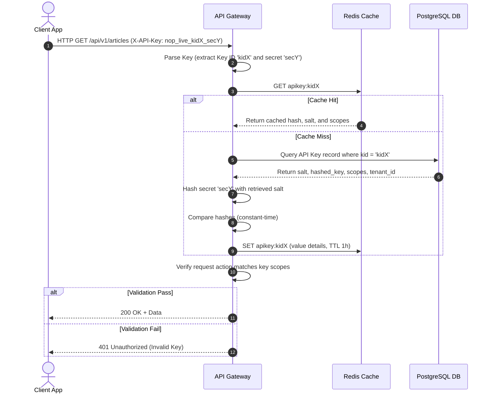

# API Key Management
## Purpose
This document specifies the security architecture for generating, storing, validating, and rotating client API keys within the NewsOps Cloud platform. It details the cryptographic operations, data models, indexing strategies, and middleware structures designed to protect programmatic access to tenant resources.

## Executive Summary
NewsOps Cloud enables external automation, CMS synchronization, and third-party widgets through client API keys. Because API keys act as long-lived credentials, their management must prevent credential exposure. The system enforces one-time visibility of raw keys at creation, stores keys as salted SHA-256 hashes in PostgreSQL, and optimizes authentication pathways by caching validated keys in Redis. This document explains key formatting, hashing schemes, verification workflows, and revocation policies.

## Vision
Our vision is to provide an API key management system that combines security and high-speed execution. By ensuring that no raw API key values are stored in the database or logs, we protect tenant data against database leaks while supporting sub-millisecond route validation.

## Scope
This document covers:
1. **API Key Generation**: Cryptographic structure and key formatting standards.
2. **Secure Hashing**: Multi-tenant database schema storing only salted SHA-256 hashes.
3. **Validation Architecture**: Redis caching layer and key validation indexing.
4. **Lifecycle Operations**: Dynamic rotation, scope verification, and immediate revocation.

It does not cover internal system-to-system authentication (handled via mTLS or OAuth 2.0 Client Credentials).

## Goals
- **Zero-Storage of Secrets**: Ensure raw API keys cannot be read from the database, backups, or memory dumps.
- **Ultra-Fast Gateway Validation**: Verify key signatures and load tenant context in $< 1.5\text{ ms}$.
- **Instant Revocation propagation**: Revoked keys must fail validation requests globally in under 1 second.
- **Granular Scoping**: Map API keys to specific permission matrices rather than granting root tenant privileges.

## Functional Requirements
- **Key Prefixing**: Keys must start with a standardized prefix (e.g. `nop_live_` or `nop_test_`) and include a unique key identifier for database lookups.
- **One-Time Visibility**: Provide the raw API key to the client exactly once during creation.
- **Salted Hashing**: Hash keys using SHA-256 with a unique, cryptographically secure random salt per key.
- **Scope Restriction**: Match key authorization against a static array of scopes (e.g., `read:articles`, `write:analytics`).
- **Rotation Engine**: Support active rotation with a grace period where both the old and new keys remain valid.

## Non-Functional Requirements
- **Key Entropy**: Keys must be generated using `crypto.randomBytes(32)` to guarantee 256 bits of entropy.
- **Database Search Latency**: Index lookups on API key hashes must execute in $< 0.5\text{ ms}$ at database scale.
- **Cache Integrity**: Cache key metadata in Redis with encryption to prevent local database bypassing.

## Business Rules
- **Prefix Isolation**: Test keys (`nop_test_`) must never read or write data to live databases or affect production billing metrics.
- **No Wildcard Scopes**: API keys cannot have wildcards (`*`) as scope permissions; every scope must be explicitly listed.
- **Strict Limit**: Tenants are limited to a maximum of 10 active API keys to reduce the credential attack surface.

## Actors
- **Developer/Integration Service**: Connects to NewsOps APIs programmatically using the API key.
- **Tenant Administrator**: Generates keys, selects scopes, and initiates key rotations or revocations.
- **API Gateway Guard**: Intercepts requests, validates keys, parses scopes, and authorizes routes.

## User Stories
- **User Story 1**: As an Integration Developer, I want to create an API key with read-only access to articles so that my static site generator can pull updates without risking write access.
- **User Story 2**: As a Tenant Administrator, I want to revoke an API key instantly because it was accidentally checked into a public git repository.
- **User Story 3**: As an API Gateway, I want to extract the key prefix and quickly check its status in Redis to authorize incoming payloads without querying the main PostgreSQL instance.

## Acceptance Criteria
- Raw API keys must never be logged or stored in database tables.
- The generation of an API key must return the raw key once, after which the system cannot retrieve it.
- Validation checks must reject keys that do not match the expected prefix pattern (`nop_[live|test]_[a-zA-Z0-9]{32}`).
- Invalidation of a key in the console must instantly delete the corresponding key from both Redis and PostgreSQL.

## Workflows
1. **API Key Generation and Storage Workflow**:
   - The Tenant Admin requests a new key with specified scopes (e.g., `["read:articles"]`).
   - The server generates:
     - A unique public key identifier (Key ID): `kid_` + 8 random hex characters.
     - A secure random string (Secret): `sec_` + 32 base64 characters.
     - The formatted API key: `nop_live_<kid>_<sec>`.
     - A unique 16-byte random salt.
   - The server computes: `hash = SHA-256(sec + salt)`.
   - The server saves the salt, hash, scopes, tenant ID, and key prefix to PostgreSQL.
   - The server returns the raw API key to the client's screen.

2. **Incoming Key Validation Workflow**:
   - API Gateway intercepts a request with the header `X-API-Key: nop_live_kid12345_secABC123...`.
   - Gateway extracts the Key ID (`kid12345`) and the Secret (`secABC123...`).
   - Gateway queries the Redis cache for key `apikey:kid12345`.
   - If not in cache, Gateway queries PostgreSQL for the record matching key ID `kid12345`.
   - Gateway calculates `SHA-256(secABC123... + record.salt)`.
   - Gateway compares the calculated hash against the stored hash using a constant-time comparison helper.
   - If the hashes match and the key is active:
     - The Gateway caches the hashed validation result, scopes, and tenant details in Redis.
     - The Gateway routes the request to the controller, appending the tenant context.



## API Design
### API Key Creation Endpoint
Generates a new API key and returns the raw key to the client.

* **URL**: `/api/v1/api-keys`
* **Method**: `POST`
* **Headers**:
  * `Authorization: Bearer <JWT>`
  * `Content-Type: application/json`
* **Request Payload**:
```json
{
  "name": "gatsbysite-deploy-key",
  "scopes": ["read:articles", "read:authors"],
  "environment": "live",
  "expiresAt": "2027-06-27T00:00:00Z"
}
```

* **Response Payload (201 Created)**:
```json
{
  "id": "key_90a1bb2",
  "name": "gatsbysite-deploy-key",
  "scopes": ["read:articles", "read:authors"],
  "environment": "live",
  "rawApiKey": "nop_live_kid90a1bb2_sec876asd9871abcsd9082341hasd891",
  "expiresAt": "2027-06-27T00:00:00Z",
  "createdAt": "2026-06-27T17:40:00Z",
  "note": "Store this key securely. It will not be shown again."
}
```

### API Key Rotation Endpoint
Rotates an existing API key, creating a replacement while keeping the old key active during a 1-hour grace period.

* **URL**: `/api/v1/api-keys/:id/rotate`
* **Method**: `POST`
* **Headers**:
  * `Authorization: Bearer <JWT>`
* **Response Payload (200 OK)**:
```json
{
  "id": "key_90a1bb2",
  "rawApiKey": "nop_live_kid90a1bb2_sec98234yisdhfkasjhdf982312hasd",
  "gracePeriodExpiresAt": "2026-06-27T18:40:00Z",
  "note": "The previous key will expire in 60 minutes. Update your configuration now."
}
```

## Database Design
To handle rapid lookups, a unique composite index is created on the Key ID field.

### `api_keys` Table
* `id`: VARCHAR(30) (Primary Key, unique Key ID like 'kid90a1bb2')
* `tenant_id`: VARCHAR(50) (Index, Foreign Key to Tenant table)
* `name`: VARCHAR(100)
* `hashed_key`: VARCHAR(64) (SHA-256 output, Index)
* `salt`: VARCHAR(32) (16-byte random salt, stored in hex)
* `scopes`: VARCHAR(100)[] (e.g. `['read:articles']`)
* `environment`: VARCHAR(10) (e.g., 'live', 'test')
* `is_active`: BOOLEAN (Default: true)
* `grace_hash`: VARCHAR(64) (For keeping active rotated key during grace period)
* `grace_salt`: VARCHAR(32)
* `grace_expires_at`: TIMESTAMP WITH TIME ZONE
* `expires_at`: TIMESTAMP WITH TIME ZONE
* `created_at`: TIMESTAMP WITH TIME ZONE
* `updated_at`: TIMESTAMP WITH TIME ZONE

## UI Design
The API Keys page in the Developer Settings contains:
- **Key List Table**: Shows Key Name, Prefix (e.g. `nop_live_kid90a...`), Scopes, Environment, and Creation/Expiry dates.
- **Scope Checklist Modal**: A modal that appears during generation to select read/write permissions.
- **Copy-to-Clipboard Clipboard Panel**: Prompts the user to copy the API key, warning them that closing the dialog will prevent retrieval of the key.
- **Revocation Button**: Red button that triggers a confirmation modal to revoke keys instantly.

## Permissions
- `api_keys:write`: Permits creation, rotation, and revocation of client API keys.
- `api_keys:read`: Permits listing active keys, showing scopes and prefixes.

## Security
- **Constant-Time Comparison**: Hash validation must use constant-time string comparison methods (e.g., Node's `crypto.timingSafeEqual`) to prevent side-channel timing attacks.
- **Unique Salt per Key**: A unique salt per key mitigates pre-computed rainbow table attacks.
- **Masked Logger Outputs**: Ensure audit and HTTP logs mask the secret portion of the keys, capturing only the Key ID (e.g., `nop_live_kid90a1bb2_******`).

## Performance
- **Validation Target**: Latency target is $< 1.0\text{ ms}$ for cache hits.
- **Cache Expiration**: Redis entries expire in 1 hour. Any revocation publishes a Redis message that deletes the cached key instantly.
- **Gateway Capacity**: Support up to 3,000 key validations per second.

## Monitoring
- **Prometheus Metric**: `api_key_check_duration_seconds` (Histogram tracking verification times)
- **Prometheus Metric**: `api_key_verification_failures_total` (Counter, segmented by tenant and fail reason)
- **Alert Trigger**: If `api_key_verification_failures_total` for a single tenant increases by $> 100$ in 1 minute, trigger a rate-limiting trigger and notify the tenant's security contact.

## Logging
Logging standardizes on JSON format. Raw secrets must never appear in logs.
* **Log Pattern (Verification Failure)**: `{"timestamp": "2026-06-27T17:45:00.000Z", "level": "WARN", "context": "ApiKeyGuard", "message": "API key verification failed", "key_id": "kid90a1bb2", "reason": "invalid_hash"}`
* **Log Pattern (Revocation)**: `{"timestamp": "2026-06-27T17:45:05.000Z", "level": "INFO", "context": "ApiKeyService", "message": "API key revoked", "key_id": "kid90a1bb2", "actor": "admin-usr-01"}`

## Error Handling
| Internal Error Code | HTTP Status | Customer-Facing Message |
|:---|:---|:---|
| `ERR_INVALID_API_KEY` | 401 Unauthorized | Access denied. The provided API key is invalid or unrecognized. |
| `ERR_API_KEY_EXPIRED` | 401 Unauthorized | Access denied. This API key has expired. Please rotate your key. |
| `ERR_INSUFFICIENT_KEY_SCOPE` | 403 Forbidden | Access denied. The API key does not have permission scopes for this endpoint. |

## Edge Cases
- **Simultaneous Rotation Operations**: If a tenant administrator double-clicks the rotate key button, the server processes the first request, generates the new key, and locks the database row, returning a `409 Conflict` for the second request.
- **Redis Cache Poisoning**: If Redis is compromised, an attacker could attempt to write forged verification records. To prevent this, data cached in Redis is signed using an internal system key (HMAC-SHA256).

## Future Improvements
- **IP Binding for Keys**: Allow developers to bind specific API keys to specific IP addresses/CIDR ranges, providing an additional layer of security.
- **HMAC Signature Verification**: Support signing request payloads using API keys, avoiding transmitting raw keys in request headers.

## Mermaid Diagrams
Below is a flowchart detailing the lifecycle and validation paths for API keys:

```mermaid
flowchart TD
    subgraph Key Generation
        A[Request New Key] --> B[Generate Key ID + Secret]
        B --> C[Generate Random Salt]
        C --> D[Compute SHA-256 Hash]
        D --> E[Save Hash, Salt & Scopes to DB]
        E --> F[Output Raw Key to User once]
    end

    subgraph Key Authentication
        G[Incoming Request with Header] --> H[Extract Key ID & Secret]
        H --> I{Key ID in Redis?}
        I -- Yes --> J[Compare secret against cached hash]
        I -- No --> K[Fetch salt & hash from DB]
        K --> L[Compute Secret Hash]
        L --> M[Compare computed hash with DB hash]
        M -- Match --> N[Save validation payload to Redis]
        N --> O[Verify action scopes]
        J -- Match --> O
        O -- Authorized --> P[Allow request]
        O -- Unauthorized --> Q[Return 403 Forbidden]
        M -- Mismatch --> R[Return 401 Unauthorized]
        J -- Mismatch --> R
    end
```



## References
- Security Index: [index.md](./index.md)
- Encryption Policies: [encryption_policies.md](./encryption_policies.md)
- RBAC / ABAC Policies: [rbac_abac_models.md](./rbac_abac_models.md)
- API Core Architecture: [index.md](../09-api/index.md)
