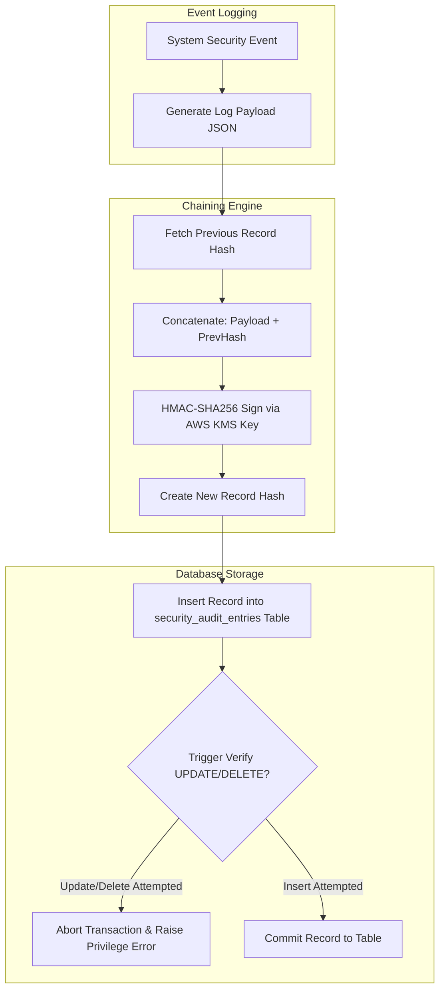

# Security Audit Log Policy and Architecture
## Purpose
This document details the policies, database schemas, cryptographic integrity controls, and archival strategies for the immutable security audit trails of the NewsOps Cloud digital publishing platform. It defines how the system records, signs, monitors, and archives audit records to satisfy SOC 2 Type II, ISO 27001, and regulatory compliance standards.

## Executive Summary
Audit logging is critical for post-incident forensics, compliance checks, and operational accountability. NewsOps Cloud enforces a zero-trust audit logging architecture where audit events are cryptographically chained in a sequence of hashes (similar to a blockchain ledger). The backend database blocks updating or deleting logs via database-level triggers and roles. Logs are exported to Amazon S3 Glacier WORM (Write Once Read Many) locked vaults for long-term retention.

## Vision
Our vision is a tamper-proof audit trail where security integrity is cryptographically provable. No system actor—including DBA users, root administrators, or malicious compromised processes—can edit or delete history without invalidating the cryptographic chain and triggering high-severity containment actions.

## Scope
The scope of this design document covers:
*   Cryptographic chaining algorithms using HMAC-SHA256.
*   Database schema configuration and partition layouts for the audit tables.
*   Database-level permissions enforcing write-only (insert-only) constraints.
*   Automated verification pipelines detecting trail modifications.
*   Long-term archival configurations using AWS S3 Glacier Compliance Vault Locks.

## Goals
*   **Tamper Evidence**: Cryptographically detect any insertion, deletion, or modification of historical audit logs.
*   **Immutable Storage**: Guarantee that archived logs are unalterable for a minimum compliance duration of 7 years.
*   **Comprehensive Coverage**: Log all identity mutations, permission changes, data access exceptions, and administrative activities.
*   **Isolation**: Keep the audit trail functional even under failure or degradation of standard application databases.
*   **High Performance**: Process audit writes asynchronously without degrading core transaction speeds.

## Functional Requirements
*   **Event Capture**: Log key system interactions, including timestamp, action type, IP address, user-agent, target resource identifier, correlation ID, and payload diffs (for updates).
*   **Cryptographic Chain Generation**: Calculate a hash for each new record using its contents combined with the hash of the preceding record.
*   **Role Change Auditing**: Explicitly record changes to user accounts, tenant permissions, organization roles, and client credentials.
*   **Verification Utility**: Provide an API endpoint and CLI tool to scan the log sequence, recalculate hashes, and report validation success or failure.
*   **Automatic Archiving**: Transition logs older than 90 days to locked S3 Glacier storage, clean up local partitions, and register the archive manifest.

## Non-Functional Requirements
*   **Database Security**: Block `UPDATE` and `DELETE` queries at the database user privilege level.
*   **Latency**: The overhead to queue an audit log event must remain under 1ms for the calling thread by using an asynchronous event queue (Redis/Kafka).
*   **Availability**: Provide high availability for the logging service using redundant ingestion microservices with memory failover buffers.
*   **Storage Lifespan**: Maintain active database records for 90 days, hot storage backup for 1 year, and immutable Glacier archive for 7 years.

## Business Rules
*   **No Modifications**: Under no circumstances may any admin modify or delete audit log rows.
*   **Mandatory Auditing**: Actions labeled as `CRITICAL` (e.g., `role:update`, `tenant:delete`, `billing:modify`) must be logged synchronously before committing the corresponding business transaction.
*   **Glacier Policy Lockdown**: The AWS S3 Glacier Vault Lock policy must be set to "Compliance Mode", making it impossible to delete archives or remove the policy even by the root AWS account before the retention period expires.

## Actors
*   **CMS User**: Normal author or editor whose regular activities are logged silently (e.g., article publish events).
*   **Security Administrator**: Monitors system integrity, configures alert policies, and accesses audit queries for forensics.
*   **Platform Engineer**: Configures infrastructure, maintains databases, and manages AWS Glacier storage resources.
*   **Compliance Auditor**: External validator verifying security logs for compliance certificates.

## User Stories
*   **User Story 1**: As a Compliance Auditor, I want to trigger a validation script that verifies the cryptographic hash chain of the audit database so that I can prove to regulatory inspectors that the database has not been altered since the last review.
*   **User Story 2**: As a Security Administrator, I want to receive an immediate SMS and PagerDuty alert if any administrative user account is assigned the superuser role so that I can review and confirm the change.
*   **User Story 3**: As a Platform Engineer, I want the system to automatically export audit logs older than 90 days to an immutable S3 Glacier vault so that the production database remains lightweight and cost-effective without violating legal retention rules.

## Acceptance Criteria
*   **AC 1**: The database must reject any SQL query that attempts an `UPDATE` or `DELETE` on the `security_audit_entries` table, raising a database authorization exception.
*   **AC 2**: The hash of record `N` must equal `HMAC-SHA256(record_N_data + hash_record_N-1, kms_secret_key)`.
*   **AC 3**: The verification utility must flag the exact record index where any hash mismatch is found, identifying the point of tampering.
*   **AC 4**: S3 Glacier archives must be locked under a policy that prevents deletion of the logs for 2,555 days (7 years).

## Workflows
### Workflow 1: Cryptographic Hash Chaining and Logging
1.  An application user triggers a security-relevant event (e.g., changing another user's role from Editor to Admin).
2.  The application controller routes the business logic. At the transaction commit stage, an Audit Event is dispatched to the transaction listener.
3.  The logging processor retrieves the latest sequence record from the DB to find `previous_record_hash`.
4.  The logging processor builds the current record dataset containing the timestamp, client context, diffs, and target ID.
5.  The processor calls the AWS KMS API to generate a keyed HMAC-SHA256 signature using the formula:
    `current_hash = HMAC_SHA256(JSON(event_data) + previous_record_hash, KMS_Key_ARN)`.
6.  The processor inserts the new audit entry containing the payload data and the newly calculated `current_hash` into the `security_audit_entries` table.
7.  The database commits the transaction. If the insert fails, the overall security change transaction is aborted and rolled back.

### Workflow 2: Audit Integrity Scan
1.  A Cron Job triggers the audit integrity verification script daily.
2.  The script queries the `security_audit_entries` table in order of `sequence_id`.
3.  For the first record (genesis block), the script verifies its hash against a hardcoded system seed value.
4.  For each subsequent record `i`, the script takes its parameters, fetches the calculated hash of record `i-1`, and computes:
    `recalculated_hash = HMAC_SHA256(JSON(record_i_data) + hash_record_i-1, KMS_Key_ARN)`.
5.  The script compares the `recalculated_hash` with the stored `record_hash` from the database.
6.  If a mismatch is found:
    *   The script stops scanning.
    *   It records the sequence ID, timestamp, and details of the corrupted row.
    *   It fires a Critical Alert to SIEM (Security Information and Event Management) and PagerDuty.
7.  If all hashes match, the script logs verification success and updates the dashboard status.

## API Design
### Query Audit Logs
Used by security administrators to search and filter audit records.

*   **HTTP Method**: `GET`
*   **Endpoint**: `/api/v1/audit/logs`
*   **Headers**:
    *   `Authorization: Bearer <admin-jwt>`
*   **Query Parameters**:
    *   `tenant_id`: `tenant-xyz`
    *   `start_time`: `2026-06-01T00:00:00Z`
    *   `end_time`: `2026-06-27T00:00:00Z`
    *   `action_category`: `role_management`
    *   `limit`: 50
*   **Success Response (200 OK)**:
```json
{
  "logs": [
    {
      "sequence_id": 88402,
      "timestamp": "2026-06-27T22:42:00Z",
      "tenant_id": "tenant-xyz",
      "actor_id": "usr-8893-admin",
      "action": "user:role_update",
      "target_id": "usr-1029-editor",
      "details": {
        "old_role": "Editor",
        "new_role": "Admin"
      },
      "ip_address": "203.0.113.12",
      "user_agent": "Mozilla/5.0 ... Chrome/120.0.0.0",
      "record_hash": "a8f6e2b9c7d4e5f6a1b2c3d4e5f6a7b8c9d0e1f2a3b4c5d6e7f8a9b0c1d2e3f4"
    }
  ],
  "total_records": 1,
  "verification_status": "verified_valid"
}
```

### Trigger Integrity Verification Scan
Manually kicks off the cryptographic chain scan.

*   **HTTP Method**: `POST`
*   **Endpoint**: `/api/v1/audit/verify`
*   **Headers**:
    *   `Authorization: Bearer <admin-jwt>`
*   **Request Payload**:
```json
{
  "start_sequence_id": 88000,
  "end_sequence_id": 88402
}
```
*   **Success Response (200 OK)**:
```json
{
  "scan_status": "complete",
  "total_records_scanned": 403,
  "is_tampered": false,
  "mismatches": [],
  "scanned_at": "2026-06-27T22:45:10Z"
}
```

## Database Design
To prevent modification of logs, we use a partitioned table layout and attach database triggers that block `UPDATE` and `DELETE` commands.

### Schema: `security_audit_entries`
Stores security audit logs.

| Column Name | Data Type | Constraints | Description |
| :--- | :--- | :--- | :--- |
| `sequence_id` | `BIGSERIAL` | `PRIMARY KEY` | Sequential counter tracking database write order. |
| `timestamp` | `TIMESTAMP` | `NOT NULL` | Event creation timestamp. |
| `tenant_id` | `VARCHAR(50)` | `NOT NULL` | Tenant scope indicator. |
| `actor_id` | `VARCHAR(50)` | `NOT NULL` | ID of user executing action. |
| `action` | `VARCHAR(100)` | `NOT NULL` | Description of operation (e.g. `role:grant`). |
| `target_id` | `VARCHAR(50)` | `NOT NULL` | Resource modified ID. |
| `details` | `JSONB` | `NOT NULL` | Structured payload capturing diff changes. |
| `ip_address` | `INET` | `NOT NULL` | Client network origin. |
| `user_agent` | `VARCHAR(256)` | `NOT NULL` | Client user-agent. |
| `previous_record_hash` | `CHAR(64)` | `NOT NULL` | SHA256 hash value of preceding sequence ID. |
| `record_hash` | `CHAR(64)` | `NOT NULL` | Cryptographic signature of this record. |

```sql
CREATE TABLE security_audit_entries (
    sequence_id BIGINT NOT NULL,
    timestamp TIMESTAMP WITH TIME ZONE NOT NULL DEFAULT CURRENT_TIMESTAMP,
    tenant_id VARCHAR(50) NOT NULL,
    actor_id VARCHAR(50) NOT NULL,
    action VARCHAR(100) NOT NULL,
    target_id VARCHAR(50) NOT NULL,
    details JSONB NOT NULL,
    ip_address INET NOT NULL,
    user_agent VARCHAR(256) NOT NULL,
    previous_record_hash CHAR(64) NOT NULL,
    record_hash CHAR(64) NOT NULL,
    PRIMARY KEY (sequence_id, timestamp)
) PARTITION BY RANGE (timestamp);

-- Prevent Updates & Deletes via Trigger
CREATE OR REPLACE FUNCTION block_audit_modifications()
RETURNS TRIGGER AS $$
BEGIN
    RAISE EXCEPTION 'Audit logs are immutable. UPDATE and DELETE actions are prohibited.';
END;
$$ LANGUAGE plpgsql;

CREATE TRIGGER trg_block_audit_updates_deletes
    BEFORE UPDATE OR DELETE ON security_audit_entries
    FOR EACH ROW EXECUTE FUNCTION block_audit_modifications();
```

## UI Design
Auditors review trails through a secure tab in the Admin panel.

### Interface Details
1.  **Search Controls**: Dropdown filters for Tenant ID, Date Range, Category (`Identity`, `Billing`, `Content`), and User ID search fields.
2.  **Audit Data Grid**: Table showing Sequence ID, Time, Actor, Action, Target, and IP. Clicking a row expands a JSON viewer displaying payload diffs and cryptographic hashes.
3.  **Integrity Checker Widget**: Shows status ("Status: Secured", "Last Verification: 3 hours ago"). Features a "Verify Chain" button that triggers a live verification scan with progress indicators.

## Permissions
*   **Database User Privileges**:
    *   `audit_writer` (Application Service Role): Grant only `INSERT` and `SELECT` (leases/checks) on `security_audit_entries`. Do NOT grant `UPDATE`, `DELETE`, or `TRUNCATE`.
*   **RBAC Permissions**:
    *   `audit:read`: Grants access to search audit records.
    *   `audit:verify`: Allows running the integrity checking API.
    *   `audit:admin`: Allows managing export tasks and archive logs.

## Security
*   **Signing Key Protection**: The HMAC signing key is stored securely in AWS KMS. Application microservices have permission to generate HMACs using this key, but cannot retrieve or export the private key.
*   **WORM Archival Policy**: The S3 Glacier vault lock policy is set to compliance mode. The following JSON configuration enforces the lock:
```json
{
  "Version":"2012-10-17",
  "Statement":[
    {
      "Sid": "enforce-worm-retention",
      "Effect": "Deny",
      "Principal": "*",
      "Action": [
        "glacier:DeleteArchive",
        "glacier:DeleteVaultAccessPolicy"
      ],
      "Resource": "arn:aws:glacier:us-east-1:123456789012:vaults/newsops-audit-vault",
      "Condition": {
        "NumericLessThan": {
          "glacier:ArchiveAgeInDays": "2555"
        }
      }
    }
  ]
}
```

## Performance
*   **Write Latency**: Less than 1ms when writing to the ingestion queue.
*   **Ingestion Limits**: Support up to 5,000 logs/sec during high-traffic events, backed by a cluster of Redis Stream queues.
*   **Partition Strategy**: Tables are partitioned monthly. Historical partitions older than 90 days are moved to S3 Glacier, maintaining high performance for active database tables.

## Monitoring
We monitor ingestion rates and chain health.

### Prometheus Metrics
*   `audit_log_ingested_total`: Total logs written.
*   `audit_log_verification_status`: Binary metric (`1` = Healthy, `0` = Verification Mismatch).
*   `audit_log_queue_depth`: Number of events awaiting processing in the stream.

### Alerting Rules
*   **Alert `AuditTrailTampered`**: Triggers if `audit_log_verification_status` drops to `0`. This is a Critical P1 alert that notifies security personnel immediately.
*   **Alert `AuditQueueLag`**: Triggers if `audit_log_queue_depth` is greater than 10,000 for more than 2 minutes.

## Logging
The audit trail microservice logs its execution operations using standard JSON formats.

### Example Log Output
```json
{
  "timestamp": "2026-06-27T22:46:15.110Z",
  "level": "INFO",
  "logger": "com.newsops.security.audit.VerificationService",
  "message": "Daily cryptographic audit log chain verification succeeded",
  "context": {
    "total_records_checked": 142055,
    "duration_seconds": 12.8,
    "last_sequence_id": 88402
  }
}
```

## Error Handling
| Error Code | HTTP Status | Customer-Facing Message | System Resolution Action |
| :--- | :--- | :--- | :--- |
| `ERR_AUDIT_INSERT_FAILED` | `500` | "Action could not be completed because logging failed." | Abort the transaction; retry log write once; fail-safe to prevent silent un-logged transactions. |
| `ERR_INTEGRITY_MISMATCH` | `500` | "Audit log integrity check failed." | Flag system compromised status, trigger immediate paging incident response, isolate compromised database. |
| `ERR_KMS_SIGNING_OFFLINE` | `500` | "Security systems are currently offline. Retrying." | Pause system authentication changes, route traffic to error pages until KMS completes reconnection. |

## Edge Cases
*   **Genesis Block Generation**: The first record in a database partition lacks a parent. We seed the genesis block with a hardcoded configuration hash derived from the deployment version, ensuring a stable foundation for the chain.
*   **Transaction Rollback**: If a database transaction commits an action but fails to write the audit log, it rolls back the changes. If writing the audit log fails, we halt the action to prevent un-logged activities.
*   **Re-keying the KMS Key**: If we rotate the KMS key, historical logs signed with the old key will fail validation. To prevent this, we include the KMS Key ID in the metadata of each audit log entry, allowing the verification engine to choose the correct decryption key dynamically.

## Future Improvements
*   **Decentralized Ledger Synchronization**: Run a private blockchain node (e.g., Hyperledger Fabric) as an external validator to replicate the audit log hashes to an independent infrastructure provider.
*   **Natural Language Explanations**: Generate natural language explanations of audit logs using AI models, helping non-technical administrators review modifications quickly.

## Mermaid Diagrams
### Cryptographic Hash Chaining Flowchart



## References
*   [Audit and History Schema](../03-database/audit_and_history_schema.md)
*   [Backup and Retention Policy](../03-database/backup_and_retention.md)
*   [Secrets Management](secrets_management.md)
