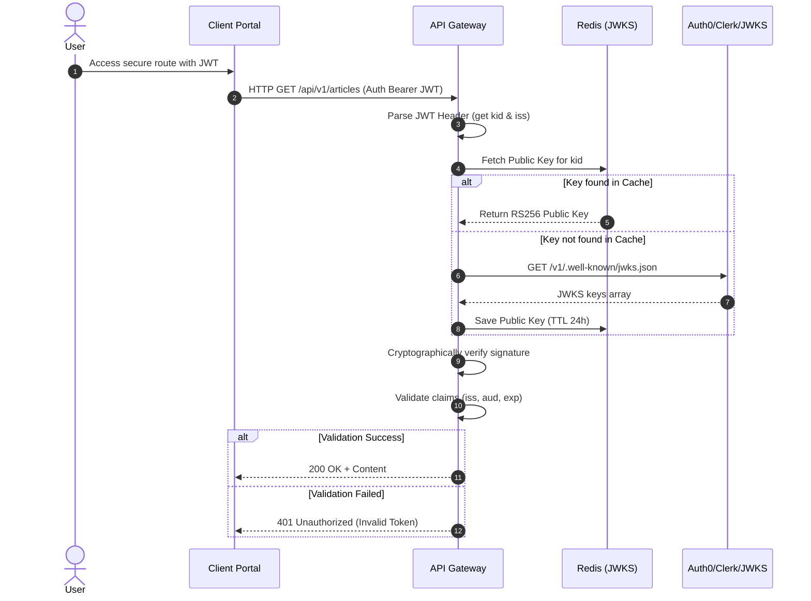
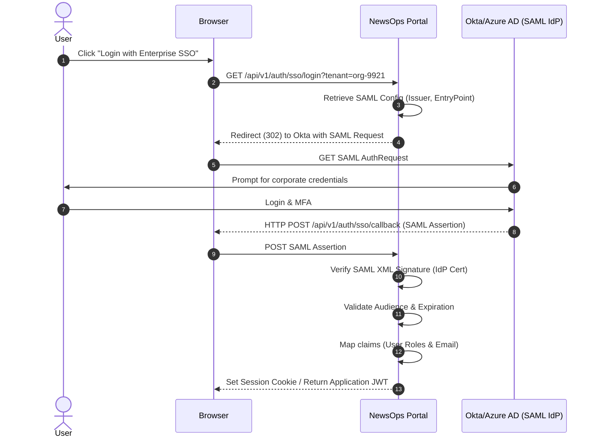

# Authentication Protocols
## Purpose
This document details the authentication architecture of the NewsOps Cloud digital publishing platform. It outlines the hybrid integration of external Identity Providers (Auth0 and Clerk), the mechanics of custom JSON Web Token (JWT) creation and verification using RS256 signature keys, and the implementation of Single Sign-On (SSO) configurations (SAML 2.0 and OIDC) for Enterprise-tier tenants.

## Executive Summary
NewsOps Cloud uses a federated identity model to authenticate users. For standard SaaS tiers, we support Clerk and Auth0 as the primary Identity Providers (IDPs). The application gateway validates incoming requests using stateless JSON Web Tokens (JWT) signed with the RS256 algorithm. For Enterprise customers, the platform supports customized Single Sign-On (SSO) integrations via SAML 2.0 and OpenID Connect (OIDC). This document describes the cryptographic verification processes, dynamic SSO config mapping, metadata ingestion, and security middleware logic.

## Vision
The authentication engine is designed to decouple user identity management from core application logic. By relying on industry-standard IDPs and secure token validation protocols, NewsOps Cloud provides robust, enterprise-grade access control with zero-trust token checking at the API gateway layer, without degrading request latency.

## Scope
This document covers:
1. **IDP Integration Strategy**: Integration maps for Clerk (individual authors/subscribers) and Auth0 (editorial teams).
2. **JWT Specifications**: Structure, claims, and RS256 verification (JWKS polling).
3. **SSO Core Architectures**: SAML 2.0 and OIDC configuration schemas and routing.

It excludes the storage of raw passwords (delegated to Clerk/Auth0) and user registration UI code.

## Goals
- **Sub-Millisecond Token Verification**: Local JWT signature checks must take $< 1.5\text{ ms}$.
- **Multi-Tenant SSO Isolation**: Dynamic routing of SAML/OIDC metadata based on tenant subdomain.
- **Resilient Key Rotation**: Automated, zero-downtime integration of key rollover via JSON Web Key Sets (JWKS).
- **High Security Standards**: Enforce strict audience (`aud`), issuer (`iss`), and expiration (`exp`) validations.

## Functional Requirements
- **Multi-IDP Support**: Resolve users from Auth0 or Clerk depending on tenant configuration.
- **JWKS Cache Pool**: Retrieve, parse, and cache public verification keys from Clerk/Auth0 JWKS endpoints.
- **SAML Assertion Consumer**: Parse and validate SAML assertions signed by enterprise IDPs (e.g., Okta, Ping Identity).
- **OIDC Discovery**: Automatically bootstrap OIDC configurations from a provided discovery URL.

## Non-Functional Requirements
- **JWT Middleware Latency**: Verification middleware must overhead $< 2\text{ ms}$ per request.
- **SSO Metadata Ingestion**: Parse SAML metadata files up to 2MB in size without blocking the event loop.
- **Gateway Throttling**: Rate limit JWKS requests to prevent denial-of-service (DoS) attempts on upstream identity providers.

## Business Rules
- **No Symmetric Key Auth**: All JWT validation must use asymmetric RS256 (or higher) signatures. Symmetric HS256 is strictly prohibited.
- **Maximum Expiry Limit**: Access tokens must have a maximum validity duration of 1 hour. Refresh tokens must not exceed 30 days.
- **SSO Enforce Rules**: Tenants configured for SSO must restrict users from logging in using standard password forms.

## Actors
- **Subscriber**: Authenticates via Clerk for read-only and paywall content.
- **Journalist/Editor**: Authenticates via Auth0 or corporate SSO to access the editorial CMS dashboard.
- **Tenant Administrator**: Configures SAML 2.0 / OIDC integrations and defines default mapping roles.
- **System Administrator**: Manages global Auth0 client settings, JWKS fallback keys, and monitors auth errors.

## User Stories
- **User Story 1**: As an Editor, I want to authenticate using my corporate Okta credentials (via SAML 2.0) so that I do not have to maintain another username and password.
- **User Story 2**: As a Platform Engineer, I want the system to validate incoming JWTs locally using cached JWKS public keys so that we don't query Auth0/Clerk on every API call.
- **User Story 3**: As a Tenant Administrator, I want to configure our OIDC discovery endpoint and map claims (e.g. `roles` to `editor`) via the settings UI to onboard our team members.

## Acceptance Criteria
- The JWT validation middleware must reject any token that does not specify an RS256 algorithm in its header.
- The JWKS client must cache public keys locally in Redis with a TTL of 24 hours, returning the cached key in $< 1\text{ ms}$.
- The SAML 2.0 client must validate both the XML signature and the assertion issue time, rejecting assertions with clock drift $> 5$ minutes.
- The OIDC config endpoint must successfully fetch and parse standard `.well-known/openid-configuration` URLs.

## Workflows
1. **User Authentication Flow via OIDC**:
   - The user requests login from a tenant dashboard (e.g. `newsops.enterprise-tenant.com/login`).
   - The frontend routes the user to the configured OIDC authorize endpoint.
   - The user completes authentication at the enterprise IDP.
   - The IDP redirects the user back to the NewsOps consumer route `/api/v1/auth/sso/callback` with an authorization code.
   - The gateway exchanges the code for tokens, resolves user claims, issues the NewsOps-specific session, and sets secure cookies.

2. **Custom JWT Signature Verification**:
   - The client invokes a protected API route with `Authorization: Bearer <JWT>`.
   - The API Gateway intercepts the request and parses the JWT header to find the Key ID (`kid`).
   - The gateway searches the local Redis JWKS cache for the matching public key.
   - If not cached, the gateway performs a rate-limited request to the IDP's JWKS endpoint, parses the public key, and caches it.
   - The gateway verifies the token signature against the public key, checks claims (`iss`, `aud`, `exp`), and appends the user context to the request.



## API Design
### SSO Configuration Registration API
This API endpoint allows tenant administrators to dynamically register or update their enterprise SSO configuration.

* **URL**: `/api/v1/tenants/:tenantId/sso`
* **Method**: `POST`
* **Headers**:
  * `Authorization: Bearer <JWT>`
  * `Content-Type: application/json`
* **Request Payload (SAML 2.0 example)**:
```json
{
  "protocol": "SAML2",
  "issuer": "http://www.okta.com/exk812abcXyz",
  "entryPoint": "https://dev-12345.oktapreview.com/app/newsops/exk812abcXyz/sso/saml",
  "cert": "-----BEGIN CERTIFICATE-----\nMIIEDDCCAvSgAwIBAgIGAYB5n1...==\n-----END CERTIFICATE-----",
  "roleMapping": {
    "OktaCMSAdmins": "admin",
    "OktaCMSAuthors": "editor"
  },
  "ipWhitelist": ["192.168.10.0/24", "10.0.0.0/8"]
}
```

* **Request Payload (OIDC example)**:
```json
{
  "protocol": "OIDC",
  "issuer": "https://identity.enterprise.com",
  "authorizationEndpoint": "https://identity.enterprise.com/oauth2/v1/authorize",
  "tokenEndpoint": "https://identity.enterprise.com/oauth2/v1/token",
  "jwksUri": "https://identity.enterprise.com/oauth2/v1/keys",
  "clientId": "newsops-enterprise-client-id-xyz",
  "clientSecret": "sec_encrypted_kms_secret_payload",
  "scope": "openid profile email roles"
}
```

* **Response Payload (200 OK)**:
```json
{
  "tenantId": "org-9921",
  "ssoEnabled": true,
  "protocol": "SAML2",
  "issuer": "http://www.okta.com/exk812abcXyz",
  "updatedAt": "2026-06-27T17:20:00Z"
}
```

* **Error Response (400 Bad Request)**:
```json
{
  "statusCode": 400,
  "message": "Invalid certificate signature format or expired certificate.",
  "error": "Bad Request"
}
```

## Database Design
SSO configuration parameters are stored in the shared identity database schema. Sensitve credentials (like `clientSecret`) are stored encrypted (using envelope encryption).

### `tenant_sso_configs` Table
* `id`: UUID (Primary Key)
* `tenant_id`: VARCHAR(50) (Unique Index, Foreign Key to Tenant table)
* `protocol`: VARCHAR(10) (e.g., 'SAML2', 'OIDC')
* `issuer`: VARCHAR(255)
* `entry_point`: VARCHAR(512) (SAML SSO URL)
* `idp_cert`: TEXT (Public certificate block)
* `client_id`: VARCHAR(255) (OIDC specific)
* `client_secret_encrypted`: BYTEA (OIDC encrypted payload)
* `jwks_uri`: VARCHAR(512)
* `role_mapping`: JSONB (Maps IDP groups to application roles)
* `created_at`: TIMESTAMP WITH TIME ZONE
* `updated_at`: TIMESTAMP WITH TIME ZONE

## UI Design
The Admin SSO Management Dashboard consists of:
- **Protocol Selector Toggle**: Radio selectors to choose between Clerk/Auth0 direct sync, SAML 2.0, or OIDC.
- **SSO configuration form fields**: Input text areas for Metadata XML, certificates, endpoints, client ID, client secret.
- **Role Mapping Grid**: Map external security group names (retrieved from the IDP assertion) to internal RBAC roles (Admin, Editor, Contributor, Subscriber).
- **Metadata Uploader**: A drag-and-drop zone allowing the upload of SAML XML configuration metadata files.

## Permissions
- `tenants:sso:write`: Grants administrative authority to add or update SSO configurations for a tenant.
- `tenants:sso:read`: Grants permissions to inspect the non-sensitive SSO configuration fields.

## Security
- **JWT Claims Validation**: The middleware MUST assert that the token contains the matching Client ID in the `aud` claim and the exact configured identity provider domain in the `iss` claim.
- **JWKS Cache Poisoning Mitigation**: Ensure public keys fetched from JWKS conform to the expected RSA exponent (typically 65537) and bit length (minimum 2048 bits).
- **Encrypted SAML Assertions**: If configured, SAML assertions must support decryption using tenant-specific private keys managed securely via KMS.

## Performance
- **Signature Check Overhead**: Target is $< 1.0\text{ ms}$ for local verification of cached keys.
- **JWKS Cache Hit Rate**: Target hit rate is $> 99.9\%$ using Redis replication.
- **Target Auth TPS**: Support 1,500 authentication checks per second.

## Monitoring
- **Prometheus Metric**: `auth_jwt_validation_success_total` (Counter)
- **Prometheus Metric**: `auth_jwt_validation_failure_total` (Counter, segmented by reason: 'expired', 'bad_signature', 'wrong_issuer')
- **Prometheus Metric**: `auth_jwks_refresh_latency_ms` (Histogram mapping upstream fetch times)
- **Alert Trigger**: If `auth_jwt_validation_failure_total` spikes by $> 20\%$ within 1 minute, trigger a slack alarm for a potential credential credential attack.

## Logging
Logging standardizes on JSON format. No access tokens or PII are written to the logs.
* **Log Pattern (Success)**: `{"timestamp": "2026-06-27T17:25:00.000Z", "level": "INFO", "context": "AuthMiddleware", "message": "JWT validated successfully", "tenant_id": "org-9921", "user_id": "usr_clerk_12345"}`
* **Log Pattern (Error)**: `{"timestamp": "2026-06-27T17:25:05.000Z", "level": "WARN", "context": "AuthMiddleware", "message": "JWT verification failed: Token expired", "tenant_id": "org-9921", "metadata": {"kid": "key_01", "expiry": "2026-06-27T17:20:00Z"}}`

## Error Handling
| Internal Error Code | HTTP Status | Customer-Facing Message |
|:---|:---|:---|
| `ERR_JWT_EXPIRED` | 401 Unauthorized | Your session has expired. Please log in again. |
| `ERR_JWT_INVALID_SIGNATURE` | 401 Unauthorized | Access denied. Invalid authentication signature. |
| `ERR_JWKS_UNREACHABLE` | 502 Bad Gateway | Authentication provider is currently unreachable. Please try again. |
| `ERR_SAML_CLOCK_SKEW` | 400 Bad Request | Single Sign-On failed. Please verify your system's clock synchronization. |

## Edge Cases
- **Key Rollover Event**: Auth0/Clerk rotates their signing certificates. The API Gateway will read a token containing an unknown `kid`. To prevent false rejections, the middleware bypasses the cache and queries the JWKS endpoint immediately, but limits this bypass to a maximum of 1 request per 10 seconds to avoid DDoS on the JWKS server.
- **Dynamic Domain Migration**: If a tenant changes their custom domain (e.g. from `portal.tenant.com` to `news.tenant.com`), the issuer claims in previous JWTs will fail. The system must maintain an active alias list of old issuers during a 24-hour grace period.

## Future Improvements
- **Continuous Session Revocation (Backchannel Logout)**: Implement OIDC backchannel logout to dynamically clear Redis sessions the moment a user is disabled in the corporate IDP.
- **Passkey Integration**: Support WebAuthn-based biometric login locally for editors bypasses traditional password prompt layers.

## Mermaid Diagrams
Below is the sequence flow for federated SAML SSO authentication:



## References
- Security Overview: [index.md](./index.md)
- RBAC and ABAC Engine design: [rbac_abac_models.md](./rbac_abac_models.md)
- Encryption Policies: [encryption_policies.md](./encryption_policies.md)
- Identity Schema Blueprint: [identity_and_org_schema.md](../03-database/identity_and_org_schema.md)
