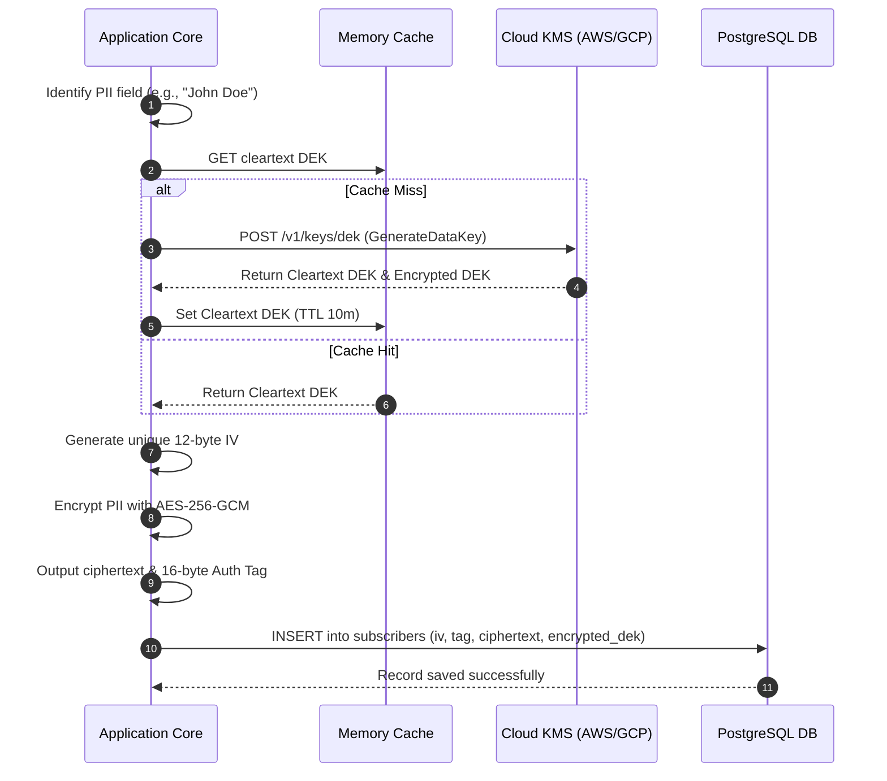
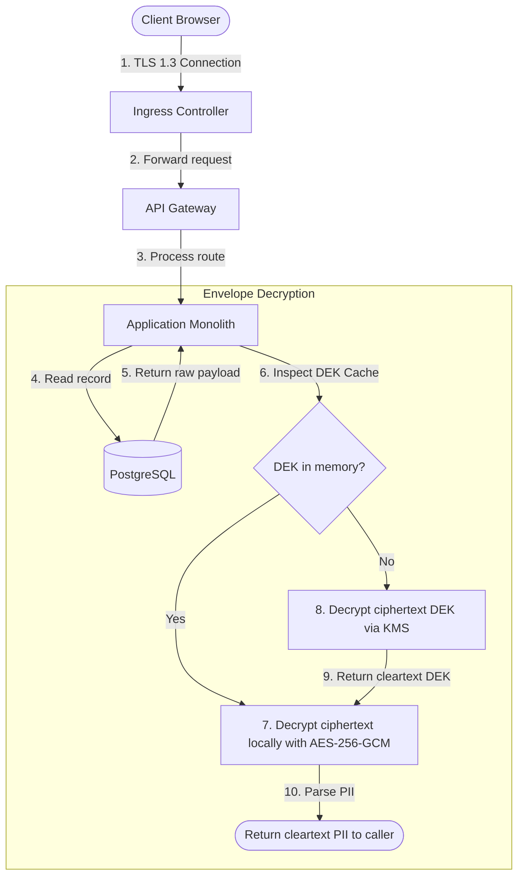

# Encryption Policies
## Purpose
This document establishes the encryption standards and implementation guidelines for the NewsOps Cloud platform. It specifies algorithms, key lengths, and workflows for protecting data at rest, data in transit, and field-level sensitive information (such as subscriber PII and API keys) utilizing Advanced Encryption Standard (AES) in Galois/Counter Mode (AES-256-GCM), Cloud Key Management Services (KMS), and Transport Layer Security (TLS) 1.3.

## Executive Summary
NewsOps Cloud operates a secure, multi-tenant database environment. To prevent unauthorized access to subscriber PII, billing credentials, and client API keys, the system enforces a strict encryption policy. Data in transit is secured exclusively using TLS 1.3. Sensitive fields at rest are protected using AES-256-GCM field-level encryption. Key management is handled via envelope encryption, where local Data Encryption Keys (DEKs) are secured by external Key Encryption Keys (KEKs) housed in a cloud KMS. This document details the cryptographic configurations, envelope workflows, and performance profiles.

## Vision
The encryption architecture provides a cryptographic defense-in-depth. If an attacker gains full access to database backups or underlying disk volumes, they will find all PII and key credentials fully encrypted. Decryption capabilities are tied strictly to localized memory containers and role-restricted cloud KMS identities.

## Scope
This document covers:
1. **Field-Level Encryption**: Enforcing AES-256-GCM for PII and API keys.
2. **Envelope Encryption Pattern**: Using KMS (AWS KMS or GCP Cloud KMS) to wrap and unwrap DEKs.
3. **Data In Transit Policies**: Enforcing TLS 1.3 and safe cipher suites at the Ingress controller.

It excludes the configuration details of third-party payment processor encryption (managed by Stripe).

## Goals
- **NIST-Compliant Cryptography**: Enforce AES-256-GCM for all field-level encryption.
- **TLS 1.3 Baseline**: Standardize on TLS 1.3, rejecting TLS 1.2 and prior versions for public API endpoints.
- **Zero-Storage of Raw Keys**: Ensure no master key material is stored on local disks or environment variables.
- **Automated KEK Rotation**: Enable automatic 90-day rotation of master keys inside the Cloud KMS.

## Functional Requirements
- **Authentic Encryption Payload**: Output format of encrypted fields must contain the Initialization Vector (IV), Ciphertext, and Authentication Tag.
- **IV Uniqueness**: Generate a cryptographically secure, unique 96-bit (12-byte) IV for every encryption action.
- **Envelope Key Wrapping**: Call the Cloud KMS API to encrypt (wrap) generated DEKs before writing them to the database.
- **Local DEK Cache**: Cache decrypted DEKs in secure, transient memory buffers to limit KMS RPC traffic.

## Non-Functional Requirements
- **Cryptographic Latency**: Field encryption/decryption overhead must be $< 1\text{ ms}$ for cached keys.
- **Entropy Source**: All random generators (IVs, salts, ephemeral keys) must consume from `/dev/urandom` via standard system crypto libraries.
- **Ingress TLS Handshake**: Target TLS handshake negotiation times of $< 50\text{ ms}$.

## Business Rules
- **No Symmetric Keys in Code**: Storing secret symmetric keys in environment variables or code repositories is strictly prohibited.
- **PII Definition**: At a minimum, email addresses, phone numbers, home addresses, API secrets, and SSO client secrets must be encrypted at the database column level.
- **Compromise Rollover**: In the event of a suspected credential leak, a manual master key rotation must be executable in under 5 minutes without service downtime.

## Actors
- **Developer**: Integrates encryption libraries, defining database columns as encrypted types.
- **Security Administrator**: Manages KMS policies, configures IAM roles, and audits key rotation schedules.
- **Infrastructure Engineer**: Standardizes TLS configurations on NGINX Ingress and load balancers.
- **Client/Subscriber**: Submits PII during registration, expecting secure transport and storage.

## User Stories
- **User Story 1**: As a Subscriber, I want my registration data to be encrypted in the database so that my email and phone number are protected in the event of a database breach.
- **User Story 2**: As a Developer, I want to use standard decorators (e.g. `@EncryptedColumn()`) in our TypeORM schemas so that I can automatically encrypt fields without managing cryptographic algorithms.
- **User Story 3**: As a Security Officer, I want our API endpoints to reject any incoming connection using outdated TLS versions (such as TLS 1.0 or 1.1) so that we prevent protocol downgrade attacks.

## Acceptance Criteria
- Field-level encryption must generate a unique IV per write; repeating IVs must fail test assertions.
- The decryption function must throw an error if the authentication tag validation fails, preventing tampering.
- TLS 1.3 configuration must only support secure cipher suites: `TLS_AES_256_GCM_SHA384` and `TLS_CHACHA20_POLY1305_SHA256`.
- The local DEK cache must clear decrypted key values from memory if they are not accessed for more than 10 minutes.

## Workflows
1. **Data Encryption (Envelope Pattern)**:
   - The application determines a row requires encryption.
   - The system checks the local cache for the active Data Encryption Key (DEK).
   - If not cached, the application requests KMS to generate a new data key. KMS returns:
     - Cleartext DEK.
     - Ciphertext DEK (encrypted by the KMS KEK).
   - The application caches the cleartext DEK.
   - The system generates a unique 12-byte IV.
   - The system encrypts the cleartext data using AES-256-GCM with the cleartext DEK and IV, generating ciphertext and a 16-byte authentication tag.
   - The system stores the IV, ciphertext, tag, and ciphertext DEK in the target database record.

2. **Data Decryption**:
   - The application reads the database record.
   - The system extracts the ciphertext DEK, IV, tag, and ciphertext.
   - The application checks the cache for the corresponding cleartext DEK.
   - If not cached, the application invokes the KMS `Decrypt` API, sending the ciphertext DEK. KMS returns the cleartext DEK.
   - The application decrypts the ciphertext using AES-256-GCM with the cleartext DEK, IV, and tag.
   - The cleartext data is returned to the request pipeline.



## API Design
### KMS Key Rotation Invalidation API
This endpoint is triggered by a KMS lifecycle webhook to notify the platform that a KEK has been rotated, prompting the application to invalidate its local DEK caches.

* **URL**: `/api/v1/security/keys/rotate`
* **Method**: `POST`
* **Headers**:
  * `Authorization: Bearer <JWT>`
  * `X-Webhook-Signature: <HMAC-Signature>`
* **Request Payload**:
```json
{
  "keyArn": "arn:aws:kms:us-east-1:123456789012:key/1234abcd-12ab-34cd-56ef-1234567890ab",
  "rotationTime": "2026-06-27T17:50:00Z",
  "version": "2"
}
```

* **Response Payload (200 OK)**:
```json
{
  "status": "success",
  "invalidatedKeysCount": 12,
  "timestamp": "2026-06-27T17:50:05Z"
}
```

## Database Design
Encrypted values are stored using structured columns to hold the cryptographic metadata alongside the ciphertext.

### Column Mapping Example (e.g. `subscribers` Table)
* `id`: UUID (Primary Key)
* `first_name_encrypted`: TEXT (Base64 representation of ciphertext)
* `first_name_iv`: VARCHAR(24) (Base64 representation of 12-byte IV)
* `first_name_tag`: VARCHAR(24) (Base64 representation of 16-byte Auth Tag)
* `encrypted_dek`: BYTEA (Housed inside the database row to allow dynamic decryption)
* `created_at`: TIMESTAMP WITH TIME ZONE

## UI Design
The Security and Cryptography settings dashboard includes:
- **TLS Compliance Status**: A dashboard showing the TLS version of all active ingress routes, flagging any legacy client connections.
- **KMS Configuration Status**: Details about the active KMS endpoint, KEK ARN, key age, and next automatic rotation target.
- **Data Re-encryption utility**: A secure admin console that allows the administrator to trigger a batch background job to re-encrypt old rows when key schemas or DEKs change.

## Permissions
- `kms:rotate`: Allows triggering key invalidation or manual rotations.
- `kms:decrypt`: Applied to the application IAM role, authorizing it to invoke the KMS Decrypt API.

## Security
- **Galois Mode Integrity**: The authentication tag MUST be evaluated. If it does not match, the decryption library must throw a critical error to prevent bit-flipping attacks.
- **TLS 1.3 Ciphers**: Disable weak ciphers like RC4, 3DES, and CBC-mode ciphers. Enforce forward secrecy (DHE/ECDHE) for all connections.

## Performance
- **Local Cryptography Latency**: Node/Go AES-256-GCM native calls run in $< 0.1\text{ ms}$.
- **KMS Call Reduction**: Caching the cleartext DEK in memory keeps KMS RPC calls to less than 0.1% of request volume.
- **Memory Security**: Ensure cleartext DEKs are stored in buffer zones that are scrubbed or overwritten during garbage collection, preventing heap-inspection leaks.

## Monitoring
- **Prometheus Metric**: `kms_api_calls_total` (Counter tracking requests to AWS/GCP KMS)
- **Prometheus Metric**: `kms_api_duration_seconds` (Histogram mapping KMS call latency)
- **Prometheus Metric**: `tls_handshake_version` (Counter tracking connection negotiations by TLS version)
- **Alert Trigger**: If `kms_api_duration_seconds` exceeds 500ms or fails continuously for 3 requests, trigger an immediate pager incident for KMS latency degradation.

## Logging
Logs are structured as JSON. Cleartext values and keys are strictly excluded.
* **Log Pattern (Encryption success)**: `{"timestamp": "2026-06-27T17:55:00.000Z", "level": "DEBUG", "context": "FieldEncryptor", "message": "Field encrypted successfully", "key_arn": "arn:aws:kms:..."}`
* **Log Pattern (Decryption error)**: `{"timestamp": "2026-06-27T17:55:05.000Z", "level": "ERROR", "context": "FieldEncryptor", "message": "Decryption failed: Integrity check failed (invalid authentication tag)"}`

## Error Handling
| Internal Error Code | HTTP Status | Customer-Facing Message |
|:---|:---|:---|
| `ERR_DECRYPTION_FAILED` | 500 Internal Error | An internal data integrity check failed. The requested resource could not be loaded safely. |
| `ERR_KMS_UNREACHABLE` | 503 Bad Gateway | The platform's key vault is temporarily unavailable. Please try again. |
| `ERR_INSECURE_TLS` | 400 Bad Request | Connection rejected. Your client must connect using TLS 1.3 or higher. |

## Edge Cases
- **KMS Outage**: If the Cloud KMS endpoint goes offline, the application can continue decrypting read requests using currently cached DEKs. To maintain security, new write requests requiring new DEKs will fail until KMS connectivity is restored.
- **Out-of-Order Rotation**: If a database backup is restored containing records encrypted with a KEK version that has been deleted, the system will fail to decrypt those fields. To mitigate this, KMS key deletion policies must enforce a 30-day minimum "pending deletion" recovery state.

## Future Improvements
- **Bring Your Own Key (BYOK)**: Allow Enterprise tenants to configure their own KMS key ARN, ensuring they retain absolute control over data decryption.
- **Searchable Encryption**: Implement cryptographically secure searchable schemes (such as blind indexing) to allow fast database querying on encrypted PII columns without decrypting the data beforehand.

## Mermaid Diagrams
Below is a flowchart mapping the TLS and Field-Level envelope encryption layers:



## References
- Security Index: [index.md](./index.md)
- API Key Security: [api_key_management.md](./api_key_management.md)
- Authentication Protocols: [authentication_protocols.md](./authentication_protocols.md)
- System Architecture Design: [system_architecture.md](../02-architecture/system_architecture.md)
