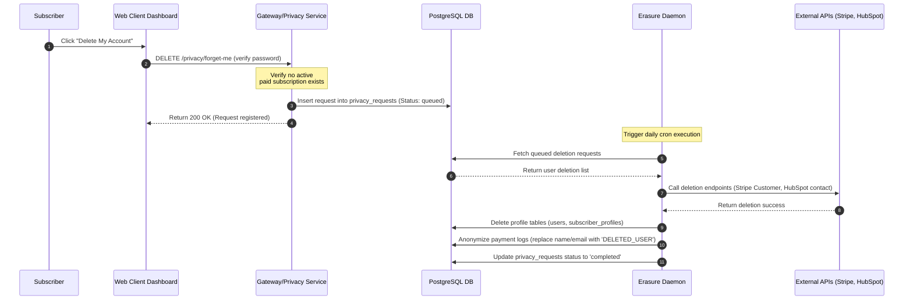

# Data Privacy and Compliance Policy (GDPR & CCPA)
## Purpose
This document details the technical implementation, schemas, and workflows required to guarantee compliance with the General Data Protection Regulation (GDPR) and the California Consumer Privacy Act (CCPA) within the NewsOps Cloud digital publishing platform. It defines subscriber double-opt-in mechanisms, consent tracking registries, data portability engines, and the automated erasure (Right to be Forgotten) daemon.

## Executive Summary
NewsOps Cloud integrates privacy-by-design at all architectural levels. User interactions, tracking consents, and subscription settings are managed via an automated consent registry. Data portability is handled through an asynchronous export engine that packs customer records into standard formats, while the "Right to be Forgotten" is enforced via a deletion daemon that purges databases and anonymizes analytical logs.

## Vision
Our vision is to provide readers with total control over their personal data through self-service interfaces. We automate compliance tasks to eliminate manual processing errors, ensuring zero compliance violations while keeping operational costs low.

## Scope
The scope of this document covers:
*   Subscriber verification workflows using double-opt-in emails.
*   The Consent Registry Database Schema, capturing user opt-in/opt-out states.
*   Data Portability Export Pipelines, generating machine-readable JSON data packages.
*   The Automated Erasure Daemon, coordinating hard-deletion processes across database clusters, caches, and third-party integrations (e.g., Stripe, HubSpot, Mailchimp).

## Goals
*   **100% Automated Compliance**: Eliminate manual intervention for processing data export and deletion requests.
*   **Fast Export Times**: Deliver data export files to users in under 24 hours (well within the GDPR 30-day compliance window).
*   **Total Deletion Integrity**: Guarantee that all Personal Identifiable Information (PII) is removed from search indexes, caches, and database backups after deletion.
*   **Consent History Auditability**: Maintain a secure, tamper-proof audit trail of changes to user consent settings.

## Functional Requirements
*   **Double-Opt-In**: New newsletter and marketing subscribers must verify their email address by clicking a unique confirmation link sent via email.
*   **Granular Consent Toggles**: Provide users with separate checkboxes to opt-in or opt-out of marketing emails, profiling algorithms, and third-party analytics sharing.
*   **Asynchronous Portability Exporter**: When requested, aggregate profile details, comment history, preferences, and payment logs into a password-protected zip file.
*   **Orchestrated Deletion Daemon**: Execute account deletion requests by removing primary database rows, purging Redis caches, and calling external APIs to delete customer profiles.
*   **Legal Retain Override**: Anonymize billing and invoice history rather than deleting it to meet tax and regulatory retention requirements.

## Non-Functional Requirements
*   **Secure Exports**: Encrypt export zip files using AES-256 and deliver them via unique, single-use presigned S3 URLs that expire after 72 hours.
*   **Deletion Timeline**: Process database deletions in real-time, and ensure third-party API deletions complete within 30 days.
*   **Anonymization Rules**: Ensure that analytical databases retain aggregated data by replacing user IDs with cryptographically secure, randomized salts rather than deleting entire columns.

## Business Rules
*   **Opt-In by Default for CCPA, Opt-Out for GDPR**:
    *   For EU visitors (GDPR), third-party tracking cookies must be blocked by default until explicit consent is given.
    *   For California visitors (CCPA), tracking is allowed by default but must include a clear "Do Not Sell My Personal Information" opt-out mechanism.
*   **Exclusion of Active Subscriptions**: Users cannot delete their accounts if they have an active paid subscription. They must cancel the subscription and wait for the billing cycle to end before requesting account deletion.
*   **Audit Record Integrity**: Prevent the deletion of audit logs. However, PII fields in audit logs (such as name and email) must be replaced with placeholder values (e.g., `DELETED_USER`).

## Actors
*   **Subscriber**: A reader or customer managing their data, consent preferences, export requests, or account deletion.
*   **Privacy Officer**: Internal compliance manager who reviews audit logs and verifies system compliance.
*   **Erasure Daemon**: Automated background runner that coordinates data deletion across database tables and external tools.
*   **Third-Party API**: Downstream systems (e.g., Stripe for billing, Mailchimp for newsletters) that receive sync requests.

## User Stories
*   **User Story 1**: As a Subscriber, I want to toggle my cookie and marketing preferences in my profile page so that the platform stops sharing my browsing behavior with third-party advertising partners.
*   **User Story 2**: As a Subscriber, I want to download a zip file containing all my comments, profile information, and subscription history so that I can inspect the data stored about me.
*   **User Story 3**: As a Subscriber, I want to request the complete deletion of my account so that all my personal data is permanently removed from the system databases and marketing lists.

## Acceptance Criteria
*   **AC 1**: Verification links for double-opt-in must expire exactly 24 hours after they are generated.
*   **AC 2**: The data export utility must produce a package containing all user data in structured, machine-readable JSON format.
*   **AC 3**: The Deletion Daemon must successfully delete user records from the databases and trigger deletion API calls to Stripe, Mailchimp, and HubSpot, updating the request status to `completed` in the database.
*   **AC 4**: Invoices and transaction records must be preserved but anonymized, removing names, physical addresses, and email addresses while preserving payment amounts and tax calculations.

## Workflows
### Workflow 1: Double-Opt-In Subscription
1.  An anonymous user enters their email address in the newsletter signup form on the website.
2.  The application inserts the email into the subscriber database with the status `pending_verification`.
3.  The system generates a secure verification token and saves it with a 24-hour expiration time.
4.  An email containing a unique verification link is sent to the user: `https://newsops.cloud/api/v1/privacy/verify-optin?token=<token>`.
5.  The user clicks the link.
6.  The system checks the token:
    *   If the token is valid, the subscriber's status is updated to `verified` in the database, and their consent is logged in the `consent_registry`.
    *   If the token is expired, the system shows an error page offering to resend a new link.
7.  The user begins receiving newsletter updates.

### Workflow 2: Automated Hard-Delete (Right to be Forgotten)
1.  An authenticated user navigates to their privacy settings and clicks "Delete My Account".
2.  The system prompts the user to confirm their password and agree to the deletion terms.
3.  The application verifies that there are no active paid subscriptions on the account.
4.  The system registers a deletion request in the `privacy_requests` table with the status `queued`.
5.  An email notification is sent to the user confirming the deletion process has started.
6.  The Erasure Daemon picks up the request during its next run:
    *   It updates the request status to `processing`.
    *   It deletes profile rows from the `users` and `subscriber_profiles` tables.
    *   It replaces PII fields in the database with anonymized placeholders (`DELETED_USER`).
    *   It calls the Stripe API to delete the customer record.
    *   It calls the Mailchimp API to unsubscribe and delete the subscriber profile.
7.  The Erasure Daemon updates the request status to `completed` and logs the completion timestamp.

## API Design
### Request Data Portability Export
Initiates the packaging of user data for export.

*   **HTTP Method**: `POST`
*   **Endpoint**: `/api/v1/privacy/export`
*   **Headers**:
    *   `Authorization: Bearer <user-jwt>`
*   **Request Payload**: None
*   **Success Response (202 Accepted)**:
```json
{
  "request_id": "prv-e5d4-4a2b-a8d7-f81d3d66141a",
  "status": "queued",
  "message": "Your data export request has been registered. You will receive an email link once the export is complete.",
  "timestamp": "2026-06-27T22:42:00Z"
}
```

### Submit Account Deletion Request
Triggers the account deletion workflow.

*   **HTTP Method**: `DELETE`
*   **Endpoint**: `/api/v1/privacy/forget-me`
*   **Headers**:
    *   `Authorization: Bearer <user-jwt>`
*   **Request Payload**:
```json
{
  "password_confirmation": "secure-user-password-123"
}
```
*   **Success Response (200 OK)**:
```json
{
  "request_id": "prv-c9f2-45e3-8d4a-c102a9b3c4d5",
  "status": "queued",
  "message": "Account deletion request received. Your account will be purged and anonymized.",
  "timestamp": "2026-06-27T22:43:00Z"
}
```

## Database Design
To manage consent settings and track data privacy requests, we define the following tables.

### Schema: `consent_registry`
Tracks user opt-in and opt-out events over time.

| Column Name | Data Type | Constraints | Description |
| :--- | :--- | :--- | :--- |
| `id` | `UUID` | `PRIMARY KEY` | Unique record ID. |
| `user_id` | `VARCHAR(50)` | `NOT NULL` | ID of the user. |
| `consent_type` | `VARCHAR(50)` | `NOT NULL` | `marketing`, `analytics`, `profiling` |
| `granted` | `BOOLEAN` | `NOT NULL` | `true` if opt-in, `false` if opt-out. |
| `updated_at` | `TIMESTAMP` | `NOT NULL` | Timestamp of the update. |
| `ip_address` | `INET` | `NOT NULL` | IP address where consent was given. |

```sql
CREATE TABLE consent_registry (
    id UUID PRIMARY KEY DEFAULT gen_random_uuid(),
    user_id VARCHAR(50) NOT NULL,
    consent_type VARCHAR(50) NOT NULL CHECK (consent_type IN ('marketing', 'analytics', 'profiling')),
    granted BOOLEAN NOT NULL,
    updated_at TIMESTAMP WITH TIME ZONE DEFAULT CURRENT_TIMESTAMP,
    ip_address INET NOT NULL
);

CREATE INDEX idx_consent_lookup ON consent_registry (user_id, consent_type);
```

### Schema: `privacy_requests`
Tracks the progress of data export and account deletion requests.

```sql
CREATE TABLE privacy_requests (
    id UUID PRIMARY KEY DEFAULT gen_random_uuid(),
    user_id VARCHAR(50) NOT NULL,
    request_type VARCHAR(20) NOT NULL CHECK (request_type IN ('export', 'delete')),
    status VARCHAR(20) NOT NULL CHECK (status IN ('queued', 'processing', 'completed', 'failed')),
    created_at TIMESTAMP WITH TIME ZONE DEFAULT CURRENT_TIMESTAMP,
    completed_at TIMESTAMP WITH TIME ZONE,
    error_message TEXT
);
```

## UI Design
Users manage privacy and data options through their account settings panel.

### Interface Details
1.  **Consent Options Widget**: List of toggle switches matching entries in `consent_registry` (e.g., "Personalized newsletter matches", "Anonymous analytics tracking"). Changes are saved instantly.
2.  **Data Request Control Center**:
    *   A card explaining the Right to Data Portability with a button labeled "Download My Personal Data".
    *   A card explaining the Right to Erasure with a button labeled "Delete My Account".
3.  **Delete Account Form**: A modal that appears when a user clicks the delete button. It requires password validation and checking an "I understand this action is irreversible" checkbox before submitting.

## Permissions
*   **RBAC Permissions**:
    *   `privacy:manage`: Allows users to modify their consent toggles and submit export/deletion requests.
    *   `privacy:admin`: Allows platform engineers and security administrators to inspect requests, track deletion failures, and verify external system synchronization.

## Security
*   **Data Pseudonymization**: Analytical databases must map identifiers using an HMAC function combined with a daily rotating salt:
    `anonymized_id = HMAC_SHA256(user_id, daily_salt_key)`.
*   **Export Verification**: Data export packages are encrypted with a random password sent to the user's registered phone number via SMS or a separate email, preventing unauthorized access if the export link is intercepted.
*   **Input Sanitization**: Validate parameters across the platform to ensure input values are sanitized, protecting against script injection and session hijack attacks.

## Performance
*   **Consent Check Latency**: Less than 5ms for active cookie banners by caching consent states in Redis memory stores.
*   **Exporter Resource Throttling**: The data exporter runs in a low-priority background process queue to prevent CPU spikes from affecting regular database operations.
*   **Daemon Schedule**: The Erasure Daemon executes daily during low-traffic periods (02:00 UTC).

## Monitoring
We monitor privacy requests using Prometheus metrics.

### Prometheus Metrics
*   `privacy_requests_total{type="export|delete", status="queued|processing|completed|failed"}`
*   `consent_changes_total{type="marketing|analytics", action="granted|revoked"}`
*   `double_opt_in_failures_total`: Counter tracking expired or invalid verification link attempts.

### Alerting Rules
*   **Alert `PrivacyRequestProcessingDelayed`**: Triggers if a delete or export request remains in the `queued` or `processing` state for more than 48 hours.
*   **Alert `ErasureSyncFailed`**: Triggers if the Deletion Daemon fails to process downstream API cleanup calls for integrations like Stripe or Mailchimp.

## Logging
The system logs compliance events to provide a clear audit trail.

### Example Log Output
```json
{
  "timestamp": "2026-06-27T22:45:00.012Z",
  "level": "INFO",
  "logger": "com.newsops.security.privacy.ErasureDaemon",
  "message": "User account successfully purged and anonymized",
  "context": {
    "request_id": "prv-c9f2-45e3-8d4a-c102a9b3c4d5",
    "user_id_hash": "a8f6e2b9c7d4e5f6a1b2c3d4e5f6a7b8c9d0e1f2a3b4c5d6e7f8a9b0c1d2e3f4",
    "stripe_deleted": true,
    "mailchimp_deleted": true,
    "duration_ms": 1420
  }
}
```

## Error Handling
| Error Code | HTTP Status | Customer-Facing Message | System Resolution Action |
| :--- | :--- | :--- | :--- |
| `ERR_ACTIVE_SUBSCRIPTION` | `400` | "Your account cannot be deleted while you have an active subscription." | Inform the user of their active billing status and redirect them to the subscription cancellation page. |
| `ERR_TOKEN_EXPIRED` | `400` | "The verification link has expired. Please request a new one." | Reject the opt-in confirmation and send a new verification email to the user. |
| `ERR_THIRD_PARTY_TIMEOUT` | `500` | "Processing request with external partners timed out." | Retain the request in the queue, retry downstream API calls with backoff, and notify the privacy engineer if failures persist. |

## Edge Cases
*   **Active Subscriptions**: If a user requests deletion while having active subscription access, the request is blocked. Users must cancel subscriptions and wait for the billing cycle to end, or contact support for immediate cancellation.
*   **Failed API Integrations**: If Mailchimp or HubSpot APIs are offline when the Erasure Daemon runs, the daemon marks the request as `failed` and retries the connection during the next run.
*   **Shared Content (Comments/Discussions)**: If a user's account is deleted, their comments on articles are anonymized and displayed as "Deleted User" rather than deleted entirely, preserving the context of discussion threads.

## Future Improvements
*   **Zero-Knowledge Consent Registry**: Implement cryptographically secure consent records using zero-knowledge proofs, allowing users to verify their consent status without exposing personal details.
*   **Self-Hosting Portability Package**: Package data exports as portable static web apps, allowing users to browse their exported history offline in a web browser.

## Mermaid Diagrams
### Right to be Forgotten (Account Deletion) Sequence Diagram



## References
*   [Identity and Organization Schema](../03-database/identity_and_org_schema.md)
*   [Unified ERD](../03-database/unified_erd.md)
*   [Secrets Management](secrets_management.md)
