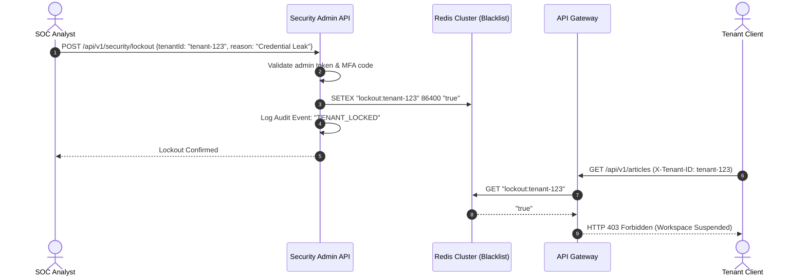
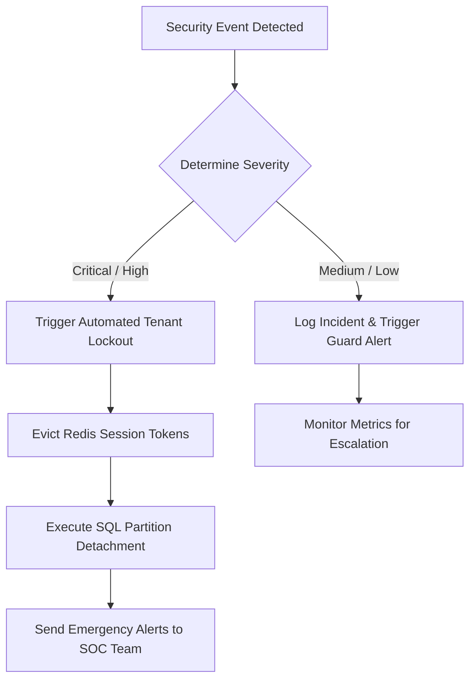

# Operations Incident Response Plan

## Purpose
This document provides the operational procedures, security classifications, mitigation triggers, and recovery plans for security incidents affecting the NewsOps Cloud digital publishing platform. It details automated and manual mitigation actions, database partition isolation procedures, and reporting frameworks.

## Executive Summary
The NewsOps Cloud Incident Response Plan (IRP) defines the lifecycle of security incidents. It contains actionable mechanisms to isolate database partitions, trigger global and tenant-specific API lockouts, classify breaches systematically, and document incidents using standardized templates. By integrating automated incident controls directly into our NestJS microservices and PostgreSQL backend, the platform reduces security blast radiuses to the minimum possible footprint.

## Vision
To establish an resilient operational posture where security anomalies are detected instantly, contained programmatically, and resolved with minimum disruption to uninvolved platform tenants.

## Scope
This plan covers all systems inside the NewsOps Cloud infrastructure, including tenant workspaces, databases, DNS layers, public APIs, third-party integrations, and operations teams.

## Goals
- **Minimize Blast Radius**: Isolate compromise events to individual tenants or subnets within 5 minutes of detection.
- **Provide Instant Lockouts**: Expose programmatic API lockout triggers for compromised customer accounts.
- **Maintain Data Integrity**: Isolate PostgreSQL partitions cleanly during database leaks to prevent cross-tenant data pollution.
- **Standardize reporting**: Ensure all incidents are recorded, audited, and closed following strict SOC 2 compliance paths.

## Functional Requirements
1. **Breach Classification**: Establish a 4-tier incident severity framework (Critical, High, Medium, Low) with concrete definitions and response windows.
2. **Programmatic Lockout Endpoint Triggers**:
   - Provide endpoints to suspend specific tenant workspaces, disabling all JWT and API key authentication for that tenant immediately.
   - Provide a global circuit breaker endpoint to place the API gateway in Read-Only mode or block all public traffic in extreme scenarios.
3. **Database Partition Isolation**:
   - Leverage PostgreSQL Row Level Security (RLS) and schema partition tables.
   - Enable commands to revoke access to a specific tenant partition table or detach partition tables dynamically from the master table without dropping data.
4. **Security Incident Reporting Templates**:
   - Provide templates to log incident vectors, impacted assets, root cause analyses, and actions taken.

## Non-Functional Requirements
1. **Lockout Trigger Latency**: Suspensions triggered via the lockout endpoints must take effect platform-wide in less than 500 milliseconds across all active API instances.
2. **Database Detach Time**: Decoupling a compromised database partition must complete in under 2 seconds.
3. **High Availability**: Incident controls must run on separate dedicated administration routes that bypass standard tenant rate limiters.

## Business Rules
- **Rule 1**: Only authorized security operators or automated threat systems (WAF, IDS) can invoke lockout or database isolation endpoints.
- **Rule 2**: Once a partition is isolated, it must remain offline until a post-incident review verifies data clean state.
- **Rule 3**: All lockout actions must be logged directly to the immutable security audit system and require two-factor confirmation if triggered manually.

## Actors
- **Security Operations Center (SOC) Analyst**: Triggers security protocols, reviews audit logs, and coordinates response.
- **Automated Threat Detection System (WAF/IDS)**: Detects automated attacks and programmatically invokes API locks.
- **Tenant Administrator**: The customer administrator whose account is being managed or isolated during an incident.
- **Platform Infrastructure Engineer**: Executes manual database recovery and restoration actions.

## User Stories (At least 3 specific stories)
- **User Story 1: Automated Tenant Lockout on Credential Stuffing**
  As a SOC Analyst, I want the system to detect credential stuffing attacks against a specific tenant workspace and trigger an automated API lockout for that workspace, so that further brute force attempts are blocked while other tenant workspaces operate unaffected.
- **User Story 2: Instant Database Partition Isolation during Breach**
  As an Infrastructure Engineer, I want to execute a secure command that detaches a compromised tenant's database partition from the master query pool, so that we can inspect their database tables without risking data leakage into other tenants' memory spaces.
- **User Story 3: Standardized Incident Documentation**
  As a Security Manager, I want to retrieve a pre-filled incident report template detailing the timestamps, locked components, and IP addresses involved in the breach, so that we can compile a SOC 2 audit report quickly.

## Acceptance Criteria (At least 3-5 criteria with clear thresholds)
- **AC 1 (Lockout Latency)**: When a lockout is triggered, Redis token blacklist caches must be updated instantly. Next API requests from the locked tenant must receive HTTP `403 Forbidden` with body `{"error": "Workspace Suspended"}` in less than 500ms.
- **AC 2 (Partition Separation)**: The system must successfully detach PostgreSQL partitions using the SQL query: `ALTER TABLE main_table DETACH PARTITION tenant_partition_table`. The detached partition must not respond to reads/writes on the main query context.
- **AC 3 (Report Generation)**: The Incident Reporting system must automatically serialize incident details to Markdown format and store it in an encrypted S3 bucket.

## Workflows (Step-by-step description of system and user interactions)

### 1. Database Partition Isolation and Recovery Workflow
In the event of a detected tenant-specific SQL injection or data leak:
1. Threat detection generates an event identifying tenant `tenant-123` as compromised.
2. The orchestrator calls the security management API `/api/v1/security/isolation/tenant-123`.
3. The API gateway issues a block on tenant `tenant-123` credentials in the cache.
4. The database administration service runs the partition detachment script:
   `ALTER TABLE articles DETACH PARTITION articles_tenant_123;`
   `ALTER TABLE users DETACH PARTITION users_tenant_123;`
5. The PostgreSQL roles associated with tenant `tenant-123` are altered to disable login.
6. The operations team is notified via PagerDuty with the details of the isolated partition.
7. Post-incident cleanup occurs; the partition is scanned for malicious payloads, restored if needed, and reattached using `ALTER TABLE articles ATTACH PARTITION articles_tenant_123 FOR VALUES IN ('tenant-123')`.

### 2. Lockout Endpoint Enforcement Workflow
When a tenant lockout is triggered via the administrative control panel:



## API Design (Provide actual REST endpoints, method, request/response JSON payloads, or GraphQL schemas)

### Lockout Activation Endpoint
Triggers a lockout on a target tenant workspace or globally.

- **Method**: `POST`
- **Path**: `/api/v1/security/lockout`
- **Request Headers**:
  - `Authorization: Bearer <Admin_JWT>`
  - `X-MFA-Code: 123456`
- **Request JSON Payload**:
  ```json
  {
    "scope": "TENANT",
    "targetId": "tenant-123",
    "durationMinutes": 1440,
    "reason": "Suspected data breach - database partition isolation required.",
    "isolationRequired": true
  }
  ```
- **Response JSON Payload (Success)**:
  ```json
  {
    "lockoutId": "lock-8822-4411",
    "scope": "TENANT",
    "targetId": "tenant-123",
    "status": "ACTIVE",
    "isolationStatus": "PARTITION_DETACHED",
    "timestamp": "2026-06-27T22:43:00Z"
  }
  ```

### Database Partition Isolation Status
Enables checking and altering the connection status of specific tenant database partitions.

- **Method**: `GET`
- **Path**: `/api/v1/security/isolation/status`
- **Request Headers**:
  - `Authorization: Bearer <Admin_JWT>`
- **Response JSON Payload**:
  ```json
  {
    "tenantId": "tenant-123",
    "partitions": [
      {
        "tableName": "articles_tenant_123",
        "attached": false,
        "rowCount": 82014,
        "lastDetachedAt": "2026-06-27T22:43:01Z"
      },
      {
        "tableName": "users_tenant_123",
        "attached": false,
        "rowCount": 421,
        "lastDetachedAt": "2026-06-27T22:43:01Z"
      }
    ]
  }
  ```

## Database Design (Identify schema tables, fields, and indexes relevant to this feature)

To trace incidents and support active lockouts, the system utilizes the following schema structures.

### Table: `active_lockouts`
Tracks active locks currently enforced by the API Gateway.

| Column Name | Data Type | Constraints | Description |
| :--- | :--- | :--- | :--- |
| `id` | `UUID` | `PRIMARY KEY`, `DEFAULT gen_random_uuid()` | Lock ID |
| `scope` | `VARCHAR(20)` | `NOT NULL` | Either `GLOBAL` or `TENANT` |
| `tenant_id` | `VARCHAR(100)` | `NULLABLE` | Targeted tenant ID (if TENANT scope) |
| `reason` | `TEXT` | `NOT NULL` | Reason for enforcement |
| `created_at` | `TIMESTAMPTZ` | `DEFAULT NOW()` | Date of lockout initialization |
| `expires_at` | `TIMESTAMPTZ` | `NOT NULL` | End time for lockout enforcement |
| `triggered_by` | `UUID` | `NOT NULL` | Admin user UUID |

### Table: `isolated_partitions`
Maintains log records of database schema/partition decoupling events.

| Column Name | Data Type | Constraints | Description |
| :--- | :--- | :--- | :--- |
| `id` | `UUID` | `PRIMARY KEY` | Record ID |
| `tenant_id` | `VARCHAR(100)` | `NOT NULL` | Tenant matching the database schema |
| `partition_name`| `VARCHAR(255)` | `NOT NULL` | Database partition table name |
| `detached_at` | `TIMESTAMPTZ` | `NOT NULL` | Date/time detached |
| `attached_at` | `TIMESTAMPTZ` | `NULLABLE` | Date/time reattached |
| `audit_log_id` | `UUID` | `NOT NULL` | Link to security incident log |

```sql
CREATE UNIQUE INDEX idx_active_lockouts_tenant ON active_lockouts(tenant_id) WHERE scope = 'TENANT';
CREATE INDEX idx_isolated_partitions_tenant ON isolated_partitions(tenant_id);
```

## UI Design (Describe component structure, layouts, actions, and states)
The Security Control Portal UI features specific pages to handle these controls:
- **Security Operations Dashboard**: A unified control dashboard that lists all active tenants. Contains a large red button labeled "Trigger Emergency Tenant Lockout". Clicking it requests an MFA token and prompts for confirmation of partition isolation.
- **Incident Lock Status Monitor**: Shows real-time statuses (Green/Yellow/Red) for all database partitions. If a partition is detached, it displays a status banner: "Partition articles_tenant_123: DETACHED - Isolation Active".
- **Incident Logger Form**: Form to fill and auto-populate incident data fields, including system logs, active IPs, and payload samples before saving reports.

## Permissions (Specify RBAC permissions required, e.g., organizations:read, articles:write)
- `security:lockout:trigger`: Required to execute the lockout activation endpoint.
- `security:lockout:read`: Required to view active lockouts.
- `database:partition:manage`: Permissions to detach, attach, or alter tables at the SQL level.
- `security:incident:write`: Permitted to generate and commit security incident reports to the platform logs.

## Security (Detail security considerations, e.g., input validation, CSRF, JWT validation)

### Encryption Schemes
- **S3 Bucket Encryption**: Incident reports are stored with Server-Side Encryption using AWS KMS managed keys (`aws/s3`) with rotation.
- **Administrative MFA**: Lockout commands require a validated TOTP token generated using HMAC-based One-Time Passwords (RFC 6238) verified in real-time.

### Policy Engines
- **OPA (Open Policy Agent)**: Enforces access bounds for administrative APIs. Admin APIs reject commands if the requesting identity's OPA rule evaluation returns `deny`.

## Performance (State latency limits, caching requirements, target TPS)
- **Target TPS**: Administration endpoints are isolated on separate controller nodes, designed for 100% responsiveness at up to 100 parallel emergency requests.
- **Latency Limits**:
  - Redis cache replication to edge API Gateways: `<100ms`
  - SQL query execution for partition decoupling: `<1.5s`

## Monitoring (Detail Prometheus metrics names, alert triggers)
Metrics exported to Prometheus:
- `ops_incident_active_lockouts`: Gauge representing the number of currently active lockouts.
- `ops_incident_isolated_partitions_total`: Counter tracking the cumulative number of isolated partitions.
- `ops_incident_gate_closed_status`: Gauge reflecting if global APIs are locked down (1 = Locked, 0 = Normal).

Alert Rules:
- Trigger immediate Slack/PagerDuty notification if `ops_incident_active_lockouts` > 0.
- Trigger high priority operational wake-up if `ops_incident_gate_closed_status` == 1.

## Logging (Specify log formats, error levels, log contexts)
Logging of emergency executions is detailed to support root cause analysis:

```json
{
  "timestamp": "2026-06-27T22:43:05.991Z",
  "level": "EMERGENCY",
  "event_type": "PARTITION_ISOLATION_EXECUTED",
  "context": {
    "tenant_id": "tenant-123",
    "partition_tables": ["articles_tenant_123", "users_tenant_123"],
    "db_host": "db-primary.newsops.internal",
    "triggered_by": "admin-user-bf8e-99f1",
    "lockout_id": "lock-8822-4411"
  },
  "message": "PostgreSQL partitions successfully decoupled from main schemas. Row read/write access blocked."
}
```

## Error Handling (Map input/system error codes to HTTP status and customer-facing messages)

| Internal Error Code | HTTP Status | Customer-Facing Message | System Trigger Context |
| :--- | :--- | :--- | :--- |
| `INC-LOCK-001` | `403 Forbidden` | "Lockout validation failed. Action requires multi-factor token authentication." | MFA token missing or invalid. |
| `INC-LOCK-002` | `404 Not Found` | "The requested tenant workspace does not exist." | Lockout target ID is invalid. |
| `INC-DB-001` | `500 Internal Error`| "Database isolation query failed. Table locks active." | PostgreSQL partition lock contention blocking detaching queries. |
| `INC-AUTH-001` | `401 Unauthorized` | "Access denied. Insufficient administrative privileges." | Normal user attempting to use incident API. |

## Edge Cases (Handle race conditions, rate limit hits, upstream timeouts)
- **Database Table Lock Contention**: During high traffic volumes, `ALTER TABLE DETACH PARTITION` might block waiting for active queries to complete. Resolved by forcing the connection pool to drop all active connections targeting the specific tenant before executing the partition detach command, using:
  `SELECT pg_terminate_backend(pid) FROM pg_stat_activity WHERE datname = 'newsops' AND query LIKE '%tenant-123%';`
- **Redis Cache Outage**: If the Redis cache fails, the API gateway falls back to query the PostgreSQL primary database directly every 10 seconds for the lockout blacklist.
- **MFA Token Drift**: Desynchronization between user authentication device and server times. Resolved by validating TOTP tokens with a window of +/- 1 time step (30 seconds before and after).

## Future Improvements (Provide long-term scaling, architecture refactor paths)
- **Automated AI Containment**: Integrate AI-driven anomaly engines to monitor outbound bandwidth and initiate lockouts instantly when exfiltration signatures are detected.
- **Zero-Downtime Re-Attaching**: Utilize lazy-indexing schema methods to attach partitions asynchronously, eliminating schema lock queues during business hours.

## Mermaid Diagrams (Include at least one high-quality diagram: flowchart, sequence, or ERD)

### Incident Response Containment Flow


## References (Reference other related files in the repository using standard relative markdown links, e.g., '../02-architecture/system_architecture.md')
- [Disaster Recovery Plan](../02-architecture/disaster_recovery.md)
- [Zero Cost MVP Security Protocols](../02-architecture/zero_cost_mvp_architecture.md)
- [API Gateway Security Middlewares](../09-api/index.md)
