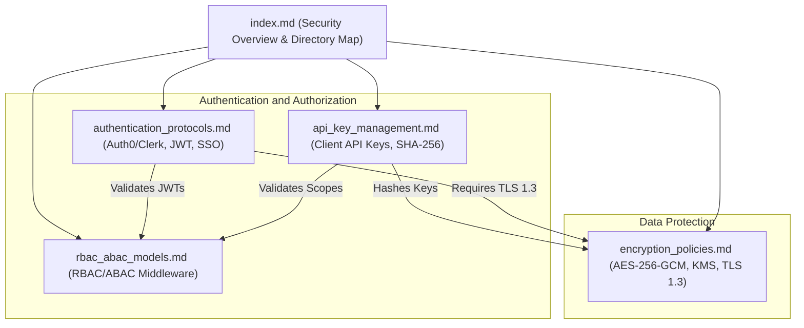

# Security Overview
## Purpose
This document serves as the primary directory map and introductory guide for the security architecture of the NewsOps Cloud digital publishing operating system. It lists the core security protocols, outlines key protection strategies, and maps the contents of the `10-security` directory to ensure system engineers, security teams, and compliance auditors can rapidly navigate our security guidelines and implementations.

## Executive Summary
NewsOps Cloud employs a multi-tiered security model to protect multi-tenant publisher ecosystems, subscriber PII, and API integrity. We enforce a zero-trust architecture across all layers. The security framework consists of modern externalized identity providers (Auth0/Clerk) paired with custom JWT validation engines, hybrid RBAC and ABAC policy evaluation engines, secure client API key management utilizing one-way cryptographic hashes, and robust envelope encryption patterns backed by Cloud Key Management Services (KMS). This directory outlines the architectures and policies that enforce these structures.

## Vision
Our vision is to provide a zero-trust, highly performant publishing platform where tenant isolation is cryptographically and logically absolute. Security is treated as an automated, non-bypassable layer integrated into the application runtime, enabling developers to build features without managing raw cryptographic keys, manual permission mappings, or raw SSO configurations.

## Scope
The scope of this security directory covers:
1. **Authentication Protocols** (`authentication_protocols.md`): Details the integrations with Auth0 and Clerk, custom RS256 JWT validation, and enterprise SAML 2.0/OIDC configurations.
2. **RBAC & ABAC Policy Engines** (`rbac_abac_models.md`): Explains the dynamic permission engine, context attributes (such as IP CIDR checks and office hours), and middleware implementation.
3. **API Key Management** (`api_key_management.md`): Covers the cryptographically secure generation, salted SHA-256 storage, fast cache validation, and key rotation workflows.
4. **Encryption Policies** (`encryption_policies.md`): Standardizes AES-256-GCM field-level encryption, KMS-backed envelope encryption, and TLS 1.3 server configurations.

This directory excludes physical network boundary security (VPCs/firewalls) and Kubernetes ingress controller configurations, which are defined in the infrastructure documentation.

## Goals
- **Unified Navigation**: Provide a single, complete directory index for locating security standards.
- **Verification Readiness**: Maintain automatic compliance checks verifying that all security sub-files remain aligned with system integrations.
- **Zero Hardcoded Secrets**: Enforce that no secrets, private keys, or raw passwords are defined anywhere in this documentation or the codebase.
- **Fast Searchability**: Ensure all sub-documents are logically structured to allow engineers to locate security policies in under 10 seconds.

## Functional Requirements
- **Directory Mapping**: The index must provide a clear map of all security sub-files and their primary purposes.
- **Compliance Status API**: The system must provide a unified API endpoint to retrieve the current compliance and status of system security endpoints.
- **Reference Integrity**: All links within the documentation must be verified as valid and reachable by the documentation linter.

## Non-Functional Requirements
- **Linter Build Latency**: The validation script for links and structure must compile in under 5 seconds.
- **API Read Latency**: The security status metadata endpoint must respond in less than 20ms under ordinary system loads.
- **Accuracy**: The information within the directory must reflect the live implementation versions of Auth0, Clerk, and OpenSSL configurations.

## Business Rules
- **No Documentation Bypass**: Any modification to security policies (e.g. changing token expiration times, adding new encryption algorithms) must update the corresponding file in this directory concurrently with code implementation.
- **Least Privilege Access**: Documentation of specific security vulnerabilities or internal system architectures must be restricted to SecOps and Platform Engineers.
- **Standardized Cryptography**: Only algorithms explicitly authorized in `encryption_policies.md` (e.g. AES-256-GCM, SHA-256, RS256) may be described or deployed in the NewsOps system.

## Actors
- **Security Administrator**: Manages keys, audits policies, and reviews the security documentation.
- **Platform Engineer**: Implements security middleware, auth integrations, and verifies cryptographic pipelines.
- **Tenant Administrator**: Configures tenant-specific SSO settings, creates API keys, and sets ABAC rules.
- **Compliance Auditor**: Inspects the documentation and logs to verify adherence to ISO 27001 and SOC 2 Type II guidelines.

## User Stories
- **User Story 1**: As a Security Administrator, I want a single entry point to all security policies so that I can inspect our compliance readiness for an upcoming SOC 2 audit.
- **User Story 2**: As a Platform Engineer, I want a clear directory map with direct links so that I can quickly navigate to the RBAC/ABAC middleware documentation to implement dynamic field filtering.
- **User Story 3**: As a Tenant Administrator, I want to reference the API key guidelines from this index so that I can verify my custom automation scripts are storing keys securely.

## Acceptance Criteria
- The index must contain direct relative links to the four security documents: `authentication_protocols.md`, `rbac_abac_models.md`, `api_key_management.md`, and `encryption_policies.md`.
- All external security standards (such as TLS 1.3 and AES-256-GCM) mentioned in the sub-files must be indexed in the system summary table.
- A structural validation test must assert that all 26 required headings are present in every file in the `10-security` folder.

## Workflows
1. **Security Policy Navigation Workflow**:
   - The user opens `docs/10-security/index.md` in the developer portal.
   - The user selects the required policy document (e.g. Encryption Policies) based on their current task.
   - The system redirects the user using standard markdown relative paths.
2. **Directory Integrity Verification Workflow**:
   - The documentation CI/CD pipeline runs a scan using `markdown-link-check`.
   - The scanner parses `index.md` and validates the target links.
   - If any link is broken or a sub-file is missing from the directory, the build fails and alerts the Platform team.

## API Design
### Security Overview Metadata Endpoint
This administrative endpoint returns the state and version of security policies currently enforced by the active NewsOps gateway.

* **URL**: `/api/v1/security/status`
* **Method**: `GET`
* **Headers**:
  * `Authorization: Bearer <JWT>`
  * `X-Tenant-ID: system`
* **Response Payload (200 OK)**:
```json
{
  "status": "healthy",
  "version": "v1.0.0",
  "protocols": {
    "auth_provider": "hybrid_auth0_clerk",
    "jwt_verification": "RS256",
    "supported_tls": ["TLSv1.3"],
    "minimum_encryption": "AES_256_GCM"
  },
  "modules_mapped": [
    {
      "file": "authentication_protocols.md",
      "status": "active",
      "last_audited": "2026-06-25T12:00:00Z"
    },
    {
      "file": "rbac_abac_models.md",
      "status": "active",
      "last_audited": "2026-06-25T12:00:00Z"
    },
    {
      "file": "api_key_management.md",
      "status": "active",
      "last_audited": "2026-06-25T12:00:00Z"
    },
    {
      "file": "encryption_policies.md",
      "status": "active",
      "last_audited": "2026-06-25T12:00:00Z"
    }
  ]
}
```

* **Error Response (401 Unauthorized)**:
```json
{
  "statusCode": 401,
  "message": "Invalid or expired JWT signature.",
  "error": "Unauthorized"
}
```

## Database Design
To track security documentation audits and changes, the administrative database maintains the following table:

### `security_policy_registry` Table
* `id`: UUID (Primary Key)
* `filename`: VARCHAR(100) (Unique, Index)
* `sha256_hash`: CHAR(64) (Integrity hash of the document)
* `last_reviewed_by`: VARCHAR(150)
* `last_reviewed_at`: TIMESTAMP WITH TIME ZONE
* `status`: VARCHAR(20) (e.g., 'Draft', 'Approved', 'Deprecated')

## UI Design
The Developer Portal Security Hub layout contains:
- **Index Navigation Grid**: A card-based dashboard layout where each card corresponds to a security file (Auth, RBAC/ABAC, API Keys, Encryption).
- **Compliance Status Indicator**: A live status indicator reporting the security baseline alignment (e.g. "TLS 1.3 Checked", "KMS Rotation Active").
- **Audit Logging View**: A table listing the last modified times, commit SHAs, and author names for each file in the `10-security` directory.

## Permissions
Access to the security directory metadata API requires the following permission:
- `security:read`: Grants permission to query `/api/v1/security/status` and read configurations.
- `security:write`: Grants permission to write audits or register new security guidelines.

## Security
- **Confidentiality**: The overview file must never reference private keys, development connection strings, or specific tenant domains.
- **Verification Integrity**: Any code parsing this directory index must prevent path traversal attacks (e.g., ensuring paths cannot resolve to `../../`).

## Performance
- **Caching**: The response of `/api/v1/security/status` is cached in Redis for 10 minutes, as system security configurations change infrequently.
- **Target TPS**: 100 transactions per second (TPS).
- **Latency Limit**: Maximum response latency of 15ms.

## Monitoring
- **Prometheus Metric**: `security_directory_access_total` (Counter tracking views of the security overview metadata).
- **Prometheus Metric**: `security_config_drift_flag` (Gauge, 0 for normal, 1 if system settings do not match the index rules).
- **Alert Trigger**: If `security_config_drift_flag` remains at 1 for more than 5 minutes, trigger a PagerDuty alert to the SecOps team.

## Logging
Logs are generated in JSON format for audits:
* **Log Pattern**: `{"timestamp": "2026-06-27T17:15:00.000Z", "level": "INFO", "context": "SecurityHub", "message": "Security index metadata queried", "actor": "system-admin-01"}`
* **Error Log Pattern**: `{"timestamp": "2026-06-27T17:15:05.000Z", "level": "ERROR", "context": "SecurityHub", "message": "Failed to read security configuration directory: Permission denied", "error": "EACCES"}`

## Error Handling
| Internal Error Code | HTTP Status | Customer-Facing Message |
|:---|:---|:---|
| `ERR_DIR_READ_FAILED` | 500 Internal Error | The system failed to parse the security configuration index. Contact support. |
| `ERR_UNAUTHORIZED_AUDIT` | 403 Forbidden | You do not have the security:read permissions required to audit security parameters. |
| `ERR_CONFIG_MISMATCH` | 400 Bad Request | The requested security setup does not match the approved security policy suite. |

## Edge Cases
- **Dynamic Configuration Updates**: If KMS keys rotate while the security configuration is being read, the API must read the latest cache without locking the entire HTTP pipeline, ensuring uninterrupted traffic.
- **Multi-Tenant SSO Divergence**: If an enterprise tenant attempts to override authentication policies to lower than TLS 1.3, the system must force rejection, conforming to this document's baseline.

## Future Improvements
- **Automated Policy Enforcement**: Build an agent-based policy controller that queries the running cluster and compares its configuration against these documentation standards.
- **OIDC Metadata Auto-Discovery**: Automatically index external identity provider configurations dynamically to show in the Security Hub UI.

## Mermaid Diagrams
Below is a diagram of the security directory structure and relationship:



## References
- System Architecture Design: [system_architecture.md](../02-architecture/system_architecture.md)
- Multi-Tenancy Architecture Details: [multi_tenancy_architecture.md](../02-architecture/multi_tenancy_architecture.md)
- Identity Database Schema: [identity_and_org_schema.md](../03-database/identity_and_org_schema.md)
- API Core Design Standards: [index.md](../09-api/index.md)
