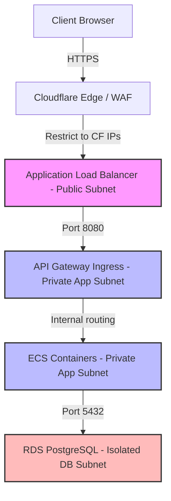

# VPC Network Topology & Infrastructure Security Design

## Purpose
This document establishes the architecture for the virtual private cloud (VPC) network topology, subnetting layouts, routing policies, security group configurations, API Gateway ingress paths, and Cloudflare Web Application Firewall (WAF) rule sets for the NewsOps Cloud digital publishing platform.

## Executive Summary
NewsOps Cloud employs a multi-tiered VPC layout divided into distinct public, private application, and isolated database subnets across multiple availability zones. Inbound web traffic is routed through Cloudflare WAF for threat filtration and distributed via an Application Load Balancer (ALB) to microservices inside the private app tier. No database resources are accessible directly from the public internet. Communication paths are strictly locked down using granular security group ingress/egress rules and Zero-Trust network principles.

## Vision
To build a resilient, highly available, and leak-proof network perimeter that ensures absolute isolation of critical assets while providing fast and securely managed API access endpoints to clients.

## Scope
This architectural design covers:
- VPC IP allocation and Subnetting boundaries (CIDR blocks).
- Routing tables, NAT Gateways, and Internet Gateways.
- AWS Security Groups and Network Access Control Lists (NACLs).
- Cloudflare WAF configurations and custom security rulesets.
- API Gateway configuration for internal and external traffic management.

## Goals
- **Complete Isolation**: 100% of database instances must live in isolated subnets with zero route paths to the Internet Gateway.
- **WAF Filtering**: Filter 100% of public incoming requests through Cloudflare before reaching the AWS infrastructure.
- **Least Privilege Access**: Ensure security group rules only allow connections between directly communicating application tiers.
- **High Availability**: Provide redundant network components across three Availability Zones (AZs).

## Functional Requirements
1. **Multi-AZ VPC Design**:
   - Provide a 3-tier network layout: Public, Private App, and Isolated Database tiers across three AWS Availability Zones (us-east-1a, us-east-1b, us-east-1c).
   - Configure NAT Gateways in each public subnet to allow private resources to fetch updates safely.
2. **Security Group Rules Engine**:
   - Limit ALB security groups to ingress traffic originating only from verified Cloudflare IP address blocks.
   - Restrict database security groups to accept connections exclusively from the container application security group.
3. **Cloudflare WAF Custom Rulesets**:
   - Deploy rule expressions to block known bad bots, enforce rate limiting, and stop typical attack vectors (SQLi, XSS, Path Traversal).
4. **API Gateway configuration**:
   - Establish TLS 1.3 termination, enforce CORS configurations, and rate-limit client endpoints.

## Non-Functional Requirements
1. **Network Latency**: Ingress packet inspection and gateway routing must not introduce more than 5 milliseconds of transit latency.
2. **Network Resilience**: Maintain 99.999% network availability through multi-NAT gateway configurations.
3. **Bandwidth Capacity**: Provision infrastructure to support up to 50 Gbps of concurrent network traffic.

## Business Rules
- **Rule 1**: Production databases must never be assigned public IP addresses.
- **Rule 2**: SSH/RDP ports (22/3389) must be blocked globally; all remote server operations must run through AWS Systems Manager Session Manager (SSM).
- **Rule 3**: Any new external API route must be registered through the API Gateway with rate limits configured before exposing it to the web.

## Actors
- **Cloud Infrastructure Architect**: Designs and provisions the VPC and network rules.
- **Security Operations Engineer**: Updates WAF configurations, manages SSL certificates, and reviews network access logs.
- **External Web Client / Reader**: Accesses published articles via public CDN endpoints.
- **Internal Microservice**: Communicates with sibling services inside the private application subnets.

## User Stories (At least 3 specific stories)
- **User Story 1: Public Reading access via WAF**
  As a Reader, I want to access published articles with low latency, so that the request passes through Cloudflare's WAF and edge cache, returning content fast while keeping the main servers safe from DDoS floods.
- **User Story 2: Isolated Database security**
  As a Platform Database Administrator, I want our PostgreSQL databases to be located in subnets with no route to the internet, so that there is no possibility of direct access or scanning from external IP addresses.
- **User Story 3: Controlled API Gateways for Microservices**
  As an Internal Developer, I want to deploy a new microservice that handles user comments behind the API Gateway, so that standard rate limiting, CORS rules, and TLS validation are handled automatically before the payload hits my application container.

## Acceptance Criteria (At least 3-5 criteria with clear thresholds)
- **AC 1 (IP Segmentation)**: The VPC CIDR must be `10.0.0.0/16`. Public subnets must cover `10.0.1.0/24`, `10.0.2.0/24`, `10.0.3.0/24`. Private application subnets must cover `10.0.10.0/24`, `10.0.11.0/24`, `10.0.12.0/24`. Private database subnets must cover `10.0.20.0/24`, `10.0.21.0/24`, `10.0.22.0/24`.
- **AC 2 (ALB Cloudflare Restrict)**: The ALB security group must return HTTP `403 Forbidden` for any inbound request on ports `80` or `443` that does not originate from a Cloudflare IP range (e.g., check against the published list at `https://www.cloudflare.com/ips-v4`).
- **AC 3 (WAF Rate Limiting)**: Cloudflare WAF must block any client IP address that exceeds 100 requests per minute to `/api/v1/auth/login`.

## Workflows (Step-by-step description of system and user interactions)

### 1. Ingress Network Traffic Routing Workflow
1. Client makes an HTTPS request to `https://newsops.cloud/api/v1/articles`.
2. DNS resolves the host to Cloudflare Edge IP addresses.
3. Cloudflare inspects the request headers, body, and query string using custom WAF rules:
   - If SQLi/XSS signatures are detected, return `403 Blocked`.
   - If traffic volume exceeds rate limits, return `429 Too Many Requests`.
4. If clean, Cloudflare routes the request over the public internet to the AWS Application Load Balancer.
5. The ALB validates the client TLS certificate and routes the request to the API Gateway cluster running inside the private application subnets.
6. The API Gateway forwards the request to the specific microservice container.
7. The microservice queries the PostgreSQL database in the isolated DB subnet.

### 2. Network Isolation Routing Workflow
The diagram below details the security group isolation levels and path rules.



## API Design (Provide actual REST endpoints, method, request/response JSON payloads, or GraphQL schemas)

While network configurations are primarily declarative code (Terraform), we expose management endpoints to update WAF properties, whitelist emergency IPs, and review connectivity states.

### Cloudflare WAF Rule Bypass Activation
Triggers a temporary bypass rule for administrative testing configurations.

- **Method**: `POST`
- **Path**: `/api/v1/network/waf/bypass`
- **Request Headers**:
  - `Authorization: Bearer <Admin_JWT>`
  - `Content-Type: application/json`
- **Request JSON Payload**:
  ```json
  {
    "ruleId": "cloudflare-sqli-bypass-rule-87",
    "ipAddress": "198.51.100.22",
    "durationSeconds": 3600,
    "reason": "Penetration testing authorization window"
  }
  ```
- **Response JSON Payload**:
  ```json
  {
    "status": "applied",
    "ruleId": "cloudflare-sqli-bypass-rule-87",
    "bypassIp": "198.51.100.22",
    "expiresAt": "2026-06-27T23:42:00Z",
    "updatedBy": "sec-ops-user-11"
  }
  ```

### API Gateway Route Registration
Registers dynamically routed paths to downstream private microservices.

- **Method**: `POST`
- **Path**: `/api/v1/network/gateway/routes`
- **Request Headers**:
  - `Authorization: Bearer <Admin_JWT>`
- **Request JSON Payload**:
  ```json
  {
    "path": "/api/v1/analytics",
    "targetServiceUrl": "http://analytics-service.private.local:8081",
    "rateLimitTps": 500,
    "corsPolicy": {
      "allowOrigins": ["https://newsops.cloud"],
      "allowMethods": ["GET", "POST"]
    }
  }
  ```
- **Response JSON Payload**:
  ```json
  {
    "routeId": "route-analyt-99",
    "path": "/api/v1/analytics",
    "status": "ACTIVE",
    "registeredAt": "2026-06-27T22:42:00Z"
  }
  ```

## Database Design (Identify schema tables, fields, and indexes relevant to this feature)

To support dynamic route management and IP tables, the gateway stores network configurations.

### Table: `gateway_routes`
Stores dynamic routes mapped in the API Gateway.

| Column Name | Data Type | Constraints | Description |
| :--- | :--- | :--- | :--- |
| `id` | `UUID` | `PRIMARY KEY`, `DEFAULT gen_random_uuid()` | Unique route ID |
| `path_pattern` | `VARCHAR(100)`| `UNIQUE`, `NOT NULL` | URL prefix (e.g., `/api/v1/analytics`) |
| `target_url` | `VARCHAR(255)`| `NOT NULL` | Destination VPC DNS route |
| `rate_limit_tps`| `INTEGER` | `NOT NULL`, `DEFAULT 1000` | Allowed transactions per second |
| `cors_origins` | `TEXT[]` | `NOT NULL` | Array of permitted origins |
| `is_active` | `BOOLEAN` | `NOT NULL`, `DEFAULT TRUE` | Toggle switch status |

### Table: `waf_temporary_exceptions`
Tracks authorized bypasses.

| Column Name | Data Type | Constraints | Description |
| :--- | :--- | :--- | :--- |
| `id` | `UUID` | `PRIMARY KEY` | Exception ID |
| `rule_id` | `VARCHAR(100)`| `NOT NULL` | Rule ID in Cloudflare |
| `target_ip` | `INET` | `NOT NULL` | Permitted IP address |
| `created_at` | `TIMESTAMPTZ` | `DEFAULT NOW()` | Record creation time |
| `expires_at` | `TIMESTAMPTZ` | `NOT NULL` | Automatic deletion time |

```sql
CREATE INDEX idx_gateway_routes_pattern ON gateway_routes(path_pattern);
CREATE INDEX idx_waf_exceptions_expires ON waf_temporary_exceptions(expires_at);
```

## UI Design (Describe component structure, layouts, actions, and states)
The Infrastructure Administration Dashboard displays:
- **Subnet Visualizer**: High-level block layouts showing active load balancer subnets, Kubernetes clusters, and RDS nodes. Shows real-time bandwidth metrics per subnet.
- **WAF Exception Tool**: Interface where Security Operations engineers can temporarily authorize IP bypasses, tracking remaining time and reasons.
- **Route Manager Editor**: Dashboard listing all API endpoints, allowing dynamically adjusting rate limiting limits.

## Permissions (Specify RBAC permissions required, e.g., organizations:read, articles:write)
- `network:routes:write`: Permitted to create/modify API routes.
- `network:waf:bypass`: Allows temporary IP exemptions in Cloudflare WAF.
- `network:topology:read`: Access to network maps, subnets, and active routes.

## Security (Detail security considerations, e.g., input validation, CSRF, JWT validation)

### Security Group Ingress / Egress Rules Matrix
| Security Group | Ingress Rules (Traffic In) | Egress Rules (Traffic Out) |
| :--- | :--- | :--- |
| **sg-load-balancer** | Port `443` from Cloudflare IP Ranges. | Port `8080` to **sg-api-gateway**. |
| **sg-api-gateway** | Port `8080` from **sg-load-balancer**. | Port `3000-9000` to **sg-application-ecs**. |
| **sg-application-ecs** | Ports `3000-9000` from **sg-api-gateway**. | Port `5432` to **sg-database-rds** & Port `6379` to **sg-elasticache-redis**. |
| **sg-database-rds** | Port `5432` from **sg-application-ecs** only. | None (blocked entirely). |

### Policy Engines
- **Cloudflare Page Rules**: Enforce HTTPS strictly, redirecting port `80` to `443`.
- **NACLs**: Enforce stateless inbound denial rules for known hostile subnets (e.g., TOR exit nodes).

## Performance (State latency limits, caching requirements, target TPS)
- **Target TPS**: Load balancers scale to handle 500,000 requests per second.
- **Latency Limits**:
  - Load balancer transit: `<3ms`
  - WAF parsing rules checking: `<2ms`
- **Caching**: Static assets (JS, CSS, images) cached at Cloudflare edge locations with a TTL of 7 days, reducing origin load by up to 80%.

## Monitoring (Detail Prometheus metrics names, alert triggers)
Metrics exported via AWS CloudWatch and Prometheus:
- `network_alb_active_connections`: Current concurrent TCP sessions on the ALB.
- `network_gateway_route_errors_total`: Counter of gateway failures (HTTP 502/504 errors).
- `network_waf_blocked_requests_total`: Counter of requests blocked by Cloudflare rulesets.

Alert Rules:
- Alert if `network_gateway_route_errors_total` increases by >10 in 1 minute.
- Alert if `network_waf_blocked_requests_total` is >1000 in 5 minutes (indicating an active DDoS event).

## Logging (Specify log formats, error levels, log contexts)
Load Balancer and WAF logs are compiled in JSON:

```json
{
  "timestamp": "2026-06-27T22:42:15.541Z",
  "client_ip": "198.51.100.81",
  "request_uri": "https://newsops.cloud/api/v1/auth/login",
  "http_method": "POST",
  "waf_action": "ALLOW",
  "alb_target_group_arn": "arn:aws:elasticloadbalancing:us-east-1:1234:targetgroup/api-gw-tg/ab12",
  "upstream_response_time": "0.012",
  "status_code": 200
}
```

## Error Handling (Map input/system error codes to HTTP status and customer-facing messages)

| Internal Error Code | HTTP Status | Customer-Facing Message | System Trigger Context |
| :--- | :--- | :--- | :--- |
| `NET-GW-502` | `502 Bad Gateway` | "The service is temporarily unavailable. Please try again shortly." | The gateway cannot reach the downstream microservice. |
| `NET-WAF-403` | `403 Forbidden` | "Access denied by security policies." | Cloudflare block rule triggered. |
| `NET-RAT-429` | `429 Too Many Requests`| "Rate limit exceeded. Please slow down." | Rate limits configured in the API gateway exceeded. |

## Edge Cases (Handle race conditions, rate limit hits, upstream timeouts)
- **Cloudflare IP Rotations**: Cloudflare periodically updates its IP address blocks. Resolved by running a cron scheduler container in the VPC that queries Cloudflare APIs daily and updates the AWS Security Group rules programmatically.
- **NAT Gateway Failure**: A NAT gateway going offline would block microservices from fetching external data. Mitigated by setting up distinct NAT gateways in three independent Availability Zones with automatic VPC route switching.
- **Route Hijacking**: Preventing unauthorized API path overwriting by enforcing schema checks at the SQL database layer.

## Future Improvements (Provide long-term scaling, architecture refactor paths)
- **AWS Transit Gateway**: Migrate VPC peering configurations to AWS Transit Gateway as the system expands to include multiple satellite regions.
- **HTTP/3 Protocol Enforcement**: Upgrade ALB ingress configurations to support HTTP/3 natively.

## Mermaid Diagrams (Include at least one high-quality diagram: flowchart, sequence, or ERD)

### Complete Network Infrastructure Diagram
Below is the deployment layout across multiple Availability Zones.

```mermaid
graph TD
    subgraph Cloudflare Edge
        CF[Cloudflare WAF / CDN]
    end

    subgraph AWS VPC (10.0.0.0/16)
        subgraph Public Subnets
            ALB1[ALB - AZ1]
            ALB2[ALB - AZ2]
        end

        subgraph Private App Subnets
            APIGW1[API Gateway - AZ1]
            APIGW2[API Gateway - AZ2]
            ECS1[ECS Cluster - AZ1]
            ECS2[ECS Cluster - AZ2]
        end

        subgraph Private Database Subnets
            RDS1[(PostgreSQL Primary - AZ1)]
            RDS2[(PostgreSQL Standby - AZ2)]
        end
    end

    Internet[User Browser] --> CF
    CF --> ALB1 & ALB2
    ALB1 & ALB2 --> APIGW1 & APIGW2
    APIGW1 & APIGW2 --> ECS1 & ECS2
    ECS1 & ECS2 --> RDS1 & RDS2
```

## References (Reference other related files in the repository using standard relative markdown links, e.g., '../02-architecture/system_architecture.md')
- [System Scaling & HA](../02-architecture/scaling_and_ha.md)
- [Disaster Recovery Plans](../02-architecture/disaster_recovery.md)
- [Caching Policies at Edge](../02-architecture/caching_strategy.md)
