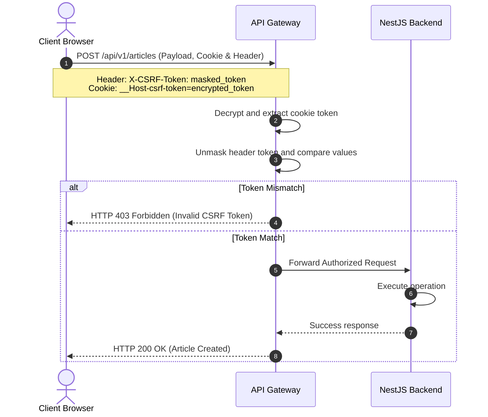
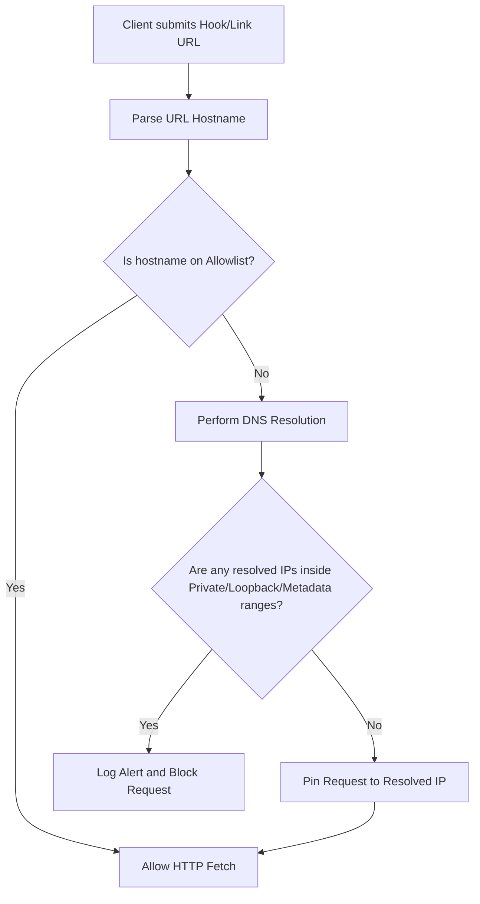

# OWASP Vulnerabilities Mitigation Design Document

## Purpose
This document specifies the technical design, architectural patterns, and mitigation strategies implemented in the NewsOps Cloud digital publishing platform to protect against the OWASP Top 10 vulnerabilities. It focuses on SQL Injection (SQLi), Cross-Site Scripting (XSS), Cross-Site Request Forgery (CSRF), and Server-Side Request Forgery (SSRF).

## Executive Summary
NewsOps Cloud employs a defense-in-depth approach to secure its digital publishing operations. SQL injection is mitigated at the database layer using Prisma ORM with parameterized queries and strict linters. XSS is combated through context-aware sanitization utilizing DOMPurify alongside rigid Content Security Policies. CSRF protection is enforced via a Double-Submit Cookie pattern for all state-changing operations. SSRF is eliminated through an active DNS-resolution-based IP blacklist filter that checks hosts prior to issuing outbound requests for webhooks and link previews.

## Vision
To establish NewsOps Cloud as an industry-leading, zero-trust digital publishing platform that guarantees data integrity, secure integration channels, and maximum resilience against modern web exploitation techniques.

## Scope
This security design applies to the following platform layers:
- The Editorial Next.js frontend application.
- The NestJS-based central API Gateway.
- All microservices communicating with PostgreSQL databases.
- The Outbound HTTP Client (used for link previews, media ingestion, and webhooks).

## Goals
- **Zero SQLi incidents**: Complete ban on dynamic string interpolation in raw SQL queries.
- **Zero persistent or reflected XSS execution**: Comprehensive sanitization of all user-generated HTML in the CMS.
- **Mandatory CSRF validation**: Protection of all cookie-authenticated endpoints.
- **Outbound HTTP isolation**: Complete blockage of local/private IP resolution for external integration endpoints.

## Functional Requirements
1. **SQL Injection Prevention**:
   - The application must use Prisma ORM query builder syntax for all standard CRUD operations.
   - Any raw SQL queries must only be executed via Prisma's `$queryRaw` utility using parameterized template literals.
   - CI/CD pipelines must include static code analysis (ESLint rules) to detect and block raw query string concatenation.

2. **Cross-Site Scripting (XSS) Sanitization**:
   - The platform must sanitize all incoming rich-text inputs (articles, comments, user bios) using `isomorphic-dompurify`.
   - The sanitization engine must strip out hazardous HTML tags (e.g., `<script>`, `<iframe>`, `<object>`, `<embed>`) and execution attributes (e.g., `onload`, `onerror`).
   - The Next.js frontend must serve a restrictive `Content-Security-Policy` header.

3. **CSRF Token Validation**:
   - State-changing requests (`POST`, `PUT`, `PATCH`, `DELETE`) relying on cookie session authentication must include a valid CSRF token in the `X-CSRF-Token` header.
   - The system must validate the token match against a cryptographically secure token cookie (`__Host-csrf-token`) using a double-submit token pattern.

4. **SSRF Blacklist Filters**:
   - All external URL fetch requests (webhooks, article parser, RSS feeds) must pass through a strict resolving wrapper.
   - The wrapper must perform DNS resolution of the target host and validate that the resolved IP address is not within reserved private or loopback ranges.

## Non-Functional Requirements
1. **Sanitization Performance**: XSS sanitization must add less than 10 milliseconds of overhead to any payload up to 5MB.
2. **SSRF Filter Latency**: The DNS validation check must run in under 20 milliseconds, utilizing local Redis caching for resolved clean IP addresses.
3. **Availability**: Security middlewares must not block legitimate traffic; false positive rate must remain below 0.01%.

## Business Rules
- **Rule 1**: No article may be published to the public portal without going through the rich-text sanitization pipeline.
- **Rule 2**: Outbound integration webhooks are restricted to public-facing DNS names; IP addresses are completely banned in webhook configuration interfaces.
- **Rule 3**: Cryptographic keys used for signing CSRF tokens must be rotated automatically every 24 hours.

## Actors
- **CMS Content Editor**: Submits rich-text articles and assets.
- **Integration Developer**: Configures webhook URLs for real-time article publishing notifications.
- **Security Administrator**: Reviews security incident logs, adjusts SSRF blacklists, and configures CSP policies.
- **NewsOps API Gateway**: Inspects incoming API requests for CSRF tokens, parses payloads, and enforces rate-limiting.

## User Stories (At least 3 specific stories)
- **User Story 1: Safe Rich-Text Article Submission**
  As an Editor, I want to paste custom rich-text code with valid styling tags into the CMS editor, so that my formatting is preserved while the system strips out any hidden malicious scripts or event handlers automatically before publishing.
- **User Story 2: Secure Webhook Registration**
  As an Integration Developer, I want to specify my server's HTTPS endpoint as a webhook target, so that I receive notifications only if the target is a verified public URL, and the system blocks me if I try to configure an internal microservice address (e.g., `http://10.0.0.5/api/debug`).
- **User Story 3: Session Hijack Prevention via CSRF Defense**
  As a Content Editor, I want to edit sensitive articles while logged in without risking a background CSRF attack from an untrusted tab, so that unauthorized form submissions are immediately rejected by the API gateway.

## Acceptance Criteria (At least 3-5 criteria with clear thresholds)
- **AC 1 (SQL Injection)**: Prisma query parameters must utilize safe placeholder bindings (`$1`, `$2`). Any query using string interpolation (`$queryRawUnsafe`) must fail linting and CI pipelines.
- **AC 2 (XSS)**: Rich-text fields must run through `DOMPurify.sanitize()` with config `{ ALLOWED_TAGS: ['p', 'b', 'i', 'em', 'strong', 'a', 'img', 'ul', 'ol', 'li', 'h1', 'h2', 'h3', 'h4'], ALLOWED_ATTR: ['href', 'src', 'alt', 'title'] }`. All other tags and attributes must be removed.
- **AC 3 (CSRF)**: If `X-CSRF-Token` header matches the decrypted value of the `__Host-csrf-token` cookie, allow the request; otherwise, return HTTP `403 Forbidden` if missing or mismatched.
- **AC 4 (SSRF)**: Any request pointing to an IP address within RFC 1918 ranges (`10.0.0.0/8`, `172.16.0.0/12`, `192.168.0.0/16`), local range `127.0.0.0/8`, Link-Local `169.254.169.254`, or IPv6 equivalents must be aborted, returning HTTP `422 Unprocessable Entity` with "Access to private addresses is prohibited".

## Workflows (Step-by-step description of system and user interactions)

### 1. SSRF Outbound URL Request Resolution Workflow
When an application component requests an external URL (e.g., fetch link metadata):
1. The component forwards the target URL to the `SSRFPreventionService`.
2. The URL is parsed into its host component.
3. System resolves the host to IP addresses using `dns.resolve4()` and `dns.resolve6()`.
4. The system validates the resolved IP addresses against the SSRF IP Blacklist.
5. If the IP is blacklisted, the workflow aborts, logs a security warning, and throws a validation error.
6. If the IP is clean, the HTTP client executes the request using the resolved IP address directly to prevent DNS rebinding attacks.

### 2. Double-Submit CSRF Cookie Workflow
For every browser-initiated state mutation:
1. When the user logs in, the server generates a cryptographically random 32-byte CSRF token.
2. The token is hashed with a server-side secret and set as a secure cookie: `__Host-csrf-token=encrypted_token; Path=/; Secure; HttpOnly; SameSite=Strict`.
3. The server also sends a masked version of the token in the login JSON response.
4. The frontend stores this masked token in memory and attaches it as `X-CSRF-Token` in all request headers.
5. On the API Gateway, the CSRF middleware intercepts the request, decrypts the cookie token, compares it to the unmasked token in the header, and permits execution if they match.



## API Design (Provide actual REST endpoints, method, request/response JSON payloads, or GraphQL schemas)

### CSRF Token Fetch Endpoint
Provides UI clients with a CSRF token initialization endpoint when cookies are valid but the token needs refreshing.

- **Method**: `GET`
- **Path**: `/api/v1/security/csrf`
- **Request Headers**:
  - `Cookie: session_id=abc123xyz`
- **Response Headers**:
  - `Set-Cookie: __Host-csrf-token=EncryptedTokenValue; Path=/; Secure; HttpOnly; SameSite=Strict`
- **Response JSON Payload**:
  ```json
  {
    "csrfToken": "8f89e24a87a216447c20c0fa9ba78a05c6d3bc89f2a7db768da6c3746a51d9fb"
  }
  ```

### External Webhook Registration Validation
Endpoint used to validate a new webhook registration prior to database persistence.

- **Method**: `POST`
- **Path**: `/api/v1/webhooks/validate`
- **Request JSON Payload**:
  ```json
  {
    "url": "https://external-service.com/hooks/newsops-receiver"
  }
  ```
- **Response JSON Payload (Success)**:
  ```json
  {
    "status": "valid",
    "resolvedIp": "203.0.113.42",
    "message": "Host passed SSRF security checks."
  }
  ```
- **Response JSON Payload (Blocked SSRF)**:
  ```json
  {
    "status": "blocked",
    "errorCode": "SEC-SSRF-001",
    "message": "Access to private/internal network ranges is prohibited."
  }
  ```

## Database Design (Identify schema tables, fields, and indexes relevant to this feature)

To support secure operations, audit logging, and dynamic security policy management, the database tracks security events and temporary token metadata.

### Table: `security_audit_logs`
Tracks blocks, validation errors, and detected vulnerabilities.

| Column Name | Data Type | Constraints | Description |
| :--- | :--- | :--- | :--- |
| `id` | `UUID` | `PRIMARY KEY`, `DEFAULT gen_random_uuid()` | Unique log identifier |
| `timestamp` | `TIMESTAMPTZ` | `DEFAULT NOW()`, `NOT NULL` | Time of the security event |
| `event_type` | `VARCHAR(50)` | `NOT NULL` | Event classification (e.g., `CSRF_FAILURE`, `SSRF_BLOCKED`, `XSS_CLEANSE`) |
| `actor_id` | `UUID` | `NULLABLE` | User ID if authenticated |
| `ip_address` | `INET` | `NOT NULL` | Origin IP of the suspicious request |
| `request_path` | `VARCHAR(255)` | `NOT NULL` | Target path of the request |
| `payload_summary`| `JSONB` | `NULLABLE` | Metadata about blocked payload (tags removed, blocked URL) |

### Table: `ssrf_host_allowlist`
Managed list of permitted external domains that bypass validation (e.g., trusted internal CDN gateways, explicitly verified partner endpoints).

| Column Name | Data Type | Constraints | Description |
| :--- | :--- | :--- | :--- |
| `id` | `INT` | `PRIMARY KEY`, `AUTO_INCREMENT` | Unique identifier |
| `domain_name` | `VARCHAR(255)` | `UNIQUE`, `NOT NULL` | Domain matching pattern (e.g., `*.trustedpartner.com`) |
| `created_by` | `UUID` | `NOT NULL` | Administrator user ID |
| `created_at` | `TIMESTAMPTZ` | `DEFAULT NOW()` | Record creation time |

```sql
CREATE INDEX idx_security_audit_logs_event_type ON security_audit_logs(event_type);
CREATE INDEX idx_security_audit_logs_timestamp ON security_audit_logs(timestamp);
CREATE INDEX idx_ssrf_host_allowlist_domain ON ssrf_host_allowlist(domain_name);
```

## UI Design (Describe component structure, layouts, actions, and states)
To support security, components display warnings or handle inputs securely.
- **Rich Text Editor**: Employs dynamic warning overlays when pasting elements containing forbidden tags, showing: "Your input contains code elements that have been removed for security reasons."
- **CSRF Token Expiry Banner**: Re-fetches tokens in the background via silent API polls. If session expires, displays a modal requiring re-authentication rather than breaking the editor's UI state.
- **Webhook Registration Form**: Validates inputs in real-time. If the user types a local host (`localhost`, `127.0.0.1`, `http://192.168.1.1`), the UI displays an inline validation error: "SSRF Protection Rule: Private/Local IP addresses are not permitted."

## Permissions (Specify RBAC permissions required, e.g., organizations:read, articles:write)
Access control policies are governed using Role-Based Access Control (RBAC):
- `security:audit:read`: Grants security teams access to `security_audit_logs`.
- `security:allowlist:write`: Permits security administrators to insert records into the `ssrf_host_allowlist`.
- `articles:create` & `articles:write`: Required to submit content which runs through the XSS validation layers.
- `webhooks:write`: Required to create outbound webhooks that trigger the SSRF validation workflow.

## Security (Detail security considerations, e.g., input validation, CSRF, JWT validation)

### Encryption Schemes
- **CSRF Token Generation**: Uses Node's `crypto.randomBytes(32)` to ensure cryptographically strong randomness.
- **CSRF Token Cookies**: Signed using HMAC-SHA256 with a 256-bit environment secret (`CSRF_SECRET`) rotated periodically.
- **Data Transmission**: Strict Transport Security (HSTS) with a `max-age` of 63072000 seconds, preloaded across all public routes.

### Policy Engines
- **Content Security Policy (CSP)**:
  ```http
  Content-Security-Policy: default-src 'self'; script-src 'self' 'nonce-rAnd0m123' https://static.newsops.cloud; object-src 'none'; base-uri 'self'; form-action 'self'; frame-ancestors 'none';
  ```

## Performance (State latency limits, caching requirements, target TPS)
- **Target TPS**: 10,000 transactions per second (TPS) for the validation middleware layer.
- **Latency Limits**:
  - CSRF Token verification: `<2ms`
  - HTML Sanitization (`DOMPurify`): `<8ms` for typical article sizes (approx. 50KB to 200KB).
  - Outbound DNS checking (SSRF protection): `<15ms` using a local Redis cache instance with a 300-second DNS cache TTL to avoid redundant DNS lookups.

## Monitoring (Detail Prometheus metrics names, alert triggers)
We define specific Prometheus metrics to track security system activity:
- `security_csrf_failures_total`: Counter tracking rejected requests due to CSRF token mismatch/absence.
- `security_ssrf_blocked_attempts_total`: Counter tracking requests targeting blacklisted IP domains/hosts.
- `security_xss_elements_stripped_total`: Counter of sanitized tags stripped from input articles.
- `security_sql_injection_attempts_total`: Counter tracking hits on WAF filtering database input variables.

Alert Triggers:
- **Alert on CSRF Spikes**: Trigger major alert if `security_csrf_failures_total` increases by >50 in 1 minute.
- **Alert on SSRF Attempts**: Trigger critical alert if `security_ssrf_blocked_attempts_total` is >5 in 5 minutes (indicates scanning of the internal network).

## Logging (Specify log formats, error levels, log contexts)
Security events are formatted in JSON and sent to standard output (`stdout`) to be captured by ELK/Splunk agents.

```json
{
  "timestamp": "2026-06-27T22:42:00.123Z",
  "level": "WARN",
  "event_type": "SSRF_ATTEMPT_BLOCKED",
  "context": {
    "requested_url": "http://169.254.169.254/latest/meta-data/",
    "resolved_ips": ["169.254.169.254"],
    "actor_id": "8b9e6f3d-51a8-4c91-9c60-c3d55160840e",
    "ip_address": "198.51.100.12",
    "request_id": "req-99ab-87cd"
  },
  "message": "Outbound host resolved to a blacklisted IP address. Connection aborted."
}
```

## Error Handling (Map input/system error codes to HTTP status and customer-facing messages)

| Internal Error Code | HTTP Status | Customer-Facing Message | System Trigger Context |
| :--- | :--- | :--- | :--- |
| `SEC-CSRF-001` | `403 Forbidden` | "Security validation failed. Please refresh your page and try again." | CSRF token missing or mismatching. |
| `SEC-SSRF-001` | `422 Unprocessable`| "The provided webhook URL resolves to a restricted network range." | Input host resolves to RFC 1918 or Metadata IP. |
| `SEC-XSS-001` | `400 Bad Request` | "Your submission contains invalid formatting markup." | Sanitization detects a high concentration of invalid tags or malformed HTML. |
| `SEC-SQL-001` | `500 Internal Error`| "A database operation error occurred." | Prevent raw database exceptions leaking table details; catch Prisma execution errors. |

## Edge Cases (Handle race conditions, rate limit hits, upstream timeouts)
- **DNS Rebinding for SSRF**: A malicious actor registers a domain that points to a public IP first (passing validation), and then returns a local IP (e.g. `127.0.0.1`) on sub-second DNS TTL expirations. Mitigated by resolving the IP address once, checking it, and forcing the HTTP client to send the request directly to the resolved IP address, completely ignoring subsequent DNS lookups during the transfer.
- **ReDoS in HTML Sanitization**: Extremely nested HTML tags designed to cause regular expression parsing crashes in server-side libraries. Mitigated by enforcing a maximum character length limit (e.g. 5,000,000 characters) on any processed text payload and executing the DOMPurify engine inside a sandbox timeout window.
- **Race Condition in CSRF Token Updates**: Concurrent updates by multiple tabs invalidating the active token. Resolved by utilizing session cookies that store a deterministic seed combined with a cryptographically verifiable time window.

## Future Improvements (Provide long-term scaling, architecture refactor paths)
- **Dedicated Outbound Proxy**: Migration of outbound SSRF protections to a dedicated sandbox proxy runner (e.g., Stripe's Smokescreen) to isolate all third-party outbound HTTP requests at the physical container/network boundary.
- **Wasm-Based Sanitization**: Porting the HTML sanitization pipeline from JavaScript/Node runtime to a Rust-based WebAssembly module for sub-millisecond execution speeds.

## Mermaid Diagrams (Include at least one high-quality diagram: flowchart, sequence, or ERD)

### Host Resolving SSRF Protection Diagram
Below is the workflow sequence illustrating target address verification prior to outbound fetch execution.



## References (Reference other related files in the repository using standard relative markdown links, e.g., '../02-architecture/system_architecture.md')
- [System Architecture](../02-architecture/system_architecture.md)
- [Multi-Tenancy Security Boundaries](../02-architecture/multi_tenancy_architecture.md)
- [SaaS Compliance Policy](../08-saas/index.md)
