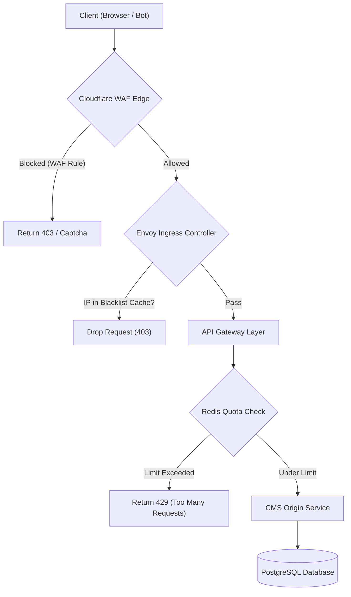

# DDoS Mitigation and Rate Limiting
## Purpose
This document details the design and implementation of the DDoS mitigation, Web Application Firewall (WAF), and multi-layer rate-limiting systems for the NewsOps Cloud digital publishing platform. It defines policies, workflows, database schemas, and API designs to protect application endpoints from denial-of-service attacks, automated scrapers, credential stuffing, and api exhaustion.

## Executive Summary
NewsOps Cloud employs a multi-tiered security defense to ensure high availability and prevent resource exhaustion. Security starts at the network edge with Cloudflare (WAF rules, rate limits, and DDoS mitigation), passes through the Kubernetes Ingress Controller (Envoy rate limits), and resolves at the microservice application layer with a Redis-backed sliding-window rate limiter. This architecture ensures that malicious or abusive traffic is dropped as close to the source as possible, minimizing origin computation costs.

## Vision
Our vision is a self-defending, resilient system capable of identifying and isolating malicious traffic automatically, while providing transparent, granular limits for legitimate API clients, subscribers, and developers.

## Scope
The scope of this document covers:
*   Edge protection policies using Cloudflare WAF and API Shield.
*   IP blacklisting workflows and origin synchronization APIs.
*   Envoy ingress-level rate limiting configuration schemas.
*   Application-layer sliding-window rate limit implementation using Redis Lua scripting.
*   Tenant-specific rate limiting configurations based on customer tier.

## Goals
*   **Protect Origin Resources**: Block 100% of Layer 7 DDoS floods before they reach backend databases and application runtimes.
*   **Prevent Content Scraping**: Detect and throttle automated scraping agents that seek to harvest paywalled news content.
*   **Fair API Resource Allocation**: Ensure that no single tenant or client can exhaust API gateway capacity.
*   **Low Latency Checking**: Limit the overhead of application-layer rate-limit validation to under 2ms per request.
*   **Transparent Rate Limit Feedback**: Provide clear, standard HTTP headers indicating quota status to API clients.

## Functional Requirements
*   **Client Classification**: Categorize incoming requests based on user authentication status, API key scopes, and target URL path.
*   **Dynamic Sliding Window**: Calculate rates over a sliding window (e.g., 60-second window moving in real-time) rather than fixed-window buckets to prevent traffic spikes at boundary resets.
*   **Edge Blocklist Sync**: Expose an internal API that propagates manually blacklisted IPs and ranges directly to Cloudflare WAF within 15 seconds.
*   **Bypass Whitelisting**: Support IP/subnet whitelisting for trusted search engine bots (Googlebot, Bingbot) and partner publishing networks.
*   **Custom Tenant Quotas**: Allow platform administrators to configure custom rate limits dynamically per tenant via database configurations.

## Non-Functional Requirements
*   **Performance Impact**: Rate limiting evaluation must introduce no more than 2ms of latency (p99) to API endpoints.
*   **Resiliency**: If the Redis cache clusters responsible for rate limiting fail, the application must "fail-open" to ensure service availability while raising a critical alarm.
*   **Throughput Support**: Ingress and edge rate-limit checks must scale to handle up to 50,000 requests per second under peak load.
*   **Anti-Spoofing**: Secure client IP identification by relying strictly on verified Cloudflare headers (`CF-Connecting-IP`) and discarding arbitrary `X-Forwarded-For` inputs.

## Business Rules
*   **Standard Anonymous Rate**: Unauthenticated traffic is limited to 60 requests per minute per IP for public content.
*   **Subscriber Rate**: Authenticated subscribers are allowed 300 requests per minute.
*   **API Partner Quotas**: Custom quotas are set per subscription tier (e.g., Bronze: 600/min, Silver: 1200/min, Gold: 3000/min).
*   **Auto-Block Policy**: Any client exceeding their limit by more than 200% within a 1-minute window will have their IP temporarily blacklisted for 60 minutes.
*   **WAF Integration**: IPs blacklisted for severe violations are automatically pushed to the Cloudflare Account IP Firewall.

## Actors
*   **Anonymous Reader**: Guest browsing public news feeds.
*   **Subscriber**: Authenticated user reading paid premium news content.
*   **Developer Partner**: API user fetching structured RSS feeds or JSON payloads.
*   **Security Administrator**: Operates the platform, monitors threat telemetry, and manages manual IP blocklists.

## User Stories
*   **User Story 1**: As an Anonymous Reader, I want to browse news articles on my phone without seeing captcha screens or experiencing delays due to general rate limit rules.
*   **User Story 2**: As a Developer Partner, I want to query the NewsOps API using my token and receive standard rate limit headers so that I can programmatically adjust my request rate before getting blocked.
*   **User Story 3**: As a Security Administrator, I want to block an active scraper botnet targeting our premium articles by blacklisting their CIDR range via the Admin UI, knowing it takes effect instantly at the edge.

## Acceptance Criteria
*   **AC 1**: When a client exceeds their rate limit, the API Gateway must immediately return HTTP status `429 Too Many Requests` with a body describing the quota breach.
*   **AC 2**: Rate-limited responses must include the following headers: `X-RateLimit-Limit`, `X-RateLimit-Remaining`, and `Retry-After` (in seconds).
*   **AC 3**: The sliding window algorithm must compute client quotas using a Redis Lua script to guarantee atomic execution and prevent race conditions.
*   **AC 4**: Manual IP additions to the blacklist must be synced to Cloudflare's API via webhook and take effect at the edge in less than 15 seconds.

## Workflows
### Workflow 1: Application-Layer Sliding-Window Check
1.  The client makes an API request to `https://api.newsops.cloud/v1/articles`.
2.  Cloudflare forwards the request to the Ingress controller, appending the true client IP in `CF-Connecting-IP`.
3.  The Ingress controller routes the request to the API Gateway.
4.  The API Gateway identifies the rate limit profile:
    *   If the request contains an authorization header, validate the token, extract the tenant ID and user ID, and select the Subscriber profile.
    *   If no authorization is present, use the `CF-Connecting-IP` and select the Anonymous profile.
5.  The API Gateway executes a Redis Lua script passing the client key (e.g., `ratelimit:sub:1024` or `ratelimit:ip:203.0.113.50`), the allowed limit (e.g., 300), and the window size (60 seconds).
6.  The Lua script fetches the sorted set of timestamps for that key:
    *   It removes all timestamps older than `current_time - window_size`.
    *   It counts the remaining timestamps.
    *   If `count < limit`, it adds the current timestamp to the sorted set, sets the key expiration, and returns `1` (allow).
    *   If `count >= limit`, it returns `0` (block) along with the time remaining until the oldest timestamp drops out of the window.
7.  If the script returns `1`, the gateway forwards the request to the CMS microservice.
8.  If the script returns `0`, the gateway short-circuits the connection and returns HTTP `429`.

### Workflow 2: Dynamic IP Blacklisting Synchronization
1.  An automated monitor or a Security Administrator detects malicious behavior from IP `198.51.100.42`.
2.  The Administrator submits the block request via the Admin console.
3.  The security controller persists the block in the database (`blacklisted_ips`) and broadcasts an event to the security message bus.
4.  The Cloudflare Sync worker consumes the event.
5.  The worker calls the Cloudflare Rulesets API to add the IP to the Cloudflare IP List linked to the WAF Block rule.
6.  Cloudflare propagates the configuration to its edge locations worldwide.
7.  Subsequent requests from `198.51.100.42` are blocked at the Cloudflare edge, returning a Cloudflare 1015 page, preventing traffic from ever reaching the origin infrastructure.

## API Design
### Admin Blacklist IP Address
Adds a malicious IP address or CIDR range to the central blacklist, initiating sync to edge providers.

*   **HTTP Method**: `POST`
*   **Endpoint**: `/api/v1/security/blacklist/ips`
*   **Headers**:
    *   `Content-Type: application/json`
    *   `Authorization: Bearer <admin-jwt>`
*   **Request Payload**:
```json
{
  "ip_address": "198.51.100.42",
  "cidr_mask": 32,
  "reason": "Distributed scraping bot targeting paying articles",
  "expires_in_hours": 24
}
```
*   **Success Response (201 Created)**:
```json
{
  "blacklist_id": "blk-92f7b8c2-31d9-482a-a927-449e77bf64e9",
  "ip_address": "198.51.100.42/32",
  "reason": "Distributed scraping bot targeting paying articles",
  "created_at": "2026-06-27T22:42:00Z",
  "expires_at": "2026-06-28T22:42:00Z",
  "status": "syncing_to_edge"
}
```
*   **Error Response (400 Bad Request)**:
```json
{
  "error": "invalid_ip_format",
  "message": "The provided IP address format is invalid.",
  "code": 400102
}
```

### Fetch Current Rate Limit Status
Allows clients to inspect their current rate limit configuration and consumption dynamically.

*   **HTTP Method**: `GET`
*   **Endpoint**: `/api/v1/security/rate-limits/status`
*   **Headers**:
    *   `Authorization: Bearer <client-jwt>`
*   **Success Response (200 OK)**:
```json
{
  "client_key": "ratelimit:sub:tenant-abc:user-992",
  "limit": 300,
  "window_seconds": 60,
  "requests_remaining": 274,
  "reset_seconds": 42
}
```

## Database Design
To maintain blocklists and tenant rate limit parameters, we define two SQL schemas.

### Schema: `blacklisted_ips`
Tracks blocked IP addresses, expiration times, and status synchronization with the edge.

| Column Name | Data Type | Constraints | Description |
| :--- | :--- | :--- | :--- |
| `id` | `UUID` | `PRIMARY KEY` | Unique record ID. |
| `ip_network` | `CIDR` | `NOT NULL` | The IP address or network range block (PostgreSQL CIDR type). |
| `reason` | `VARCHAR(256)` | `NOT NULL` | Justification for block. |
| `created_at` | `TIMESTAMP` | `DEFAULT CURRENT_TIMESTAMP` | Time the block was initiated. |
| `expires_at` | `TIMESTAMP` | `NOT NULL` | Time when block will be auto-removed. |
| `sync_status` | `VARCHAR(30)` | `NOT NULL` | `pending`, `synced`, `failed` |

```sql
CREATE TABLE blacklisted_ips (
    id UUID PRIMARY KEY DEFAULT gen_random_uuid(),
    ip_network CIDR NOT NULL,
    reason VARCHAR(256) NOT NULL,
    created_at TIMESTAMP WITH TIME ZONE DEFAULT CURRENT_TIMESTAMP,
    expires_at TIMESTAMP WITH TIME ZONE NOT NULL,
    sync_status VARCHAR(30) NOT NULL CHECK (sync_status IN ('pending', 'synced', 'failed'))
);

CREATE INDEX idx_blacklist_lookup ON blacklisted_ips (ip_network);
CREATE INDEX idx_blacklist_expiration ON blacklisted_ips (expires_at) WHERE sync_status = 'synced';
```

### Schema: `tenant_rate_limits`
Allows runtime configuration overrides of limits per tenant.

```sql
CREATE TABLE tenant_rate_limits (
    tenant_id VARCHAR(50) PRIMARY KEY,
    anonymous_limit INT NOT NULL DEFAULT 60,
    subscriber_limit INT NOT NULL DEFAULT 300,
    partner_limit INT NOT NULL DEFAULT 2000,
    updated_at TIMESTAMP WITH TIME ZONE DEFAULT CURRENT_TIMESTAMP
);
```

## UI Design
The NewsOps Security dashboard gives team members observability into rate limiting statistics and blocklists.

### Layout Elements
1.  **Metric Cards**:
    *   *Total Requests / Blocked Requests* ratio graph.
    *   *Top Blocked IPs* table list.
    *   *Cloudflare Status* (Connected / Sync Syncing / Sync OK).
2.  **Add Block Form**:
    *   Input: IP Address or Range (CIDR).
    *   Dropdown: Block duration (1 hr, 6 hr, 24 hr, 7 days, permanent).
    *   Input text: Justification reason.
3.  **Active Blocks List**:
    *   Filterable table listing active records from the `blacklisted_ips` database, with manual "Remove Block" action buttons.

## Permissions
*   **Platform RBAC Roles**:
    *   `security:read`: View metrics, blacklist registers, and current tenant configurations.
    *   `security:write`: Add IPs to the blacklist, override tenant limits, and trigger edge rule sync.
    *   `security:bypass-limits`: Associated with high-throughput backend services and scraper jobs (e.g., internal search indexers).

## Security
*   **Header Spoofing Prevention**: The edge router strips out incoming `X-Forwarded-For` headers from untrusted clients, injecting verified IP information only.
*   **Origin Protection**: Restrict the origin servers to accept traffic strictly from Cloudflare IP ranges using Security Groups and Authenticated Origin Pull (mTLS client certificate verified by Nginx/Envoy).
*   **Safe Failures**: Under Redis failure scenarios, the application falls back to basic local cache in-memory limiting, capping operations at a baseline limit to prevent complete resource starvation of downstream databases.

## Performance
*   **Redis Latency**: Reading and writing rates must execute in under 1.5ms using optimized Redis Lua scripts:
```lua
-- Lua script for sliding window rate limiting
local key = KEYS[1]
local now = tonumber(ARGV[1])
local window = tonumber(ARGV[2])
local limit = tonumber(ARGV[3])
local clearBefore = now - window

redis.call('zremrangebyscore', key, 0, clearBefore)
local currentRequests = redis.call('zcard', key)

if currentRequests < limit then
    redis.call('zadd', key, now, now)
    redis.call('expire', key, window)
    return 1
else
    return 0
end
```
*   **Target Request Volume**: Support up to 50,000 global rate-limiting evaluations per second, running on a Redis cluster deployment with 3 primary and 3 replica nodes.

## Monitoring
We monitor rate limits using Prometheus metrics integrated with Grafana dashboard alerts.

### Prometheus Metrics
*   `rate_limit_evaluations_total{status="allow|block", profile="anonymous|subscriber|partner"}`
*   `rate_limit_redis_latency_seconds`: Latency histogram of the rate-limiting storage backend lookup.
*   `cloudflare_sync_duration_seconds`: Histogram measuring the execution time of synchronization calls with Cloudflare's WAF.

### Alerting Rules
*   **Alert `RedisRateLimitLatencyHigh`**: Triggers if `rate_limit_redis_latency_seconds{quantile="0.99"}` exceeds 0.010 (10ms) for more than 5 minutes.
*   **Alert `EdgeBlacklistSyncFailed`**: Triggers if `blacklisted_ips` sync status remains `failed` or `pending` for longer than 5 minutes.

## Logging
Logs capture blocked operations to trace abuse patterns without storing user-identifiable properties beyond the IP.

### Example Log Output
```json
{
  "timestamp": "2026-06-27T22:47:12.449Z",
  "level": "WARN",
  "logger": "com.newsops.security.ratelimit.RateLimiterFilter",
  "message": "Client rate limit exceeded",
  "context": {
    "client_ip": "198.51.100.42",
    "request_path": "/api/v1/articles/premium-editorial",
    "tenant_id": "tenant-abc",
    "applied_limit": 300,
    "current_count": 301,
    "action": "blocked_429",
    "correlation_id": "c-88bf-92d1"
  }
}
```

## Error Handling
| Error Code | HTTP Status | Customer-Facing Message | System Action |
| :--- | :--- | :--- | :--- |
| `ERR_RATE_LIMIT_EXCEEDED` | `429` | "Too many requests. Please slow down and try again." | Reject the connection, attach a `Retry-After` header specifying seconds until resource window resets. |
| `ERR_IP_BLACKLISTED` | `403` | "Access denied. Your IP address is blocked." | Terminate connection directly at Envoy Ingress controller level, skip down-stream execution. |
| `ERR_LIMITS_STORE_DOWN` | `200` (Fail-Open) | "Success" (with internal fallback) | Log critical warning, execute degraded limit checking, alert on-call engineer. |

## Edge Cases
*   **Corporate NAT Over-Blocking**: Multiple legitimate employees from a corporate partner share a single public IP. If rate limits block the IP, it disrupts hundreds of users. We resolve this by prioritizing authenticated tenant tokens (`Authorization: Bearer <jwt>`) over physical IPs during calculation.
*   **Distributed Botnet (Low and Slow Attacks)**: Botnets targeting paywalled content at low rates (1 request/min per IP) bypass standard rate limiting. We use Cloudflare API Shield's machine learning engine to identify anomalous behavior patterns across multiple IPs and push dynamic blocks.

## Future Improvements
*   **JA3 Fingerprinting**: Implement JA3 TLS fingerprinting at the Ingress controller to block scrapers based on client-side cipher suite handshakes rather than dynamic IP configurations alone.
*   **Token Bucket Optimization**: Evaluate transitioning to a Redis-cell based Token Bucket algorithm if memory usage for large sorted sets becomes a bottleneck.

## Mermaid Diagrams
### Security Architecture Traffic Flow



## References
*   [Caching Strategy](../02-architecture/caching_strategy.md)
*   [System Architecture](../02-architecture/system_architecture.md)
*   [Secrets Management](secrets_management.md)
