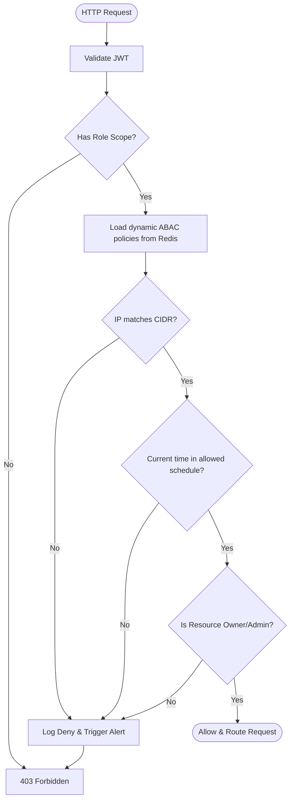
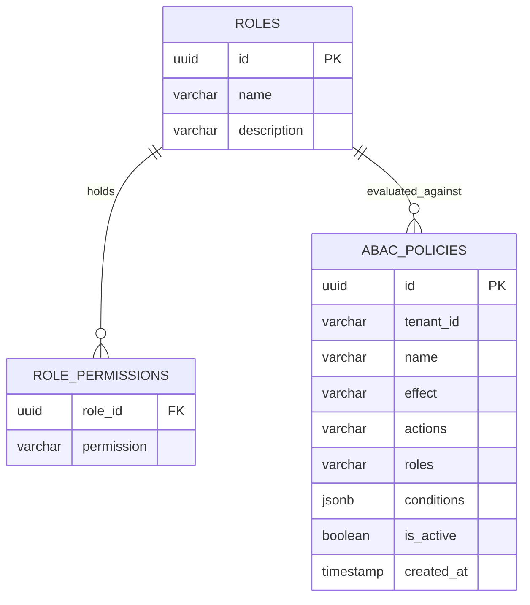

# RBAC and ABAC Policy Engine Design
## Purpose
This document specifies the design, implementation, and evaluation mechanics of the hybrid Role-Based Access Control (RBAC) and Attribute-Based Access Control (ABAC) policy engine of the NewsOps Cloud digital publishing platform. It describes how role assignments are combined with runtime attribute checks (e.g. IP block list, time of day) within the API Gateway and application middleware.

## Executive Summary
NewsOps Cloud employs a hybrid access control model. Role-Based Access Control (RBAC) establishes a baseline permission model for users (e.g., editors, writers, subscribers). Attribute-Based Access Control (ABAC) refines these permissions by applying dynamic, contextual rules at runtime. Access is determined by evaluating the user’s roles and matching the execution context (such as request source IP address, current timestamp, resource ownership, and tenant tier) against configured policy expressions. This document details the schema definitions, policy syntax, evaluation middleware, and performance metrics.

## Vision
The access control framework aims to provide robust, fine-grained, and sub-millisecond security checks across all application routes. By leveraging a structured JSON evaluation engine, tenant administrators can define custom compliance and operational rules (e.g., restricting administrative actions to company offices during business hours) without modifying backend source code.

## Scope
This document covers:
1. **RBAC Schema**: Roles, linear inheritances, and core permission scopes.
2. **ABAC Condition Language**: Syntax for evaluating dynamic context attributes (IP blocks, schedules, tiers).
3. **Evaluation Middleware**: NestJS Guard design, caching logic, and audit trail hooks.

It excludes the operating system-level user controls or Kubernetes namespace RBAC.

## Goals
- **Deny-by-Default Architecture**: Secure all endpoints out-of-the-box.
- **Fast Policy Ingestion**: Local evaluation of complex RBAC/ABAC expressions in $< 3\text{ ms}$.
- **Dynamic Rule Ingestion**: Support modifying access policies without system redeployment or server restarts.
- **Zero Bypass Integration**: Implement access checks at the gateway controller level as a non-bypassable middleware block.

## Functional Requirements
- **Permission Matrix**: Provide a hierarchical permission matrix (e.g., `articles:write`, `billing:read`).
- **IP Range Filtering**: Parse and validate CIDR blocks to restrict user activities to corporate networks.
- **Schedule/Time Boundaries**: Define allowed hours of operation (e.g., Monday-Friday 08:00-18:00 UTC).
- **Resource Ownership Check**: Verify user identity matches the resource author/owner for modification endpoints.
- **Hierarchical Inheritance**: Automatically inherit scopes (e.g. Administrator inherits Editor scopes, which inherits Contributor scopes).

## Non-Functional Requirements
- **Guard Performance**: Evaluation latency must not exceed 4ms under 2,000 concurrent requests.
- **Serialization Size**: Ensure dynamic policy rules are small enough to be loaded from Redis cache in $< 1\text{ ms}$.
- **Resilience**: The system must fall back to a strict deny if the Redis policy cache is unavailable.

## Business Rules
- **Deny Priority**: Any explicit deny rule in an ABAC condition overrides any allow rule.
- **No Direct Database Queries in Guards**: To maintain latency goals, database checks must run against user context claims in the JWT or pre-cached Redis session records.
- **System Admin Bypass**: The global `system` admin tenant bypasses ABAC rules to prevent lockout scenarios, subject to mandatory separate logging.

## Actors
- **Subscriber**: Accesses content based on subscription tier (ABAC checking active subscription status).
- **Editor**: Creates/modifies articles, restricted optionally by office hours and network IP block.
- **Tenant Administrator**: Manages roles, assigns permissions, and configures custom ABAC limits.
- **Auditor**: Reviews access decisions, audit logs, and compliance mapping configurations.

## User Stories
- **User Story 1**: As a Tenant Administrator, I want to restrict publishing capabilities to our corporate VPN IP range so that our content cannot be altered from unauthorized personal networks.
- **User Story 2**: As a Writer, I want to edit my own drafts but not other writers' drafts so that we don't overwrite each other's work.
- **User Story 3**: As a Security Officer, I want every denied request to log the evaluated role, the failed attribute condition, and the source IP for compliance analysis.

## Acceptance Criteria
- Any request without a valid JWT containing the appropriate role/permission scope is immediately rejected (401/403).
- The IP filtering engine must parse and correctly evaluate IPv4 and IPv6 CIDR blocks (e.g. `192.168.1.0/24` or `2001:db8::/32`).
- The system must block operations outside the specified timezone hours, returning a standard custom JSON error payload.
- All policy checks must complete within a maximum allowance of 5ms.

## Workflows
1. **Dynamic ABAC Verification Workflow**:
   - Client makes an HTTP request to update an article.
   - Guard resolves the user details from the validated JWT (Role: Editor, ID: `usr_123`).
   - Guard fetches the dynamic policies associated with `org-9921` from Redis.
   - The engine validates the base scope (`articles:write`).
   - The engine evaluates the dynamic attributes:
     - **IP Block**: Compares client IP (`198.51.100.5`) with allowed CIDR (`198.51.100.0/22`).
     - **Schedule**: Compares current server time (`14:30:00`) with allowed hours (`08:00:00` to `18:00:00`).
     - **Ownership**: If editing a draft, checks if `usr_123` matches the author field in the payload.
   - If all conditions resolve to `true`, the guard grants routing access.



## API Design
### Policy Creation and Management API
Endpoint to register or update an ABAC policy containing rules, attributes, and actions.

* **URL**: `/api/v1/policies`
* **Method**: `POST`
* **Headers**:
  * `Authorization: Bearer <JWT>`
  * `Content-Type: application/json`
* **Request Payload**:
```json
{
  "name": "corporate-editor-lockout",
  "tenantId": "org-9921",
  "description": "Restricts article publishing to corporate VPN and office hours",
  "effect": "ALLOW",
  "actions": ["articles:publish", "articles:delete"],
  "roles": ["editor", "contributor"],
  "conditions": {
    "all": [
      {
        "fact": "clientIp",
        "operator": "inCidr",
        "value": ["198.51.100.0/22", "203.0.113.50/32"]
      },
      {
        "fact": "currentTime",
        "operator": "betweenHours",
        "value": {
          "start": "08:00:00",
          "end": "18:00:00",
          "timezone": "America/New_York"
        }
      }
    ]
  }
}
```

* **Response Payload (201 Created)**:
```json
{
  "policyId": "pol_7718aa02",
  "name": "corporate-editor-lockout",
  "tenantId": "org-9921",
  "status": "active",
  "createdAt": "2026-06-27T17:30:00Z"
}
```

* **Error Response (422 Unprocessable Entity)**:
```json
{
  "statusCode": 422,
  "message": "Validation failed: operator 'inCidr' requires a valid CIDR array.",
  "error": "Unprocessable Entity"
}
```

## Database Design
RBAC and ABAC settings are stored in the identity schemas. Heavy indexes are configured on tenant and user-role relations.

### `roles` Table
* `id`: UUID (Primary Key)
* `name`: VARCHAR(50) (Unique, Index)
* `description`: VARCHAR(255)

### `role_permissions` Table
* `role_id`: UUID (Foreign Key, Index)
* `permission`: VARCHAR(100) (Index, e.g., 'articles:publish')

### `abac_policies` Table
* `id`: UUID (Primary Key)
* `tenant_id`: VARCHAR(50) (Index)
* `name`: VARCHAR(100)
* `effect`: VARCHAR(10) (e.g. 'ALLOW', 'DENY')
* `actions`: VARCHAR(100)[]
* `roles`: VARCHAR(50)[]
* `conditions`: JSONB (Dynamic rules logic tree)
* `is_active`: BOOLEAN (Default: true)
* `created_at`: TIMESTAMP WITH TIME ZONE

## UI Design
The Administrative Policy interface features:
- **Policy Builder canvas**: A visual workflow where users drag-and-drop conditions (IP, Time, Tier).
- **IP Block Input list**: A tag-based field confirming valid CIDR structures before serialization.
- **Active Hours Selector**: A calendar/time picker that lets administrators paint allowed access hours on a week grid.
- **Dry-Run Evaluator**: A console panel where administrators can simulate inputs (e.g. select user, set test IP) to verify if the policy evaluates to allow or deny.

## Permissions
- `policies:write`: Allows creation, editing, and deletion of custom ABAC rules.
- `policies:read`: Allows scanning active policy lists and roles.

## Security
- **Header Spoofing Prevention**: The gateway must extract client IP addresses exclusively from custom headers set by verified proxy servers (e.g., Cloudflare/Cloud Ingress), stripping dynamic headers submitted directly by the client.
- **Rule Sanitization**: Treat JSON-based ABAC rules strictly as data facts. Never compile or eval strings in the database dynamically to protect against remote code execution (RCE) vulnerabilities.

## Performance
- **Evaluation Speed**: Target execution latency of $< 2.0\text{ ms}$ for standard rules.
- **Caching Pattern**: Dynamic policies are cached in Redis keyed by `policies:tenant:{tenant_id}`. Cache validation uses Redis Pub/Sub to invalidate keys when updates occur.
- **Scale Limits**: Maximum 50 unique ABAC policy rules per tenant.

## Monitoring
- **Prometheus Metric**: `policy_evaluations_total` (Counter, segmented by outcome: 'allowed', 'denied')
- **Prometheus Metric**: `policy_evaluation_duration_seconds` (Histogram mapping query latencies)
- **Alert Trigger**: If `policy_evaluations_total{outcome="denied"}` increases by $> 500\%$ within a 5-minute window, trigger a SecOps incident for a potential authorization bypass attempt.

## Logging
Logs are structured as flat JSON payloads:
* **Log Pattern (Allow)**: `{"timestamp": "2026-06-27T17:35:00.000Z", "level": "INFO", "context": "PolicyEngine", "message": "Access granted", "user": "usr_992", "tenant": "org-9921", "action": "articles:publish"}`
* **Log Pattern (Deny)**: `{"timestamp": "2026-06-27T17:35:01.000Z", "level": "WARN", "context": "PolicyEngine", "message": "Access denied by policy", "user": "usr_992", "tenant": "org-9921", "action": "articles:publish", "failed_condition": "clientIp", "provided_value": "192.168.99.1"}`

## Error Handling
| Internal Error Code | HTTP Status | Customer-Facing Message |
|:---|:---|:---|
| `ERR_ACCESS_DENIED_ROLE` | 403 Forbidden | You do not have the required role to perform this action. |
| `ERR_ACCESS_DENIED_IP` | 403 Forbidden | Access denied: Action not allowed from this network location. |
| `ERR_ACCESS_DENIED_TIME` | 403 Forbidden | Access denied: Action outside allowed operational business hours. |
| `ERR_INVALID_POLICY_FORMAT` | 400 Bad Request | The submitted access control policy contains syntax errors. |

## Edge Cases
- **Simultaneous Contradicting Rules**: A tenant specifies an ALLOW policy for Editors during work hours, but a global DENY policy for all users from external IPs. Under these conditions, the DENY policy takes precedence immediately, securing the resource.
- **Unrecognized Attributes**: If a dynamic policy requests a fact that does not exist in the context payload (e.g. `tenantTier` for a system admin request), the engine defaults that rule outcome to `false` (Deny).

## Future Improvements
- **Open Policy Agent (OPA) integration**: Transition the local JSONB policy compiler into OPA Sidecars executing Rego files for faster and unified policy execution at the platform mesh layer.
- **Audit Analytics Dashboard**: Visual graphs showing policy enforcement patterns, highlighting which rules are triggered most frequently and which generate the highest volume of denials.

## Mermaid Diagrams
Below is an Entity Relationship Diagram showing the database design of the RBAC/ABAC models:



## References
- Security Index: [index.md](./index.md)
- Authentication Protocols: [authentication_protocols.md](./authentication_protocols.md)
- Encryption Policies: [encryption_policies.md](./encryption_policies.md)
- Identity Schema Blueprint: [identity_and_org_schema.md](../03-database/identity_and_org_schema.md)
