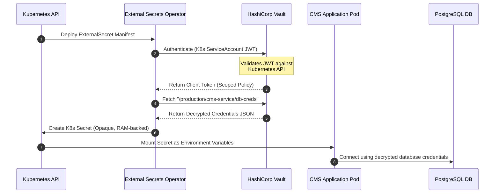

# Secrets Management
## Purpose
This document details the architecture, design, and integration guidelines for secrets management within the NewsOps Cloud digital publishing platform. It defines the storage, rotation, retrieval, and injection mechanisms for sensitive configuration parameters such as database credentials, API tokens, encryption keys, and TLS private keys.

## Executive Summary
NewsOps Cloud requires a secure, automated, and audited secrets management system. To minimize risk, we implement a multi-vault hybrid architecture using HashiCorp Vault for primary cluster secrets, AWS Secrets Manager for infrastructure-aligned resources, and GitHub Secrets for CI/CD pipelines. Workloads authenticate using machine identities (such as AWS IAM Roles for Service Accounts or Vault AppRoles) to retrieve secrets dynamically at runtime, avoiding persistent plain-text secrets in code repositories, build artifacts, or disk storage.

## Vision
Our vision is a zero-trust runtime environment where secrets are short-lived, dynamically generated, and automatically rotated without manual human intervention. By decoupling configuration from code and leveraging strong cryptographic identities, we eliminate credential leakage vectors across the entire development and deployment lifecycle.

## Scope
The scope of this design document covers:
*   Storage and orchestration integrations with HashiCorp Vault, AWS Secrets Manager, and GitHub Secrets.
*   Runtime secret injection patterns using Kubernetes External Secrets Operator (ESO) and environment variables.
*   Bootstrap key injection and cluster initialization workflows.
*   Dynamic database credential rotation for NewsOps database clusters.
*   Permissions, monitoring, logging, and error handling policies specifically for credential access.

## Goals
*   **Zero Plain-Text Secrets**: Eliminate hardcoded credentials across all repositories, configuration files, and container images.
*   **Automated Rotation**: Implement automatic credential rotation with zero downtime for database connections and third-party APIs.
*   **Comprehensive Audit Trails**: Record every request for a secret, including who requested it, when, and from what IP address.
*   **Under 50ms Retrieval Latency**: Minimize startup overhead and runtime latency during secret fetch operations.
*   **High Availability**: Ensure secret retrieval is resilient to regional outages of a single secrets provider.

## Functional Requirements
*   **Workload Identity Authentication**: The system must authenticate workloads using Kubernetes Service Accounts, AWS IAM Roles, or Vault AppRoles.
*   **Multi-Engine Vault Support**: Integrate with AWS Secrets Manager for AWS resource credentials and HashiCorp Vault for multi-cloud/local engine operations.
*   **Local Development Decryption**: Support local developer workflows using Mozilla SOPS with AWS KMS or local age keys for decrypting localized configuration files (`secrets.enc.yaml`).
*   **Dynamic Credential Generation**: Generate short-lived Database credentials for the PostgreSQL instances on-demand, with a maximum lifetime of 24 hours.
*   **CI/CD Pipeline Secrets**: Synchronize code-signing certificates and deployment tokens from HashiCorp Vault to GitHub Secrets automatically using scheduled synchronization jobs.

## Non-Functional Requirements
*   **Security & Encryption**: All secrets must be encrypted at rest using AES-256-GCM authenticated encryption. Transit communication must mandate TLS 1.3.
*   **Performance / Latency**: Secret retrieval from the internal caching layer must resolve in less than 10ms. Cold fetches from HashiCorp Vault or AWS Secrets Manager must complete in less than 100ms (99th percentile).
*   **Availability**: The secrets fetching layer must achieve a 99.999% availability SLA, using local in-memory write-through caches with cryptographic validation.
*   **Auditability**: Audit logs must be streamed to the log aggregator in real-time, using cryptographic signing to prevent tampering.

## Business Rules
*   **Principle of Least Privilege**: Workloads can only access secrets matching their specific namespace and service role.
*   **No Human Access to Production Secrets**: Production secrets can only be modified via automated provisioning scripts (Terraform/OpenTofu) run by elevated CI/CD workers or during emergency break-glass procedures.
*   **Mandatory Secret Expiration**: No static credential may exist with an indefinite expiration date. All secrets must have a maximum time-to-live (TTL) of 90 days, except dynamic database credentials, which have a TTL of 24 hours.

## Actors
*   **Platform Engineer**: Configures the infrastructure, initializes Vault, sets up AWS Secrets Manager access policies, and defines CI/CD secret pipelines.
*   **CMS Workload (Application)**: Microservices that query the secrets manager to retrieve database passwords, Redis URLs, or third-party API keys (e.g., Stripe, SendGrid).
*   **Security Auditor**: Inspects audit logs and access patterns to ensure compliance with security policies.

## User Stories
*   **User Story 1**: As a Platform Engineer, I want to bootstrap a new microservice in the Kubernetes cluster using an annotated service account so that the External Secrets Operator automatically creates a Kubernetes Secret with the required database credentials without manual configuration.
*   **User Story 2**: As a CMS Application Workload, I want to query my database using automatically rotated credentials so that my connection does not break when the password changes every 24 hours.
*   **User Story 3**: As a Security Auditor, I want to review an immutable audit trail of who accessed the payment gateway Stripe API key during the last 30 days so that I can verify compliance with PCI-DSS.

## Acceptance Criteria
*   **AC 1**: The application boot phase must abort and fail-fast if any required secret cannot be resolved within 5 seconds.
*   **AC 2**: The dynamic PostgreSQL credential rotation must rotate passwords without severing active transactions, utilizing a dual-user rollover strategy.
*   **AC 3**: Any change to secret values inside HashiCorp Vault must trigger an automatic Kubernetes Secret sync within 60 seconds.
*   **AC 4**: The audit log must record the Caller Identity, IP Address, Timestamp, Action (Read/Write/Delete), and Secret Path, while completely omitting the secret payload.

## Workflows
### Workflow 1: Application Bootstrapping and Dynamic Secret Injection
1.  The deployment pipeline deploys the CMS Application pod to Kubernetes, associated with a designated `ServiceAccount` and an `ExternalSecret` manifest.
2.  The External Secrets Operator (ESO) detects the `ExternalSecret` custom resource.
3.  ESO initiates authentication with HashiCorp Vault using the Kubernetes Auth Method, presenting the pod's Service Account JWT.
4.  Vault validates the JWT with the Kubernetes API server and returns a client token scoped to the application's policy.
5.  ESO uses the client token to read the secrets from the path `secret/data/production/cms-service/db-creds`.
6.  ESO creates a standard Kubernetes `Secret` containing the decrypted credentials in the application namespace.
7.  The application container starts up, mounting the Kubernetes `Secret` as environment variables or as a read-only volume.
8.  The application initializes database connections using the injected credentials.

### Workflow 2: Dynamic Database Credential Rotation
1.  HashiCorp Vault Database Secrets Engine is configured with administrative access to the PostgreSQL database cluster.
2.  When the application requests database credentials, Vault creates a temporary database user (e.g., `v-approle-cms-1719528000-xxxx`) with a random password.
3.  Vault applies the configured PostgreSQL privileges (e.g., `SELECT`, `INSERT` on database `newsops`) to this temporary user.
4.  Vault returns the username and password to the application with a lease duration of 24 hours.
5.  At the 12-hour mark (halfway through the lease), the application's sidecar controller requests a lease renewal.
6.  If renewal fails or is denied (e.g., during revocation), the application requests a new set of credentials.
7.  At the 24-hour mark, Vault automatically drops the expired database user from the PostgreSQL database, invalidating the old password.

## API Design
While workloads primarily consume secrets injected via files or environment variables, the system exposes an orchestration API for platform administration and manual secret rotation triggers.

### Trigger Secret Rotation
Forces a rotation of the specified secret in the primary vault and propagates updates.

*   **HTTP Method**: `POST`
*   **Endpoint**: `/api/v1/secrets/rotate`
*   **Headers**:
    *   `Content-Type: application/json`
    *   `Authorization: Bearer <admin-jwt>`
*   **Request Payload**:
```json
{
  "secret_provider": "hashicorp_vault",
  "secret_path": "secret/data/production/cms-service/db-creds",
  "reason": "Routine security rotation policy enforcement",
  "rotation_type": "immediate"
}
```
*   **Success Response (202 Accepted)**:
```json
{
  "status": "accepted",
  "request_id": "req-88d40a23-45f9-4b2a-8ad7-f81d3d66141a",
  "message": "Secret rotation initiated successfully. Target components will be updated asynchronously.",
  "timestamp": "2026-06-27T22:42:00Z"
}
```
*   **Error Response (403 Forbidden)**:
```json
{
  "error": "permission_denied",
  "message": "Actor lacks 'secrets:rotate' permission on path 'secret/data/production/cms-service/db-creds'",
  "code": 403001
}
```

### Sync Secrets to GitHub
Triggers a manual synchronization of specific vault paths into GitHub Repository Secrets for CI/CD runs.

*   **HTTP Method**: `POST`
*   **Endpoint**: `/api/v1/secrets/sync/github`
*   **Request Payload**:
```json
{
  "source_vault": "aws_secrets_manager",
  "secret_name": "production/build/docker-registry-token",
  "target_github_repo": "newsops-org/newsops-cloud",
  "github_secret_name": "DOCKER_REGISTRY_TOKEN"
}
```
*   **Success Response (200 OK)**:
```json
{
  "status": "synchronized",
  "source": "aws_secrets_manager:production/build/docker-registry-token",
  "destination": "github:newsops-org/newsops-cloud/secrets/DOCKER_REGISTRY_TOKEN",
  "last_synced_at": "2026-06-27T22:43:10Z"
}
```

## Database Design
To track dynamic leases, rotation states, and metadata without storing actual secret values, the secrets management controller uses a schema dedicated to metadata tracking.

### Schema: `secrets_metadata`
Tracks the locations, providers, and state of configurations.

| Column Name | Data Type | Constraints | Description |
| :--- | :--- | :--- | :--- |
| `secret_id` | `UUID` | `PRIMARY KEY` | Unique identifier. |
| `provider` | `VARCHAR(50)` | `NOT NULL` | `hashicorp_vault`, `aws_secrets_manager`, `github` |
| `secret_path` | `VARCHAR(512)` | `NOT NULL` | The logical path to the secret. |
| `owner_team` | `VARCHAR(100)` | `NOT NULL` | Responsible team (e.g., `editorial-dev`). |
| `rotation_interval_days` | `INT` | `DEFAULT 90` | Rotation frequency target. |
| `last_rotated_at` | `TIMESTAMP` | `NOT NULL` | Timestamp of last rotation run. |
| `next_rotation_due` | `TIMESTAMP` | `NOT NULL` | Timestamp of scheduled rotation. |
| `status` | `VARCHAR(30)` | `NOT NULL` | `active`, `rotating`, `error`, `revoked` |

```sql
CREATE TABLE secrets_metadata (
    secret_id UUID PRIMARY KEY DEFAULT gen_random_uuid(),
    provider VARCHAR(50) NOT NULL CHECK (provider IN ('hashicorp_vault', 'aws_secrets_manager', 'github')),
    secret_path VARCHAR(512) NOT NULL,
    owner_team VARCHAR(100) NOT NULL,
    rotation_interval_days INT DEFAULT 90,
    last_rotated_at TIMESTAMP WITH TIME ZONE NOT NULL DEFAULT CURRENT_TIMESTAMP,
    next_rotation_due TIMESTAMP WITH TIME ZONE NOT NULL,
    status VARCHAR(30) NOT NULL CHECK (status IN ('active', 'rotating', 'error', 'revoked'))
);

CREATE UNIQUE INDEX idx_secrets_path_provider ON secrets_metadata(secret_path, provider);
CREATE INDEX idx_secrets_rotation_due ON secrets_metadata(next_rotation_due) WHERE status = 'active';
```

## UI Design
The NewsOps Admin Platform contains a "Secrets Management Console" allowing administrators to configure rotation rules, monitor lease status, and trigger manual synchronization.

### Interface Layout
1.  **Dashboard Widget**: Displays overall status ("Total Secrets Tracked", "Secrets Expiring Soon", "Last Sync Errors").
2.  **Secret Inventory Table**: Columns for Secret Name/Path, Provider, Owner, Age, Last Synced, and Actions (Rotate Now, View Metadata).
3.  **Secret Metadata Pane**: Shows details such as the Vault policies bound to this secret, target namespaces using it, and rotation schedules. No secret values are ever displayed.
4.  **Rotation Control Dialog**: Triggered by "Rotate Now", prompt requires entering a justification reason and selecting the rotation mode (Immediate vs. Graceful Rollover).

## Permissions
Access to secrets is strictly regulated by Role-Based Access Control (RBAC) and Kubernetes ServiceAccount IAM roles.

*   **Kubernetes Cluster Roles**:
    *   `secret-reader`: Allows the External Secrets Operator to create and patch standard `Secret` objects.
    *   `secret-admin`: Allows Platform Engineers to manage `SecretStore` and `ExternalSecret` definitions.
*   **Vault Policy (`cms-workload-policy`)**:
```hcl
path "secret/data/production/cms-service/*" {
  capabilities = ["read"]
}
path "sys/leases/renew" {
  capabilities = ["update"]
}
```
*   **AWS IAM Policy (`SecretsManagerReadPolicy`)**:
```json
{
  "Version": "2012-10-17",
  "Statement": [
    {
      "Effect": "Allow",
      "Action": [
        "secretsmanager:GetSecretValue",
        "secretsmanager:DescribeSecret"
      ],
      "Resource": "arn:aws:secretsmanager:us-east-1:123456789012:secret:production/cms-service/*"
    }
  ]
}
```

## Security
*   **In-Memory Isolation**: Application runtimes must never dump environment variables to logs or debug endpoints (e.g., `/env` or `/actuator/env`).
*   **Transit Security**: Use only encrypted TLS connections for communication with HashiCorp Vault and AWS Secrets Manager.
*   **No Disk Storage**: Secrets injected by Kubernetes must reside in a `tmpfs` RAM-backed filesystem (e.g., standard Kubernetes secrets mount `/var/run/secrets/`). They must never be written to persistent block storage.
*   **KMS Envelope Encryption**: Production Master Keys (Unseal Keys) in HashiCorp Vault are auto-unsealed using AWS KMS customer managed keys (CMK), preventing manual operator custody of the master key.

## Performance
*   **Retrieval Cache**: Standard secrets are cached using an in-memory client-side cache with a TTL of 300 seconds.
*   **Target Transaction Throughput**:
    *   Cold Startups: Up to 200 concurrent fetches/sec.
    *   Cached Runtime Reads: 10,000 requests/sec.
*   **Bootstrap Limits**: Pod container startup overhead allocated to secrets decryption and injection must be limited to a maximum of 150ms.

## Monitoring
We export metrics from HashiCorp Vault and our Secrets Controller to Prometheus.

### Prometheus Metrics
*   `vault_client_requests_total{status="<status>", method="<method>"}`: Tracks the volume of requests to Vault.
*   `secrets_controller_rotation_latency_seconds`: Histogram measuring the duration of dynamic rotation operations.
*   `secrets_controller_sync_errors_total{provider="<provider>"}`: Counter for failed secret sync events.
*   `secrets_expiry_timestamp_seconds{secret_path="<path>"}`: Epoch timestamp of the secret's expiration.

### Alerts
*   **Critical Alert**: `SecretsSyncFailure` triggers if `secrets_controller_sync_errors_total` increases by > 1 within 5 minutes.
*   **Warning Alert**: `SecretExpiringSoon` triggers if `secrets_expiry_timestamp_seconds - time()` is less than 604800 (7 days) and rotation is marked as manual.

## Logging
Logs must conform to structural JSON standards and exclude raw credential values.

### Example Log Output
```json
{
  "timestamp": "2026-06-27T22:45:00.125Z",
  "level": "INFO",
  "logger": "com.newsops.security.secrets.SecretsRotator",
  "message": "Successfully rotated database credentials for service workload",
  "context": {
    "service_id": "cms-service",
    "vault_provider": "hashicorp_vault",
    "secret_path": "secret/data/production/cms-service/db-creds",
    "correlation_id": "c-99a3-4f1e",
    "duration_ms": 42
  }
}
```

## Error Handling
| Error Code | HTTP Status | Customer/App Message | System Resolution / Recovery Action |
| :--- | :--- | :--- | :--- |
| `ERR_SECRET_NOT_FOUND` | `404` | "The requested secret path does not exist." | Check secret name mappings in the `ExternalSecret` manifest; verify path inside Vault. |
| `ERR_VAULT_AUTH_FAILED` | `500` | "Internal authentication to the vault provider failed." | Validate workload Service Account token validity; verify IAM Role bindings and Trust Relationships. |
| `ERR_VAULT_RATE_LIMIT` | `429` | "Rate limit exceeded for vault provider request." | Implement exponential backoff inside client SDK; check client cache layer configuration. |
| `ERR_DECRYPTION_FAILED` | `500` | "Decryption of secret payload failed." | Verify matching KMS keys are available; check if key has been rotated or disabled. |

## Edge Cases
*   **Vault Cluster Split-Brain**: If the HashiCorp Vault Raft consensus is compromised, read requests will fail. We handle this by configuring a read-only secondary replica cluster or falling back to AWS Secrets Manager as a hot-standby cache.
*   **Deployment Storms**: During large auto-scaling events, hundreds of pods start concurrently. We configure local node-level caching (HashiCorp Vault Agent sidecars with cache enabled) to throttle direct API requests to the Vault service.
*   **KMS Unavailability**: If the KMS service goes offline, Vault cannot unseal or decrypt local config files. The Secrets service queues changes locally and raises the alarm while maintaining cached secrets in-memory.

## Future Improvements
*   **Dynamic HSM Integration**: Integrate hardware security modules (HSM) for storing the root keys of the internal Kubernetes certificate authorities.
*   **Zero-Standing-Privileges (ZSP)**: Implement a system where developers request dynamic credentials for production debugging that automatically expire after 1 hour and delete themselves.

## Mermaid Diagrams
### System Bootstrapping Sequence Diagram



## References
*   [System Architecture](../02-architecture/system_architecture.md)
*   [Database Tenant Isolation](../03-database/tenant_isolation_database.md)
*   [Audit and History Database Schema](../03-database/audit_and_history_schema.md)
