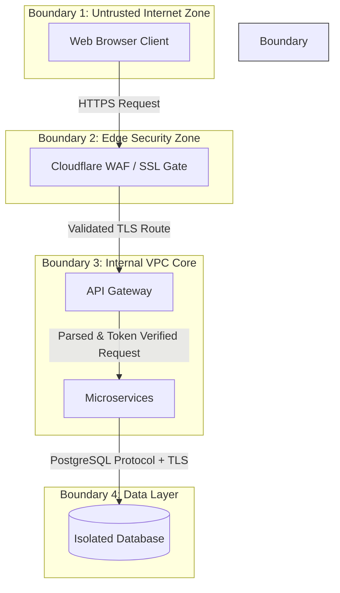

# Platform Threat Modeling & STRIDE Analysis

## Purpose
This document presents the threat landscape model for the NewsOps Cloud digital publishing platform. It defines system trust boundaries, maps ingress/egress entry points, classifies potential vulnerabilities using the STRIDE framework, and documents exploit path mitigations to ensure SOC 2 and ISO 27001 compliance.

## Executive Summary
NewsOps Cloud uses standard threat modeling practices to identify risk vectors across its digital publishing pipeline. By defining strict trust boundaries—separating untrusted client devices, edge gateways, internal container workloads, and isolated databases—the platform implements structural mitigations for Spoofing, Tampering, Repudiation, Information Disclosure, Denial of Service, and Elevation of Privilege (STRIDE). Mitigations include automated signature verification, mandatory cryptographic logging, strict SQL row-level security (RLS), and declarative API gateways.

## Vision
To maintain a robust security perimeter where potential exploits are architecturally blocked by default, and developers have a clear checklist of threat vectors to review during software delivery cycles.

## Scope
This threat model covers the NewsOps Cloud web portal, API endpoints, background worker services, third-party content ingestion channels, and administrative control planes. It excludes physical infrastructure security, which is delegated to AWS (Amazon Web Services).

## Goals
- **Clear Trust Segments**: Define boundaries separating public untrusted nodes from verified internal processing nodes.
- **Actionable STRIDE Mitigations**: Detail how the system handles each of the 6 STRIDE threats.
- **Low Risk Profile**: Maintain zero critical-severity vulnerabilities in published application interfaces.
- **Traceability**: Link each identified threat to specific code-level security checks and operational verification processes.

## Functional Requirements
1. **Trust Boundary Separation**:
   - The platform must route all external traffic across the boundary through the API Gateway, which handles SSL validation and OAuth2 signature checking.
   - Enforce database-level boundaries using PostgreSQL Row-Level Security (RLS) to prevent cross-tenant queries.
2. **STRIDE Assessment Registry**:
   - Provide database tables and interfaces to log threat modeling reviews, mapping risk scores, mitigation status, and assigned security personnel.
3. **Exploit Path Blockers**:
   - API key tokens must be stored in hashed formats using SHA-256 with salts, preventing reading in clear text even if the database is exposed.

## Non-Functional Requirements
1. **Authentication Verification Latency**: Validating JWT signatures and verifying security scopes must take less than 3 milliseconds.
2. **Immutable Audit Persistence**: Security audit records must write to storage pools with a minimum replication factor of three and zero modification permissions for standard user roles.

## Business Rules
- **Rule 1**: Any change to API path routing parameters requires a threat model assessment review before merging code.
- **Rule 2**: Admin API endpoints require secondary multi-factor authentication (MFA) regardless of location or IP address.
- **Rule 3**: Security audit logs are legally retained for 7 years and cannot be modified or deleted.

## Actors
- **Threat Modeler**: Security engineer who updates and analyzes threat models.
- **Developer**: Implements features adhering to STRIDE mitigations.
- **Malicious External Actor**: Attempts to breach trust boundaries, read unauthorized tenant data, or execute DDoS attacks.
- **System Auditor**: Reviews threat modeling documents and corresponding database logs for SOC 2 certification.

## User Stories (At least 3 specific stories)
- **User Story 1: Secure Data Access across Tenant Boundaries**
  As a Reader, I want to fetch articles without risking another tenant's private draft database records leakage, so that trust boundaries isolate databases and prevent data disclosure.
- **User Story 2: Prevention of Administrative Elevation Attacks**
  As a Security Engineer, I want the system to intercept standard editor requests attempting to invoke administration endpoints (e.g. system lockout) and reject them instantly, so that privilege escalation is prevented.
- **User Story 3: Immutable Logging of Sensitive Actions**
  As an Auditor, I want a tamper-proof audit record created every time an article is published or deleted, so that no actor can perform actions they can later repudiate.

## Acceptance Criteria (At least 3-5 criteria with clear thresholds)
- **AC 1 (JWT Verification)**: Every backend request must be authenticated with a JWT signed with RS256 algorithm keys. Symmetric encryption keys (HMAC-based tokens) are not allowed.
- **AC 2 (STRIDE Checklist Check)**: The threat database must record and score at least one STRIDE assessment template for every public controller route.
- **AC 3 (Audit Write-Once)**: The database user role for logging audits must only have `INSERT` and `SELECT` privileges on the `security_audit_logs` table, preventing `UPDATE` or `DELETE` executions.

## Workflows (Step-by-step description of system and user interactions)

### 1. STRIDE Analysis Validation Workflow
For each new feature release:
1. The developer identifies the entry points, exit points, and trust boundaries impacted by the feature.
2. The developer assigns threat risks using the STRIDE framework.
3. The security tool validates features in CI:
   - Does the route require authentication?
   - Does the database table have RLS configured?
   - Are input variables validated using Zod schemas?
4. If validations pass, the deployment proceeds.
5. If validations fail, code merge is blocked, and an alert is sent to the Security Operations Center.

### 2. Trust Boundary Data Flow Diagram
The diagram below details how data flows across three distinct trust boundaries.



## API Design (Provide actual REST endpoints, method, request/response JSON payloads, or GraphQL schemas)

Provides interfaces to view registered threats, perform assessments, and configure active boundaries.

### Trigger Vulnerability Threat Assessment
Enables auditing of API endpoints by injecting security testing inputs.

- **Method**: `POST`
- **Path**: `/api/v1/security/threat-assessments`
- **Request Headers**:
  - `Authorization: Bearer <Admin_JWT>`
- **Request JSON Payload**:
  ```json
  {
    "routePath": "/api/v1/articles/publish",
    "httpMethod": "POST",
    "threatCategory": "TAMPERING",
    "mitigationIdentifier": "MIT-XSS-002",
    "testPayload": "<script>alert('xss')</script>"
  }
  ```
- **Response JSON Payload**:
  ```json
  {
    "assessmentId": "threat-test-81231",
    "routePath": "/api/v1/articles/publish",
    "threatCategory": "TAMPERING",
    "status": "MITIGATED",
    "executionOutput": "Input cleaned, payload rejected",
    "timestamp": "2026-06-27T22:44:00Z"
  }
  ```

### Get Active Trust Boundaries List
Lists defined VPC subnets and security group scopes.

- **Method**: `GET`
- **Path**: `/api/v1/security/boundaries`
- **Request Headers**:
  - `Authorization: Bearer <Admin_JWT>`
- **Response JSON Payload**:
  ```json
  {
    "boundaries": [
      {
        "name": "Public-to-DMZ",
        "type": "Network",
        "ingressRulesCount": 1,
        "trustedSource": "Cloudflare IPv4/IPv6"
      },
      {
        "name": "App-to-DB",
        "type": "Logical",
        "ingressRulesCount": 2,
        "trustedSource": "sg-application-ecs"
      }
    ]
  }
  ```

## Database Design (Identify schema tables, fields, and indexes relevant to this feature)

To record STRIDE threats and mitigation templates, the platform database configures the following tables.

### Table: `threat_assessments`
Maintains records of active STRIDE audits.

| Column Name | Data Type | Constraints | Description |
| :--- | :--- | :--- | :--- |
| `id` | `UUID` | `PRIMARY KEY`, `DEFAULT gen_random_uuid()` | Assessment ID |
| `route_path` | `VARCHAR(255)`| `NOT NULL` | API target path |
| `stride_category`| `VARCHAR(20)` | `NOT NULL` | E.g., `SPOOFING`, `TAMPERING` |
| `risk_level` | `VARCHAR(10)` | `NOT NULL` | E.g., `HIGH`, `CRITICAL` |
| `mitigation_ref` | `VARCHAR(100)`| `NOT NULL` | Code reference (e.g. `MIT-CSRF-01`) |
| `validated_at` | `TIMESTAMPTZ` | `DEFAULT NOW()` | Date of threat confirmation |

### Table: `system_entry_points`
Maps all entry routes to the system trust zones.

| Column Name | Data Type | Constraints | Description |
| :--- | :--- | :--- | :--- |
| `id` | `UUID` | `PRIMARY KEY` | Entry Point ID |
| `endpoint_url` | `VARCHAR(255)`| `UNIQUE`, `NOT NULL` | URL mapping |
| `trust_zone` | `VARCHAR(50)` | `NOT NULL` | Target zone (e.g., `INTERNAL_VPC`) |
| `requires_auth` | `BOOLEAN` | `NOT NULL`, `DEFAULT TRUE` | Authentication status |

```sql
CREATE INDEX idx_threat_assessments_category ON threat_assessments(stride_category);
CREATE INDEX idx_system_entry_points_url ON system_entry_points(endpoint_url);
```

## UI Design (Describe component structure, layouts, actions, and states)
The Threat Modeler Control Portal includes:
- **STRIDE Threat Matrix**: An interactive matrix dashboard containing color-coded threat statuses. Users can click on a STRIDE category (e.g., "Information Disclosure") to display associated routes and verification results.
- **Trust Boundary Visualizer**: Graphical interface visualizing routing boundaries, active security groups, and where incoming requests pass from public to private spaces.
- **Vulnerability Remediation Tracker**: Tracks unresolved vulnerabilities and prints remediation progress codes.

## Permissions (Specify RBAC permissions required, e.g., organizations:read, articles:write)
- `security:threats:read`: Read vulnerability assessment histories and boundary maps.
- `security:threats:write`: Insert new assessments and STRIDE configuration properties.
- `security:boundaries:manage`: Create and register new VPC network subnets in the tracking database.

## Security (Detail security considerations, e.g., input validation, CSRF, JWT validation)

### Detailed STRIDE Threat Mitigation Matrix
| Threat Category | System Description | Specific NewsOps Cloud Mitigation |
| :--- | :--- | :--- |
| **Spoofing Identity** | Attacker logs in as a content administrator using forged authorization tokens. | Enforce JWT token verification utilizing asymmetrical `RS256` keys and store refresh keys securely. |
| **Tampering with Data** | Attacker updates draft article database payloads in transit. | Enforce HTTPS TLS 1.3 across all subnets and validate checksum integrity on database writes. |
| **Repudiation** | Client editor deletes an article database table and claims no involvement. | Pipe audit logs to an immutable CloudWatch destination that uses write-once storage keys. |
| **Information Disclosure** | Multi-tenant leak where customer A views database items of customer B. | Enforce Row-Level Security (RLS) on Postgres. Bind tenant contexts to the connection lifecycle using `app.current_tenant_id`. |
| **Denial of Service** | DDoS flood targeting public web server endpoints. | Deploy Cloudflare WAF DDoS mitigation shield and enforce Redis rate limiting per client IP. |
| **Elevation of Privilege** | Editor accesses Admin endpoints by changing query path roles. | Implement attribute-based access control (ABAC) checked via Open Policy Agent (OPA) middleware. |

## Performance (State latency limits, caching requirements, target TPS)
- **Target TPS**: Security verification filters are designed to handle 20,000 requests per second.
- **Latency Limits**:
  - JWT signature validation: `<1ms`
  - OPA policy evaluation: `<2ms`
- **Cache Requirements**: Cache active public keys for JWT signatures in memory using LRU cache with an expiration of 24 hours.

## Monitoring (Detail Prometheus metrics names, alert triggers)
Prometheus metrics:
- `threat_stride_violations_total`: Counter tracking execution hits violating STRIDE check parameters.
- `threat_unmitigated_endpoints`: Gauge representing registered routes that lack an active STRIDE mitigation flag.
- `threat_jwt_validation_failures`: Counter tracking rejected invalid JWT signatures.

Alert Rules:
- Alert if `threat_stride_violations_total` > 0 (indicates security validation code has bypassed checks).
- Alert if `threat_jwt_validation_failures` is > 10 in 1 minute.

## Logging (Specify log formats, error levels, log contexts)
Security threats logging uses standardized context objects:

```json
{
  "timestamp": "2026-06-27T22:44:10.871Z",
  "level": "CRITICAL",
  "event_type": "STRIDE_VIOLATION_DETECTED",
  "context": {
    "category": "ELEVATION_OF_PRIVILEGE",
    "route": "/api/v1/security/lockout",
    "requested_by": "user-editor-12",
    "ip_address": "203.0.113.111",
    "action": "BLOCKED"
  },
  "message": "User with role EDITOR attempted to invoke administrator lockout endpoint. Request rejected."
}
```

## Error Handling (Map input/system error codes to HTTP status and customer-facing messages)

| Internal Error Code | HTTP Status | Customer-Facing Message | System Trigger Context |
| :--- | :--- | :--- | :--- |
| `THR-SPOOF-001` | `401 Unauthorized` | "Session invalid. Please log in again." | Invalid, modified, or expired JWT. |
| `THR-ELEV-001` | `403 Forbidden` | "Access denied. Action requires higher clearance." | User role lacks required scopes. |
| `THR-TAMP-001` | `400 Bad Request` | "Data integrity check failed." | Payload signature mismatch. |
| `THR-INFO-001` | `403 Forbidden` | "Access denied. Resource belongs to another workspace." | Row Level Security (RLS) check failed. |

## Edge Cases (Handle race conditions, rate limit hits, upstream timeouts)
- **Database Backup Tampering**: Backups could be read or modified by malicious actors. Mitigated by enforcing AWS KMS encryption (AES-256-GCM) on RDS snapshots and replicating backups to an isolated recovery account.
- **Replay Attacks with Valid JWTs**: Intercepted JWTs can be replayed before expiration. Mitigated by using short-lived tokens (15-minute expiration) and maintaining a Redis-based token revocation list.
- **DNS Rebinding Hijacking Boundary**: Intercepted local DNS names inside VPC. Mitigated by using strictly defined AWS VPC Endpoint interfaces for internal AWS API queries.

## Future Improvements (Provide long-term scaling, architecture refactor paths)
- **Automated Threat Modeling (Threat-as-Code)**: Implement automated security scanners that parse OpenAPI schemas and auto-generate DFDs and STRIDE logs during build pipelines.
- **Zero Trust Network Access (ZTNA)**: Transition all human infrastructure interfaces to ephemeral, credential-free session nodes using AWS SSM VPC endpoints.

## Mermaid Diagrams (Include at least one high-quality diagram: flowchart, sequence, or ERD)

### Trust Boundary Data Flow Diagram
Below is the deployment layout across trust zones.


## References (Reference other related files in the repository using standard relative markdown links, e.g., '../02-architecture/system_architecture.md')
- [Multi-Tenancy Architecture](../02-architecture/multi_tenancy_architecture.md)
- [Design Patterns](../02-architecture/design_patterns.md)
- [OWASP Mitigations](owasp_mitigation.md)
