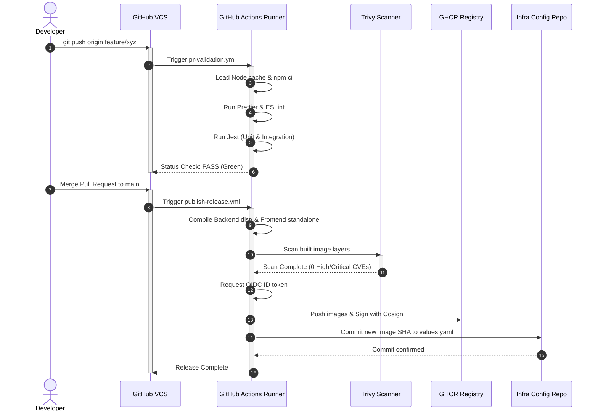

# CI/CD Pipelines Design
## Purpose
This document details the continuous integration and continuous deployment (CI/CD) pipelines design for the NewsOps Cloud digital publishing platform. It outlines automated testing, code quality checks, container image compilation, vulnerability auditing, registry publishing, and target infrastructure triggers using GitHub Actions.

## Executive Summary
NewsOps Cloud employs a strict, pipeline-validated delivery process. Every code submission triggers a verification pipeline that runs static analysis, style linting, unit tests, and security audits. Merges into the production branch run the CD pipeline, which compiles production container images using BuildKit, runs vulnerability scanning with Trivy, signs images with Cosign, pushes them to GitHub Container Registry (GHCR), and commits tag updates to the Helm charts repository.

## Vision
The vision is to establish a fully automated, immutable release cycle. By linking system deployment status directly to git actions, we eliminate configuration drift, audit every production deployment back to a specific commit SHA, and enable developers to deploy code safely.

## Scope
This pipeline design covers:
- **Pull Request Validation Workflow** (`pr-validation.yml`): Runs on all PR branches targeting `main`.
- **Release and Deployment Workflow** (`publish-release.yml`): Runs on tag creations and merges to `main`.
- **Registry and Sign-off Configurations**: GHCR integration and Cosign signatures.
- **Auto-deployment triggers**: Helm value modification scripts.

It excludes low-level runner operating system configurations and local repository hooks.

## Goals
- **Fail Fast**: Detect structural, compilation, or testing failures within the first three minutes of a code push.
- **Zero Raw Secrets**: Use OpenID Connect (OIDC) tokens for secure interactions with container registries and cloud providers.
- **Comprehensive Auditing**: Sign and record container digests to guarantee only verified, scanned, and signed images run in Kubernetes.
- **Auto-Tuned Caching**: Minimize dependency retrieval latency in runners.

## Functional Requirements
- **Linting Verification**: Enforce linting compliance on both frontend (Next.js) and backend (NestJS) layers.
- **Test Coverage Rules**: Run jest tests and verify coverage outputs.
- **Container Build & Push**: Compile Docker images for AMD64 architectures and push them to GHCR.
- **Vulnerability Scanning**: Block pipeline runs if Trivy detects vulnerabilities above the configured severity threshold.
- **Helm Deployment Updates**: Commit the newly built image SHA into the Helm values configuration file.

## Non-Functional Requirements
- **Execution Target**: PR verification pipelines must complete in under $4$ minutes.
- **Release Pipeline Target**: Image compilation, signing, registry storage, and deployment trigger steps must resolve in under $7$ minutes.
- **Availability of Pipelines**: Maintain 100% CI uptime using multiple GitHub hosted runners.

## Business Rules
- **Branch Protection**: Releases to production can only trigger from code merged into the protected `main` branch.
- **Pipeline Dependencies**: Deployment steps require successful validation stages. If linting or testing jobs fail, subsequent container builds are blocked.
- **Vulnerability Threshold**: Any vulnerability with a CVSS score $\ge 8.0$ (categorized as HIGH or CRITICAL) halts container generation.

## Actors
- **Software Engineer**: Triggers PR checks, reviews diagnostic run summaries, and corrects validation errors.
- **Security Auditor**: Adjusts container scanning rules and reviews container security logs.
- **DevOps Architect**: Modifies workflow scripts, tunes caching scopes, and configures runner environments.

## User Stories
- **User Story 1**: As a Software Engineer, I want the CI pipeline to run unit tests automatically on my branch so that I can verify that my code changes do not break existing platform logic.
- **User Story 2**: As a Security Auditor, I want the build pipeline to run container scans and halt release deployment if new dependencies introduce critical vulnerabilities.
- **User Story 3**: As a DevOps Engineer, I want the pipeline to update the Helm charts image tags automatically upon merge so that staging clusters are continually synced.

## Acceptance Criteria
- Pull Request validation workflows must test and lint both Next.js and NestJS codebases, returning green checkmarks only when all tests pass and coverage exceeds $80\%$.
- Trivy vulnerability scanner must identify $0$ `CRITICAL` issues in the output container. If any are detected, the pipeline must terminate with Exit Code 1.
- Releases must push signed images to `ghcr.io/newsops/backend` and `ghcr.io/newsops/frontend`, labeled with both semantic version tags and the matching commit SHA.

## Workflows
### CI/CD Deployment Process Workflows
#### 1. PR Verification Workflow
- **Trigger**: Developer creates or updates a Pull Request targeting `main`.
- **Validation**: GitHub runner boots, clones the repository, checks node caching, installs dependencies, lints directories, and executes Jest tests.
- **Report**: Runner uploads coverage metrics and displays execution statuses on the pull request.

#### 2. Release & Deploy Workflow
- **Trigger**: Developer merges PR to `main` or creates a git tag (e.g., `v1.2.0`).
- **Build**: GHA runner boots, checks out the code, executes multi-stage docker compilation (`docker_environments.md`).
- **Audit**: Trivy performs vulnerability scanning on target image files.
- **Sign**: Cosign signs the compiled image container using OIDC authentication keys.
- **Publish**: Runner pushes images to GitHub Container Registry.
- **Promote**: Runner runs a script checking out the separate infrastructure repository and updates `values.yaml` image tags, prompting GitOps sync.

```
+------------+       +------------------+       +------------------+
| git push / | ----> | PR Validation CI | ----> | Unit/E2E Tests   |
| PR Created |       | (pr-validation)  |       | & Code Lints     |
+------------+       +------------------+       +------------------+
                                                          |
                                                          v
+------------+       +------------------+       +------------------+
| Git Tag or | ----> | Release CD       | ----> | Multi-stage Build|
| PR Merge   |       | (publish-release)|       | & Trivy Scan     |
+------------+       +------------------+       +------------------+
                                                          |
                                                          v
                     +------------------+       +------------------+
                     | GitOps Deploy    | <---- | Sign with Cosign |
                     | (Helm Tag Commit)|       | & Push to GHCR   |
                     +------------------+       +------------------+
```

---

## API Design
CI/CD operations integrate with GitHub's webhook APIs. The NewsOps management system provides an administrative API to audit active build states.

### Deploy Pipeline Callback Receiver
* **URL**: `http://localhost:8081/admin/pipelines/callback`
* **Method**: `POST`
* **Headers**:
  * `X-Hub-Signature-256`: `sha256=<HMAC-Signature>`
* **Request Payload**:
```json
{
  "workflow": "publish-release.yml",
  "runId": 982142831,
  "commit": "8f3b2c9df031a61c77840134f40f2b84a9e5b721",
  "status": "success",
  "images": [
    {
      "name": "ghcr.io/newsops/backend",
      "tag": "v1.4.0",
      "digest": "sha256:d8c5417b18deba01c23f5b721ea0283e0c30a5c4e12e128b12204"
    }
  ]
}
```
* **Response Status**: `200 OK`

---

## Database Design
Pipeline state changes are recorded in the `public` administrative schema.

### `pipeline_runs` Table
Tracks telemetry of build actions.
- `id`: UUID (Primary Key)
- `run_id`: BIGINT (Unique index, maps to GitHub Run ID)
- `workflow_name`: VARCHAR(100)
- `commit_sha`: VARCHAR(40) (Index)
- `status`: VARCHAR(20) (e.g. 'queued', 'running', 'success', 'failed')
- `trigger_event`: VARCHAR(30)
- `started_at`: TIMESTAMP WITH TIME ZONE
- `completed_at`: TIMESTAMP WITH TIME ZONE
- `failed_job_name`: VARCHAR(100)

---

## UI Design
GitHub workflow dashboards show pipeline run states.
- **Workflow Dependency Graph**: Shows visual blocks linking validation, security auditing, container builds, and publishing.
- **Slack Alert Card**: Renders color-coded build notifications (green for success, red for failures) showing run durations, commit authors, and direct links to runner logs.

---

## Permissions
The CI/CD workflow runs under a token configuration with defined scopes:
```yaml
permissions:
  contents: write    # To commit tag updates to configuration branches
  packages: write    # To publish images to GitHub Container Registry (GHCR)
  id-token: write    # Required to authenticate with Cosign/OIDC
  statuses: write    # To post commit statuses back to PRs
```

---

## Security
- **OIDC Identity Federation**: No persistent cloud credentials are baked into GitHub secrets. Workflows authenticate with AWS/Cloud resources using short-lived JWT tokens.
- **Cosign Image Signing**: Images are signed using Cosign keyless signatures. Cluster admission controllers verify signatures against the GitHub OIDC provider before executing images.
- **Secret Masking**: Environmental variables containing connection details are defined as encrypted repository secrets, dynamically injected into tests at runtime.

---

## Performance
- **Dependency Caching**: Utilizes `actions/cache` matching hashes of `package-lock.json` to prevent re-installing Node.js modules.
- **Docker Layer Cache**: Utilizes the GHA caching backend (`type=gha`) for Docker BuildKit, saving compiled container layers across workflow runs.

---

## Monitoring
- **Prometheus Metric**: `pipeline_execution_time_seconds` (Tracks duration of workflow steps).
- **Prometheus Metric**: `pipeline_cve_count` (Tracks number of vulnerabilities identified during Trivy scans).
- **Alert Trigger**: Trigger Slack/PagerDuty notification if `pipeline_cve_count > 0` for any image targeting the production tag scope.

---

## Logging
Runners write execution telemetry.
* **Log Pattern**: `{"timestamp": "%ISO8601%", "level": "INFO", "workflow": "publish-release", "job": "build-containers", "step": "docker-push", "message": "Successfully published image digests to ghcr.io"}`
* **Error Level**: `ERROR` for compiler crashes or vulnerability failures, `WARN` for cache read misses, `INFO` for routine check steps.

---

## Error Handling
| Internal Error Code | Status / Exit Code | Diagnostic / Correction Message |
|:---|:---|:---|
| `ERR_TESTS_FAILED` | Exit Code 1 | Code unit tests failed execution. Review runner Jest output stack traces. |
| `ERR_LINT_ERRORS` | Exit Code 1 | Linter rules violated. Run `npm run lint --fix` locally before pushing. |
| `ERR_TRIVY_VULN_FOUND`| Exit Code 1 | Trivy discovered security issues violating release rules. Patch package versions. |
| `ERR_COSIGN_SIGN_FAIL` | Exit Code 2 | OIDC JWT verification failed. Cosign cannot verify build signature credentials. |

---

## Edge Cases
- **Concurrent Tag Merges**: When multiple merges occur, the Helm tag update step uses a locking git rebase pattern to prevent merge conflicts in the environment repo.
- **Runner Out-of-Disk (OOM/Disk)**: Large docker layer cache files can deplete runner disk space. Workflows include a pre-cleanup step to prune unused Docker cache layers before compiling.

---

## Mermaid Diagrams
### Continuous Integration / Delivery Lifecycle Sequence


---

## Continuous Integration & Delivery Workflow Manifests

### 1. Pull Request Verification Workflow (`pr-validation.yml`)
```yaml
name: PR Validation

on:
  pull_request:
    branches:
      - main
    paths:
      - 'apps/**'
      - 'packages/**'
      - 'package*.json'
      - '.github/workflows/pr-validation.yml'

jobs:
  validate-codebase:
    runs-on: ubuntu-22.04
    steps:
      - name: Checkout Code
        uses: actions/checkout@v4

      - name: Setup Node.js Environment
        uses: actions/setup-node@v4
        with:
          node-version: 20.11.0
          cache: 'npm'

      - name: Install Dependencies
        run: npm ci

      - name: Lint Code
        run: npm run lint

      - name: Formatter Audit
        run: npm run format:check

      - name: Run Unit Tests
        run: npm run test:cov

      - name: Upload Test Coverage
        uses: actions/upload-artifact@v4
        with:
          name: coverage-report
          path: coverage/
          retention-days: 7
```

### 2. Container Build and Release Workflow (`publish-release.yml`)
```yaml
name: Build and Publish Release

on:
  push:
    branches:
      - main
    tags:
      - 'v*.*.*'

permissions:
  contents: write
  packages: write
  id-token: write

jobs:
  build-and-push:
    runs-on: ubuntu-22.04
    steps:
      - name: Checkout Code
        uses: actions/checkout@v4

      - name: Set up QEMU
        uses: docker/setup-qemu-action@v3

      - name: Set up Docker Buildx
        uses: docker/setup-buildx-action@v3

      - name: Install Cosign
        uses: sigstore/cosign-installer@v3.3.0

      - name: Log in to GitHub Container Registry
        uses: docker/login-action@v3
        with:
          registry: ghcr.io
          username: ${{ github.actor }}
          password: ${{ secrets.GITHUB_TOKEN }}

      - name: Set Image Meta
        id: meta
        run: |
          if [[ "${{ github.ref }}" == refs/tags/* ]]; then
            echo "TAG=${{ github.ref_name }}" >> $GITHUB_OUTPUT
          else
            echo "TAG=sha-${{ github.sha }}" >> $GITHUB_OUTPUT
          fi

      # Build NestJS Backend Image
      - name: Build and Push Backend Container
        uses: docker/build-push-action@v5
        id: build-backend
        with:
          context: .
          file: ./Dockerfile.backend
          push: true
          tags: |
            ghcr.io/newsops/backend:${{ steps.meta.outputs.TAG }}
            ghcr.io/newsops/backend:latest
          cache-from: type=gha
          cache-to: type=gha,mode=max

      # Audit NestJS Backend Container
      - name: Vulnerability Audit Backend
        uses: aquasecurity/trivy-action@0.16.0
        with:
          image-ref: ghcr.io/newsops/backend:${{ steps.meta.outputs.TAG }}
          format: 'table'
          exit-code: '1'
          ignore-unfixed: true
          vuln-type: 'os,library'
          severity: 'HIGH,CRITICAL'

      # Sign NestJS Backend Container
      - name: Sign Backend Image
        run: |
          cosign sign --yes ghcr.io/newsops/backend:${{ steps.meta.outputs.TAG }}

      # Build Next.js Frontend Image
      - name: Build and Push Frontend Container
        uses: docker/build-push-action@v5
        id: build-frontend
        with:
          context: ./frontend
          file: ./frontend/Dockerfile.frontend
          push: true
          tags: |
            ghcr.io/newsops/frontend:${{ steps.meta.outputs.TAG }}
            ghcr.io/newsops/frontend:latest
          cache-from: type=gha
          cache-to: type=gha,mode=max

      # Audit Next.js Frontend Container
      - name: Vulnerability Audit Frontend
        uses: aquasecurity/trivy-action@0.16.0
        with:
          image-ref: ghcr.io/newsops/frontend:${{ steps.meta.outputs.TAG }}
          format: 'table'
          exit-code: '1'
          ignore-unfixed: true
          vuln-type: 'os,library'
          severity: 'HIGH,CRITICAL'

      # Sign Next.js Frontend Container
      - name: Sign Frontend Image
        run: |
          cosign sign --yes ghcr.io/newsops/frontend:${{ steps.meta.outputs.TAG }}

      # Update Infrastructure GitOps values.yaml
      - name: Update GitOps Deployment Tag
        env:
          RELEASE_TAG: ${{ steps.meta.outputs.TAG }}
          GH_PAT: ${{ secrets.HELM_GIT_TOKEN }}
        run: |
          git config --global user.email "devops@newsops.cloud"
          git config --global user.name "NewsOps CI Bot"
          
          # Clone deployment config repo
          git clone https://${GH_PAT}@github.com/newsops/newsops-infrastructure.git
          cd newsops-infrastructure
          
          # Update values.yaml backend & frontend image tags
          sed -i "s/backendTag: .*/backendTag: \"${RELEASE_TAG}\"/g" values.yaml
          sed -i "s/frontendTag: .*/frontendTag: \"${RELEASE_TAG}\"/g" values.yaml
          
          git add values.yaml
          git commit -m "chore(release): deploy release tag ${RELEASE_TAG} [skip ci]"
          git push origin main
```

---

## References
- Master DevOps Index: [./index.md](./index.md)
- Docker Environments Specification: [./docker_environments.md](./docker_environments.md)
- System Architecture Design: [../02-architecture/system_architecture.md](../02-architecture/system_architecture.md)
- Kubernetes Deployment Framework: [./kubernetes_deployment.md](./kubernetes_deployment.md)
- Prometheus Observability Design: [./monitoring_prometheus.md](./monitoring_prometheus.md)
