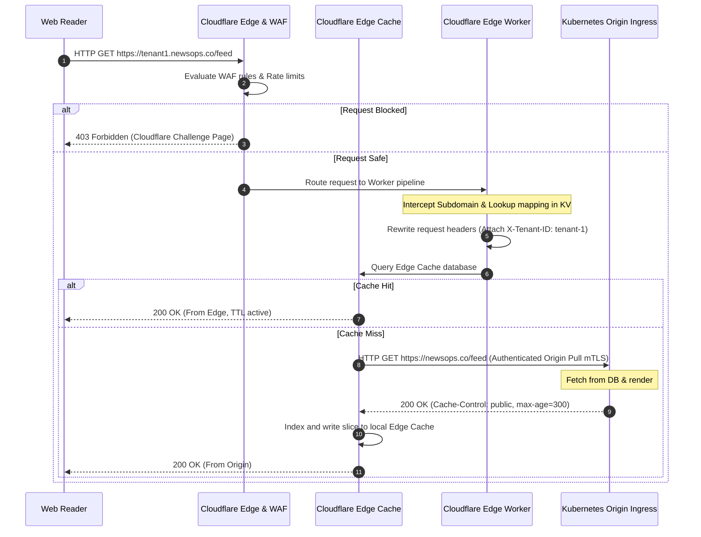
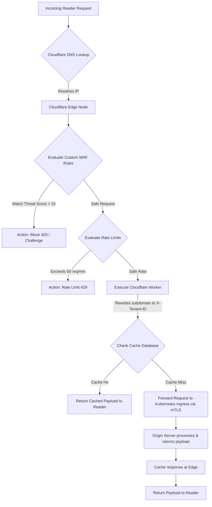

# Cloudflare Configurations and Edge Security Design

## Purpose
This document defines the edge routing, caching, Web Application Firewall (WAF), and custom request manipulation configurations implemented on Cloudflare for the NewsOps Cloud digital publishing platform. It details DNS architectures, CDN page rules, custom WAF rate-limiting limits, and Cloudflare Workers script specifications.

## Executive Summary
Edge management is critical to protecting origin services and optimizing content delivery speed globally. Cloudflare acts as the entry proxy gateway for all NewsOps traffic. By leveraging Cloudflare's global edge network, the platform offloads up to 80% of read traffic through page and cache rules. Security is enforced at the edge via custom WAF rules that intercept SQL injections, bad-bot scrapers, and DDoS attacks. Dynamic subdomain routing is handled at the edge by Cloudflare Workers (Edge Workers) mapping subdomains to origin endpoints.

## Vision
The vision is to establish a zero-latency global delivery network where static assets and API query results are cached at edge nodes, and security challenges are evaluated before traffic reaches the internal Kubernetes cluster, ensuring high availability and cost efficiency.

## Scope
This document covers:
1. **Cloudflare DNS Infrastructure**: Record layouts, routing configurations, and DNSSEC setup.
2. **CDN Page Rules**: Caching directives for static files, API responses, and dynamic HTML routes.
3. **Custom WAF Rules**: Firewall filters, rate-limiting rules, and country-based blocking maps.
4. **Edge Workers script specs**: Cloudflare Workers configurations for subdomain rewrites and KV mapping.
5. **Cache Purging Protocols**: Real-time invalidation of cached elements via CDN APIs.

It does not cover internal Kubernetes ingress controller configs (covered in `network_security.md`) or system metric aggregations (covered in `grafana_dashboards.md`).

## Goals
- **High Cache Efficiency**: Achieve a minimum of 80% Edge Cache Hit Ratio for all public reading traffic.
- **Low Edge Overhead**: Cloudflare Workers must execute request rewrites in $< 15\text{ ms}$.
- **Instant Invalidation**: Evict changed articles from the global cache in $< 5.0\text{ seconds}$ after editing.
- **Robust Edge Security**: Block 100% of detected DDoS attacks and brute-force events at the edge, prior to hitting origin servers.

## Functional Requirements
- **Dynamic DNS Management**: Manage records for parent domain (`newsops.co`) and wildcard tenant subdomains (`*.newsops.co`).
- **Static Content Caching**: Cache all static resources (JS, CSS, images, fonts) globally with an edge TTL of 30 days.
- **Dynamic API Caching**: Cache public API paths (e.g. `/api/v1/articles/*`) for 5 minutes, utilizing custom cache keys based on requested language and device type.
- **Custom Domain Routing**: Use Cloudflare Workers to intercept client subdomain requests (e.g. `tenant1.newsops.co`) and rewrite target paths to internal tenant systems.
- **WAF Security Filters**: Implement custom WAF rules blocking known malicious user-agent strings, SQL injection patterns, and cross-site scripting attempts.
- **Rate-Limiting Guards**: Restrict authentication attempts on `/api/v1/auth/*` to a maximum of 60 requests per minute per IP address.

## Non-Functional Requirements
- **Global DNS Latency**: Cloudflare edge nameservers must resolve DNS queries in $< 15\text{ ms}$ globally.
- **Edge Worker Resource Limits**: Cloudflare Worker scripts must fit within the 128MB CPU execution limit and utilize $< 50\text{ ms}$ CPU execution duration per call.
- **SSL Security Mode**: Enforce "Full (Strict)" SSL/TLS encryption mode, requiring valid, trusted origin certificates.

## Business Rules
- **Cache Bypass on Auth**: Any request containing an `Authorization` header, a `X-API-Key` header, or a session cookie must bypass the Cloudflare CDN cache.
- **Authenticated Origin Pulls**: Ingress traffic to the Kubernetes cluster must only be accepted if it presents a client certificate validated by Cloudflare's root CA (mTLS).
- **Compliance Restrictions**: WAF configurations must block traffic from embargoed or high-risk countries attempting access to administration gateways.

## Actors
- **Security Administrator**: Manages WAF rules, firewall events, and rate-limiting limits.
- **Content Publisher**: Publishes articles, triggering automated edge cache purge calls.
- **External Reader**: Pulls publishing articles, receiving responses from the nearest edge cache server.

## User Stories
- **User Story 1**: As an External Reader, I want static pages and article content to load from my local edge server so that I do not experience lag caused by querying the main PostgreSQL database in another continent.
- **User Story 2**: As a Security Administrator, I want to block bot scrapers attempting to extract article content from our API endpoints so that our origin Kubernetes servers do not experience database performance degradation.
- **User Story 3**: As a Content Publisher, I want changes made to my published article to be instantly updated globally so that readers do not see outdated or corrected errors.

## Acceptance Criteria
- Page rules must successfully cache static assets with the header `Cache-Control: public, max-age=2592000` (30 days).
- Custom WAF rules must challenge or block HTTP requests with threat scores exceeding `15` as calculated by Cloudflare.
- The Cloudflare Worker must rewrite tenant subdomains (e.g. `http://tenant1.newsops.co/feed`) to internal query paths (e.g. `https://newsops.co/api/v1/tenant-1/feed`) inside the request headers before forwarding.
- API cache purging requests submitted with a target URL tag must resolve globally in under 5 seconds.

## Workflows
1. **Request Caching and Routing Workflow**:
   - A reader requests `https://tenant1.newsops.co/api/v1/articles/123`.
   - The DNS request resolves to the closest Cloudflare edge IP.
   - Cloudflare WAF evaluates the request (IP reputation, rate limit, user-agent). If safe, processing continues.
   - The Cloudflare Worker intercepts the request, reads the `tenant_domain_mapping` KV store, and translates `tenant1` to standard tenant parameters.
   - Cloudflare checks the Edge Cache database for cache key matches.
   - If a Cache Hit is found: Cloudflare immediately returns the response to the client.
   - If a Cache Miss occurs: Cloudflare forwards the request to the Kubernetes origin API gateway using mTLS.
   - The origin processes, returns the payload with caching headers, and Cloudflare caches the result before forwarding it to the reader.

2. **Automated Cache Invalidation Workflow**:
   - A content editor updates an article in the CMS.
   - The NestJS CMS server writes the change to the database.
   - The NestJS server triggers a webhook event: `CachePurgeJob`.
   - The BullMQ worker picks up the job and sends a HTTP POST request to the Cloudflare API.
   - Cloudflare processes the purge request, invalidates the target paths across all edge data centers, and returns `{"success": true}` within 2 seconds.



## API Design
Edge routes and rules are configured via Cloudflare REST API. The following designs represent WAF schema structures, Worker scripts, and cache purge API calls:

### 1. Cloudflare Cache Purge Endpoint
* **URL**: `https://api.cloudflare.com/client/v4/zones/:zone_id/purge_cache`
* **Method**: `POST`
* **Headers**:
  * `Authorization: Bearer <CLOUDFLARE_API_TOKEN>`
  * `Content-Type: application/json`
* **Request Payload**:
```json
{
  "files": [
    "https://tenant1.newsops.co/feed",
    "https://tenant1.newsops.co/api/v1/articles/123"
  ],
  "tags": [
    "tenant-1-articles",
    "article-123"
  ]
}
```
* **Response Payload (200 OK)**:
```json
{
  "result": {
    "id": "z091ab875323e4f7a7812"
  },
  "success": true,
  "errors": [],
  "messages": []
}
```

### 2. Cloudflare Edge Worker Script (`index.ts`)
```typescript
interface Env {
  TENANT_MAPPING: KVNamespace;
}

export default {
  async fetch(request: Request, env: Env, ctx: ExecutionContext): Promise<Response> {
    const url = new URL(request.url);
    const hostname = url.hostname;

    // Skip rewriting for primary static resources and apex domain
    if (hostname === 'newsops.co' || hostname.startsWith('assets.')) {
      return fetch(request);
    }

    const subdomain = hostname.split('.')[0];
    
    // Resolve Tenant ID from Cloudflare KV Namespace
    const tenantId = await env.TENANT_MAPPING.get(subdomain);
    if (!tenantId) {
      return new Response('Tenant domain not configured.', { status: 404 });
    }

    // Clone request headers and inject Tenant Context
    const modifiedHeaders = new Headers(request.headers);
    modifiedHeaders.set('X-Tenant-ID', tenantId);
    modifiedHeaders.set('X-Forwarded-Host', hostname);

    // Rewrite request path target to origin endpoints
    const targetUrl = `https://origin-api.newsops.co${url.pathname}${url.search}`;
    const modifiedRequest = new Request(targetUrl, {
      method: request.method,
      headers: modifiedHeaders,
      body: request.body,
      redirect: 'manual'
    });

    return fetch(modifiedRequest);
  }
};
```

## Database Design
Cloudflare Workers utilize a globally distributed key-value database called Cloudflare KV. The parameters and schemas are structured as follows:

### `TENANT_MAPPING` KV Namespace Design
* **Key**: Subdomain String (e.g. `tenant1`)
* **Value**: Internal Tenant ID String (e.g. `tenant_90a1bb2`)
* **Metadata**: JSON object containing tenant status and plan tier:
```json
{
  "status": "active",
  "tier": "enterprise",
  "custom_domain": "www.nationalnews.com"
}
```

### Namespace TTL Configuration
- KV values are read from memory cache edge-wide.
- Cache expiration is configured for `86400` seconds (24 hours).
- When a Tenant Admin changes subdomain settings, a Cloudflare API call purges this key dynamically.

## UI Design
Configuration files are managed programmatically via terraform, but SREs audit and view configurations in the Cloudflare Dashboard UI layout:
- **WAF Security Dashboard**: Contains time-series charts displaying Blocked Attacks, Solved Challenges, and total firewall logs.
- **Workers Configuration Tab**: Renders deployed workers list, bound KV namespaces, environment variables, and execution duration logs.
- **Caching Rules Page**: Drag-and-drop hierarchy list defining page rules, cache statuses, and custom cache bypass headers.

## Permissions
Access permissions to Cloudflare parameters are managed via Cloudflare API Tokens:
- `Zone.DNS:Edit`: Permission to update, add, or delete DNS records. (Assigned to Terraform deployment roles).
- `Zone.CachePurge:Edit`: Permits clearing global caches. (Assigned to NestJS CMS API keys).
- `Zone.WAF:Edit`: Permits SREs and Security Engineers to adjust firewall settings and IP blacklist tables.

## Security
- **Origin Protection (mTLS)**: Authenticated Origin Pull is activated. The Kubernetes gateway rejects requests that do not contain a valid SSL client certificate signed by Cloudflare.
- **DNSSEC Activation**: Enable DNSSEC to prevent DNS cache poisoning and man-in-the-middle spoofing attacks.
- **WAF Rule Sets**: Auto-update rules blocking known OWASP Top 10 vulnerabilities (SQL Injection, XSS, Path Traversal).
- **SSL Configuration**: Minimum TLS Version is set to `1.2`. Dynamic HTTPS rewriting automatically converts all HTTP requests to HTTPS.

## Performance
- **Edge Cache TTL**: Cache dynamic pages for 5 minutes and static items for 30 days.
- **KV Store Performance**: Read times from KV memory caches must resolve in $< 2.0\text{ ms}$ at edge nodes.
- **Routing Optimizations**: Argo Smart Routing is enabled, reducing origin path packet loss by up to 10% and optimizing routing times over the Cloudflare backbone network.

## Monitoring
Edge activity is tracked in Prometheus using exporters collecting metrics from the Cloudflare GraphQL Analytics API:
- `cloudflare_zones_requests_total`: Counter of edge requests, categorized by HTTP status code and cache status.
- `cloudflare_zones_bandwidth_total`: Bandwidth served, divided by Cache-Hit and Cache-Miss bytes.
- `cloudflare_worker_cpu_time_seconds`: Execution duration of deployed Edge Workers.

### Alerting Rules (Prometheus Alertmanager YAML)
```yaml
groups:
  - name: newsops-cloudflare-alerts
    rules:
      - alert: CloudflareCacheHitRatioDrop
        expr: (sum(rate(cloudflare_zones_requests_total{cache_status="hit"}[5m])) / sum(rate(cloudflare_zones_requests_total[5m]))) * 100 < 50.0
        for: 10m
        labels:
          severity: warning
        annotations:
          summary: "Cloudflare cache hit ratio has dropped below 50%"
          description: "Edge Cache efficiency is currently at {{ $value | printf \"%.2f\" }}%. Invalidate rules or cache bypasses may be misconfigured."

      - alert: WAFHighBlockRate
        expr: sum(rate(cloudflare_zones_requests_total{action="block"}[5m])) > 100
        for: 2m
        labels:
          severity: warning
        annotations:
          summary: "High rate of firewall blocks detected at the edge"
          description: "Cloudflare is blocking {{ $value }} requests per second. The origin may be undergoing a distributed scraping or DDoS event."
```

## Logging
Cloudflare logs are forwarded using Logpush to the centralized aggregation pipeline in JSON format:
* **Log Pattern (WAF Block Event)**:
```json
{
  "ClientIP": "203.0.113.195",
  "ClientRequestURI": "/api/v1/auth/admin-login",
  "EdgeStartTimestamp": "2026-06-27T18:02:00Z",
  "EdgeResponseStatus": 403,
  "FirewallMatchesActions": ["block"],
  "FirewallMatchesRuleIDs": ["rule-sql-injection-detect"],
  "UserAgent": "sqlmap/1.4.12#stable",
  "ZoneName": "newsops.co"
}
```

## Error Handling
Edge-level errors are intercepted, rendering custom, user-friendly error layouts:

| Internal Error Code | HTTP Status | Customer-Facing Message |
|:---|:---|:---|
| `ERR_CLOUDFLARE_521` | 521 Web Server Is Down | The publishing server is temporarily undergoing maintenance. Please try again in a few minutes. |
| `ERR_CLOUDFLARE_522` | 522 Connection Timed Out | The server took too long to respond. The system operators have been notified. |
| `ERR_RATE_LIMIT_EXCEEDED` | 429 Too Many Requests | You have sent too many requests in a short time. Please wait a minute before retrying. |

## Edge Cases
- **Origin Server Outage (Offline Caching)**: When origin services are unreachable (returning 521 or 522), Cloudflare "Always Online" is triggered, serving cached versions of the landing pages and static articles to readers rather than error blocks.
- **Cache Stampede (Dog-pile Protection)**: When a highly popular page expires, multiple simultaneous client hits can trigger multiple duplicate requests to the origin. Cloudflare "Cache Lock" config is enabled, forcing concurrent requests to wait for the first origin fetch to complete, then serving all requests from the populated cache.
- **DNS Subdomain Hijacking**: Wildcard DNS entries can route requests to non-existent tenants, exposing origin servers to empty query loads. The Cloudflare Worker mitigates this by validating subdomains against the KV database and returning a `404 Not Found` immediately at the edge.

## Future Improvements
- **Cloudflare Pages Integration**: Migrate core NextJS static web views entirely onto Cloudflare Pages, eliminating the need to host frontend rendering servers inside the internal Kubernetes cluster.
- **Cloudflare Images Integration**: Utilize Cloudflare Images to store, resize, and optimize images automatically at the edge, reducing origin bucket network exit charges.

## Mermaid Diagrams
The following sequence details how W3C Context integration and edge security filters analyze requests:



## References
- Network Security Configurations: [network_security.md](../10-security/network_security.md)
- System Architecture Design: [system_architecture.md](../02-architecture/system_architecture.md)
- Grafana Dashboards Design: [grafana_dashboards.md](./grafana_dashboards.md)
- Centralized Logging Configuration: [logging_centralized.md](./logging_centralized.md)
