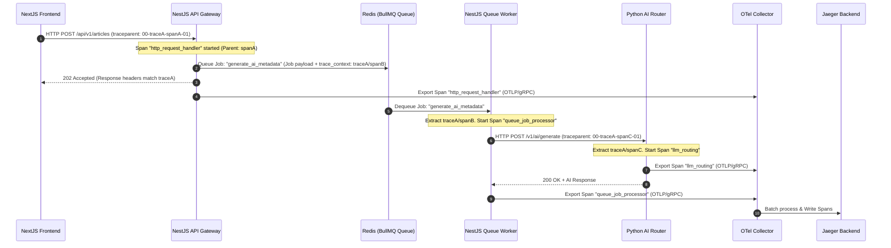
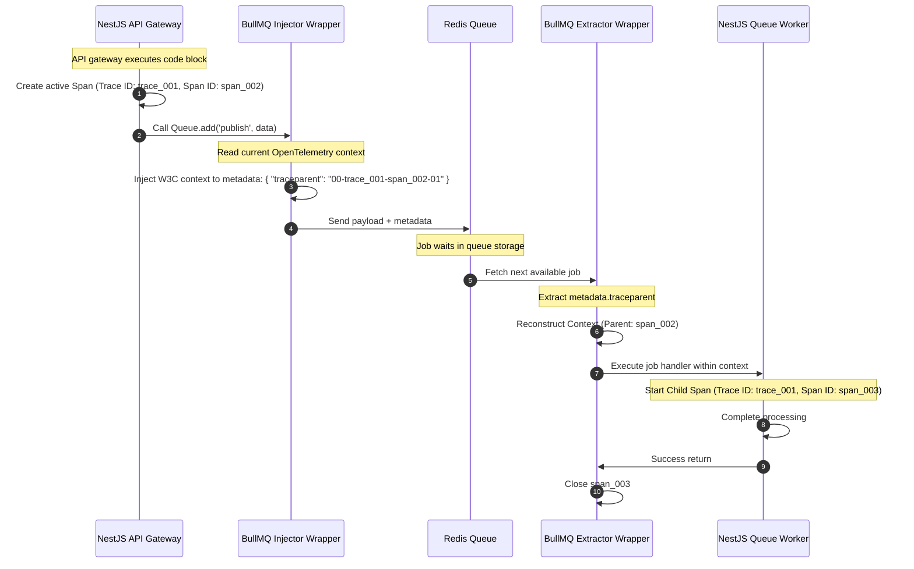

# Distributed Tracing Pipeline

## Purpose
This document specifies the design, implementation, and deployment configurations for the end-to-end distributed tracing pipeline within NewsOps Cloud. It outlines the OpenTelemetry (OTel) instrumentation configurations, context propagation protocols across service boundaries (NextJS frontend, NestJS API Gateway, BullMQ workers, and the Python-based AI Router), collector agent architectures, and Jaeger visualization settings.

## Executive Summary
Distributed tracing is vital to understanding runtime behaviors and execution dependencies across a distributed multi-tenant platform. By capturing the parent-child relationships of microservice invocations, engineers can diagnose bottlenecks and trace failure origins. Using OpenTelemetry APIs, every request is assigned a unique trace ID which is propagated using standard HTTP headers and metadata structures. Traces are exported via OpenTelemetry Protocol (OTLP) to local Collector agents, which format and write spans into a centralized Jaeger instance for indexing.

## Vision
The vision is to establish a unified tracing mesh where every digital publishing event—from a reader clicking "publish" on the Next.js web application to the Nest.js validation, the Bull.js execution queue, and the AI Router intelligence generation—is compiled into a single trace graph, enabling rapid performance auditing and sub-second isolation of application failures.

## Scope
This document covers:
1. **OpenTelemetry SDK Configurations**: Setup files for Node.js (NextJS, NestJS) and Python (AI Router) environments.
2. **Context Propagation Standards**: Intercepting and appending W3C Trace Context headers (`traceparent` and `tracestate`).
3. **Queue Context Mapping**: Custom wrappers passing trace context through BullMQ job payloads.
4. **OpenTelemetry Collector Manifests**: Configuring processors, pipelines, and exporters.
5. **Jaeger Visualization Architecture**: Docker/Kubernetes deployment configurations and backend storage settings.

It does not cover centralized metrics database sizing (covered in `grafana_dashboards.md`) or Loki log aggregation settings (covered in `logging_centralized.md`).

## Goals
- **Seamless Trace Continuity**: Ensure 100% trace continuity from web browsers through backend databases and queues.
- **Minimal Performance Overhead**: Limit tracing SDK CPU/latency overhead to $< 2.0\text{ ms}$ per request.
- **Optimized Storage FOOTPRINT**: Implement an intelligent sampling policy that captures 100% of errors but only 5% of healthy transactions in production.
- **Zero Configuration Setup**: Auto-instrument standard framework interfaces (HTTP, pg-pool, Redis, Winston) via OTel loaders.

## Functional Requirements
- **Automatic SDK Initialization**: OpenTelemetry SDK must initialize prior to application bootstrapping to intercept standard library loads.
- **W3C Header Conformance**: Propagate traces using standard W3C HTTP headers (`traceparent`).
- **BullMQ Context Injector/Extractor**:
  - *Injector*: Intercept BullMQ queue client additions, capturing the active span, and writing execution contexts into the job's `metadata` key.
  - *Extractor*: Intercept worker processes, extracting the context from job payloads, and initiating worker spans as child spans.
- **Span Attribute Enrichment**: Auto-tag spans with custom attributes: `tenant_id`, `environment`, `user_id`, and `db.system`.
- **Jaeger Query Interface**: Provide a visual interface searching by trace ID, service name, operation, tag values, and execution time bounds.

## Non-Functional Requirements
- **Trace Export Latency**: Spans must be exported from client applications to the OTel Collector in under 1 second.
- **Trace Ingestion SLA**: Collected spans must be searchable in Jaeger UI within 5 seconds of the transaction completion.
- **High Collector Availability**: Run OTel Collector agents as DaemonSets on every Kubernetes node to utilize low-latency localhost UDP/TCP loopback.

## Business Rules
- **Data Scrubbing**: Trace span attributes must never record raw password parameters, auth tokens (e.g. JWTs), or database credit card numbers.
- **Trace Data Retention**: Jaeger span indexes are retained in Elasticsearch storage for exactly 7 days before permanent purging.
- **Compliance Partitioning**: Trace analytics generated in the staging namespace must never mix with production collectors or storage engines.

## Actors
- **Application Developer**: Analyzes Jaeger trace graphs to identify slow database calls or execution deadlocks.
- **SRE / DevOps Engineer**: Adjusts trace sampling ratios and collector scaling rules to match cluster load profiles.
- **Support Operator**: Inputs a customer's request ID into the Jaeger search tool to identify exactly which internal service call failed.

## User Stories
- **User Story 1**: As an Application Developer, I want to trace an article generation request from the NextJS frontend to the AI Router backend so that I can analyze the exact latency breakdown between our database query and the external LLM invocation.
- **User Story 2**: As an SRE, I want the OpenTelemetry SDK to automatically extract the `tenant_id` context and attach it to every span so that I can analyze the performance footprint and trace logs of a single customer under load.
- **User Story 3**: As a DevOps Engineer, I want the BullMQ workers to link their jobs back to the original HTTP API Gateway request trace so that asynchronous background failures do not appear as disconnected, untraceable processes.

## Acceptance Criteria
- Tracing context must successfully survive the NextJS client to NestJS backend interface, maintaining a singular, unified `traceId`.
- The Node.js application must boot successfully using the OpenTelemetry bootstrap script without throwing dependency or import errors.
- BullMQ worker spans must be mapped as child spans using the extracted trace context from the Redis job data payload.
- The tracing collector must accept OTLP/gRPC spans on port `4317` and write them to the Jaeger endpoint.
- Span indexing must support queries filtering by `tenant_id` tag with results returned in $< 1.0\text{ second}$.

## Workflows
1. **Trace Propagation Across Service Mesh Workflow**:
   - A client initiates a publish event in the browser. NextJS injects a W3C trace context header: `traceparent: 00-4bf92f3577b34da6a3ce929d0e0e4736-00f067aa0ba902b7-01`.
   - The NestJS API Gateway extracts this header, registers the parent span, and starts a child span.
   - The Gateway adds a job to BullMQ. Before execution, a custom BullMQ interceptor extracts the active span ID and saves it to the job payload's `meta` property.
   - The BullMQ worker picks up the job. The worker's OpenTelemetry helper extracts the parent context from the job payload and initiates a new child span.
   - The worker makes an HTTP call to the AI Router (Python/FastAPI). The HTTP client injects the updated `traceparent` header.
   - The AI Router extracts the context, executes LLM inference, and wraps the execution steps in spans.
   - All spans are pushed asynchronously via OTLP to the OpenTelemetry Collector DaemonSet.



## API Design
Applications initialize tracing locally using a bootstrap script. The following configuration shows the setup code and collector definitions:

### 1. OpenTelemetry Node.js Bootstrap (`tracing-bootstrap.ts`)
```typescript
import { NodeSDK } from '@opentelemetry/sdk-node';
import { getNodeAutoInstrumentations } from '@opentelemetry/auto-instrumentations-node';
import { OTLPTraceExporter } from '@opentelemetry/exporter-trace-otlp-grpc';
import { W3CTraceContextPropagator } from '@opentelemetry/core';
import { Resource } from '@opentelemetry/resources';
import { SemanticResourceAttributes } from '@opentelemetry/semantic-conventions';

const opentelemetryExporter = new OTLPTraceExporter({
  url: process.env.OTEL_EXPORTER_OTLP_ENDPOINT || 'grpc://localhost:4317',
});

const sdk = new NodeSDK({
  resource: new Resource({
    [SemanticResourceAttributes.SERVICE_NAME]: process.env.OTEL_SERVICE_NAME || 'newsops-backend',
    [SemanticResourceAttributes.DEPLOYMENT_ENVIRONMENT]: process.env.NODE_ENV || 'production',
  }),
  traceExporter: opentelemetryExporter,
  textMapPropagator: new W3CTraceContextPropagator(),
  instrumentations: [
    getNodeAutoInstrumentations({
      '@opentelemetry/instrumentation-http': {
        enabled: true,
        ignoreIncomingPaths: ['/healthz', '/metrics'],
      },
      '@opentelemetry/instrumentation-pg': {
        enabled: true,
      },
      '@opentelemetry/instrumentation-redis': {
        enabled: true,
      }
    })
  ]
});

sdk.start();

process.on('SIGTERM', () => {
  sdk.shutdown()
    .then(() => console.log('Tracing SDK terminated successfully.'))
    .catch((error) => console.error('Error terminating Tracing SDK', error))
    .finally(() => process.exit(0));
});
```

### 2. OpenTelemetry Collector Pipeline Configuration (`otel-collector-config.yaml`)
```yaml
receivers:
  otlp:
    protocols:
      grpc:
        endpoint: 0.0.0.0:4317
      http:
        endpoint: 0.0.0.0:4318

processors:
  batch:
    timeout: 1s
    send_batch_size: 256
  memory_limiter:
    check_interval: 1s
    limit_percentage: 75
    spike_limit_percentage: 20

exporters:
  otlp/jaeger:
    endpoint: jaeger-collector.monitoring.svc.cluster.local:4317
    tls:
      insecure: true

service:
  pipelines:
    traces:
      receivers: [otlp]
      processors: [memory_limiter, batch]
      exporters: [otlp/jaeger]
```

## Database Design
Jaeger writes traces into an Elasticsearch storage cluster. Spans are written into indices partitioned by date:

### Elasticsearch Mappings for Jaeger Spans (`jaeger-span-YYYY-MM-DD` Index)
- `traceID`: keyword (stores the 16-byte/32-char hex string)
- `spanID`: keyword (stores the 8-byte/16-char hex string)
- `parentSpanID`: keyword
- `operationName`: keyword
- `serviceName`: keyword
- `startTime`: long (Unix epoch microseconds)
- `duration`: long (microseconds)
- `tags`: nested (Array of key-value attributes)
  - `key`: keyword
  - `value`: keyword
- `references`: nested (Defines parent/child links)
  - `refType`: keyword (e.g. `CHILD_OF`, `FOLLOWS_FROM`)
  - `traceID`: keyword
  - `spanID`: keyword

### Optimization Indexes
- `CREATE INDEX idx_jaeger_span_trace ON jaeger-span-partition (traceID);`
- `CREATE INDEX idx_jaeger_span_service_op ON jaeger-span-partition (serviceName, operationName, startTime DESC);`

## UI Design
Jaeger UI is embedded inside Grafana panels or loaded directly:
- **Search Panel**: Left rail filters for Service, Operation, Tags (e.g., `tenant_id=tenant-104`), Duration Min/Max, and Limit.
- **Trace Timeline Panel**: Renders chronological execution blocks showing span stack and execution sequences.
- **Span Detail Popover**: Triggers on click, displaying attributes (`db.statement`, `http.status_code`, `tenant_id`), client libraries used, and events logs.
- **Dependency Graph View**: A topology visualization automatically mapped from span parent-child relationships, showing inter-service connection lines and directional data flow.

## Permissions
Access controls restrict visibility of transaction traces:
- `traces:read`: Allows developers and support engineers to search, load, and view span graphs in Jaeger or Grafana. (Assigned to Application Developers and Operators).
- `traces:write`: Reserved for applications sending traces via OTLP protocol. Authentication is managed via API gateway authorization headers in the collector.
- `traces:admin`: Allows platform engineers to modify sampling limits, flush cache indexes, and configure external storage parameters.

## Security
- **Dynamic Context Scrubbing**: A custom processor on the OpenTelemetry Collector strips tags containing strings matching standard token headers or database fields like `password` or `accessToken`.
- **Collector Endpoint Authentication**: All applications outside the local Kubernetes cluster namespace must provide an authentication token matching the collector's gateway policy to emit spans.
- **TLS Client Verification**: Node SDKs communicate with the collector DaemonSet using localhost endpoints or TLS 1.3 tunnels with client validation.

## Performance
- **SDK Intercept SLA**: The interception hooks executed by `getNodeAutoInstrumentations` must complete in $< 0.8\text{ ms}$, adding negligible delay to request routing.
- **Adaptive Sampling Rules**:
  - All HTTP responses resulting in status codes $>= 400$ are sampled at 100%.
  - High-traffic public endpoints (e.g., article feeds) are sampled at 0.5%.
  - Write transactions (e.g., article publishing, payment updates) are sampled at 10%.
- **OTel Collector Limits**: Collector buffers are configured to drop traces if internal queues exceed `10000` spans under resource constraints, preventing collector OOM crashes.

## Monitoring
Telemetry Collector and Jaeger components are monitored in Prometheus using the following metrics:
- `otelcol_receiver_refused_spans`: Count of spans refused by the collector due to rate-limiting or schema violations.
- `otelcol_processor_dropped_spans`: Spans dropped by the processor (e.g., memory limiter triggers).
- `jaeger_collector_spans_saved_total`: Total count of spans indexed in Elasticsearch storage.

### Alerting Rules (Prometheus Alertmanager YAML)
```yaml
groups:
  - name: newsops-tracing-alerts
    rules:
      - alert: OTelCollectorMemoryHigh
        expr: otelcol_process_rss / otelcol_process_memory_limit * 100 > 90.0
        for: 5m
        labels:
          severity: warning
        annotations:
          summary: "OTel Collector memory limit exceeded 90%"
          description: "OTel collector agent running on node is about to hit its memory limits and start dropping spans."

      - alert: JaegerSpanWriteFailures
        expr: rate(jaeger_collector_save_err_total[5m]) > 0
        for: 2m
        labels:
          severity: critical
        annotations:
          summary: "Jaeger spans saving failing"
          description: "Jaeger collector is unable to write spans to the Elasticsearch storage backend. Target index is unresponsive."
```

## Logging
The OpenTelemetry SDK outputs configuration errors and connectivity issues in JSON format:
* **Log Pattern (Collector Connection Refused)**:
```json
{
  "timestamp": "2026-06-27T17:55:00.124Z",
  "level": "ERROR",
  "context": "OpenTelemetryNodeSDK",
  "message": "OTLP Trace Exporter failed to send spans to collector",
  "metadata": {
    "exporter_url": "grpc://localhost:4317",
    "error_code": "UNAVAILABLE",
    "details": "Connection refused by host. Is collector running?"
  }
}
```

## Error Handling
Tracing infrastructure handles failures defensively without interrupting the primary publisher platform operations:

| Internal Error Code | HTTP Status | Customer-Facing Message |
|:---|:---|:---|
| `ERR_TRACING_COLLECTOR_UNREACHABLE` | 500 Internal Error | The tracing agent is not responding to queries. Application traffic is unaffected. |
| `ERR_TRACE_CONTEXT_CORRUPTED` | 400 Bad Request | The trace context propagation header format is invalid or corrupted. |
| `ERR_JAEGER_STORAGE_FULL` | 507 Insufficient Storage | Span index writing failed due to disk space limitations on the database. |

## Edge Cases
- **Trace Loop recursion**: If tracing calls are routed to endpoints that themselves generate traces recursively, an infinite collection loop will occur. The SDK is configured to explicitly ignore endpoints containing `/metrics` and `/healthz`.
- **Clock Desynchronization**: If distributed nodes have minor clock skews, spans may render out of order in Jaeger timeline views (e.g. child span appearing to start before parent span). Jaeger queries automatically apply clock-skew correction algorithms, adjusting times based on trace context header timestamp offsets.
- **Orphaned Spans**: If a downstream service crashes during processing, its span will have no exit time. Jaeger handles this by applying a timeout threshold, terminating open spans after `30 seconds` and flagging them with an `error=timeout` attribute.

## Future Improvements
- **Grafana Tempo Integration**: Migrate Jaeger backend to Grafana Tempo, enabling seamless exploration of metrics, logs, and traces inside a single consolidated database.
- **Tail-Based Sampling Implementation**: Move sampling logic from application hosts to collector nodes (tail-based sampling). This will permit analysing the entire trace tree structure before choosing whether to discard it or commit it to storage based on error states or latency spikes.

## Mermaid Diagrams
The following sequence details how W3C Context propagation properties are injected and extracted across boundaries:



## References
- Centralized Logging Design: [logging_centralized.md](./logging_centralized.md)
- Grafana Dashboards Design: [grafana_dashboards.md](./grafana_dashboards.md)
- Security Compliance Policies: [gdpr_ccpa_compliance.md](../10-security/gdpr_ccpa_compliance.md)
- System Architecture Design: [system_architecture.md](../02-architecture/system_architecture.md)
