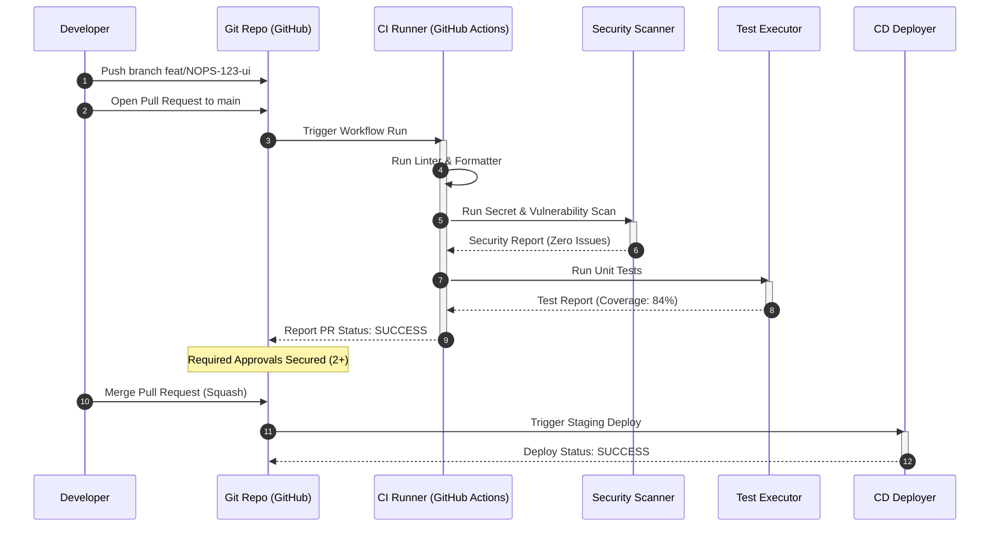

# Git Workflow and Deployment Policies

## Purpose
This document specifies the software development lifecycle policies, Git branching strategies, pull request requirements, code review criteria, and continuous integration (CI) checks for the NewsOps Cloud digital publishing platform. It establishes code quality standards and deployment gates to maintain codebase health and enable low-risk, high-frequency production releases.

## Executive Summary
To achieve rapid deployment velocity without compromising stability, NewsOps Cloud adopts a **Trunk-Based Development (TBD)** model. Developers work in short-lived feature branches created off the `main` branch, integrate changes daily, and rely on feature flags to decouple code delivery from feature releases. 
All changes enter the codebase via Pull Requests (PRs) that must pass automated tests, linting, dependency vulnerability scans, and structural reviews by at least two engineers. This workflow is enforced through repository settings and automated workflows, ensuring code safety and deployment readiness.

## Vision
To establish a fully automated CI/CD gating pipeline where code flows from local commit to production deployment in under 15 minutes, with zero manual intervention required for deployment verification.

## Scope
- Branch naming conventions and lifecycle rules.
- Trunk-based development practices and feature flagging.
- Pull request formats, templates, and review protocols.
- Automated CI pipeline checks (static analysis, testing, security).
- Branch protection policies and repository merging configurations.

## Goals
- **Daily Integration**: 100% of developers merge code to `main` at least once a day, eliminating long-lived feature branches.
- **Automated Gating**: Zero code merges without passing the CI pipeline.
- **Code Ownership Audit**: 100% of pull requests must be approved by designated code owners before merging.
- **Low Bug Escape Rate**: Keep post-release defect density under 0.1 bugs per KLOC.

## Functional Requirements
- **Trunk-Based Merges**: All developer feature branches must originate from `main` and return to `main`.
- **Merge Blockers**: The system must block pull request merges if automated unit tests, lint checks, or security scans fail.
- **Codeowner Notifications**: GitHub/GitLab must automatically request reviews from team members specified in the `CODEOWNERS` file.
- **Auto-Deletion**: Feature branches must be deleted automatically upon merging to keep the repository clean.

## Non-Functional Requirements
- **CI Execution Latency**: Automated validation checks must complete in under 5 minutes to prevent developer bottlenecks.
- **High Availability**: The Git repository hosting service and CI/CD runners must maintain 99.9% uptime.

## Business Rules
- **Linear Git History**: Repository merges must use the squash-and-merge approach to keep a clean, linear commit history.
- **Review SLA**: Pull requests must be reviewed or commented on within 4 hours of submission during working hours.
- **Production Gate**: Merges directly to `main` trigger an automated deployment to the Staging environment. Promotion to Production requires passing automated end-to-end (E2E) verification tests.

## Actors
- **Software Engineer**: Creates feature branches, writes code, submits pull requests, and reviews peer code.
- **Tech Lead / Code Owner**: Approves critical system changes, enforces design patterns, and oversees architecture consistency.
- **CI/CD System Agent**: Runs automated tests, evaluates security vulnerabilities, and manages deployment gates.

## User Stories
1. **As a Software Engineer**, I want to create a short-lived feature branch linked to a JIRA ticket, so that my work is focused, trackable, and easy to review.
2. **As a Tech Lead**, I want the system to block merges that drop test coverage below our 80% threshold, so that the team maintains codebase health.
3. **As a Site Reliability Engineer**, I want pull requests to require verification that database migrations are backward-compatible, preventing accidental database downtime.

## Acceptance Criteria
- **AC-1**: Feature branches must match the naming regex: `^(feat|fix|chore|refactor)/NOPS-[0-9]+-[a-z0-9-]+$`.
- **AC-2**: A pull request can only be merged if it has at least 2 approvals, including at least one code owner for the modified files.
- **AC-3**: Vulnerability scanners (Snyk/Trivy) must return zero critical or high-severity findings for the build to pass.
- **AC-4**: SonarQube quality gate verification checks must pass, ensuring zero security hotspots and low cognitive complexity scores.

## Workflows
### Pull Request Lifecycle & Gating Workflow
```
[Developer Local] ---> [Create Branch (feat/NOPS-123-ui)] ---> [Commit & Push]
                                                                     |
                                                                     v
[Main Branch] <--- [Merge: Squash & Merge] <--- [Approved (2+ reviews)] <--- [CI Checks Pass]
                                                                     ^
                                                                     | (If failed, block merge)
                                                             [Run CI Pipelines]
```

### Pull Request Sequence Steps
1. The developer pulls the latest changes from `main` and creates a local branch: `git checkout -b feat/NOPS-143-analytics-dashboard`.
2. The developer commits changes using semantic commit messages: `feat(analytics): add query performance graphs`.
3. The developer pushes the branch to the remote repository and opens a Pull Request.
4. The CI pipeline triggers automatically, running linting, formatting, security scanning, unit tests, and migration validation checks.
5. GitHub CODEOWNERS assigns reviewers based on the modified files.
6. Reviewers inspect the code, leave comments, and grant approvals once feedback is addressed.
7. Once all CI checks pass and approvals are secured, the author merges the PR using "Squash and Merge". The branch is deleted automatically.

### Pull Request Markdown Template (`.github/pull_request_template.md`)

```markdown
<!-- 
  ==============================================================================
  NewsOps Cloud Pull Request Template
  ==============================================================================
-->
## Description
Provide a clear description of the change, its purpose, and how to verify it.

Fixes Ticket: #NOPS-

## Type of Change
- [ ] Bug fix (non-breaking change fixing an issue)
- [ ] New feature (non-breaking change adding functionality)
- [ ] Breaking change (fix or feature requiring database schema or API contract changes)
- [ ] Documentation / Refactoring

## Gating Checklist
- [ ] My code follows the project style guidelines.
- [ ] I have written unit tests covering the new logic branches.
- [ ] Database migrations are backward-compatible (no columns deleted or renamed directly).
- [ ] Feature flags are implemented for unfinished changes.

## Verification Scenarios
Describe how to test changes manually (e.g., steps, payloads, curl statements).
```

### GitHub Actions CI Configuration (`.github/workflows/ci.yml`)

```yaml
# ==============================================================================
# File: ci.yml
# Path: .github/workflows/ci.yml
# Purpose: Continuous Integration Pipeline Gating for NewsOps Cloud
# ==============================================================================

name: Continuous Integration

on:
  pull_request:
    branches: [ main ]
  push:
    branches: [ main ]

jobs:
  validate:
    name: Code Quality & Security Validation
    runs-on: ubuntu-latest

    steps:
    - name: Checkout Repository
      uses: actions/checkout@v4
      with:
        fetch-depth: 0

    - name: Set up Node.js Environment
      uses: actions/setup-node@v4
      with:
        node-version: '20'
        cache: 'npm'

    - name: Install Project Dependencies
      run: npm ci

    - name: Verify Code Formatting & Linting
      run: npm run lint

    - name: Scan for Secret Leaks
      uses: trufflesecurity/trufflehog@main
      with:
        path: ./
        base: ${{ github.event.repository.default_branch }}
        head: HEAD

    - name: Run Test Suite with Coverage
      run: npm run test:coverage
      env:
        NODE_ENV: test
        JWT_SECRET_KEY: test-secret-key-32-chars-long-validation-must-pass

    - name: Validate Coverage Threshold (Min 80%)
      run: |
        COVERAGE=$(node -p "require('./coverage/coverage-summary.json').total.lines.pct")
        echo "Current line coverage: ${COVERAGE}%"
        if (( $(echo "$COVERAGE < 80" | bc -l) )); then
          echo "Error: Test coverage is below the required 80% threshold."
          exit 1
        fi

    - name: Run Vulnerability Scan on Dependencies
      uses: snyk/actions/node@master
      env:
        SNYK_TOKEN: ${{ secrets.SNYK_TOKEN }}
      with:
        args: --severity-threshold=high
```

## API Design

The Git provider webhooks trigger our deployment orchestrator. The orchestrator exposes endpoints to monitor commit deployment pipelines.

### Check Pipeline Gating Status
Retrieves current CI check run results for a specific commit hash.
- **Endpoint**: `GET /api/v1/ops/pipelines/status/:commit_sha`
- **Headers**:
  - `Authorization: Bearer <token>`
- **Response Payload (200 OK)**:
```json
{
  "commit_sha": "5a7f920268cb32fbc1209e9e9db6a8bca2321aa1",
  "branch": "feat/NOPS-143-analytics-dashboard",
  "status": "SUCCESSFUL",
  "checks": {
    "linter": "PASSED",
    "unit_tests": "PASSED",
    "security_scan": "PASSED",
    "db_migration": "PASSED"
  },
  "coverage": {
    "percentage": 84.7,
    "delta": "+1.2%"
  },
  "verifications": {
    "approvals_count": 2,
    "codeowner_approved": true
  }
}
```

## Database Design
To audit deployment quality metrics, the deployment pipeline database logs pull request statistics.

```sql
CREATE TABLE public.git_pipeline_metrics (
    id UUID NOT NULL DEFAULT gen_random_uuid(),
    pull_request_number INT NOT NULL,
    branch_name VARCHAR(255) NOT NULL,
    commit_sha VARCHAR(40) NOT NULL,
    author_username VARCHAR(100) NOT NULL,
    ci_duration_seconds INT NOT NULL,
    unit_test_coverage NUMERIC(5,2) NOT NULL,
    vulnerabilities_found INT NOT NULL DEFAULT 0,
    approvers VARCHAR(100)[] NOT NULL,
    merged_at TIMESTAMP WITH TIME ZONE NOT NULL DEFAULT NOW(),
    CONSTRAINT pk_git_pipeline_metrics PRIMARY KEY (id)
);

CREATE INDEX idx_pipeline_metrics_author ON public.git_pipeline_metrics (author_username);
CREATE INDEX idx_pipeline_metrics_merged ON public.git_pipeline_metrics (merged_at DESC);
```

## UI Design
The internal developer portal includes a "DevOps Metrics" screen:
- **Lead Time Dashboard**: Displays the average time it takes for code to go from first commit to production deployment.
- **Build Quality Grid**: Displays recent build statuses, test coverage trends, and security findings.
- **Branch Monitor**: Lists all active branches, alerting developers to any branch that has been open for more than 48 hours without a merge.

## Permissions
Repository access rules enforce the following RBAC definitions:
- `git:repo:read`: View code, issues, and pull request statuses.
- `git:repo:write`: Push branches and submit pull requests.
- `git:repo:admin`: Modify branch protection rules, delete repositories, and manage deployment secrets.

## Security
- **Secret Scanning**: Pre-push hooks and CI checks use GitGuardian/Trufflehog to scan for committed secrets, credentials, or keys, blocking the push if any are found.
- **Signed Commits**: Git rules require all commits to be GPG-signed to verify the developer's identity.
- **Branch Protection**: Direct pushes to `main` are disabled for all users, including administrators, to prevent bypassing security gates.

## Performance
- **Parallel Testing**: Test runners split unit test suites across parallel containers, keeping total execution times under 3 minutes.
- **Dependency Caching**: Node modules, Go modules, and Python packages are cached across pipeline runs to speed up build preparation steps.

## Monitoring
- **Prometheus Metrics**:
  - `newsops_pipeline_build_duration_seconds`: Time taken for the pipeline to execute.
  - `newsops_pipeline_failure_total`: Counter tracking failed build attempts.
  - `newsops_pipeline_coverage_percentage`: Code coverage metrics.
- **Alert Rules**:
  - **PipelineFailureSpike**: Alert if more than 3 consecutive builds on `main` fail. Action: Page the on-duty release engineer.

## Logging
The CI runner prints structured logs for each check phase.

```json
{
  "timestamp": "2026-06-27T22:50:00.123Z",
  "level": "INFO",
  "phase": "TEST_RUNNER",
  "message": "Unit tests execution completed successfully",
  "details": {
    "total_tests": 412,
    "passed": 412,
    "failed": 0,
    "coverage": 84.7,
    "duration_ms": 112500
  }
}
```

## Error Handling
| CI Error | HTTP Status / Gate Status | Failure Cause | Resolution |
|---|---|---|---|
| `ERR_CI_LINT_FAILURE` | Gated Block | Code formatting rules violated. | Run `npm run lint:fix` or local linter formatter before committing. |
| `ERR_CI_COVERAGE_DROP` | Gated Block | Test coverage drops below 80% limit. | Write unit tests for new logic branches. |
| `ERR_CI_MIGRATION_UNSAFE`| Gated Block | Database migration is not backward-compatible. | Refactor migration (e.g., split table alterations into multiple releases). |

## Edge Cases
- **Hotfix Gating**: During production incidents, hotfixes need to bypass standard review cycles. The workflow manages this by requiring a specific branch prefix: `hotfix/NOPS-*`. This prefix permits merging with a single Tech Lead approval, but still requires all automated CI tests to pass.
- **Dependency Version Conflicts**: If a dependency update breaks compatibility, the build is blocked. Developers must resolve the version conflict locally and push the updated lockfiles to pass the security and build steps.

## Future Improvements
- **Automated Canary Testing**: Connect the Git release flow to our Kubernetes traffic manager, automatically routing 5% of live traffic to the new version upon merge to `main` to verify real-world behavior before a full rollout.

## Mermaid Diagrams

### CI/CD Gating Pipeline Sequence



## References
- [Disaster Recovery System Architecture](../02-architecture/disaster_recovery.md)
- [Environment Variables Inventory](./environment_variables.md)
- [Infrastructure as Code (IaC) Architecture](./infrastructure_as_code.md)
