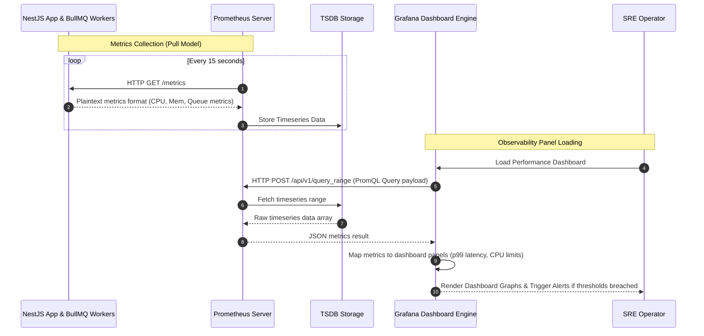

# Grafana Dashboards Design

## Purpose
This document defines the architecture, visual panel layouts, JSON provisioning templates, and Alertmanager configurations for the centralized observability dashboards within the NewsOps Cloud platform. It provides operators, platform engineers, and support engineers with the mechanisms to monitor system health, database latency, API throughput, and background job processing rates in real time.

## Executive Summary
NewsOps Cloud operates as a high-throughput, multi-tenant digital publishing platform. Visualizing its state is critical to satisfying Service Level Agreements (SLAs). Observability is achieved by scraping metrics from microservices using Prometheus and visualizing them on dashboards provisioned declaratively in Grafana. This document details three primary dashboards:
1. **System Infrastructure Dashboard**: Visualizes CPU, memory, and container-level resource utilization.
2. **API & Database Performance Dashboard**: Charts request throughput, response codes, HTTP latency percentiles, and PostgreSQL query execution duration.
3. **Queue Processing Dashboard**: Tracks BullMQ worker throughput, failure ratios, job wait times, and active worker counts.

Each dashboard is designed to be provisioned programmatically using JSON configurations, eliminating manual dashboard construction.

## Vision
The vision is to establish a self-healing, zero-manual-setup observability environment where all dashboards are treated as code (GitOps). When new microservices are registered, matching dashboards and panels are automatically instantiated to guarantee 100% visibility into system performance and database health.

## Scope
This document covers:
1. **JSON Provisioning Dashboard Configurations**: Complete structures for panels, rows, targets, and variables.
2. **PromQL Query Definitions**: Metrics-level details for CPU, memory, API latency (p50, p90, p99), DB connection counts, and queue statistics.
3. **Alert Thresholds**: Alertmanager criteria mapped to panels to trigger warnings and critical notifications.
4. **Access Control**: Roles and namespaces separating admin access from read-only operator access.

It does not cover application log indexing (covered in `logging_centralized.md`) or distributed tracing spans (covered in `distributed_tracing.md`).

## Goals
- **Declarative Observability**: 100% of Grafana dashboards managed as JSON definitions within the Git repository.
- **Fast Render Times**: Average dashboard loading latency $< 1.5\text{ seconds}$ for a 24-hour query interval.
- **High Panel Precision**: Zero interpolation gaps for metrics scraped at 15-second intervals.
- **Low Fatigue Alerts**: Specific, duration-bound alert thresholds to minimize false positive pages.

## Functional Requirements
- **Dynamically Scoped Dashboards**: Filters for `environment` (production, staging), `namespace`, `tenant_id`, and `pod` via Grafana template variables.
- **Resource Utilization Panels**: Real-time display of CPU cores used vs. requests/limits, and memory bytes used vs. limits.
- **API Performance Panels**: Throughput rate (req/sec), status code distribution (2xx, 3xx, 4xx, 5xx), and Latency Percentiles (p50, p90, p99) derived from Prometheus histograms.
- **Database Telemetry Panels**: Query latency, active/idle connection pools, read/write transaction ratios, and replication lag.
- **BullMQ Telemetry Panels**: Total jobs processed, job failure rate per queue, queue depth (waiting jobs), and job latency (time from insertion to completion).

## Non-Functional Requirements
- **Dashboard Synchronization**: Changes pushed to the master git branch must sync to Grafana in under 30 seconds via Grafana Sidecar.
- **Display Resolution**: Optimization for a minimum grid layout of 24 columns, ensuring panels scale responsively on standard developer monitors.
- **Data Retention Integration**: Support seamless querying of historical data from Thanos long-term storage up to 90 days back.

## Business Rules
- **Immutable Production Dashboards**: Direct modifications in the Grafana UI on production instances are disabled; dashboards must be provisioned via Git.
- **Audit Logging**: Any manual access, session login, or temporary dashboard creation must be recorded in the audit trail.
- **Multi-Tenant Data Masking**: Shared dashboards must not expose customer-specific data in variable drop-downs, limiting access based on the user's organization scope.

## Actors
- **Site Reliability Engineer (SRE)**: Manages Prometheus scrape targets, updates JSON dashboard definitions, and configures alerting channels.
- **Support Engineer**: Uses the API and Queue dashboards to identify which tenant is experiencing delay or queue bottlenecks.
- **Application Developer**: Adds new dashboard panels to correspond with new feature releases or additional BullMQ workers.

## User Stories
- **User Story 1**: As an SRE, I want the dashboards to be generated automatically during deployment so that I do not have to manually build UI components when setting up a new region.
- **User Story 2**: As a Support Engineer, I want to filter the API gateway dashboard by `tenant_id` so that I can verify if a customer's report of slow response times corresponds with an actual spike in their p99 latency panel.
- **User Story 3**: As a Platform Developer, I want to monitor the processing speed of the AI background worker queue on a dedicated panel so that I can see if the queue is growing faster than the workers can execute.

## Acceptance Criteria
- Dashboards must load correctly using standard variables: `datasource`, `environment`, `namespace`, and `tenant_id`.
- The latency panels must use the Prometheus metric `http_request_duration_seconds_bucket` and perform `histogram_quantile` calculations.
- CPU usage panels must show container usage against the pod's declared Kubernetes CPU limit line.
- An alert must fire if the p99 response time for any endpoint exceeds `2000ms` for more than 3 consecutive minutes.
- The BullMQ panels must display the actual rate of failed jobs using `rate(bullmq_jobs_failed_total[5m])` and alert if it exceeds 5%.

## Workflows
1. **Declarative Dashboard Provisioning Workflow**:
   - An SRE updates a dashboard JSON file in `/infra/grafana/dashboards/`.
   - The code is merged into the main branch.
   - The ArgoCD continuous delivery controller detects the change and updates the ConfigMap in Kubernetes.
   - The Grafana dashboard sidecar detects the ConfigMap update, reads the JSON content, and updates the dashboard via Grafana's local folder API.

2. **Metrics Fetching and Panel Rendering Workflow**:
   - Prometheus scrapes metrics endpoints (`/metrics`) from NestJS microservices and the NestJS BullMQ queue exporters every 15 seconds.
   - A Support Engineer opens the NewsOps Cloud Performance Dashboard in their browser.
   - The browser sends query requests to the Grafana API Gateway containing variables for `tenant_id` and `time_range`.
   - Grafana translates the query variables into PromQL and sends the query payload to Prometheus.
   - Prometheus returns the timeseries dataset, and Grafana renders the panel charts.

## API Design
Grafana dashboards are managed programmatically via the Grafana HTTP API. The following endpoints are utilized by deployment runners:

### Import / Create Dashboard
* **URL**: `/api/dashboards/db`
* **Method**: `POST`
* **Headers**:
  * `Authorization: Bearer <API_TOKEN>`
  * `Content-Type: application/json`
* **Request Payload**:
```json
{
  "dashboard": {
    "id": null,
    "uid": "infra-system-metrics",
    "title": "System Infrastructure Monitoring",
    "tags": ["templated", "infrastructure"],
    "timezone": "browser",
    "schemaVersion": 36,
    "version": 1,
    "refresh": "15s",
    "variables": {
      "list": [
        {
          "name": "environment",
          "type": "datasource",
          "query": "prometheus",
          "label": "Environment"
        },
        {
          "name": "namespace",
          "type": "query",
          "query": "label_values(kube_pod_info, namespace)",
          "datasource": "${environment}"
        }
      ]
    },
    "panels": [
      {
        "id": 1,
        "type": "timeseries",
        "title": "Container CPU Usage vs Limits",
        "gridPos": {
          "x": 0,
          "y": 0,
          "w": 12,
          "h": 8
        },
        "targets": [
          {
            "expr": "sum(rate(container_cpu_usage_seconds_total{namespace=\"$namespace\"}[5m])) by (pod)",
            "legendFormat": "{{pod}} CPU Usage",
            "refId": "A"
          },
          {
            "expr": "sum(kube_pod_container_resource_limits{resource=\"cpu\",namespace=\"$namespace\"}) by (pod)",
            "legendFormat": "{{pod}} CPU Limit",
            "refId": "B"
          }
        ]
      },
      {
        "id": 2,
        "type": "timeseries",
        "title": "Container Memory Usage vs Limits",
        "gridPos": {
          "x": 12,
          "y": 0,
          "w": 12,
          "h": 8
        },
        "targets": [
          {
            "expr": "sum(container_memory_working_set_bytes{namespace=\"$namespace\"}) by (pod)",
            "legendFormat": "{{pod}} Memory Used",
            "refId": "A"
          },
          {
            "expr": "sum(kube_pod_container_resource_limits{resource=\"memory\",namespace=\"$namespace\"}) by (pod)",
            "legendFormat": "{{pod}} Memory Limit",
            "refId": "B"
          }
        ]
      }
    ]
  },
  "overwrite": true,
  "folderId": 0
}
```
* **Response Payload (200 OK)**:
```json
{
  "id": 104,
  "slug": "system-infrastructure-monitoring",
  "status": "success",
  "uid": "infra-system-metrics",
  "url": "/d/infra-system-metrics/system-infrastructure-monitoring",
  "version": 1
}
```

## Database Design
Grafana stores dashboard definitions, metadata, users, permissions, and organization states in an internal PostgreSQL database named `grafana_core`. The relevant schema tables configured for NewsOps are described below:

### `dashboard` Table
* `id`: BIGINT (Primary Key)
* `version`: INT
* `slug`: VARCHAR(255)
* `title`: VARCHAR(255)
* `data`: TEXT (Contains the full dashboard JSON config block)
* `org_id`: BIGINT (Foreign Key to Organization, indexing isolates tenant dashboards)
* `created`: TIMESTAMP
* `updated`: TIMESTAMP
* `uid`: VARCHAR(40) (Indexed, unique identifier across platform deployments)

### `dashboard_provisioning` Table
Ensures dashboards deployed via config files cannot be overwritten manually.
* `id`: BIGINT (Primary Key)
* `dashboard_id`: BIGINT (Foreign Key referencing dashboard)
* `name`: VARCHAR(255) (Name of the provisioner config block)
* `external_id`: VARCHAR(255) (Identifier in GitOps config mapping)
* `updated`: INT

### Schema Indexes
- `CREATE UNIQUE INDEX idx_dashboard_uid ON dashboard(uid);`
- `CREATE INDEX idx_dashboard_org_id ON dashboard(org_id);`
- `CREATE UNIQUE INDEX idx_dashboard_provisioning_dashboard_id ON dashboard_provisioning(dashboard_id);`

## UI Design
The NewsOps Observability Interface features three dashboard view layouts in the Grafana UI:

### 1. System Infrastructure Dashboard
- **Top Row**: Variable selectors (`Environment`, `Namespace`, `Pod`). Single stat panels showing Cluster Node Count, Total Pod Count, Pod Restarts (24h).
- **Middle Row**: Dual Time-Series Panels. Left: CPU usage vs. container CPU request & limit lines. Right: Memory usage vs. container memory limits.
- **Bottom Row**: Storage IOPS, Network In/Out (throughput in MB/s), and Disk capacity percentages.

### 2. API Gateway & Database Performance Dashboard
- **Top Row**: Dynamic variables selector (`Environment`, `Tenant_ID`). Metric summary panels: Active API requests count, HTTP 5xx error counter, DB transaction rate.
- **Middle Row**: API Throughput (req/sec) categorized by HTTP status code (200, 201, 400, 401, 403, 500). Right panel: Quantile Latency (p50, p90, p99) overlay.
- **Bottom Row**: PostgreSQL connection counts (active, idle, max capacity) and Database Query Latency panel (tracking slow queries in milliseconds).

### 3. BullMQ Job Queue Dashboard
- **Top Row**: Variable selectors (`Queue_Name`, `Worker_Pod`). Summary metrics showing: Active Jobs, Completed Jobs (24h), Failed Jobs (24h), and Average Wait Time (sec).
- **Middle Row**: Job Processing Latency (time in milliseconds from active to completed). Right panel: Queue Depth stack (comparing waiting jobs, delayed jobs, and active jobs).
- **Bottom Row**: Worker performance panel charting memory consumption and CPU usage per worker process.

## Permissions
Access control is implemented via Grafana's Integration with Keycloak OAuth2:
- `dashboards:admin`: Permits creation, editing, deletion of dashboard configurations, datasource modifications, and system organization provisioning. (Assigned to Platform/SRE teams).
- `dashboards:editor`: Permits editing dashboard layouts within a specific organization namespace but restricts global configurations. (Assigned to Core Application Developers).
- `dashboards:viewer`: Read-only access to all metrics and visual layouts. No ability to save changes or access datasource settings. (Assigned to Support Operators and QA).

## Security
- **Variable Injection Prevention**: Variables using PromQL queries must utilize regex escaping to prevent malicious label injection. All variables are scrubbed.
- **Datasource Isolation**: Grafana dashboards use read-only database connections when querying timeseries datasources. Direct SQL execution against the primary PostgreSQL database is blocked.
- **Content Security Policy (CSP)**: The dashboard interface runs with CSP headers configured to prevent Cross-Site Scripting (XSS) and embedding Grafana in unauthorized iframes.
- **TLS 1.3 Enforcement**: All connections between the browser client, Grafana, and Prometheus are encrypted using TLS 1.3 with secure cipher suites.

## Performance
- **Query Caching**: Enable Grafana's query cache for Prometheus queries, caching results for 1 minute for dashboard refreshes.
- **Scrape Interval Alignment**: Dashboard queries utilize a step value aligned with the Prometheus scrape interval (`15s`) to prevent rendering empty buckets or redundant calculations.
- **Maximum Data Points**: Limit maximum data points per timeseries panel to `1500` to optimize SVG rendering performance in client browsers.
- **Latency SLAs**:
  - Prometheus query performance target: p90 $< 250\text{ ms}$.
  - Dashboard load latency target: p95 $< 1.5\text{ s}$ on standard connections.

## Monitoring
Grafana self-monitoring is performed using metrics scraped from Grafana's own `/metrics` endpoint:
- `grafana_api_request_duration_seconds`: Histogram of API requests to Grafana.
- `grafana_stat_totals_dashboards`: Total number of loaded dashboards.
- `grafana_datastore_query_duration_seconds`: Performance of Grafana's internal PostgreSQL database.

### Alerting Rules (Prometheus Alertmanager YAML)
```yaml
groups:
  - name: newsops-platform-infra-alerts
    rules:
      - alert: ContainerCPUUsageCritical
        expr: sum(rate(container_cpu_usage_seconds_total{container!=""}[5m])) by (pod, namespace) / sum(kube_pod_container_resource_limits{resource="cpu"}) by (pod, namespace) > 0.85
        for: 5m
        labels:
          severity: critical
        annotations:
          summary: "Pod {{ $labels.pod }} CPU usage is critical"
          description: "CPU usage for container on pod {{ $labels.pod }} in namespace {{ $labels.namespace }} has exceeded 85% of limit for 5 minutes."

      - alert: APIHighErrorRate
        expr: sum(rate(http_requests_total{status=~"5.."}[5m])) / sum(rate(http_requests_total[5m])) * 100 > 5.0
        for: 2m
        labels:
          severity: page
        annotations:
          summary: "API Error rate is above 5%"
          description: "High error rate detected. HTTP 5xx responses represent {{ $value | printf \"%.2f\" }}% of overall traffic in the last 5 minutes."

      - alert: BullMQQueueBacklogCritical
        expr: bullmq_queue_waiting_jobs_total > 5000
        for: 10m
        labels:
          severity: warning
        annotations:
          summary: "BullMQ queue backlog is critical"
          description: "The queue has {{ $value }} waiting jobs. Backlog has exceeded 5000 items for over 10 minutes."
```

## Logging
Grafana logs system events in JSON format, which are forwarded to Loki:
* **JSON Log Format (Database Connection Error)**:
```json
{
  "t": "2026-06-27T17:50:00.123Z",
  "level": "error",
  "msg": "Failed to connect to internal datastore",
  "subsystem": "sqlstore",
  "error": "dial tcp 10.244.2.14:5432: i/o timeout",
  "retry_attempt": 3
}
```
* **JSON Log Format (Dashboard Provisioned)**:
```json
{
  "t": "2026-06-27T17:50:15.546Z",
  "level": "info",
  "msg": "Dashboard provisioned successfully from configuration file",
  "subsystem": "provisioning",
  "path": "/etc/grafana/provisioning/dashboards/infra-system-metrics.json",
  "uid": "infra-system-metrics"
}
```

## Error Handling
The dashboard API maps execution and database retrieval errors to standard HTTP response structures:

| Internal Error Code | HTTP Status | Customer-Facing Message |
|:---|:---|:---|
| `ERR_GRAFANA_DATASOURCE_TIMEOUT` | 504 Gateway Timeout | The Prometheus datasource did not respond within the allocated time. |
| `ERR_DASHBOARD_JSON_INVALID` | 400 Bad Request | The dashboard JSON payload contains syntax errors or invalid panel configurations. |
| `ERR_UNAUTHORIZED_DASHBOARD_ACCESS` | 403 Forbidden | You do not have permissions to view or edit dashboards in this organization. |

## Edge Cases
- **Prometheus Scrape Failure**: If Prometheus fails to scrape microservice instances, Grafana panels display "No Data". The panels are configured to render gaps as null rather than zero, preventing incorrect dips in charts.
- **GitOps Lockouts / Conflicts**: When dashboard changes are made concurrently in the Git repository and manual overrides are attempted in the UI, the provisioning daemon enforces file state, instantly overwriting UI changes at the next sync loop (every 30 seconds).
- **Out of Memory (OOM) on Large Query Ranges**: Querying a 90-day time range with 15-second data resolution can crash the Grafana engine or Prometheus datasource. Grafana limits the maximum interval steps to `10000` data points per query, automatically downsampling long range queries.

## Future Improvements
- **Grafana Mimir Integration**: Transitioning to Grafana Mimir to support multi-tenant query isolation and high-availability long-term metrics storage.
- **Dynamic Worker Auto-scaling based on Grafana Metrics**: Using Kubernetes Event-driven Autoscaling (KEDA) to scale BullMQ worker replicas directly from PromQL metrics, matching worker counts to active job backlogs.

## Mermaid Diagrams
The following sequence diagram details the telemetry collection pipeline, showcasing how metrics flow from pods to Prometheus, and eventually render in Grafana:



## References
- System Architecture Design: [system_architecture.md](../02-architecture/system_architecture.md)
- Scaling and High Availability: [scaling_and_ha.md](../02-architecture/scaling_and_ha.md)
- Centralized Logging Configuration: [logging_centralized.md](./logging_centralized.md)
- Distributed Tracing Configuration: [distributed_tracing.md](./distributed_tracing.md)
