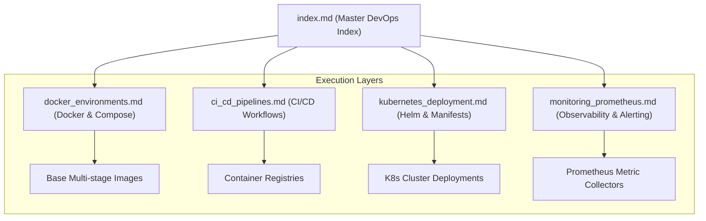

# DevOps & Infrastructure Index
## Purpose
This document serves as the master index and navigational map for the `11-devops` directory within the NewsOps Cloud digital publishing operating system's technical documentation. It provides a cohesive overview of containerization strategies, automated continuous integration/deployment (CI/CD) pipelines, Kubernetes orchestration structures, and Prometheus-based observability architectures.

## Executive Summary
The DevOps architecture for NewsOps Cloud is built to sustain high-velocity, reliable, and secure software deliveries. It defines the standardized environments that run the NestJS modular monolith backend and the Next.js digital publishing frontend. The directory contains:
- **Docker Environments** (`docker_environments.md`): Multi-stage, production-optimized container definitions and local orchestrations.
- **CI/CD Pipelines** (`ci_cd_pipelines.md`): GitHub Actions specifications for automated validation, security checks, and registry publishing.
- **Kubernetes Deployment** (`kubernetes_deployment.md`): Helm charts and resource manifests for elastic scaling, zero-downtime routing, and secret management.
- **System Observability** (`monitoring_prometheus.md`): Custom scraping configs, telemetry schemas, and alerting rules for application performance monitoring.

Together, these assets form a self-healing infrastructure framework designed to ensure that code changes move from local staging to production clusters with absolute safety and minimal latency.

## Vision
The long-term vision is a completely declarative GitOps-driven deployment paradigm. By abstracting environments into infrastructure-as-code files and container definitions, NewsOps Cloud aims to enable automated rollbacks, dynamic canary releases, and unified telemetry that correlates code performance directly to infrastructure cost metrics.

## Scope
The scope of the DevOps documentation directory covers:
- **Containerization**: Production-ready multi-stage `Dockerfiles` for Next.js and NestJS, including development orchestrations.
- **Pipelines**: Automation specifications for linting, testing, image building, and semantic versioning.
- **Orchestration**: K8s configurations (Helm, deployments, services, ingresses, and secret integration).
- **Monitoring**: Metrics instrumentation standards, scraping designs, and alert-trigger thresholds.

It excludes raw infrastructure provisioning scripts (e.g., Terraform/OpenTofu files), cloud provider VPC networking topologies, and generic operating system hardening steps.

## Goals
- **Environmental Consistency**: Guarantee that development, staging, and production environments are functionally equivalent through identical container base layers.
- **Automation First**: Eliminate all manual deployment steps, ensuring all releases are initiated via verified Git commits.
- **Zero-Downtime Releases**: Support continuous delivery through rolling updates, readiness/liveness probes, and connection pooling.
- **Proactive Observability**: Achieve a target resolution time of $< 5$ minutes for infrastructure anomalies by maintaining detailed alerts and metrics dashboards.

## Functional Requirements
- **Local Sandbox Mapping**: Developers must be able to bootstrap the entire Next.js, NestJS, Postgres, and Redis stack locally with a single CLI command (`docker compose up`).
- **Dynamic CI Checks**: The CI pipeline must run linting, unit testing, and vulnerability scans automatically on every pull request.
- **Declarative Helm Packaging**: The Kubernetes deployment configurations must be packaged as parameterized Helm charts to support multiple tenant-specific staging environments.
- **Real-Time Instrumentation**: The core backend must export Prometheus metrics detailing queue latency, database connection counts, and API response distributions.

## Non-Functional Requirements
- **Docker Image Footprint**: Next.js and NestJS production container images must not exceed $150\text{ MB}$ (using Alpine/distroless bases).
- **CI Build Duration**: The automated CI suite (lint, test, build) must complete in $< 8$ minutes to prevent developer pipeline blocking.
- **Cluster Deployment Rollout**: Rolling updates on Kubernetes must execute within $< 3$ minutes, sustaining 0 dropped HTTP connections.
- **Scrape Latency overhead**: Prometheus scraping must consume $< 1\%$ of CPU resources per application node at a 15-second frequency.

## Business Rules
- **Registry Compliance**: No container image may be deployed to production unless it has been scanned for critical CVEs and signed using CoSign.
- **Main Branch Protection**: Direct commits to the `main` branch are strictly blocked. Deployments can only originate from approved pull requests passing all CI checks.
- **Secret Separation**: Under no circumstances may raw passwords, JWT secrets, or DB credentials be stored in git repositories. Production credentials must be resolved dynamically at runtime using external secret operators.

## Actors
- **DevOps Engineer**: Configures pipelines, Helm charts, and cluster routing models.
- **Site Reliability Engineer (SRE)**: Defines prometheus configurations, monitors cluster health, and tunes auto-scaling rules.
- **Backend Developer**: Writes NestJS logic, monitors local Docker container runs, and views application logs.
- **Frontend Developer**: Coordinates Next.js container variables, optimizes client builds, and traces web vitals.

## User Stories
- **User Story 1**: As a Backend Developer, I want to execute a single compose script locally so that I can run the complete NewsOps Cloud system with Postgres and Redis on my workstation with hot-reloading enabled.
- **User Story 2**: As a DevOps Engineer, I want the CI pipeline to run automated security audits on our container images so that we do not deploy libraries with known vulnerabilities into production.
- **User Story 3**: As an SRE, I want Prometheus to automatically collect queue-lag metrics so that our scaling policies can spawn additional worker pods before clients experience delays.

## Acceptance Criteria
- Running `docker compose up` must bootstrap NestJS (with hot reload), Next.js, PostgreSQL (with schema migration), and Redis within $90$ seconds on a standard engineering workstation.
- Any container image containing a `CRITICAL` or `HIGH` severity CVE (evaluated by Trivy) must fail the build pipeline and block artifact registration.
- Helm deployments must complete with zero dropped packets, verified by a synthetic HTTP testing suite querying the gateway during a rolling update.

## Workflows
### Core Deployment Lifecycle Workflow
1. **Local Run**: Developer runs local environments via `docker-compose.dev.yml` to write and test code.
2. **Commit & Push**: Developer pushes a feature branch to GitHub, triggering the CI Action (`ci_cd_pipelines.md`).
3. **Validate**: CI runs tests, lints code, audits dependencies, and runs container vulnerability scanning.
4. **Publish**: Upon merging to `main`, the CD pipeline builds multi-stage Docker images (`docker_environments.md`) and publishes them to the container registry.
5. **Orchestrate**: The CD pipeline updates the Helm release values, prompting Kubernetes (`kubernetes_deployment.md`) to perform a rolling update.
6. **Observe**: Prometheus (`monitoring_prometheus.md`) scrapes the newly deployed pods, monitoring queue latency and memory utilization.

```
+------------------+     +------------------+     +--------------------+
| Local Dev        | --> | CI Pipeline      | --> | Container Registry |
| (Docker Compose) |     | (GitHub Actions) |     | (Docker Images)    |
+------------------+     +------------------+     +--------------------+
                                                           |
                                                           v
+------------------+     +------------------+     +--------------------+
| Prometheus       | <-- | Kubernetes Pods  | <-- | Helm Release CD    |
| (Scraping/Alert) |     | (Orchestration)  |     | (ArgoCD/Helm Update|
+------------------+     +------------------+     +--------------------+
```

## API Design
The DevOps tooling exposes a Management API endpoint hosted on a designated administrative port (`:8081/admin`) inside the NestJS container. This isolates DevOps control metrics from the public gateway.

### Health Check Endpoint
* **URL**: `http://localhost:8081/admin/health`
* **Method**: `GET`
* **Response Payload (200 OK)**:
```json
{
  "status": "healthy",
  "timestamp": "2026-06-27T17:15:00Z",
  "services": {
    "database": {
      "status": "up",
      "latencyMs": 3
    },
    "redis": {
      "status": "up",
      "latencyMs": 1
    },
    "queues": {
      "status": "active",
      "lagSeconds": 0
    }
  },
  "version": "1.8.4"
}
```

### Prometheus Config Reload Trigger
Enables SRE tools to prompt the internal metrics registry to flush/refresh active metadata.
* **URL**: `http://localhost:8081/admin/metrics/reload`
* **Method**: `POST`
* **Response Payload (202 Accepted)**:
```json
{
  "status": "reload_initiated",
  "activeRegistry": "PrometheusDefault",
  "scrapedCounters": 42
}
```

## Database Design
While DevOps configuration is primarily declarative infrastructure-as-code, deployment tracking uses tables in the primary database's `public` administrative schema.

### `deployment_manifests` Table
Tracks version releases and deployments.
- `id`: UUID (Primary Key)
- `version`: VARCHAR(50) (Indexed)
- `commit_sha`: VARCHAR(40)
- `environment`: VARCHAR(20) (e.g. 'staging', 'production')
- `deployed_by`: VARCHAR(100)
- `deployed_at`: TIMESTAMP WITH TIME ZONE
- `helm_release_name`: VARCHAR(100)

### `node_health_logs` Table
Logs short-term health histories scanned by the administrative system.
- `id`: BIGSERIAL (Primary Key)
- `pod_name`: VARCHAR(100) (Indexed)
- `cpu_utilization`: NUMERIC(5,2)
- `memory_bytes`: BIGINT
- `recorded_at`: TIMESTAMP WITH TIME ZONE

## UI Design
Monitoring dashboards are structured in Prometheus/Grafana:
- **Deployment Status Panel**: Timelines showing deployments plotted alongside service availability indicators.
- **Service Mesh Latency Visualizer**: Flow arrows color-coded by response time (green $<100\text{ ms}$, yellow $100\text{-}250\text{ ms}$, red $>250\text{ ms}$).
- **Vulnerability Heatmap**: Multi-tier grid highlighting CVE distributions across active production containers.

## Permissions
Access to deployment tools and management APIs is secured via RBAC:
- `devops:deploy`: Authorizes launching Helm charts and updating registries.
- `devops:read`: Authorizes reading cluster metrics, logs, and configuration maps.
- `devops:configure`: Authorizes altering environment secret mappings and pipeline parameters.

## Security
- **Least Privilege Execution**: Docker containers run as non-root users (`node` or custom uid `10001`).
- **Network Boundaries**: Administrative API endpoints are restricted to the Kubernetes cluster local subnet (`10.244.0.0/16`).
- **Signature Verification**: Kubernetes utilizes Admission Controllers to ensure only signed images from authorized registries are executed.

## Performance
- **Dashboard Load Time**: Grafana metric panels must load historical data graphs in $< 1.5$ seconds.
- **Target Connection Pool**: PgBouncer limits administrative API connections to a maximum of 5 persistent lines.
- **Throughput Capability**: Health endpoints must support up to $500\text{ RPS}$ to handle high-frequency cluster liveness checking.

## Monitoring
- **Prometheus Metric**: `devops_deployment_duration_seconds` (Histogram tracking how long a rolling update requires to stabilize).
- **Prometheus Metric**: `devops_pipeline_failures_total` (Counter tracking pipeline run errors grouped by stage).
- **Alert Trigger**: Trigger PagerDuty SRE notification if `devops_pipeline_failures_total > 3` within 10 minutes.

## Logging
DevOps and runner actions write logs in structured JSON format:
* **Log Pattern**: `{"timestamp": "%ISO8601%", "level": "INFO", "component": "Deployer", "commit": "8f3b2c", "message": "Successfully deployed Helm chart release newsops-core-v1.4"}`
* **Error Level**: `ERROR` for failed Helm deployments, `WARN` for container image pull retries, `INFO` for routine health checks.

## Error Handling
| Internal Error Code | HTTP Status | Customer-Facing Message |
|:---|:---|:---|
| `ERR_DOCKER_BUILD_FAILED` | 500 Internal Error | The compilation of the system container failed in the build stage. |
| `ERR_HELM_DEPLOY_TIMEOUT` | 504 Gateway Timeout | The Kubernetes cluster failed to stabilize within the deployment time limit. |
| `ERR_REGISTRY_AUTH_FAILURE` | 401 Unauthorized | Registry authentication failed. Unable to fetch the specified image version. |

## Edge Cases
- **Stuck Deployments**: If a rolling update hangs due to failing liveness probes, Kubernetes automatically pauses rollout and holds the old, healthy pods active. SREs receive alerts to execute `helm rollback`.
- **Registry Timeout**: During registry downtime, deployment pipelines fall back to a mirror registry in an alternate cloud region.

## Future Improvements
- **GitOps with ArgoCD**: Complete transition from pipeline-driven deployments to pull-based ArgoCD GitOps controllers.
- **Chaos Engineering**: Integrate Chaos Mesh into the staging cluster to validate system resilience under sudden container termination.

## Mermaid Diagrams
### DevOps Directory Structural Overview


## References
- System Architecture Design: [../02-architecture/system_architecture.md](../02-architecture/system_architecture.md)
- Multi-Tenancy Routing Models: [../02-architecture/multi_tenancy_architecture.md](../02-architecture/multi_tenancy_architecture.md)
- Docker Environments Specification: [./docker_environments.md](./docker_environments.md)
- CI/CD Pipelines Configuration: [./ci_cd_pipelines.md](./ci_cd_pipelines.md)
- Kubernetes Deployment Framework: [./kubernetes_deployment.md](./kubernetes_deployment.md)
- Prometheus Observability Design: [./monitoring_prometheus.md](./monitoring_prometheus.md)
