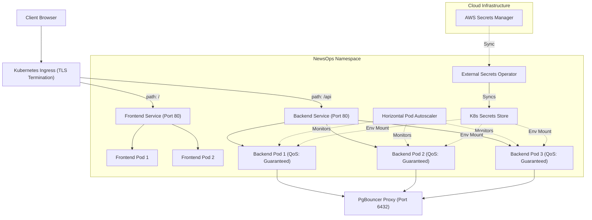

# Kubernetes Orchestration Specification
## Purpose
This document specifies the Kubernetes deployment architecture for the NewsOps Cloud digital publishing platform. It details the Helm chart directory structure, declarative manifests (Deployments, Services, Ingress, ConfigMaps), Horizontal Pod Autoscaler (HPA) configurations, and the External Secrets Operator integration.

## Executive Summary
NewsOps Cloud deployments run on managed Kubernetes clusters (AWS EKS or GCP GKE). Application delivery is standardized using Helm v3. System workloads are split into the NestJS Backend Monolith and the Next.js Frontend. Deployment manifests enforce high availability by running multi-zone replicas, configuring strict liveness and readiness probes, and managing environment parameters dynamically. Secrets are injected at runtime from cloud managers using the External Secrets Operator, maintaining database isolation and data privacy across environments.

## Vision
The vision is a zero-touch, self-healing, and elastic production runtime. Workloads scale dynamically based on application demands, recover automatically from hardware or software failures, and route client traffic without network drops.

## Scope
This orchestration specification includes:
- **Helm Chart Structure**: Directory layouts and configuration mappings.
- **NestJS Backend Manifests**: Complete Deployment, Service, and ConfigMap specifications.
- **Ingress Controller Configuration**: Target paths, hostname routing, and SSL/TLS termination configs.
- **External Secrets Operator CRDs**: Secure secrets synchronization from external managers.
- **Autoscaling Policies**: Horizontal Pod Autoscaler parameters.

It excludes low-level cluster creation parameters (e.g., VPC networks, node group sizing).

## Goals
- **Elastic Scale**: Support automatic resource expansion during load spikes, sustaining platform throughput.
- **Continuous Traffic Flow**: Ensure zero dropped HTTP connections during application upgrades or horizontal pod scaling.
- **Declarative Isolation**: Ensure namespace-level segregation of runtime resources and strict RBAC controls.
- **Immutable Secrets**: Avoid storing static secrets inside Git or config parameters.

## Functional Requirements
- **Replication Targets**: Run a minimum of three backend replicas across multiple availability zones.
- **Probes Validation**: Implement liveness and readiness probes pointing to system health ports (`:8081` and `:3000`).
- **TLS Termination**: Route all cluster ingress traffic over HTTPS (TLS 1.3), terminating SSL at the Application Load Balancer.
- **Dynamic Variable Injection**: Mount environment variables from ConfigMaps and Secrets dynamically.

## Non-Functional Requirements
- **Autoscaler Response Time**: HPA must detect scale metrics and spawn new pods in $< 30$ seconds.
- **Zero-Downtime Rollover**: Rolling upgrades must allocate `maxSurge: 25%` and `maxUnavailable: 0%`.
- **Secrets Synchronization Latency**: Changes made in Secrets Manager must sync to cluster namespace in $< 60$ seconds.

## Business Rules
- **Resource Matching**: Production deployment specifications must assign equal CPU/Memory Requests and Limits to guarantee high Quality of Service (QoS) and prevent eviction.
- **Namespace Boundary Enforcement**: The frontend application pods may never communicate directly with the database pods; all queries must route through the backend API.
- **Ingress Certificate Scope**: Public ingresses must associate with verified domain hosts (e.g., `*.newsops.cloud`) resolving through authorized ingress controllers.

## Actors
- **Cluster Administrator**: Manages Kubernetes control planes, namespaces, and node networks.
- **DevOps Engineer**: Packages charts, updates release parameters, and implements secrets mappings.
- **Site Reliability Engineer (SRE)**: Tunes autoscaling triggers, monitors pod evictions, and manages ingress rules.

## User Stories
- **User Story 1**: As a DevOps Engineer, I want to use a parameterized Helm chart so that I can deploy new environments for staging and production using a single configuration structure.
- **User Story 2**: As an SRE, I want the backend service to scale automatically when CPU utilization exceeds $75\%$ so that we can absorb traffic spikes without latency spikes.
- **User Story 3**: As a Cluster Administrator, I want our database passwords to sync dynamically from AWS Secrets Manager into the namespace so that credentials can be rotated without redeploying code.

## Acceptance Criteria
- Running `helm lint` against the NewsOps chart must return $0$ errors.
- During a rolling deployment, the ingress controller must route $100\%$ of incoming traffic without dropping a single packet.
- Liveness probes must fail if the backend's admin port `:8081/admin/health` responds with a non-200 code for 3 consecutive checks, resulting in pod recreation.

## Workflows
### Helm Release Update Workflow
1. **CD Trigger**: Git pipeline executes `helm upgrade --install newsops-release ./charts/newsops -f values-prod.yaml`.
2. **Secret Syncer**: External Secrets Operator resolves database credentials from cloud storage, creating a standard K8s Secret.
3. **Rolling Initialization**: Kubernetes schedules new pods. The old pods continue serving traffic.
4. **Probes Execution**: Kubelet runs readiness probes on the new pods.
5. **Traffic Migration**: Once readiness probes succeed, the Service routes requests to the new pods.
6. **Termination**: The old pods receive `SIGTERM`, resolve pending requests, and terminate after a 30-second grace period.

```
+------------+       +------------------+       +------------------+
| Helm Run   | ----> | Secret Operator  | ----> | Schedule New Pods|
| (CD Step)  |       | (Vault Sync)     |       | (Rolling Start)  |
+------------+       +------------------+       +------------------+
                                                          |
                                                          v
+------------+       +------------------+       +------------------+
| Old Pods   | <---- | Shift Traffic    | <---- | Readiness Probes |
| Terminated |       | (Service Update) |       | (Port 8081/3000) |
+------------+       +------------------+       +------------------+
```

---

## API Design
Kubernetes utilizes DNS routing for service-to-service communication within the cluster.

### Internal DNS Resolution
- **Backend Service Address**: `newsops-backend-svc.newsops.svc.cluster.local`
- **Database Proxy Address**: `newsops-pgbouncer-svc.newsops.svc.cluster.local`
- **Redis Address**: `newsops-redis-svc.newsops.svc.cluster.local`

Clients accessing the system externally hit public ingress API pathing rules.
* **API Route Map**:
  - `/api/v1/*` routes to `newsops-backend-svc:8080`.
  - `/*` (root/static) routes to `newsops-frontend-svc:3000`.

---

## Database Design
Stateful resources are isolated in physical storage volumes and referenced in Kubernetes using PersistentVolumeClaims (PVCs).

### `newsops-db-pvc` Claim
Allocates persistent disk space for local testing/development states.
```yaml
apiVersion: v1
kind: PersistentVolumeClaim
metadata:
  name: newsops-db-pvc
  namespace: newsops
spec:
  accessModes:
    - ReadWriteOnce
  resources:
    requests:
      storage: 50Gi
  storageClassName: gp3
```

---

## UI Design
Workload status monitoring is managed via Kubernetes Dashboards (e.g., Lens or Grafana Kubernetes App):
- **Deployment Status Panel**: Displays active vs. desired replica counts, CPU utilization rings, and pod readiness statuses.
- **HPA Scaling Monitor**: Renders replica count changes over time relative to target CPU limit thresholds.

---

## Permissions
The cluster configurations define security namespaces and RBAC configurations.

### `newsops-deployer` ServiceAccount
Grants pipelines permissions to apply cluster deployments.
- **API Groups**: `["apps", "", "networking.k8s.io"]`
- **Resources**: `["deployments", "services", "ingresses", "pods", "configmaps", "secrets"]`
- **Verbs**: `["get", "list", "create", "update", "patch", "delete"]`

---

## Security
- **Restricted Pod Security Standard**: Containers enforce `securityContext` settings blocking root privileges:
  ```yaml
  securityContext:
    runAsNonRoot: true
    runAsUser: 10001
    allowPrivilegeEscalation: false
    readOnlyRootFilesystem: true
    capabilities:
      drop:
        - ALL
  ```
- **NetworkPolicies**: Restrict traffic flow. The database namespace only allows inbound traffic originating from backend pods on port `6432`.

---

## Performance
- **Horizontal Scaling Limits**: HPA is configured to dynamically scale backend pods between $3$ (minimum) and $15$ (maximum) instances based on load metrics.
- **Resource Allocations**:
  - Backend: CPU Limit `1000m`, Memory Limit `2Gi`.
  - Frontend: CPU Limit `500m`, Memory Limit `1Gi`.

---

## Monitoring
- **Prometheus Metric**: `kube_deployment_status_replicas_available` (Tracks active running replicas).
- **Prometheus Metric**: `kube_pod_container_status_waiting_reason` (Identifies pod initialization blocks).
- **Alert Trigger**: Trigger SRE PagerDuty notification if `kube_deployment_status_replicas_available < kube_deployment_spec_replicas` for longer than 2 minutes.

---

## Logging
Cluster logging collectors (fluent-bit/vector) extract container stdout and format JSON fields.
* **Log Output Format**: `{"timestamp": "%ISO8601%", "pod": "newsops-backend-67df94-aa2b", "namespace": "newsops", "level": "INFO", "message": "Kubernetes readiness probe resolved successfully on port 8081"}`
* **Kubernetes Node Logging Drivers**: Enforce json-file logging formats on local execution environments.

---

## Error Handling
The Kubernetes scheduler logs runtime exceptions.

| Internal Kubernetes Error | Pod Phase Status | Remediation Steps |
|:---|:---|:---|
| `ImagePullBackOff` | ErrImagePull | Image tag not found in registry. Verify CI tag release logs and registry access. |
| `CrashLoopBackOff` | Running (Crashed) | Application runtime crash. Inspect container logs via `kubectl logs <pod-name>`. |
| `OOMKilled` | Terminated | Container exceeded hard memory limit. Adjust deployment memory specifications. |

---

## Edge Cases
- **AWS Secrets Manager Rate Limiting**: Under heavy scaling, multiple pods fetching secrets simultaneously can trigger AWS throttling. External Secrets Operator mitigates this by caching secrets in local K8s Secrets, minimizing API calls.
- **IP Address Exhaustion**: Pod scaling in small VPC subnets can consume all available IPs. Node configurations allocate dedicated secondary CNI subnet IPs to avoid network blocks.

---

## Mermaid Diagrams
### Kubernetes Cluster Deployment Topology


---

## Declarative Helm Structure & Manifests

### 1. Helm Chart Directory Structure
```
newsops/
  Chart.yaml
  values.yaml
  templates/
    _helpers.tpl
    configmap.yaml
    secrets.yaml
    backend-deployment.yaml
    backend-service.yaml
    frontend-deployment.yaml
    frontend-service.yaml
    ingress.yaml
    hpa.yaml
```

### 2. Chart Configuration Descriptor (`Chart.yaml`)
```yaml
apiVersion: v2
name: newsops
description: Helm Chart for NewsOps Cloud Digital Publishing Monolith & Frontend
type: application
version: 1.0.0
appVersion: "1.4.0"
```

### 3. NestJS Backend Deployment Manifest (`backend-deployment.yaml`)
```yaml
apiVersion: apps/v1
kind: Deployment
metadata:
  name: newsops-backend
  namespace: newsops
  labels:
    app.kubernetes.io/name: newsops-backend
spec:
  replicas: 3
  strategy:
    type: RollingUpdate
    rollingUpdate:
      maxSurge: 25%
      maxUnavailable: 0
  selector:
    matchLabels:
      app.kubernetes.io/name: newsops-backend
  template:
    metadata:
      labels:
        app.kubernetes.io/name: newsops-backend
    spec:
      serviceAccountName: newsops-backend-sa
      securityContext:
        fsGroup: 10001
      containers:
        - name: backend
          image: "ghcr.io/newsops/backend:v1.4.0"
          imagePullPolicy: IfNotPresent
          securityContext:
            runAsNonRoot: true
            runAsUser: 10001
            allowPrivilegeEscalation: false
            readOnlyRootFilesystem: true
            capabilities:
              drop:
                - ALL
          ports:
            - name: http
              containerPort: 8080
              protocol: TCP
            - name: admin
              containerPort: 8081
              protocol: TCP
          envFrom:
            - configMapRef:
                name: newsops-backend-config
          env:
            - name: DATABASE_PASSWORD
              valueFrom:
                secretKeyRef:
                  name: newsops-db-secrets
                  key: password
          resources:
            requests:
              cpu: 500m
              memory: 1Gi
            limits:
              cpu: 1000m
              memory: 2Gi
          livenessProbe:
            httpGet:
              path: /admin/health
              port: admin
            initialDelaySeconds: 15
            periodSeconds: 10
            timeoutSeconds: 3
            failureThreshold: 3
          readinessProbe:
            httpGet:
              path: /admin/health
              port: admin
            initialDelaySeconds: 10
            periodSeconds: 5
            timeoutSeconds: 2
            successThreshold: 1
            failureThreshold: 2
          volumeMounts:
            - mountPath: /tmp
              name: tmp-volume
      volumes:
        - name: tmp-volume
          emptyDir: {}
```

### 4. NestJS Backend Service Manifest (`backend-service.yaml`)
```yaml
apiVersion: v1
kind: Service
metadata:
  name: newsops-backend-svc
  namespace: newsops
  labels:
    app.kubernetes.io/name: newsops-backend
spec:
  type: ClusterIP
  ports:
    - name: http
      port: 80
      targetPort: http
      protocol: TCP
    - name: admin
      port: 8081
      targetPort: admin
      protocol: TCP
  selector:
    app.kubernetes.io/name: newsops-backend
```

### 5. Ingress Controller Configuration (`ingress.yaml`)
```yaml
apiVersion: networking.k8s.io/v1
kind: Ingress
metadata:
  name: newsops-ingress
  namespace: newsops
  annotations:
    kubernetes.io/ingress.class: alb
    alb.ingress.kubernetes.io/scheme: internet-facing
    alb.ingress.kubernetes.io/target-type: ip
    alb.ingress.kubernetes.io/listen-ports: '[{"HTTP": 80}, {"HTTPS":443}]'
    alb.ingress.kubernetes.io/ssl-redirect: '443'
    alb.ingress.kubernetes.io/ssl-policy: ELBSecurityPolicy-TLS13-1-2-2021-06
    alb.ingress.kubernetes.io/certificate-arn: arn:aws:acm:us-east-1:123456789012:certificate/abc-123-xyz
spec:
  rules:
    - host: api.newsops.cloud
      http:
        paths:
          - path: /api
            pathType: Prefix
            backend:
              service:
                name: newsops-backend-svc
                port:
                  name: http
    - host: newsops.cloud
      http:
        paths:
          - path: /
            pathType: Prefix
            backend:
              service:
                name: newsops-frontend-svc
                port:
                  number: 80
```

### 6. External Secret Operator Sync Resource (`secrets.yaml`)
```yaml
apiVersion: external-secrets.io/v1beta1
kind: ExternalSecret
metadata:
  name: newsops-db-secrets-sync
  namespace: newsops
spec:
  refreshInterval: 1m
  secretStoreRef:
    name: aws-secretsmanager-store
    kind: ClusterSecretStore
  target:
    name: newsops-db-secrets
    creationPolicy: Owner
  data:
    - secretKey: password
      remoteRef:
        key: production/newsops/database
        property: admin_password
```

---

## References
- Master DevOps Index: [./index.md](./index.md)
- Docker Environments Specifications: [./docker_environments.md](./docker_environments.md)
- CI/CD Deployment Workflows: [./ci_cd_pipelines.md](./ci_cd_pipelines.md)
- Prometheus Monitoring Configurations: [./monitoring_prometheus.md](./monitoring_prometheus.md)
- System Architecture Design: [../02-architecture/system_architecture.md](../02-architecture/system_architecture.md)
