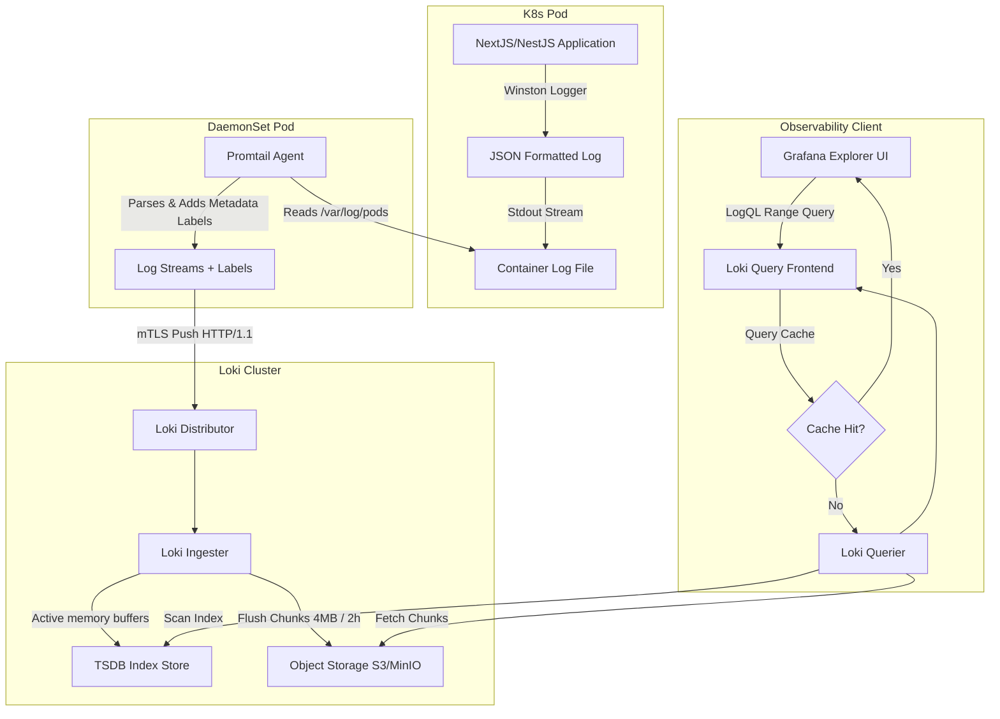

# Centralized Logging Design

## Purpose
This document specifies the architecture, configurations, and formatting standards for centralized log aggregation and real-time log analytics across all microservices and frontend platforms in NewsOps Cloud. It details the structured Winston logging implementation, Loki storage engine configurations, Promtail ingestion pipelines, trace-to-log correlation, and environment-specific log retention policies.

## Executive Summary
Centralized logging provides a continuous, structured audit and execution trail for all applications within the NewsOps Cloud platform. Instead of inspecting scattered container files, logs are emitted as structured JSON objects to `stdout` and collected by a daemon pipeline. This architecture integrates Winston (Node.js/NestJS), Promtail, and Grafana Loki. Every log line is automatically tagged with tracing metadata (`trace_id`, `span_id`), session context (`session_id`), and tenant scope (`tenant_id`), allowing developers to query complete request lifecycles. Log retention limits are enforced based on environment compliance requirements.

## Vision
The vision is to establish a unified diagnostic ecosystem where log entries, application traces, and infrastructure metrics are completely interconnected. By standardizing on structured JSON from day one, we enable automated anomaly detection, real-time security alerts, and immediate diagnostic tracing across multi-tenant boundaries.

## Scope
This document covers:
1. **Winston Logger Configurations**: Standardized logging setups for NestJS backend and Next.js frontend services.
2. **JSON Formatting Standards**: Mandated keys, type schemas, and field definitions.
3. **Trace and Session Context Propagation**: Mapping OpenTelemetry trace IDs and HTTP session headers directly into log metadata.
4. **Grafana Loki & Promtail Infrastructure**: Provisioning manifests, index configurations, and stream labels.
5. **Data Lifecycle Policies**: Active retention policies, storage compression, and log-purging configurations.

It does not cover tracing collection infrastructure (covered in `distributed_tracing.md`) or metric dashboard displays (covered in `grafana_dashboards.md`).

## Goals
- **100% Structured Output**: Eradicate unparsed, plain-text logs in production namespaces.
- **Fast Diagnostic Search**: Ensure p95 log query duration is $< 2.0\text{ seconds}$ on Grafana Loki over a 7-day query range.
- **Auto-correlated Traces**: Ensure 100% of HTTP and background queue logs contain valid OpenTelemetry trace IDs.
- **Zero PII Exposure**: Prevent sensitive data (e.g. passwords, credit card numbers, authorization tokens) from being written to storage.

## Functional Requirements
- **JSON Standard Output**: Loggers must format all entries into a single-line JSON string.
- **Context Injection Middleware**: Express/NestJS middleware must intercept headers (`X-Session-ID`, `X-Tenant-ID`, `X-User-ID`) and attach them to the Winston logging context.
- **Trace Context Extraction**: Intercept Active OpenTelemetry Span contexts and attach `trace_id` and `span_id` automatically to each log payload.
- **Loki Log Labeling**: Promtail must parse container logs and apply labels (`app`, `environment`, `tenant_id`, `level`, `namespace`) before transmission.
- **Multi-Level Routing**: Standardize log level usage (`error`, `warn`, `info`, `debug`, `verbose`) and redirect errors to alerting streams.

## Non-Functional Requirements
- **Log Propagation SLA**: Maximum ingestion delay from application write to Loki visibility must be $< 5.0\text{ seconds}$.
- **Storage Compression**: Chunks stored in Loki must be compressed using Snappy or Gzip, targeting a minimum compression ratio of 4:1.
- **Worker CPU Overhead**: Winston logging processes must consume less than 3% of the host pod's CPU allocation under peak traffic.

## Business Rules
- **Environment Partitioning**: Non-production logs must never be co-mingled with production logs within the same Loki datasource.
- **Strict Retention Windows**:
  - Development & Staging: 7 days retention, after which logs are permanently deleted.
  - Production Application Logs: 30 days retention.
  - Production Audit Logs (security operations, user authentication): 365 days retention, stored in an immutable, write-once-read-many (WORM) storage bucket.
- **SLA Violation Alerts**: Any drop in log ingestion rate exceeding 50% within 10 minutes must trigger an SRE page alert.

## Actors
- **Application Developer**: Queries Loki using LogQL in Grafana to diagnose application crashes and API issues.
- **Platform Engineer**: Configures Promtail agents, manages Loki clusters, and adjusts retention rules.
- **Compliance Officer**: Reviews audit logs to verify compliance with GDPR, HIPAA, and SOC2 policies.

## User Stories
- **User Story 1**: As an Application Developer, I want to search for a specific `trace_id` in Loki so that I can see all log events across NextJS, NestJS, and BullMQ workers that occurred during that single execution.
- **User Story 2**: As a Compliance Officer, I want to ensure that all user email addresses and passwords are automatically masked in the log output so that we do not store sensitive customer credentials in plain text.
- **User Story 3**: As a Platform Engineer, I want Loki to automatically purge logs older than 30 days in production so that our cloud storage costs remain within the allocated budget.

## Acceptance Criteria
- Microservices must configure Winston to emit logs to stdout matching the defined JSON schema.
- LogQL queries filtering by `tenant_id` must return matching results in $< 1.0\text{ second}$ for the preceding 24 hours.
- A middleware layer must automatically bind the trace ID of the active OpenTelemetry context to Winston logs.
- The logging utility must scrub card numbers matching standard regex patterns (Luhn validation check) and replace them with `[MASKED]`.
- Promtail configuration must drop logs matching health-check queries (`/healthz`) to minimize storage waste.

## Workflows
1. **Application Log Generation and Aggregation Workflow**:
   - An API request arrives at the NestJS API Gateway with tracing headers (`traceparent`).
   - The Gateway creates an OpenTelemetry span context and extracts tenant and session IDs.
   - During execution, the developer calls `logger.info('Processing article publishing request')`.
   - Winston captures the active context, aggregates metadata, converts the payload to JSON, and writes it to `stdout`.
   - The Kubernetes container engine captures `stdout` and writes it to `/var/log/pods/<namespace>_<pod>_<uid>/`.
   - The Promtail daemonset scrapes the path, attaches Kubernetes metadata (namespace, pod name), and forwards the stream to Loki.
   - Loki splits the streams, indexes labels, and writes log blocks to chunk storage (MinIO/S3).

2. **Log Exploration Workflow**:
   - A Developer logs into Grafana and navigates to the "Explore" tab.
   - They write a LogQL query: `{app="editorial-service", environment="production"} |= "ERR_DATABASE_TIMEOUT"`.
   - Grafana queries the Loki query-frontend.
   - Loki queriers fetch chunks from object storage, apply filters, and return matched logs.
   - Grafana displays the structured JSON log entries grouped by timestamp.

## API Design
Logs are queried programmatically via the Loki HTTP API. The primary query endpoint is described below:

### Query Logs over Time (LogQL Range Query)
* **URL**: `/loki/api/v1/query_range`
* **Method**: `GET`
* **Headers**:
  * `Authorization: Basic <TOKEN>`
* **Query Parameters**:
  * `query`: `{app="api-gateway", tenant_id="tenant-104"} |= "auth_failure"`
  * `start`: `1782672000000000000` (Unix epoch nanoseconds, e.g., 2026-06-27T00:00:00Z)
  * `end`: `1782675600000000000` (Unix epoch nanoseconds, e.g., 2026-06-27T01:00:00Z)
  * `limit`: `100`
* **Response Payload (200 OK)**:
```json
{
  "status": "success",
  "data": {
    "resultType": "streams",
    "result": [
      {
        "stream": {
          "app": "api-gateway",
          "environment": "production",
          "tenant_id": "tenant-104",
          "namespace": "newsops-prod"
        },
        "values": [
          [
            "1782672150000000000",
            "{\"timestamp\":\"2026-06-27T17:42:30.000Z\",\"level\":\"WARN\",\"context\":\"AuthGuard\",\"message\":\"User login attempt unauthorized\",\"traceId\":\"4bf92f3577b34da6a3ce929d0e0e4736\",\"spanId\":\"00f067aa0ba902b7\",\"sessionId\":\"sess-9812487\",\"tenantId\":\"tenant-104\",\"metadata\":{\"attemptUrl\":\"/api/v1/auth/login\",\"ip\":\"198.51.100.42\"}}"
          ]
        ]
      }
    ],
    "stats": {
      "summary": {
        "bytesProcessedPerSecond": 104857600,
        "linesProcessedPerSecond": 120000,
        "totalBytesProcessed": 524288000,
        "totalLinesProcessed": 600000
      }
    }
  }
}
```

## Database Design
Grafana Loki does not use relational schemas; instead, it partitions index and chunk structures. We define the dynamic configuration file representing Loki's schema partitioning:

### Loki Schema Config (`loki-config.yaml`)
```yaml
schema_config:
  configs:
    - from: 2026-01-01
      store: tsdb
      object_store: s3
      schema: v13
      index:
        prefix: loki_index_
        period: 24h
```

### Mandated JSON Log Format Schema (Winston Implementation)
Every log line emitted to `stdout` must conform to this schema:
* `timestamp`: ISO 8601 String (e.g. `2026-06-27T17:42:30.000Z`)
* `level`: VARCHAR (e.g., `INFO`, `WARN`, `ERROR`, `DEBUG`)
* `context`: VARCHAR (e.g., `ArticleService`, `BullMQWorker`)
* `message`: TEXT (Primary diagnostic description)
* `traceId`: VARCHAR(32) (Optional, hexadecimal trace identifier)
* `spanId`: VARCHAR(16) (Optional, hexadecimal span identifier)
* `sessionId`: VARCHAR(50) (Optional, session cookie identifier)
* `tenantId`: VARCHAR(50) (Identifies the tenant scope)
* `metadata`: JSON (Additional key-value contextual pairs)

## UI Design
Grafana's Log Explorer is configured with specific extraction parsers for NewsOps logs:
- **Search Bar**: Centered at the top, accepting LogQL queries.
- **Log Stream Variables Panel**: Left sidebar listing selectable values for `app`, `environment`, `level`, and `tenant_id`.
- **Pre-configured Fields Extractor**: Evaluates the JSON payload and presents nested fields (`traceId`, `spanId`, `sessionId`, `tenantId`) as clickable filters in the Grafana UI.
- **Correlate with Traces Link**: If a log contains a `traceId` and `spanId`, a button labeled "Jaeger Trace" appears next to the log line, opening a split-pane tracing view (see `distributed_tracing.md`).

## Permissions
Log access is bounded by roles mapped from keycloak:
- `logs:read`: Permission to query Loki logs, inspect streams, and use the Grafana Explorer. (Assigned to Developers, Support Operators, and SREs).
- `logs:download`: Permission to export query outputs as CSV files or raw JSON streams. (Assigned to Senior Operators and Security Auditors).
- `logs:delete`: Permission to trigger manual purge requests for data scrubbing compliance (e.g. GDPR right-to-be-forgotten requests). (Assigned strictly to SRE/Security Managers).

## Security
- **PII Redaction Engine (Winston Masking Utility)**:
```typescript
import { format } from 'winston';

const piiRegexPatterns = [
  /("password"\s*:\s*")[^"]+(")/g,
  /("creditCard"\s*:\s*")\d{13,16}(")/g,
  /("authorization"\s*:\s*")Bearer\s+[^"]+(")/g
];

export const maskPiiFormat = format((info) => {
  let stringified = JSON.stringify(info);
  piiRegexPatterns.forEach((pattern) => {
    stringified = stringified.replace(pattern, '$1[MASKED]$2');
  });
  return JSON.parse(stringified);
});
```
- **mTLS Ingestion Security**: Connection from Promtail to Loki uses mTLS with server/client certificates validated by the cluster CA.
- **Storage Encryption**: Chunks written to MinIO/S3 are encrypted at rest using AES-256 keys managed by KMS.

## Performance
- **Throughput Target**: Supports up to 25,000 log lines per second aggregate write throughput across the production cluster.
- **Loki Chunk Size Limits**: Chunks are written to object storage when they reach `4MB` or after a time interval of `2 hours` (whichever occurs first).
- **Client Cache**: Queriers cache index tables and results locally in Redis, ensuring subsequent queries for the same logs execute in $< 50\text{ ms}$.

## Monitoring
Loki performance is tracked in Prometheus using these key metrics:
- `loki_distributor_bytes_received_total`: Total log bytes received by the Loki Gateway.
- `loki_ingester_lines_received_total`: Count of log lines written to the ingester nodes.
- `loki_request_duration_seconds`: Response latency for LogQL read requests.

### Alerting Rules (Prometheus Alertmanager YAML)
```yaml
groups:
  - name: newsops-loki-alerts
    rules:
      - alert: LokiIngestionRateDrop
        expr: rate(loki_distributor_bytes_received_total[5m]) == 0
        for: 2m
        labels:
          severity: critical
        annotations:
          summary: "Loki log ingestion has stopped"
          description: "No log bytes have been received by the Loki distributor in the last 2 minutes."

      - alert: PromtailPushFailures
        expr: rate(promtail_request_duration_seconds_count{status_code=~"5.."}[5m]) > 0
        for: 5m
        labels:
          severity: warning
        annotations:
          summary: "Promtail push requests are failing"
          description: "Promtail agents are experiencing HTTP 5xx responses when pushing logs to Loki."
```

## Logging
Loki self-logs internal processes in structured JSON:
* **Log Pattern (Ingester Flush)**:
```json
{
  "timestamp": "2026-06-27T17:52:10.984Z",
  "level": "INFO",
  "context": "Ingester",
  "message": "Flushing chunk to storage",
  "metadata": {
    "chunk_id": "180a56214cdab2f",
    "stream_labels": "{app=\"api-gateway\",environment=\"production\"}",
    "bytes_size": 4194304
  }
}
```

## Error Handling
Logging-related failure conditions are handled with defensive patterns to prevent application performance degradation:

| Internal Error Code | HTTP Status | Customer-Facing Message |
|:---|:---|:---|
| `ERR_LOG_BUFFER_OVERFLOW` | 500 Internal Error | Winston's internal memory queue for asynchronous logging transports has reached capacity. |
| `ERR_LOKI_INGESTION_RATE_LIMIT` | 429 Too Many Requests | The client application has exceeded Loki's ingestion rate limit threshold. |
| `ERR_LOGQL_SYNTAX_ERROR` | 400 Bad Request | The LogQL query provided contains syntax errors or invalid stream selectors. |

## Edge Cases
- **Stdout Blockage / Backpressure**: If stdout blocking occurs due to microservice host issues, Winston switches to a non-blocking mode with a ring buffer of 5000 records, dropping debug logs first to prevent freezing the application thread.
- **Out of Order Log Ingestion**: Promtail tags log entries using the microsecond timestamp of creation. If timestamps arrive out of order, Loki ingesters accept logs within a grace window of 1 hour, preventing out-of-order rejection errors.
- **Massive Log Spikes (DDoS)**: In the event of a logging storm, the Loki distributor limits individual tenants to a maximum rate of `4MB/s` and bursts of `6MB/s`, returning a `429 Too Many Requests` to Promtail. Promtail then buffers logs locally on the host's disk.

## Future Improvements
- **Log Anomaly Detection using AI Router**: Pipeline logs directly into an AI anomaly detector that flags sudden patterns of unrecognized warning messages without relying on manual alerts.
- **Log-to-Metric Generation**: Create real-time metrics automatically inside Loki based on LogQL patterns (e.g., counting specific error codes to populate Prometheus targets).

## Mermaid Diagrams
Below is the logging architecture data flow diagram showing how logs travel from the application layer to storage:



## References
- Grafana Dashboards Design: [grafana_dashboards.md](./grafana_dashboards.md)
- Distributed Tracing Pipeline: [distributed_tracing.md](./distributed_tracing.md)
- Security Network Protocols: [network_security.md](../10-security/network_security.md)
- System Architecture Design: [system_architecture.md](../02-architecture/system_architecture.md)
