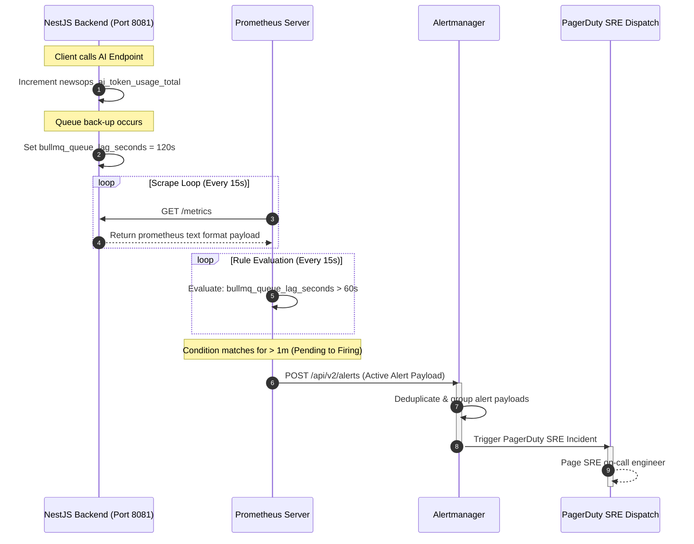

# System Observability & Prometheus Design
## Purpose
This document specifies the metrics collection patterns, Prometheus scraping architectures, and custom alerting rules for the NewsOps Cloud digital publishing platform. It defines telemetry models for tracking key performance indicators (KPIs) such as queue latency, database connection pool health, and AI token consumption.

## Executive Summary
Observability in NewsOps Cloud is centered around pull-based Prometheus scraping. The NestJS Monolith exposes a dedicated administration port (`:8081/metrics`) using the `prom-client` library, separating operational telemetry from public application routes. Custom metrics track BullMQ queue lag and AI token consumption. This document contains production-ready Prometheus configuration scripts (`prometheus.yml`) and alerting rules files (`prometheus.rules.yml`) to ensure SRE teams maintain proactive, real-time insights into system health.

## Vision
The vision is to establish a telemetry ecosystem that drives self-scaling infrastructure. Metrics must provide clear, high-cardinality metadata context, enabling automated anomaly detection and direct correlation between infrastructure workloads and cost allocations.

## Scope
This observability specification covers:
- **Core Prometheus Configuration**: Scraping configurations, relabeling rules, and target intervals.
- **Custom Metric Definitions**: Bulleted schemas for queue latency, database pools, and AI token tracking.
- **Alerting Specifications**: Production-ready alert trigger criteria and warning rule files.
- **Security & Performance**: Rules to prevent cardinality explosions and secure endpoints.

It excludes the layout configurations of Grafana dashboards and specific Alertmanager routing receivers (e.g., Slack webhooks, PagerDuty keys).

## Goals
- **Proactive Alerts**: Trigger alert pathways before system degradation impacts end-user application interfaces.
- **Low Scrape Overhead**: Limit telemetry collection to $< 1\%$ CPU utilization on the application pods.
- **High Data Quality**: Ensure all metrics utilize standardized, consistent labels (e.g., `tenant_id`, `environment`) to enable multi-tenant partitioning.
- **Safe Cardinality**: Prevent metrics storage exhaustion by limiting unbounded dynamic labels.

## Functional Requirements
- **Administrative Telemetry Port**: The NestJS monolith must expose a prometheus scraper endpoint on port `8081` under `/metrics`.
- **BullMQ Queue Lag Tracking**: Calculate and export queue latency metrics, categorized by queue name and tenant scope.
- **AI Token Usage Audit**: Track prompt and completion tokens, labeled by AI model vendor and client tenant.
- **Connection Pool Monitoring**: Export PgBouncer transaction allocations and database connection capacities.

## Non-Functional Requirements
- **Target Scraping Interval**: Collect application metrics every $15$ seconds.
- **Scraper Target Response Latency**: The `/metrics` endpoint must return payloads in $< 100\text{ ms}$.
- **Observability Retention Period**: Retain raw TSDB metrics locally on Prometheus persistent volumes for $15$ days.

## Business Rules
- **No PII in Telemetry**: Under no circumstances may user names, email addresses, search queries, or articles be injected as metric label values.
- **Dynamic Relabeling**: Kubernetes service discoveries must automatically apply cluster namespaces and deployment tags to scraped metrics.
- **Alert Levels Routing**: All alerts must contain a severity label (`warning` or `critical`) mapping to appropriate Alertmanager routing configurations.

## Actors
- **Site Reliability Engineer (SRE)**: Modifies alerts, monitors scrape targets, and scales Prometheus storage resources.
- **AI Platform Engineer**: Audits token metrics to track LLM costs and usage patterns.
- **Support Engineer**: Evaluates active system alerts to resolve customer complaints.
- **Backend Developer**: Registers custom metrics in application modules.

## User Stories
- **User Story 1**: As an SRE, I want Prometheus to monitor BullMQ queue latency so that we can trigger alerts before publishing events back up.
- **User Story 2**: As an AI Platform Engineer, I want to track token usage labeled by tenant and model name so that we can accurately bill clients for AI features.
- **User Story 3**: As a Support Engineer, I want to receive critical PagerDuty pages when the API's $99\text{th}$ percentile latency exceeds $500\text{ ms}$ for over 5 minutes, so that I can investigate latency spikes.

## Acceptance Criteria
- Prometheus must scrape the NestJS backend and Next.js frontend targets successfully, marking targets as `up` in the query panel.
- Trigger rules must successfully identify simulated conditions (such as high queue lag) and forward active alerts to Alertmanager in $< 30$ seconds.
- AI token metrics must track counters for both prompt and completion stages, labeled with keys for `tenant_id`, `provider` (e.g. OpenAI), and `model` (e.g. GPT-4).

## Workflows
### Observability Collection Lifecycle
1. **Metrics Ingestion**: The NestJS Monolith records operational events (HTTP response durations, token runs, database queries) in memory.
2. **Scrape Trigger**: Prometheus queries `http://newsops-backend-svc.newsops.svc:8081/metrics` every 15 seconds.
3. **Parse & Store**: Prometheus parses the raw text formats, applies relabeling filters, and writes values into the local Time Series Database (TSDB).
4. **Evaluate Alerts**: Prometheus evaluates alert rules against the TSDB every 15 seconds.
5. **Route Alerts**: If query criteria are met (e.g., connection pools stay full for 2 minutes), the alert transitions to `PENDING` and then `FIRING`, forwarding execution payloads to Alertmanager.
6. **Notify**: Alertmanager groups, deduplicates, and dispatches pages to SRE teams.

```
+---------------+       +------------------+       +------------------+
| App Run       | ----> | Telemetry Expose | ----> | Prom Scrape      |
| (Events In)   |       | (Port 8081)      |       | (Every 15s Pull) |
+---------------+       +------------------+       +------------------+
                                                          |
                                                          v
+---------------+       +------------------+       +------------------+
| Slack/PagerDuty| <---- | Alertmanager     | <---- | Alert Evaluator  |
| (Notification)|       | (Route & Group)  |       | (TSDB Query)     |
+---------------+       +------------------+       +------------------+
```

---

## API Design
The `/metrics` endpoint exports data conforming to the Prometheus text-based exposition format.

### Prometheus Text Payload Sample
* **URL**: `http://<pod-ip>:8081/metrics`
* **Response Headers**: `Content-Type: text/plain; version=0.0.4`
* **Response Payload**:
```text
# HELP nestjs_http_request_duration_seconds HTTP request latency histogram in seconds
# TYPE nestjs_http_request_duration_seconds histogram
nestjs_http_request_duration_seconds_bucket{method="POST",route="/api/v1/articles",status="201",tenant_id="tenant_a",le="0.1"} 14
nestjs_http_request_duration_seconds_bucket{method="POST",route="/api/v1/articles",status="201",tenant_id="tenant_a",le="0.5"} 42
nestjs_http_request_duration_seconds_count{method="POST",route="/api/v1/articles",status="201",tenant_id="tenant_a"} 45
nestjs_http_request_duration_seconds_sum{method="POST",route="/api/v1/articles",status="201",tenant_id="tenant_a"} 7.42

# HELP bullmq_queue_lag_seconds Current queue scheduling latency in seconds
# TYPE bullmq_queue_lag_seconds gauge
bullmq_queue_lag_seconds{queue_name="article_publishing",tenant_id="tenant_a"} 0.42
bullmq_queue_lag_seconds{queue_name="image_generation",tenant_id="tenant_b"} 124.50

# HELP newsops_ai_token_usage_total Cumulative token usage for AI operations
# TYPE newsops_ai_token_usage_total counter
newsops_ai_token_usage_total{type="prompt",provider="openai",model="gpt-4-turbo",tenant_id="tenant_a"} 128490
newsops_ai_token_usage_total{type="completion",provider="openai",model="gpt-4-turbo",tenant_id="tenant_a"} 45290
```

---

## Database Design
Metrics database designs utilize the Prometheus TSDB. The filesystem uses a structured layout.

### TSDB Storage Layout
```
/prometheus/data
  ├── chunks_head/
  │   └── 000001
  ├── wal/
  │   ├── 00000001
  │   └── checkpoint.000000
  ├── 01H7Y6... (historical block directories)
  │   ├── chunks/
  │   ├── tombstones
  │   ├── index
  │   └── meta.json
  └── lock
```

---

## UI Design
Operational metrics are rendered in Grafana dashboards.
- **Queue Health Panel**: Displays live graphs of queue lag metrics (`bullmq_queue_lag_seconds`) mapped by queue. Red indicator bars flash if lag exceeds 60 seconds.
- **Token Cost Breakdown Chart**: Renders pie charts showing total token distributions across models (Claude-3 vs. GPT-4) and client tenants.
- **PgBouncer Capacity Dial**: Dials showing active vs. max client connection numbers.

---

## Permissions
Access to metrics collection endpoints is controlled via Kubernetes network permissions and service configurations.
- **Scraper ServiceAccount**: The Prometheus pod runs under a ServiceAccount authorized to query node metrics and execute discovery API calls:
  - Role rules: `["nodes", "nodes/metrics", "services", "endpoints", "pods"]` with verbs `["get", "list", "watch"]`.

---

## Security
- **Telemetry Separation**: Metrics are bound to interface `0.0.0.0:8081`, ensuring they cannot be accessed via the public API Gateway (listening on port `8080`).
- **Input Filtering**: The scraper endpoint is read-only. It does not accept parameters or state changes, preventing command injection vectors.
- **TLS Scraping**: Prometheus configuration utilizes TLS certificates to encrypt traffic during cluster scrapes.

---

## Performance
- **Target Metrics Count**: Keep total metric count per application instance under $1,000$ to prevent scrapers from exceeding time budgets.
- **Cardinality Audits**: Labels like `user_id` or `article_id` are strictly prohibited to avoid creating hundreds of thousands of individual metric series.
- **Query Limits**: Prometheus limits dashboard queries to a maximum of $10,000$ data points per query to avoid memory exhaustion on SRE nodes.

---

## Monitoring
Prometheus monitors its own internal health using self-scraping metrics:
- `prometheus_target_interval_length_seconds`: Tracks scraping interval variations.
- `prometheus_tsdb_head_chunks`: Tracks chunk counts in memory.
- `prometheus_evaluator_duration_seconds`: Tracks alerting rule evaluation speeds.

---

## Logging
Telemetry logs track scraper operations and connection statuses.
* **Log Sample**: `{"timestamp": "%ISO8601%", "level": "WARN", "component": "ScrapeManager", "target": "newsops-backend-svc:8081", "error": "connection timeout after 10000ms"}`
* **Error Level**: `ERROR` for rule compilation failures, `WARN` for scraper connection drops, `INFO` for successful target discovery.

---

## Error Handling
The monitoring architecture maps scrape exceptions.

| Internal Monitoring Error | Code / Reason | Description & Recovery Steps |
|:---|:---|:---|
| `ERR_SCRAPE_TIMEOUT` | ScrapeTimeout | The target failed to return metrics within 10s. Review backend CPU saturation. |
| `ERR_CARDINALITY_LIMIT` | CardinalityLimitExceeded | Too many metric series created. SRE must strip dynamic values from metric labels. |
| `ERR_ALERTMANAGER_UNREACHABLE` | AlertmanagerUnreachable | Prometheus cannot forward alerts. Verify network routing rules to Alertmanager. |

---

## Edge Cases
- **Metric Cardinality Explosion**: If a developer pushes a release that maps dynamic parameters (e.g. client IP addresses) to labels, Prometheus memory usage will surge. Relabeling configurations contain drop rules that discard any metrics exceeding label count thresholds.
- **TSDB Corruption on Power Failure**: If a Kubernetes node crashes, the Write-Ahead Log (WAL) can corrupt. Prometheus relies on replica databases (highly available pairs) to continue operations while the corrupted node replays its checkpoints.

---

## Mermaid Diagrams
### End-to-End Metrics Flow and Alerting Sequence


---

## Observability Configurations & Alerts YAMLs

### 1. Custom Prometheus Scrape Configuration (`prometheus.yml`)
```yaml
global:
  scrape_interval: 15s
  evaluation_interval: 15s
  scrape_timeout: 10s

rule_files:
  - "prometheus.rules.yml"

alerting:
  alertmanagers:
    - scheme: http
      static_configs:
        - targets:
            - "alertmanager-svc.monitoring.svc.cluster.local:9093"

scrape_configs:
  # Scraping Prometheus itself
  - job_name: "prometheus"
    static_configs:
      - targets: ["localhost:9090"]

  # Kubernetes Pod Service Discovery (Scrapes NestJS Backend Port 8081)
  - job_name: "kubernetes-pods"
    kubernetes_sd_configs:
      - role: pod
    relabel_configs:
      # Scrape only pods that have the monitoring annotation
      - source_labels: [__meta_kubernetes_pod_annotation_prometheus_io_scrape]
        action: keep
        regex: "true"
      # Respect path configuration annotation, default is /metrics
      - source_labels: [__meta_kubernetes_pod_annotation_prometheus_io_path]
        action: replace
        target_label: __metrics_path__
        regex: (.+)
      # Relabel the target port to match prometheus.io/port annotation
      - source_labels: [__address__, __meta_kubernetes_pod_annotation_prometheus_io_port]
        action: replace
        regex: ([^:]+)(?::\d+)?;(\d+)
        replacement: $1:$2
        target_label: __address__
      # Add namespace, pod name, and container name labels
      - source_labels: [__meta_kubernetes_namespace]
        action: replace
        target_label: kubernetes_namespace
      - source_labels: [__meta_kubernetes_pod_name]
        action: replace
        target_label: kubernetes_pod_name
      - source_labels: [__meta_kubernetes_pod_container_name]
        action: replace
        target_label: kubernetes_container_name
```

### 2. Custom Alerting Rules Manifest (`prometheus.rules.yml`)
```yaml
groups:
  - name: newsops-platform-alerts
    rules:
      # Alert for failing pods / down targets
      - alert: ServiceInstanceDown
        expr: up{kubernetes_namespace="newsops"} == 0
        for: 1m
        labels:
          severity: critical
        annotations:
          summary: "NewsOps Target instance is down"
          description: "Pod {{ $labels.kubernetes_pod_name }} in namespace {{ $labels.kubernetes_namespace }} is unreachable for more than 1 minute."

      # Alert for Queue scheduling delay
      - alert: BullMQQueueHighLag
        expr: bullmq_queue_lag_seconds > 60
        for: 2m
        labels:
          severity: warning
        annotations:
          summary: "High queue scheduling latency detected"
          description: "Queue '{{ $labels.queue_name }}' for tenant '{{ $labels.tenant_id }}' has a backlog latency of {{ $value }}s, exceeding limits."

      # Alert for connection pool saturation
      - alert: PgBouncerPoolSaturation
        expr: pgbouncer_active_connections / pgbouncer_max_connections > 0.85
        for: 3m
        labels:
          severity: critical
        annotations:
          summary: "Database connection pool saturated"
          description: "PgBouncer pool utilization has exceeded 85% (current: {{ $value }}) for more than 3 minutes."

      # Alert for elevated API response latencies
      - alert: APIHighLatency99thPercentile
        expr: histogram_quantile(0.99, sum(rate(nestjs_http_request_duration_seconds_bucket[5m])) by (le)) > 0.500
        for: 5m
        labels:
          severity: critical
        annotations:
          summary: "High HTTP request latency (99th percentile)"
          description: "The 99th percentile of API response times has exceeded 500ms (current: {{ $value }}s) for over 5 minutes."

      # Alert for AI token budget limits
      - alert: TenantAITokenVolumeUsageSpike
        expr: increase(newsops_ai_token_usage_total[1h]) > 1000000
        for: 10m
        labels:
          severity: warning
        annotations:
          summary: "AI Token consumption volume spike detected"
          description: "Tenant '{{ $labels.tenant_id }}' has consumed more than 1,000,000 tokens of model '{{ $labels.model }}' in the past hour."
```

---

## References
- Master DevOps Index: [./index.md](./index.md)
- Docker Environments Specification: [./docker_environments.md](./docker_environments.md)
- CI/CD Deployment Workflows: [./ci_cd_pipelines.md](./ci_cd_pipelines.md)
- Kubernetes Manifest & Helm structures: [./kubernetes_deployment.md](./kubernetes_deployment.md)
- System Architecture Design: [../02-architecture/system_architecture.md](../02-architecture/system_architecture.md)
