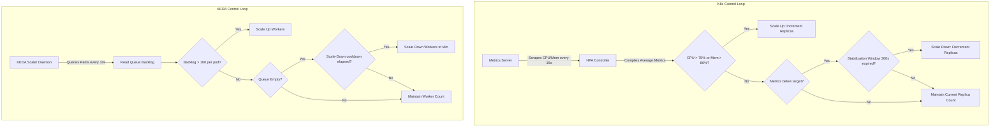
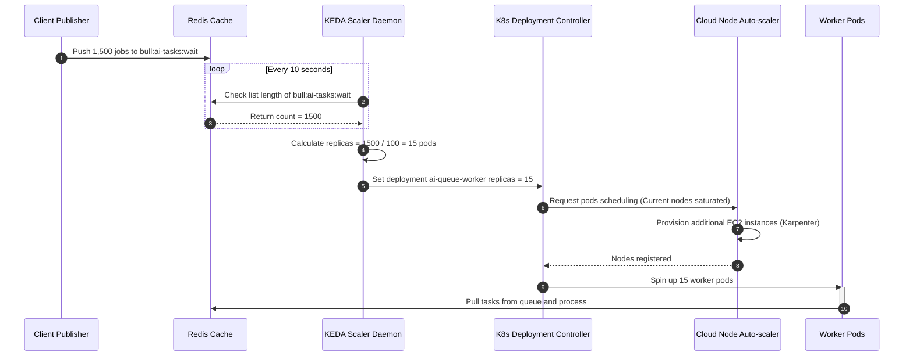

# Scaling Rules and Autoscaling Policies

## Purpose
This document defines the autoscaling policies, resource threshold triggers, and dynamic scaling configurations for the NewsOps Cloud digital publishing platform. It details the Horizontal Pod Autoscaler (HPA) rules for compute services, Amazon Aurora PostgreSQL dynamic read replica scaling strategies, and Kubernetes Event-driven Autoscaling (KEDA) configurations for background BullMQ queue workers.

## Executive Summary
Maintaining platform responsiveness during traffic surges while optimizing infrastructure costs requires automated, elastic resource management. NewsOps Cloud employs three independent autoscaling layers:
1. **Compute Scaling (Application Pods)**: Kubernetes Horizontal Pod Autoscaler (HPA) adjusts API Gateway and Editorial Service pod replicas using CPU and memory thresholds.
2. **Database Scaling (Read Replicas)**: AWS Aurora dynamic scaling policies deploy read replicas in response to elevated database CPU utilization and connection pool saturation.
3. **Queue Scaling (Background Workers)**: KEDA monitors Redis BullMQ backlog sizes, dynamically scaling queue workers between zero (or minimal) and peak numbers.

This specification details the yaml configurations, scaling rules, and cooldown strategies to prevent resource thrashing.

## Vision
The vision is to establish a zero-operator-intervention elastic infrastructure that scales within 60 seconds of traffic spikes or worker backlogs, maintaining an application response SLA of $< 200\text{ ms}$ while scaling down to minimum resource footprints when traffic subsides.

## Scope
This document covers:
1. **Horizontal Pod Autoscaler (HPA) Configurations**: Target thresholds for CPU and Memory, stabilization windows, and replica ranges.
2. **AWS Aurora PostgreSQL Database Scaling**: Read replica provisioning policies, connection scaling metrics, and cooling limits.
3. **KEDA ScaledObject Deployments**: Dynamic BullMQ worker scaling rules based on Redis backlog queries.
4. **Thrashing Prevention Policies**: Stabilization windows for scale-up and scale-down operations.

It does not cover basic cloud load balancer routing protocols (covered in `network_security.md`) or long-term capacity planning (covered in `cost_estimation_model.md`).

## Goals
- **Stable Latency SLA**: Maintain p95 API response times under $200\text{ ms}$ during a 5x baseline traffic spike.
- **Fast Scaling Response**: Scale out additional pods within 45 seconds of a metric threshold breach.
- **Zero Work Loss**: Ensure scale-down operations drain running BullMQ jobs and HTTP requests before terminating containers.
- **Cost Efficiency**: Scale worker pools to absolute minimum limits when queues are empty, minimizing non-production compute idle times.

## Functional Requirements
- **Compute Auto-Scaling**: Evaluate microservice CPU and Memory utilization every 15 seconds. Trigger replica increments when CPU exceeds 75% or Memory exceeds 80%.
- **Database Replica Management**: Auto-scale Aurora read replicas between 1 and 5 when Average CPU utilization of the read tier exceeds 70% for 5 consecutive minutes.
- **Event-Driven Queue Scaling**: KEDA must query the BullMQ Redis instance and adjust worker counts based on queue backlog ratios.
- **Controlled Scale-down Stabilization**: Impose a minimum 5-minute cool-down delay on scale-down operations to prevent thrashing.
- **Pod Disruption Budgets (PDB)**: Enforce a minimum level of available pods during scaling operations to guarantee high availability.

## Non-Functional Requirements
- **Metrics Scraping Precision**: Kubernetes metrics-server must scrape pod statistics at a frequency of 15 seconds.
- **Database Connection Re-balancing**: Backend microservices must utilize connection pooling (e.g. pgpool or TypeORM configs) that automatically re-balance query traffic when database read replicas are added or removed.
- **Worker Drain Timeout**: Set Kubernetes container termination grace period (`terminationGracePeriodSeconds`) to 120 seconds to allow active BullMQ jobs to complete.

## Business Rules
- **Production Isolation**: Minimum replica counts in production namespaces must be set to 3, distributed across at least 3 Availability Zones.
- **Write Database Restriction**: The primary PostgreSQL database node (writer) must never be auto-scaled. Only read replicas can be dynamically provisioned.
- **Non-Prod Cost Ceilings**: Staging and Development namespaces are capped at a maximum of 3 replicas per microservice, and database auto-scaling is disabled in non-prod environments.

## Actors
- **DevOps Engineer**: Configures HPA manifests, KEDA ScaledObjects, and commits them to the Git repository.
- **Database Administrator (DBA)**: Configures and monitors database replica scaling and Max Connection limits.
- **Finance Officer**: Establishes cloud billing alarms and maximum node count thresholds to contain infrastructure expenditures.

## User Stories
- **User Story 1**: As an SRE, I want the API Gateway to scale out dynamically when CPU usage spikes during breaking news events so that the API gateway does not drop incoming web traffic.
- **User Story 2**: As a Database Administrator, I want read replicas to scale out when reporting dashboards query large analytical datasets so that regular reading traffic is unaffected by slow queries.
- **User Story 3**: As a Content Editor, I want the AI text-generation workers to scale up when there is a massive backlog of queue jobs so that meta-description generations do not get delayed.

## Acceptance Criteria
- HPA must trigger replica additions within 30 seconds of average CPU exceeding 75% for 3 consecutive metrics-server evaluation cycles.
- The KEDA scale configuration must trigger worker additions when `bullmq_queue_waiting_jobs_total` divided by `replicas` is greater than 100.
- Database read replica count must scale down only after read tier CPU utilization remains below 30% for 15 consecutive minutes.
- Container termination commands must wait for active HTTP requests to drain before shutting down the process.

## Workflows
1. **API Pod Scaling Workflow**:
   - Metrics-server scrapes pod metrics from container runtimes every 15 seconds.
   - HPA compares current CPU/Memory averages against target values (75% / 80%).
   - If a breach is detected, HPA updates the Deployment resource's replica counter.
   - Kubernetes scheduler detects the deployment spec change and requests new pods from the cluster nodes.
   - If cluster nodes are saturated, Karpenter/Node Auto-scaler provisions new AWS EC2 instances.
   - New pods are scheduled, pass readiness probes, and receive API traffic.

2. **Event-Driven Queue scaling Workflow**:
   - KEDA controller queries the Redis cluster using the BullMQ backlog query every 10 seconds.
   - KEDA evaluates if waiting jobs exceed the per-pod target (100 jobs/pod).
   - KEDA requests a scale-up directly to the Kubernetes Deployment controller for the worker pool.
   - Worker pods spin up, initialize the NestJS application, connect to Redis, and pull waiting jobs.
   - When the queue backlog returns to zero, KEDA requests a scale-down, observing the cooldown window.



## API Design
Dynamic scaling operations utilize core Kubernetes declarative API resources. Below are the configurations for application and queue autoscaling:

### 1. Kubernetes HPA Manifest (`hpa-editorial-service.yaml`)
```yaml
apiVersion: autoscaling/v2
kind: HorizontalPodAutoscaler
metadata:
  name: editorial-service-hpa
  namespace: newsops-prod
spec:
  scaleTargetRef:
    apiVersion: apps/v1
    kind: Deployment
    name: editorial-service
  minReplicas: 3
  maxReplicas: 20
  metrics:
    - type: Resource
      resource:
        name: cpu
        target:
          type: Utilization
          averageUtilization: 75
    - type: Resource
      resource:
        name: memory
        target:
          type: Utilization
          averageUtilization: 80
  behavior:
    scaleUp:
      stabilizationWindowSeconds: 0
      policies:
        - type: Percent
          value: 100
          periodSeconds: 15
    scaleDown:
      stabilizationWindowSeconds: 300
      policies:
        - type: Percent
          value: 10
          periodSeconds: 60
```

### 2. KEDA ScaledObject Manifest for BullMQ Workers (`keda-bullmq-scaler.yaml`)
```yaml
apiVersion: keda.sh/v1alpha1
kind: ScaledObject
metadata:
  name: bullmq-ai-worker-scaler
  namespace: newsops-prod
spec:
  scaleTargetRef:
    apiVersion: apps/v1
    kind: Deployment
    name: ai-queue-worker
  minReplicaCount: 1
  maxReplicaCount: 30
  cooldownPeriod: 300
  pollingInterval: 10
  advanced:
    horizontalPodAutoscalerConfig:
      behavior:
        scaleDown:
          stabilizationWindowSeconds: 300
          policies:
            - type: Percent
              value: 10
              periodSeconds: 60
  triggers:
    - type: redis
      metadata:
        address: redis-cluster.cache.svc.cluster.local:6379
        listName: bull:ai-tasks:wait
        listLength: "100"
        enableTLS: "true"
```

## Database Design
To track dynamic scaling events and monitor autoscaling health over time, the platform logs telemetry to a dedicated schema table inside the metrics datastore:

### `autoscaling_events` Table
* `id`: BIGINT (Primary Key, Auto-increment)
* `target_resource`: VARCHAR(100) (e.g., 'deployment/editorial-service', 'rds/aurora-read-tier')
* `event_type`: VARCHAR(20) (e.g., 'SCALE_UP', 'SCALE_DOWN')
* `previous_replicas`: INT
* `target_replicas`: INT
* `trigger_metric_name`: VARCHAR(100) (e.g., 'cpu_utilization', 'redis_list_length')
* `trigger_metric_value`: NUMERIC
* `timestamp`: TIMESTAMP WITH TIME ZONE (Default: CURRENT_TIMESTAMP)

### Schema Indexes
- `CREATE INDEX idx_autoscaling_events_target ON autoscaling_events(target_resource);`
- `CREATE INDEX idx_autoscaling_events_time ON autoscaling_events(timestamp DESC);`

## UI Design
Platform operators monitor scaling status through a dedicated "Scaling & Resource Management" dashboard:
- **Replica Allocation Panel**: Time-series chart showing Active Replicas vs. Requested Pods over time.
- **Metric Thresholds Overlay**: Overlays average CPU/Memory metrics alongside horizontal threshold lines (indicating the 75% and 80% marks).
- **KEDA Queue Depth Tracker**: Time-series chart showing active BullMQ queue backlog length alongside the target scaler limits.
- **Autoscaling Events Log**: A tabular component fetching records from the `autoscaling_events` table, color-coding Scale-Up events in green and Scale-Down events in blue.

## Permissions
Scaling operations are restricted by RBAC rules to avoid unauthorized resources exhaustion:
- `autoscaling:read`: View HPAs, KEDA ScaledObjects, and database replicas scaling metrics. (Assigned to Developers and Operators).
- `autoscaling:write`: Create, modify, or delete HPA targets and KEDA configurations. (Assigned strictly to DevOps/SREs).
- `database:scale`: Trigger manual scaling of Aurora database read replicas or modify automatic database scaling policies. (Assigned to Lead DBAs).

## Security
- **Max Scaling Boundaries**: Hard ceilings (`maxReplicas: 20` for API, `maxReplicaCount: 30` for queue workers) are enforced. This prevents run-away loops (e.g. from recursive requests) from consuming infinite compute nodes and generating massive cloud bills.
- **Pod Disruption Budgets (PDB)**: Enforces `maxUnavailable: 1` during scaling and updates to prevent clusters from dropping capacity below SLA requirements.
- **Secure Redis Authentication**: KEDA authenticates with Redis using Kubernetes secrets dynamically injected into the controller Pod.

## Performance
- **Metrics Evaluation Speed**: Metric scraping by the HPA controller must resolve in $< 2.0\text{ seconds}$.
- **Container Startup SLA**: Microservices must implement optimized container images (under 150MB compressed) and fast application start routines, ensuring new pods pass readiness probes within 30 seconds of container start.
- **Database Scale Latency**: AWS Aurora requires up to 5 minutes to provision and mount a new read replica EC2 instance. Application database connection pools must handle temporary packet dropouts during replica mounting.

## Monitoring
Autoscaling activity is tracked in Prometheus using these standard metrics:
- `kube_horizontalpodautoscaler_status_current_replicas`: Current count of replicas managed by HPAs.
- `kube_horizontalpodautoscaler_status_desired_replicas`: Expected count of replicas calculated by the HPA controller.
- `keda_scaler_active`: Indicates if KEDA has active metrics triggers scaling the deployment.

### Alerting Rules (Prometheus Alertmanager YAML)
```yaml
groups:
  - name: newsops-autoscaling-alerts
    rules:
      - alert: HPAScalingAtMaxCapacity
        expr: kube_horizontalpodautoscaler_status_current_replicas{horizontalpodautoscaler="editorial-service-hpa"} == kube_horizontalpodautoscaler_spec_max_replicas{horizontalpodautoscaler="editorial-service-hpa"}
        for: 10m
        labels:
          severity: warning
        annotations:
          summary: "Editorial service HPA is running at maximum capacity"
          description: "The deployment has reached its limit of 20 replicas. Resources may saturate if traffic continues to increase."

      - alert: KEDAScaleUpTimeout
        expr: keda_scaler_active == 1 and rate(bullmq_queue_waiting_jobs_total[5m]) > 100 and rate(kube_pod_status_ready{condition="true"}[5m]) == 0
        for: 5m
        labels:
          severity: critical
        annotations:
          summary: "KEDA scale up is stalling"
          description: "KEDA is active and backlog is elevated, but new worker pods are failing to transition to Ready state. Verify node capacity."
```

## Logging
Autoscaling events are logged by the Kubernetes controller in structured JSON formats:
* **Log Pattern (HPA Scale-Up Trigger)**:
```json
{
  "timestamp": "2026-06-27T17:58:30.124Z",
  "level": "INFO",
  "context": "HPAController",
  "message": "HorizontalPodAutoscaler recommendation: Scale Up",
  "metadata": {
    "hpa_name": "editorial-service-hpa",
    "deployment": "editorial-service",
    "current_replicas": 3,
    "desired_replicas": 6,
    "reason": "Average CPU utilization (82%) exceeded target (75%)"
  }
}
```

## Error Handling
Autoscaling failure conditions are handled with fallback mechanisms to protect system availability:

| Internal Error Code | HTTP Status | Customer-Facing Message |
|:---|:---|:---|
| `ERR_METRICS_SERVER_TIMEOUT` | 504 Gateway Timeout | HPA failed to scrape pod metrics. Autoscaling has fallen back to the last known safe replica count. |
| `ERR_KEDA_REDIS_CONNECT_FAIL` | 503 Service Unavailable | KEDA failed to connect to Redis. Queue worker scaling is locked to the maximum replica limit (30) to prevent backlog overflow. |
| `ERR_DB_REPLICA_LIMIT_REACHED` | 507 Insufficient Storage | Aurora read replicas are at their maximum limit (5). Secondary query caching has been activated to reduce load. |

## Edge Cases
- **Metric Scraping Outages**: If the metrics-server fails, the HPA cannot evaluate CPU/Memory. The HPA is configured to maintain the current replica count. If the outage exceeds 10 minutes, the HPA defaults to the maximum replica setting (20) as a safe operational buffer.
- **Scale-Down Pod Thrashing**: A rapid decrease in traffic followed by a sudden spike can cause a deployment to continuously scale up and down. The `stabilizationWindowSeconds` setting of 300 seconds (5 minutes) forces the controller to wait before executing scale-downs, smoothing out short-lived traffic dips.
- **AWS Instance Exhaustion**: In rare scenarios, the cloud provider may run out of target EC2 instances in an availability zone. Karpenter configuration falls back to secondary instance sizes automatically (e.g. falling back from `c6i.large` to `m6i.large` and `t3.large`).

## Future Improvements
- **Predictive Autoscaling with Prometheus Data**: Integrate machine learning models that analyze historical traffic trends (e.g., daily newsletter launches) and pre-emptively scale out compute resources 15 minutes before the traffic surge occurs.
- **Node Scale Optimization using Karpenter**: Migrate standard cluster-autoscaler nodes to Karpenter to reduce EC2 node initialization latency from 3 minutes to less than 45 seconds.

## Mermaid Diagrams
The following sequence diagram details the interaction between controllers during a BullMQ queue scaling event:



## References
- System Architecture Design: [system_architecture.md](../02-architecture/system_architecture.md)
- Scaling and High Availability: [scaling_and_ha.md](../02-architecture/scaling_and_ha.md)
- Grafana Dashboards Design: [grafana_dashboards.md](./grafana_dashboards.md)
- Network Routing Security: [network_security.md](../10-security/network_security.md)
