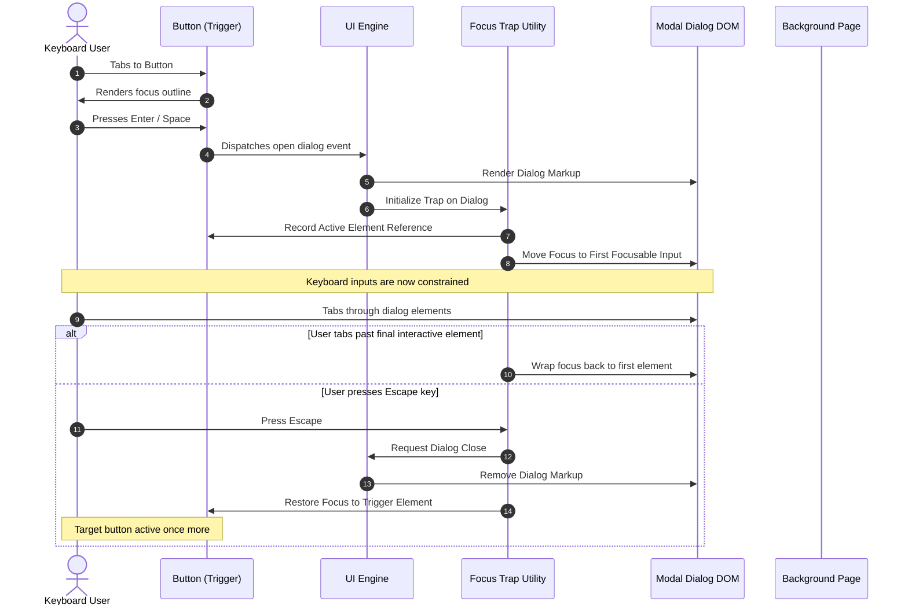

# Accessibility Standards UI

## Purpose
This design document defines the accessibility (a11y) standards, implementation rules, and compliance criteria for the NewsOps Cloud UI components. It provides specific instructions for semantic markup, keyboard navigation, focus indicators, ARIA (Accessible Rich Internet Applications) roles, and testing procedures to ensure WCAG 2.2 Level AA and AAA compliance across all digital properties.

## Executive Summary
Accessibility is a core architectural requirement for NewsOps Cloud. To support readers with visual, motor, auditory, or cognitive disabilities, the platform enforces semantic markup standards, absolute keyboard navigation capability, visible focus indicators, and dynamic aria-live notifications. This design outlines specifications for core custom components (such as modal dialogues and dynamic feeds), detailing focus trapping techniques, CSS focus styling, dynamic alt-text compliance, and automated testing integrations in the CI/CD pipeline.

## Vision
The NewsOps Cloud vision is to establish an inclusive publishing platform where every administrative dashboard and published reader experience is accessible out of the box. Assistive technology integrations are treated as first-class citizenship requirements, ensuring that keyboard users, screen reader users, and high-contrast users experience a performant and intuitive UI.

## Scope
This document covers:
1. **Semantic DOM Rules**: Standard structural layout requirements.
2. **Keyboard Navigation & Focus Management**: Skip links, keyboard patterns, and modal focus traps.
3. **ARIA Integration**: Standard attribute bindings and live regions for dynamic alerts.
4. **Content Accessibility**: Structural requirements for image descriptions, transcription linkages, and table styling.
5. **Testing Standards**: Automated axe-core runs and manual screen reader audits.

It does not cover:
- Specific implementation details of screen reader software (e.g., NVDA, JAWS, VoiceOver settings).
- Captions and audio descriptions generation algorithms (handled in AI media indexing services).

## Goals
- **100% Keyboard Navigability**: Ensure all interactive elements can be reached and activated via keyboard inputs alone.
- **Strict Focus Control**: Restrict focus transitions within modal dialogs to prevent background interaction.
- **WCAG 2.2 Level AA Compliance**: Meet all Level AA guidelines globally and target Level AAA contrast ratios in reader-facing templates.
- **Zero Keyboard Traps**: Eliminate code sequences that prevent a user from moving focus away from an element.

## Functional Requirements
- **Skip to Content Link**: Insert a skip-to-content hyperlink at the top of every page layout that appears when tabbed, routing focus to the primary `<main>` element.
- **Focus Rings**: Implement high-contrast CSS focus outlines for all interactive controls (buttons, links, inputs).
- **Focus Trapping**: Implement a focus trap utility class for dialog panels, sidebars, and popups.
- **Dynamic Alerts (Live Regions)**: Dynamic notification panels must contain `role="status"` or `aria-live="polite"` to alert screen reader users of changes without breaking their focus.

## Non-Functional Requirements
- **Accessibility Tree Response Time**: Component renders must sync semantic states to the browser accessibility tree in under 5ms.
- **Dynamic Text Scaling**: UI layouts must remain functional, without overlap or clipping, when the browser font scale is increased by up to 200%.
- **Minimum Tap Target Dimensions**: Interactive components must maintain a minimum bounding click target of 44x44 CSS pixels.

## Business Rules
- **Mandatory Alternative Text**: Editorial portals must block article publication if any embedded image asset lacks a verified descriptive alt tag.
- **Consistent Navigation Hierarchies**: Structural heading chains (`<h1>` through `<h6>`) must follow chronological levels; skipping levels (e.g., `<h1>` followed directly by `<h3>`) is blocked by build linters.
- **Color-Independent Notifications**: Under no circumstances must color be used as the sole method to deliver status changes or alert actions. Icons and text descriptions must accompany color cues.

## Actors
- **End Reader**: Operates screen readers or keyboard controls to read content.
- **Content Author**: Prepares articles, ensuring alt text and head structures are populated correctly.
- **Quality Assurance Auditor**: Tests components for WCAG compliance.
- **UI Component Engine**: Generates accessible semantic markup.

## User Stories
- **User Story 1**: As a keyboard-only user with limited motor capabilities, I want a "Skip to Content" link to appear as the first tabable element on the news homepage so that I can bypass 50 header navigation links.
- **User Story 2**: As a screen reader user, I want the modal search dialog to lock my keyboard focus inside its input and results elements while active so that I don't tab into background elements.
- **User Story 3**: As a blind editor using the publishing console, I want form validation errors to be read aloud immediately when I attempt to submit an incomplete article draft.

## Acceptance Criteria
- **AC 1**: Tabbing to the page header highlights the skip link with a minimum contrast ratio of 4.5:1 against the background and routes focus to `#main-content` on activation.
- **AC 2**: Opening a dialog redirects keyboard focus to the first interactive field inside it. Closing the dialog restores focus to the triggering element within 2ms.
- **AC 3**: Every interactive component has an active `:focus-visible` ring styled with `outline: 2px solid var(--ring)` and `outline-offset: 2px`.
- **AC 4**: Interactive custom controls must include key listeners for `Enter` and `Space` keys mapped to their click handler callbacks.

## Workflows

### Modal Focus Trap Lifecycle
1. The user clicks a button to open the "Settings" modal.
2. The UI engine renders the modal overlay and applies class `.focus-trap`.
3. The initialization function:
   - Identifies all keyboard-interactive elements in the modal: `[href], button, input, select, textarea, [tabindex="0"]`.
   - Records the previously active DOM element (`document.activeElement`).
   - Shifts current focus to the first interactive element within the modal.
4. A keydown event listener intercepts tab actions:
   - If the user tabs on the *last* element, focus wraps back to the *first* element.
   - If the user shift-tabs on the *first* element, focus wraps to the *last* element.
   - If the user presses `Escape`, the modal closes.
5. Upon close, focus is immediately returned to the recorded triggering element.

### Keyboard-Only Page Navigation
1. The user lands on the site and presses the `Tab` key.
2. The hidden skip-to-content anchor shifts layout coordinates, rendering it visually at the top-left of the viewport.
3. The user hits `Enter`, shifting the focus identifier directly to `id="main-content"`.
4. The screen reader states "Main content container loaded."
5. Subsequent `Tab` presses navigate page articles in visual, chronological reading order.

## API Design

### User Accessibility Customizations API
Enables users to customize contrast, font sizes, and reader options.

* **URL**: `/api/v1/users/accessibility`
* **Method**: `PATCH`
* **Headers**:
  * `Authorization: Bearer <JWT>`
  * `Content-Type: application/json`
* **Request Payload**:
```json
{
  "highContrastEnabled": true,
  "reducedMotionEnabled": false,
  "largeTextScale": "120%",
  "screenReaderOptimized": true
}
```
* **Response Payload (200 OK)**:
```json
{
  "userId": "usr_992182ab",
  "accessibilitySettings": {
    "highContrastEnabled": true,
    "reducedMotionEnabled": false,
    "largeTextScale": "120%",
    "screenReaderOptimized": true,
    "updatedAt": "2026-06-27T22:55:00Z"
  }
}
```

### Validate Accessibility Layout Payload
Validates dynamic article layouts before publishing.

* **URL**: `/api/v1/content/validate-accessibility`
* **Method**: `POST`
* **Headers**:
  * `Authorization: Bearer <JWT>`
  * `Content-Type: application/json`
* **Request Payload**:
```json
{
  "articleId": "art_2298a",
  "headings": [
    { "tag": "h1", "text": "Platform Launches" },
    { "tag": "h2", "text": "Performance Metrics" },
    { "tag": "h3", "text": "Latency Results" }
  ],
  "images": [
    { "id": "img_001", "alt": "A chart showing rendering times drop under 10ms" },
    { "id": "img_002", "alt": "" }
  ]
}
```
* **Response Payload (422 Unprocessable Entity)**:
```json
{
  "status": "validation_failed",
  "errors": [
    {
      "code": "ERR_MISSING_ALT_TEXT",
      "target": "img_002",
      "message": "Image element img_002 is missing alternate text description."
    }
  ]
}
```

## Database Design

### `media_assets` Table Updates
Ensure alt attributes are persisted and verified.
- `id`: VARCHAR(30) (Primary Key)
- `tenant_id`: VARCHAR(30) (Foreign Key to `tenants.id`)
- `file_url`: VARCHAR(255)
- `alt_text`: VARCHAR(255) (Must not be NULL; defaults to empty string only if explicitly marked decorative)
- `is_decorative`: BOOLEAN (default false)
- `a11y_validated`: BOOLEAN (default false)
- `created_by`: VARCHAR(30)
- `created_at`: TIMESTAMP WITH TIME ZONE

### `user_accessibility_preferences` Table
- `user_id`: VARCHAR(30) (Primary Key, Foreign Key to `users.id`)
- `high_contrast`: BOOLEAN (default false)
- `reduced_motion`: BOOLEAN (default false)
- `text_zoom_percent`: INTEGER (default 100)
- `keyboard_navigation_enhancement`: BOOLEAN (default false)

## UI Design

### Skip-Link Implementation (HTML & CSS)
```html
<a href="#main-content" class="skip-to-content">
  Skip to primary content
</a>

<main id="main-content" tabindex="-1">
  <!-- Primary content goes here -->
</main>
```

```css
.skip-to-content {
  position: absolute;
  top: -100px;
  left: 0;
  background: hsl(var(--primary));
  color: hsl(var(--primary-foreground));
  padding: 12px 24px;
  z-index: 9999;
  transition: top 150ms ease;
}

.skip-to-content:focus {
  top: 0;
  outline: 2px solid hsl(var(--ring));
}
```

### Form Input Validation Markup
Standardized error structures bound to form components:

```html
<div class="form-group">
  <label for="email-input">Email Address</label>
  <input 
    type="email" 
    id="email-input" 
    name="email"
    aria-invalid="true" 
    aria-describedby="email-error"
    placeholder="user@example.com"
  />
  <span id="email-error" class="error-text" role="alert">
    Please enter a valid email address.
  </span>
</div>
```

## Permissions
- `articles:write`: Required to validate and publish content (enforces alt-text constraints).
- `preferences:write`: Allows users to update and save custom accessibility layout overrides.
- `system_settings:write`: Allows system admins to configure global site accessibility baselines.

## Security
- **Strict DOM Sanitization**: Alt-text fields and ARIA descriptors must undergo HTML encoding to prevent Cross-Site Scripting (XSS) via dynamic titles injected into accessibility tree components:
```javascript
function sanitizeA11yInput(input) {
  return input.replace(/&/g, "&amp;")
              .replace(/</g, "&lt;")
              .replace(/>/g, "&gt;")
              .replace(/"/g, "&quot;")
              .replace(/'/g, "&#x27;");
}
```

## Performance
- **Focus Transition Frame Rates**: Focus shifts and key listeners must process synchronously without triggering page recalculation, keeping execution times under $< 4\text{ ms}$.
- **Accessibility DOM Nodes**: Limit the size of accessibility trees. Pages must not exceed 1,500 total elements to ensure assistive engines process navigation tags efficiently without memory drain.

## Monitoring
- **Prometheus Metric**: `accessibility_audit_failures_total` (Tracks automated axe audits running against build stages).
- **Prometheus Metric**: `skip_link_activations_total` (Tracks how frequently users activate the skip-to-content trigger).
- **Alert Trigger**: Trigger build failures if `accessibility_audit_failures_total` is greater than 0 during pipeline deployments.

## Logging
Logging output is formatted in structured JSON.
* **Image Missing Description**:
`{"timestamp": "2026-06-27T22:56:12.302Z", "level": "WARN", "context": "ArticleValidator", "message": "Article validation failed due to missing alt text", "article_id": "art_2298a", "image_id": "img_002"}`
* **Focus Trap Recovery Warning**:
`{"timestamp": "2026-06-27T22:56:45.918Z", "level": "WARN", "context": "FocusTrapHandler", "message": "Trigger element was destroyed while dialog was open. Restoring focus to document body.", "dialog_id": "dlg_search"}`

## Error Handling
| Internal Error Code | HTTP Status | Customer-Facing Message |
|:---|:---|:---|
| `ERR_MISSING_ALT_TEXT` | 422 Unprocessable Entity | Accessibility rule validation failed: One or more images lack alternative text descriptions. |
| `ERR_INVALID_HEADING_STRUCTURE` | 422 Unprocessable Entity | Heading levels must follow chronological order. Cannot skip levels. |
| `ERR_FOCUS_TRAP_FAILURE` | 500 Internal Error | UI error: The modal focus trap could not locate any interactive sub-elements. |

## Edge Cases
- **Nested Dialog Layers**: If an editor opens a popup (e.g. Media Library) from within an open dialog (e.g. Article Settings), the focus trap from the first dialog must be paused while the second dialog is active. Focus traps are managed as a stack:
```javascript
const focusTrapStack = [];
function pushTrap(trapId) {
  if (focusTrapStack.length > 0) {
    focusTrapStack[focusTrapStack.length - 1].pause();
  }
  focusTrapStack.push(initializeTrap(trapId));
}
function popTrap() {
  const current = focusTrapStack.pop();
  current.destroy();
  if (focusTrapStack.length > 0) {
    focusTrapStack[focusTrapStack.length - 1].resume();
  }
}
```
- **Virtual Lists (Infinite Scrolling)**: When dynamic articles render in a feed, tabbing must step through items sequentially. Since elements off-screen are unmounted, focus would be lost. The system handles this by maintaining key scroll indicators (`tabindex="0"`) that act as placeholders for dynamic mounts.

## Future Improvements
- **Automated Alt Text AI Engine**: Automatically generate descriptive alt tags for uploaded media using AI vision capabilities (e.g. Vision APIs), presenting them to editors for review before publication.
- **Voice Navigation Integrations**: Support native voice commands to toggle layout grids and navigate publishing options directly.

## Mermaid Diagrams

Below is a sequence diagram detailing the sequence of focus transitions during a modal dialog lifecycle:



## References
- Dark Mode Theme Guidelines: [dark_mode_theme.md](./dark_mode_theme.md)
- Micro-Animations Specification: [micro_animations.md](./micro_animations.md)
- Site Publisher Templates: [site_publisher_templates.md](./site_publisher_templates.md)
- Audit Log Policy: [audit_log_policy.md](../10-security/audit_log_policy.md)
