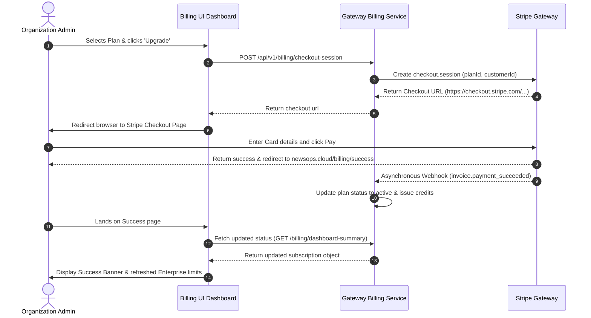

# Billing UI Design
## Purpose
The purpose of the Billing UI is to define the interface specifications, layout guides, component designs, and state models for the Billing, Subscriptions, and Credit Consumption dashboard in NewsOps Cloud. This design allows organization owners and financial officers to view active plans, change billing tiers, examine invoice history, and monitor resource credits through visual interactive charts.

## Executive Summary
The Billing UI consists of three primary modules: the **Subscriptions Table** (for managing plan levels), the **Credit Consumption Charts** (for visual usage audits), and the **Invoicing Dashboard** (for payment histories and receipt downloads). Built with Tailwind CSS, Radix UI primitives, and interactive SVG/Canvas-based charts, this interface integrates directly with Stripe Payment flows and customer portal services.

## Vision
Our vision is to provide 100% cost transparency to SaaS tenants through visual analytics and detailed cost breakouts. By providing real-time warnings when credits run low and giving users an easy-to-use self-service portal, we minimize payment failures, lower support overhead, and increase SaaS plan upgrade rates.

## Scope
The scope of this UI specification includes:
- **Subscriptions Table Grid**: Renders plan matrices, monthly/yearly toggle state, pricing tiers, feature lists, and dynamic checkout redirect CTA controls.
- **Credit Consumption Charts**: Interactive SVG representations of credits consumed over time (7-day, 30-day, and Custom ranges) with categorizations (AI Translation, Scraper Crawling, Social Publishing).
- **Invoicing Dashboard**: List of historical payments, status tags (Success, Refunded, Failed), amount values in local currency, and secure direct-link PDF download components.
- **Payment Method Management Panel**: Stripe billing portal integration indicators, active credit card details card, and update buttons.

## Goals
- **High Speed**: The dashboard shell must render and populate invoice lists in less than 200ms using cached API data.
- **Visual Clarity**: Charts must provide responsive tooltips detailing the timestamp and specific quantity of credits consumed.
- **Mobile First**: All tables and charts must scale to fit screens down to 320px without horizontal scroll leaks.
- **Accessibility Compliance**: Focus states, keyboard control mappings, and aria labels must meet WCAG 2.1 AA guidelines.

## Functional Requirements
- **Billing Interval Switcher**: A global toggle that swaps plan metrics between "Monthly" and "Yearly" pricing with visual discount tags.
- **Real-Time Credit Balance Gauge**: A circular progress bar indicator displaying current available credits out of the monthly allowance, updating via web sockets.
- **Interactive Usage Breakdowns**: Hovering over segment slices of the consumption charts exposes granular usage logs (e.g. Scraped 400 pages for $4.00/400 credits).
- **Invoice Search & Export**: Filter history table by date range and export transaction lines to CSV format.
- **Stripe Checkout Bridges**: Redirect to Stripe Checkout or Billing Portal for billing info updates.

## Non-Functional Requirements
- **Performance Budget**: Initial interactive dashboard layout under 100ms.
- **Responsive Layout**: Recharts/SVG containers must use fluid viewport units (`w-full`, custom aspect ratios) to resize without distortion.
- **Fallback States**: Renders skeleton wireframe overlays when queries are pending, and illustrative empty states when no billing items exist.

## Business Rules
1. **RBAC Controls**: Only Organization Owners (`billing:subscriptions:write`) can view checkout links, upgrade buttons, or trigger billing method updates. Finance roles have read-only access to download invoices and view charts.
2. **Grace Period Warnings**: If a subscription status is `PAST_DUE`, the UI must display a yellow banner at the top of all dashboard sections, warning users of suspension within 7 days.
3. **Proration Displays**: The Subscriptions Table must show clear pricing updates (e.g. "Charged today: $24.50 (prorated)") before submitting a plan upgrade request.

## Actors
- **Organization Owner**: Manage subscription tiers, renew credit cards, purchase extra credit packets.
- **Finance Officer**: Downloads invoice PDFs, monitors monthly credit usage patterns, audits credit spend.
- **Platform Guest/Member**: View current organization limits and request admins to buy more credits when balance runs dry.

## User Stories
1. **As an Organization Owner**, I want to toggle between monthly and yearly billing intervals so that I can see the price discounts available for committing to a yearly cycle.
2. **As a Finance Officer**, I want to look at a credit consumption chart broken down by features (Scraper vs. AI translations) so that I can report to management which tools use the most budget.
3. **As an Organization Admin**, I want to click a link to update our corporate credit card in Stripe without having to contact support, so that I can quickly fix a past-due notice.

## Acceptance Criteria
1. **Interval Switcher**: Swapping the billing cycle selector must update plan cost numbers on the subscription cards instantly without full page reloads.
2. **Alert States**: When credit reserves drop below 15% of the monthly allowance, the credit progress ring must change color from emerald-green to amber-yellow, and a "Buy Credits" button must be highlighted.
3. **History Navigation**: The transaction table must support pagination (10 items per page) and render status indicators matching database values: green for SUCCESS, amber for REFUNDED, and red for FAILED.
4. **Responsive Layout**: The usage chart must recalculate its SVG viewBox dynamically upon screen resizing without breaking the container limits.

## Workflows
1. **Upgrading Subscription Workflow**:
   - Organization Owner logs in and navigates to `/dashboard/billing`.
   - Admin views the **Subscriptions Table** and toggles the billing interval to "Yearly".
   - Admin clicks "Upgrade" on the "Enterprise Plan" card.
   - The UI requests a checkout session from the backend (`POST /api/v1/billing/checkout-session`).
   - The API returns a Stripe Checkout URL.
   - The UI redirects the browser to the secure Stripe page.
   - On payment success, the user returns to NewsOps Cloud, and a socket notification refreshes the active tier indicator.

2. **Auditing Consumption Workflow**:
   - Finance Officer logs in and navigates to the billing section.
   - Officer selects the "Credit Consumption" tab.
   - The UI makes calls to fetch credit usage snapshots over the last 30 days.
   - The SVG bar chart is populated with aggregate metric records.
   - Officer clicks on the "AI Word Generation" segment of the legend; the chart dynamically hides other lines to highlight AI usage.

## API Design
### GET `/api/v1/billing/dashboard-summary`
Fetches active subscription metrics, billing cycles, and current credit allocations.

**Request Headers:**
- `Authorization: Bearer <JWT>`

**Response Payload (200 OK):**
```json
{
  "organizationId": "org_912384912",
  "subscription": {
    "id": "sub_77189201",
    "planName": "Professional Plan",
    "status": "ACTIVE",
    "currentPeriodEnd": "2026-07-27T22:00:00.000Z",
    "cancelAtPeriodEnd": false,
    "amountCents": 9900,
    "interval": "monthly"
  },
  "credits": {
    "balance": 4850,
    "allowance": 10000,
    "warningThreshold": 1500,
    "lastUpdated": "2026-06-27T22:19:15.000Z"
  }
}
```

### GET `/api/v1/billing/transactions`
Retrieves paginated billing transactions and pdf URLs for invoice receipts.

**Request Parameters:**
- `page`: `1`
- `limit`: `10`

**Response Payload (200 OK):**
```json
{
  "transactions": [
    {
      "id": "txn_88190203",
      "date": "2026-06-27T17:19:00.000Z",
      "amount": 99.00,
      "currency": "USD",
      "status": "SUCCESS",
      "stripeInvoiceId": "in_1N23891238",
      "invoicePdfUrl": "https://stripe.com/invoices/inv_912839218.pdf"
    },
    {
      "id": "txn_77189102",
      "date": "2026-05-27T17:19:00.000Z",
      "amount": 99.00,
      "currency": "USD",
      "status": "SUCCESS",
      "stripeInvoiceId": "in_1M98293819",
      "invoicePdfUrl": "https://stripe.com/invoices/inv_882910398.pdf"
    }
  ],
  "pagination": {
    "totalCount": 12,
    "totalPages": 2,
    "currentPage": 1
  }
}
```

### GET `/api/v1/billing/credit-metrics`
Returns credit usage timeseries snapshots to populate the charts.

**Request Parameters:**
- `rangeDays`: `30`

**Response Payload (200 OK):**
```json
{
  "rangeDays": 30,
  "summary": {
    "totalConsumed": 8500,
    "byService": {
      "AI_WORDS": 5200,
      "SCRAPE_PAGES": 2800,
      "SOCIAL_POSTS": 500
    }
  },
  "timeseries": [
    {
      "date": "2026-06-25",
      "ai_words": 150,
      "scrape_pages": 80,
      "social_posts": 10
    },
    {
      "date": "2026-06-26",
      "ai_words": 200,
      "scrape_pages": 90,
      "social_posts": 15
    },
    {
      "date": "2026-06-27",
      "ai_words": 180,
      "scrape_pages": 110,
      "social_posts": 12
    }
  ]
}
```

## Database Design
The dashboard pulls data directly from billing microservices which interact with the following transactional tables.

### Table Relationships
- `plans` contains subscription products and pricing levels.
- `subscriptions` connects organization profiles to plans.
- `transactions` logs Stripe invoice payment attempts.
- `credit_ledgers` tracks the balance adjustments and consumption counts.

## UI Design
The layout uses a 3-section layout design incorporating Tailwind utility grids, responsive flexboxes, and interactive CSS cards.

### 1. Subscriptions Table Component (HTML / Tailwind CSS)
```html
<div class="space-y-6">
  <!-- Plan Toggle Header -->
  <div class="flex items-center justify-between border-b border-slate-200 pb-4">
    <div>
      <h2 class="text-xl font-bold text-slate-900">Subscription Plans</h2>
      <p class="text-sm text-slate-500">Select the plan that fits your newsroom's publishing scales.</p>
    </div>
    <!-- Monthly/Yearly Toggle -->
    <div class="flex items-center bg-slate-100 p-1 rounded-lg border border-slate-200">
      <button class="px-3 py-1.5 text-xs font-semibold rounded bg-white text-slate-950 shadow-sm transition">Monthly</button>
      <button class="px-3 py-1.5 text-xs font-semibold rounded text-slate-500 hover:text-slate-900 transition flex items-center space-x-1">
        <span>Yearly</span>
        <span class="bg-emerald-100 text-emerald-800 text-[10px] px-1.5 py-0.5 rounded-full font-bold">-20%</span>
      </button>
    </div>
  </div>

  <!-- Subscription Pricing Cards Grid -->
  <div class="grid grid-cols-1 md:grid-cols-3 gap-6">
    
    <!-- Plan Card: Starter -->
    <div class="border border-slate-200 rounded-xl bg-white p-6 relative flex flex-col justify-between hover:shadow-md transition">
      <div>
        <h3 class="font-bold text-lg text-slate-900">Starter Plan</h3>
        <p class="text-xs text-slate-500 mt-1">For independent journalists and small blogs.</p>
        <div class="mt-4 flex items-baseline">
          <span class="text-3xl font-extrabold text-slate-950">$29</span>
          <span class="text-slate-500 text-xs ml-1">/ month</span>
        </div>
        <ul class="mt-6 space-y-3 text-xs text-slate-700">
          <li class="flex items-center"><svg class="w-4 h-4 text-emerald-500 mr-2" fill="none" stroke="currentColor" viewBox="0 0 24 24"><path stroke-linecap="round" stroke-linejoin="round" stroke-width="3" d="M5 13l4 4L19 7"/></svg>Up to 3 active users</li>
          <li class="flex items-center"><svg class="w-4 h-4 text-emerald-500 mr-2" fill="none" stroke="currentColor" viewBox="0 0 24 24"><path stroke-linecap="round" stroke-linejoin="round" stroke-width="3" d="M5 13l4 4L19 7"/></svg>1,000 crawler page credits/mo</li>
          <li class="flex items-center"><svg class="w-4 h-4 text-emerald-500 mr-2" fill="none" stroke="currentColor" viewBox="0 0 24 24"><path stroke-linecap="round" stroke-linejoin="round" stroke-width="3" d="M5 13l4 4L19 7"/></svg>500 social queue slots</li>
        </ul>
      </div>
      <button class="w-full mt-8 bg-slate-100 hover:bg-slate-200 text-slate-800 text-xs font-bold py-2 px-4 rounded transition">Downgrade Plan</button>
    </div>

    <!-- Plan Card: Professional (Active) -->
    <div class="border-2 border-indigo-600 rounded-xl bg-white p-6 relative flex flex-col justify-between shadow-lg">
      <div class="absolute -top-3 left-1/2 transform -translate-x-1/2 bg-indigo-600 text-white text-[10px] font-extrabold px-3 py-1 rounded-full uppercase tracking-wider">Active Tier</div>
      <div>
        <h3 class="font-bold text-lg text-slate-900">Professional Plan</h3>
        <p class="text-xs text-slate-500 mt-1">Perfect for fast-paced mid-sized newsrooms.</p>
        <div class="mt-4 flex items-baseline">
          <span class="text-3xl font-extrabold text-slate-950">$99</span>
          <span class="text-slate-500 text-xs ml-1">/ month</span>
        </div>
        <ul class="mt-6 space-y-3 text-xs text-slate-700">
          <li class="flex items-center"><svg class="w-4 h-4 text-emerald-500 mr-2" fill="none" stroke="currentColor" viewBox="0 0 24 24"><path stroke-linecap="round" stroke-linejoin="round" stroke-width="3" d="M5 13l4 4L19 7"/></svg>Up to 15 active users</li>
          <li class="flex items-center"><svg class="w-4 h-4 text-emerald-500 mr-2" fill="none" stroke="currentColor" viewBox="0 0 24 24"><path stroke-linecap="round" stroke-linejoin="round" stroke-width="3" d="M5 13l4 4L19 7"/></svg>10,000 crawler page credits/mo</li>
          <li class="flex items-center"><svg class="w-4 h-4 text-emerald-500 mr-2" fill="none" stroke="currentColor" viewBox="0 0 24 24"><path stroke-linecap="round" stroke-linejoin="round" stroke-width="3" d="M5 13l4 4L19 7"/></svg>5,000 AI word credits/mo</li>
          <li class="flex items-center"><svg class="w-4 h-4 text-emerald-500 mr-2" fill="none" stroke="currentColor" viewBox="0 0 24 24"><path stroke-linecap="round" stroke-linejoin="round" stroke-width="3" d="M5 13l4 4L19 7"/></svg>Unlimited social channel queues</li>
        </ul>
      </div>
      <button class="w-full mt-8 bg-slate-900 text-white text-xs font-bold py-2 px-4 rounded cursor-default" disabled>Current Subscription</button>
    </div>

    <!-- Plan Card: Enterprise -->
    <div class="border border-slate-200 rounded-xl bg-white p-6 relative flex flex-col justify-between hover:shadow-md transition">
      <div>
        <h3 class="font-bold text-lg text-slate-900">Enterprise Plan</h3>
        <p class="text-xs text-slate-500 mt-1">Custom limits for enterprise media conglomerates.</p>
        <div class="mt-4 flex items-baseline">
          <span class="text-3xl font-extrabold text-slate-950">$299</span>
          <span class="text-slate-500 text-xs ml-1">/ month</span>
        </div>
        <ul class="mt-6 space-y-3 text-xs text-slate-700">
          <li class="flex items-center"><svg class="w-4 h-4 text-emerald-500 mr-2" fill="none" stroke="currentColor" viewBox="0 0 24 24"><path stroke-linecap="round" stroke-linejoin="round" stroke-width="3" d="M5 13l4 4L19 7"/></svg>Unlimited active users</li>
          <li class="flex items-center"><svg class="w-4 h-4 text-emerald-500 mr-2" fill="none" stroke="currentColor" viewBox="0 0 24 24"><path stroke-linecap="round" stroke-linejoin="round" stroke-width="3" d="M5 13l4 4L19 7"/></svg>100,000 crawler page credits/mo</li>
          <li class="flex items-center"><svg class="w-4 h-4 text-emerald-500 mr-2" fill="none" stroke="currentColor" viewBox="0 0 24 24"><path stroke-linecap="round" stroke-linejoin="round" stroke-width="3" d="M5 13l4 4L19 7"/></svg>50,000 AI word credits/mo</li>
          <li class="flex items-center"><svg class="w-4 h-4 text-emerald-500 mr-2" fill="none" stroke="currentColor" viewBox="0 0 24 24"><path stroke-linecap="round" stroke-linejoin="round" stroke-width="3" d="M5 13l4 4L19 7"/></svg>Dedicated scraper IPs</li>
        </ul>
      </div>
      <button class="w-full mt-8 bg-indigo-600 hover:bg-indigo-700 text-white text-xs font-bold py-2 px-4 rounded transition">Upgrade Plan</button>
    </div>

  </div>
</div>
```

### 2. Credit Consumption Charts (HTML / SVG)
Below is an SVG render pattern showing daily credits consumed over time.
```html
<div class="border border-slate-200 rounded-xl bg-white p-6">
  <div class="flex items-center justify-between mb-6">
    <div>
      <h3 class="text-base font-bold text-slate-900">Credit Consumption Chart</h3>
      <p class="text-xs text-slate-500">Daily credit usage breakdown over the past week.</p>
    </div>
    <div class="flex space-x-2">
      <span class="flex items-center text-xs text-slate-500"><span class="w-3 h-3 rounded-full bg-indigo-600 mr-1.5"></span>AI Generation</span>
      <span class="flex items-center text-xs text-slate-500"><span class="w-3 h-3 rounded-full bg-amber-500 mr-1.5"></span>Crawling</span>
      <span class="flex items-center text-xs text-slate-500"><span class="w-3 h-3 rounded-full bg-emerald-500 mr-1.5"></span>Social Pub</span>
    </div>
  </div>

  <!-- SVG Chart Container -->
  <div class="relative w-full h-64">
    <svg class="w-full h-full" viewBox="0 0 600 240" fill="none" xmlns="http://www.w3.org/2000/svg">
      <!-- Grid Lines -->
      <line x1="40" y1="20" x2="580" y2="20" stroke="#e2e8f0" stroke-dasharray="4 4" />
      <line x1="40" y1="70" x2="580" y2="70" stroke="#e2e8f0" stroke-dasharray="4 4" />
      <line x1="40" y1="120" x2="580" y2="120" stroke="#e2e8f0" stroke-dasharray="4 4" />
      <line x1="40" y1="170" x2="580" y2="170" stroke="#e2e8f0" stroke-dasharray="4 4" />
      <line x1="40" y1="210" x2="580" y2="210" stroke="#cbd5e1" stroke-width="1.5" />

      <!-- Left Axis Y Values -->
      <text x="15" y="24" fill="#64748b" font-size="10" font-family="sans-serif">200</text>
      <text x="15" y="74" fill="#64748b" font-size="10" font-family="sans-serif">150</text>
      <text x="15" y="124" fill="#64748b" font-size="10" font-family="sans-serif">100</text>
      <text x="15" y="174" fill="#64748b" font-size="10" font-family="sans-serif">50</text>
      <text x="20" y="214" fill="#64748b" font-size="10" font-family="sans-serif">0</text>

      <!-- Bottom X Axis Label (Days) -->
      <text x="75" y="230" fill="#64748b" font-size="10" font-family="sans-serif" text-anchor="middle">Jun 21</text>
      <text x="155" y="230" fill="#64748b" font-size="10" font-family="sans-serif" text-anchor="middle">Jun 22</text>
      <text x="235" y="230" fill="#64748b" font-size="10" font-family="sans-serif" text-anchor="middle">Jun 23</text>
      <text x="315" y="230" fill="#64748b" font-size="10" font-family="sans-serif" text-anchor="middle">Jun 24</text>
      <text x="395" y="230" fill="#64748b" font-size="10" font-family="sans-serif" text-anchor="middle">Jun 25</text>
      <text x="475" y="230" fill="#64748b" font-size="10" font-family="sans-serif" text-anchor="middle">Jun 26</text>
      <text x="555" y="230" fill="#64748b" font-size="10" font-family="sans-serif" text-anchor="middle">Jun 27</text>

      <!-- Consumption Stacked Bars -->
      <!-- Jun 21: AI (40) + Crawl (20) + Social (10) = 70 -->
      <rect x="67" y="170" width="16" height="40" fill="#6366f1" rx="2" />
      <rect x="67" y="150" width="16" height="20" fill="#f59e0b" rx="2" />
      <rect x="67" y="140" width="16" height="10" fill="#10b981" rx="2" />

      <!-- Jun 22: AI (60) + Crawl (40) + Social (15) = 115 -->
      <rect x="147" y="150" width="16" height="60" fill="#6366f1" rx="2" />
      <rect x="147" y="110" width="16" height="40" fill="#f59e0b" rx="2" />
      <rect x="147" y="95" width="16" height="15" fill="#10b981" rx="2" />

      <!-- Jun 23: AI (80) + Crawl (20) + Social (10) = 110 -->
      <rect x="227" y="130" width="16" height="80" fill="#6366f1" rx="2" />
      <rect x="227" y="110" width="16" height="20" fill="#f59e0b" rx="2" />
      <rect x="227" y="100" width="16" height="10" fill="#10b981" rx="2" />

      <!-- Jun 24: AI (120) + Crawl (50) + Social (20) = 190 -->
      <rect x="307" y="90" width="16" height="120" fill="#6366f1" rx="2" />
      <rect x="307" y="40" width="16" height="50" fill="#f59e0b" rx="2" />
      <rect x="307" y="20" width="16" height="20" fill="#10b981" rx="2" />

      <!-- Jun 25: AI (100) + Crawl (30) + Social (10) = 140 -->
      <rect x="387" y="110" width="16" height="100" fill="#6366f1" rx="2" />
      <rect x="387" y="80" width="16" height="30" fill="#f59e0b" rx="2" />
      <rect x="387" y="70" width="16" height="10" fill="#10b981" rx="2" />

      <!-- Jun 26: AI (130) + Crawl (40) + Social (10) = 180 -->
      <rect x="467" y="80" width="16" height="130" fill="#6366f1" rx="2" />
      <rect x="467" y="40" width="16" height="40" fill="#f59e0b" rx="2" />
      <rect x="467" y="30" width="16" height="10" fill="#10b981" rx="2" />

      <!-- Jun 27: AI (150) + Crawl (30) + Social (12) = 192 -->
      <rect x="547" y="60" width="16" height="150" fill="#6366f1" rx="2" />
      <rect x="547" y="30" width="16" height="30" fill="#f59e0b" rx="2" />
      <rect x="547" y="18" width="16" height="12" fill="#10b981" rx="2" />
    </svg>
  </div>
</div>
```

### 3. Invoicing Dashboard Component (HTML / Tailwind CSS)
```html
<div class="border border-slate-200 rounded-xl bg-white p-6">
  <div class="flex items-center justify-between border-b border-slate-100 pb-4 mb-4">
    <div>
      <h3 class="text-base font-bold text-slate-900">Invoice History</h3>
      <p class="text-xs text-slate-500">View and download transaction receipts billing statements.</p>
    </div>
    <button class="bg-white hover:bg-slate-50 border border-slate-200 text-slate-800 text-xs font-bold py-1.5 px-3 rounded flex items-center space-x-1.5 transition">
      <span>Export CSV</span>
    </button>
  </div>

  <!-- Table -->
  <div class="overflow-x-auto">
    <table class="w-full text-left text-xs font-sans text-slate-700">
      <thead>
        <tr class="bg-slate-50 text-slate-500 uppercase tracking-wider text-[10px] font-semibold border-b border-slate-200">
          <th class="py-3 px-4">Invoice ID</th>
          <th class="py-3 px-4">Date</th>
          <th class="py-3 px-4">Amount</th>
          <th class="py-3 px-4">Status</th>
          <th class="py-3 px-4 text-right">Receipt</th>
        </tr>
      </thead>
      <tbody class="divide-y divide-slate-100">
        
        <tr class="hover:bg-slate-50 transition">
          <td class="py-3.5 px-4 font-mono font-medium text-slate-900">in_1N23891238</td>
          <td class="py-3.5 px-4 text-slate-500">Jun 27, 2026</td>
          <td class="py-3.5 px-4 font-semibold text-slate-900">$99.00 USD</td>
          <td class="py-3.5 px-4">
            <span class="bg-emerald-100 text-emerald-800 text-[10px] px-2 py-0.5 rounded-full font-bold">Paid</span>
          </td>
          <td class="py-3.5 px-4 text-right">
            <a href="#" class="text-indigo-600 hover:text-indigo-900 font-bold flex items-center justify-end space-x-1">
              <span>PDF</span>
              <svg class="w-3.5 h-3.5" fill="none" stroke="currentColor" viewBox="0 0 24 24"><path stroke-linecap="round" stroke-linejoin="round" stroke-width="2.5" d="M4 16v1a3 3 0 003 3h10a3 3 0 003-3v-1m-4-4l-4 4m0 0l-4-4m4 4V4"/></svg>
            </a>
          </td>
        </tr>

        <tr class="hover:bg-slate-50 transition">
          <td class="py-3.5 px-4 font-mono font-medium text-slate-900">in_1M98293819</td>
          <td class="py-3.5 px-4 text-slate-500">May 27, 2026</td>
          <td class="py-3.5 px-4 font-semibold text-slate-900">$99.00 USD</td>
          <td class="py-3.5 px-4">
            <span class="bg-emerald-100 text-emerald-800 text-[10px] px-2 py-0.5 rounded-full font-bold">Paid</span>
          </td>
          <td class="py-3.5 px-4 text-right">
            <a href="#" class="text-indigo-600 hover:text-indigo-900 font-bold flex items-center justify-end space-x-1">
              <span>PDF</span>
              <svg class="w-3.5 h-3.5" fill="none" stroke="currentColor" viewBox="0 0 24 24"><path stroke-linecap="round" stroke-linejoin="round" stroke-width="2.5" d="M4 16v1a3 3 0 003 3h10a3 3 0 003-3v-1m-4-4l-4 4m0 0l-4-4m4 4V4"/></svg>
            </a>
          </td>
        </tr>

        <tr class="hover:bg-slate-50 transition">
          <td class="py-3.5 px-4 font-mono font-medium text-slate-900">in_1L82103982</td>
          <td class="py-3.5 px-4 text-slate-500">Apr 27, 2026</td>
          <td class="py-3.5 px-4 font-semibold text-slate-900">$99.00 USD</td>
          <td class="py-3.5 px-4">
            <span class="bg-red-100 text-red-800 text-[10px] px-2 py-0.5 rounded-full font-bold">Failed</span>
          </td>
          <td class="py-3.5 px-4 text-right text-slate-400 font-semibold">-</td>
        </tr>

      </tbody>
    </table>
  </div>
</div>
```

## Permissions
Access control filters are mapped inside the frontend routing guards:
- `billing:subscriptions:read` - Read access for downloading invoices, loading active balance gauges.
- `billing:subscriptions:write` - Admin authorization to perform plan adjustments, select packages, and access Stripe billing portals.
- `billing:credits:read` - Allows loading timeseries parameters and consumption charts.

## Security
- **Stripe SDK Sandbox Isolation**: Stripe.js library calls must load securely from the official Stripe scripts domain. Local inputs must never process raw card numbers.
- **CSRF Token Injection**: Upgrade requests `/api/v1/billing/checkout-session` must contain custom HTTP headers mapping CSRF values.
- **Parameter Validation**: Validate that page counters and ranges requested for charts are integers within acceptable ranges to prevent SQL injection.

## Performance
- **Dashboard Load Budget**: 150ms.
- **Visual Rendering Target**: Charts must run using standard canvas or fast SVG bindings to prevent main thread lags.
- **Cache Mappings**: User billing plans and active statuses are cached in client-side state managers to prevent redundant API queries.

## Monitoring
- `billing_dashboard_load_time_ms`: Gauge tracking total load latency for client metrics queries.
- `billing_stripe_redirect_failures`: Counter tracking failures to fetch valid session redirects.
- `billing_invoice_pdf_errors`: Counter tracking requests for PDFs returning broken paths.

## Logging
Action event traces recorded on user activities:
```json
{
  "timestamp": "2026-06-27T22:48:06.456Z",
  "level": "INFO",
  "module": "billing-dashboard-ui",
  "message": "User initiated Stripe billing portal redirection request",
  "context": {
    "organization_id": "org_912384912",
    "user_id": "usr_77189102",
    "active_plan": "pln_882918390"
  }
}
```

## Error Handling
| Error Code | HTTP Status | Logged Level | Customer-Facing Message | Description |
|---|---|---|---|---|
| `STRIPE_PORTAL_CONNECTION_DOWN` | `502` | `ERROR` | "Payment Gateway is temporarily unreachable. Please try again." | Upstream Stripe connection is down. |
| `CHECKOUT_SESSION_UNAUTHORIZED` | `403` | `WARN` | "You do not have administrative permission to modify plans." | Non-admin role attempted to request upgraded package checkout URLs. |
| `INVOICE_NOT_FOUND` | `404` | `INFO` | "The requested billing invoice could not be located." | PDF link requested refers to a missing Stripe invoice record. |

## Edge Cases
- **Simultaneous Upgrades**: If a user opens two browser tabs and submits two different upgrades concurrently, the backend serializes the request using stripe event matching, while the UI displays a processing spinner disabling duplicate clicks.
- **Card Expiring Warnings**: The UI detects that the connected card expires before the next renewal date and prompts a subtle warning button in the profile section.

## Future Improvements
- **Predictive Credit Billing**: Introduce machine learning forecasts within the Credit Consumption Charts to predict the date of credit depletion based on weekly trend variations.
- **Multi-Tenant Invoice Splits**: Enable sub-account cost tracking features inside the logs table.

## Mermaid Diagrams
Below is the sequence flow mapping a plan upgrade request from the dashboard to Stripe completion.



## References
- Database Billing & Subscription Schema: [Billing Schema](../03-database/billing_and_subscriptions_schema.md)
- SaaS Tenant Models: [Tenant Tiering Model](../01-business/tenant_tiering_model.md)
- Monetization Strategy Layout: [Monetization Strategy](../01-business/monetization_strategy.md)
