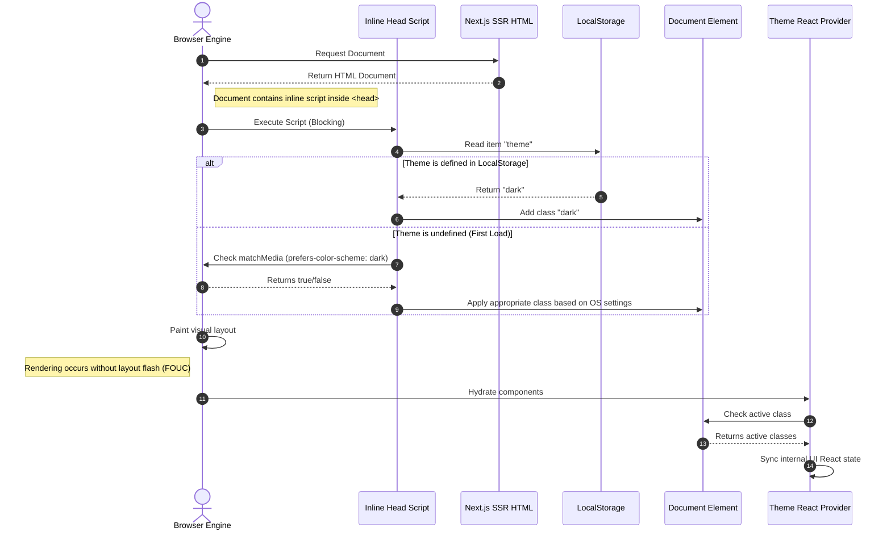

# Dark Mode Theme Design

## Purpose
This document outlines the architectural specifications and design standards for the dark mode theme implementation across the NewsOps Cloud digital publishing platform. It details HSL color mappings, transitions, and user preference storage mechanisms to ensure a seamless, high-performance, and visually consistent user experience across administrative dashboards, editorial rooms, and public-facing reader frontends.

## Executive Summary
NewsOps Cloud requires a robust, high-contrast, multi-tenant UI theme engine that dynamically adjusts to user preferences and system settings. The styling system leverages CSS Custom Properties defined using HSL (Hue, Saturation, Lightness) color models integrated with Tailwind CSS. Storage preferences are managed client-side using localStorage, with a lightweight, blocking script in the document `<head>` to eliminate "flash of unstyled content" (FOUC). Preferences are synced asynchronously to the PostgreSQL user profile for authenticated users. This design satisfies WCAG 2.2 Level AA/AAA contrast guidelines, integrates standard micro-transitions, and supports tenant-specific branding overrides.

## Vision
Our vision is to deliver an adaptive, developer-friendly theme engine that empowers tenants to maintain brand identity in both light and dark modes. By standardizing on HSL color interpolation, components automatically adjust visual weight, allowing publishers to create dark experiences that are both beautiful and fully accessible without duplicating stylesheets or adding runtime JavaScript overhead during page renders.

## Scope
This design document covers:
1. **HSL Color Variable Mapping**: Base theme tokens, status colors, and contrast pairs for light and dark modes.
2. **FOUC Prevention and Preference Synchronization**: Client-side storage configurations and critical-path scripting.
3. **Tailwind CSS Integration**: Configuration templates, utility extensions, and custom branding overrides.
4. **Theme Toggle Workflows**: Interaction cycles for system defaults, light mode overrides, and dark mode overrides.

It does not cover:
- Dynamic CSS generation for client-side custom layouts built in the Site Publisher editor (handled in [site_publisher_templates.md](./site_publisher_templates.md)).
- Graphics asset transformations (e.g., automated image inversion or SVG re-coloring engines).

## Goals
- **Zero Flash of Light Theme**: Ensure theme resolution occurs before initial layout paint (< 8ms execution).
- **Compliance with WCAG Standards**: Maintain text contrast ratios of at least 4.5:1 (Level AA) for regular body copy and 7:1 (Level AAA) for headers.
- **Minimal Asset Size**: Restrict the theme initialization script to less than 1.5 KB to prevent blocking critical rendering paths.
- **Deterministic Color Extensibility**: Provide clear HSL-based mappings so custom modules can resolve contrast pairs automatically.

## Functional Requirements
- **System Preference Auto-Detection**: The system must automatically read `prefers-color-scheme` media queries to default to the client OS preference.
- **Three-State Theme Selection**: Provide three user states: "Light", "Dark", and "System".
- **Real-Time Client Updates**: Changing the theme state must update the class token on the root `<html>` element instantly.
- **Branding Overrides**: Administrative portal must support HSL configuration sliders for branding colors (Primary, Accent, Background) which instantly populate database variables and generate dynamic CSS variable sheets.

## Non-Functional Requirements
- **Theme State Transition Timing**: Theme state switches must take no longer than 150ms using hardware-accelerated CSS properties.
- **Local Storage Latency**: Local storage read/writes must be asynchronous or sub-millisecond, keeping thread execution unblocked.
- **Server-Side Render (SSR) Hydration**: SSR frameworks (Next.js/Remix) must align with the theme state loaded by the head script to prevent hydration mismatches.

## Business Rules
- **Accessible Branding**: Tenant admins configuring custom dark themes must be restricted from setting a primary background and text color combination that results in a contrast ratio below 4.5:1. The console will display a warning and block saving if the test fails.
- **Preference Hierarchy**: User-explicit theme selections ("Light" or "Dark") override system/OS preferences. If no preferences are set, system preferences are applied. If system preferences are unreadable, light mode acts as the global fallback.
- **Anonymous Session Preservation**: Theme choices made by guest users must be saved in cookies or localStorage and mapped to their guest session ID for consistent rendering across repeat visits.

## Actors
- **End Reader**: Browses the published site; expects theme to adapt to their preference or choice.
- **Editorial User**: Authors articles in the workspace; needs low-strain dark workspace for late-night editing.
- **Tenant Administrator**: Controls branding colors and applies custom dark theme overrides.
- **Core UI Engine**: Injects theme properties and coordinates state.

## User Stories
- **User Story 1**: As an editorial user working late shifts, I want to switch my NewsOps editor dashboard to dark mode so that my eyes do not feel strained during long editing sessions.
- **User Story 2**: As a reader with light sensitivity, I want the news portal to automatically detect my operating system's dark mode preference when I visit the site for the first time so that I do not experience sudden glare.
- **User Story 3**: As a Tenant Administrator, I want to enter our brand's custom HSL color values for our dark theme in the console and test if they meet accessibility standards before publishing them.

## Acceptance Criteria
- **AC 1**: Toggling the theme dropdown must set `localStorage.setItem('theme', 'dark')` and append the `.dark` class to the `<html>` document tag within 5ms.
- **AC 2**: The core brand color palette configuration portal must run a WCAG 2.2 contrast formula test when saving, returning an validation error `ERR_CONTRAST_VIOLATION` if the ratio is less than 4.5:1.
- **AC 3**: The inline head script that detects and applies the theme from `localStorage` or `matchMedia` must execute blockingly, immediately following the `<head>` tag and before any style sheet or body tag executes.

## Workflows

### Theme Initialization Workflow
1. The browser requests the page from the edge server.
2. The edge server returns HTML containing a blocking script placed at the top of the `<head>` node.
3. The script evaluates `localStorage.theme` and checks for "dark", "light", or if absent, parses the media query `window.matchMedia('(prefers-color-scheme: dark)').matches`.
4. The script appends the `.dark` class or removes it.
5. The browser processes styles using standard CSS variables resolved based on the root class.
6. Once the page is hydrated, the React theme provider initializes state variables using the DOM element class.

### Theme Synchronization Workflow
1. The authenticated user alters their theme preferences in the user settings UI.
2. The client application dispatches a theme toggle action.
3. The client updates `localStorage` and the DOM `<html>` node.
4. The React framework triggers an API call (`PUT /api/v1/users/preferences`) to persist the selection in the user's PostgreSQL record.
5. If the request fails, the local state is retained, but a sync warning is flagged, and a retry is queued for the next network reload.

## API Design

### Sync Theme Preferences
Saves the user's explicit theme preference to their profile database.

* **URL**: `/api/v1/users/preferences`
* **Method**: `PUT`
* **Headers**:
  * `Authorization: Bearer <JWT>`
  * `Content-Type: application/json`
* **Request Payload**:
```json
{
  "themePreference": "dark",
  "syncLocalStorage": true,
  "timezone": "America/New_York"
}
```
* **Response Payload (200 OK)**:
```json
{
  "status": "success",
  "userId": "usr_78ab89d8",
  "preferences": {
    "themePreference": "dark",
    "updatedAt": "2026-06-27T22:50:00Z"
  }
}
```

### Validate and Save Custom Tenant Palette
Allows Tenant Administrators to upload custom HSL mappings.

* **URL**: `/api/v1/tenant/theme`
* **Method**: `POST`
* **Headers**:
  * `Authorization: Bearer <JWT>`
  * `Content-Type: application/json`
* **Request Payload**:
```json
{
  "tenantId": "ten_99182a",
  "themeName": "midnight-blue",
  "palette": {
    "light": {
      "background": "0 0% 100%",
      "foreground": "222 47% 11%",
      "primary": "222.2 47.4% 11.2%"
    },
    "dark": {
      "background": "222 47% 11%",
      "foreground": "210 40% 98%",
      "primary": "217.2 32.6% 17.5%"
    }
  }
}
```
* **Response Payload (200 OK)**:
```json
{
  "status": "validated_and_saved",
  "contrastRatio": {
    "primaryBackgroundToForeground": 11.2,
    "verdict": "PASS_AAA"
  },
  "publishedAt": "2026-06-27T22:50:15Z"
}
```

## Database Design

To support persistent preferences, the core users schema and the tenant customization schemas are detailed.

### `user_preferences` Table
Identifies theme selections linked to user identities.
- `user_id`: VARCHAR(30) (Primary Key, Foreign Key to `users.id`)
- `theme_preference`: VARCHAR(10) (Enum: 'light', 'dark', 'system', default 'system')
- `contrast_enhancement`: BOOLEAN (default false)
- `updated_at`: TIMESTAMP WITH TIME ZONE

### `tenant_themes` Table
Stores custom branding specifications.
- `tenant_id`: VARCHAR(30) (Primary Key, Foreign Key to `tenants.id`)
- `primary_hue`: INTEGER (0-360)
- `primary_saturation`: INTEGER (0-100)
- `primary_lightness_light`: INTEGER (0-100)
- `primary_lightness_dark`: INTEGER (0-100)
- `bg_hue`: INTEGER (0-360)
- `bg_saturation`: INTEGER (0-100)
- `bg_lightness_light`: INTEGER (0-100)
- `bg_lightness_dark`: INTEGER (0-100)
- `created_at`: TIMESTAMP WITH TIME ZONE
- `updated_at`: TIMESTAMP WITH TIME ZONE

*Index*: Unique index on `tenant_id` to guarantee instant lookup during SSR requests.

## UI Design

### Component Tokens (CSS & Tailwind Configuration)
Theme colors are configured using standard HSL bindings in CSS.

```css
/* Core tailwind base styles template */
@theme {
  --color-background: hsl(var(--background));
  --color-foreground: hsl(var(--foreground));
  --color-primary: hsl(var(--primary));
  --color-primary-foreground: hsl(var(--primary-foreground));
  --color-card: hsl(var(--card));
  --color-card-foreground: hsl(var(--card-foreground));
  --color-border: hsl(var(--border));
}

@layer base {
  :root {
    --background: 0 0% 100%;
    --foreground: 222.2 84% 4.9%;
    --card: 0 0% 100%;
    --card-foreground: 222.2 84% 4.9%;
    --primary: 222.2 47.4% 11.2%;
    --primary-foreground: 210 40% 98%;
    --border: 214.3 31.8% 91.4%;
  }

  .dark {
    --background: 222.2 84% 4.9%;
    --foreground: 210 40% 98%;
    --card: 222.2 84% 4.9%;
    --card-foreground: 210 40% 98%;
    --primary: 210 40% 98%;
    --primary-foreground: 222.2 47.4% 11.2%;
    --border: 217.2 32.6% 17.5%;
  }
}
```

### Transition and Anti-Flicker Execution Script
To prevent theme flashes on page loads:

```html
<script>
  (function () {
    try {
      var theme = localStorage.getItem('theme');
      var systemDark = window.matchMedia('(prefers-color-scheme: dark)').matches;
      if (theme === 'dark' || (!theme && systemDark)) {
        document.documentElement.classList.add('dark');
      } else {
        document.documentElement.classList.remove('dark');
      }
    } catch (e) {
      console.warn('Theme init script error:', e);
    }
  })();
</script>
```

### Transition Smoothness Variable
Transitions between theme states are governed by CSS transitions applied to specific properties:

```css
.theme-transition,
.theme-transition *,
.theme-transition *:before,
.theme-transition *:after {
  transition: background-color 150ms cubic-bezier(0.4, 0, 0.2, 1),
              border-color 150ms cubic-bezier(0.4, 0, 0.2, 1),
              color 150ms cubic-bezier(0.4, 0, 0.2, 1),
              fill 150ms cubic-bezier(0.4, 0, 0.2, 1),
              stroke 150ms cubic-bezier(0.4, 0, 0.2, 1) !important;
  transition-delay: 0s !important;
}
```

## Permissions
- `preferences:read`: View current active theme setup and user configurations.
- `preferences:write`: Permit toggling theme and settings overrides.
- `tenant_branding:write`: Modify the base colors and compile custom theme variations.

## Security
- **Strict CSS Input Validation**: Custom tenant hue, saturation, and lightness inputs must be parsed as integers matching standard boundaries (Hue: 0-360, Saturation: 0-100, Lightness: 0-100) to prevent stylesheet exploits (CSS Injection).
- **Sanitizing Injected Dynamic Styling**: Dynamically served theme variables must be loaded via isolated custom-properties blocks generated on the server rather than direct CSS string concatenations inside template queries.

## Performance
- **FOUC Prevention Latency**: Script size must remain below 1.5 KB to resolve and execute within $< 8\text{ ms}$ on mobile browsers.
- **Transition Execution Overhead**: Restrict transitions to composite properties (color, background-color, border-color, opacity) and avoid animating dimensions (width, height, margins) during theme toggles to keep layout shifts (CLS) at 0.0.
- **Edge Caching**: Tenant brand CSS sheets must be cached globally on CDN endpoints using cache-control instructions of `max-age=31536000` (immutable), with version hashes updated when tenant modifications occur.

## Monitoring
- **Prometheus Metric**: `theme_toggle_events_total` (Tracks how frequently users manually adjust the theme settings).
- **Prometheus Metric**: `theme_hydration_mismatch_total` (Tracks inconsistencies between SSR initial renders and final client hydration results).
- **Alert Trigger**: Trigger page-load warning metrics if `theme_hydration_mismatch_total` exceeds 1.5% of total page loads in a 5-minute period.

## Logging
Logger output is formatted in structured JSON.
* **Theme Customization Saved**:
`{"timestamp": "2026-06-27T22:51:30.102Z", "level": "INFO", "context": "TenantThemeService", "message": "Custom tenant HSL palette configured and validated", "tenant_id": "ten_99182a", "compliance_level": "AAA"}`
* **Hydration Mismatch Warning**:
`{"timestamp": "2026-06-27T22:52:12.441Z", "level": "WARN", "context": "ThemeClientHydrator", "message": "Hydration theme mismatch: Server expected light, Client loaded dark", "client_agent": "Mozilla/5.0..."}`

## Error Handling
| Internal Error Code | HTTP Status | Customer-Facing Message |
|:---|:---|:---|
| `ERR_CONTRAST_VIOLATION` | 400 Bad Request | The custom color scheme selected fails accessibility guidelines. Please increase text contrast. |
| `ERR_THEME_SAVE_FAILED` | 500 Internal Error | Unable to update theme preferences. Please check your network and try again. |
| `ERR_INVALID_HSL_VALUE` | 400 Bad Request | The values entered for HSL are invalid. H, S, and L must be integer values within their limits. |

## Edge Cases
- **System Theme Inversion Loop**: If an OS switches themes continuously (due to automation or script execution errors), the event listener on `matchMedia` can trigger layout cascades. The system dampens execution by implementing a 250ms debounce window on theme-change handlers.
- **Corrupt LocalStorage Value**: If a user sets `theme` to a random string (e.g., `theme = "exploit"`), the head script sanitizes the input by verifying if it matches a strict list of allowed values (`"light" | "dark" | "system"`). If not, it defaults directly to `"system"`.
- **Hybrid SSR Delivery**: If the server resolves a page request and generates static markup expecting light theme, but the user's browser is dark, a visual mismatch occurs. To mitigate this, server frameworks inject a hidden visibility style (`body { visibility: hidden; }`) that is removed immediately after the theme script resolves the client state.

## Future Improvements
- **Automatic Solar Tracking**: Allow editorial dashboards to automatically schedule theme modifications matching local sunset and sunrise times computed via geolocation coordinates.
- **AI Contrast Optimizer**: Build an optimization helper that accepts any primary branding color and automatically shifts HSL lightness parameters to calculate compliant dark and light themes dynamically.

## Mermaid Diagrams

Below is a sequence diagram detailing the critical execution path of theme initialization and client hydration:



## References
- Accessibility Standards Guidelines: [accessibility_standards_ui.md](./accessibility_standards_ui.md)
- Micro-Animations Specification: [micro_animations.md](./micro_animations.md)
- Site Publisher Templates: [site_publisher_templates.md](./site_publisher_templates.md)
- User Authentication Settings: [authentication_protocols.md](../10-security/authentication_protocols.md)
