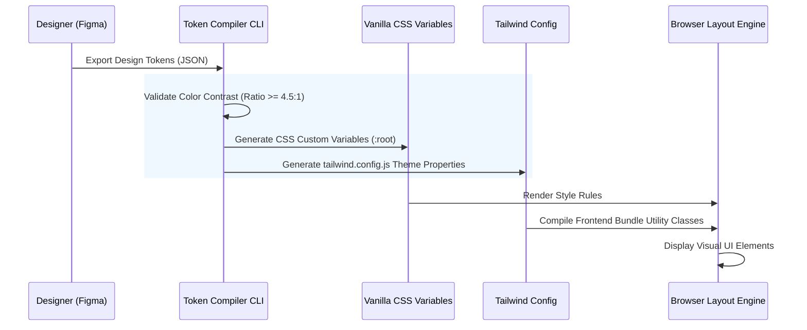

# Design Tokens Specification

## Purpose
This document specifies the style variables and configuration properties (design tokens) that govern the visual appearance of the NewsOps Cloud digital publishing platform. It defines color palettes, typography, spacing scales, border metrics, and shadow definitions, establishing both raw vanilla CSS custom properties and matching Tailwind CSS configuration patterns.

## Executive Summary
Visual consistency across the NewsOps Cloud ecosystem relies on a shared design language. This specification translates layout design rules into code variables. By defining tokens for colors (base, dark-mode, high-contrast), typography weights, modular spacing, and visual elevation levels, we establish a deterministic rendering engine that can be maintained in a single JSON schema and built out to vanilla CSS and Tailwind files.

## Vision
Our vision is a completely unified user experience where every UI component uses tokenized constants. If the brand identity changes, adjustments to a single design token file will propagate instantly across the entire frontend repository, guaranteeing visual uniformity across editorial studios, developer consoles, and reader-facing dashboards.

## Scope
The scope of this document includes:
- **Color Systems**: Base palettes, semantic indicators (success, warning, error, info), system states (hover, focus, disabled, active).
- **Spacing Scale**: A mathematical scale for padding, margins, gaps, and structural alignment.
- **Typography Scale**: Font faces, weights, font sizes, line heights, and letter spacing.
- **Borders & Radii**: Stroke weights, styling options, and rounded corner specifications.
- **Shadows & Elevation**: Z-index listings and box shadow intensities for spatial hierarchy.
- **Vanilla CSS Variables & Tailwind Configurations**: Side-by-side implementation syntax mapping.

## Goals
1. Establish a single source of truth for all styling rules across NewsOps Cloud.
2. Eliminate hardcoded CSS values (magic numbers) in the codebase.
3. Provide consistent dark-mode styling mappings using native CSS classes.
4. Support WCAG 2.1 AA accessibility contrast ratios for all color configurations.

## Functional Requirements
1. **Dynamic CSS Variables Mapping**: Maintain all styling rules as native CSS custom properties inside a global `:root` scope.
2. **Tailwind Config Compatibility**: Map 100% of these CSS custom properties into a standard Tailwind configuration file.
3. **Contrast-Compliant Palettes**: Ensure all foreground/background color combinations conform to the minimum 4.5:1 contrast ratio.
4. **Fluid Typography Engine**: Adapt font sizes dynamically based on target viewport breakpoints.

## Non-Functional Requirements
1. **Zero Runtime Style Latency**: The token files must compile to raw CSS variables at build time to prevent style computation overhead.
2. **Bundle Size Limit**: The final compiled design token stylesheet must not exceed 10 KB when minified.
3. **Responsive Breakpoint Grid**: Match Tailwind breakpoint standards: `sm: 640px`, `md: 768px`, `lg: 1024px`, `xl: 1280px`, `2xl: 1536px`.

## Business Rules
1. Any new color palette introduced to the platform must undergo verification by an automated accessibility check (contrast checker).
2. Hardcoded spacing values (such as `style="margin-left: 17px;"`) are strictly prohibited and will fail lint checks.
3. Shadows must conform to the defined spatial depth rules; components cannot declare arbitrary box-shadow properties.

## Actors
- **UX Designer**: Modifies visual variables in Figma and exports updated token specs.
- **Frontend Engineer**: Imports compiled tokens into React components.
- **CI/CD Build System**: Runs automated lint rules ensuring styling properties map to design tokens.

## User Stories
1. **As a Design System Developer**, I want to export design tokens as JSON so that I can compile them into both Tailwind properties and Vanilla CSS variables.
2. **As an Accessibility Compliance Auditor**, I want all semantic colors to have mapped contrast values so that I can ensure the UI passes WCAG AA criteria.
3. **As a Lead Architect**, I want a single configuration file that governs margins and fonts so that styling changes are simple to manage.

## Acceptance Criteria
1. The design token specification must list all color variables with both hex codes and CSS custom property mappings.
2. Typography definitions must include explicit font-size, line-height, and font-weight values.
3. Spacing scales must be modular and increment logically (e.g., base-4 system).
4. Contrast values for brand colors must be explicitly verified and documented.

## Workflows
The workflow for styling a standard page button component:
1. **Consult Component Requirements**: The developer refers to the component layout to check if the button is primary, secondary, or destructive.
2. **Import Style Classes**: The developer writes standard Tailwind styling utility classes (such as `bg-primary` and `text-primary-foreground`).
3. **Translate Variables**: The Tailwind compiler resolves `bg-primary` to the CSS variable `var(--primary)`, which resolves to the current brand color token.
4. **Render in Browser**: The browser renders the button. If theme toggling occurs, the system changes the class on the parent body (e.g., from `.light` to `.dark`), shifting variable definitions seamlessly.

```
Figma Token Export ---> JSON File ---> Token Compiler ---> Vanilla CSS (`:root` vars)
                                                       ---> Tailwind Configuration
```

## API Design
Tokens can be fetched dynamically in admin UI dashboards using the following configuration endpoints:

### GET `/api/v1/ui/tokens`
**Response Payload:**
```json
{
  "theme": "light",
  "tokens": {
    "colors": {
      "background": "hsl(0, 0%, 100%)",
      "foreground": "hsl(240, 10%, 3.9%)",
      "card": "hsl(0, 0%, 100%)",
      "primary": "hsl(240, 5.9%, 10%)",
      "primary-foreground": "hsl(0, 0%, 98%)",
      "muted": "hsl(240, 4.8%, 95.9%)",
      "accent": "hsl(240, 4.8%, 95.9%)",
      "destructive": "hsl(0, 84.2%, 60.2%)"
    },
    "spacing": {
      "xs": "0.25rem",
      "sm": "0.5rem",
      "md": "1rem",
      "lg": "1.5rem",
      "xl": "2rem"
    },
    "typography": {
      "sans": "Inter, system-ui, sans-serif",
      "serif": "Georgia, Cambria, serif",
      "mono": "JetBrains Mono, monospace"
    }
  }
}
```

## Database Design
Customized tenant theme tokens (e.g., branded colors for white-label operations) are saved in the platform database.

### Table: `tenant_styling_tokens`
| Field Name | Type | Key | Description |
|---|---|---|---|
| `tenant_id` | `UUID` | PK | Tenant organization identifier |
| `primary_color` | `VARCHAR(30)` | - | HSL representation of the brand primary color |
| `secondary_color` | `VARCHAR(30)` | - | HSL representation of the brand secondary color |
| `logo_url` | `VARCHAR(255)` | - | Fully qualified URL to client brand asset |
| `custom_font` | `VARCHAR(100)` | - | Font family override identifier |
| `updated_at` | `TIMESTAMP` | - | Date of last theme update |

## UI Design
To visualize how tokens look in action, the system provides a Token Preview Dashboard:
- **Color Blocks**: Lists all hex values side-by-side with contrast compliance indicators (pass/fail).
- **Text Tester**: Renders sample sentences using font sizes from 10px (`text-xs`) to 60px (`text-6xl`).
- **Grid Layout Box**: Highlights padding margins using translucent orange boxes so developers can visualize spacing increments.

## Permissions
Modifying the platform styling tokens is restricted to the following permissions:
- `tokens:read`: View theme options (Available to all logged-in operators).
- `tokens:write`: Modify tenant color schemes and logos (Available to tenant administrators).
- `tokens:system:modify`: Global styling system updates (Restricted to NewsOps System Admins).

## Security
1. **Input Sanitization**: Colors must match specific hex, RGB, or HSL regex patterns to prevent injection of malicious styling parameters.
2. **Asset Validation**: Uploaded logos must be strictly analyzed to block scripts embedded in SVG files.
3. **Rate Limiting**: Custom token updates are limited to 5 saves per minute per tenant to prevent configuration db flooding.

## Performance
- **CSS Parse Time**: Compiled token files must parse in under 5ms.
- **Theme Transition Delay**: Switching between light and dark themes must operate in less than 50ms without shifting layouts or layout flickering.
- **FOUC Prevention**: Render blocking tokens styles are loaded at the absolute top of the HTML header tags.

## Monitoring
- `token_theme_switches_total`: Count of user-triggered theme transitions (light to dark and vice versa).
- `token_validation_failures_total`: Count of failed tenant theme saves due to contrast mismatch or invalid color syntax.

## Logging
Every token compile action must write a structured log:
```json
{
  "timestamp": "2026-06-27T22:48:10Z",
  "level": "INFO",
  "module": "design-token-compiler",
  "message": "Successfully generated theme assets",
  "context": {
    "tenant_id": "c0a80101-0000-0000-0000-000000000001",
    "theme_mode": "dark",
    "assets_generated": ["global.css", "tailwind.config.js"]
  }
}
```

## Error Handling
| Error Code | HTTP Status | Log Level | User Message | Description |
|---|---|---|---|---|
| `TOKEN_CONTRAST_LOW` | `400` | `WARN` | "The selected color lacks required contrast readability." | The selected color fails the 4.5:1 ratio requirement. |
| `TOKEN_INVALID_SYNTAX` | `400` | `WARN` | "Invalid color formatting. Please check syntax values." | Color was defined in an unrecognized string format. |
| `TOKEN_CDN_WRITE_ERR` | `500` | `ERROR` | "Could not compile assets. Please try again shortly." | CDN asset bucket failed to store the compiled CSS variables. |

## Edge Cases
- **Broken CSS Custom Variables Support**: Very old browsers that do not support custom variables are served a static, compiled fallback CSS sheet.
- **Out of Range Breakpoints**: When a browser is scaled wider than the 2xl limit (e.g., 8K displays), layout grids maintain a max-width container of `1536px` to prevent stretching.

## Future Improvements
- **Automated Figma-to-GitHub Pipeline**: Enable design teams to push token changes directly to the repository via a Figma webhook and an automated GitHub Action.
- **Sub-tenant Styling Inheritances**: Support multi-tier branding structures where sub-brands inherit core variables from parent networks.

## Mermaid Diagrams
The following sequence diagram tracks the design token conversion workflow:



## References
- Design System Index: [UI Architecture Directory Overview](index.md)
- Global Shell Guidelines: [Layout Specifications](layout_specifications.md)
- Platform System Specs: [System Architecture Design](../02-architecture/system_architecture.md)
