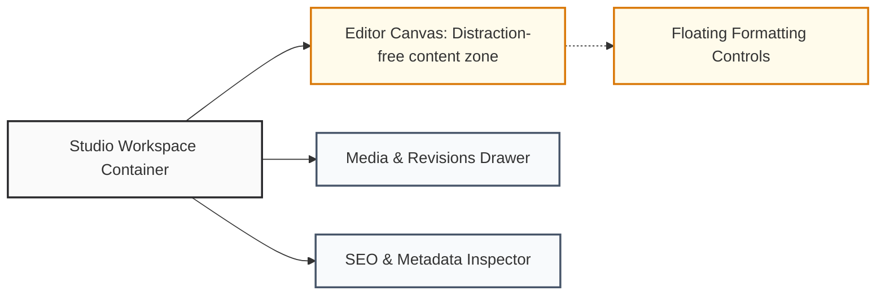

# Editorial Studio UI Specification

## Purpose
This document specifies the user interface architecture for the NewsOps Cloud Editorial Studio. It defines the rich-text editing workspace, collaborative inline annotation widgets, metadata sidebar panels, floating formatting bars, and responsive real-time previewers.

## Executive Summary
The Editorial Studio is the central workspace where journalists and editors create, format, review, and publish articles. This specification details the visual components and workspace layouts required for the editor. By standardizing clean formatting controls, collapsible sidebars, and real-time split-screen previews, the Editorial Studio provides a distraction-free, high-performance writing experience.

## Vision
Our vision is an editorial workspace that is as simple to use as a standard document editor, but backed by powerful digital newsroom capabilities. The editor integrates live collaboration metrics, inline revision highlights, automated accessibility checks, and multi-device preview layouts into a single, unified interface that runs smoothly on standard modern web browsers.

## Scope
The scope of this document includes:
- **Editor Workspace Layout**: Central writing area with distraction-free writing modes.
- **Floating Formatting Toolbar**: Contextual text formatting controls (headings, lists, quotes, links).
- **Metadata Sidebar Panel**: Collapsible drawer containing settings for SEO tags, feature images, categorizations, and publish options.
- **Inline Previewers**: Split-screen preview layouts mimicking desktop, tablet, and mobile displays.
- **Collaborative Presence Indicators**: Avatars in the header showing active users and highlighting active paragraphs.

## Goals
1. Maintain sub-10ms latency for keyboard inputs during editing.
2. Provide a distraction-free writing layout that hides sidebars and menus.
3. Keep real-time collaboration cursors synchronized across users within a 100ms window.
4. Support drag-and-drop media integration directly into the editor body.

## Functional Requirements
1. **Contextual Floating Toolbar**: Display formatting shortcuts above highlighted text selection.
2. **Real-time Split-screen Preview**: Provide a side-by-side rendering panel showing final layout adjustments.
3. **Collapsible Metadata Drawer**: Toggle configuration settings panel on the right side of the screen.
4. **Presence Indicators**: Render user avatars in the header showing active collaborators, with color-coded cursors on the canvas.
5. **Autosave Visual Notification**: Display saving indicators ("Draft saved") to confirm automatic draft updates.

## Non-Functional Requirements
1. **Low Latency Typing**: Keep keypress rendering latency under 10ms to prevent interface lag.
2. **Dynamic Canvas Scrolling**: Center text blocks vertically on the screen as authors write new paragraphs (typewriter scrolling).
3. **Draft Backup Storage**: Cache draft changes in browser local storage to prevent data loss during network disruptions.

## Business Rules
1. The editor must run an autosave check every 30 seconds if modifications are detected.
2. An article cannot be submitted for publishing unless required metadata fields (Title, Author, Primary Category) are complete.
3. Collaborative document locks are applied at the block level (paragraph, list, image) to prevent users from typing over the same sentence simultaneously.

## Actors
- **Writer**: Drafts content, inserts media elements, and reviews formatting.
- **Editor**: Suggests inline changes, leaves feedback annotations, and reviews SEO settings.
- **SEO Specialist**: Refines page titles, description tags, and URLs using metadata sidebar panels.

## User Stories
1. **As a Writer working on a story**, I want to highlight text and format it using a floating toolbar so that I can apply styles without losing my focus.
2. **As an Editor reviewing a draft**, I want to open a sidebar to verify SEO descriptions and tags without closing the main text canvas.
3. **As a Chief Editor**, I want to see where my writers are currently typing in the document in real time so that we do not conflict during breaking news coverage.

## Acceptance Criteria
1. The editor canvas must support markdown formatting shortcuts (e.g., typing `#` followed by a space creates a Heading 1).
2. The split-screen preview panel must render CSS themes that match the final publishing layout.
3. Dragging an image onto the canvas must launch an upload progress bar and place the image placeholder inline.
4. Collaborative user cursors must render color-coded flags showing the collaborator's name.

## Workflows
The collaboration and editing workflow inside the Editorial Studio:
1. **Open Workspace**: The writer opens an article draft. The editor connects to the collaboration server.
2. **Mount Sidebar Panels**: The interface loads the main writing page and opens the right sidebar containing draft metadata.
3. **Write and Format**: The writer types content. Highlighting text displays the floating styling options.
4. **Collaborative Review**: An editor joins the session. Cursors synchronize, and both users edit blocks concurrently.
5. **Autosave and Sync**: The local editor caches data, pushes changes to the cloud database, and displays a "Saved" status indicator.

```
Open Draft ---> Establish WebSocket ---> Load Metadata Panel ---> Write & Collaborate ---> Autosave
```

## API Design
The editor uses WebSockets for real-time changes and REST endpoints for document loads:

### GET `/api/v1/editor/articles/{article_id}`
**Response Payload:**
```json
{
  "article_id": "art-90812-a1",
  "title": "Breaking News: Editorial Studio Launch",
  "content": [
    {
      "id": "block-1",
      "type": "heading-1",
      "text": "Breaking News: Editorial Studio Launch"
    },
    {
      "id": "block-2",
      "type": "paragraph",
      "text": "The NewsOps Cloud project has launched its new editor interface today."
    }
  ],
  "metadata": {
    "seo_title": "NewsOps Editorial Launch Details",
    "seo_description": "First look at the editorial dashboard.",
    "category": "Technology",
    "tags": ["newsops", "publishing", "cloud"]
  },
  "collaborators": [
    {
      "user_id": "usr-12",
      "name": "Jane Doe",
      "color": "#e11d48",
      "active_block": "block-2"
    }
  ]
}
```

## Database Design
Drafts are periodically saved to an article drafts table before being compiled for publication.

### Table: `article_drafts`
| Field Name | Type | Key | Description |
|---|---|---|---|
| `draft_id` | `UUID` | PK | Unique identifier |
| `article_id` | `UUID` | Index | References the main article record |
| `block_content` | `JSONB` | - | Contains block structures (Tiptap / Slate schema) |
| `version` | `INTEGER` | - | Incrementing version index |
| `saved_by` | `UUID` | - | User ID of the last editor |
| `updated_at` | `TIMESTAMP` | Index | Timestamp of last modification |

## UI Design
The layout uses a three-column arrangement:
- **Left Panel (File Assets)**: Image lists, draft versions, and templates.
- **Center Canvas (Editor)**: Large, clean writing page with wide margins.
- **Right Panel (Inspector)**: Collapsible tabbed drawer (Tab 1: Metadata & SEO, Tab 2: Collaboration Logs, Tab 3: Publish Settings).
- **Header Console**: Displays collaborator avatars, connection health status, and the "Publish" button.

## Permissions
Actions in the Editorial Studio are controlled by the following permissions:
- `editorial:drafts:read`: Access draft layouts and read text.
- `editorial:drafts:write`: Edit blocks and modify inline text.
- `editorial:metadata:write`: Update SEO fields and add tags.
- `editorial:publish`: Push drafts to live reader-facing CDN systems.

## Security
1. **Cross-Site Scripting (XSS)**: Inputs from the editor must be filtered before rendering inline previews.
2. **WebSocket Validation**: Check user credentials when establishing connection requests.
3. **Document Version Locking**: Block outdated write requests using revision numbers to prevent overwriting newer edits.

## Performance
- **Keypress Processing Time**: Editor input processing must complete in under 5ms.
- **WebSocket Synchronization Latency**: Deliver collaborator positions across screens in under 100ms.
- **Draft Payload Compression**: Compress JSON drafts before sending updates over the network.

## Monitoring
- `editor_active_connections`: Current count of open WebSockets.
- `editor_autosave_latency_seconds`: Time taken to save drafts.
- `editor_keystroke_processing_ms`: Measure of typing responsiveness.

## Logging
Logging collaborative editor states:
```json
{
  "timestamp": "2026-06-27T22:48:30Z",
  "level": "INFO",
  "module": "editorial-studio",
  "message": "User joined collaborative editing session",
  "context": {
    "article_id": "art-90812-a1",
    "user_id": "usr-12",
    "session_id": "ws-sess-001"
  }
}
```

## Error Handling
| Error Code | HTTP Status | Log Level | User Message | Description |
|---|---|---|---|---|
| `EDITOR_SYNC_LOST` | `408` | `WARN` | "Connection lost. Reconnecting to editor..." | The active WebSocket connection disconnected. |
| `EDITOR_WRITE_CONFLICT`| `409` | `WARN` | "This paragraph is currently locked by another user."| User tried to edit a locked block. |
| `EDITOR_SAVE_FAILED` | `500` | `ERROR` | "Could not save draft. Changes saved to offline storage." | Database write failed; client fell back to local storage. |

## Edge Cases
- **Simultaneous Edits on the Same Word**: If two users type in the exact same spot at the same time, the editor uses operational transformation (OT) rules to merge the edits cleanly.
- **Offline Writes**: When network connections drop, the editor keeps running and saves modifications in browser storage. Once connections recover, it pushes and merges the changes with the live draft.

## Future Improvements
- **AI Co-Writer Panel**: Add an expandable sidebar widget that generates copy suggestions, summaries, and title variations.
- **Interactive Audio Transcription**: Enable real-time dictation features that convert audio files to text blocks directly on the editor canvas.

## Mermaid Diagrams
This diagram shows the relationship between layout panes in the Editorial Studio:



## References
- System Overview Index: [UI Architecture Directory Overview](index.md)
- Global Theme Tokens: [Design Tokens](design_tokens.md)
- Workspace Shells: [Layout Specifications](layout_specifications.md)
