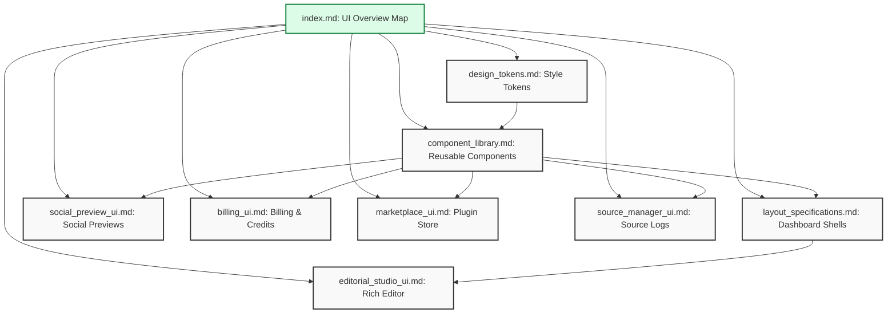

# UI Architecture Directory Overview

## Purpose
This document provides a single entry point and directory mapping for the NewsOps Cloud digital publishing platform's user interface design systems, styling tokens, component library patterns, layout grids, and the editorial studio workspace. It establishes the architectural standards governing UI development and ensures consistent design implementation across all platform services.

## Executive Summary
The NewsOps Cloud user interface layer is built upon modular, tokenized, and accessible frontend components. The `12-ui` directory acts as the central repository for frontend design and structural specifications. This index file maps out the sub-documents, detailing the relation between design tokens, reusable Shadcn UI wrappers, global application shells, and the highly interactive editorial studio.

## Vision
Our vision is to build a unified, accessible (WCAG 2.1 AA compliant), and responsive design language for NewsOps Cloud that bridges the gap between design and engineering. By leveraging a single source of truth for design tokens and reusable component wrappers, the system enables rapid feature iteration while maintaining visual consistency and sub-second page performance across diverse device viewports.

## Scope
The scope of this directory includes:
- **Design Token Registry**: CSS variables and Tailwind configuration mappings for color, spacing, typography, and elevations.
- **Component Library Mappings**: Standardized patterns for button variants, complex data tables, and modal dialogs using Radix UI primitives.
- **Layout Grid Specifications**: Responsive dashboard grids, responsive viewports, and navigation shells.
- **Editorial Studio UI**: Custom workspace layouts, floating formatting toolbars, sidebar collapsibles, and preview panels.

## Goals
1. Provide an unambiguous map of all UI design files within the NewsOps Cloud code repository.
2. Standardize 100% of platform UI components against design tokens, preventing hardcoded styles.
3. Keep the documentation interface responsive and clean with a strict zero-dependency layout paradigm.
4. Establish clear rules for responsive shell structures to support mobile journalists, tablet sub-editors, and desktop managers.

## Functional Requirements
1. **Interactive Navigation Directory Map**: Provide a clear navigation tree linking all design systems and workspace layouts.
2. **Standardized Directory Indexing**: Dynamically reference the five core documents within this folder for documentation generators.
3. **Module Interdependency Mapping**: Explicitly state how layouts import components and how components consume design tokens.
4. **Theme Mode Registry**: Map system variables for light, dark, and high-contrast system views.

## Non-Functional Requirements
1. **Sub-second Loading Speed**: Static rendering of this overview index must compile to lightweight HTML loaded in under 100ms.
2. **Clear Linking Rules**: All documents within this directory must maintain relative, lint-checked links.
3. **Search Engine Indexable**: Built using structured semantic markdown to allow quick search query lookup via IDE documentation viewers.

## Business Rules
1. Every component implemented in the codebase must consume the design tokens defined in `design_tokens.md` rather than using custom color hex codes or pixel sizing.
2. Breakpoints must match Tailwind’s standard break-scaling limits as documented in the layout specifications.
3. Custom styling overrides must be registered via the central registry schema and validate before production compilation.

## Actors
- **Frontend Architect**: Maintains directory structure and maps new UI design concepts to files.
- **Product Designer**: Consults this map to verify the existence of specified UI components and styling guidelines.
- **Full Stack Engineer**: References component specs and layouts during implementation to ensure exact UX compliance.

## User Stories
1. **As a Frontend Developer**, I want to browse the UI folder index so that I can instantly locate the correct specification file for layout grids or typography definitions.
2. **As a UI/UX Designer**, I want a structured index of files so that I can easily verify if a new interaction pattern belongs in the component library or needs a unique layout spec.
3. **As a QA Automation Engineer**, I want to trace components to their spec files using the directory overview so that I can structure my page-object tests accurately.

## Acceptance Criteria
1. The index document must list all files in the `12-ui` folder (`index.md`, `design_tokens.md`, `component_library.md`, `layout_specifications.md`, `editorial_studio_ui.md`, `social_preview_ui.md`, `billing_ui.md`, `marketplace_ui.md`, `source_manager_ui.md`) with explicit file descriptions.
2. Must contain relative file links that resolve correctly in standard markdown render engines (e.g., VS Code Preview, GitHub Pages).
3. The directory mapping table must match the actual file list on disk exactly.

## Workflows
The following workflow details how a frontend engineer uses this directory map to build a new UI feature:
1. **Locate Target Component**: Developer consults the Index directory map to see if the feature requires a new layout spec or a reuse of existing component structures.
2. **Retrieve Styling Variables**: Developer traverses to `design_tokens.md` to extract CSS variables and Tailwind utility names.
3. **Verify Component Interfaces**: Developer refers to `component_library.md` to check API props for buttons, tables, and dialog wrappers.
4. **Inspect Grid Placement**: Developer checks `layout_specifications.md` to understand where the feature fits in the desktop and mobile viewport shells.
5. **Code and Validate**: Developer writes the code, ensuring zero hardcoded pixel or color values, and submits a PR reference against this index.

```
+------------------+     +-----------------------+     +-------------------------+
|                  |     |                       |     |                         |
|  Consult Index   | --> | Retrieve Design       | --> | Implement Layouts &     |
|   (index.md)     |     | Tokens (tokens.md)    |     | Components (library)    |
|                  |     |                       |     |                         |
+------------------+     +-----------------------+     +-------------------------+
```

## API Design
Although this directory is documentation, UI registry settings are dynamic. Below is the JSON format for fetching the active UI layout config metadata from the configuration microservice:

### GET `/api/v1/ui/registry/status`
**Response Payload:**
```json
{
  "status": "active",
  "version": "1.4.2",
  "theme_engines": [
    "tailwind-css",
    "vanilla-css-vars"
  ],
  "registered_documents": [
    {
      "file": "index.md",
      "description": "UI Directory mapping and index system",
      "status": "stable"
    },
    {
      "file": "design_tokens.md",
      "description": "Design system styling tokens for color, spacing, and text",
      "status": "stable"
    },
    {
      "file": "component_library.md",
      "description": "Radix and Shadcn component wrapper specifications",
      "status": "stable"
    },
    {
      "file": "layout_specifications.md",
      "description": "Responsive layout grids and viewport containers",
      "status": "stable"
    },
    {
      "file": "editorial_studio_ui.md",
      "description": "Editor rich-text workspace layout specs",
      "status": "draft"
    },
    {
      "file": "social_preview_ui.md",
      "description": "Social media preview mock layouts",
      "status": "stable"
    },
    {
      "file": "billing_ui.md",
      "description": "Billing, subscriptions and credit logs dashboards",
      "status": "stable"
    },
    {
      "file": "marketplace_ui.md",
      "description": "Plugin marketplace explorer, details, and setup wizard",
      "status": "stable"
    },
    {
      "file": "source_manager_ui.md",
      "description": "Ingestion sources manager, crawler logs, and validation charts",
      "status": "stable"
    }
  ],
  "updated_at": "2026-06-27T22:48:00Z"
}
```

## Database Design
To handle dynamic portal documentation searching and configuration caching, the UI system interacts with a backend registry configuration database.

### Table: `ui_registry_settings`
| Field Name | Type | Key / Index | Description |
|---|---|---|---|
| `setting_id` | `UUID` | PK, Unique | Unique identifier of the UI configuration profile |
| `active_theme` | `VARCHAR(50)` | - | Active default UI theme (light, dark, high-contrast) |
| `cdn_tokens_url` | `VARCHAR(255)` | - | Storage location ofcompiled design tokens |
| `created_at` | `TIMESTAMP` | - | Record initialization timestamp |
| `updated_at` | `TIMESTAMP` | Index | Timestamp of last modification |

## UI Design
The documentation registry user interface follows a clear, two-column layout:
- **Left Navigation Rail**: Contains links to the five core files within this directory.
- **Main Reading Pane**: Visualizes the directory structure and lists component states.
- **Right Context Bar**: Fast links to specific section headings like Database Design, Workflows, and Mermaid Diagrams.

## Permissions
Access to edit the UI documentation and layout configuration endpoints is governed by the following roles:
- `ui:registry:read`: Granted to all organization roles. Allows viewing the UI schemas and documentation index.
- `ui:registry:write`: Granted to Frontend Architects. Allows updating configuration JSON objects.
- `ui:registry:admin`: Granted to Tech Leads. Full control over compilation hooks and CDN token deployments.

## Security
1. **Content Security Policy (CSP)**: UI layouts and documentation portals must only execute scripts signed with a secure nonce.
2. **XSS Mitigation**: User-customized theme settings loaded from the registry database must be disinfected to prevent malicious injections of style tags.
3. **JWT Verification**: The `/api/v1/ui/registry/status` configuration call requires a valid Bearer token for access.

## Performance
- **Target Response Time**: The static asset compilation of the docs must resolve in less than 15ms from the edge cache.
- **CDN Latency**: JSON theme definitions fetched from the CDN must resolve in under 50ms (p95).
- **Compilation Limit**: Compiling layout schema to CSS variables must execute within a 1.2s build time limit.

## Monitoring
We monitor UI configuration fetching health via Prometheus:
- `ui_registry_requests_total`: Total number of requests to the UI configuration endpoint.
- `ui_registry_error_rate`: Ratio of failed UI registry requests.
- `ui_registry_load_duration_seconds`: Histogram measuring registry loading latency.

## Logging
Every retrieval of layout assets must be logged to audit theme load events:
```json
{
  "timestamp": "2026-06-27T22:48:06Z",
  "level": "INFO",
  "module": "ui-registry",
  "message": "Loaded UI registry mapping mapping config successfully",
  "context": {
    "version": "1.4.2",
    "origin": "CDN_EDGE_USEAST",
    "latency_ms": 12.4
  }
}
```

## Error Handling
| Error Code | HTTP Status | Logged Level | Customer-Facing Message | Description |
|---|---|---|---|---|
| `UI_INDEX_NOT_FOUND` | `404` | `ERROR` | "Requested UI specification does not exist." | The requested spec document is missing from the registry paths. |
| `UI_THEME_PARSING_FAILED` | `422` | `ERROR` | "Unable to process the visual styling structure." | JSON loaded from settings is corrupt or has missing color attributes. |
| `UI_ENDPOINT_TIMEOUT` | `504` | `WARN` | "Configuration server took too long to respond." | The backend metadata registry is currently unresponsive. |

## Edge Cases
- **Missing Local Storage Variables**: If a client browser lacks stored theme preference keys, the app shell defaults to system-level browser media query preferences (`prefers-color-scheme`).
- **CDN Failover**: If the token CDN is unreachable, the application falls back immediately to hardcoded default values packaged directly inside the bundled CSS.

## Future Improvements
- **Automated Storybook Synchronization**: Link directory mappings dynamically to an active Storybook deployment via iframe integration.
- **Real-Time Style Editor**: Allow administrators to adjust colors in a visual editor and publish token updates directly to the CSS distribution engine.

## Mermaid Diagrams
Below is the dependency diagram mapping the relationship between components, tokens, layouts, and the editorial studio.



## References
- System Architecture Design: [System Architecture Design](../02-architecture/system_architecture.md)
- Styling Guidelines: [Design Tokens](design_tokens.md)
- UI Components: [Component Library](component_library.md)
- Viewport Grids: [Layout Specifications](layout_specifications.md)
- Editor Interfaces: [Editorial Studio UI](editorial_studio_ui.md)
- Social Previews: [Social Preview UI](social_preview_ui.md)
- Billing Panel: [Billing UI](billing_ui.md)
- Plugin Marketplace: [Marketplace UI](marketplace_ui.md)
- Ingestion Sources: [Source Manager UI](source_manager_ui.md)
