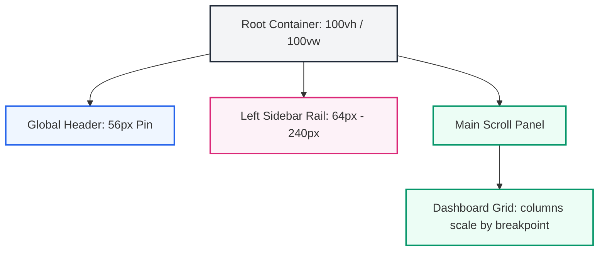

# Layout Specifications

## Purpose
This document details the layout architecture and responsive shell layouts of the NewsOps Cloud digital publishing system. It defines dashboard grid mechanics, responsive breakpoint rules, folding navigation sidebars, header panels, and content container dimensions to ensure seamless user interfaces across mobile, tablet, and desktop viewports.

## Executive Summary
A consistent shell architecture helps users navigate systems intuitively. The NewsOps Cloud interface uses a three-pane responsive layout: a collapsible left navigation rail, a global header bar featuring command search inputs, and a primary work panel with responsive column scaling. This document details layout rules, viewport break values, CSS grid configurations, and responsive viewports.

## Vision
Our vision is a highly adaptable user interface shell that scales dynamically. Whether an editor is reviewing copy on a standard office workstation, a reporter is writing on a tablet, or a manager is approving headlines on a phone, the layout grid must rearrange content cleanly to fit the viewport without losing workspace functions or breaking UI elements.

## Scope
The scope of this document includes:
- **Responsive Viewport Breakpoints**: Standard width limits (`sm`, `md`, `lg`, `xl`, `2xl`).
- **Dashboard Layout Grid**: Structural definition using CSS Grid and Flexbox layout models.
- **Left Navigation Rail**: Collapsible states, hover triggers, active indicators, and child item behaviors.
- **Header Global Search Panels**: Command search inputs, user avatar dropdown menus, and tenant selectors.
- **Workspace Containers**: Page wrappers, max-width bounds, padding rules, and scroll containment grids.

## Goals
1. Establish a standardized responsive page layout container used by all feature modules.
2. Prevent layout shifts (CLS) by utilizing deterministic grid item dimensions.
3. Optimize display sizes on screens ranging from small smartphones (320px width) to large monitors.
4. Ensure critical navigation tools remain accessible on touch-screen interfaces.

## Functional Requirements
1. **Collapsible Left Sidebar**: Toggle sidebar state between open (width: `240px`) and collapsed (width: `64px`).
2. **Fixed Global Header**: Pin the global header panel (height: `56px`) to the top of the viewport.
3. **Responsive Grid Restructuring**: Automatically scale main dashboards from single-column on mobile to three-column displays on desktop viewports.
4. **Overlay Navigation for Mobile**: Convert the persistent sidebar to a slide-out overlay drawer on mobile viewports (< 768px).

## Non-Functional Requirements
1. **Zero Content Shift (CLS < 0.1)**: Pre-allocate heights for sidebars and headers to prevent layout jumping during page loads.
2. **Sub-60fps Scrolling Performance**: Optimize scroll containers using CSS properties (`will-change`, `contain`) to avoid rendering bottlenecks during rapid scrolling.
3. **High-Density Display Scaling**: Scale spacing metrics dynamically to fit high-density retina displays cleanly.

## Business Rules
1. Dashboards must fit inside the viewport height (`100vh`), requiring sub-sections to scroll independently when content exceeds container boundaries.
2. The user profile menu and notifications panel must remain locked in the top-right corner of the global header.
3. Core workspace panels must maintain a minimum inline padding of 16px to prevent content from touching screen edges.

## Actors
- **Content Editor**: Works in the main panel using multiple side-by-side panes.
- **Field Reporter**: Accesses mobile drafts while on site, requiring responsive single-column layouts.
- **Frontend Architect**: Manages layout components and adds layout variants.

## User Stories
1. **As a Writer using a tablet**, I want the left sidebar to collapse into a slim icon rail so that I have more space to focus on the text editor.
2. **As an Editor comparing copy**, I want a dual-pane layout on my widescreen monitor so that I can review translation changes alongside the draft.
3. **As a Publisher monitoring metrics**, I want the analytical dashboard widgets to re-arrange into a vertical scroll list on my smartphone so that I can check reader counts on the go.

## Acceptance Criteria
1. The global header must remain pinned to the top of the viewport when scrolling main content.
2. If screen widths drop below `768px` (the `md` breakpoint), the navigation sidebar must fold into a hidden drawer.
3. Main workspace containers must restrict content widths to a maximum of `1536px` on large desktop monitors.
4. CSS Grid components must use Tailwind's responsive prefixes (e.g., `grid-cols-1 md:grid-cols-2 lg:grid-cols-3`) to manage responsive behaviors.

## Workflows
The interaction workflow for responsive layout switching:
1. **Detect Viewport Change**: The browser resize event triggers or is initialized at load time.
2. **Evaluate Breakpoint**: CSS media queries or React resize observers process the width against the standard grid scales.
3. **Apply Style Modifications**: 
   - If width is < 768px, sidebars convert to hidden drawers, and grid columns stack vertically.
   - If width is >= 768px, sidebars render inline, and grid layouts display columns side-by-side.
4. **Reflow Content**: Text containers and widgets adjust dimensions to fill their parent container.

```
Resize Event ---> Detect Breakpoint (768px) ---> Toggle Sidebar View Mode ---> Reflow Workspace
```

## API Design
Layout configurations are returned in JSON formats to allow system-level customization adjustments:

### GET `/api/v1/ui/layouts/default`
**Response Payload:**
```json
{
  "layout_name": "dashboard-standard",
  "grid_metrics": {
    "header_height": "56px",
    "sidebar_width_expanded": "240px",
    "sidebar_width_collapsed": "64px",
    "max_content_width": "1536px"
  },
  "breakpoints": {
    "xs": "480px",
    "sm": "640px",
    "md": "768px",
    "lg": "1024px",
    "xl": "1280px",
    "xxl": "1536px"
  },
  "panels": [
    {
      "id": "nav-rail",
      "position": "left",
      "collapsible": true,
      "default_state": "expanded"
    },
    {
      "id": "header-action-bar",
      "position": "top",
      "collapsible": false,
      "default_state": "fixed"
    },
    {
      "id": "main-workspace",
      "position": "center",
      "scrollable": true
    }
  ]
}
```

## Database Design
To handle custom UI setups across teams, layout presets are stored in user profile tables.

### Table: `user_layout_preferences`
| Field Name | Type | Key | Description |
|---|---|---|---|
| `preference_id` | `UUID` | PK | Primary Key |
| `user_id` | `UUID` | Index | References the platform user |
| `sidebar_collapsed` | `BOOLEAN` | - | Remembers sidebar open/closed state |
| `active_layout_preset`|`VARCHAR(50)`| - | Stores active panel layouts (e.g. dual-pane) |
| `dashboard_widgets` | `JSONB` | - | Grid positions and visibility keys of layout widgets |

## UI Design
The default dashboard grid consists of the following HTML elements and responsive Tailwind classes:
- **Root Layout Wrapper**: `.h-screen .w-screen .flex .overflow-hidden .bg-background`
- **Sidebar Container**: `.hidden .md:flex .h-full .w-64 .flex-col .border-r .bg-card`
- **Workspace Wrapper**: `.flex .flex-1 .flex-col .overflow-hidden`
- **Global Header**: `.h-14 .border-b .flex .items-center .px-4 .bg-card`
- **Scroll Content Body**: `.flex-1 .overflow-y-auto .p-6`

## Permissions
Layout settings and adjustments are governed by the following roles:
- `layouts:view`: View default dashboard views.
- `layouts:customize`: Save custom widget locations and sidebar preferences.
- `layouts:admin:modify`: Reconfigure default platform layouts for all users.

## Security
1. **Frame Protection**: Layout containers must declare `X-Frame-Options: DENY` to prevent clickjacking attacks inside malicious overlays.
2. **Safe Input Processing**: Sanitize data before embedding dynamic dashboard titles or custom client logos.
3. **State Encryption**: Verify JWT credentials before applying tenant-specific workspace layout configurations.

## Performance
- **CSS Layout Engine Latency**: Reflow calculations must execute in under 16.7ms (60 FPS target).
- **Responsive Layout Swapping**: Hiding and showing sidebars must execute without causing memory leaks or lagging input responses.

## Monitoring
- `layout_reflow_duration_seconds`: Tracks layout reflow duration.
- `layout_sidebar_toggle_count`: Count of times users manually collapse/expand sidebars.

## Logging
Logging layout modifications:
```json
{
  "timestamp": "2026-06-27T22:48:20Z",
  "level": "INFO",
  "module": "layout-engine",
  "message": "User toggled sidebar state",
  "context": {
    "user_id": "e0a80101-1111-1111-1111-111111111111",
    "collapsed_state": true,
    "viewport_width": 1024
  }
}
```

## Error Handling
| Error Code | HTTP Status | Log Level | User Message | Description |
|---|---|---|---|---|
| `LAYOUT_CONFIG_INVALID` | `400` | `WARN` | "Could not load dashboard settings. Reverting to default." | JSON layout preferences fail validation criteria. |
| `LAYOUT_RENDER_TIMEOUT` | `508` | `ERROR` | "Interface is responding slowly. Please check browser tabs." | Render block detected in sub-containers. |
| `LAYOUT_SIDEBAR_ERR` | `500` | `WARN` | "Navigation panel layout failed to open." | Toggle state mechanism failed to complete state changes. |

## Edge Cases
- **Superwide Displays (Ultra-wides)**: Restrict the content layout width to `1536px` to prevent text lines from stretching too long, which degrades readability.
- **Nested Scrolling Zones**: Lock the root window body to scroll-none. Scroll bars are applied exclusively to specific inner workspace containers, avoiding double scrollbars.

## Future Improvements
- **Drag-and-Drop Layout Grid**: Allow users to dynamically drag dashboard widgets to customize layouts.
- **Auto-collapsing Sidebars**: Automatically collapse sidebars when window widths drop past layout triggers, saving screen space.

## Mermaid Diagrams
This diagram shows the responsive dashboard shell layout:



## References
- Overview Index: [UI Architecture Directory Overview](index.md)
- Custom Style Variables: [Design Tokens](design_tokens.md)
- React Component Spec: [Component Library](component_library.md)
