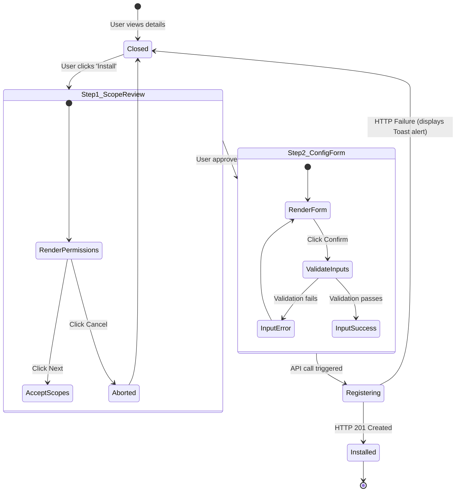

# Marketplace UI Design
## Purpose
The purpose of the Marketplace UI is to define the interface specifications, layout architectures, visual styles, and user flow states for the NewsOps Cloud Plugin Marketplace. This interface allows system administrators and editors to discover, audit, inspect permission requirements, install, and configure integrations and extensions.

## Executive Summary
The Plugin Marketplace is a centralized portal inside the NewsOps Cloud management shell. The UI comprises a responsive **Plugin Grid Catalogue** with advanced categorization and search indexing, a **Plugin Detail Page** providing rich metadata, reviews, and changelogs, and an **Installation Prompt Wizard** that reviews security scopes and captures configuration credentials.

## Vision
Our vision is to build an interactive, safe environment for digital newsroom customization. By displaying permission warnings, rating vectors, and installation configurations, we enable tenants to deploy automation workflows and UI plugins without security vulnerabilities or operational bottlenecks.

## Scope
The scope of this UI module includes:
- **Marketplace Explorer Grid**: Categorized layout sheets, search query inputs, and rating tags.
- **Plugin Detail Layout**: Layouts displaying screenshots, text descriptions, developer details, security manifests, and dynamic install triggers.
- **Permission Verification & Install Prompt**: A multi-step modal displaying security scopes, API permission warnings, configurations forms, and final installation triggers.
- **Installed Extensions Manager**: Local admin dashboard page displaying installed extensions, active/paused toggles, and deletion controls.

## Goals
- **High Responsiveness**: Render marketplace grids with cached records in less than 75ms.
- **Clear Auditing**: Display security warning banners for plugins demanding write-access to article databases.
- **Self-Service Configuration**: Ensure that post-installation options (like entering third-party API keys) are fully integrated inside the installation wizard steps.

## Functional Requirements
- **Category Filter Tabs**: Sidebar navigation to filter plugins (AI Content, Social Channels, Crawlers, Theme Layouts, Security Tools).
- **Tabbed Detail View**: Section tabs within the plugin view separating (Overview, Changelogs, Permissions, Ratings).
- **Permission Checkboxes Modals**: High-visibility warning indicators lists for sensitive OAuth scopes (e.g. `users:write`).
- **Configuration Input Fields**: Dynamic text and toggle fields generated from the plugin's manifest configuration schema (e.g. asking for "DeepL API Key").
- **Activation Status Switcher**: Quick-toggle button to enable or disable an installation on the fly.

## Non-Functional Requirements
- **Visual Grid Scaling**: Marketplace grid must support fluid multi-column breaks (`grid-cols-1 md:grid-cols-2 lg:grid-cols-3 xl:grid-cols-4`).
- **Accessible Prompts**: Modals must trap focus, close on Escape key, and support keyboard navigating controls.
- **Skeleton Loaders**: Dashboard grids must display card placeholder layouts when querying active lists.

## Business Rules
1. **Administrative Restrictions**: Installing and configuring plugins is limited to users holding `plugins:write` and organization administrator privileges. Non-admins see a disabled "Request Install" button.
2. **Permission Manifest Boundaries**: Permissions declared by the plugin developer in `manifest.json` cannot be edited. The user must grant all or cancel installation.
3. **API Key Encryption**: Any credentials entered during installation must be encrypted prior to saving to database profiles.

## Actors
- **Tenant Administrator**: Browses, audits, configures, and installs plugin systems.
- **Newsroom Editor**: Evaluates helper widgets to request additions.
- **Marketplace Moderator**: Globally manages and reviews developer submissions.

## User Stories
1. **As a Tenant Administrator**, I want to browse the marketplace catalog and search for "SEO" so that I can quickly install an automated SEO scanning assistant.
2. **As an Organization Tech Lead**, I want to review the detailed security permissions modal during installation to ensure a spelling check widget does not demand write access to client tables.
3. **As a News Editor**, I want to pause a plugin instantly if it behaves erratically in the sidebar, without deleting its credentials.

## Acceptance Criteria
1. **Responsiveness**: Searching or selecting categories must filter grid cards dynamically in less than 50ms.
2. **Permission Warning Visuals**: Modals must present API permissions with yellow warnings for READ privileges and bold red exclamation warnings for WRITE privileges.
3. **Configuration Checkpoints**: The installation modal must validate required fields (e.g. checking formatting of third-party keys) before letting user click the final "Confirm Install" trigger.
4. **Clean Uninstall**: Clicking uninstall must trigger a confirmation check, remove the database linkages, and clear the sidebar iframe widgets instantly.

## Workflows
1. **Plugin Installation Workflow**:
   - Admin navigates to `/marketplace` and searches for "DeepL Translation Helper".
   - Admin clicks on the plugin card to open the **Detail Page**.
   - Admin reviews the capabilities and clicks "Install".
   - The **Installation Modal Prompt** renders:
     - **Step 1: Security Scope Review**: Shows that the plugin requests `articles:write` and `articles:read`.
     - **Step 2: Configuration Entry**: Prompts the admin to enter the "DeepL API Token".
   - Admin inputs the credentials and clicks "Approve and Install".
   - The client calls `POST /api/v1/marketplace/installations`.
   - The UI displays a success checkmark and registers the widget in the Editorial Studio Sidebar.

## API Design
### GET `/api/v1/marketplace/plugins`
Retrieves approved plugins available in the marketplace database.

**Request Parameters:**
- `category`: `AI_TOOLS`
- `search`: `translator`
- `page`: `1`

**Response Payload (200 OK):**
```json
{
  "plugins": [
    {
      "id": "plg_88192a-33b2-4cf2",
      "name": "DeepL Translation Helper",
      "tagline": "Translate drafts instantly using DeepL API translation suites.",
      "version": "1.0.4",
      "rating": 4.8,
      "developerName": "DeepL Integration Labs",
      "iconUrl": "https://cdn.dev-plugins.com/deepl/icon.png",
      "category": "AI_TOOLS",
      "isInstalled": false
    }
  ],
  "pagination": {
    "currentPage": 1,
    "totalPages": 1,
    "totalCount": 1
  }
}
```

### GET `/api/v1/marketplace/plugins/{id}`
Returns details, descriptions, screenshots, manifest structures, and configurations.

**Response Payload (200 OK):**
```json
{
  "id": "plg_88192a-33b2-4cf2",
  "name": "DeepL Translation Helper",
  "version": "1.0.4",
  "description": "Enables editors to translate news copy between 28+ languages using neural translation networks. Scans draft selections, runs contextual analysis, and appends outputs directly into editor columns.",
  "developer": "DeepL Integration Labs",
  "manifest": {
    "permissions": ["articles:read", "articles:write"],
    "configurationSchema": {
      "properties": {
        "apiKey": {
          "type": "string",
          "title": "DeepL API Key",
          "required": true
        },
        "targetLanguage": {
          "type": "string",
          "title": "Default Target Language",
          "default": "ES"
        }
      }
    }
  },
  "screenshots": [
    "https://cdn.dev-plugins.com/deepl/assets/screen1.jpg"
  ]
}
```

### POST `/api/v1/marketplace/installations`
Submits a plugin installation query with configuration fields.

**Request Payload:**
```json
{
  "pluginId": "plg_88192a-33b2-4cf2",
  "config": {
    "apiKey": "dpl_key_99182a83980c",
    "targetLanguage": "FR"
  }
}
```

**Response Payload (201 Created):**
```json
{
  "installationId": "ins_7718290a-1123",
  "pluginId": "plg_88192a-33b2-4cf2",
  "status": "active",
  "installedAt": "2026-06-27T22:48:06.000Z"
}
```

## Database Design
The frontend client queries and updates data stored in standard integration tables defined in `plugin_architecture.md`:
- `plugins` (lists items)
- `plugin_installations` (tracks client activation instances)
- `plugin_hooks` (routes backend trigger triggers)

## UI Design
Below is the HTML structure and Tailwind CSS classes representing the primary views.

### 1. Marketplace Explorer Grid Layout
```html
<div class="flex h-screen bg-slate-50 font-sans">
  
  <!-- Left Side Category Rail -->
  <aside class="w-64 border-r border-slate-200 bg-white p-6 flex flex-col justify-between">
    <div class="space-y-6">
      <div class="flex items-center space-x-2">
        <span class="bg-indigo-600 text-white font-bold p-1.5 rounded">NP</span>
        <span class="font-extrabold text-slate-900 tracking-tight">Plugin Store</span>
      </div>
      <!-- Search Input -->
      <div class="relative">
        <input type="text" placeholder="Search plugins..." class="w-full pl-8 pr-3 py-1.5 border border-slate-200 rounded-md text-xs focus:outline-none focus:ring-1 focus:ring-indigo-600 bg-slate-50" />
        <svg class="w-4 h-4 text-slate-400 absolute left-2.5 top-2" fill="none" stroke="currentColor" viewBox="0 0 24 24"><path stroke-linecap="round" stroke-linejoin="round" stroke-width="2" d="M21 21l-6-6m2-5a7 7 0 11-14 0 7 7 0 0114 0z"/></svg>
      </div>
      <!-- Categories -->
      <nav class="space-y-1">
        <a href="#" class="flex items-center space-x-2.5 px-3 py-2 text-xs font-semibold rounded bg-indigo-50 text-indigo-700"><span>Explore All</span></a>
        <a href="#" class="flex items-center space-x-2.5 px-3 py-2 text-xs font-semibold rounded text-slate-600 hover:bg-slate-50 hover:text-slate-900"><span>AI Tools</span></a>
        <a href="#" class="flex items-center space-x-2.5 px-3 py-2 text-xs font-semibold rounded text-slate-600 hover:bg-slate-50 hover:text-slate-900"><span>Social Autoposting</span></a>
        <a href="#" class="flex items-center space-x-2.5 px-3 py-2 text-xs font-semibold rounded text-slate-600 hover:bg-slate-50 hover:text-slate-900"><span>Scrapers & Feeds</span></a>
        <a href="#" class="flex items-center space-x-2.5 px-3 py-2 text-xs font-semibold rounded text-slate-600 hover:bg-slate-50 hover:text-slate-900"><span>Spelling & SEO</span></a>
      </nav>
    </div>
  </aside>

  <!-- Main Grid View -->
  <main class="flex-1 p-8 overflow-y-auto">
    <div class="max-w-6xl mx-auto">
      <!-- Title -->
      <div class="border-b border-slate-200 pb-4 mb-6">
        <h1 class="text-2xl font-bold text-slate-900">Explore Integrations</h1>
        <p class="text-sm text-slate-500">Supercharge your editorial workspace with specialized extensions.</p>
      </div>

      <!-- Grid Column List -->
      <div class="grid grid-cols-1 md:grid-cols-2 lg:grid-cols-3 gap-6">
        
        <!-- Card Item -->
        <div class="border border-slate-200 rounded-xl bg-white p-5 flex flex-col justify-between hover:shadow-md transition">
          <div>
            <div class="flex items-center justify-between">
              
              <span class="bg-indigo-100 text-indigo-800 text-[10px] font-bold px-2 py-0.5 rounded-full">AI Tools</span>
            </div>
            <h3 class="font-bold text-slate-900 text-sm mt-4">DeepL Translation Helper</h3>
            <p class="text-slate-500 text-xs mt-1.5 line-clamp-2">Translate drafts instantly using DeepL API translation suites.</p>
          </div>
          <div class="mt-5 pt-3 border-t border-slate-100 flex items-center justify-between">
            <span class="text-amber-500 font-bold text-xs flex items-center">⭐ 4.8 <span class="text-slate-400 font-normal ml-1">(120)</span></span>
            <button class="text-indigo-600 hover:text-indigo-900 text-xs font-bold transition">View Details</button>
          </div>
        </div>

      </div>
    </div>
  </main>
</div>
```

### 2. Installation Confirmation Prompt Modal Overlay
```html
<div class="fixed inset-0 bg-slate-900/50 backdrop-blur-sm flex items-center justify-center z-50 p-4">
  <div class="bg-white rounded-xl shadow-2xl max-w-md w-full overflow-hidden border border-slate-200">
    <!-- Modal Header -->
    <div class="bg-slate-50 border-b border-slate-100 px-6 py-4 flex items-center justify-between">
      <div class="flex items-center space-x-2">
        
        <div>
          <h3 class="font-bold text-slate-900 text-sm">Install DeepL Translation</h3>
          <p class="text-[10px] text-slate-500">Provided by DeepL Integration Labs</p>
        </div>
      </div>
      <button class="text-slate-400 hover:text-slate-600"><svg class="w-5 h-5" fill="none" stroke="currentColor" viewBox="0 0 24 24"><path stroke-linecap="round" stroke-linejoin="round" stroke-width="2" d="M6 18L18 6M6 6l12 12"/></svg></button>
    </div>

    <!-- Modal Content -->
    <div class="p-6 space-y-5">
      
      <!-- Permission Audit Section -->
      <div>
        <h4 class="text-xs font-bold text-slate-700 uppercase tracking-wider mb-2">Requested API Permissions</h4>
        <div class="space-y-2">
          <!-- Permission Row: Read -->
          <div class="flex items-start space-x-2 p-2 rounded bg-slate-50 border border-slate-100">
            <span class="text-amber-500 text-sm mt-0.5">⚠️</span>
            <div>
              <div class="font-bold text-slate-800 text-xs">Read Articles (articles:read)</div>
              <div class="text-[10px] text-slate-500">Allows the plugin to read active draft text content.</div>
            </div>
          </div>
          <!-- Permission Row: Write -->
          <div class="flex items-start space-x-2 p-2 rounded bg-rose-50 border border-rose-100">
            <span class="text-red-500 text-sm mt-0.5">🚫</span>
            <div>
              <div class="font-bold text-slate-800 text-xs">Write Articles (articles:write)</div>
              <div class="text-[10px] text-slate-500">Allows the plugin to edit draft sentences and insert translations.</div>
            </div>
          </div>
        </div>
      </div>

      <!-- Config Credentials Fields -->
      <div>
        <h4 class="text-xs font-bold text-slate-700 uppercase tracking-wider mb-2">Configuration Variables</h4>
        <div class="space-y-3">
          <div>
            <label class="block text-xs font-semibold text-slate-600 mb-1">DeepL API Key *</label>
            <input type="password" placeholder="Enter DeepL key token" class="w-full px-3 py-1.5 border border-slate-200 rounded text-xs focus:outline-none focus:ring-1 focus:ring-indigo-600 bg-slate-50 font-mono" />
          </div>
        </div>
      </div>

    </div>

    <!-- Modal Actions -->
    <div class="bg-slate-50 border-t border-slate-100 px-6 py-4 flex justify-end space-x-3">
      <button class="bg-white hover:bg-slate-100 border border-slate-200 text-slate-700 text-xs font-bold py-2 px-4 rounded transition">Cancel</button>
      <button class="bg-indigo-600 hover:bg-indigo-700 text-white text-xs font-bold py-2 px-4 rounded transition">Approve & Install</button>
    </div>
  </div>
</div>
```

## Permissions
Access control roles governing installing modules:
- `plugins:read` - Read plugin details, search, and view installed widgets list.
- `plugins:write` - Confirm installations, update settings schemas, uninstall active helper widgets.

## Security
- **OAuth Scope Check Validation**: Before calling the installation API, the portal validates that user permission levels match the requirements defined by the manifest file.
- **Credential Storage Security**: All configuration inputs (such as API secret keys) entered during setup modals are encrypted in-transit (HTTPS) and saved to database files using server-side encryption blocks.
- **Sandbox Origin Safeguards**: Re-registers the CSP headers on installation confirmation to whitelist specific developer CDN endpoints for widget rendering domains.

## Performance
- **Content Delivery Targets**: Directory lists cached on client-side state models refresh updates in under 5ms during navigation swaps.
- **Resource Loading Rules**: Screenshots are lazy-loaded (images load only when visible within the viewport scroll boundaries) to reduce initial page payloads.

## Monitoring
- `marketplace_installation_attempts_total`: Counter tracking total plugin installation commands.
- `marketplace_installation_failures_total`: Counter tracking aborted or failed installation actions.
- `marketplace_detail_page_loads_total`: Counter tracking views of details panels.

## Logging
Security audits and installation changes logged to trace system changes:
```json
{
  "timestamp": "2026-06-27T22:48:06.789Z",
  "level": "INFO",
  "module": "marketplace-ui",
  "message": "Plugin successfully installed by tenant admin",
  "context": {
    "tenant_id": "tnt_29104a-88f1-4ab1",
    "user_id": "usr_77189102",
    "plugin_id": "plg_88192a-33b2-4cf2",
    "permissions_granted": ["articles:read", "articles:write"]
  }
}
```

## Error Handling
| Error Code | HTTP Status | Logged Level | Customer-Facing Message | Description |
|---|---|---|---|---|
| `MANIFEST_UNREADABLE` | `422` | `WARN` | "Unable to parse installation parameters. Manifest file is corrupted." | The target plugin's manifest configuration is missing or broken. |
| `INSTALLATION_CREDENTIALS_INVALID` | `400` | `INFO` | "The API key formatting provided is incorrect." | Input validation failed on configuration fields during install prompt steps. |
| `INSUFFICIENT_PLAN_LEVEL` | `403` | `INFO` | "Your current subscription tier does not support third-party integrations." | Tenant tier model restricts installation of extensions. |

## Edge Cases
- **Simultaneous Settings Save**: If two admins attempt to adjust active configurations for a plugin at the same time, the backend resolves the conflict using database optimistic locking updates.
- **Connection Loss Mid-Install**: If connection drops after API key verification but before full registration completes, the installation wizard falls back to pre-install views, listing the plugin status as uninstalled to prevent broken configurations.

## Future Improvements
- **Local Sandbox Simulation**: Add a "Try in Sandbox" container frame to let administrators test interactive widgets with artificial mocked databases before committing to production newsrooms.
- **Version Rollbacks**: One-click toggles inside the installed dashboard to revert the extension version to previous releases.

## Mermaid Diagrams
Below is the State Machine of the Install Wizard Modal mapping state changes.



## References
- Secure Sandbox Architecture: [Plugin Architecture](./plugin_architecture.md)
- Development SDK Rules: [Plugin SDK](./plugin_sdk.md)
- Platform System Core: [../02-architecture/system_architecture.md](../02-architecture/system_architecture.md)
