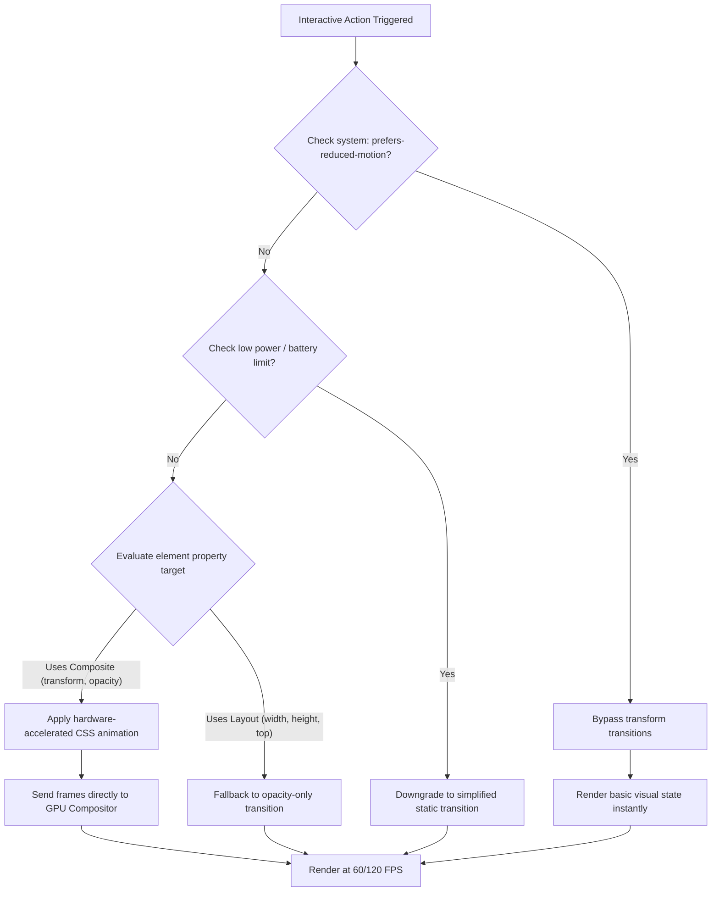

# Micro-Animations Design

## Purpose
This document defines the structural parameters, animation guidelines, and CSS standards for micro-interactions, transitions, loading states, and skeletal representations within the NewsOps Cloud UI framework. It ensures consistent visual cues while maintaining compliance with accessibility constraints and execution limits on low-powered mobile devices.

## Executive Summary
Micro-animations provide immediate visual feedback, clarify layout relationships, and make digital interactions natural. NewsOps Cloud leverages CSS-only transitions and hardware-accelerated animations (`transform` and `opacity`) to eliminate layout thrashing. This document defines easing curves (cubic-bezier), timing guidelines, skeletal loading structures, button state shifts, and custom loaders. Crucially, it specifies the handling of `prefers-reduced-motion` preferences to safeguard users with vestibular sensitivities.

## Vision
Our vision is to build a UI interaction layer that responds to user inputs with zero latency. By employing spring-like timing functions and composited paint operations, components feel tactile and fluid, guiding user focus without introducing cognitive friction or battery-draining processing loops.

## Scope
This design document covers:
1. **Timing and Easing Specifications**: Standard curves, durations, and motion profiles.
2. **Component Interaction States**: CSS rules for buttons, cards, list entrances, and dropdown menus.
3. **Loading States**: Shimmer skeleton specifications and spinner keyframes.
4. **Reduced-Motion Adaptations**: Stylesheet directives and media queries to restrict animations.

It does not cover:
- Core page-to-page route transition animations (managed by high-level router controllers).
- Third-party advertising dynamic assets.

## Goals
- **Maintain 60/120 FPS Rendering**: Ensure all animations avoid main-thread blocks, running strictly on the compositor thread.
- **Sub-300ms Interaction Budgets**: Complete entry/exit and state shift animations inside 100ms - 250ms windows.
- **Universal Accessibility**: Automatically strip motion-intensive effects when client preferences request reduced motion.
- **Zero Layout Shifts (CLS)**: Restrict animations to visual changes that do not cause document flow recalculation.

## Functional Requirements
- **Hardware Acceleration**: Animations must use composite-only properties (`transform`, `opacity`, `filter`). Avoid modifying layout-triggering properties (`width`, `height`, `margin`, `top`, `left`).
- **Interactive States**: Interactive elements must offer clear hover, active, focus, and disabled transitions.
- **Skeleton Shimmers**: Feed cards and article lists must present linear gradient shimmer loops while fetching content.
- **Reduced Motion Support**: Apply global overrides that scale down transition durations and swap slide actions for simple opacity fades.

## Non-Functional Requirements
- **Compositor Target**: 100% of interactive micro-animations must execute without triggering layout or paint stages in the browser rendering pipeline.
- **Bundle Weight**: Limit animation utility library additions (if any) to 0 KB by standardizing on native Tailwind CSS and raw keyframes.
- **Performance Budget**: CPU usage must remain below 1.5% during loading cycles containing infinite spinner loops.

## Business Rules
- **Non-blocking Rule**: Micro-animations must never block the execution of user inputs or programmatic routing. User actions must register instantly, even if the transition animation is still playing.
- **Global Override Priority**: The user's system level `prefers-reduced-motion` selection has priority over tenant branding configurations.
- **Visual Feedback Requirement**: Every server-submitting button or input form must present a loading state spinner or animation within 150ms of activation if the API response is pending.

## Actors
- **End User**: Interacts with dashboard controls or reader templates.
- **UI Engine**: Interprets Tailwind variables and resolves animations.
- **Browser Compositor**: Renders frames via GPU processing.

## User Stories
- **User Story 1**: As an editor with a vestibular condition, I want all slide-in sidebars to fade in instantly rather than moving across the screen so that I do not feel dizzy or nauseated.
- **User Story 2**: As a reader on a slow mobile connection, I want to see skeleton outlines of feed items pulse gently while text loads so that I know the application has not crashed.
- **User Story 3**: As a CMS user publishing a post, I want to see a micro-indicator spin inside the "Publish Now" button so that I am assured the system is processing my click.

## Acceptance Criteria
- **AC 1**: Toggling a button must apply a `transform: scale(0.97)` active state with an execution duration of exactly 70ms using standard easing.
- **AC 2**: The skeleton shimmer animation must execute using `linear-gradient` position shifting, completing a full translation cycle every 1.5 seconds.
- **AC 3**: Injected media queries with `prefers-reduced-motion: reduce` must force `transition-duration: 0s !important` and `animation: none !important` across the global styles.
- **AC 4**: Interactive dropdown grids must slide down using CSS `transform: translateY` instead of altering height metrics, ensuring no layout shifts are triggered.

## Workflows

### Animation Resolution Workflow
1. The user hovers over an interactive card component.
2. The browser registers the mouse hover event.
3. The UI framework evaluates if the client has `prefers-reduced-motion: reduce` activated.
4. If **false**:
   - The browser applies the card hover scale state: `transform: scale(1.02); shadow: hover-shadow;` over a 150ms cubic-bezier transition window.
5. If **true**:
   - The browser bypasses the scale transformation. It only applies a subtle border-color change or simple opacity change over 0s.
6. The GPU compositor handles rendering updates in parallel, ensuring no frames are dropped.

### Button Loading State Switch
1. An editorial author clicks "Save Draft".
2. The click handler triggers the request and updates the state variable `isSaving` to `true`.
3. The UI replaces the button label with a text message and inserts an SVG spinner.
4. The SVG spinner uses CSS keyframes to execute a `rotate` transform infinitely.
5. When the request resolves, the state changes to `false`, and the spinner transitions out via opacity.

## API Design

### Performance Telemetry Metrics
Enables clients to report frame drops or laggy animations to backend monitors.

* **URL**: `/api/v1/telemetry/perf`
* **Method**: `POST`
* **Headers**:
  * `Content-Type: application/json`
* **Request Payload**:
```json
{
  "clientAgent": "Mozilla/5.0 (iPhone; CPU iPhone OS 17_0 like Mac OS X)...",
  "componentId": "SkeletonFeedList",
  "fps": 34.5,
  "droppedFrames": 12,
  "durationMs": 1500,
  "memoryUsageMb": 42.1
}
```
* **Response Payload (202 Accepted)**:
```json
{
  "status": "logged",
  "action": "none"
}
```

## Database Design

Visual animation attributes do not modify backend relational tables. However, configuration definitions are persisted inside client-side settings blocks within the main database.

### `client_telemetry_logs` Table
Tracks animation anomalies captured by edge scripts.
- `id`: BIGSERIAL (Primary Key)
- `session_id`: VARCHAR(50) (Index)
- `component_id`: VARCHAR(50)
- `reported_fps`: NUMERIC(5,2)
- `dropped_frames`: INTEGER
- `environment`: VARCHAR(10) (e.g. 'production', 'staging')
- `created_at`: TIMESTAMP WITH TIME ZONE

## UI Design

### Core Easing Curves & CSS Keyframes
Standard timing variables are written using CSS Custom Properties.

```css
:root {
  /* Easing curves */
  --ease-in-out-spring: cubic-bezier(0.68, -0.6, 0.32, 1.6);
  --ease-out-back: cubic-bezier(0.34, 1.56, 0.64, 1);
  --ease-standard: cubic-bezier(0.4, 0, 0.2, 1);
  
  /* Durations */
  --duration-instant: 75ms;
  --duration-fast: 150ms;
  --duration-normal: 250ms;
  --duration-slow: 350ms;
}
```

### Loading Spinner Component (SVG & CSS)
```html
<button class="btn btn-primary btn-loading" disabled>
  <svg class="animate-spin spinner" viewBox="0 0 24 24" fill="none" xmlns="http://www.w3.org/2000/svg">
    <circle class="opacity-25" cx="12" cy="12" r="10" stroke="currentColor" stroke-width="4"></circle>
    <path class="opacity-75" fill="currentColor" d="M4 12a8 8 0 018-8V0C5.373 0 0 5.373 0 12h4zm2 5.291A7.962 7.962 0 014 12H0c0 3.042 1.135 5.824 3 7.938l3-2.647z"></path>
  </svg>
  Saving draft...
</button>
```

```css
.animate-spin {
  animation: spin 800ms linear infinite;
  will-change: transform;
}

@keyframes spin {
  from {
    transform: rotate(0deg);
  }
  to {
    transform: rotate(360deg);
  }
}

.spinner {
  width: 16px;
  height: 16px;
  margin-right: 8px;
  display: inline-block;
  vertical-align: middle;
}
```

### Skeleton Shimmer Component CSS
```css
.skeleton-card {
  position: relative;
  overflow: hidden;
  background-color: hsl(var(--muted));
  border-radius: 6px;
  height: 200px;
}

.skeleton-card::after {
  position: absolute;
  top: 0;
  right: 0;
  bottom: 0;
  left: 0;
  transform: translateX(-100%);
  background-image: linear-gradient(
    90deg,
    rgba(255, 255, 255, 0) 0%,
    rgba(255, 255, 255, 0.08) 20%,
    rgba(255, 255, 255, 0.15) 60%,
    rgba(255, 255, 255, 0) 100%
  );
  animation: shimmer 1.5s infinite;
  content: '';
  will-change: transform;
}

.dark .skeleton-card::after {
  background-image: linear-gradient(
    90deg,
    rgba(0, 0, 0, 0) 0%,
    rgba(255, 255, 255, 0.02) 20%,
    rgba(255, 255, 255, 0.05) 60%,
    rgba(0, 0, 0, 0) 100%
  );
}

@keyframes shimmer {
  100% {
    transform: translateX(100%);
  }
}
```

### Accessibility Reduced Motion Overrides
```css
@media (prefers-reduced-motion: reduce) {
  *,
  ::before,
  ::after {
    animation-delay: -1ms !important;
    animation-duration: 1ms !important;
    animation-iteration-count: 1 !important;
    background-attachment: initial !important;
    scroll-behavior: auto !important;
    transition-duration: 0s !important;
    transition-delay: 0s !important;
  }
}
```

## Permissions
- `preferences:write`: Required to save custom motion toggle states within client profiles.

## Security
- **Defense against CPU-Bound Animation Exploits**: Do not load dynamic user-submitted CSS animations that contain recursive keyframe loops. Restrict input validation templates for tenant templates to exclude `@keyframes` generation to mitigate local browser freezes (CSS Denial of Service).

## Performance
- **Composition Execution targets**: Ensure that properties animated on load or interaction do not trigger paint stages. Only transition `opacity` and `transform`.
- **Target Frame Time**: Frame budget must target $< 16.6\text{ ms}$ (60Hz) or $< 8.3\text{ ms}$ (120Hz) to secure a buttery scroll execution without dropping layouts.

## Monitoring
- **Prometheus Metric**: `ui_long_task_detections_total` (Tracks occurrences where micro-interactions block browser execution threads for more than 50ms).
- **Prometheus Metric**: `average_rendered_fps_seconds` (A summary metric collected from client telemetry batches).
- **Alert Trigger**: Raise a platform alert if client telemetry reports `ui_long_task_detections_total` increases by $> 500$ within a 10-minute slot.

## Logging
Logging output is formatted in structured JSON.
* **Client Telemetry Report**:
`{"timestamp": "2026-06-27T22:58:12.302Z", "level": "WARN", "context": "UiPerformanceTelemetry", "message": "High rate of dropped frames detected", "component": "FeedLoaderShimmer", "reported_fps": 28.4, "dropped_frames": 22}`
* **Reduced Motion Applied**:
`{"timestamp": "2026-06-27T22:58:45.002Z", "level": "INFO", "context": "UserPrefs", "message": "Reduced motion rules applied for session", "user_id": "usr_9912aa"}`

## Error Handling
| Internal Error Code | HTTP Status | Customer-Facing Message |
|:---|:---|:---|
| `ERR_RENDER_PERF_DEGRADATION` | 200 OK | Performance degraded. Micro-animations have been scaled down. |
| `ERR_TELEMETRY_BATCH_FAILED` | 400 Bad Request | Unable to parse telemetry report payload. Check structural inputs. |

## Edge Cases
- **Low-Battery Mode Throttling**: On mobile devices, when the operating system drops refresh rates to 30Hz or forces low-power modes, animations can stutter. The system checks battery states using `navigator.getBattery()` (where supported) and automatically pauses loop animations to preserve power.
- **Safari Transform Layout Flash**: Safari occasionally exhibits a "flicker" when starting a GPU-rendered transform. This is mitigated by appending a subtle perspective configuration `transform: translate3d(0, 0, 0)` and `backface-visibility: hidden` to the animated element selector.

## Future Improvements
- **Spring Physics Engine Integration**: Transition from cubic-bezier approximations to programmatic CSS-spring variables, simulating real tension and friction for elastic interface transitions.
- **Dynamic Framerate Adaptation**: Implement runtime monitoring that dynamically toggles complex micro-animations based on real-time paint times, optimizing rendering for older devices automatically.

## Mermaid Diagrams

Below is a flowchart detailing the decision path for rendering interactive micro-animations:



## References
- Dark Mode Theme Guidelines: [dark_mode_theme.md](./dark_mode_theme.md)
- Accessibility Standards Guidelines: [accessibility_standards_ui.md](./accessibility_standards_ui.md)
- Site Publisher Templates: [site_publisher_templates.md](./site_publisher_templates.md)
- Rate Limiting Policies: [rate_limiting_security.md](../10-security/rate_limiting_security.md)
