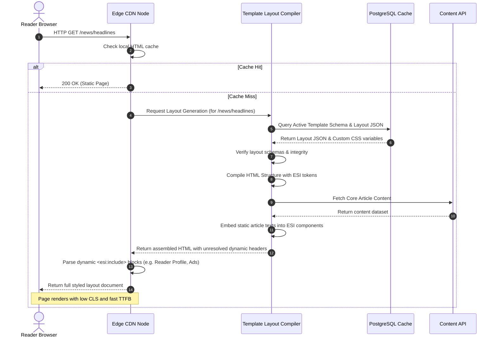

# Site Publisher Templates Design

## Purpose
This document specifies the architectural design for the NewsOps Cloud Site Publisher template engine. It outlines the schema patterns, headless frontend rendering targets, dynamic widget styling mechanisms, CSS isolation models, and template compiling pipelines that enable tenants to construct customizable digital frontends.

## Executive Summary
Site Publisher is the layout engine of NewsOps Cloud, enabling publishers to build headless frontends through structured template layouts. Rather than utilizing monolithic rendering, Site Publisher parses JSON-based layout schemas that map structural containers to reusable widget blocks (e.g., Article Cards, Dynamic Tickers, Newsletter Signups). Visual customizability is achieved by inheriting core HSL theme coordinates (defined in [dark_mode_theme.md](./dark_mode_theme.md)) and injecting scoped CSS overrides. The template engine is optimized for high-performance server-side rendering (SSR), Incremental Static Regeneration (ISR), and edge CDN caching, maintaining strict accessibility baselines and security isolations.

## Vision
Our vision is to provide a layout and templating architecture that bridges the gap between visual design and technical optimization. By decoupling visual layout schemas from content databases, site layouts compile instantly at edge nodes, serving readers responsive layouts with zero layout shift, low bundle sizes, and absolute design flexibility.

## Scope
This design document covers:
1. **JSON Layout Schema Specifications**: Structural grid configurations and widget bindings.
2. **Styling and Scoped Variables**: Inherited color properties and custom widget styles.
3. **Headless Compiling Pipeline**: Edge Side Includes (ESI), static file generation, and runtime hydration.
4. **Sandboxing and CSS Isolation**: Policies preventing global namespace conflicts and style leakage.

It does not cover:
- Dynamic content database indexing rules (managed in [index.md](../03-database/index.md)).
- Core CDN network configuration files (handled in [index.md](../11-devops/index.md)).

## Goals
- **Sub-50ms Document Delivery**: Deliver fully compiled HTML templates from CDN edge nodes.
- **Strict Layout Stability**: Maintain Cumulative Layout Shift (CLS) scores below 0.1 for reader page views.
- **Secure Custom Styling**: Enable publishers to supply custom CSS variables and class rules without exposing the site to script injection or layout breakage.
- **Semantic Consistency**: Ensure template layouts render clean, accessible HTML structures out of the box.

## Functional Requirements
- **JSON Layout Parsing**: The rendering core must construct structural elements (grids, columns, flex elements) using a validated JSON layout map.
- **Theme Variable Inheritance**: Templates must automatically bind to and implement the tenant's HSL variables defined in the system settings.
- **CSS Isolation via Shadows or Attributes**: Custom widgets must apply CSS rules scoped to their containers using CSS nesting or Shadow DOM bindings.
- **Skeletal Placeholder Autogen**: Widgets containing dynamic API dependencies must provide explicit width and height indicators to compile static skeleton outlines while waiting for client-side hydration.

## Non-Functional Requirements
- **Compile Performance**: The server layout compiler must parse a complex site homepage schema and output HTML in under $< 15\text{ ms}$.
- **Style Isolation Overhead**: Scoped widget styles must add less than 2% parsing latency overhead.
- **Mobile Compatibility**: Compiled layouts must adapt responsively via standardized viewport rules and Tailwind CSS breakpoints.

## Business Rules
- **Safe Layout Rules**: Templates must include a mandatory content container mapped to accessibility criteria, including a `#main-content` target.
- **Widget CSP Enforcement**: Any dynamic widget that initiates third-party API queries must have its domain added to the tenant's Content Security Policy (CSP) headers.
- **Dynamic Lockouts**: Core administrative components (like site alerts or primary navigation headers) cannot be deleted or completely hidden by custom publisher styling layouts.

## Actors
- **Site Designer**: Modifies templates, updates CSS configurations, and structures pages.
- **Reader User**: Views published pages rendered via CDN edges.
- **Template Compiler**: Assembles static templates with dynamic contents at the edge.
- **Third-Party Widget Developer**: Builds custom components bound to the NewsOps API.

## User Stories
- **User Story 1**: As a site designer, I want to define the homepage layout using a drag-and-drop JSON configuration so that I can insert a breaking news alert widget above the main carousel instantly.
- **User Story 2**: As a visual brand designer, I want to override the HSL primary accent color for the subscription widget in the footer without impacting the buttons on the main article listings page.
- **User Story 3**: As a reader accessing the page on a cellular network, I want the newsletter subscription box to mount in its pre-allocated layout space so that the article I am reading doesn't move.

## Acceptance Criteria
- **AC 1**: Layout configuration files must validate successfully against the standard JSON layout schema before being stored or compiled.
- **AC 2**: Custom widget CSS rules must be scoped strictly using an auto-generated unique data attribute (e.g. `[data-widget-id="wdg_8812a"]`), preventing style rules from affecting elements outside the component boundary.
- **AC 3**: Dynamic widgets must render a skeleton preview block with matching height attributes, achieving a CLS of 0.0 during hydration tests.
- **AC 4**: Published templates must compile to clean semantic markup using native landmarks (`<header>`, `<main>`, `<article>`, `<footer>`).

## Workflows

### Live Layout Editing and Compiling
1. A site designer modifies the widget order in the Publisher Workspace.
2. The UI dispatches the updated JSON layout structure to the backend.
3. The layout API validates the JSON properties against the structural schema.
4. If valid, the database saves the configuration layout as a draft draft.
5. The designer presses "Publish Theme".
6. The compiler:
   - Fetches the active draft JSON schema.
   - Fetches CSS branding configurations.
   - Generates static layout sheets.
   - Triggers a cache invalidation request across edge CDN nodes.
7. The next page request compiles using the updated layout.

### Edge Side Widget Assembly
1. The end reader requests an article page from the publisher's domain.
2. The Edge CDN server intercept the request.
3. The edge server queries the template compiler cache for the base layout template HTML.
4. The edge server resolves dynamic variables (like the reader profile or localized ads) via Edge Side Includes (ESI) or lightweight Edge Workers.
5. The edge server merges the layout shell and dynamic content.
6. The completed page is returned to the user's browser.

## API Design

### Save Template Layout Structure
Updates the structural layout coordinates and widget locations for a page template.

* **URL**: `/api/v1/templates/:id/layout`
* **Method**: `PUT`
* **Headers**:
  * `Authorization: Bearer <JWT>`
  * `Content-Type: application/json`
* **Request Payload**:
```json
{
  "templateId": "tmpl_home_01",
  "version": "1.4.0",
  "grid": {
    "rows": [
      {
        "rowId": "row_header",
        "columns": [
          {
            "width": "12",
            "widgets": [
              {
                "widgetId": "wdg_nav_01",
                "type": "NavbarWidget",
                "settings": {
                  "sticky": true,
                  "logoUrl": "https://cdn.newsops.com/logo.svg"
                }
              }
            ]
          }
        ]
      },
      {
        "rowId": "row_body",
        "columns": [
          {
            "width": "8",
            "widgets": [
              {
                "widgetId": "wdg_list_02",
                "type": "ArticleGridWidget",
                "settings": {
                  "itemLimit": 6,
                  "showThumbnails": true
                }
              }
            ]
          },
          {
            "width": "4",
            "widgets": [
              {
                "widgetId": "wdg_newsletter_03",
                "type": "NewsletterWidget",
                "settings": {
                  "formTarget": "/api/v1/subscribe",
                  "buttonLabel": "Subscribe Now"
                },
                "customCss": "[data-widget-id=\"wdg_newsletter_03\"] button { background: hsl(var(--primary)); }"
              }
            ]
          }
        ]
      }
    ]
  }
}
```
* **Response Payload (200 OK)**:
```json
{
  "status": "layout_updated",
  "templateId": "tmpl_home_01",
  "updatedAt": "2026-06-27T23:02:15Z",
  "version": "1.4.1"
}
```

### Fetch Compiled Template Metadata
Retrieves template definitions and variables for preview builders.

* **URL**: `/api/v1/templates/:id`
* **Method**: `GET`
* **Response Payload (200 OK)**:
```json
{
  "templateId": "tmpl_home_01",
  "name": "Standard Home Template",
  "tenantId": "ten_992a",
  "variables": {
    "primaryColor": "hsl(222.2, 47.4%, 11.2%)",
    "fontSize": "16px"
  },
  "publishedVersion": "1.4.0",
  "isActive": true
}
```

## Database Design

### `site_templates` Table
Stores high-level page template metadata.
- `id`: VARCHAR(30) (Primary Key, e.g. 'tmpl_home_01')
- `tenant_id`: VARCHAR(30) (Foreign Key to `tenants.id`, Index)
- `name`: VARCHAR(100)
- `is_active`: BOOLEAN (default true)
- `created_at`: TIMESTAMP WITH TIME ZONE
- `updated_at`: TIMESTAMP WITH TIME ZONE

### `tenant_layouts` Table
Stores the actual JSON configurations of layouts.
- `id`: VARCHAR(30) (Primary Key)
- `template_id`: VARCHAR(30) (Foreign Key to `site_templates.id`, Index)
- `layout_json`: JSONB (Stores grid configurations, row/column mappings, settings)
- `version`: VARCHAR(20)
- `created_by`: VARCHAR(30)
- `created_at`: TIMESTAMP WITH TIME ZONE
- `updated_at`: TIMESTAMP WITH TIME ZONE

*Index*: GIN index on `layout_json` to support query filters inside nested widget definitions.

### `widget_styles` Table
Contains style sheets associated with specific widget instances.
- `widget_id`: VARCHAR(50) (Primary Key)
- `layout_id`: VARCHAR(30) (Foreign Key to `tenant_layouts.id`, Index)
- `scoped_css`: TEXT (Holds safe CSS text content)
- `hash`: VARCHAR(32) (MD5 hash of CSS body to track changes)

## UI Design

### Markup Example (Server-Side Rendered Widget Framework)
Standard template layout output generated by the rendering compiler:

```html
<section 
  class="grid grid-cols-12 gap-6 container mx-auto px-4" 
  aria-label="Main Editorial Grid"
>
  <!-- Primary Content Area -->
  <div class="col-span-12 lg:col-span-8" id="main-content" tabindex="-1">
    <div 
      class="widget-wrapper" 
      data-widget-id="wdg_list_02"
    >
      <h2 class="text-2xl font-bold mb-4">Latest Headlines</h2>
      <div class="grid grid-cols-1 md:grid-cols-2 gap-4">
        <!-- Render article loops dynamically -->
        <article class="card p-4 border border-border rounded-lg bg-card text-card-foreground">
          <h3 class="text-lg font-bold"><a href="/news/tech-trends">Technology Trends 2026</a></h3>
          <p class="text-muted-foreground mt-2">Discover the future of software development.</p>
        </article>
      </div>
    </div>
  </div>

  <!-- Sidebar Area -->
  <aside class="col-span-12 lg:col-span-4" aria-label="Sidebar Content">
    <div 
      class="widget-wrapper p-6 bg-card border border-border rounded-lg" 
      data-widget-id="wdg_newsletter_03"
    >
      <h2 class="text-xl font-bold">Stay Updated</h2>
      <p class="text-sm mt-2 mb-4">Get the best stories directly in your inbox.</p>
      
      <form action="/api/v1/subscribe" method="POST" class="space-y-4">
        <input 
          type="email" 
          name="email" 
          placeholder="yourname@domain.com" 
          class="w-full p-2 border border-border rounded bg-background text-foreground"
          required
        />
        <button 
          type="submit" 
          class="w-full py-2 bg-primary text-primary-foreground font-semibold rounded hover:opacity-90"
        >
          Subscribe Now
        </button>
      </form>
    </div>
  </aside>
</section>
```

### Scoped CSS Overrides Syntax
Visual overrides are compiled and nested inside isolated selectors:

```css
/* Compiled dynamic style output appended to the DOM head */
[data-widget-id="wdg_newsletter_03"] {
  background-color: hsl(var(--card));
  border-radius: 12px;
}

[data-widget-id="wdg_newsletter_03"] button {
  background-color: hsl(200 80% 40%); /* Custom hue overrides primary global theme value */
  color: hsl(0 0% 100%);
  transition: opacity 150ms ease-in-out;
}
```

## Permissions
- `site_templates:read`: Read layout structures and dynamic widget schemas.
- `site_templates:write`: Modify layout patterns and template configuration options.
- `widgets:write`: Define custom styling overrides and register third-party scripts.

## Security
- **Strict CSS Sanitization (CSS-XSS Mitigation)**: When designers input custom styling blocks, the CSS analyzer must strip statements containing `expression(...)`, `url(javascript:...)`, and `-moz-binding` behaviors before save tasks execute.
- **Dynamic Content Sandboxing**: Inline scripts embedded within custom HTML widgets must run inside sandboxed frames with restriction parameters (`sandbox="allow-forms allow-scripts"`), preventing the widget from accessing cookie stores or local user data.

## Performance
- **Hydration Target**: Static layout structures must hydrate in less than $< 100\text{ ms}$ on mobile browsers.
- **Cache Configuration**: Cache layout payloads inside Redis clusters using Cache-Control patterns. Send notifications on update routes to trigger instant purge tasks across Edge zones.
- **Target Page size**: Restrict core structural CSS bundles to under 25 KB to keep layout sizes optimized.

## Monitoring
- **Prometheus Metric**: `template_compile_duration_seconds` (A histogram tracking compilation processing cycles).
- **Prometheus Metric**: `cumulative_layout_shift_fails_total` (Tracks clients reporting layout shifts above the 0.1 safety boundary).
- **Alert Trigger**: Notify developers if `cumulative_layout_shift_fails_total` increases by $> 50$ events within a 15-minute runtime window.

## Logging
Logging output is formatted in structured JSON.
* **Layout Published**:
`{"timestamp": "2026-06-27T23:04:12.902Z", "level": "INFO", "context": "TemplateCompiler", "message": "Layout compiled successfully and updated across Edge zones", "template_id": "tmpl_home_01", "duration_ms": 11.2}`
* **XSS Stylist Attempt Detected**:
`{"timestamp": "2026-06-27T23:05:00.118Z", "level": "WARN", "context": "CssSanitizer", "message": "Malicious style syntax blocked and stripped", "tenant_id": "ten_992a", "content": "behavior: url(xss.htc)"}`

## Error Handling
| Internal Error Code | HTTP Status | Customer-Facing Message |
|:---|:---|:---|
| `ERR_INVALID_LAYOUT_SCHEMA` | 400 Bad Request | Layout compilation failed: The JSON structure provided does not match the standard schema specifications. |
| `ERR_MALICIOUS_STYLE_DETECTED` | 400 Bad Request | Unable to save custom theme configuration. Dangerous CSS statements were detected. |
| `ERR_WIDGET_TIMEOUT` | 504 Gateway Timeout | The requested widget did not respond within the timeframe. A placeholder has been loaded. |

## Edge Cases
- **Nested Component Recursion Loops**: If a designer inadvertently sets a template configuration that references its parent widget recursively, the compilation engine could drop into infinite loops. The system prevents this by tracking nesting depth during assembly, returning `ERR_MAX_DEPTH_EXCEEDED` if loops go past 3 levels.
- **Slow Widget Failures**: If a dynamic dashboard widget (e.g. stock market pricing feed) lags, it can block page execution. The compiler enforces a strict 200ms connection timeout, automatically replacing the component layout with a pre-configured skeleton fallback card if the external API fails.

## Future Improvements
- **Edge Worker Templating (V8 isolates)**: Move compilation operations entirely to Cloudflare Workers or AWS CloudFront functions, executing template assemblies within milliseconds at edge nodes nearest to users.
- **Component-Specific Visual A/B Testing**: Support serving dynamic variants of template configurations directly from CDN layers, monitoring core metrics before executing layout changes permanently.

## Mermaid Diagrams

Below is a sequence diagram detailing template compiling and Edge Side Includes (ESI) processing:



## References
- Dark Mode Theme Guidelines: [dark_mode_theme.md](./dark_mode_theme.md)
- Accessibility Standards Guidelines: [accessibility_standards_ui.md](./accessibility_standards_ui.md)
- Micro-Animations Specification: [micro_animations.md](./micro_animations.md)
- Security Policies index: [threat_modeling.md](../10-security/threat_modeling.md)
