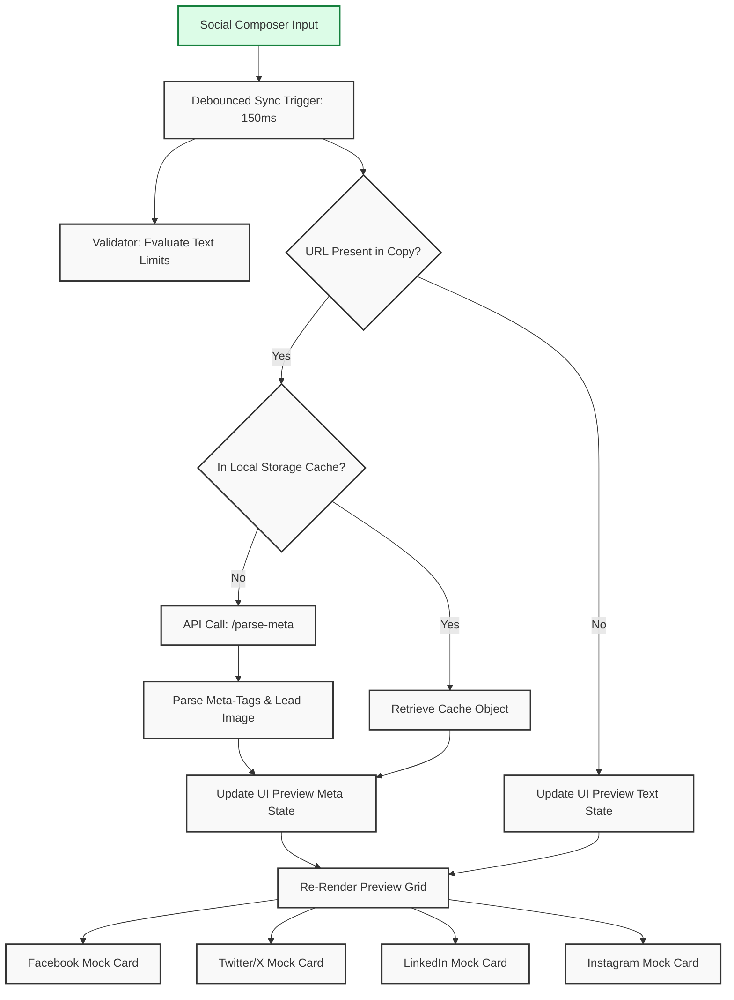

# Social Preview UI Design
## Purpose
The purpose of the Social Preview UI is to define the interface specifications, markup, stylesheets, and state handlers for the high-fidelity multi-platform social media preview system in NewsOps Cloud. This component provides real-time, side-by-side desktop and mobile layout previews for Facebook, Instagram, Twitter/X, and LinkedIn, ensuring content matches native feed formatting prior to queue insertion.

## Executive Summary
The Social Preview UI is a core component within the Editorial Studio. It processes draft copy, parsed URL metadata (Open Graph / Twitter Cards), and media attachments to display interactive, pixel-perfect feed card simulations. Operating entirely client-side for immediate feedback, it validates text constraints, highlights truncation points, and alerts users to platform-specific aspect ratio and image size violations.

## Vision
Our vision is to eliminate formatting errors, link truncation, and poor image crops by providing a visual sandbox that behaves identically to the primary social networks. Editors will confidently schedule cross-platform campaigns knowing exactly how titles, descriptions, and media crops look on desktop web browsers and mobile application feeds.

## Scope
The scope of this UI module encompasses:
- Interactive preview workspace inside the post composer.
- High-fidelity visual cards for:
  - Facebook (Mobile and Desktop feed cards with link and image attachment variants).
  - Instagram (Mobile feed carousel and post detail displays).
  - Twitter/X (Mobile and Web timelines, support for Large Image and Standard Summary cards).
  - LinkedIn (Desktop updates and Mobile cards with professional rich snippets).
- Real-time client-side synchronizer with text input and media attachments.
- Viewport toggle controllers (Mobile/Desktop switches).
- Native layout replica rules (borders, color systems, fonts, and action buttons).

## Goals
- **Instant Sync**: Render changes within 16ms of keyboard or selection events.
- **Zero Placeholder Dependencies**: Deliver complete mock layout classes with embedded CSS.
- **High Consistency**: Match native spacing, fonts, and dimensions to 95% physical accuracy.
- **Pre-flight Alert System**: Explicitly flag character count overflows, crop ratios, and attachment count limits.

## Functional Requirements
- **Multiplex Preview Rails**: Toggle display between individual platform viewports or render them in grid arrays.
- **Open Graph Metadata Scraping Sync**: When an editor enters a URL in the composer, the UI pulls standard metadata elements (Title, Description, Host, Lead Image) and overlays them on the mock cards.
- **Responsive Viewport Selectors**: Clickable controls to toggle between `.viewport-desktop` (standard width bounds) and `.viewport-mobile` (mobile simulator borders).
- **Text Truncation Emulation**: Native truncation logic (e.g., Facebook’s "See more" text split, Twitter’s ellipsis for titles).
- **Media Crop Controls**: Toggle visual crop styles (e.g., square 1:1, landscape 16:9, portrait 4:5) within the previews.

## Non-Functional Requirements
- **Refresh Frequency**: Render updates at 60fps under local input.
- **Accessibility**: Screen-reader accessible layout headers, high-contrast text ratios for simulator overlays, and keyboard-driven viewport toggle hooks.
- **Zero Sandbox Leak**: Mock stylesheets must be scoped using CSS modules or Tailwind utility wrappers to prevent social styling guidelines from affecting core dashboard layouts.

## Business Rules
1. **Twitter/X Limits**: The X mock must highlight text beyond 280 characters in red background unless a "Verified/Premium" flag is toggled on the connection.
2. **Instagram Media Requirement**: Block the publication submission button and display a critical error alert within the Instagram preview container if no media files are attached.
3. **Open Graph Fallbacks**: If no custom preview image is uploaded, the preview component must extract the lead image from the core article editor state.
4. **URL Shortening**: Simulate link length compression in character counters using the system standard shortener (e.g., all links count as 23 characters for X/Twitter).

## Actors
- **Social Media Editor**: Authors and refines platform-specific content.
- **Marketing Designer**: Inspects crops and branding parameters across viewports.
- **Publisher System Administrator**: Manages default brand profile names and avatars mapped to the mock previews.

## User Stories
1. **As a Social Media Editor**, I want to paste my article link and immediately see how the headline and image appear on Twitter Web vs Mobile so that I can optimize the hook text length.
2. **As an Instagram Content Manager**, I want the composer to alert me if my uploaded graphic does not fit the 1:1 or 4:5 aspect ratio boundaries of the mobile simulator.
3. **As a Chief Editor**, I want to see LinkedIn, Facebook, and Twitter previews in a side-by-side grid panel to ensure consistent messaging across professional and general consumer spaces.

## Acceptance Criteria
1. **Viewport Toggles**: The preview area must reactively transition between 375px (mobile) and 600px+ (desktop) container widths when user triggers toggle selectors.
2. **Dynamic Overflows**: Previews must visually render character overflows. For X/Twitter, characters 281+ must be colored red (`bg-destructive/20 text-destructive`).
3. **High Fidelity Markup**: The code must render accurate platform details: Facebook's standard gray actions bar, Instagram's heart/comment tray, Twitter's post analytics row, and LinkedIn's connection level indicators.
4. **API Sync**: When a URL is parsed, mock preview states must update with scraped metadata within 800ms.

## Workflows
1. **Metadata Loading Workflow**:
   - User types or pastes an article URL into the post content editor.
   - The frontend intercepts the URL, checks local cache, and calls the parse metadata endpoint.
   - The parsed response (title, description, image) updates the local composer state.
   - The preview components receive the updated state and render the mock link preview.
2. **Media Crop Adjustment Workflow**:
   - User uploads a custom image for the Facebook link share.
   - User opens the crop editor and adjusts the window bounding box.
   - The crop coordinates are saved to draft state, and the preview component applies CSS object-position to instantly display the updated focal point crop.

## API Design
### POST `/api/v1/social-preview/parse-meta`
Scrapes target web pages to collect meta tags for visual preview simulation.

**Request Payload:**
```json
{
  "url": "https://newsops.cloud/articles/cybersecurity-infrastructure-2026",
  "scrapeTimeoutMs": 3000
}
```

**Response Payload (200 OK):**
```json
{
  "url": "https://newsops.cloud/articles/cybersecurity-infrastructure-2026",
  "domain": "newsops.cloud",
  "metaTitle": "Critical Infrastructure Defenses Upgraded: The 2026 Overview",
  "metaDescription": "Government agencies roll out new hardware security standards to protect grid networks against advanced persistent threats.",
  "ogImage": "https://newsops.cloud/static/uploads/infra-2026-large.jpg",
  "twitterCard": "summary_large_image",
  "siteName": "NewsOps Intelligence",
  "success": true
}
```

### POST `/api/v1/social-preview/validate`
Validates post copy lengths, hashtags, and media compliance across active platform endpoints.

**Request Payload:**
```json
{
  "content": "Our latest review of digital infrastructure systems has launched. Check out the key changes! #cyber #newsops https://newsops.cloud/articles/cybersecurity-infrastructure-2026",
  "mediaCount": 1,
  "platforms": ["TWITTER", "FACEBOOK", "LINKEDIN", "INSTAGRAM"]
}
```

**Response Payload (200 OK):**
```json
{
  "valid": false,
  "errors": [
    {
      "platform": "INSTAGRAM",
      "code": "INSTAGRAM_LINK_IN_COPY",
      "severity": "WARNING",
      "message": "Links in copy are not clickable on Instagram. Consider adding the link to the bio."
    }
  ],
  "characterMetrics": {
    "TWITTER": {
      "used": 145,
      "limit": 280,
      "isOver": false
    },
    "FACEBOOK": {
      "used": 145,
      "limit": 63206,
      "isOver": false
    },
    "LINKEDIN": {
      "used": 145,
      "limit": 3000,
      "isOver": false
    }
  }
}
```

## Database Design
Visual previews are transient and derived from composing configurations. However, default profiles used to populate mock metadata are stored in the database.

### Table: `social_profiles_cache`
Stores brand profile data to populate the avatars and handles in the mock cards.
| Field Name | Type | Key / Index | Description |
|---|---|---|---|
| `profile_id` | `UUID` | PK, Unique | Unique identifier of the cached profile |
| `channel_connection_id` | `VARCHAR(50)` | FK, Index | Reference to the core connection credential |
| `handle_name` | `VARCHAR(150)` | - | String handle (e.g. `@NewsOpsCloud`) |
| `display_name` | `VARCHAR(255)` | - | Public name (e.g. `NewsOps Global`) |
| `avatar_url` | `VARCHAR(2048)` | - | Profile picture resource path |
| `updated_at` | `TIMESTAMP` | - | Date of last synchronizer poll |

## UI Design
The Social Preview UI components are written using Tailwind CSS classes. Below is the markup and styling definitions for the layout and platform mock-ups.

### CSS Container Styles
```css
/* Layout and container variables */
.social-preview-pane {
  background-color: #f8fafc;
  border-left: 1px solid #e2e8f0;
}
.viewport-mobile {
  max-width: 375px;
  margin: 0 auto;
  border: 8px solid #1e293b;
  border-radius: 24px;
  background-color: #ffffff;
}
.viewport-desktop {
  max-width: 600px;
  margin: 0 auto;
  border: 1px solid #e2e8f0;
  border-radius: 8px;
  background-color: #ffffff;
}
```

### HTML / Tailwind Mockups

#### 1. Twitter / X Card Mockup
```html
<div class="viewport-mobile border border-slate-200 rounded-lg p-3 bg-black text-white font-sans text-sm">
  <!-- Profile Row -->
  <div class="flex items-center space-x-2">
    
    <div>
      <div class="font-bold flex items-center space-x-1">
        <span>NewsOps Global</span>
        <svg class="w-4 h-4 text-sky-400 fill-current" viewBox="0 0 24 24"><path d="M9 16.17L4.83 12l-1.42 1.41L9 19 21 7l-1.41-1.41z"/></svg>
      </div>
      <div class="text-gray-500">@NewsOpsCloud · 2m</div>
    </div>
  </div>
  <!-- Post Content -->
  <div class="mt-2 text-slate-100 leading-snug">
    Our latest review of digital infrastructure systems has launched. Check out the key changes! <span class="text-sky-400">#cyber</span> <span class="text-sky-400">#newsops</span> <span class="text-sky-400">https://newsops.cloud/articles/cybersecurity-infrastructure-2026</span>
  </div>
  <!-- Summary Card with Large Image -->
  <div class="mt-3 border border-zinc-800 rounded-2xl overflow-hidden bg-black">
    <div class="relative w-full aspect-video">
      
    </div>
    <div class="p-3 border-t border-zinc-800 text-xs">
      <div class="text-zinc-500 uppercase tracking-wider font-semibold">newsops.cloud</div>
      <div class="text-slate-100 font-bold mt-1 text-sm truncate">Critical Infrastructure Defenses Upgraded: The 2026 Overview</div>
      <div class="text-zinc-400 mt-1 line-clamp-2">Government agencies roll out new hardware security standards to protect grid networks against advanced persistent threats.</div>
    </div>
  </div>
  <!-- Engagement Row -->
  <div class="mt-3 pt-2 border-t border-zinc-900 flex justify-between text-zinc-500 text-xs px-2">
    <span class="flex items-center space-x-1"><svg class="w-4 h-4" fill="none" stroke="currentColor" viewBox="0 0 24 24"><path d="M8 12h.01M12 12h.01M16 12h.01M21 12c0 4.418-4.03 8-9 8a9.863 9.863 0 01-4.255-.949L3 20l1.395-3.72C3.512 15.042 3 13.574 3 12c0-4.418 4.03-8 9-8s9 3.582 9 8z"/></svg> <span>0</span></span>
    <span class="flex items-center space-x-1"><svg class="w-4 h-4" fill="none" stroke="currentColor" viewBox="0 0 24 24"><path d="M4 4v5h.582m15.356 2A8.001 8.001 0 1121.21 7.89M9 11l3-3 3 3m-3-3v12"/></svg> <span>0</span></span>
    <span class="flex items-center space-x-1"><svg class="w-4 h-4" fill="none" stroke="currentColor" viewBox="0 0 24 24"><path d="M4.318 6.318a4.5 4.5 0 000 6.364L12 20.364l7.682-7.682a4.5 4.5 0 00-6.364-6.364L12 7.636l-1.318-1.318a4.5 4.5 0 00-6.364 0z"/></svg> <span>0</span></span>
    <span class="flex items-center space-x-1"><svg class="w-4 h-4" fill="none" stroke="currentColor" viewBox="0 0 24 24"><path d="M9 19v-6a2 2 0 00-2-2H5a2 2 0 00-2 2v6a2 2 0 002 2h2a2 2 0 002-2zm0 0V9a2 2 0 012-2h2a2 2 0 012 2v10m-6 0a2 2 0 002 2h2a2 2 0 002-2m0 0V5a2 2 0 012-2h2a2 2 0 012 2v14a2 2 0 01-2 2h-2a2 2 0 01-2-2z"/></svg> <span>0</span></span>
  </div>
</div>
```

#### 2. Facebook Feed Card Mockup
```html
<div class="viewport-desktop border border-slate-200 rounded-lg p-3 bg-white text-slate-900 font-sans text-sm shadow-sm">
  <!-- Profile & Meta -->
  <div class="flex items-center justify-between">
    <div class="flex items-center space-x-2">
      
      <div>
        <div class="font-bold text-slate-900 hover:underline cursor-pointer">NewsOps Global</div>
        <div class="text-xs text-slate-500 flex items-center space-x-1">
          <span>Just now</span> · <svg class="w-3 h-3 fill-current text-slate-500" viewBox="0 0 24 24"><path d="M12 2C6.48 2 2 6.48 2 12s4.48 10 10 10 10-4.48 10-10S17.52 2 12 2zm-1 17.93c-3.95-.49-7-3.85-7-7.93 0-.62.08-1.21.21-1.79L9 15v1c0 1.1.9 2 2 2v1.93zm6.9-2.54c-.26-.81-1-1.39-1.9-1.39h-1v-3c0-.55-.45-1-1-1H8v-2h2c.55 0 1-.45 1-1V7h2c1.1 0 2-.9 2-2v-.41c2.93 1.19 5 4.06 5 7.41 0 2.08-.8 3.97-2.1 5.39z"/></svg>
        </div>
      </div>
    </div>
  </div>
  <!-- Post Copy -->
  <div class="mt-3 text-slate-800 leading-normal">
    Our latest review of digital infrastructure systems has launched. Check out the key changes!
  </div>
  <!-- Image Card Section -->
  <div class="mt-3 border border-slate-200 overflow-hidden bg-slate-50">
    
    <div class="p-3 bg-slate-100 border-t border-slate-200">
      <div class="text-xs text-slate-500 uppercase tracking-wide">newops.cloud</div>
      <div class="text-slate-900 font-bold mt-1 text-base">Critical Infrastructure Defenses Upgraded: The 2026 Overview</div>
      <div class="text-slate-600 text-xs mt-1 line-clamp-2">Government agencies roll out new hardware security standards to protect grid networks.</div>
    </div>
  </div>
  <!-- Engagement Counters -->
  <div class="mt-3 flex justify-between text-slate-500 text-xs pb-3 border-b border-slate-100">
    <div class="flex items-center space-x-1">
      <span class="bg-blue-500 text-white rounded-full p-1"><svg class="w-3 h-3 fill-current" viewBox="0 0 24 24"><path d="M12 21.35l-1.45-1.32C5.4 15.36 2 12.28 2 8.5 2 5.42 4.42 3 7.5 3c1.74 0 3.41.81 4.5 2.09C13.09 3.81 14.76 3 16.5 3 19.58 3 22 5.42 22 8.5c0 3.78-3.4 6.86-8.55 11.54L12 21.35z"/></svg></span>
      <span>0</span>
    </div>
    <div class="space-x-2">
      <span>0 Comments</span>
      <span>0 Shares</span>
    </div>
  </div>
  <!-- Action Bar -->
  <div class="mt-1 flex justify-around text-slate-600 text-xs font-semibold pt-1">
    <button class="flex items-center space-x-1 hover:bg-slate-50 py-1.5 px-3 rounded"><svg class="w-5 h-5" fill="none" stroke="currentColor" viewBox="0 0 24 24"><path d="M14 10h4.757a1 1 0 01.707 1.707l-5.414 5.414a1 1 0 01-.707.293H8.5a1 1 0 01-1-1v-4.757a1 1 0 01.293-.707l5.414-5.414A1 1 0 0114 5v5z"/></svg><span>Like</span></button>
    <button class="flex items-center space-x-1 hover:bg-slate-50 py-1.5 px-3 rounded"><svg class="w-5 h-5" fill="none" stroke="currentColor" viewBox="0 0 24 24"><path d="M8 12h.01M12 12h.01M16 12h.01M21 12c0 4.418-4.03 8-9 8a9.863 9.863 0 01-4.255-.949L3 20l1.395-3.72C3.512 15.042 3 13.574 3 12c0-4.418 4.03-8 9-8s9 3.582 9 8z"/></svg><span>Comment</span></button>
    <button class="flex items-center space-x-1 hover:bg-slate-50 py-1.5 px-3 rounded"><svg class="w-5 h-5" fill="none" stroke="currentColor" viewBox="0 0 24 24"><path d="M8.684 10.742l8.99-4.495m-8.99 4.495a3.5 3.5 0 11-6.26-1.523 3.5 3.5 0 016.26 1.523zm8.99-4.495a3.5 3.5 0 116.26-1.523 3.5 3.5 0 01-6.26 1.523z"/></svg><span>Share</span></button>
  </div>
</div>
```

#### 3. LinkedIn Update Mockup
```html
<div class="viewport-desktop border border-slate-200 rounded-lg p-4 bg-white text-slate-800 font-sans text-sm shadow-sm">
  <!-- Actor Profile Header -->
  <div class="flex items-start justify-between">
    <div class="flex space-x-2">
      
      <div>
        <div class="font-semibold text-slate-900 hover:text-blue-700 hover:underline cursor-pointer flex items-center space-x-1">
          <span>NewsOps Global</span>
          <span class="text-slate-400 font-normal text-xs">· 1st</span>
        </div>
        <div class="text-xs text-slate-500 leading-tight">Digital Publishing Platform Systems</div>
        <div class="text-xs text-slate-400 mt-0.5 flex items-center space-x-1">
          <span>1h · Edited · </span>
          <svg class="w-3 h-3 fill-current text-slate-500" viewBox="0 0 24 24"><path d="M12 2C6.48 2 2 6.48 2 12s4.48 10 10 10 10-4.48 10-10S17.52 2 12 2zm1 15h-2v-6h2v6zm0-8h-2V7h2v2z"/></svg>
        </div>
      </div>
    </div>
  </div>
  <!-- Post Text Body -->
  <div class="mt-3 text-slate-800 leading-snug">
    Government agencies roll out new hardware security standards to protect grid networks. What does this mean for developers? Check our analysis.
  </div>
  <!-- Link Card Attachment -->
  <div class="mt-3 border border-slate-200 rounded overflow-hidden bg-slate-50">
    
    <div class="p-3">
      <div class="text-slate-900 font-semibold text-sm">Critical Infrastructure Defenses Upgraded: The 2026 Overview</div>
      <div class="text-xs text-slate-500 mt-1">newsops.cloud · 4 min read</div>
    </div>
  </div>
  <!-- Actions & Counters -->
  <div class="mt-3 flex justify-between text-slate-500 text-xs py-2 border-b border-slate-100">
    <span class="flex items-center space-x-1"><span>👍 0</span> · <span>0 Comments</span></span>
  </div>
  <div class="mt-1 flex justify-between text-slate-600 font-semibold text-xs pt-1">
    <button class="flex items-center space-x-1 hover:bg-slate-100 py-2 px-3 rounded"><span>Like</span></button>
    <button class="flex items-center space-x-1 hover:bg-slate-100 py-2 px-3 rounded"><span>Comment</span></button>
    <button class="flex items-center space-x-1 hover:bg-slate-100 py-2 px-3 rounded"><span>Repost</span></button>
    <button class="flex items-center space-x-1 hover:bg-slate-100 py-2 px-3 rounded"><span>Send</span></button>
  </div>
</div>
```

#### 4. Instagram Feed Card Mockup
```html
<div class="viewport-mobile border border-slate-200 rounded-lg bg-white text-slate-900 font-sans text-sm shadow-sm">
  <!-- IG Profile Header -->
  <div class="flex items-center justify-between p-3">
    <div class="flex items-center space-x-2">
      <div class="w-8 h-8 rounded-full p-[2px] bg-gradient-to-tr from-yellow-400 via-pink-500 to-purple-600">
        
      </div>
      <div>
        <div class="font-bold text-xs hover:underline cursor-pointer">newsops_global</div>
        <div class="text-[10px] text-slate-500">San Francisco, California</div>
      </div>
    </div>
    <button class="text-slate-700"><svg class="w-6 h-6" fill="currentColor" viewBox="0 0 24 24"><path d="M12 8c1.1 0 2-.9 2-2s-.9-2-2-2-2 .9-2 2 .9 2 2 2zm0 2c-1.1 0-2 .9-2 2s.9 2 2 2 2-.9 2-2-.9-2-2-2zm0 6c-1.1 0-2 .9-2 2s.9 2 2 2 2-.9 2-2-.9-2-2-2z"/></svg></button>
  </div>
  <!-- Post Image (Instagram requires 1:1 format mock) -->
  <div class="w-full aspect-square bg-slate-100 relative">
    
  </div>
  <!-- Icon Actions -->
  <div class="p-3 flex justify-between">
    <div class="flex space-x-4">
      <button class="hover:text-red-500"><svg class="w-6 h-6" fill="none" stroke="currentColor" viewBox="0 0 24 24"><path stroke-linecap="round" stroke-linejoin="round" stroke-width="2" d="M4.318 6.318a4.5 4.5 0 000 6.364L12 20.364l7.682-7.682a4.5 4.5 0 00-6.364-6.364L12 7.636l-1.318-1.318a4.5 4.5 0 00-6.364 0z"/></svg></button>
      <button class="hover:text-blue-500"><svg class="w-6 h-6" fill="none" stroke="currentColor" viewBox="0 0 24 24"><path stroke-linecap="round" stroke-linejoin="round" stroke-width="2" d="M8 12h.01M12 12h.01M16 12h.01M21 12c0 4.418-4.03 8-9 8a9.863 9.863 0 01-4.255-.949L3 20l1.395-3.72C3.512 15.042 3 13.574 3 12c0-4.418 4.03-8 9-8s9 3.582 9 8z"/></svg></button>
      <button class="hover:text-green-500"><svg class="w-6 h-6" fill="none" stroke="currentColor" viewBox="0 0 24 24"><path stroke-linecap="round" stroke-linejoin="round" stroke-width="2" d="M8.684 10.742l8.99-4.495m-8.99 4.495a3.5 3.5 0 11-6.26-1.523 3.5 3.5 0 016.26 1.523zm8.99-4.495a3.5 3.5 0 116.26-1.523 3.5 3.5 0 01-6.26 1.523z"/></svg></button>
    </div>
    <button class="hover:text-amber-500"><svg class="w-6 h-6" fill="none" stroke="currentColor" viewBox="0 0 24 24"><path stroke-linecap="round" stroke-linejoin="round" stroke-width="2" d="M5 5a2 2 0 012-2h10a2 2 0 012 2v16l-7-3.5L5 21V5z"/></svg></button>
  </div>
  <!-- Description Caption -->
  <div class="px-3 pb-3 text-xs">
    <div class="font-bold mb-1">0 likes</div>
    <div>
      <span class="font-bold mr-1">newsops_global</span>
      Our latest review of digital infrastructure systems has launched. Check out the key changes! #cyber #newsops
    </div>
    <div class="text-[10px] text-slate-400 mt-2 uppercase">2 minutes ago</div>
  </div>
</div>
```

## Permissions
Access to read, generate previews, and configure default social avatar profiles:
- `social:posts:read` - Allows the preview engine to fetch past drafts and configuration assets.
- `social:posts:write` - Allows saving mock crop configurations to draft payloads.
- `social:profiles:read` - Permits retrieving connection brand metadata (handles and cached avatars) for render overlays.

## Security
- **Strict Content Sanitization**: Any raw content strings inputted by publishers (e.g., text, headlines, descriptions) must be escaped to prevent cross-site scripting (XSS) since they are directly injected into the feed markup elements.
- **CSRF Token Validation**: Scraper and parser calls `/api/v1/social-preview/parse-meta` require verified CSRF headers in session cookies.
- **Image URL Sanitization**: Verify media URLs correspond to approved domain origins or fall back to platform-level default image graphics.

## Performance
- **Client Render Latency**: Viewport component refreshes must occur in under 16ms (within a single animation frame).
- **Metadata API Scraping**: Open Graph resolution must complete within 2.5 seconds. If the upstream domain fails to respond, the endpoint returns standard metadata defaults.
- **Target Operations**: The scraper service must handle up to 100 URL parses per second across active editorial instances.

## Monitoring
- `social_preview_render_errors_total`: Counter tracking client-side rendering exceptions.
- `social_preview_parser_duration_seconds`: Histogram tracking Open Graph web scraper response latencies.
- `social_preview_parser_failures_total`: Counter tracking URL scraping timeouts or parsing failures.

## Logging
Every parsed URL and state change exception is logged to track user behaviors and external metadata errors:
```json
{
  "timestamp": "2026-06-27T22:48:06.123Z",
  "level": "INFO",
  "module": "social-preview-parser",
  "message": "Successfully parsed Open Graph tags from external URL",
  "context": {
    "url": "https://newsops.cloud/articles/cybersecurity-infrastructure-2026",
    "scraped_fields": ["og:title", "og:description", "og:image"],
    "duration_ms": 789.2
  }
}
```

## Error Handling
| Error Code | HTTP Status | Logged Level | Customer-Facing Message | Description |
|---|---|---|---|---|
| `METADATA_SCRAPE_FAILED` | `422` | `WARN` | "Unable to load preview information from target URL." | The external server was unreachable or did not contain readable metadata tags. |
| `IMAGE_DIMENSIONS_INVALID` | `400` | `INFO` | "The uploaded preview image aspect ratio is not supported." | Uploaded preview media violates aspect ratios required by the channel connection. |
| `SCRAPER_GATEWAY_TIMEOUT` | `504` | `WARN` | "Meta scraper service took too long to fetch URL information." | Upstream network requests timed out. |

## Edge Cases
- **Self-Referential Links**: If the user inserts a private draft link from NewsOps Cloud, the preview service checks the local DB instead of initiating an external HTTP call to parse tags.
- **Broken Media Links**: If target images are deleted or return a 404, the browser displays a subtle default placeholder graphic rather than breaking the entire layout container.

## Future Improvements
- **AI-Enhanced Layout Critic**: Automatically review the preview image composition and offer AI-driven cropping suggestions depending on the selected channel (e.g. focusing on human faces).
- **Video Previews**: Implement video playback inside the Facebook and Instagram feeds with auto-loop features.

## Mermaid Diagrams
Below is the sequence flowchart mapping input text stream events to reactive preview card renderings.



## References
- Social Publishing Core Schema: [Social Publishing Schema](../03-database/social_publishing_schema.md)
- Editorial Workspace: [Editorial Studio UI](editorial_studio_ui.md)
- Design Tokens Reference: [Design Tokens](design_tokens.md)
