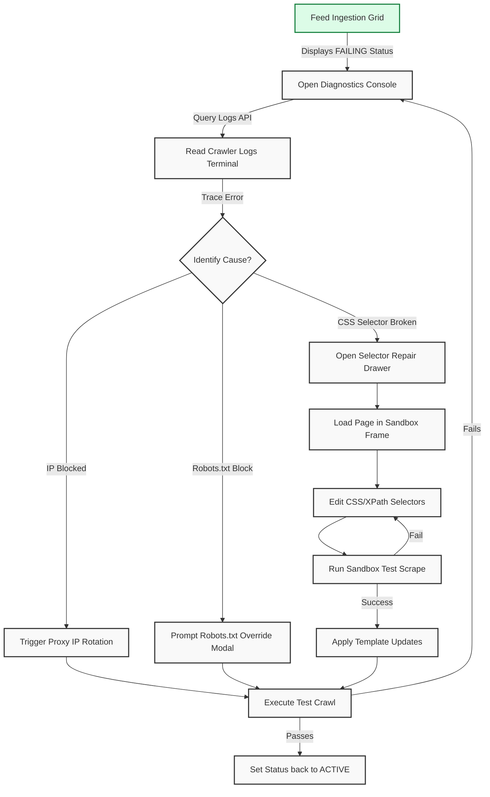

# Source Manager UI Design
## Purpose
The purpose of the Source Manager UI is to define the interface layout specifications, interactive components, responsive CSS frameworks, and state lifecycle controls for the Source Management dashboard in NewsOps Cloud. This screen acts as the control panel for managing RSS/Atom monitors, auditing headless browser web crawlers, and resolving content validation anomalies.

## Executive Summary
The Source Manager UI aggregates news ingestion interfaces into a single workspace. It features:
- **Feed Ingestion Cards**: High-visibility grids showcasing active RSS monitors, subscription parameters, sync status indicators, and frequency settings.
- **Crawler Diagnostic Logs**: A high-speed, filterable terminal shell component displaying live browser outputs, network logs, and selector exceptions.
- **Validation Metrics Dashboard**: Visual panels tracking extraction rates, selector matches, robots.txt blocks, and proxy health ratings.

## Vision
Our vision is to provide content operators with a self-healing diagnostic command center. By overlaying selector success rates, live log traces, and sandbox test frameworks, the system enables publishers to correct broken website templates and proxy blocks in under a minute without engineering support.

## Scope
The scope of this UI specification includes:
- **Feed Card Collection Grid**: Status counters, category groupings, last-crawled metrics, and quick-toggle options.
- **Crawler Log Shell Terminal**: High-performance log scrolling, severity level filtering (INFO, WARN, ERROR), search query matches, and metadata inspectors.
- **Validation Metrics Panels**: Interactive charts showing parsing success ratios, cloudflare trigger blocks, and latency metrics.
- **Selector Sandbox Sandbox Overlay**: A side-by-side editing panel to test and adjust CSS/XPath selectors against raw webpage nodes.

## Goals
- **Sub-Second Logs Streaming**: Socket-connected log outputs rendering under 100ms latency.
- **Instant Diagnostics**: Visually flag which specific CSS selector (e.g. `bodySelector`) failed during extraction.
- **Zero DOM Freeze**: Maintain 60 FPS scrolling on log terminals containing up to 10,000 active entries.
- **High Readability**: Display indicators with stark contrast, matching state changes reactively.

## Functional Requirements
- **Interactive Feed Cards**: Grid elements displaying feed URLs, category tags, sync logs, and a "Run Now" action button.
- **Real-Time Level Filters**: Sticky header button menus to toggle terminal logs between Info, Warning, and Critical.
- **Live Terminal Autoscroll**: Switch to toggle autoscroll on/off to let engineers inspect static trace stacks.
- **Validation Summary Gauges**: Visual charts mapping extraction scores, proxy counts, and error groups.
- **Inline Selector Repair Form**: Quick edit drawer that accepts new selectors, runs them in the sandbox, and updates templates.

## Non-Functional Requirements
- **Terminal Performance**: Use virtualized rendering (e.g., react-window) to load extensive log list blocks.
- **Visual Contrast**: Colors matching terminal specifications (slate background, bright green success tags, warning orange status labels).
- **Responsive Wrappers**: Grids and tables adjusting down to mobile viewports for on-the-go editor access.

## Business Rules
1. **Scope Controls**: Modifying RSS URLs or updating crawler template selectors is restricted to users with `crawler:templates:write` permission.
2. **Robots Compliance Rules**: Disabling the robots.txt compliance flag on a source must prompt a confirmation window demanding a signed compliance override explanation.
3. **Log Window Bounds**: The dynamic log window limits historical scrolling queries to 2,000 records unless a custom range search is applied.

## Actors
- **Content Operator**: Adjusts feed timings, adds new RSS wires, monitors crawl errors.
- **System Engineer**: Scrutinizes proxy IPs, resolves web scraper blockages, reviews terminal logs.
- **Newsroom Administrator**: Approves robots.txt overrides and adjusts ingestion limits.

## User Stories
1. **As a Content Operator**, I want to look at the RSS Feed Grid so that I can instantly verify if any major wire sources are showing sync failures.
2. **As a System Engineer**, I want to filter the log terminal by "ERROR" and domain name so that I can see the raw traceback for a failing scraper script.
3. **As a Content Operator**, I want to see a chart of validation success metrics over time to understand if a publisher's site update has broken our headline parser.

## Acceptance Criteria
1. **Feed Health Statuses**: Feed cards must display status chips using Tailwind color classes: emerald-green for ACTIVE, amber-yellow for PAUSED, and pulsing-red for FAILING.
2. **Log Streaming Speed**: The terminal component must load socket streams at up to 100 entries/sec without freezing scroll controllers.
3. **Accuracy Indicators**: Accuracy rates must color-code dynamically: green (95%+), yellow (85-94%), and red (under 85%).
4. **Sandbox Preview**: The selector repair drawer must display the parsed output values alongside selectors before updating database configurations.

## Workflows
1. **Selector Repair Workflow**:
   - Content Operator receives a validation alert: `nytimes.com` extraction success dropped below 80%.
   - User opens the **Source Manager UI** and navigates to the NYT crawler card.
   - User opens the **Crawler Diagnostic Logs** and filters by `ERROR`.
   - The log highlights: `SelectorMismatch: authorSelector returned null`.
   - User opens the **Inline Selector Repair Form**.
   - The UI loads a mock template editor alongside the target webpage elements.
   - User clicks the author element on the webpage preview; the UI auto-suggests `div.author-meta-name`.
   - User clicks "Test Selector" and the parsed value "Sarah Jenkins" mounts on the screen.
   - User clicks "Apply Template Updates".
   - The UI saves settings, wipes old caches, and triggers an immediate test crawl.

## API Design
### GET `/api/v1/source-manager/feeds`
Returns a list of monitored RSS/Atom sources.

**Response Payload (200 OK):**
```json
{
  "feeds": [
    {
      "id": "fed_99182a01",
      "name": "Associated Press - Technology",
      "url": "https://apnews.com/tech-rss.xml",
      "status": "ACTIVE",
      "lastSyncedAt": "2026-06-27T22:40:00.000Z",
      "successRateRate": 99.8,
      "syncFrequencyMinutes": 15
    },
    {
      "id": "fed_77189102",
      "name": "Dynamic News - Markets",
      "url": "https://www.dynamicnews.com/markets.xml",
      "status": "FAILING",
      "lastSyncedAt": "2026-06-27T22:00:00.000Z",
      "successRateRate": 74.2,
      "syncFrequencyMinutes": 10
    }
  ]
}
```

### GET `/api/v1/source-manager/crawler/logs`
Returns diagnostic logs filtered by level or domain.

**Request Parameters:**
- `domain`: `dynamicnews.com`
- `level`: `ERROR`
- `limit`: `50`

**Response Payload (200 OK):**
```json
{
  "logs": [
    {
      "timestamp": "2026-06-27T22:18:30.405Z",
      "level": "ERROR",
      "domain": "dynamicnews.com",
      "jobId": "job_crawl_1a2b3c4d5e",
      "message": "SelectorMismatch: authorSelector returned null",
      "traceback": "Error: Element not found at selector path 'span.author-name > a'\n   at Page.evaluate (eval:12:44)\n   at Crawler.extractData (crawler.js:89:12)"
    }
  ]
}
```

### GET `/api/v1/source-manager/validation-metrics`
Returns parsing and scraping validation metrics.

**Response Payload (200 OK):**
```json
{
  "domain": "dynamicnews.com",
  "periodDays": 7,
  "metrics": {
    "totalCrawls": 1420,
    "successfulParses": 1150,
    "validationScore": 80.9,
    "cloudflareBlocks": 120,
    "timeoutErrors": 150
  }
}
```

## Database Design
The frontend pulls metrics and parameters defined across multiple news intelligence tables:
- `crawler_templates` (custom CSS and XPath mappings)
- `proxy_pool` (proxy latency and ban rates)
- `cookie_pool` (session profiles used in the sandboxes)

## UI Design
The layout uses a three-pane responsive layout built in Tailwind CSS.

### 1. Feed Card Ingestion Grid (HTML / Tailwind CSS)
```html
<div class="space-y-6">
  <!-- Section Header -->
  <div class="flex items-center justify-between">
    <div>
      <h2 class="text-xl font-bold text-slate-900">Feed Sources</h2>
      <p class="text-xs text-slate-500">Monitor active RSS updates and web crawling feeds.</p>
    </div>
    <button class="bg-indigo-600 hover:bg-indigo-700 text-white text-xs font-bold py-2 px-4 rounded transition">Add Feed Source</button>
  </div>

  <!-- Cards Grid -->
  <div class="grid grid-cols-1 md:grid-cols-2 lg:grid-cols-3 gap-6">
    
    <!-- Feed Card: Active -->
    <div class="border border-slate-200 rounded-xl bg-white p-5 hover:shadow-md transition flex flex-col justify-between">
      <div>
        <div class="flex items-center justify-between mb-3">
          <span class="bg-emerald-100 text-emerald-800 text-[10px] font-bold px-2 py-0.5 rounded-full flex items-center">
            <span class="w-1.5 h-1.5 rounded-full bg-emerald-500 mr-1.5"></span>Active
          </span>
          <span class="text-slate-400 text-xs font-mono">Sync: 15m</span>
        </div>
        <h3 class="font-bold text-slate-900 text-sm">Associated Press - Technology</h3>
        <p class="text-slate-400 text-[10px] truncate mt-1">https://apnews.com/tech-rss.xml</p>
        
        <div class="mt-4 space-y-1.5 text-xs text-slate-600">
          <div class="flex justify-between"><span>Success Rate:</span><span class="font-bold text-emerald-600">99.8%</span></div>
          <div class="flex justify-between"><span>Last Synced:</span><span class="font-medium">10 mins ago</span></div>
        </div>
      </div>
      <div class="mt-5 pt-3 border-t border-slate-100 flex justify-end space-x-2">
        <button class="bg-slate-50 hover:bg-slate-100 text-slate-700 text-xs font-bold py-1.5 px-3 rounded border border-slate-200 transition">Sync Now</button>
        <button class="bg-slate-50 hover:bg-slate-100 text-slate-700 text-xs font-bold py-1.5 px-3 rounded border border-slate-200 transition">Edit</button>
      </div>
    </div>

    <!-- Feed Card: Failing -->
    <div class="border border-red-200 rounded-xl bg-white p-5 hover:shadow-md transition flex flex-col justify-between">
      <div>
        <div class="flex items-center justify-between mb-3">
          <span class="bg-red-100 text-red-800 text-[10px] font-bold px-2 py-0.5 rounded-full flex items-center animate-pulse">
            <span class="w-1.5 h-1.5 rounded-full bg-red-500 mr-1.5"></span>Failing
          </span>
          <span class="text-slate-400 text-xs font-mono">Sync: 10m</span>
        </div>
        <h3 class="font-bold text-slate-900 text-sm">Dynamic News - Markets</h3>
        <p class="text-slate-400 text-[10px] truncate mt-1">https://www.dynamicnews.com/markets.xml</p>
        
        <div class="mt-4 space-y-1.5 text-xs text-slate-600">
          <div class="flex justify-between"><span>Success Rate:</span><span class="font-bold text-red-600">74.2%</span></div>
          <div class="flex justify-between"><span>Last Synced:</span><span class="font-medium">2 hours ago</span></div>
        </div>
      </div>
      <div class="mt-5 pt-3 border-t border-slate-100 flex justify-end space-x-2">
        <button class="bg-indigo-600 hover:bg-indigo-700 text-white text-xs font-bold py-1.5 px-3 rounded transition">Troubleshoot</button>
        <button class="bg-slate-50 hover:bg-slate-100 text-slate-700 text-xs font-bold py-1.5 px-3 rounded border border-slate-200 transition">Edit</button>
      </div>
    </div>

  </div>
</div>
```

### 2. Crawler Diagnostics Logs Panel (HTML / Tailwind CSS)
Below is the log-terminal design featuring custom scrolling content and highlighted tags.
```html
<div class="border border-slate-800 rounded-xl bg-slate-950 p-6 font-mono text-xs text-slate-200 shadow-xl">
  <!-- Terminal Top Nav -->
  <div class="flex items-center justify-between border-b border-slate-800 pb-4 mb-4">
    <div class="flex items-center space-x-2">
      <span class="w-3 h-3 rounded-full bg-red-500"></span>
      <span class="w-3 h-3 rounded-full bg-yellow-500"></span>
      <span class="w-3 h-3 rounded-full bg-green-500"></span>
      <span class="font-bold text-slate-400 ml-2">Crawler Diagnostic Console</span>
    </div>
    <!-- Terminal Filters -->
    <div class="flex space-x-2">
      <button class="bg-slate-800 hover:bg-slate-700 text-slate-300 px-2.5 py-1 rounded text-[10px] font-bold">INFO</button>
      <button class="bg-amber-600 text-white px-2.5 py-1 rounded text-[10px] font-bold">WARN</button>
      <button class="bg-red-600 text-white px-2.5 py-1 rounded text-[10px] font-bold">ERROR</button>
      <button class="bg-slate-900 border border-slate-800 text-slate-400 px-2.5 py-1 rounded text-[10px] font-semibold">Autoscroll: On</button>
    </div>
  </div>

  <!-- Terminal Display area -->
  <div class="h-64 overflow-y-auto space-y-2.5 pr-2 scrolling-touch">
    <div class="flex items-start space-x-2 leading-relaxed">
      <span class="text-slate-500 shrink-0">[22:18:01]</span>
      <span class="bg-slate-800 text-slate-300 px-1 py-0.25 rounded text-[9px] font-bold tracking-wide uppercase">INFO</span>
      <span class="text-slate-300">Target initialized: NYTimes Crawl Job (job_crawl_771a82)</span>
    </div>

    <div class="flex items-start space-x-2 leading-relaxed">
      <span class="text-slate-500 shrink-0">[22:18:02]</span>
      <span class="bg-emerald-900/60 text-emerald-300 px-1 py-0.25 rounded text-[9px] font-bold tracking-wide uppercase">INFO</span>
      <span class="text-slate-300">Robots.txt parsed successfully. Target path is allowed.</span>
    </div>

    <div class="flex items-start space-x-2 leading-relaxed">
      <span class="text-slate-500 shrink-0">[22:18:04]</span>
      <span class="bg-amber-900/60 text-amber-300 px-1 py-0.25 rounded text-[9px] font-bold tracking-wide uppercase">WARN</span>
      <span class="text-slate-300">Resource Interception: Blocked stylesheet fetch from third-party advertising server.</span>
    </div>

    <div class="flex items-start space-x-2 leading-relaxed">
      <span class="text-slate-500 shrink-0">[22:18:06]</span>
      <span class="bg-red-900/60 text-red-300 px-1 py-0.25 rounded text-[9px] font-bold tracking-wide uppercase">ERROR</span>
      <div class="text-rose-400 font-semibold">
        <span>SelectorMismatch Exception: titleSelector (h1.story-heading) returned empty string.</span>
        <pre class="mt-2 text-slate-500 font-mono text-[10px] bg-slate-900 p-2.5 rounded border border-slate-800 leading-tight">
Error: Extraction failure on nytimes.com
  at evaluateCSS (nytimes-scraper.js:45:12)
  at Page.runParsing (page-runner.js:109:4)
        </pre>
      </div>
    </div>
  </div>
</div>
```

### 3. Validation Metrics Dashboard (HTML / Tailwind CSS Grid)
```html
<div class="grid grid-cols-1 md:grid-cols-3 gap-6">
  
  <!-- Metric Box: Validation Success Rate -->
  <div class="border border-slate-200 rounded-xl bg-white p-5">
    <div class="flex items-center justify-between">
      <span class="text-xs font-bold text-slate-500 uppercase tracking-wider">Validation Accuracy</span>
      <span class="text-emerald-500 font-bold text-sm">Target: 95%</span>
    </div>
    <div class="mt-4 flex items-baseline justify-between">
      <div class="text-3xl font-extrabold text-slate-900">80.9%</div>
      <span class="text-xs text-red-600 font-semibold flex items-center">↓ 14.1% this week</span>
    </div>
    <!-- Progress Indicator Bar -->
    <div class="w-full bg-slate-100 rounded-full h-2 mt-4 overflow-hidden">
      <div class="bg-amber-500 h-2 rounded-full" style="width: 80.9%"></div>
    </div>
  </div>

  <!-- Metric Box: Proxy Rotation Rates -->
  <div class="border border-slate-200 rounded-xl bg-white p-5">
    <div class="flex items-center justify-between">
      <span class="text-xs font-bold text-slate-500 uppercase tracking-wider">Proxy Pool Performance</span>
      <span class="text-indigo-600 font-bold text-xs">Total IPs: 150</span>
    </div>
    <div class="mt-4 flex items-baseline justify-between">
      <div class="text-3xl font-extrabold text-slate-900">120 Banned</div>
      <span class="text-xs text-red-600 font-semibold">80% rate increase</span>
    </div>
    <div class="w-full bg-slate-100 rounded-full h-2 mt-4 overflow-hidden">
      <div class="bg-red-500 h-2 rounded-full" style="width: 80%"></div>
    </div>
  </div>

  <!-- Metric Box: Robots.txt Exclusions -->
  <div class="border border-slate-200 rounded-xl bg-white p-5">
    <div class="flex items-center justify-between">
      <span class="text-xs font-bold text-slate-500 uppercase tracking-wider">Compliance Exclusions</span>
      <span class="text-slate-400 font-bold text-xs">Active Blocks</span>
    </div>
    <div class="mt-4 flex items-baseline justify-between">
      <div class="text-3xl font-extrabold text-slate-900">12 Domains</div>
      <span class="text-xs text-slate-500 font-semibold">Stable standard</span>
    </div>
    <div class="w-full bg-slate-100 rounded-full h-2 mt-4 overflow-hidden">
      <div class="bg-slate-400 h-2 rounded-full" style="width: 40%"></div>
    </div>
  </div>

</div>
```

## Permissions
Access control gates assigned across system routes:
- `crawler:templates:read` - Views RSS configurations, logs streams, validation charts.
- `crawler:templates:write` - Edits CSS selectors, alters ingestion frequencies.
- `crawler:jobs:create` - Force immediate syncs, dispatch custom crawler testing.
- `crawler:proxies:manage` - Overrides robots rules, manages proxy configurations.

## Security
- **Cross-Origin Sandbox Checks**: Web pages loaded in the Selector Studio iframe must be sandboxed to prevent target domains from accessing system user cookies.
- **Log XSS Mitigations**: Convert all live logs strings to safe text before appending to DOM structures.
- **CSRF Token Injections**: Target actions `/api/v1/source-manager/crawler/jobs` require active headers validation.

## Performance
- **Terminal Rendering Limits**: Implements virtual scrolling rows to render log files up to 2MB in size without dashboard locks.
- **Socket Throttling**: The stream connection throttles outputs to maximum 20 frames/sec to prevent UI thread execution bottlenecks.

## Monitoring
- `source_manager_socket_connection_failures`: Counter tracking trace socket drop-outs.
- `source_manager_logs_load_time_ms`: Histogram tracking log query response times.
- `source_manager_metrics_refresh_errors`: Counter tracking dashboard metrics load failures.

## Logging
Security changes and repair logs stored to trace system updates:
```json
{
  "timestamp": "2026-06-27T22:48:06.912Z",
  "level": "INFO",
  "module": "source-manager-ui",
  "message": "User adjusted domain crawler CSS selectors",
  "context": {
    "domain": "nytimes.com",
    "user_id": "usr_77189102",
    "updated_fields": ["titleSelector", "authorSelector"]
  }
}
```

## Error Handling
| Error Code | HTTP Status | Logged Level | Customer-Facing Message | Description |
|---|---|---|---|---|
| `LOGS_ENDPOINT_TIMEOUT` | `504` | `WARN` | "Connection to diagnostic log backend timed out. Retrying..." | Upstream log database failed to respond. |
| `SELECTOR_SANDBOX_FAILED` | `422` | `INFO` | "Webpage rendering failed during sandbox test script." | Target page layout failed to mount in crawler sandbox. |
| `SOURCE_CONFLICT_ACTIVE` | `409` | `INFO` | "The selected RSS monitor is currently executing a sync." | Request to delete or adjust sync schedule was blocked by an active lock. |

## Edge Cases
- **Massive Stack Trace Influx**: If a scraper script crashes and yields thousands of errors in seconds, the socket server aggregates logs into batches, preventing the client's memory allocation limits from overflowing.
- **Dynamic CSS Obfuscation**: If target pages implement dynamic CSS class hashing daily, the UI alerts the user and suggests configuring partial CSS attribute matching rules.

## Future Improvements
- **Automated AI Repair**: Integrates AI selectors to suggest self-healing CSS selectors within the troubleshooting sidebar directly when accuracy scores drop.
- **Slack Alert Bridges**: Instantly alert content groups via webhook hooks when scraper validations fail consecutive runs.

## Mermaid Diagrams
Below is the flowchart mapping feed diagnosis, diagnostic troubleshooting, sandbox editing, and selector repairs.



## References
- Web Crawler Backend Specs: [Web Crawler Engine](../05-news-intelligence/web_crawler_engine.md)
- RSS Monitoring Ingest rules: [RSS Monitoring Engine](../05-news-intelligence/rss_monitoring_engine.md)
- Core System Architecture: [../02-architecture/system_architecture.md](../02-architecture/system_architecture.md)
- News Intelligence Schema Tables: [../03-database/news_intelligence_schema.md](../03-database/news_intelligence_schema.md)
